<!-- AUTO-GENERATED by tools/generate_index.py — DO NOT EDIT BY HAND. -->
<!-- Source of truth: YAML frontmatter in each day's README.md -->

# INDEX

**71 cases** · **135 actors/clusters** · **317 ATT&CK techniques** · **16 platforms** · **74 sectors** · 2026-04-28 -> 2026-07-07

> Visual gallery (filterable, light/dark): **[open the Pages site](./docs/index.html)**. Browse facets: [by actor](byActor/) · [by technique](byTechnique/) · [by platform](byPlatform/).

<!-- Auto-generated. Edit per-day frontmatter to change anything here. -->

---

## Recent

<table>
<tr>
<td align="center" valign="top" width="33%"><a href="days/2026/07/2026-07-07_KongTuke-Mistic-MTLBackdoor-IAB-ClickFix/">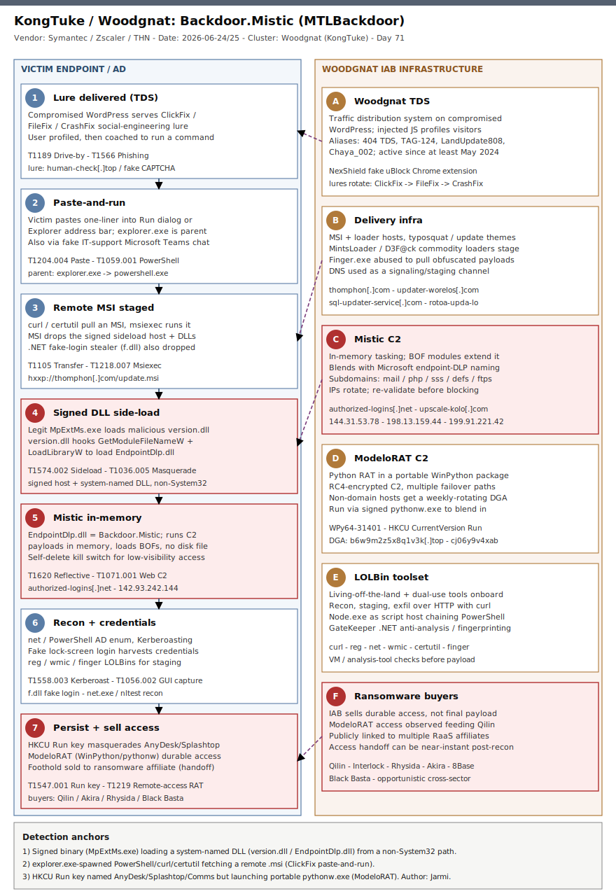</a> <b>2026-07-07</b> Woodgnat</td>
<td align="center" valign="top" width="33%"><a href="days/2026/07/2026-07-06_ToddyCat-Umbrij-STRD-OAuth-Gmail/">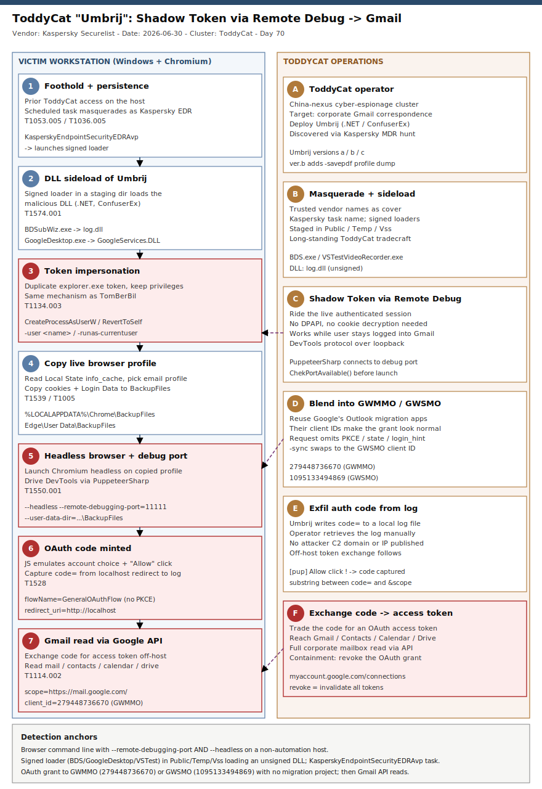</a> <b>2026-07-06</b> ToddyCat</td>
<td align="center" valign="top" width="33%"><a href="days/2026/07/2026-07-05_DCMTK-DICOM-Toolkit-PathTraversal-FileWrite-ICSMA-26-181-01/">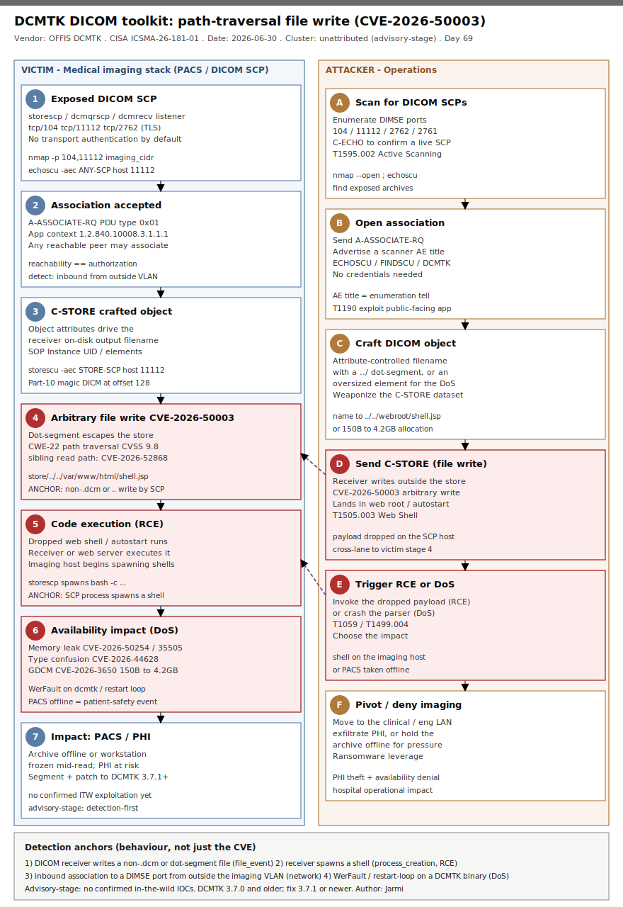</a> <b>2026-07-05</b> Opportunistic medical-imaging scanners</td>
</tr>
<tr>
<td align="center" valign="top" width="33%"><a href="days/2026/07/2026-07-04_FUXA-SCADA-HMI-PathNorm-AuthBypass-CVE-2026-13207/">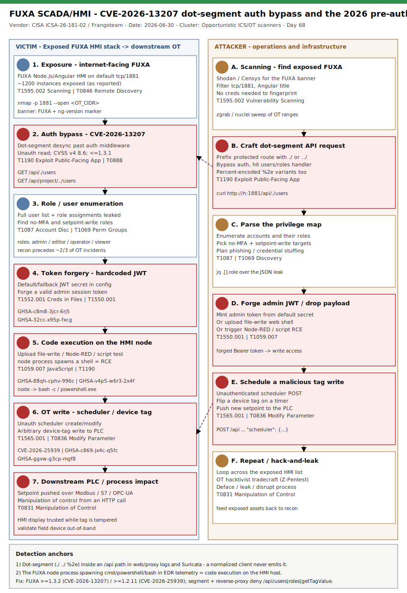</a> <b>2026-07-04</b> Opportunistic ICS/OT scanners</td>
<td align="center" valign="top" width="33%"> <b>2026-07-03</b> Unattributed e-crime (BumbleBee -> AdaptixC2 -> Akira)</td>
<td align="center" valign="top" width="33%"><a href="days/2026/07/2026-07-02_Fulcio-Sigstore-OIDC-SSRF-CVE-2026-49478/">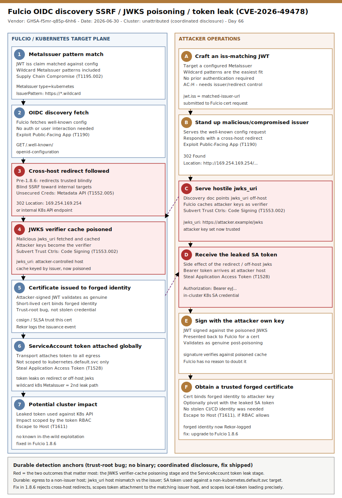</a> <b>2026-07-02</b> Unattributed — coordinated vulnerability disclosure (no observed campaign)</td>
</tr>
<tr>
<td align="center" valign="top" width="33%"><a href="days/2026/07/2026-07-01_AWS-Console-AiTM-input24-PhishingKit/">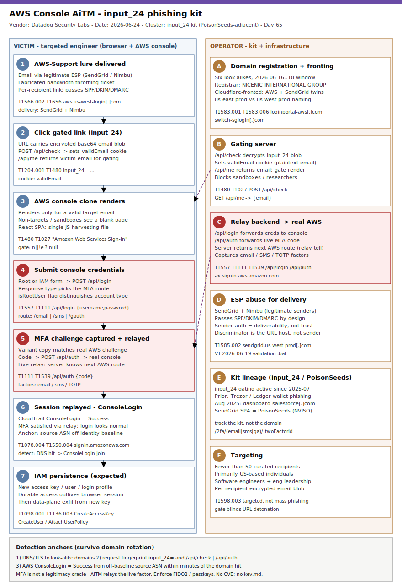</a> <b>2026-07-01</b> input_24 phishing kit operator (PoisonSeeds-adjacent)</td>
<td align="center" valign="top" width="33%"><a href="days/2026/06/2026-06-30_DireWolf-Golang-DoubleExtortion-Ransomware/">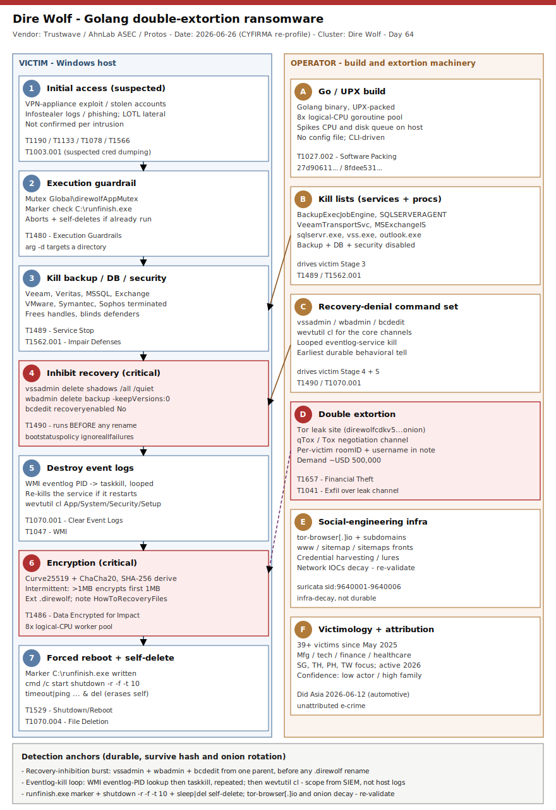</a> <b>2026-06-30</b> Dire Wolf (DireWolf) ransomware group</td>
<td align="center" valign="top" width="33%"><a href="days/2026/06/2026-06-29_CL-STA-1062-TinyRCT-Backdoor-SEA-Espionage/">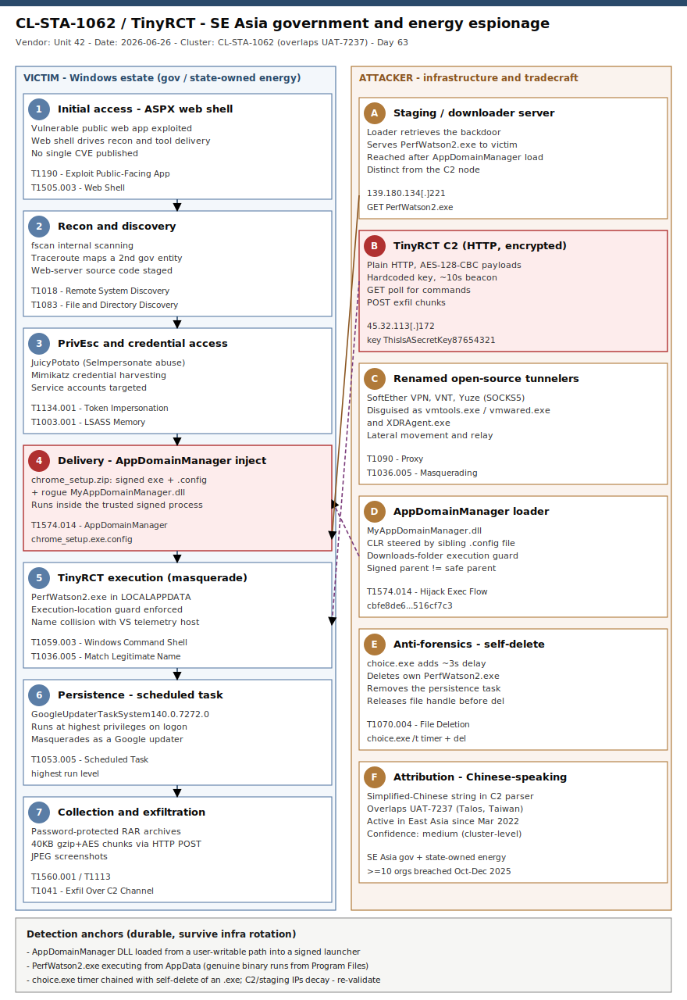</a> <b>2026-06-29</b> CL-STA-1062</td>
</tr>
<tr>
<td align="center" valign="top" width="33%"><a href="days/2026/06/2026-06-28_RoboVPN-Neunative-Vo1d-Popa-Residential-Proxy-Botnet/">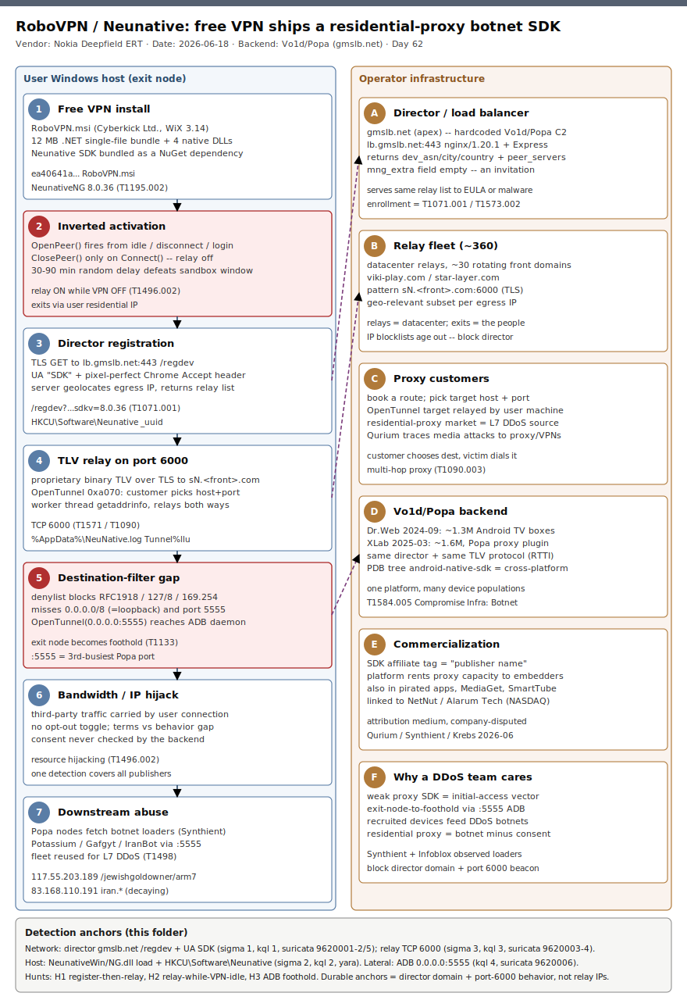</a> <b>2026-06-28</b> Vo1d/Popa proxy operator · Cyberkick Ltd. (RoboVPN)</td>
<td align="center" valign="top" width="33%"><a href="days/2026/06/2026-06-27_Lantronix-EDS5000-BRIDGEBREAK-CVE-2025-67038-OT-Bridge/">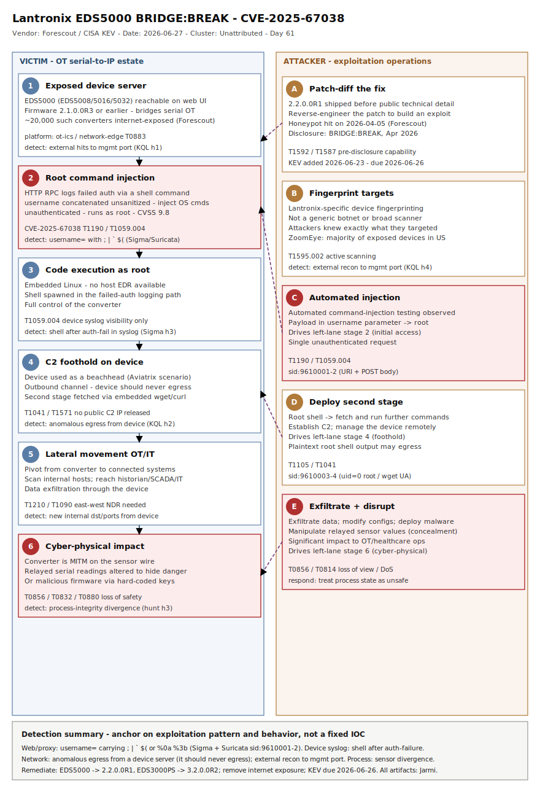</a> <b>2026-06-27</b> Unattributed — CVE-2025-67038 exploitation</td>
<td align="center" valign="top" width="33%"><a href="days/2026/06/2026-06-26_GentleKiller-BYOVD-Detection-Engineering/">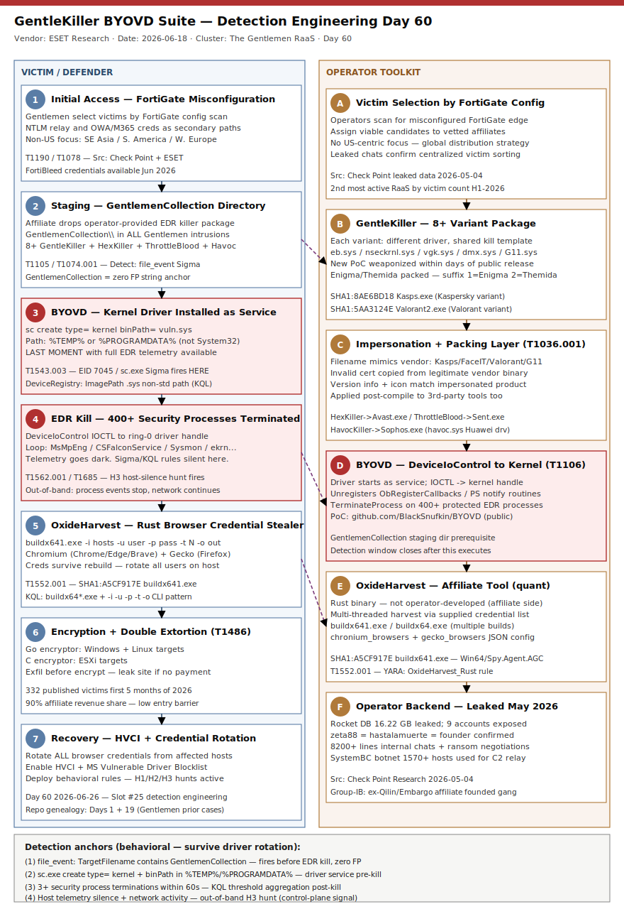</a> <b>2026-06-26</b> The Gentlemen RaaS (GentleKiller operator)</td>
</tr>
</table>

---

## All cases by month

<b>2026-07</b> — 7 case(s)

| Date | Case | Clusters | Platforms |
|---|---|---|---|
| 2026-07-07 | [KongTuke / Woodgnat: Backdoor.Mistic (MTLBackdoor) — an initial access broker's ClickFix-to-ransomware pipeline](days/2026/07/2026-07-07_KongTuke-Mistic-MTLBackdoor-IAB-ClickFix/) | Woodgnat | windows |
| 2026-07-06 | [ToddyCat Umbrij: Shadow Token via Remote Debug steals OAuth tokens to read Gmail](days/2026/07/2026-07-06_ToddyCat-Umbrij-STRD-OAuth-Gmail/) | ToddyCat | windows, cloud-multi |
| 2026-07-05 | [OFFIS DCMTK DICOM toolkit: path-traversal file write (CVE-2026-50003) + memory-exhaustion DoS across medical imaging](days/2026/07/2026-07-05_DCMTK-DICOM-Toolkit-PathTraversal-FileWrite-ICSMA-26-181-01/) | Opportunistic medical-imaging scanners | linux, windows, network-edge |
| 2026-07-04 | [FUXA SCADA/HMI: dot-segment path-normalization auth bypass (CVE-2026-13207) leaks every OT role](days/2026/07/2026-07-04_FUXA-SCADA-HMI-PathNorm-AuthBypass-CVE-2026-13207/) | Opportunistic ICS/OT scanners | ot-ics, network-edge, linux |
| 2026-07-03 | [From Bing search to NTDS.dit: BumbleBee sideloads, AdaptixC2 drives, Akira encrypts (DFIR Report x Swisscom)](days/2026/07/2026-07-03_BumbleBee-AdaptixC2-Akira-SEO-to-NTDS/) | Unattributed e-crime (BumbleBee -> AdaptixC2 -> Akira) | windows |
| 2026-07-02 | [Fulcio's blind spot: SSRF, JWKS cache poisoning and a Kubernetes token leak in Sigstore's signing CA (CVE-2026-49478)](days/2026/07/2026-07-02_Fulcio-Sigstore-OIDC-SSRF-CVE-2026-49478/) | Unattributed — coordinated vulnerability disclosure (no observed campaign) | cloud-multi, supply-chain |
| 2026-07-01 | [Behind the console: an AiTM phishing kit that clones the AWS sign-in page and relays MFA in real time (input_24 kit)](days/2026/07/2026-07-01_AWS-Console-AiTM-input24-PhishingKit/) | input_24 phishing kit operator (PoisonSeeds-adjacent) | cloud-multi |

<b>2026-06</b> — 30 case(s)

| Date | Case | Clusters | Platforms |
|---|---|---|---|
| 2026-06-30 | [Dire Wolf: a Golang double-extortion ransomware that kills the recovery story before it encrypts](days/2026/06/2026-06-30_DireWolf-Golang-DoubleExtortion-Ransomware/) | Dire Wolf (DireWolf) ransomware group | windows |
| 2026-06-29 | [CL-STA-1062 / TinyRCT: A Chinese-Speaking APT's Custom .NET Backdoor Against Southeast Asian Government and Energy](days/2026/06/2026-06-29_CL-STA-1062-TinyRCT-Backdoor-SEA-Espionage/) | CL-STA-1062 | windows |
| 2026-06-28 | [RoboVPN / Neunative: A Free VPN That Ships a Residential-Proxy Botnet SDK on the Vo1d/Popa Backend](days/2026/06/2026-06-28_RoboVPN-Neunative-Vo1d-Popa-Residential-Proxy-Botnet/) | Vo1d/Popa proxy operator · Cyberkick Ltd. (RoboVPN) | windows, iot, supply-chain |
| 2026-06-27 | [Lantronix EDS5000 BRIDGE:BREAK: Root Command Injection in a Serial-to-IP OT Bridge (CVE-2025-67038)](days/2026/06/2026-06-27_Lantronix-EDS5000-BRIDGEBREAK-CVE-2025-67038-OT-Bridge/) | Unattributed — CVE-2025-67038 exploitation | ot-ics, network-edge, iot |
| 2026-06-26 | [GentleKiller BYOVD Suite: Behavioral Detection Engineering Against Operator-Maintained EDR Killers](days/2026/06/2026-06-26_GentleKiller-BYOVD-Detection-Engineering/) | The Gentlemen RaaS (GentleKiller operator) | windows |
| 2026-06-25 | [Miasma Dead-Drop C2 via GitHub API: codfish/semantic-release-action Tag Hijack](days/2026/06/2026-06-25_Miasma-Codfish-GHA-Tag-Hijack/) | Miasma-unattributed | supply-chain, cloud-multi |
| 2026-06-24 | [SRG / Luna Moth Fast Flux DNS Infrastructure: Vishing-to-Extortion Against US Law Firms](days/2026/06/2026-06-24_SRG-LunaMoth-FastFlux-LawFirm-Extortion/) | Silent Ransom Group (SRG) · Luna Moth · Chatty Spider · UNC3753 | windows, network-edge |
| 2026-06-23 | [Cloud Insider Recruitment: Underground Market for SaaS and Cloud Platform Access](days/2026/06/2026-06-23_Cloud-Insider-Recruitment-Intel471/) | Cloud-Insider-Recruitment-unattributed | cloud-multi, windows, linux, macos |
| 2026-06-22 | [ProSpy/BITTER: Hack-for-Hire Android Spyware Targeting MENA Civil Society Journalists](days/2026/06/2026-06-22_prospy-bitter-mena/) | BITTER · T-APT-17 | android, mobile, network-edge |
| 2026-06-21 | [Icarus SaaS Extortion via Klue OAuth: Salesforce CRM Data Theft Across Enterprise Clients](days/2026/06/2026-06-21_Icarus-Klue-OAuth-Salesforce-SaaS-Extortion/) | Icarus | cloud-multi |
| 2026-06-20 | [Agentjacking via Sentry MCP — Forged DSN Events Hijack AI Coding Agents for Credential Exfiltration](days/2026/06/2026-06-20_Agentjacking-Sentry-MCP-DSN-Injection/) | Agentjacking-unattributed (Tenet Threat Labs tracking) | windows, linux, macos, supply-chain |
| 2026-06-19 | [Iran-Nexus ATG Cyber-Physical Campaign: Fuel Monitor Manipulation via Internet-Exposed Veeder-Root Consoles](days/2026/06/2026-06-19_ATGFuelMonitor-IranNexus-CyberPhysical/) | Iran-nexus (unattributed) | ot-ics, network-edge, linux |
| 2026-06-18 | [JCE CVE-2026-48907 — unauthenticated pre-auth RCE in the Joomla Content Editor via the profile-import endpoint, now sprayed by a botnet](days/2026/06/2026-06-18_JCE-CVE-2026-48907-Joomla-Unauth-RCE/) | Opportunistic CMS mass-exploitation (unattributed botnet) | linux, network-edge |
| 2026-06-17 | [Fake event-invitation phish kit: mass credential + OTP harvesting and RMM delivery against US organizations](days/2026/06/2026-06-17_FakeInvitation-PhishKit-OTP-RMM/) | Unattributed fake-invitation phish-kit operator (ANY.RUN-tracked) | windows, cloud-multi |
| 2026-06-16 | [Qilin affiliate weaponises Check Point IKEv1 VPN auth-bypass (CVE-2026-50751) as ransomware initial access](days/2026/06/2026-06-16_Qilin-CheckPoint-IKEv1-CVE-2026-50751/) | Qilin ransomware affiliate (Check Point CPR, medium confidence) | network-edge, linux, windows |
| 2026-06-15 | [OceanLotus (APT32) turns inward — SPECTRALVIPER via a FireAnt MetaKit supply-chain attack and a multi-year construction-firm intrusion](days/2026/06/2026-06-15_OceanLotus-SPECTRALVIPER-FireAnt-SupplyChain/) | OceanLotus (APT32) | windows |
| 2026-06-14 | [Humanity Protocol $36M bridge takeover — DPRK-linked spear-phish to a signer laptop steals the multisig keys](days/2026/06/2026-06-14_Humanity-Protocol-DPRK-Bridge-KeyTheft/) | DPRK-linked intrusion set (Quantstamp; Lazarus-cluster overlap, not definitively attributed) | windows, macos, cloud-multi |
| 2026-06-13 | [DevilNFC and NFCMultiPay — locally-built Android NFC relay malware (Spanish + Brazilian TAs, AI-assisted)](days/2026/06/2026-06-13_DevilNFC-NFCMultiPay-NFC-Relay/) | DevilNFC · NFCMultiPay | android |
| 2026-06-12 | [LinkPro — eBPF rootkit with magic-packet activation in a compromised AWS EKS environment](days/2026/06/2026-06-12_LinkPro-eBPF-Rootkit-MagicPacket-EKS/) | LinkPro (unattributed; vShell/vnt toolchain, UNC5174 overlap) | linux, cloud-multi, supply-chain |
| 2026-06-11 | [Argo CD ServerSideDiff Kubernetes Secret extraction (CVE-2026-42880) — a read-only GitOps user reads etcd Secrets in plaintext](days/2026/06/2026-06-11_ArgoCD-ServerSideDiff-CVE-2026-42880-K8s-Secret-Leak/) | Opportunistic Argo CD ServerSideDiff exploitation (unattributed) | cloud-multi, supply-chain |
| 2026-06-10 | [Kali365 (K365) — OAuth 2.0 device-code phishing-as-a-service expands to a multi-brand identity operation](days/2026/06/2026-06-10_Kali365-K365-OAuth-DeviceCode-PhaaS/) | Kali365 | cloud-multi, windows |
| 2026-06-09 | [Kyber ransomware — dual ESXi + Windows encryptor built to blind backup and hypervisor recovery](days/2026/06/2026-06-09_Kyber-Dual-ESXi-Windows-Backup-Hypervisor-Ransomware/) | Kyber | linux, windows |
| 2026-06-08 | [OP-512 — China-linked IIS web shell framework with per-deployment cryptographic uniqueness](days/2026/06/2026-06-08_OP-512-China-IIS-WebShell-Framework/) | OP-512 | windows, network-edge |
| 2026-06-07 | [Secure Boot 2011 certificate expiry (KEK June 24, 2026) — the frozen-DBX window that makes BlackLotus-class bootkits permanently exploitable](days/2026/06/2026-06-07_SecureBoot-2011-Cert-Expiry-Bootkit-Exposure/) | Bootkit ecosystem (BlackLotus / Bootkitty / PKfail / Bombshell) exploiting frozen Secure Boot trust | windows, linux, supply-chain |
| 2026-06-06 | [OCPP EV-Charging Attack Surface - ABB Terra AC Heap Overflow (CVE-2025-5517) and the OCPP WebSocket Missing-Auth Class](days/2026/06/2026-06-06_OCPP-EVCharging-ABB-TerraAC-CVE-2025-5517/) | Opportunistic OCPP / EV-charging exploitation (unattributed) | iot, ot-ics, network-edge |
| 2026-06-05 | [Netlogon CVE-2026-41089 — unauthenticated 0-click stack-overflow RCE as SYSTEM on Windows domain controllers](days/2026/06/2026-06-05_Netlogon-CVE-2026-41089-DC-RCE/) | Opportunistic Netlogon mass-exploitation (unattributed) | windows |
| 2026-06-04 | [Kirki CVE-2026-8206 — unauthenticated admin account takeover via password-reset-to-attacker-email on 150K WordPress sites](days/2026/06/2026-06-04_Kirki-CVE-2026-8206-WP-AccountTakeover/) | Opportunistic WordPress mass-exploitation (unattributed) | linux, network-edge |
| 2026-06-03 | [ip6.arpa Reverse-DNS Phishing — wildcard A records on IPv6 reverse zones evade reputation and blocklists](days/2026/06/2026-06-03_ip6arpa-Reverse-DNS-Phishing/) | Unattributed ip6.arpa Reverse-DNS Phishing Operator (Infoblox-tracked) | network-edge, cloud-multi |
| 2026-06-02 | [Aur0ra ransomware — in-place encryption with no rename and no extension, double-extortion via Tor](days/2026/06/2026-06-02_Aur0ra-NoRename-InPlace-Ransomware/) | Aur0ra (unattributed ransomware family) | windows |
| 2026-06-01 | [GREYVIBE — Russia-nexus AI-augmented espionage against Ukraine: PhantomRelay and LegionRelay PowerShell RATs, FallSpy Android spyware](days/2026/06/2026-06-01_GREYVIBE-PhantomRelay-LegionRelay-Ukraine/) | GREYVIBE | windows, android, network-edge |

<b>2026-05</b> — 31 case(s)

| Date | Case | Clusters | Platforms |
|---|---|---|---|
| 2026-05-31 | [Black Shadow / Ababil of Minab — Iran-MOIS recovery-layer destruction: vCenter VM deletion, Veeam backup wipe, SSMS database drops to deny recovery](days/2026/05/2026-05-31_BlackShadow-AbabilOfMinab-Recovery-Layer-Destruction/) | Black Shadow (Ababil of Minab persona) | windows, linux, network-edge |
| 2026-05-30 | [AMOS / Atomic macOS Stealer — malicious OpenClaw skill SKILL.md social-engineers AI agents and users into installing a multi-key-XOR universal Mach-O wallet and Keychain stealer](days/2026/05/2026-05-30_AMOS-OpenClaw-Skill-macOS-Stealer/) | AMOS / Atomic macOS Stealer (MaaS) | macos |
| 2026-05-29 | [MiniPlasma — CVE-2020-17103 silent regression weaponized to SYSTEM on fully patched Windows 11 via cldflt.sys race + WER QueueReporting hijack](days/2026/05/2026-05-29_MiniPlasma-CVE-2020-17103-Silent-Regression-NightmareEclipse/) | Chaotic Eclipse / Nightmare-Eclipse | windows |
| 2026-05-28 | [TrapDoor — Cross-Ecosystem Crypto and AI-Developer Credential Stealer Across npm, PyPI and Crates.io](days/2026/05/2026-05-28_TrapDoor-CrossEcosystem-Crypto-AI-Stealer/) | TrapDoor (Socket-tracked) | supply-chain, linux, macos, windows, cloud-multi |
| 2026-05-27 | [BlackFile / UNC6671 / Cordial Spider — Vishing + AiTM SSO compromise of Microsoft 365 and Okta with programmatic SharePoint exfiltration](days/2026/05/2026-05-27_BlackFile-UNC6671-CordialSpider-SaaS-Extortion/) | UNC6671 (GTIG / Mandiant) · BlackFile (self-branded DLS) · Cordial Spider (CrowdStrike) · CL-CRI-1116 (Palo Alto Unit 42) · O-UNC-045 (Okta Defensive Cyber Operations) | cloud-multi, saas, windows |
| 2026-05-26 | [VENOMOUS#HELPER / STAC6405 — Dual-RMM JWrapper-Packaged SimpleHelp + ScreenConnect IAB Operation](days/2026/05/2026-05-26_VenomousHelper-STAC6405-Dual-RMM-IAB/) | VENOMOUS#HELPER (Securonix) · STAC6405 (Sophos) | windows |
| 2026-05-25 | [UAC-0057 / Ghostwriter — OYSTERFRESH JavaScript Loader and Registry-Persisted OYSTERBLUES Targeting Ukrainian Government via Prometheus Lures](days/2026/05/2026-05-25_UAC0057-OYSTERFRESH-Prometheus-Ukraine/) | UAC-0057 · Ghostwriter · FrostyNeighbor · UNC1151 | windows |
| 2026-05-24 | [Operation Saffron — First VPN Anonymization-as-a-Service Takedown by Europol, France, Netherlands and FBI](days/2026/05/2026-05-24_OperationSaffron-FirstVPN-Takedown/) | First VPN Service (1vpns.com) | network-edge, cloud-multi, windows, linux |
| 2026-05-23 | [SonicWall Gen6 SSL-VPN MFA Bypass (CVE-2024-12802) — First In-the-Wild Exploitation by Akira-Aligned Affiliate](days/2026/05/2026-05-23_SonicWall-Gen6-MFA-Bypass-CVE-2024-12802/) | Unattributed ransomware-aligned IAB (TTP overlap with Akira / Storm-1567 affiliate ecosystem) | network-edge, windows |
| 2026-05-22 | [Red Lamassu / Calypso APT — JFMBackdoor (Windows side-load) and Showboat (Linux kworker masquerade) targeting Asian telecoms](days/2026/05/2026-05-22_RedLamassu-JFMBackdoor-Showboat-Telecom/) | Red Lamassu · Calypso APT | windows, linux, network-edge |
| 2026-05-21 | [TeamPCP 48-Hour Mega-Campaign — actions-cool Tag Poisoning, durabletask PyPI Worm, Nx Console VS Code Extension and the GitHub Internal Repo Breach](days/2026/05/2026-05-21_TeamPCP-48h-Multi-Vector-SupplyChain/) | TeamPCP · UNC6780 · Mini Shai-Hulud | linux, cloud-multi, supply-chain, windows |
| 2026-05-20 | [Storm-2949 — From SSPR-Abused Identity to Cloud-Wide Breach across Microsoft 365 and Azure](days/2026/05/2026-05-20_Storm-2949-Cloud-Identity-SSPR/) | Storm-2949 | cloud-multi, windows |
| 2026-05-19 | [Embargo Ransomware — Rust MDeployer + MS4Killer with Safe Mode Boot BYOVD (ESET + TRM Labs)](days/2026/05/2026-05-19_Embargo-Rust-SafeMode-BYOVD/) | Embargo · ALPHV · BlackCat | windows |
| 2026-05-18 | [Silver Fox ABCDoor Tax-Themed Phishing in India and Russia (Kaspersky Securelist)](days/2026/05/2026-05-18_SilverFox-ABCDoor-Tax-Phishing/) | Silver Fox · SwimSnake · Void Arachne · UTG-Q-1000 | windows |
| 2026-05-16 | [Cisco Catalyst SD-WAN vHub authentication bypass — CVE-2026-20182, UAT-8616 targeted exploitation, and ten post-compromise activity clusters](days/2026/05/2026-05-16_Cisco-SDWAN-vHub-AuthBypass-UAT8616/) | UAT-8616 · Talos Cluster 1 (Tas9er Godzilla) · Talos Cluster 2 (Behinder Base64) · Talos Cluster 3 (XenShell + Behinder) · Talos Cluster 4 (Godzilla variant) · Talos Cluster 5 (AdaptixC2 shadowcore) · Talos Cluster 6 (Sliver mTLS) · Talos Cluster 7 (XMRig + Cobalt Strike) · Talos Cluster 8 (NimPlant-variant agent1) · Talos Cluster 9 (gsocket + XMRig) · Talos Cluster 10 (vManage credential extractor) | network-edge, linux |
| 2026-05-15 | [EtherRAT + TukTuk → The Gentlemen Ransomware — blockchain C2 meets AI-generated framework in an enterprise intrusion](days/2026/05/2026-05-15_EtherRAT-TukTuk-Gentlemen/) | The Gentlemen RaaS · EtherRAT (DPRK-linked, UNC5342 toolchain overlap) · TukTuk (AI-generated framework) | windows, cloud-multi |
| 2026-05-14 | [Mini Shai-Hulud Mega-Campaign: TeamPCP Poisons 170+ npm/PyPI Packages via GitHub Actions OIDC Hijack and SLSA Provenance Forgery](days/2026/05/2026-05-14_Mini-Shai-Hulud-TeamPCP-Mega-Campaign/) | TeamPCP | supply-chain, linux, macos |
| 2026-05-13 | [Semantic Kernel Prompt-to-RCE — CVE-2026-26030 and CVE-2026-25592](days/2026/05/2026-05-13_SemanticKernel-Prompt2RCE/) | Microsoft Defender Security Research (vulnerability disclosure, no threat actor) | windows, linux, cloud-multi, supply-chain |
| 2026-05-12 | [Qilin EDR Killer — msimg32.dll four-stage loader and BYOVD chain](days/2026/05/2026-05-12_Qilin-EDR-Killer-msimg32/) | Qilin · Agenda · Warlock | windows |
| 2026-05-11 | [UAT-8302 — China-nexus government espionage with shared APT arsenal](days/2026/05/2026-05-11_UAT-8302-China-Government-Espionage/) | UAT-8302 · Jewelbug · REF7707 · CL-STA-0049 · LongNosedGoblin · UNC5174 · UAT-6382 · Earth Estries · Erudite Mogwai | windows, cloud-multi |
| 2026-05-10 | [AI-Assisted Compromise of a Mexican Water Utility — Claude + GPT pursuing OT access at SADM Monterrey (Dragos & Gambit Security)](days/2026/05/2026-05-10_Mexico-Water-AI-Assisted-OT/) | Unattributed-LLM-assisted-operator | cloud-multi, windows, linux, ot-ics |
| 2026-05-09 | [Albiriox — Android MaaS RAT with Accessibility-VNC FLAG_SECURE bypass (Cleafy Labs, late-2025 / active 2026)](days/2026/05/2026-05-09_Albiriox-Android-MaaS-AcVNC/) | Albiriox | android |
| 2026-05-08 | [CloudZ RAT + Pheno plugin — Microsoft Phone Link SQLite OTP/SMS theft (Cisco Talos, May 2026)](days/2026/05/2026-05-08_CloudZ-RAT-Pheno-PhoneLink/) | CloudZ · Pheno | windows |
| 2026-05-07 | [EVM/DeFi npm typosquat — six packages by namikazesarada010206 with on-require() activation (Xygeni, May 2026)](days/2026/05/2026-05-07_EVM-DeFi-npm-typosquat-namikazesarada/) | namikazesarada010206 | linux, macos, windows, supply-chain, cryptocurrency |
| 2026-05-07 | [QLNX (Quasar Linux RAT) — Linux developer/DevOps implant with rootkit, PAM backdoor and supply-chain credential harvester (Trend Micro, May 2026)](days/2026/05/2026-05-07_QLNX-Quasar-Linux-RAT/) | QLNX · Quasar Linux | linux, supply-chain |
| 2026-05-06 | [Code of Conduct AiTM — Storm-1747 / Tycoon2FA campaign against Microsoft 365 (Microsoft Threat Intelligence, May 2026)](days/2026/05/2026-05-06_CodeOfConduct-AiTM-Storm-1747/) | Storm-1747 · Storm-1575 · Tycoon2FA · Dadsec | cloud-multi, microsoft-365 |
| 2026-05-05 | [Akira ransomware × SonicWall SSL VPN — CVE-2024-40766 smash-and-grab with sub-4h dwell (Arctic Wolf 2025-2026 resurgence + CISA AA24-109A)](days/2026/05/2026-05-05_Akira-SonicWall-CVE-2024-40766/) | Akira · Storm-1567 · Howling Scorpius · Punk Spider · Gold Sahara | windows, active-directory, linux, vmware-esxi, nutanix-ahv, network-edge |
| 2026-05-04 | [Campaign C0063 — Poland Wiper Attacks (DynoWiper + LazyWiper) via Sandworm-overlap cluster (ESET / Mandiant, May 2026)](days/2026/05/2026-05-04_C0063-Poland-Wiper/) | Sandworm overlap · Static Tundra · TEMP.Veles · C0063 | windows, active-directory |
| 2026-05-03 | [BAUXITE / CyberAv3ngers (IRGC-CEC) — Direct-to-PLC tradecraft against Rockwell/Allen-Bradley (CISA AA26-097A, April 2026)](days/2026/05/2026-05-03_BAUXITE-CyberAvengers-AA26-097A/) | BAUXITE · CyberAv3ngers · Storm-0784 · UNC5691 · Hydro Kitten · Shahid Kaveh Group · G1027 | ot-ics, network-edge, windows |
| 2026-05-02 | [Nexcorium — Mirai variant exploiting CVE-2024-3721 on TBK DVR-4104/-4216 (FortiGuard Labs, April 2026)](days/2026/05/2026-05-02_Nexcorium-TBK-DVR-CVE-2024-3721/) | Nexcorium · Nexus Team | iot, linux |
| 2026-05-01 | [VECT 2.0 RaaS — Ransomware by design, Wiper by accident (Check Point Research, April 2026)](days/2026/05/2026-05-01_VECT-2.0-RaaS/) | VECT · TeamPCP · BreachForums | windows, linux, vmware-esxi |

<b>2026-04</b> — 3 case(s)

| Date | Case | Clusters | Platforms |
|---|---|---|---|
| 2026-04-30 | [FIRESTARTER + LINE VIPER — UAT-4356 / ArcaneDoor persistent implant on Cisco Secure Firewall ASA/FTD/Firepower (CISA AR26-113A)](days/2026/04/2026-04-30_FIRESTARTER-LINE-VIPER-UAT4356/) | UAT-4356 · Storm-1849 · ArcaneDoor | network-edge |
| 2026-04-29 | [Shai-Hulud: The Third Coming — Bitwarden CLI 2026.4.0 trojanised npm worm](days/2026/04/2026-04-29_ShaiHulud-Bitwarden/) | TeamPCP · Shai-Hulud | linux, macos, windows, supply-chain |
| 2026-04-28 | [The Gentlemen RaaS + SystemBC: GPO-weaponized domain-wide encryption behind an RC4 SOCKS5 tunnel](days/2026/04/2026-04-28_TheGentlemen-SystemBC/) | The Gentlemen RaaS | windows |

