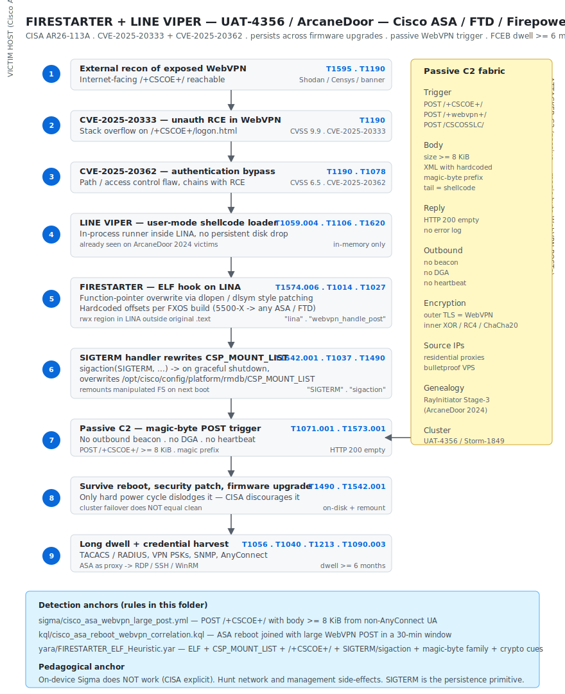

# FIRESTARTER + LINE VIPER — UAT-4356 / ArcaneDoor persistent implant on Cisco Secure Firewall ASA/FTD/Firepower (CISA AR26-113A)

## TL;DR

On 23-Apr-2026 CISA published Malware Analysis Report **AR26-113A** describing **FIRESTARTER**, an ELF Linux implant that lives inside the LINA process of Cisco Secure Firewall **ASA / FTD / Firepower** appliances and persists by **rewriting `/opt/cisco/config/platform/rmdb/CSP_MOUNT_LIST` during the `SIGTERM` handler of a graceful shutdown**. The implant **survives firmware upgrades, security patches and graceful reboots**; only a **hard power cycle** dislodges it, and CISA explicitly discourages that step because it risks on-disk corruption of the appliance. The intrusion chain starts with **CVE-2025-20333** (unauthenticated RCE in the WebVPN handler) and **CVE-2025-20362** (auth bypass), drops **LINE VIPER** (a user-mode shellcode loader already seen in ArcaneDoor 2024 victims), then plants FIRESTARTER as the post-patching persistence layer. Activation is **passive**: the operator sends a WebVPN `POST` to `/+CSCOE+/` whose XML body is prefixed with hardcoded **magic bytes**; no out-of-band beacon is ever produced. Cluster is **UAT-4356** (Cisco Talos) / **Storm-1849** (Microsoft) / **ArcaneDoor**, **China-nexus at medium confidence** (CISA and Talos publicly stop short of naming the country). Discovery was in a US FCEB agency during proactive CISA monitoring, with a dwell time of at least six months. The critical pedagogical takeaway is that **on-device Sigma does not work** for this implant family — CISA states FIRESTARTER produces no observable log events — so the hunt has to live on the **network and management side-effects**: WebVPN POST body anomalies, ASA reboots correlated to large POSTs, NetFlow showing the ASA pivoting inward, mount-list diffs against a gold image.

## Attribution and confidence

- **Cluster names (vendor):** **UAT-4356** (Cisco Talos), **Storm-1849** (Microsoft), **ArcaneDoor** (campaign name shared by Talos and Microsoft since 2024).
- **Vendor that discovered:** **CISA**, during proactive monitoring of a US FCEB agency. Disclosure on 23-Apr-2026 as Malware Analysis Report **AR26-113A**, corroborated by Cisco Talos, SecPod, Hive Pro, BleepingComputer, The Record, SecurityWeek, The Register and NCSC UK.
- **Confidence:** **medium** for the China-nexus state-sponsored attribution. CISA and Cisco Talos publicly avoid naming a country, but the tradecraft, target set (telco, government, defense, energy, FCEB), tooling overlap with ArcaneDoor 2024, and deep familiarity with **FXOS / ROMMON / CSP** internals are all consistent with the China-nexus espionage clusters previously linked to Salt Typhoon / Volt Typhoon. Confidence on the **technical cluster** (UAT-4356 / Storm-1849 / ArcaneDoor) is **high**; confidence on the **state nexus** is what stays at medium.
- **Genealogy / link with previous repo cases:** FIRESTARTER reuses the Stage-3 shellcode handler family from **RayInitiator** (ArcaneDoor 2024 bootkit). **LINE VIPER** was already documented as the user-mode loader on ArcaneDoor 2024 victims. The detection diary previously covered Salt Typhoon / Volt Typhoon style edge-appliance abuse at the conceptual level; this is the first entry where the persistence mechanism explicitly survives a vendor patch. The case also pairs naturally with **2026-04-20 CISA KEV — Cisco Catalyst SD-WAN Manager CVE-2026-20122 / -20128 / -20133**, which targets the management plane of the same vendor at the same time.

## Kill chain — summary table

| Stage | MITRE | Detail |
|---|---|---|
| Initial Access | T1190 | Chained exploitation of CVE-2025-20333 (RCE) + CVE-2025-20362 (auth bypass) on `/+CSCOE+/` |
| Execution | T1059.004, T1106 | LINE VIPER user-mode shellcode loader runs in-process inside LINA; native API only, no shell drop |
| Defense Evasion | T1014, T1620, T1574.006, T1027 | Rootkit-class in-memory hook of the WebVPN XML handler; reflective loading; dynamic-linker style symbol patching; no stdout/stderr/syslog |
| Persistence | T1542.001, T1037 | `SIGTERM` handler rewrites `/opt/cisco/config/platform/rmdb/CSP_MOUNT_LIST` so the next boot remounts the malicious payload — survives firmware upgrades and graceful reboots |
| Discovery | T1082 | System info recon for FXOS version / build to select the hardcoded LINA offsets |
| Credential Access | T1056.004, T1040, T1213 | AAA configs, TACACS+/RADIUS shared secrets, VPN PSKs, SNMP communities, AnyConnect profiles, TLS interception while the ASA acts as VPN terminator |
| Lateral Movement | T1110.003, T1018, T1046 | ASA used as pivot; password spraying and internal recon from a host the SOC normally trusts |
| Command and Control | T1071.001, T1573.001, T1090.003 | Passive C2: operator POSTs WebVPN XML with magic-byte prefix over HTTPS; reply is HTTP 200 empty; the ASA itself can be used as a proxy |
| Impact | T1490 | Inhibit Recovery — the implant is engineered to defeat the operator's "patch = clean" assumption |



The diagram lays out a single victim-host lane (left, the Cisco ASA / FTD / Firepower appliance) and a passive attacker-C2 lane (right). Stage boxes follow the order of the table above, with two emphasised primitives: the **passive magic-byte trigger** on `POST /+CSCOE+/` and the **`SIGTERM`-time rewrite of `CSP_MOUNT_LIST`** that keeps FIRESTARTER alive across firmware upgrades. The attacker C2 cluster on the right is intentionally sparse — no outbound beacon, no DGA, no implant heartbeat — and lists only the passive trigger primitives. Detection anchors at the bottom map directly onto the rules in `sigma/`, `kql/` and `yara/`.

## Stage-by-stage detail

### Initial Access

Two zero-days in the WebVPN / AnyConnect component of the ASA / FTD were chained. Cisco shipped patches in **September 2025**, but a patch applied on top of an already-implanted device **does not remove FIRESTARTER** — that is the entire point of the campaign.

| CVE | Description | CVSS | Component |
|---|---|---|---|
| **CVE-2025-20333** | Buffer overflow in the WebVPN handler -> unauthenticated RCE | 9.9 | ASA WebVPN |
| **CVE-2025-20362** | Path / access-control flaw -> authentication bypass | 6.5 | ASA HTTPS endpoint |

Chained, the two CVEs give a remote unauthenticated attacker **root inside the LINA process**, because LINA runs privileged in the ASA container. The didactic shape of the trigger (not weaponised) looks like:

```http
POST /+CSCOE+/logon.html HTTP/1.1
Host: vpn.victim.example
Content-Type: application/x-www-form-urlencoded
Content-Length: <len>

tgroup=DefaultWEBVPNGroup&next=&tgcookie=0&group_list=DefaultWEBVPNGroup&username=admin&password=<overflow_payload>
```

From the defender's seat this surface is visible as **anomalously large `POST` requests to `/+CSCOE+/`** and, on a successful overflow, as an ASA traceback (`%ASA-3-199010` or similar). MITRE: `T1190`.

### Execution and Defense Evasion (first stage)

The RCE delivers **LINE VIPER**, a **user-mode shellcode loader** that runs inside LINA. LINE VIPER is the transient post-exploitation runner: it executes follow-on modules in memory and leaves no persistent on-disk footprint of its own. It has been seen on ArcaneDoor 2024 victims.

LINE VIPER then drops **FIRESTARTER**, which **hooks a WebVPN URL handler inside LINA by overwriting a function pointer**. The hook routine watches for WebVPN XML `POST` bodies whose first bytes match a **hardcoded magic prefix**; on a match, the rest of the body is treated as shellcode and executed in-process.

Defense evasion is mostly about **silence**:

- No `stdout` / `stderr` is produced.
- No syslog is generated. CISA states explicitly that "FIRESTARTER does not generate observable log events".
- The implant uses `dlopen` / `dlsym` style dynamic patching against LINA in memory, with **offsets hardcoded per FXOS build** — which is why ArcaneDoor extended its reach in March 2026 from the older 5500-X line to any ASA / FTD: the operators added offsets for additional builds.

Didactic equivalent of the hooked handler:

```c
// inside LINA, hooked handler. FIRESTARTER_MAGIC_PREFIX is a hardcoded byte sequence.
ssize_t webvpn_xml_handler(http_req_t *req) {
    if (req->method == POST &&
        memcmp(req->body, FIRESTARTER_MAGIC_PREFIX, sizeof(FIRESTARTER_MAGIC_PREFIX)) == 0) {
        void (*sc)() = (void (*)())(req->body + sizeof(FIRESTARTER_MAGIC_PREFIX));
        sc();          // executes shellcode in-place, no disk write
        return 0;      // empty response, no error log
    }
    return original_handler(req);
}
```

MITRE: `T1059.004`, `T1106`, `T1014`, `T1620`, `T1574.006`, `T1027`.

### Persistence

This is the part that breaks the "patched therefore clean" assumption:

```
FIRESTARTER persistence path
1. On install, FIRESTARTER drops a secondary copy into the appliance filesystem.
2. It installs a signal handler via sigaction() for SIGTERM.
3. When a graceful shutdown / reboot / firmware upgrade fires SIGTERM:
     - the handler intercepts the signal,
     - rewrites /opt/cisco/config/platform/rmdb/CSP_MOUNT_LIST
       so that on next boot the manipulated filesystem is remounted,
     - lets LINA terminate cleanly as if nothing happened.
4. On the next boot — including AFTER A FIRMWARE UPGRADE — CSP_MOUNT_LIST
   remounts the tampered FS and FIRESTARTER is active inside LINA again.
```

Only **`SIGKILL` or a hard power cycle** breaks the chain, because the handler never runs and `CSP_MOUNT_LIST` is either left with the last clean copy or with a half-finished modification depending on timing. CISA discourages the hard power cycle on a live appliance because of on-disk corruption risk.

Conceptually this is the difference between a **user-mode rootkit** and a **platform-level implant**: FIRESTARTER is not a pure bootkit like BlackLotus or RayInitiator, but it abuses the **CSP mount-list subsystem of FXOS** to reach the equivalent effect. MITRE: `T1542.001`, `T1037`.

### Privilege Escalation

There is no privilege escalation stage on the firewall itself. The WebVPN RCE lands as **root** inside the LINA process; LINA runs privileged in the FXOS container. Privilege escalation only appears later, on the internal network, after pivoting. MITRE: covered by the lateral and C2 sections.

### Credential Access

Once FIRESTARTER is inside LINA, the operator has full read access to the **control plane** of the firewall:

- AAA configurations including TACACS+ and RADIUS **shared secrets**, VPN **PSKs**, SNMP **community strings**, AnyConnect client profiles and client certificates.
- TLS man-in-the-middle while the ASA acts as VPN terminator — in practice, plaintext credentials at handshake time, as already documented for ArcaneDoor 2024 victims.
- NAT / ARP / routing tables, which the operator uses to enumerate internal targets and to choose pivot destinations.

MITRE: `T1056.004`, `T1040`, `T1213`.

### Discovery

Discovery on the appliance itself is limited to **system-information recon**: FXOS version, build, hardware platform — enough to pick the right hardcoded LINA offsets. From the internal pivot, classical host and network discovery follows. MITRE: `T1082`, `T1018`, `T1046`.

### Lateral Movement

The ASA / FTD is an extremely useful pivot because **outbound flows that originate from the firewall itself are normally trusted by the rest of the management plane** — syslog, NetFlow, NTP, AAA, jump hosts, monitoring stations and management VLANs almost always allow it. SOCKS / proxy tunnels that emerge from the ASA are very hard to spot: the appliance is itself the place where every other suspect outbound is supposed to be inspected.

Typical lateral movement from the ASA pivot:

- RDP / SSH / WinRM to jump hosts using credentials lifted from the AAA store.
- Pass-the-hash and Kerberoasting once the operator reaches a domain-joined host.
- Reverse tunnels (`T1090.003`) and beacon traffic blended into legitimate VPN flows.

MITRE: `T1110.003`, `T1018`, `T1046`, `T1090.003`.

### Command and Control

- **Passive trigger:** `POST /+CSCOE+/` (or `/+webvpn+/`, or `/CSCOSSLC/`) with an XML body prefixed by hardcoded magic bytes. Source IPs in observed cases mix residential proxies and bulletproof VPS. The HTTP response is empty `200 OK`.
- **No outbound beacon.** No DGA. No heartbeat. The implant simply waits.
- **Encryption:** the outer TLS layer is whatever the WebVPN endpoint terminates; the inner shellcode payload can ship its own XOR / RC4 / ChaCha20 layer, but this is not publicly documented in detail.
- **Proxying:** the ASA itself can be used as a SOCKS / HTTP proxy for inbound operator traffic to the internal network, via `T1090.003`.

MITRE: `T1071.001`, `T1573.001`, `T1090.003`.

### Impact

No ransomware, no wiper, no destructive payload. The impact is **espionage with near-irrevocable persistence**:

- **Inhibit Recovery** (`T1490`): the operator's natural reflex — "I patched it, therefore it is clean" — is exactly the assumption FIRESTARTER is designed to defeat.
- The compromised ASA / FTD becomes a long-lived staging point for future operations. Pre-positioning into telco, government and critical-infrastructure perimeters is the strategic prize.

## RE notes

CISA has **not published per-sample SHA256** anchors for the FCEB incident in the public AR26-113A; the report ships YARA and a structural description but **no hashes**. We do not invent hashes.

| Component | SHA256 | Lang / format | Packer | Notes |
|---|---|---|---|---|
| FIRESTARTER core | not public | ELF 64-bit x86_64, ABI compatible with the LINA container inside FXOS | none (no commercial packer) | Small (tens of KB). Sparse strings. Invisibility-first design, no overt anti-RE. |
| LINE VIPER stage 1 | not public | x86_64 shellcode loader, user-mode, in-process | n/a | Already documented on ArcaneDoor 2024 victims. Runs in-memory, no persistent disk drop. |
| WebVPN trigger XML | not public | XML body with hardcoded magic-byte prefix | n/a | Trigger only; the actual payload is shipped just-in-time as shellcode within the same `POST`. |

Operational pointers for the analyst:

- **Memory is the only reliable artefact.** Plan IR around acquiring a core dump (FXOS `crashinfo force-test`, taken under change-window authorisation) and shipping it via SCP to a forensic share before any reboot.
- **Hook location.** The hook is on a WebVPN XML handler symbol inside LINA. In Ghidra / IDA, identify the legitimate handler, look at its caller's function-pointer dispatch, and check whether the runtime target is an `rwx` page outside the original `.text` segment.
- **Offset awareness.** Offsets are hardcoded per FXOS build. Two appliances with different builds will show the hook in slightly different places. Maintain a per-build offset table while you reverse.
- **C2 surface.** The trigger payload is an XML body whose first bytes are a hardcoded prefix. Reversing the prefix gives a structural YARA / Suricata anchor; the public ruleset in this folder uses the `MZ\x90`, `FSX-`, `FSXT` family of markers as a didactic placeholder.
- **Signal handler.** `sigaction` plus `SIGTERM` plus references to `/opt/cisco/config/platform/rmdb/CSP_MOUNT_LIST` form a high-confidence structural signature.

```python
# Ghidra / IDAPython sketch — locate the hooked WebVPN XML handler
import idautils, idc
for func in idautils.Functions():
    name = idc.get_func_name(func)
    if "webvpn" in name.lower() and "xml" in name.lower():
        for ref in idautils.XrefsTo(func, 0):
            target = idc.get_qword(ref.frm)
            seg = idc.get_segm_name(target)
            if seg and "rwx" in seg.lower():
                print("Suspicious hook target at 0x%x -> seg=%s" % (ref.frm, seg))
```

## Detection strategy

### Telemetry that matters

- **Device-side syslog (limited).** `%ASA-1-199014`, `%ASA-2-106001` (drops), `%ASA-5-111008` (config changes), `%ASA-6-605004` / `605005` (login fail / success via web), `%ASA-3-199010` (traceback). Do not expect to see FIRESTARTER itself; expect to see what is **not** there — silences, missing reboot reasons, unexplained tracebacks.
- **Network telemetry (the actual hunting ground).** NetFlow / IPFIX / sFlow from and toward the ASA; full pcap on the DMZ segment; TLS / SNI and JA3 / JA4 client hashes that touch the WebVPN endpoint.
- **WebVPN / AnyConnect logs.** AAA logs, syslog 716xxx (WebVPN session events), RADIUS / TACACS+ accounting.
- **SNMP / REST API metrics.** Uptime, image hashes, reboot counters, `show version`, `show tech`, `show crashinfo` — and diff what the firewall says against what you expect after each maintenance window.
- **EDR on the adjacent jump hosts**, never on the ASA itself.
- **Out-of-band.** Velociraptor / osquery on the management stations; SIEM ingesting Cisco syslog without throttling.

### Detection coverage

| Engine | File | Logic |
|---|---|---|
| Sigma | [`sigma/cisco_asa_webvpn_large_post.yml`](./sigma/cisco_asa_webvpn_large_post.yml) | `POST` to `/+CSCOE+/` or `/+webvpn+/` with body `>= 8 KiB` from a non-AnyConnect user agent |
| KQL (Sentinel) | [`kql/cisco_asa_reboot_webvpn_correlation.kql`](./kql/cisco_asa_reboot_webvpn_correlation.kql) | Inner-join ASA reboots with large WebVPN POSTs in a 30-minute window |
| YARA | [`yara/FIRESTARTER_ELF_Heuristic.yar`](./yara/FIRESTARTER_ELF_Heuristic.yar) | ELF + `CSP_MOUNT_LIST` + `/+CSCOE+/` + `SIGTERM` / `sigaction` + magic-byte family + ChaCha20 / Poly1305 cues |

> **Pedagogical note.** CISA states that **on-device Sigma is not effective** because FIRESTARTER does not emit observable log events on the appliance. The Sigma rule in this folder therefore runs against logs that arrive at the SIEM (reverse proxy, WAF in front of the ASA, ASA syslog with verbose WebVPN), **not** on the device. The YARA rule is meant for **core dumps and disk images** acquired during IR, not for an on-box scanner.

### Threat hunting hypotheses

- **H1 — "My September 2025 patch did not clean my ASA."** Question: is there any ASA / FTD in the fleet that, after being upgraded to the patched build, still shows unexplained reboots, oversized WebVPN POSTs from external IPs, or LINA memory regions mapped `rwx` outside the original `.text`? Data sources: ASA syslog, NetFlow, JA4 on the VPN terminator, out-of-band management. Procedure: (1) enumerate every ASA / FTD and its current build; (2) for every appliance with uptime `>= 60` days that went through the September / October 2025 upgrade window, schedule a core dump in a controlled maintenance slot; (3) run the AR26-113A YARA against the core dump; (4) in parallel, query the last 90 days of WebVPN traffic for `POST` bodies `> 8 KiB` from non-corporate IPs.
- **H2 — "My ASA is being used as a pivot."** Question: are there outbound flows that originate from the ASA's management IP toward internal destinations on RDP / WinRM / SMB / SSH that do not match the appliance's normal role (syslog, NTP, AAA, NetFlow collector)? Data sources: NetFlow filtered by `srcIP = ASA_mgmt_ip` and `dstPort in (3389, 445, 5985, 22)`, cross-referenced with authentication logs on the destinations.

## Incident response playbook

### First 60 minutes (triage)

1. **Do NOT reboot the ASA / FTD.** A graceful reboot **fires the persistence**.
2. Isolate by **out-of-band management** (serial console, FXOS console, or equivalent).
3. Capture the appliance state on disk **before any other action**: `show tech-support` (full), `show crashinfo`, `show file system`, `dir disk0:/csp/`, `dir disk0:/`, `show version`, `show running-config`. Hash the bundle and store it on the forensic share with a signed timestamp.
4. **Core dump.** If policy allows and you have authorisation: `crashinfo force-test` produces a dump in `disk0:/`. Move it off the device via SCP / TFTP to forensic storage. **Memory is your only reliable artefact**; the implant only lives there in a recognisable form.
5. **Memory acquisition** via FXOS REST API or `connect local-mgmt` + `show tech` when crashinfo is not viable.
6. **Containment.** Redirect VPN traffic to a clean appliance, or to a secondary that you have explicitly verified — cluster failover does **not** guarantee cleanliness because synchronised files may already carry the manipulation. Verify the secondary against a gold image before promoting it.
7. **Do NOT apply another firmware upgrade as "remediation".** It will neither clean the appliance nor preserve evidence; in many cases it will overwrite the very memory regions you need.

### Artifacts to collect

| Artifact | Path / source | Tool | Why it matters |
|---|---|---|---|
| Mount-list file | `/opt/cisco/config/platform/rmdb/CSP_MOUNT_LIST` | FXOS console + SCP | The persistence anchor; diff against the gold image |
| Service container directory | `/disk0:/csp/` | `dir disk0:/csp/`, SCP | Unsigned files, dates after last legitimate upgrade, unusual sizes |
| System logs | `/disk0:/log/` | SCP | Look for **silences** more than for events |
| LINA process maps | `/proc/<pid_lina>/maps`, `/proc/<pid_lina>/exe`, `/proc/<pid_lina>/mem` | FXOS root console | Identify `rwx` regions outside the original `.text` |
| Core dump | `disk0:/crashinfo_*` | `crashinfo force-test` + SCP | Required for the AR26-113A YARA |
| Appliance baseline | `show version`, `show file system`, `show tech-support` | SSH | Diff against the gold image to spot tampering |
| Management-station artifacts | Prefetch, Amcache, `bash_history`, SSH known_hosts, `~/.ssh/config`, RDP bitmap cache | DFIR triage on the jump host | Establishes who reached the ASA and when |

### IR queries and commands

```bash
# Collect from an authorised jump host. Every command requires explicit authorisation
# and a documented maintenance window.

# 1. Version and boot info
ssh ir@asa01 "show version"        > /forensics/asa01/show_version.txt
ssh ir@asa01 "show file system"    > /forensics/asa01/show_filesystem.txt
ssh ir@asa01 "dir all-filesystems" > /forensics/asa01/dir_all.txt
ssh ir@asa01 "show crashinfo"      > /forensics/asa01/show_crashinfo.txt

# 2. Process / memory snapshot
ssh ir@asa01 "show processes"      > /forensics/asa01/show_processes.txt
ssh ir@asa01 "show memory app-cache" > /forensics/asa01/show_memory.txt

# 3. Hash the on-disk image after copying it off-box
scp ir@asa01:disk0:/asa9-XX-X-X-smp-k8.bin /forensics/asa01/
sha256sum /forensics/asa01/asa9-XX-X-X-smp-k8.bin

# 4. Trigger a core dump under change control and copy it out
ssh ir@asa01 "crashinfo force test"
scp ir@asa01:disk0:/crashinfo* /forensics/asa01/

# 5. Run YARA against the core dump
yara -r yara/FIRESTARTER_ELF_Heuristic.yar /forensics/asa01/crashinfo_* -p 4

# 6. Diff the mount list against the gold image
diff -u /forensics/gold/CSP_MOUNT_LIST /forensics/asa01/CSP_MOUNT_LIST
```

```kql
// Cisco syslog in Sentinel — unexplained reboots over the last 6 months
Syslog
| where Computer in ("asa01","asa02","ftd01")
| where SyslogMessage has_any ("Reload","Restart","Booting up","ASA-5-199018","ASA-1-199014")
| project TimeGenerated, Computer, SyslogMessage
| sort by TimeGenerated desc
```

### Containment, eradication, recovery

- **Containment.** Active-balance to a known-clean appliance; revoke every VPN credential, AAA secret, SNMP community and device certificate that this ASA touched. If the secondary in the cluster is a candidate, verify it against a gold image **before** promotion.
- **Eradication (the only valid path).**
  1. Power off the affected device — yes, hard power-off — accepting the lower risk of file-system corruption versus the certainty of implant survival.
  2. **Do not reuse the disk image.** Reflash from a golden Cisco-signed image and verify the SHA256 with Cisco PSIRT.
  3. Re-apply configuration from a **baseline**, not from the `running-config` you collected post-compromise; the running config can carry adversary changes.
  4. Rotate device identity certificates, AAA secrets, SNMP communities, SSH keys, VPN PSKs.
  5. Rotate credentials for **every human or service** that authenticated through that ASA in the last six months.
- **Recovery validation.** 90 days of reinforced monitoring: NetFlow, JA4, LINA process anomaly, mount-list SHA256 watch, WebVPN POST size distribution.

**What NOT to do.**

- Do **not** apply another firmware upgrade and call it remediation. The implant is engineered to survive that exact step.
- Do **not** trust the cluster secondary without auditing it; synchronised files may carry the manipulation.
- Do **not** delete `crashinfo` "to free disk". You are erasing the only forensic artefact you have.
- Do **not** tell CISA "we are clean" without having run the AR26-113A YARA against a core dump from this specific appliance.
- Do **not** rely on `show running-config` or `show version` taken post-compromise as ground truth; the implant can tamper with what is returned.

### Recovery validation

- The affected appliance has been reflashed from a Cisco-signed image whose hash matches Cisco PSIRT.
- Configuration was rebuilt from a baseline, not from the post-compromise `running-config`.
- All AAA secrets, SNMP communities, SSH keys and VPN PSKs have been rotated.
- All identities that authenticated through this ASA in the last six months have been reset.
- 90 days of reinforced monitoring (NetFlow, JA4 on the VPN terminator, `CSP_MOUNT_LIST` SHA256, WebVPN POST size distribution) is in place with named owners.
- A post-incident review explicitly documents that no further firmware upgrade was used as remediation.

## IOCs

| Type | Value | Context | Confidence | Source |
|---|---|---|---|---|
| cve | CVE-2025-20333 | Unauthenticated RCE in Cisco ASA WebVPN — initial access | High | Cisco PSIRT, CISA AR26-113A |
| cve | CVE-2025-20362 | Authentication bypass on the ASA HTTPS endpoint — paired with the RCE | High | Cisco PSIRT |
| path | `/opt/cisco/config/platform/rmdb/CSP_MOUNT_LIST` | FIRESTARTER persistence target rewritten in the SIGTERM handler | High | CISA AR26-113A, Talos UAT-4356 |
| url pattern | `POST /+CSCOE+/`, `POST /+webvpn+/`, `POST /CSCOSSLC/` with body `>= 8 KiB` and magic-byte XML prefix | Passive trigger of FIRESTARTER; no outbound beacon | High | CISA AR26-113A, Talos, Hive Pro |
| behaviour | Graceful reboot of ASA / FTD with no matching reason in syslog | Side-effect of the persistence write path | Medium | CISA AR26-113A |
| process | `lina` with `rwx` memory regions mapped after the last firmware upgrade | In-memory hook of the WebVPN XML handler | High | Cisco Talos |
| tool | LINE VIPER user-mode shellcode loader | Stage 1 transient runner, recurring across ArcaneDoor victims | High | CISA AR26-113A |
| overlap | RayInitiator Stage-3 shellcode handler (ArcaneDoor 2024) | Genealogy with the 2024 campaign | Medium | Cisco Talos, Mandiant 2024 |
| cluster | UAT-4356 / Storm-1849 / ArcaneDoor | Attribution at cluster level | Medium-high | Cisco Talos, Microsoft Threat Intelligence |
| note | No public SHA256 for FIRESTARTER as of the class date | Hashes withheld in AR26-113A public PDF | n/a | CISA |

Full table with all context fields lives in [`iocs.csv`](./iocs.csv).

## Secondary findings

- **Lazarus "Mach-O Man" macOS (ANY.RUN + Bitso Quetzal Team, 21-Apr-2026).** Mach-O kit written in Go, four-phase delivery, vector is Telegram from a compromised account that pushes the victim through a fake Zoom / Teams landing page. The final-stage payload `macrasv2` exfiltrates the macOS Keychain, browser databases and browser extensions via the Telegram Bot API; the bot token is embedded in the binary. Reported IPs: `172.86.113.102`, `144.172.114.220`. Relevant for any DPRK-aware coverage of crypto / fintech endpoints.
- **CVE-2026-32202 — Windows Shell zero-click NTLMv2 leak (Microsoft, 27-Apr-2026).** Reported as an **incomplete patch** of CVE-2026-21510 (originally discovered and exploited by APT28). Microsoft reclassified the advisory as actively exploited. Fix is in **KB5083769** on Windows 11 24H2 / 25H2. **CISA KEV deadline: 12-May-2026**. Treat as urgent on any fleet that still ingests files from untrusted sources via Explorer / Outlook preview.
- **CISA KEV — Cisco Catalyst SD-WAN Manager (20-Apr-2026).** CVE-2026-20122, CVE-2026-20128 and CVE-2026-20133 added with confirmed exploitation in the wild. These hit the **management plane** of Cisco SD-WAN at the same time the data plane (ASA / FTD) is being abused by UAT-4356 — same vendor, same week, two different planes. Inventory and patch alongside the ASA work.

## Pedagogical anchors

- **"Patched therefore clean" is the assumption FIRESTARTER is built to defeat.** A firmware upgrade applied on top of an already-implanted appliance leaves the implant in place because the persistence path runs **before** the upgrade boots into the new image. Treat any ASA / FTD that was exposed to `/+CSCOE+/` between September 2025 and the day you upgraded as **potentially still owned** until you have validated it against a core-dump YARA scan.
- **On-device Sigma does not work for FIRESTARTER.** CISA states explicitly that the implant emits no observable log events on the appliance. The hunt has to live on **network and management side-effects** — WebVPN POST body anomalies, ASA reboots without a logged cause, mount-list SHA256 drift, NetFlow showing the firewall pivot inward.
- **`SIGTERM` is the persistence primitive.** The implant writes `CSP_MOUNT_LIST` during graceful shutdown. That means **every "clean reboot" is part of the implant's lifecycle**. Hard power-off is the only thing that bypasses the handler, and CISA discourages it because of disk-corruption risk. Plan IR around core-dump acquisition, not around restart.
- **Edge appliances are platforms, not boxes.** The CSP mount-list lives inside FXOS; FXOS lives below LINA; LINA lives above the appliance OS. The implant is rootkit-class at the platform level even though it is not a pure bootkit. Detection, IR and recovery have to be treated like UEFI bootkit IR, not like a server compromise.
- **Failover does not equal clean.** If the secondary in the cluster has synchronised files with the primary, it may carry the same manipulation. Verify against a gold image before promoting it.

## What's in this folder

| File | Purpose |
|---|---|
| [`README.md`](./README.md) | This case write-up |
| [`kill_chain.svg`](./kill_chain.svg) | Single-page kill chain diagram |
| [`sigma/cisco_asa_webvpn_large_post.yml`](./sigma/cisco_asa_webvpn_large_post.yml) | Sigma — anomalously large POST to `/+CSCOE+/` on the ASA / FTD WebVPN endpoint |
| [`kql/cisco_asa_reboot_webvpn_correlation.kql`](./kql/cisco_asa_reboot_webvpn_correlation.kql) | KQL (Sentinel) — ASA reboot correlated with a large WebVPN POST in a 30-minute window |
| [`yara/FIRESTARTER_ELF_Heuristic.yar`](./yara/FIRESTARTER_ELF_Heuristic.yar) | YARA — FIRESTARTER ELF heuristic for core dumps and disk images |
| [`iocs.csv`](./iocs.csv) | All FIRESTARTER / LINE VIPER indicators with context |

## Sources

- [CISA — FIRESTARTER Backdoor Malware Analysis Report (AR26-113A)](https://www.cisa.gov/news-events/analysis-reports/ar26-113a)
- [CISA — TLP:CLEAR Malware Analysis Report PDF (AR26-113A)](https://www.cisa.gov/sites/default/files/2026-04/AR26-113A_MAR_FIRESTARTER_backdoor.pdf)
- [Cisco Talos — UAT-4356's Targeting of Cisco Firepower Devices](https://blog.talosintelligence.com/uat-4356-firestarter/)
- [Cisco PSIRT — Continued Attacks Against Cisco Firewalls](https://sec.cloudapps.cisco.com/security/center/resources/asa_ftd_continued_attacks)
- [SecPod — Deep Dive into FIRESTARTER](https://www.secpod.com/blog/deep-dive-into-firestarter-persistent-backdoor-on-cisco-asa-firepower-devices/)
- [Hive Pro — Patched but Not Cured: FIRESTARTER Survives](https://hivepro.com/threat-advisory/patched-but-not-cured-firestarter-backdoor-survives-cisco-firewall-upgrades/)
- [BleepingComputer — Firestarter malware survives Cisco firewall updates](https://www.bleepingcomputer.com/news/security/firestarter-malware-survives-cisco-firewall-updates-security-patches/)
- [The Record — CISA: US agency breached through Cisco vulnerability](https://therecord.media/cisa-us-agency-breached-cisco-vulnerability-backdoor)
- [SecurityWeek — US Federal Agency's Cisco Firewall Infected With Firestarter](https://www.securityweek.com/us-federal-agencys-cisco-firewall-infected-with-firestarter-backdoor/)
- [The Register — Governments on high alert after CISA snuffs out Firestarter](https://www.theregister.com/2026/04/24/government_cni_on_high_alert/)
- [ANY.RUN — Lazarus "Mach-O Man" macOS analysis](https://any.run/cybersecurity-blog/lazarus-macos-malware-mach-o-man/)
- [Help Net Security — CVE-2026-32202 active exploitation](https://www.helpnetsecurity.com/2026/04/29/windows-cve-2026-32202-exploited/)
- [Akamai — Incomplete Patch of APT28's Zero-Day Leads to CVE-2026-32202](https://www.akamai.com/blog/security-research/incomplete-patch-apt28s-zero-day-cve-2026-32202)
- [CISA Alert — Eight KEV additions on 20-Apr-2026 (Cisco Catalyst SD-WAN Manager)](https://www.cisa.gov/news-events/alerts/2026/04/20/cisa-adds-eight-known-exploited-vulnerabilities-catalog)
