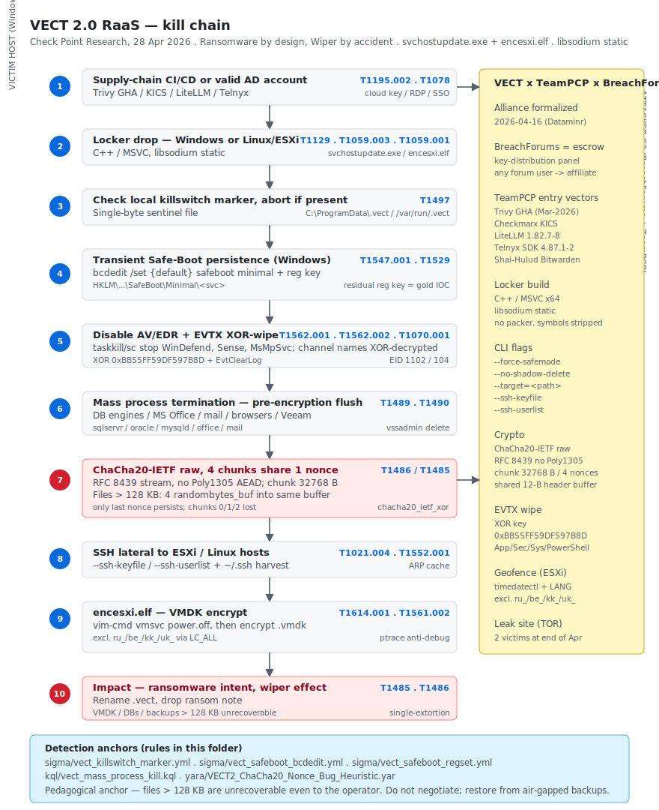

# VECT 2.0 RaaS — Ransomware by design, Wiper by accident (Check Point Research, April 2026)

## TL;DR

VECT is a Russian-speaking Ransomware-as-a-Service that surfaced on a Russian-language cybercrime forum in December 2025 and shipped v2 in February 2026. The v2 release added Linux and ESXi payloads (`encesxi.elf`) next to the original Windows locker (`svchostupdate.exe`). On 28 April 2026 **Check Point Research** published a full technical write-up titled *Ransomware by design, Wiper by accident*. The headline finding is a **fatal cryptographic flaw**: the locker chunks every file larger than 131,072 bytes (128 KB) into four ChaCha20-IETF chunks (RFC 8439, raw stream — *no Poly1305 AEAD*), generates four random 12-byte nonces, and **writes all four nonces into the same shared buffer**. Only the last nonce persists on disk in the footer. The first three chunks of every >128 KB file are therefore **irrecoverable even to the operator** — the master key alone cannot reconstruct them. VECT 2.0 is **ransomware by intent and a wiper by effect** for any file of meaningful size: VMDKs, database files, backups, large office documents. The operational backdrop is just as important: a **VECT x TeamPCP x BreachForums** alliance was formalized on 16 April 2026 (Dataminr), where BreachForums acts as escrow + key-distribution infrastructure and TeamPCP (the same actor that ran Shai-Hulud Bitwarden, covered in day 2026-04-29 of this diary) supplies CI/CD supply-chain entry through trojanized Trivy GitHub Actions, Checkmarx KICS, LiteLLM 1.82.7-8 and Telnyx SDK 4.87.1-2 (March 2026). This case rewrites the *Containment / Recovery* section of NIST 800-61 for any organisation hit by VECT: **paying does not bring large files back**.

## Attribution and confidence

- **Cluster name (vendor):** VECT (Check Point Research, original disclosure 28 April 2026).
- **Aliases:** none widely adopted at time of writing; some affiliate panels label builds `vect20-<affid>`.
- **Vendor that discovered:** **Check Point Research**, 28 April 2026. Secondary coverage by **The Hacker News**, **Help Net Security**, **The Register**, **BleepingComputer**, **JUMPSEC**, **Halcyon**, **Socket** and **Industrial Cyber**.
- **Confidence on the crypto-bug finding:** **high** — independently reproducible by reading the disassembly of either platform variant; Check Point states *"the encryption flaw is identical across all three platform variants"*.
- **Confidence on the alliance with TeamPCP and BreachForums:** **high** — Dataminr posted on 16 April 2026, corroborated by Industrial Cyber and Socket.
- **Confidence on geographic origin:** **medium** — first surfaced on a Russian-language forum, CIS-state geofencing logic in `encesxi.elf`, but no named nation-state nexus.
- **Genealogy / link with previous repo cases:**
  - **TeamPCP** is the same actor behind **Shai-Hulud Bitwarden** (Day 2026-04-29 of this diary). The CI/CD supply-chain compromises chained in March 2026 (Trivy GHA, KICS, LiteLLM, Telnyx SDK) are the most likely **initial-access source** for VECT 2.0 incidents on enterprises that consume those packages.
  - **BreachForums** infrastructure provides the escrow + key-distribution layer; any forum user with an account effectively becomes a VECT affiliate.
  - Historical precedent for "broken ransomware that destroys data": **ONYX (2022)** truncated files above a size threshold; VECT 2.0 is the same failure mode executed industrially with a libsodium-based locker.

## Kill chain — summary table

| Stage | MITRE | Detail |
|---|---|---|
| Initial Access | T1195.002, T1078 | TeamPCP-trojanized CI/CD dependencies (Trivy GHA, KICS, LiteLLM, Telnyx SDK) or valid AD account from a BreachForums IAB |
| Execution | T1059.001, T1059.003, T1129 | cmd.exe, PowerShell, plus the locker itself loading libsodium statically |
| Persistence | T1547.001, T1543.003 | bcdedit /set {default} safeboot minimal + HKLM\...\SafeBoot\Minimal\<svc> (Windows); SSH for Linux/ESXi |
| Privilege Escalation | T1134.001, T1078 | Token duplication from winlogon.exe on Windows; root via SSH on Linux/ESXi |
| Defense Evasion | T1562.001, T1562.002, T1562.004, T1497, T1027, T1070.001 | Stop Defender/Sense/MsMpSvc, ESXi firewall flip, anti-debug, runtime string deobfuscation, XOR-EVTX wipe |
| Credential Access | T1003.001, T1552.001 | LSASS dump (affiliate-supplied); harvest ~/.ssh/id_*, ~/.aws, ~/.docker |
| Discovery | T1518, T1057, T1614.001 | Service enumeration, process listing, system locale check for geofence |
| Lateral Movement | T1021.004 | SSH propagation via --ssh-keyfile + --ssh-userlist |
| Impact | T1486 (intent), T1485 (effect), T1490, T1561.002, T1529 | ChaCha20-IETF raw encryption with broken nonce handling; vssadmin delete shadows; VMDK destruction; bcdedit Safe-Mode reboot |



The diagram lays out a single victim-host lane (left, covering both Windows and Linux/ESXi variants) and an attacker-C2 lane (right) showing the **BreachForums escrow + TeamPCP affiliate panel** plus the technical recipe (libsodium static link, 32 KB chunks, 4-nonce shared header, XOR key `0xBB55FF59DF597B8D`, CIS-state geofence). The two stages shaded in red are the crypto-flaw stage (stage 7) and the impact stage (stage 10) — both reinforce the central teaching point that *any file above 128 KB is destroyed*. Detection anchors at the bottom map directly onto the three Sigma rules, one KQL rule and one YARA rule shipped in this folder.

## Stage-by-stage detail

### Initial Access

Two vectors documented in the public sources:

1. **TeamPCP CI/CD supply chain (T1195.002).** Any pipeline that imported between 1 and 28 March 2026 the trojanized versions of **Trivy GitHub Actions**, **Checkmarx KICS**, **LiteLLM 1.82.7 / 1.82.8** or **Telnyx SDK 4.87.1 / 4.87.2** is potentially compromised. The TeamPCP payload harvests cloud access keys (AWS / GCP / Azure), GitHub PATs, `kubeconfig` and SSH keys from CI/CD runners and posts them to a TeamPCP collector. The collected identities are then handed to VECT affiliates, who pivot from CI/CD into the on-prem environment over RDP, VPN or SSH.
2. **Valid AD account or VPN session (T1078).** BreachForums acts as the marketplace for initial-access brokers (IABs) reselling RDP / VPN / SSO sessions. Affiliate documentation explicitly references "use any working credential set, the panel does the rest".

A representative pivot from a compromised GitHub Actions runner into cloud credentials:

```bash
# Affiliate post-compromise: harvest the runner's IAM role tokens
curl -s http://169.254.169.254/latest/meta-data/iam/security-credentials/ec2-runner \
  | jq -r '.AccessKeyId, .SecretAccessKey, .Token' > /tmp/aws.kv
aws sts get-caller-identity
```

### Execution and string deobfuscation

The Windows loader `svchostupdate.exe` (C++ / MSVC, x64, no packer, PE timestamps in January / February 2026) accepts three CLI flags:

```
--force-safemode      Reboot the host into Safe Mode minimal before encryption
--no-shadow-delete    Skip vssadmin shadow-delete (rare, debug)
--target=<path>       Restrict the scope of encryption
```

Before touching any file, the binary executes the following sequence:

1. Check the **killswitch marker** `C:\ProgramData\.vect` (Windows) or `/var/run/.vect` (Linux/ESXi). It is a single-byte file containing `0x31`. If present, the locker exits silently — this is the affiliate-side anti-double-encryption guard, and it doubles as **the defender's neutralisation primitive**.
2. **Disable AV / EDR** via `taskkill /f /im` plus `sc stop` against `WinDefend`, `Sense`, `MsMpSvc` and a hardcoded list of third-party AV services.
3. **Mass-terminate processes** holding handles to interesting files: SQL Server / Oracle / MySQL / Postgres / MongoDB / Redis, Office (`winword.exe`, `excel.exe`, `powerpnt.exe`, `outlook.exe`, `onenote.exe`), browsers (`firefox.exe`, `msedge.exe`, `chrome.exe`), mail (`thunderbird.exe`), backup software (`veeamservice.exe`, `veeamtransport.exe`), Hyper-V (`vmms.exe`, `vmwp.exe`) and VMware Workstation (`vmware-vmx.exe`). This is what the bundled KQL rule (`kql/vect_mass_process_kill.kql`) catches as a burst pattern.
4. **Deobfuscate strings** in-place. Strings are encrypted at compile time and decrypted on first reference into a single rolling buffer. Check Point describes the result as *"fail-loud"*: any breakpoint on `crypto_stream_chacha20_ietf_xor` exposes the plaintext key and nonce in `R8` / `RDX` (Windows x64 calling convention). MITRE: `T1027`.
5. **Clear EVTX**. Channel names are XOR-obfuscated with the 8-byte key `0xBB55FF59DF597B8D`; after deobfuscation they read `Application`, `Security`, `System` and `Windows PowerShell`, each cleared via `EvtClearLog()`. This leaves the very distinctive Event ID `1102` (Security log cleared) and `104` (System log cleared) traces — **the wipe is loud**, the channel set is the IOC.

MITRE: `T1059.001`, `T1059.003`, `T1129`, `T1562.001`, `T1562.002`, `T1070.001`, `T1027`.

### Persistence — transient Safe-Boot abuse (Windows)

When `--force-safemode` is set, the loader plants a two-step persistence chain:

```cmd
:: 1. Schedule the next boot into Safe Mode minimal
bcdedit /set {default} safeboot minimal

:: 2. Register the encryptor binary as a service that loads in Safe Mode
reg add "HKLM\SYSTEM\CurrentControlSet\Control\SafeBoot\Minimal\svchostupdate" ^
        /ve /t REG_SZ /d "Service" /f

:: 3. Reboot
shutdown /r /t 0 /f
```

After the encryption pass completes inside Safe Mode (where most EDRs are unloaded), the locker **removes** the `safeboot` BCD value so the next boot is normal — to avoid a reboot loop that would draw attention. What it **does not remove** is the registry value under `SafeBoot\Minimal\<svc>`. That residual key is the single highest-signal forensic anchor for VECT 2.0 in the SYSTEM hive: any value under `SafeBoot\Minimal` that is not on the documented Microsoft baseline (`AppMgmt`, `Base`, `sermouse`, `vds`, `msahci`, `partmgr`, `volmgr`, `volsnap`, `VgaSave`, `ws2ifsl`, `volume`, `rdyboost`, `MountMgr`, `Disk`) is suspect.

On Linux / ESXi the locker does **not** persist on the host — once SSH is established the operator does not need a foothold, the encryption pass is one-shot. MITRE: `T1547.001`, `T1529`, `T1543.003`.

### Privilege Escalation

There is no embedded kernel LPE. On Windows the locker tries `OpenProcessToken` + `DuplicateTokenEx` against `winlogon.exe` if it is not already SYSTEM (T1134.001). On Linux / ESXi the operator must already have root via SSH; the binary does not escalate from a non-privileged user. MITRE: `T1134.001`, `T1078`.

### Credential Access — VECT itself, plus affiliate tooling

VECT does **not** ship Mimikatz or a built-in LSASS dumper. The affiliate brings their own (Mimikatz, `nanodump`, `comsvcs.dll MiniDump`). What the locker does ship is an **SSH credential harvester** triggered by `--ssh-keyfile` and `--ssh-userlist`:

- Hosts: `~/.ssh/known_hosts`, `/etc/hosts`, ARP cache.
- Identities: `~/.ssh/id_rsa`, `~/.ssh/id_ed25519`, `~/.aws/credentials`, `~/.docker/config.json`.

The collected key + user matrix is then iterated to spread to neighbouring Linux hosts and ESXi managers. MITRE: `T1003.001` (via affiliate tooling), `T1552.001`.

### Discovery

- `T1518` — service enumeration via `sc query` on Windows, `systemctl list-units` on Linux, used to identify AV services to stop and DB services to kill.
- `T1057` — process listing via `tasklist` / `ps`, feeding the kill list.
- `T1614.001` — system locale check on Linux / ESXi: the loader calls `popen("timedatectl 2>/dev/null", "r")`, parses the `Time zone:` line, and compares it against an internal block list that covers Russia, Belarus, Kazakhstan, Ukraine. It also reads `LANG` and `LC_ALL` from the environment and tests against `ru_*`, `be_*`, `kk_*`, `uk_*`. A match calls `abort()` immediately.

### Lateral Movement

VECT 2.0 uses **SSH only**. The locker invokes its own SSH client over the credential matrix gathered in the *Credential Access* stage; once authenticated it `scp`-deploys `encesxi.elf` to the target host and re-runs the encryption pass there. MITRE: `T1021.004`.

On ESXi specifically the loader enumerates VMs and forces them off so the `.vmdk` files are unlocked for rewrite:

```bash
# Defender reproduction of the ESXi flow (do not run on production)
vim-cmd vmsvc/getallvms
for id in $(vim-cmd vmsvc/getallvms | awk 'NR>1 {print $1}'); do
  vim-cmd vmsvc/power.off "$id" 2>/dev/null
done
esxcli network firewall ruleset set -r sshClient -e true  # T1562.004 firewall flip
```

These calls leave traces in `/var/log/hostd.log`, `/var/log/vmkernel.log` and `/var/log/vobd.log`.

### Collection / Exfiltration

**VECT 2.0 does not exfiltrate.** The model is **single-extortion** — encrypt and demand. This is operationally coherent with the crypto bug: if exfil were part of the offer, victims would pay for *non-publication* instead of for decryption, and the operator would not need to deliver readable plaintext at all. The absence of exfil also makes VECT an outlier next to LockBit, Akira, Qilin, Play and BlackCat, which all rely on double extortion. Affiliates that want double extortion bring `rclone` or `MEGAcmd` themselves; that is not the VECT codebase.

### Impact — the crypto bug

For every file in scope the locker executes the following sequence:

1. Rename in-place from `<original>` to `<original>.vect`.
2. Open `O_RDWR` on Linux or `CreateFileW(GENERIC_READ|GENERIC_WRITE, OPEN_EXISTING)` on Windows.
3. Encrypt in 32,768-byte chunks with **ChaCha20-IETF (RFC 8439) raw** — no Poly1305, no AEAD, no encrypted file-key, no MAC.
4. For files <= 131,072 bytes (128 KB): one chunk, one 12-byte nonce, written to a 12-byte footer. **Recoverable** with the affiliate master key.
5. For files > 131,072 bytes: **four** chunks, **four** 12-byte nonces — and *here is the bug*. The four `randombytes_buf(nonce, 12)` calls write into the **same stack-local 12-byte buffer**, and each `memcpy(header, nonce, 12)` overwrites the previous one. Only the fourth nonce survives in the footer. The first three chunks are mathematically orphaned (12 random bytes = 2^96 search space; the master key cannot help, the nonce is the missing input to the ChaCha20 stream).
6. Persist the marker `C:\ProgramData\.vect` (or `/var/run/.vect`) so a second pass exits early.

On-disk layout per file:

```
[ ciphertext_chunk0 || ciphertext_chunk1 || ciphertext_chunk2 || ciphertext_chunk3 ] || nonce_chunk3(12B)
```

Reconstruction-grade pseudo-C of the broken loop (didactic, not compilable):

```c
unsigned char nonce[crypto_stream_chacha20_ietf_NONCEBYTES];   // 12 B on the stack
unsigned char *header = malloc(NONCE_SIZE_HEADER);             // 12 B header buffer

for (int i = 0; i < 4; i++) {
    randombytes_buf(nonce, sizeof nonce);                      // (a) fresh nonce
    crypto_stream_chacha20_ietf_xor(buf_chunk[i],              // (b) encrypt chunk i
                                    buf_chunk[i],
                                    chunk_len,
                                    nonce, key);
    memcpy(header, nonce, sizeof nonce);                       // (c) BUG: overwrites
}

// On exit only header == nonce of i==3
fwrite(ciphertext, 1, total, fp);
fwrite(header, 1, NONCE_SIZE_HEADER, fp);                      // single nonce persisted
```

The correct implementation needs `memcpy(header + i*12, nonce, 12)` with a 48-byte footer. The fix is one character; the consequence for already-encrypted victims is total. MITRE: `T1486` (intent), `T1485` (effect), `T1561.002` (VMDK destruction), `T1490` (`vssadmin delete shadows /all /quiet`).

## RE notes

Public hashes for VECT 2.0 are published by Check Point Research in the original write-up, but the affiliate model recompiles per-victim and rotates samples; **a hash list is not a robust IOC**. Detection should ride the **behaviour and the residual artefacts**, not file hashes. The reverser working from a private CPR / Halcyon / JUMPSEC feed should expect:

| Component | Platform | Toolchain | Notes |
|---|---|---|---|
| `svchostupdate.exe` | Windows x64 | C++ / MSVC, no UPX, libsodium statically linked | PE timestamps Jan-Feb 2026; CLI flags `--force-safemode`, `--no-shadow-delete`, `--target=<path>` |
| `encesxi.elf` | Linux / ESXi | C++ + glibc dynamic, libsodium static, `--gc-sections`, stripped | Anti-debug `ptrace(PTRACE_TRACEME, ...)`, locale geofence, SSH-lateral flags |

Operational pointers for the analyst:

- Locate the cross-reference to `crypto_stream_chacha20_ietf_xor`. In the chunk loop the **5th argument** (`nonce*`) points at the **same stack offset on every call** — that is the bug. In Ghidra:

  ```
  LAB_chunk_loop:
    CALL  randombytes_buf                     ; rdi = &nonce_local
    CALL  crypto_stream_chacha20_ietf_xor     ; r9  = &nonce_local   <-- invariant across iterations
    ...
    CMP   ebx, 4
    JL    LAB_chunk_loop
  ```

- The EVTX wipe routine XOR-deobfuscates four channel names with the 8-byte LE key `0xBB55FF59DF597B8D`. Dropping a YARA hex pattern on either endianness of that key flags the binary independently of marker paths.
- The ESXi geofence is two `popen("timedatectl ...")` calls plus two `getenv("LANG")` / `getenv("LC_ALL")` reads. A static analyst can fully reproduce the block list from the `.rodata` constants `ru_`, `be_`, `kk_`, `uk_`.
- Set a breakpoint on `crypto_stream_chacha20_ietf_xor` before the chunk loop and dump `R8` (key) and `R9` (nonce). The **same key persists per-affiliate per-victim**; if you have a live host with the locker process still mapped, **a memory dump yields the key** and recovers all files <= 128 KB.

## Detection strategy

### Telemetry that matters

- **Windows endpoints (Sysmon / Microsoft Defender for Endpoint):** EID 1 (process creation — `bcdedit`, `vssadmin`, `taskkill`), EID 7 (image load — libsodium inside an unexpected process), EID 11 (file create — `C:\ProgramData\.vect`), EID 13 (registry value set — `SafeBoot\Minimal\<svc>`), EID 23 (file delete — log files).
- **Windows Security log:** 4688 (process), 4663 (file modification — mass), 1102 (Security log cleared), 104 (System log cleared).
- **PowerShell:** 4104 script-block — `Stop-Service WinDefend`, EVTX manipulation.
- **Linux auditd:** `execve` of `timedatectl`, `vim-cmd vmsvc/power.off`, mass writes to `*.vmdk`.
- **ESXi:** `/var/log/hostd.log`, `/var/log/auth.log`, `/var/log/vmkernel.log`, `/var/log/vobd.log`, `/scratch/log/`.
- **EDR behaviour rules:** mass process termination burst + `bcdedit safeboot minimal` + `.vect` file creations in a 5-minute window.

### Detection coverage

| Engine | File | Logic |
|---|---|---|
| Sigma | [`sigma/vect_killswitch_marker.yml`](./sigma/vect_killswitch_marker.yml) | File-event creation of `C:\ProgramData\.vect` (the marker is the operator's own anti-double-encrypt guard) |
| Sigma | [`sigma/vect_safeboot_bcdedit.yml`](./sigma/vect_safeboot_bcdedit.yml) | `bcdedit.exe` command line containing `safeboot` + `minimal` |
| Sigma | [`sigma/vect_safeboot_regset.yml`](./sigma/vect_safeboot_regset.yml) | Registry value set under `HKLM\SYSTEM\CurrentControlSet\Control\SafeBoot\Minimal\` (residual gold IOC) |
| KQL (Defender XDR / Sentinel) | [`kql/vect_mass_process_kill.kql`](./kql/vect_mass_process_kill.kql) | Burst of `ProcessTerminated` against DB / Office / mail / browser / backup binaries in a 60-second window with >= 5 distinct targets and >= 10 kills |
| YARA | [`yara/VECT2_ChaCha20_Nonce_Bug_Heuristic.yar`](./yara/VECT2_ChaCha20_Nonce_Bug_Heuristic.yar) | Multi-platform PE+ELF heuristic — marker path, `0xBB55FF59DF597B8D` XOR key on either endianness, `crypto_stream_chacha20_ietf` symbol, `.vect` extension, SSH-lateral CLI flags, geofence strings |

### Threat-hunting hypotheses

**H1 — "Three-of-three: marker + bcdedit safeboot + mass `.vect` rename in 14 days".** On any single host, look for at least one of the three indicators within a 14-day window. None of the three is benign on its own at scale; the joint occurrence is fatal.

```kql
union
(DeviceFileEvents
   | where Timestamp > ago(14d)
   | where ActionType == "FileCreated"
   | where FolderPath =~ @"C:\ProgramData\" and FileName == ".vect"
   | extend indicator = "killswitch_marker"),
(DeviceProcessEvents
   | where Timestamp > ago(14d)
   | where ProcessCommandLine has_all ("bcdedit", "safeboot", "minimal")
   | extend indicator = "bcdedit_safemode"),
(DeviceFileEvents
   | where Timestamp > ago(14d)
   | where ActionType == "FileRenamed" and FileName endswith ".vect"
   | summarize hits = count() by DeviceId, bin(Timestamp, 5m)
   | where hits >= 50
   | extend indicator = "mass_rename_vect")
| project Timestamp, DeviceId, indicator
| summarize indicators = make_set(indicator),
            first = min(Timestamp),
            last  = max(Timestamp)
            by DeviceId
| where array_length(indicators) >= 1
| order by last desc
```

**H2 — "Residual SafeBoot\Minimal rogue value in the fleet".** Even months after the encryption event, the residual registry value under `HKLM\...\SafeBoot\Minimal\<svc>` survives. A fleet-wide live query lists hosts that may have been touched by VECT 2.0 in the past, including hosts that were restored from backup without rotating credentials.

```powershell
Get-ChildItem 'HKLM:\SYSTEM\CurrentControlSet\Control\SafeBoot\Minimal' |
  Where-Object { $_.PSChildName -notin @(
    'AppMgmt','Base','sermouse','vds','msahci','partmgr','volmgr','volsnap',
    'VgaSave','ws2ifsl','volume','rdyboost','MountMgr','Disk') } |
  Select-Object PSChildName,
    @{n='LegacyDefault'; e={ (Get-ItemProperty $_.PSPath).'(default)' }}
```

**H3 — "libsodium loaded by an unexpected process tree".** On Windows, the locker statically links libsodium so there is no DLL load to track; on Linux the symbol `crypto_stream_chacha20_ietf_xor` shows in `objdump -T` only for legitimate consumers (`hashcat`, `monerod`, `signal-cli`). Any process that links libsodium **and** writes to `~/.ssh` keys or `*.vmdk` is high-signal.

## Incident response playbook

### First 60 minutes (triage)

1. **Isolate** affected hosts at the network layer (EDR contain, NAC, switch port shutdown) — but do **not** power them off. The decryption key may still be in RAM.
2. **Capture RAM** before anything else. Windows: `WinPMEM`, Magnet RAM Capture, `winpmem -o ram.aff4`. Linux: `LiME`. ESXi: `vm-support --performance` plus a datastore snapshot. The locker uses `crypto_stream_chacha20_ietf_xor` with a key resident in process memory; a Volatility 3 plugin scanning the chunk-loop stack frame can recover the affiliate key and unlock all files <= 128 KB.
3. **Plant the killswitch on hosts not yet encrypted.** This is *the* short-term mitigation while you containment-scan the rest of the estate:

   ```cmd
   :: Windows
   echo 1 > C:\ProgramData\.vect
   icacls C:\ProgramData\.vect /inheritance:r /grant:r "Everyone:R"
   ```
   ```bash
   # Linux / ESXi
   touch /var/run/.vect && chmod 0444 /var/run/.vect
   ```

   The locker reads the marker before doing anything destructive and exits silently when it finds it. Plant it everywhere fast.
4. **Do not reboot.** If `bcdedit /set {default} safeboot minimal` is already planted, the next boot lands in Safe Mode with the encryptor service registered to run. Inspect the BCD store first:

   ```cmd
   bcdedit /enum {default}
   :: if "safeboot Minimal" is present:
   bcdedit /deletevalue {default} safeboot
   ```

5. **Take cloud / hypervisor snapshots.** If on ESXi, `vmkfstools` clone any uncorrupted VMDK offline before the locker re-runs.
6. **Notify legal + crisis comms.** This is a NIST 800-61 Containment-Recovery decision: payment does not bring back files above 128 KB.

### Artefacts to collect

| Artefact | Path | Tool | Why it matters |
|---|---|---|---|
| Killswitch marker | `C:\ProgramData\.vect` / `/var/run/.vect` | live FS | Single highest-confidence IOC |
| Residual SafeBoot rogue service | `HKLM\SYSTEM\CurrentControlSet\Control\SafeBoot\Minimal\<svc>` | `reg query`, RegRipper | Survives the locker's own cleanup |
| Encryptor binary | `%PROGRAMDATA%\<random>\svchostupdate.exe`, `%TEMP%\svchostupdate.exe`, `/tmp/encesxi.elf`, `/var/tmp/encesxi.elf` | `Get-ChildItem -Recurse`, `find / -name encesxi.elf` | For RAM dump correlation and YARA validation |
| Prefetch | `C:\Windows\Prefetch\SVCHOSTUPDATE.EXE-*.pf` | `PECmd` | Confirms execution + run count |
| Amcache | `C:\Windows\AppCompat\Programs\Amcache.hve` (`Root\InventoryApplicationFile`) | `AmcacheParser` | Persists the SHA1 + file path even after deletion |
| ShimCache | `SYSTEM\CurrentControlSet\Control\Session Manager\AppCompatCache` | `AppCompatCacheParser` | Persists execution name + path |
| EVTX cleared traces | `Security` 1102, `System` 104 | `EvtxECmd` | Confirms wipe time and account that cleared |
| USN journal | `$UsnJrnl:$J` on the system volume | `MFTECmd` | Reconstructs the mass-rename burst with microsecond precision |
| ESXi logs | `/var/log/hostd.log`, `/var/log/vmkernel.log`, `/var/log/auth.log`, `/var/log/vobd.log` | manual / Velociraptor | SSH session + `vim-cmd power.off` traces |
| RAM | full physical memory | `WinPMEM` / `LiME` / Magnet | Affiliate ChaCha20 key recovery for <= 128 KB files |

### IR queries and commands

```powershell
# Defender for Endpoint Live Response — rogue SafeBoot\Minimal services
Get-ChildItem 'HKLM:\SYSTEM\CurrentControlSet\Control\SafeBoot\Minimal' |
  Where-Object { $_.PSChildName -notin @('AppMgmt','Base','sermouse','vds',
    'msahci','partmgr','volmgr','volsnap','VgaSave','ws2ifsl','volume',
    'rdyboost','MountMgr','Disk') } |
  Format-Table PSChildName

# Reconstruct the mass-rename burst from the USN journal
fsutil usn readjournal C: csv | findstr /I ".vect"

# Revert the Safe-Boot pivot
bcdedit /enum {default}
bcdedit /deletevalue {default} safeboot
```

```bash
# Linux / ESXi — find the binary and the marker
find / \( -name 'encesxi.elf' -o -name '.vect' \) -xdev 2>/dev/null

# Audit log — confirm geofence + ESXi calls
ausearch -k execve --start recent | grep -E '(timedatectl|vim-cmd|sshpass)'

# ESXi — host events
grep -E "(power.off|getallvms|encesxi)" /var/log/hostd.log /var/log/vmkernel.log
```

```kql
// Defender XDR — single-device triage (last 14 days)
DeviceEvents
| where Timestamp > ago(14d)
| where DeviceId == "<add_device_id>"
| where ActionType in ("FileCreated", "FileRenamed", "ProcessTerminated",
                       "ProcessCreated", "RegistryValueSet", "LogClear")
| where (FileName == ".vect")
     or (FileName endswith ".vect")
     or (RegistryKey has "SafeBoot\\Minimal")
     or (ProcessCommandLine has_any ("bcdedit", "vssadmin", "taskkill"))
| order by Timestamp asc
```

### Containment, eradication, recovery

- **Containment:** revoke IdP tokens (`Revoke-MgUserSignInSession` in Entra ID; equivalent in Okta / PingOne), block the suspected affiliate at the VPN concentrator, plant the killswitch marker across the fleet, kill outbound SSH and HTTPS from the bastion host until scoped.
- **Eradication:** revert `bcdedit safeboot`, delete the `SafeBoot\Minimal\<svc>` rogue value, remove the locker binary and the marker, rebuild from gold image any host where Safe-Mode boot ran. **Rotate every credential that touched CI/CD between 1 March and 28 April 2026** — AWS / GCP / Azure access keys, GitHub PATs, SSH private keys, Kubernetes service-account tokens — because the TeamPCP supply-chain leg may have harvested them.
- **Recovery:** restore from **air-gapped backups dated before the first `.vect` rename**. Verify integrity by SHA256 against known-good gold. For files between 0 and 128 KB on hosts where you captured RAM, attempt offline recovery with a memory-extracted ChaCha20 key; for files above 128 KB, accept loss and proceed.
- **Validation:** 30 days of no `.vect` file creations, no rogue `SafeBoot\Minimal\<svc>`, no new ChaCha20-IETF symbol load by a process tree that ends in `svchostupdate.exe`, no anomalous outbound SSH from non-jumphost VLANs.

**What NOT to do:**

- **Do not negotiate.** Files larger than 128 KB cannot be decrypted, *even by the operator*. The crypto bug is documented and public; the affiliate can supply the key and the victim still cannot rebuild the missing nonces. Paying funds the alliance and recovers nothing meaningful for VMDKs / DBs / backups.
- **Do not power the host off** before RAM capture. The decryption key for the <= 128 KB subset is in process memory only as long as the locker is mapped.
- **Do not reboot** with `safeboot minimal` planted — the next boot is *in Safe Mode with the locker registered as a service*.
- **Do not restore backups without rotating credentials first.** TeamPCP harvested CI/CD identities; restoring a clean image with the same SSH key just re-opens the door.
- **Do not rely on hash blocklists alone.** Affiliate-recompiled samples rotate fast; ride the behaviour and the residual registry artefact instead.

## IOCs

| Type | Value | Context | Confidence | Source |
|---|---|---|---|---|
| filename | `svchostupdate.exe` | Windows locker | High | Check Point Research |
| filename | `encesxi.elf` | Linux / ESXi locker | High | Check Point Research |
| filepath | `C:\ProgramData\.vect` | Killswitch / marker (Windows) | High | Check Point Research |
| filepath | `/var/run/.vect` | Killswitch / marker (Linux) | High | Check Point Research |
| extension | `.vect` | Encrypted file extension | High | Check Point Research |
| registry | `HKLM\SYSTEM\CurrentControlSet\Control\SafeBoot\Minimal\<svc>` | Transient persistence + residual gold IOC | High | Check Point Research |
| const | `0xBB55FF59DF597B8D` | XOR key for EVTX channel-name deobfuscation | High | Check Point Research |
| process_chain | `bcdedit /set {default} safeboot minimal` + `reg add ... SafeBoot\Minimal` | Two-step Safe-Boot persistence | High | Check Point Research |
| ttp | `--ssh-keyfile` / `--ssh-userlist` CLI flags | SSH lateral movement primitive | High | Check Point Research |
| ttp | `timedatectl` + `LANG` + `LC_ALL` matched against `ru_/be_/kk_/uk_` | ESXi CIS-state geofence | High | Check Point Research |
| ttp | ChaCha20-IETF raw, four chunks share one 12-B nonce buffer | Crypto bug — files > 128 KB destroyed | High | Check Point Research |
| infra | VECT leak site (TOR) | Two victims at end of April 2026 | Medium | Halcyon, Check Point Research |
| note | Hashes rotate per-affiliate per-victim — behaviour-and-path detection only | IR doctrine | High | This diary |

Full list with all context fields lives in [`iocs.csv`](./iocs.csv).

## Secondary findings

- **CISA KEV adds CVE-2026-41940 — cPanel & WHM authentication bypass (30 April 2026).** CRLF injection in the cookie `whostmgrsession` enables arbitrary `user=root` session takeover. Exploited in the wild; federal remediation deadline 21 May 2026. Treat as an exploit-kit-imminent edge auth bug, and instrument web access logs for anomalous `whostmgrsession` cookie shapes containing `%0D%0A` sequences.
- **Nightmare-Eclipse intrusion cluster — BlueHammer + RedSun + UnDefend (Huntress, 28 April 2026).** Real-world intrusion entered via a compromised **FortiGate SSL VPN** from a Russian IP, escalated via **CVE-2026-33825** (BlueHammer — LPE TOCTOU in Microsoft Defender, patched on the April Patch Tuesday), and persisted with two further unpatched tools (RedSun, UnDefend). Excellent Windows detection-engineering case study; correlate with the VECT 2.0 pre-encryption stage where AV / EDR is stopped.
- **ABB AWIN GW100 / GW120 ICS gateways — CISA ICSA-26-120-05 (30 April 2026).** Three vulnerabilities including unauthenticated adjacent reboot and configuration leakage; relevant to OT estates that bridge IT / OT and that consume the same TeamPCP-tainted CI/CD pipelines on the IT side.

## Pedagogical anchors

- **The single most important slide:** *files larger than 128 KB cannot be decrypted, even by the operator.* Paying funds the alliance and does not recover VMDKs / databases / backups / large documents. This belongs at the top of every executive briefing for any organisation hit by VECT 2.0.
- **The killswitch marker doubles as a free defensive tool.** `C:\ProgramData\.vect` on Windows and `/var/run/.vect` on Linux / ESXi cause the locker to exit silently. Pre-plant it on every host as a stopgap while you contain. This is unusual; most modern lockers do not ship a defender-friendly side-door.
- **Residual artefacts are the durable IOC.** The locker cleans `bcdedit safeboot` after the encryption pass but **leaves the `SafeBoot\Minimal\<svc>` registry value** behind. That value persists weeks after the incident and is high-signal during fleet sweeps.
- **EVTX wipe is loud.** The locker XOR-deobfuscates `Application`, `Security`, `System`, `Windows PowerShell` and calls `EvtClearLog()`. The wipe leaves Event ID 1102 and 104, and the channel set is the fingerprint.
- **Hashes are not the IOC; behaviour is.** Affiliate-side recompilation rotates samples per victim. Ride `.vect` + `SafeBoot\Minimal` + `0xBB55FF59DF597B8D` + mass `ProcessTerminated` burst instead.
- **The crypto bug rewrites the IR decision tree.** A locker without a working decryptor turns *every* incident into a wiper incident at the threshold of 128 KB. Containment-Recovery from NIST 800-61 must explicitly state *do not negotiate* in the runbook.
- **The TeamPCP supply-chain leg is the credential-rotation trigger.** Even if your organisation never sees a `.vect` file, if you consumed Trivy GHA / Checkmarx KICS / LiteLLM 1.82.7-8 / Telnyx SDK 4.87.1-2 in March 2026, rotate every CI/CD secret. The same identity pool fuels VECT 2.0 affiliates.

## What's in this folder

| File | Purpose |
|---|---|
| [`README.md`](./README.md) | This case write-up |
| [`kill_chain.svg`](./kill_chain.svg) | Single-page kill-chain diagram |
| [`sigma/vect_killswitch_marker.yml`](./sigma/vect_killswitch_marker.yml) | Sigma — `C:\ProgramData\.vect` file creation |
| [`sigma/vect_safeboot_bcdedit.yml`](./sigma/vect_safeboot_bcdedit.yml) | Sigma — `bcdedit safeboot minimal` command line |
| [`sigma/vect_safeboot_regset.yml`](./sigma/vect_safeboot_regset.yml) | Sigma — `SafeBoot\Minimal\<svc>` registry value set |
| [`kql/vect_mass_process_kill.kql`](./kql/vect_mass_process_kill.kql) | KQL — mass `ProcessTerminated` burst against DB / Office / mail / browser / backup binaries |
| [`yara/VECT2_ChaCha20_Nonce_Bug_Heuristic.yar`](./yara/VECT2_ChaCha20_Nonce_Bug_Heuristic.yar) | YARA — multi-platform PE+ELF heuristic (marker + XOR key + libsodium + .vect + SSH-lateral flags + geofence) |
| [`iocs.csv`](./iocs.csv) | All VECT 2.0 indicators with context |

## Sources

- [Check Point Research — VECT: Ransomware by design, Wiper by accident (28 Apr 2026)](https://research.checkpoint.com/2026/vect-ransomware-by-design-wiper-by-accident/)
- [The Hacker News — VECT 2.0 Ransomware Irreversibly Destroys Files Over 131 KB on Windows, Linux, ESXi](https://thehackernews.com/2026/04/vect-20-ransomware-irreversibly.html)
- [Help Net Security — Buggy Vect ransomware is effectively a data wiper, researchers find (29 Apr 2026)](https://www.helpnetsecurity.com/2026/04/29/vect-ransomware-bug/)
- [The Register — Don't pay VECT a ransom — your big files are likely gone (28 Apr 2026)](https://www.theregister.com/2026/04/28/dont_pay_vect_a_ransom/)
- [BleepingComputer — Broken VECT 2.0 ransomware acts as a data wiper for large files](https://www.bleepingcomputer.com/news/security/broken-vect-20-ransomware-acts-as-a-data-wiper-for-large-files/)
- [JUMPSEC — Bugs & Betrayal — Vect Analysis](https://www.jumpsec.com/guides/vect-ransomware-analysis/)
- [Industrial Cyber — Vect formalizes BreachForums and TeamPCP alliance (16 Apr 2026)](https://industrialcyber.co/ransomware/vect-formalizes-breachforums-and-teampcp-alliance-to-push-model-for-industrialized-ransomware-scale-raas-operations/)
- [Socket — TeamPCP partners with Vect targeting OSS supply chains](https://socket.dev/blog/teampcp-partners-with-vect-targeting-oss-supply-chains)
- [RFC 8439 — ChaCha20 and Poly1305 for IETF Protocols](https://datatracker.ietf.org/doc/html/rfc8439)
- [CISA — Adds One Known Exploited Vulnerability to Catalog: CVE-2026-41940 (30 Apr 2026)](https://www.cisa.gov/news-events/alerts/2026/04/30/cisa-adds-one-known-exploited-vulnerability-catalog)
- [Huntress — Nightmare-Eclipse Tooling Seen in Real-World Intrusion (28 Apr 2026)](https://www.huntress.com/blog/nightmare-eclipse-intrusion)
- [CISA — ICSA-26-120-05: ABB AWIN GW100/GW120 (30 Apr 2026)](https://www.cisa.gov/news-events/ics-advisories/icsa-26-120-05)
