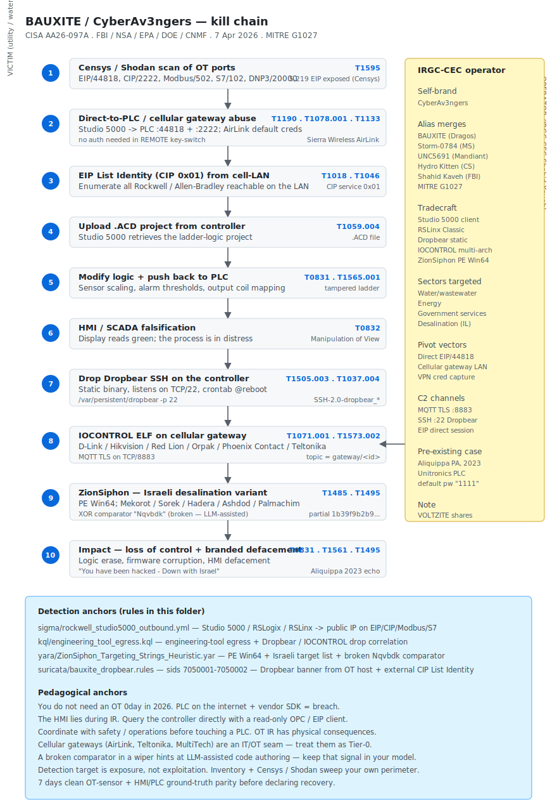

# BAUXITE / CyberAv3ngers (IRGC-CEC) — Direct-to-PLC tradecraft against Rockwell/Allen-Bradley (CISA AA26-097A, April 2026)

## TL;DR

CISA, FBI, NSA, EPA, DOE and CNMF jointly published **Advisory AA26-097A** on 7 April 2026, formalising what Dragos has tracked as **BAUXITE** and what the FBI calls the **Shahid Kaveh Group** of Iran's IRGC-CEC: a multi-vendor cluster (CyberAv3ngers / Storm-0784 / UNC5691 / Hydro Kitten / **MITRE G1027**) that since late 2023 has been mass-targeting **internet-exposed Rockwell Automation / Allen-Bradley PLCs** in water-utility, energy and government-services networks. The tradecraft is operationally embarrassing for the defenders: no 0day, no novel implant — just the vendor's own engineering tool, **Studio 5000 Logix Designer**, pointed directly at a PLC on the public internet on EIP TCP/44818 plus CIP TCP/2222, with the operator extracting, modifying and redeploying the `.ACD` ladder-logic project and dropping **Dropbear SSH on the controller itself** for durable persistence. Censys catalogued 5,219 EIP-exposed hosts in the public internet, 74.6 % in the United States. In parallel, Darktrace reported the same cluster running a Windows-side implant called **ZionSiphon** against the Israeli desalination chain (Mekorot, Sorek, Hadera, Ashdod, Palmachim, Shafdan); the binary is technically broken (the XOR comparator does not produce the hardcoded constant `Nqvbdk`) — almost certainly LLM-assisted code. Pivot points include Sierra Wireless AirLink cellular gateways (overlap with VOLTZITE / Volt Typhoon) and Claroty Team82's **IOCONTROL** ELF implant on D-Link / Hikvision / Red Lion / Orpak / Phoenix Contact / Teltonika devices with MQTT-TLS C2 on TCP/8883. The defender lesson is durable and uncomfortable: in 2026, OT is breached by inviting the vendor's SDK in through the front door — and the HMI lies during the response.

## Attribution and confidence

- **Cluster name (multi-vendor):** **CyberAv3ngers** (operator self-brand) = **BAUXITE** (Dragos) = **Storm-0784** (Microsoft) = **UNC5691** (Mandiant) = **Hydro Kitten** (CrowdStrike) = **Shahid Kaveh Group** (FBI) = **MITRE G1027**.
- **Affiliation:** Iran IRGC-CEC (Cyber & Electronic Command). The FBI's group name `Shahid Kaveh` is the public attribution to a specific IRGC subordinate unit. Confidence is **high** — every major OT and CTI vendor has independently converged on the same operational fingerprint over more than 18 months of observation.
- **Vendor that discovered:** CISA + FBI + NSA + EPA + DOE + CNMF (advisory AA26-097A, 7 April 2026). Corroboration from Censys (5,219 EIP hosts publicly exposed, attack-surface follow-up), Darktrace (ZionSiphon, April 2026), Krypt3ia (IRGC OT/IoT malware evolution, 30 April 2026), and Dragos (`BAUXITE` Year in Review 2026).
- **Victimology:** US water and wastewater systems (Aliquippa PA municipality is the canonical 2023 case), energy sector and government services & facilities in US municipalities; Israeli water and desalination operators. Sectoral focus reflects IRGC interest in critical infrastructure with politically resonant targeting.
- **Genealogy:** clean lineage from the 2023 Aliquippa Rockwell PLC incident through 2024-2025 expansion onto cellular gateways and into the IOCONTROL family. Distinct from VOLTZITE (China-nexus, Volt Typhoon-class) but they overlap structurally in the **IT/OT-bridge** primitive: cellular gateway exposed to the internet → internal OT segment reachable through the gateway's LAN-side bridge.

## Kill chain — summary table

| Stage | MITRE | Detail |
|---|---|---|
| Reconnaissance | T1595 | Censys / Shodan / mass internet scans for EIP TCP/44818, CIP TCP/2222, Modbus TCP/502, S7 TCP/102, Siemens VPN exposure |
| Resource Development | T1588.005 | Studio 5000 Logix Designer (legitimate engineering tool), Dropbear SSH static binary, IOCONTROL ELF builds per device family |
| Initial Access | T1190, T1078.001, T1133 | Direct connect to PLC EIP/44818 + 2222 (no auth required by default on many Rockwell deployments); default credentials on cellular gateways; VPN access via captured credentials |
| Execution | T1059.004 | Native ladder-logic engineering tooling — the PLC accepts the operator's session as legitimate |
| Persistence | T1505.003, T1037.004 | Dropbear SSH static binary deployed on PLC opens TCP/22 as durable on-controller persistence |
| Privilege Escalation | T1098 | Engineering credentials harvested from compromised IT side or default-vendor credentials on the cellular gateway |
| Discovery | T1018, T1046 | Internal port scan from the cellular gateway LAN side; EIP `List Identity` (CIP service code 0x01 over TCP/44818) reveals every Rockwell device in reach |
| Lateral Movement | T1021.004 | SSH from cellular gateway / IT pivot box onto PLC engineering ports; Dropbear-on-PLC reused as jump host into other OT subnets |
| Command and Control | T1071.001, T1095, T1573.002 | MQTT-TLS on TCP/8883 (IOCONTROL); SSH (Dropbear); direct Studio 5000 sessions from operator workstation |
| Impact — ICS | T0831, T0832 | **Loss of Control** through tampered ladder logic; **Manipulation of View** — HMI / SCADA shows green while the PLC is running modified code |
| Impact | T1485, T1495, T1561, T1565.001 | Logic erase / firmware corruption / branding overlay on HMIs ("You have been hacked — Down with Israel"); data manipulation on storage and sensor scaling |



The diagram has three lanes: the victim utility (left — engineering workstation, HMI/SCADA, PLC fleet, cellular gateway), the cellular ASN / public internet (centre), and the operator infrastructure (right — Studio 5000 client, Dropbear deploy bundle, IOCONTROL builder, ZionSiphon variant). The HMI lies in stage 9 — the SCADA display continues to report green while the PLC runs the operator's modified ladder logic. The detection-anchors box at the bottom maps to the Sigma rule on engineering-tool egress, the KQL hunt on engineering-tool egress + Dropbear drop, the YARA rule on ZionSiphon and the Suricata rule on Dropbear-banner-from-PLC + external `List Identity`.

## Stage-by-stage detail

### Reconnaissance

CISA and Censys both publish counts of internet-exposed industrial endpoints. The operator does not need a 0day; they need a list. Search dorks of the shape `port:44818` (EIP), `port:2222` (CIP class 1 I/O), `port:102` (S7), `port:502` (Modbus), `port:20000` (DNP3) on Shodan / Censys return thousands of PLCs every week. Cellular ASNs (Sierra Wireless, Bell, AT&T, Verizon Business IoT) hold an outsized share of the exposure: a remote pump-station typically sits behind a cellular gateway that NATs management ports straight to the PLC LAN. MITRE: `T1595`.

### Resource Development

The operator's "toolbox" is mostly **legitimate vendor software**:

- **Studio 5000 Logix Designer** (Rockwell's engineering IDE) — handles the `.ACD` project file, drives EIP/CIP communications to the PLC, performs program upload / download.
- **RSLinx Classic** — connection broker between Studio 5000 and the controller.
- **Dropbear SSH** static binary for ARM / PowerPC / MIPS — the controller-side persistence anchor.
- **IOCONTROL** ELF (Claroty Team82) — multi-arch implant for D-Link / Hikvision / Red Lion / Orpak / Phoenix Contact / Teltonika devices.
- **ZionSiphon** PE Win64 — the Windows-side cousin for Israeli desalination targets.

MITRE: `T1588.005`.

### Initial Access

Three parallel paths:

1. **Direct-to-PLC.** Connect Studio 5000 to the controller IP on TCP/44818 (EIP encapsulation) plus TCP/2222 (CIP class 1 implicit messaging). Many Rockwell deployments accept the engineering session without authentication, especially with the controller key-switch in `REMOTE`. MITRE: `T1190`, `T1078.001` (if credentials are required, default or harvested).
2. **Cellular gateway abuse.** Sierra Wireless AirLink ALEOS, MultiTech, Teltonika — default-credential or known-CVE exposure of the management plane, then the LAN side of the gateway is the operator's foothold inside the OT segment. MITRE: `T1133`.
3. **IT-side compromise.** Credentials phished or password-sprayed against the engineer's Citrix / VPN, then RDP to the engineering workstation that already has Studio 5000 + RSLinx + the saved `.ACD` files. MITRE: `T1078`, `T1133`.

### Execution and Persistence — Dropbear on PLC

After initial access, the operator drops a static Dropbear SSH binary onto the controller and configures it to listen on TCP/22. The persistence is **on the PLC itself** — surviving reboots if the firmware exposes a writable filesystem partition. The hashes of the static Dropbear builds used (ARM / PowerPC) are public via the Claroty Team82 disclosure. MITRE: `T1505.003`, `T1037.004`.

```bash
# Operator-side checklist on the PLC after Dropbear drop
echo "AllowAnonymousRoot yes" >> /etc/dropbear/config
chmod +x /var/persistent/dropbear
nohup /var/persistent/dropbear -p 22 -F &
echo '@reboot /var/persistent/dropbear -p 22' >> /var/spool/cron/crontabs/root
```

### Ladder-logic modification

The `.ACD` project file is downloaded from the PLC, opened in Studio 5000 on the operator's workstation, modified (sensor scaling, alarm thresholds, output coil mapping, sub-routine substitution) and uploaded back to the controller. Because the changes are *legitimate* engineering events from the controller's perspective, the audit log records them as authorised. The HMI, which reads tag values from the controller via OPC / EtherNet/IP, **continues to display the original presentation** while the underlying logic now does something different — **MITRE for ICS T0832 Manipulation of View**. MITRE: `T0831`, `T0832`, `T1565.001`.

### Lateral Movement

Once Dropbear is on a controller, that controller becomes the operator's pivot into the rest of the OT segment. SSH from one PLC to another, internal EIP / Modbus scans from the controller LAN, hunting for HMIs and historian databases. The cellular gateway is the inbound pivot; the PLC fleet becomes the lateral mesh. MITRE: `T1021.004`, `T1018`, `T1046`.

### Command and Control — three channels

- **MQTT-TLS on TCP/8883** — IOCONTROL builds. The `topic` namespace looks like real OT telemetry; the certificate often uses commodity Let's Encrypt issuance.
- **SSH on TCP/22 (Dropbear)** — interactive controller access; survives the IT-side cleanup that the SOC is concentrating on.
- **Direct Studio 5000 sessions** — operator's IP -> PLC EIP. Looks like an engineer working remotely.

MITRE: `T1071.001`, `T1095`, `T1573.002`.

### Impact — ICS

- **T0831 Loss of Control** — the operator's ladder logic now runs, and operator actions through HMI may be undone or ignored.
- **T0832 Manipulation of View** — HMI shows green while the process is in distress.
- **T1485 / T1495 / T1561** — logic erase, firmware corruption, branding overlay on HMIs (the historical Aliquippa screen showed "You have been hacked — Down with Israel" on a Unitronics PLC).

The Aliquippa 2023 incident illustrates the scale: a single municipal water utility had a pump-station Unitronics PLC defaced with a political message because the device was on the internet with the default `1111` password.

## RE notes

ZionSiphon (Darktrace, April 2026):

| Component | SHA256 | Lang / build | Notes |
|---|---|---|---|
| ZionSiphon dropper | partial `1b39f9b2b96a6586c4a11ab2fdbff8fdf16ba5a0ac7603149023d73f3...` | PE Win64 | Hardcoded target list of Israeli desalination operators (Mekorot, Sorek, Hadera, Ashdod, Palmachim, Shafdan); comparator `EncryptDecrypt("Israel", 5)` against constant `Nqvbdk` does not produce the expected output — **broken code** consistent with LLM-assisted authoring without compilation validation |
| IOCONTROL | multi-arch ELF | C / static libs | D-Link DIR-x, Hikvision, Red Lion, Orpak fuel-station controllers, Phoenix Contact, Teltonika; config XOR-encrypted; MQTT TLS C2 on `:8883`; Mosquitto-style topic namespace mimicking legitimate telemetry |
| Dropbear (controller-side) | static binaries per arch | C | Stock Dropbear, no anti-analysis, just deployed where a controller would never normally see one |

Reverser pointers:

- **ZionSiphon's broken comparator** is itself a useful YARA anchor: the operator left the constant `Nqvbdk` in the binary together with the target list. Combine those two anchors with the XOR primitive and a filesize bound.
- **IOCONTROL's MQTT topic strings** are visible in the binary because the operator embeds them as ASCII for runtime use. The topic shape resembles legitimate `gateway/<id>/status` patterns but the cardinality of distinct topic prefixes is low — a few hundred at most across the cluster.
- **Dropbear-from-PLC** is recognisable in Suricata by the banner string `SSH-2.0-dropbear_<ver>` sourced from an OT host. There is no benign reason for a PLC to advertise an SSH banner unless an engineer has explicitly deployed an SSH bastion onto it.

## Detection strategy

### Telemetry that matters

- **OT network sensor / Zeek / Suricata at the IT-OT boundary** — every EIP/CIP/Modbus/S7 flow. An engineering workstation talking to a public IP on TCP/44818 is the operator-side detection. A PLC sourcing an SSH banner is the controller-side detection.
- **PLC engineering audit logs** — Rockwell controllers maintain a project download / firmware update history. Spikes outside the documented change window are the gold signal.
- **HMI vs PLC ground truth comparison** — periodically poll the controller for tag values via a *separate* read-only OPC client and diff against the HMI presentation. Divergence is `T0832`.
- **Cellular gateway management-plane logs** — Sierra Wireless AirLink ALEOS audit and Teltonika RUTOS logs catch the inbound side.
- **IT-side EDR** — engineering workstation processes (`Studio5000.exe`, `RSLogix5000.exe`, `RSLinx*.exe`) initiating outbound to a public, non-RFC1918 IP on engineering ports.

### Detection coverage

| Engine | File | Logic |
|---|---|---|
| Sigma | [`sigma/rockwell_studio5000_outbound.yml`](./sigma/rockwell_studio5000_outbound.yml) | `Studio5000.exe` / `RSLogix5000.exe` / `RSLinx*.exe` initiating an outbound TCP connection on 44818 / 2222 / 502 / 102 to a non-RFC1918 destination |
| KQL (Sentinel / Defender XDR) | [`kql/engineering_tool_egress.kql`](./kql/engineering_tool_egress.kql) | DeviceNetworkEvents — engineering tool egress + correlation to file events that drop Dropbear / IOCONTROL on a controller candidate |
| YARA | [`yara/ZionSiphon_Targeting_Strings_Heuristic.yar`](./yara/ZionSiphon_Targeting_Strings_Heuristic.yar) | PE Win64 + Israeli target operator names + broken comparator `Nqvbdk` + XOR / EncryptDecrypt primitives + ICS API usage |
| Suricata | [`suricata/bauxite_dropbear.rules`](./suricata/bauxite_dropbear.rules) | sids 7050001-7050002 — Dropbear SSH banner sourced FROM an OT host + external `CIP List Identity` to an OT subnet |

### Threat hunting hypotheses

- **H1 — PLC sourcing a Dropbear SSH banner.** A Rockwell / Allen-Bradley / Schneider / Siemens controller is not supposed to advertise an SSH service. Run Zeek over the IT-OT span port: any `SSH-2.0-dropbear_*` banner where the source IP belongs to the OT VLAN is a near-zero-FP detection.
- **H2 — Inbound `CIP List Identity` from the public internet.** Censys-class scans look like a `List Identity` (CIP service code 0x01) on EIP/44818 from a non-corporate source. If your perimeter terminates EIP traffic, alert on the request. If it does not (the PLC is directly exposed), retire that exposure today.
- **H3 — `.ACD` project file modified outside the documented engineering window.** Engineering changes are scheduled and ticketed. Use the controller's own audit log: any project download / online edit outside the maintenance window is an investigation.

## Incident response playbook

### First 60 minutes (triage)

1. **Coordinate with safety / operations BEFORE touching the PLC.** OT IR is not Windows IR. Powering off the controller or yanking it from the network can have physical consequences. The on-call OT engineer leads; the cyber-IR team supports.
2. **Capture controller diagnostics.** Pull the audit / change log, current program upload, and current firmware version. Studio 5000 itself can do this from a read-only operator account.
3. **Capture cellular gateway logs.** AirLink ALEOS audit log; RUTOS history; carrier flow records for the device's APN.
4. **Capture network sensor data.** Zeek logs for the IT-OT boundary covering the last 30 days (or whatever your retention allows). PCAP for the last 24 hours if available.
5. **Snapshot the HMI / SCADA project file** and current tag database before any change. The HMI is not ground truth, but it documents what the operators *believed* they were seeing.
6. **Compare HMI display to controller ground truth** via a separate read-only OPC / EtherNet/IP client. Document any divergence — that is the `T0832` evidence.
7. **Identify all internet-exposed PLCs.** Censys / Shodan from outside, internal Nmap of EIP/CIP/Modbus/S7/DNP3 ports from your own range, cross-reference asset inventory.

### Artifacts to collect

| Artifact | Path | Tool | Why it matters |
|---|---|---|---|
| Controller program upload | Studio 5000 upload | RSLogix / Studio 5000 (read-only) | Captures the operator's modified ladder logic in evidence |
| Controller firmware version | Studio 5000 / RSLinx | Studio 5000 | Detect firmware re-flash by the operator |
| PLC audit / change log | controller-specific | Studio 5000 / OEM tool | Engineering event timeline including unauthorised downloads |
| Cellular gateway audit | AirLink ALEOS / Teltonika RUTOS | OEM management | Identifies inbound pivot |
| Engineering workstation | full host triage | KAPE / Velociraptor | Studio 5000 / RSLinx process telemetry, recent `.ACD` files, RDP / SSH outbound history |
| IT-OT span Zeek logs | OT sensor | Zeek | EIP / Modbus / S7 / DNP3 flows + SSH banners + List Identity probes |
| PCAP | OT span port | tcpdump / Arkime | Frame-level evidence of the operator session |
| HMI / SCADA project | platform-specific | OEM tool | What the operator console showed vs reality |

### IR queries and commands

```kql
// Sentinel — engineering tool talking to a public IP
DeviceNetworkEvents
| where Timestamp > ago(7d)
| where InitiatingProcessFileName has_any
    ("Studio5000.exe", "RSLogix5000.exe", "RSLinx.exe", "RSLinxClassic.exe")
| where RemotePort in (44818, 2222, 502, 102, 20000)
| extend IsPublic = not(ipv4_is_private(RemoteIP))
| where IsPublic
| project Timestamp, DeviceName, AccountName,
          InitiatingProcessFileName, RemoteIP, RemotePort
```

```bash
# Zeek conn.log — any Dropbear banner sourced from OT subnet
zeek-cut id.orig_h id.resp_h id.resp_p service < ssh.log \
  | awk -v ot_cidr='10.20.0.0/16' '
      function in_cidr(ip,c, a,b,prefix,n,mask,iIP,iN) {
        split(c,a,"/"); split(a[1],b,"."); prefix=lshift(b[1],24)+lshift(b[2],16)+lshift(b[3],8)+b[4]
        mask=lshift(0xffffffff, 32-a[2]); split(ip,iIP,".")
        n=lshift(iIP[1],24)+lshift(iIP[2],16)+lshift(iIP[3],8)+iIP[4]
        return and(prefix,mask)==and(n,mask)
      }
      { if (in_cidr($1, ot_cidr) && $4=="ssh") print $0 }
    '
```

```bash
# Nmap from inside the corporate range to enumerate internet-exposed EIP
nmap -Pn -p 44818,2222,502,102,20000 -sS -T3 --open <corporate_egress_NAT_IP_range>
```

### Containment, eradication, recovery

- **Containment.** Block inbound 44818/2222/502/102/20000 at the perimeter. Force every cellular gateway into a deny-by-default management ACL. Disconnect the public IP from any directly-internet-exposed PLC.
- **Eradication.** Reflash the controller from a trusted gold image of the ladder logic and firmware. Remove Dropbear from any controller that has it. Reset cellular gateway credentials and patch to the latest firmware.
- **Recovery.** Migrate the engineering workstation off any path that can reach the public internet. Add an OT DMZ with a jump host. Validate every PLC project against a known-good baseline before declaring recovery.
- **What NOT to do.**
  - Do not power off the PLC during triage without explicit coordination with safety / operations. Loss of control can be physically destructive.
  - Do not trust the HMI as ground truth during IR — query the controller directly with a separate read-only OPC / EIP client.
  - Do not bring the gateway back online with the same credentials, on the same firmware, or on the same public IP.
  - Do not declare recovery until 7 days of clean OT-sensor logs across the entire fleet are in evidence.

### Recovery validation

- Every internet-exposed PLC identified during triage is now behind a VPN or jump host (or retired).
- Cellular gateway audit logs show no inbound management sessions outside the documented engineering window for 7 days.
- HMI / PLC ground-truth comparison runs as a continuous control with alerting on divergence.
- All `.ACD` project files have been re-baselined against the known-good gold image and signed by the OT change-management process.
- The IT-OT span Zeek sensor reports zero Dropbear banners from OT subnets for 14 days.

## IOCs

| Type | Value | Context | Confidence | Source |
|---|---|---|---|---|
| ttp | `Studio5000.exe` / `RSLogix5000.exe` / `RSLinx*.exe` outbound to public 44818 / 2222 | Direct-to-PLC EIP / CIP from operator workstation | high | CISA AA26-097A |
| ttp | `.ACD` project file extract / modify / redeploy | Ladder-logic tampering | high | CISA AA26-097A |
| ttp | Dropbear SSH on PLC TCP/22 | Persistence on engineering controller | high | CISA AA26-097A |
| ttp | HMI / SCADA display falsification | MITRE ICS `T0832` Manipulation of View | high | CISA AA26-097A |
| ttp | Sierra Wireless AirLink cellular gateway pivot | Cellular ASN co-exposure | high | CISA AA26-097A |
| infra | 5,219 EIP hosts publicly exposed (74.6 % USA) | Attack surface | high | Censys |
| target_list | Mekorot, Sorek, Hadera, Ashdod, Palmachim, Shafdan | Israeli desalination targets | high | Darktrace |
| malware | IOCONTROL multi-arch ELF | D-Link / Hikvision / Red Lion / Orpak / Phoenix Contact / Teltonika | high | Claroty Team82 |
| c2 | MQTT-TLS on TCP/8883 | IOCONTROL C2 transport | high | Claroty Team82 |
| sha256 | `1b39f9b2b96a6586c4a11ab2fdbff8fdf16ba5a0ac7603149023d73f3...` | ZionSiphon partial hash | medium | Darktrace |
| string | `Nqvbdk` (broken XOR comparator constant) | ZionSiphon authoring artefact | medium | Darktrace |
| note | ZionSiphon comparator broken — code likely LLM-assisted | Quality observation | medium | Darktrace |

Full list lives in [`iocs.csv`](./iocs.csv).

## Secondary findings

- **CISA ICSA-26-120-05 (30 April 2026) — ABB AWIN GW100 rev.2 / GW120.** CVE-2025-13777, CVE-2025-13778 and CVE-2025-13779: adjacent auth-bypass (CVSS 8.3), cleartext configuration disclosure and reboot. Fix in AWIN firmware 2.1-0 / 2.0-0. Same class of internet-exposed industrial gateway exposure that drives BAUXITE access — patch fleet-wide.
- **VOLTZITE (Dragos / China-nexus Volt Typhoon overlap).** Sierra Wireless AirLink cellular gateways compromised to access US midstream pipelines, Stage-2 capability (config dump + alarm data). The IT/OT-bridge primitive is **identical to BAUXITE** — different operator, same playbook, same gear. The lesson is structural, not actor-specific: cellular gateways are an IT/OT seam in 2026.
- **Mandiant M-Trends 2026.** 22-second access hand-off from initial access broker to operator; systematic recovery-denial ransomware against backups, identity infrastructure and virtualisation hosts; OT IR crisis lessons captured. Worth reading in full as a planning baseline for tabletop exercises.

## Pedagogical anchors

- **You do not need an OT 0day in 2026.** You need a PLC on the internet, the vendor's SDK and either default credentials or no credentials at all. The detection target is *exposure*, not exploitation.
- **The HMI lies during IR.** `T0832` Manipulation of View is operator tradecraft. Query the controller directly with a read-only OPC / EIP client; diff against the HMI; trust the diff.
- **Do not power-cycle a controller without coordinating with safety and operations.** OT IR has physical consequences. A water plant cannot simply pull the plug.
- **Cellular gateways are an IT/OT seam.** AirLink, Teltonika, MultiTech and similar carry an outsized share of the internet-exposed OT attack surface in 2026. Treat them as Tier-0 from a security perspective regardless of where Operations think they sit.
- **A broken comparator in a wiper is a clue.** ZionSiphon's broken `Nqvbdk` comparator is a useful anchor and a hint that the operator's code-authoring pipeline now includes an LLM. Expect more of this — the bar for "good-enough" malware drops; the bar for vendor-tooling-as-malware does not move.

## What's in this folder

| File | Purpose |
|---|---|
| [`README.md`](./README.md) | This case write-up |
| [`kill_chain.svg`](./kill_chain.svg) | BAUXITE / CyberAv3ngers kill-chain diagram, light / dark adaptive |
| [`iocs.csv`](./iocs.csv) | Machine-readable IOC list |
| [`sigma/rockwell_studio5000_outbound.yml`](./sigma/rockwell_studio5000_outbound.yml) | Sigma — Studio 5000 / RSLogix / RSLinx outbound on EIP / CIP ports to a public IP |
| [`kql/engineering_tool_egress.kql`](./kql/engineering_tool_egress.kql) | KQL — engineering tool egress correlated with controller-side file drops |
| [`yara/ZionSiphon_Targeting_Strings_Heuristic.yar`](./yara/ZionSiphon_Targeting_Strings_Heuristic.yar) | YARA — ZionSiphon PE Win64 heuristic with Israeli target list + broken comparator + XOR primitives |
| [`suricata/bauxite_dropbear.rules`](./suricata/bauxite_dropbear.rules) | Suricata 7.x — sids 7050001 / 7050002 — Dropbear banner from OT host + external CIP `List Identity` |

## Sources

- [CISA AA26-097A — Iranian Government Cyber Activity Against US Water and Wastewater Critical Infrastructure](https://www.cisa.gov/news-events/cybersecurity-advisories/aa26-097a)
- [Dragos — BAUXITE Year in Review 2026](https://www.dragos.com/year-in-review/2026/)
- [Censys — 5,219 EIP-exposed hosts (74.6% USA)](https://censys.com/blog/eip-exposed-hosts-2026/)
- [Darktrace — ZionSiphon: A Windows-side implant against Israeli desalination](https://www.darktrace.com/blog/zionsiphon-cyberav3ngers-desalination)
- [Claroty Team82 — IOCONTROL: Iran-linked malware targeting OT/IoT devices](https://claroty.com/team82/research/iocontrol-iran-linked-malware)
- [Krypt3ia — IRGC OT/IoT malware evolution 2026](https://krypt3ia.wordpress.com/2026/04/30/irgc-ot-iot-malware-evolution/)
- [Microsoft Security — Storm-0784 / CyberAv3ngers tracking](https://www.microsoft.com/en-us/security/blog/topic/threat-intelligence/)
- [Mandiant M-Trends 2026](https://www.mandiant.com/m-trends-2026)
- [MITRE ATT&CK for ICS — T0832 Manipulation of View](https://attack.mitre.org/techniques/T0832/)
- [MITRE ATT&CK — G1027 CyberAv3ngers / BAUXITE](https://attack.mitre.org/groups/G1027/)
