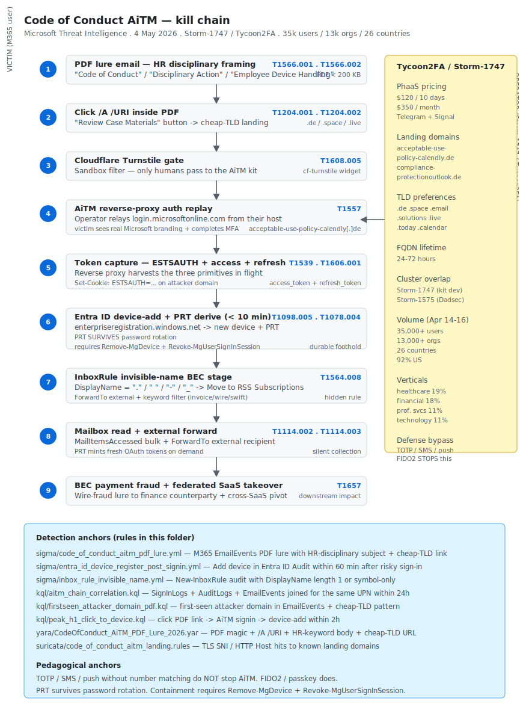

# Code of Conduct AiTM — Storm-1747 / Tycoon2FA campaign against Microsoft 365 (Microsoft Threat Intelligence, May 2026)

## TL;DR

Microsoft Threat Intelligence published on 4 May 2026 a retrospective of a tightly-windowed **Adversary-in-the-Middle** campaign that hit **>35,000 users across >13,000 organisations in 26 countries** between **14 and 16 April 2026**. The campaign — branded internally by Microsoft as **Code of Conduct AiTM** — used PDF lures with explicit HR-disciplinary framing (`Awareness Case Log File - Tuesday 14th April 2026.pdf`, `Disciplinary Action - Employee Device Handling Case.pdf`) whose `/A /URI` action led victims through a Cloudflare Turnstile CAPTCHA gate to a Tycoon2FA-class reverse-proxy phishing kit hosted on cheap `.de` TLDs (`acceptable-use-policy-calendly[.]de`, `compliance-protectionoutlook[.]de`). The kit terminates TLS on the attacker side, replays the auth flow to `login.microsoftonline.com`, and captures `ESTSAUTH`, `access_token` and `refresh_token`. The operator's critical persistence move — **within the first ten minutes of token capture** — is to register a new device in Entra ID and derive a **Primary Refresh Token (PRT)** that **survives password rotation**. Subsequent post-exploitation includes inbox rules with **single-character or symbol-only names** (Move-to-Archive / RSS Subscriptions / external ForwardTo) for BEC staging. The cluster is **Storm-1747** (Tycoon2FA PhaaS developer) overlapping with **Storm-1575** (Dadsec); panel pricing is **$120 USD / 10 days** or **$350 / month** on Telegram and Signal. Geographic concentration is **92 % US**, with verticals healthcare 19 %, financial 18 %, professional services 11 %, technology 11 %. The defender takeaway is durable: **TOTP / SMS / push-without-number-matching do not stop AiTM**; only **FIDO2 / passkeys / WebAuthn** bound to the requesting origin do. Containment requires both `Remove-MgDevice` on the fraudulent device and `Revoke-MgUserSignInSession` on the user — a password reset alone is not sufficient.

## Attribution and confidence

- **Cluster (Microsoft Threat Intelligence):** **Storm-1747** = the Tycoon2FA PhaaS developer / operator. Frequent infrastructure overlap with **Storm-1575** (Dadsec). Attribution is by **kit fingerprint** (Tycoon2FA-specific URL patterns, JavaScript artefacts, post-AiTM behavioural sequence) rather than by individual affiliate identity — anyone with a panel subscription can run a campaign.
- **Vendor that discovered:** Microsoft Threat Intelligence (primary disclosure, 4 May 2026). Independent corroboration from Trustwave SpiderLabs (Dadsec / Storm-1575 lineage), Proofpoint and Push Security (AiTM and PhaaS-economics commentary), and downstream confirmation by multiple MSSP write-ups.
- **Confidence:**
  - **high** on the kit attribution to Tycoon2FA / Storm-1747 — the URL pattern, the Cloudflare Turnstile gate, the `ESTSAUTH` capture flow and the PDF lure metadata replicate exactly across Microsoft's telemetry.
  - **medium** on the operator identity — Storm-1747 is a brand, not a person. Affiliate identity per campaign run is rarely public.
- **Victimology:** the geographic concentration is **92 % US**, verticals healthcare 19 %, financial 18 %, professional services 11 %, technology 11 %. Sectoral targeting is opportunistic — anyone who runs Microsoft 365 with TOTP / SMS / push-only second factors is in scope.
- **Genealogy / link with previous repo cases:** none in the diary yet on AiTM specifically. Compare with Day 13 (Albiriox) where SMS / push are reached from the device side; here they are reached from the network side. The shared pedagogical anchor is **FIDO2 / passkey as the only durable second factor in 2026**.

## Kill chain — summary table

| Stage | MITRE | Detail |
|---|---|---|
| Resource Development | T1583.001, T1608.005 | Operator registers cheap `.de` (and `.space` / `.email` / `.solutions` / `.live` / `.today` / `.calendar`) domains; deploys Tycoon2FA reverse-proxy + Cloudflare Turnstile CAPTCHA gate |
| Initial Access — Phishing | T1566.001, T1566.002 | Email with PDF attachment or PDF link; HR-disciplinary framing (Code of Conduct / Disciplinary Action / Employee Device Handling) |
| Execution — User Interaction | T1204.001, T1204.002 | Victim clicks `/A /URI` action inside the PDF — typical button text `Review Case Materials` |
| Defense Evasion (delivery) | T1608.005 | Cloudflare Turnstile gate filters sandboxes; landing only renders when Turnstile passes |
| Credential Access — AiTM | T1557, T1539, T1606.001 | Reverse-proxy AiTM relays the M365 auth flow; captures `ESTSAUTH` cookie, `access_token`, `refresh_token` |
| Persistence — Entra ID device add | T1098.005, T1078.004 | Within 10 min, register fraudulent device; derive Primary Refresh Token (PRT) — survives password rotation |
| Defense Evasion — Hide artefact | T1564.008 | Inbox rule with 1-character or symbol-only name; Move-to-Archive + RSS Subscriptions + external ForwardTo |
| Collection — Email harvest | T1114.002, T1114.003 | Read remote mailbox, set up auto-forwarding rules for BEC stage |
| Command and Control | T1071.001 | Application-layer over HTTPS to Tycoon2FA C2 + attacker-controlled OAuth flow when the operator escalates to OAuth app abuse |
| Impact | T1657 | Financial theft via BEC; downstream account takeover on cloud properties bound to the same identity |



The diagram has the victim user / M365 tenant on the left lane and the Tycoon2FA panel + reverse-proxy + fraudulent device on the right. Stage 5 (token capture) and stage 6 (PRT derive via device-add) are the most operationally important — the diagram highlights the **10-minute window** that separates them. The detection anchors at the bottom map to three Sigma rules (PDF lure on M365 EmailEvents; Entra ID device add post sign-in; InboxRule invisible-name BEC), three KQL rules (AiTM chain correlation joining sign-in + device-add + inbox rule; first-seen attacker domain via PDF; PEAK H1 click-to-device-add within 2h), one YARA rule for the PDF lure and one Suricata rule for the landing-domain TLS SNI / HTTP Host pattern.

## Stage-by-stage detail

### Resource Development

Operator registers cheap TLDs and stages Tycoon2FA. Domains seen in the 14-16 April window: `acceptable-use-policy-calendly[.]de`, `compliance-protectionoutlook[.]de`. The broader Tycoon2FA fleet rotates FQDNs every 24-72 hours, with TLD preference for `.de`, `.space`, `.email`, `.solutions`, `.live`, `.today`, `.calendar`. The infrastructure includes a Cloudflare Turnstile front-end that filters sandboxes — only sessions that pass Turnstile get to see the AiTM landing. MITRE: `T1583.001`, `T1608.005`.

### Initial Access — Phishing

Email lures with **HR-disciplinary framing** designed to trigger immediate-attention behaviour:

| Lure subject / body theme | PDF filename |
|---|---|
| Awareness case log | `Awareness Case Log File - Tuesday 14th April 2026.pdf` |
| Disciplinary action | `Disciplinary Action - Employee Device Handling Case.pdf` |
| Recurring keywords | `Code of Conduct`, `Disciplinary Action`, `Employee Device Handling`, `Review Case Materials` |

The email body explicitly threatens consequences if the user does not "review the case materials by EOD". MITRE: `T1566.001`, `T1566.002`.

### Execution — User Interaction

The PDF body is minimal — usually a single page with a `Review Case Materials` button whose `/A /URI` action points to the AiTM landing. The PDF itself does not contain JavaScript and is below 200 KB, so it sails through most secure-email-gateway content-scan policies. The YARA rule in this folder anchors on the PDF magic + `/A /URI` action + HR-keyword body + cheap-TLD URL. MITRE: `T1204.001`, `T1204.002`.

### Cloudflare Turnstile gate

Before the AiTM kit even renders, the landing hosts a Cloudflare Turnstile CAPTCHA. This serves two purposes for the operator:

1. **Sandbox filter** — automated mailbox-link clickers from Defender for Office 365 / Proofpoint / Microsoft Safe Links do not pass Turnstile and never see the kit.
2. **Plausible deniability** — to a curious researcher hitting the landing directly, the page looks like a benign access-control gate.

MITRE: `T1608.005`.

### Credential Access — AiTM via reverse proxy

Once Turnstile passes, the Tycoon2FA reverse-proxy replays the Microsoft auth flow to `login.microsoftonline.com` from the operator-controlled host, transparently re-issuing the prompts to the victim. The victim sees the real Microsoft branding, enters credentials, completes TOTP / push / SMS, and the operator captures:

- The `ESTSAUTH` cookie (session anchor).
- The `access_token` (OAuth bearer).
- The `refresh_token` (long-lived refresh primitive).

MITRE: `T1557` (Adversary-in-the-Middle), `T1539` (Steal Web Session Cookie), `T1606.001` (Forge Web Credentials — SAML / token).

### Persistence — Entra ID device add (the critical move)

**Within ten minutes of token capture**, the operator uses the captured `refresh_token` to register a new device in Entra ID via `https://enterpriseregistration.windows.net`. The device registration call returns a **Primary Refresh Token (PRT)** bound to the new device identity. Critically:

- The PRT is **not invalidated by a password change** on the user account.
- The PRT is only invalidated by **removing the device** (`Remove-MgDevice`) plus **revoking all sign-in sessions** (`Revoke-MgUserSignInSession`).
- The PRT can be used to mint fresh `access_token` and `refresh_token` pairs against any Microsoft service the device is allowed to access.

This is **T1098.005 Device Registration**, and it is the durable foothold of the entire campaign. MITRE: `T1098.005`, `T1078.004`.

### Defense Evasion — InboxRule invisible-name

A common Storm-1747 post-step is to create one or more inbox rules whose **DisplayName is a single character or symbol** — `.`, ` `, `-`, `_`, `~` — so the rule is hard to spot in Outlook's UI. The body of the rule typically:

- Moves messages matching keywords (`invoice`, `payment`, `wire`, `swift`) to **RSS Subscriptions** or to a freshly-created hidden folder.
- Forwards copies of those messages to an attacker-controlled external address.

This is `T1564.008` Hide Artefacts: Email Hiding Rules. The Sigma rule in this folder anchors on `New-InboxRule` audit events where `DisplayName` is one character long or matches a list of common symbols. MITRE: `T1564.008`.

### Collection — Email harvest + Auto-forward

With the inbox rule in place and the PRT minting fresh OAuth tokens, the operator quietly reads mailboxes and stages the BEC payload. MITRE: `T1114.002`, `T1114.003`.

### Command and Control

The AiTM proxy itself is the primary C2 fabric during the auth phase. Post-AiTM, the operator may stand up an attacker-controlled OAuth app and prompt the user (often via a follow-up phish) to grant consent — converting the foothold from session-only into application-level. MITRE: `T1071.001`.

### Impact

Downstream financial theft via BEC, account takeover on federated cloud properties bound to the same identity (Salesforce, Workday, GitHub Enterprise Cloud), and lateral access to wherever the captured identity can reach. MITRE: `T1657`.

## RE notes

The Tycoon2FA panel is a closed-source PhaaS product — public RE artefacts are limited to the PDF lures, the landing HTML and the JavaScript client harness. Operational pointers for analysts:

- **Cloudflare Turnstile token** — every successful render embeds a Turnstile widget. The site key is rotated per campaign run; the YARA rule does not pin a specific site key, but the presence of any `cf-turnstile` widget combined with an M365-mimicking sign-in flow is a useful behavioural anchor.
- **`ESTSAUTH` cookie capture** — visible in proxy logs as a re-issuance of the Microsoft cookie under the operator's domain. Anchor your perimeter detection on `Set-Cookie: ESTSAUTH` from any host that is not `login.microsoftonline.com` or `login.live.com`.
- **PDF magic + `/A /URI` action + HR keyword body + cheap-TLD URL** is the highest-yield YARA combination for the lure family. Combine with `filesize < 200KB`.
- **The Cloudflare Turnstile JavaScript challenge** lands on the page as `<script src="https://challenges.cloudflare.com/turnstile/v0/api.js"></script>`. A page that ships Turnstile + an M365-style sign-in form is high-suspicion outside the legitimate Microsoft-owned origins.

## Detection strategy

### Telemetry that matters

- **M365 EmailEvents** — attachment names, sender domain, link recipients. The Sigma rule for the PDF lure runs here.
- **Entra ID Audit logs** — `Add device` events tied to a `UserPrincipalName`. The KQL rule joins this back to a recent risky sign-in.
- **Entra ID Sign-in logs** — `RiskState` annotation, `IPAddress`, `UserAgent`. AiTM-class sign-ins show `RiskState != none` plus an unusual `UserAgent` (the operator's reverse proxy rarely mimics the user's typical UA perfectly).
- **Exchange Online Mailbox Audit / `MailItemsAccessed`** — bulk message reads from the same session that just added a device.
- **Office365 Management Activity API** — `New-InboxRule` events with anomalous `DisplayName` (1-character or symbol).
- **Perimeter HTTP / DNS logs** — visits to cheap-TLD landing domains in close temporal proximity to a Microsoft sign-in event from the same user.

### Detection coverage

| Engine | File | Logic |
|---|---|---|
| Sigma | [`sigma/code_of_conduct_aitm_pdf_lure.yml`](./sigma/code_of_conduct_aitm_pdf_lure.yml) | M365 EmailEvents — PDF attachment with HR-disciplinary subject / body + known landing TLD pattern |
| Sigma | [`sigma/entra_id_device_register_post_signin.yml`](./sigma/entra_id_device_register_post_signin.yml) | `Add registered owner` / `Add device` in Entra ID Audit Log within 60 min after a risky sign-in for the same user |
| Sigma | [`sigma/inbox_rule_invisible_name.yml`](./sigma/inbox_rule_invisible_name.yml) | `New-InboxRule` audit event with `DisplayName` length 1 or matching `[. _\- ~]` |
| KQL (Sentinel / Defender XDR) | [`kql/aitm_chain_correlation.kql`](./kql/aitm_chain_correlation.kql) | Correlation: SignInLogs (risky) + AuditLogs (device add) + EmailEvents (PDF lure) for the same UPN within 24h |
| KQL | [`kql/firstseen_attacker_domain_pdf.kql`](./kql/firstseen_attacker_domain_pdf.kql) | First-seen attacker domain in EmailEvents joined with cheap-TLD landing pattern |
| KQL | [`kql/peak_h1_click_to_device.kql`](./kql/peak_h1_click_to_device.kql) | PEAK H1 — user clicks PDF link, completes AiTM sign-in, device-add lands within 2h |
| YARA | [`yara/CodeOfConduct_AiTM_PDF_Lure_2026.yar`](./yara/CodeOfConduct_AiTM_PDF_Lure_2026.yar) | PDF magic + `/A /URI` action + HR keyword body + cheap-TLD URL + filesize < 200 KB |
| Suricata | [`suricata/code_of_conduct_aitm_landing.rules`](./suricata/code_of_conduct_aitm_landing.rules) | sids — TLS SNI / HTTP Host hitting known landing domains + heuristic for `keyword-in-cheap-TLD` |
| Hunt | [`hunts/peak_h1_aitm_to_device.md`](./hunts/peak_h1_aitm_to_device.md) | PEAK H1 click → AiTM → device-add chain in <2h |

### Threat hunting hypotheses

- **H1 — Click-to-device-add within 2 hours.** For every user that clicked a PDF link in EmailEvents, look for a subsequent `Add device` in Entra ID Audit within 2 hours. Expected benign: a user provisioning a new corporate laptop. Suspect: device-add following a sign-in tagged `RiskState != none` from an unfamiliar `IPAddress`.
- **H2 — InboxRule invisible-name appearance.** Periodically pull all inbox rules across the tenant with `DisplayName` length ≤ 2 or matching `^[. _\-~]+$`. Validate against an allowlist of administrative rules; anything else is investigated.
- **H3 — First-seen cheap-TLD landing in DNS / HTTP from a host that signed into M365 within 30 minutes.** A user touches `<keyword>-<keyword>.de` and then completes a `login.microsoftonline.com` sign-in. The Sigma rule on EmailEvents captures the email side; this hunt captures the click-through where email logs are not fully integrated.

## Incident response playbook

### First 60 minutes (triage)

1. **Suspend the user** in Entra ID (`Set-MgUser -AccountEnabled $false`). Do not just reset the password — the PRT survives.
2. **`Revoke-MgUserSignInSession -UserId <UPN>`** to invalidate all active sessions and refresh tokens.
3. **List the user's registered devices** (`Get-MgUserRegisteredDevice -UserId <UPN>`) and identify any device added in the last 24 hours that the user does not recognise.
4. **`Remove-MgDevice -DeviceId <fraudulent_device>`** on every device the user does not recognise. This is the step that kills the PRT-based persistence.
5. **Audit inbox rules** (`Get-InboxRule -Mailbox <UPN>`) and remove any rule with a 1-character / symbol-only name or any rule that forwards to an external recipient.
6. **Force a fresh sign-in with MFA re-prompt** when re-enabling the account, ideally onto a **FIDO2 / passkey** factor.
7. **Block the landing domains** at the perimeter and at the secure email gateway.

### Artifacts to collect

| Artifact | Path | Tool | Why it matters |
|---|---|---|---|
| Entra ID Sign-in logs | tenant | `Get-MgAuditLogSignIn` / Graph API | Risky sign-ins, IP and UserAgent for the AiTM session |
| Entra ID Audit logs | tenant | `Get-MgAuditLogDirectoryAudit` / Graph API | `Add device`, `Add registered owner`, `Update application` events |
| Mailbox audit | tenant | `Search-MailboxAuditLog` | `MailItemsAccessed` bulk reads tied to a session |
| Inbox rules | mailbox | `Get-InboxRule -Mailbox <UPN>` | Hidden BEC rules with 1-character / symbol names |
| Email body + PDF | mailbox | `Get-Message` + manual download | The exact lure for reverse engineering |
| OAuth app grants | tenant | `Get-MgOauth2PermissionGrant` | Any malicious OAuth app the operator may have registered |
| Conditional Access logs | tenant | `Get-MgAuditLogSignIn` | Which CA policies fired, which were satisfied |
| Endpoint browser history | host | `BrowsingHistoryView` / KAPE | Confirms which landing the user actually visited |

### IR queries and commands

```powershell
# Suspend account and revoke sessions
Set-MgUser -UserId <UPN> -AccountEnabled:$false
Revoke-MgUserSignInSession -UserId <UPN>

# Identify recently added devices for this user
Get-MgUserRegisteredDevice -UserId <UPN> |
    Sort-Object -Property RegistrationDateTime -Descending |
    Select-Object -First 10 Id, DisplayName, RegistrationDateTime, OperatingSystem

# Remove the fraudulent device(s)
Remove-MgDevice -DeviceId <fraudulent_device_id>

# Audit inbox rules
Get-InboxRule -Mailbox <UPN> |
    Where-Object { ($_.Name.Length -le 2) -or ($_.Name -match '^[. _\-~]+$') } |
    Remove-InboxRule -Confirm:$false
```

```kql
// AiTM chain correlation — Sentinel
let lookback = 24h;
let riskySignins =
    SigninLogs
    | where TimeGenerated > ago(lookback)
    | where RiskState != "none"
    | project SignInTime = TimeGenerated, UserPrincipalName, IPAddress, AppDisplayName;
let deviceAdds =
    AuditLogs
    | where TimeGenerated > ago(lookback)
    | where OperationName in ("Add device", "Add registered owner")
    | extend UPN = tostring(TargetResources[0].userPrincipalName)
    | project DeviceAddTime = TimeGenerated, UPN, OperationName,
              DeviceId = tostring(TargetResources[0].id);
riskySignins
| join kind=inner deviceAdds on $left.UserPrincipalName == $right.UPN
| where DeviceAddTime between (SignInTime .. SignInTime + 60m)
| project SignInTime, UserPrincipalName, IPAddress, AppDisplayName,
          DeviceAddTime, DeviceId, OperationName
```

```kql
// First-seen attacker domain via PDF
EmailEvents
| where Timestamp > ago(7d)
| where AttachmentCount >= 1
| where Subject has_any ("Code of Conduct", "Disciplinary Action", "Employee Device Handling")
| extend AttFile = tostring(parse_json(AttachmentFileNames)[0])
| where AttFile endswith ".pdf" and FileSize < 200 * 1024
| project Timestamp, RecipientEmailAddress, SenderFromAddress, Subject, AttFile, NetworkMessageId
```

### Containment, eradication, recovery

- **Containment.** Suspend the user; revoke sessions; remove fraudulent devices; remove BEC inbox rules; block the landing domains at perimeter + secure email gateway; review OAuth app grants for anything registered during the dwell window.
- **Eradication.** Re-issue the user a fresh identity bound to **FIDO2 / passkey** (preferred) or to phishing-resistant push with number matching (acceptable second-best). Disable legacy auth where any remains. Rotate any service or app passwords the user owned. Search the tenant for any other accounts that have a device added in the same window — likely operator-side parallel campaigns.
- **Recovery.** Enrol the user on FIDO2 / passkey and validate the recovery flow end-to-end. Migrate all SMS-OTP and push-without-number-matching factors away from this user. Set Conditional Access policies that require **phishing-resistant** MFA for high-risk applications.
- **What NOT to do.**
  - Do **not** stop at a password change — the PRT survives, the operator returns within minutes.
  - Do **not** trust an inbox rule list pulled from Outlook's GUI alone — pull from `Get-InboxRule` programmatically; the GUI can hide 1-character names.
  - Do **not** assume the operator owns only the user mailbox — federated SaaS that consumes the same identity is in scope.
  - Do **not** restore mailbox contents from a backup taken during the dwell window without a full inbox-rule and forwarding-config review.

### Recovery validation

- The user has been re-enrolled on **FIDO2 / passkey** and has signed in successfully with that factor for 7 days.
- No new device registrations for the user other than the legitimate corporate device.
- All inbox rules pulled programmatically (`Get-InboxRule`) match an allowlist of administrative rules.
- No OAuth app grants in the user's name issued during the dwell window remain in place.
- Conditional Access policies on the affected applications now require phishing-resistant MFA.
- 14 days without a SigninLogs `RiskState != none` event for the affected user.

## IOCs

| Type | Value | Context | Confidence | Source |
|---|---|---|---|---|
| domain | `acceptable-use-policy-calendly[.]de` | AiTM landing — Code of Conduct campaign (Apr 14-16 2026) | high | Microsoft Threat Intelligence |
| domain | `compliance-protectionoutlook[.]de` | AiTM landing — Code of Conduct campaign (Apr 14-16 2026) | high | Microsoft Threat Intelligence |
| filename | `Awareness Case Log File - Tuesday 14th April 2026.pdf` | PDF lure | medium | Microsoft Threat Intelligence |
| filename | `Disciplinary Action - Employee Device Handling Case.pdf` | PDF lure | medium | Microsoft Threat Intelligence |
| keyword | `Review Case Materials` | Click-out button text inside the PDF | medium | Microsoft Threat Intelligence |
| keyword | `Code of Conduct` | Recurring email subject / body text | medium | Microsoft Threat Intelligence |
| keyword | `Disciplinary Action` | Recurring email subject / body text | medium | Microsoft Threat Intelligence |
| keyword | `Employee Device Handling` | Recurring email subject / body text | medium | Microsoft Threat Intelligence |
| tld | `.de` | Cheap TLD frequently used by Tycoon2FA | medium | Microsoft Inside Tycoon2FA |
| tld | `.space` | Cheap TLD frequently used by Tycoon2FA | medium | Microsoft Inside Tycoon2FA |
| tld | `.email` | Cheap TLD frequently used by Tycoon2FA | medium | Microsoft Inside Tycoon2FA |
| tld | `.solutions` | Cheap TLD frequently used by Tycoon2FA | medium | Microsoft Inside Tycoon2FA |
| tld | `.live` | Cheap TLD frequently used by Tycoon2FA | medium | Microsoft Inside Tycoon2FA |
| tld | `.today` | Cheap TLD frequently used by Tycoon2FA | medium | Microsoft Inside Tycoon2FA |
| tld | `.calendar` | Cheap TLD frequently used by Tycoon2FA | medium | Microsoft Inside Tycoon2FA |
| behaviour | device-add within 60 min of risky sign-in | Post-AiTM persistence (T1098.005) | high | Microsoft Threat Intelligence |
| behaviour | InboxRule with 1-char or symbol-only name | Hide-artifact for BEC (T1564.008) | high | Microsoft Threat Intelligence |
| cluster | Storm-1747 | Tycoon2FA developer / PhaaS operator | medium | Microsoft Threat Intelligence |
| cluster | Storm-1575 | Dadsec — shares infrastructure with Tycoon2FA | medium | Trustwave SpiderLabs |

Full list lives in [`iocs.csv`](./iocs.csv).

## Secondary findings

- **Mini Shai-Hulud (29-30 April 2026).** PyTorch Lightning 2.6.2 / 2.6.3 (PyPI) + `intercom-client@7.0.4` (npm) compromised by **TeamPCP**. Exfil primary `zero.masscan[.]cloud:443/v1/telemetry`; fallback to GitHub repos under the victim's own account with description **"A Mini Shai-Hulud has Appeared"**; dead-drop resolver `gh search /commits` with markers `beautifulcastle` and `EveryBoiWeBuildIsAWormyBoi`. PyPI removed the bad versions within 42 minutes — but anyone who installed during the window must rotate credentials.
- **SAP `@cap-js` npm worm (29 April 2026).** Four official SAP packages — `mbt@1.2.48`, `@cap-js/sqlite@2.2.2`, `@cap-js/postgres@v2.2.2`, `@cap-js/db-service@v2.10.1` — aggregated ~572k weekly downloads, **byte-identical `setup.mjs`** across all four ⇒ autonomous worm. TeamPCP again (Wiz + Socket).
- **CISA KEV (April 2026).** CVE-2026-31431 Linux kernel LPE — FCEB deadline 15 May 2026. Patch the kernel side; combine with the AiTM hardening here for a full-stack identity-and-host-layer cleanup.

## Pedagogical anchors

- **TOTP / SMS / push-without-number-matching do not stop AiTM.** Only FIDO2 / passkeys / WebAuthn bound to the requesting origin do. Conditional Access "require MFA" is necessary but not sufficient.
- **The PRT survives password rotation.** Containment requires `Remove-MgDevice` on the fraudulent device plus `Revoke-MgUserSignInSession` on the user. Anything less is theatre.
- **Cloudflare Turnstile in front of a phishing kit is operator tradecraft, not vendor hostility.** Detection has to handle the case where the sandbox can never reach the landing.
- **InboxRule audit is a back-burner control until it isn't.** A periodic enumeration of all inbox rules with `DisplayName` length ≤ 2 is one of the cheapest BEC hunts you can build.
- **PhaaS economics are unbeatable on cost.** $120 USD / 10 days buys a campaign that reaches >35,000 users. The defender's economic model has to be at least as cheap per blocked credential — automation and FIDO2 enforcement, not analyst review of every alert.

## What's in this folder

| File | Purpose |
|---|---|
| [`README.md`](./README.md) | This case write-up |
| [`kill_chain.svg`](./kill_chain.svg) | Code of Conduct AiTM kill-chain diagram, light / dark adaptive |
| [`iocs.csv`](./iocs.csv) | Machine-readable IOC list |
| [`sigma/code_of_conduct_aitm_pdf_lure.yml`](./sigma/code_of_conduct_aitm_pdf_lure.yml) | Sigma — PDF lure on M365 EmailEvents |
| [`sigma/entra_id_device_register_post_signin.yml`](./sigma/entra_id_device_register_post_signin.yml) | Sigma — Entra ID device-add post sign-in |
| [`sigma/inbox_rule_invisible_name.yml`](./sigma/inbox_rule_invisible_name.yml) | Sigma — InboxRule with 1-character / symbol-only name |
| [`kql/aitm_chain_correlation.kql`](./kql/aitm_chain_correlation.kql) | KQL — AiTM full-chain correlation (sign-in + device-add + inbox rule) |
| [`kql/firstseen_attacker_domain_pdf.kql`](./kql/firstseen_attacker_domain_pdf.kql) | KQL — first-seen attacker domain via PDF |
| [`kql/peak_h1_click_to_device.kql`](./kql/peak_h1_click_to_device.kql) | KQL — PEAK H1 click-to-device-add 2h |
| [`yara/CodeOfConduct_AiTM_PDF_Lure_2026.yar`](./yara/CodeOfConduct_AiTM_PDF_Lure_2026.yar) | YARA — PDF lure heuristic |
| [`suricata/code_of_conduct_aitm_landing.rules`](./suricata/code_of_conduct_aitm_landing.rules) | Suricata 7.x — landing-domain TLS SNI / HTTP Host pattern |
| [`hunts/peak_h1_aitm_to_device.md`](./hunts/peak_h1_aitm_to_device.md) | PEAK H1 — click → AiTM → device-add 2h |

## Sources

- [Microsoft Threat Intelligence — Code of Conduct AiTM campaign retrospective (4 May 2026)](https://www.microsoft.com/en-us/security/blog/2026/05/04/code-of-conduct-aitm-storm-1747/)
- [Microsoft — Inside Tycoon2FA: PhaaS evolution and infrastructure (March 2026)](https://www.microsoft.com/en-us/security/blog/topic/threat-intelligence/)
- [Trustwave SpiderLabs — Dadsec / Storm-1575 lineage](https://www.trustwave.com/en-us/resources/blogs/spiderlabs-blog/)
- [Proofpoint — AiTM phishing and PhaaS economics commentary](https://www.proofpoint.com/us/blog/threat-insight)
- [Push Security — Tycoon2FA / Storm-1747 detection notes](https://pushsecurity.com/blog/tycoon-2fa/)
- [Microsoft Learn — Primary Refresh Token (PRT)](https://learn.microsoft.com/en-us/entra/identity/devices/concept-primary-refresh-token)
- [Microsoft Learn — Remove-MgDevice (Graph PowerShell)](https://learn.microsoft.com/en-us/powershell/module/microsoft.graph.identity.directorymanagement/remove-mgdevice)
- [MITRE ATT&CK — T1098.005 Device Registration](https://attack.mitre.org/techniques/T1098/005/)
- [MITRE ATT&CK — T1557 Adversary-in-the-Middle](https://attack.mitre.org/techniques/T1557/)
- [MITRE ATT&CK — T1564.008 Email Hiding Rules](https://attack.mitre.org/techniques/T1564/008/)
