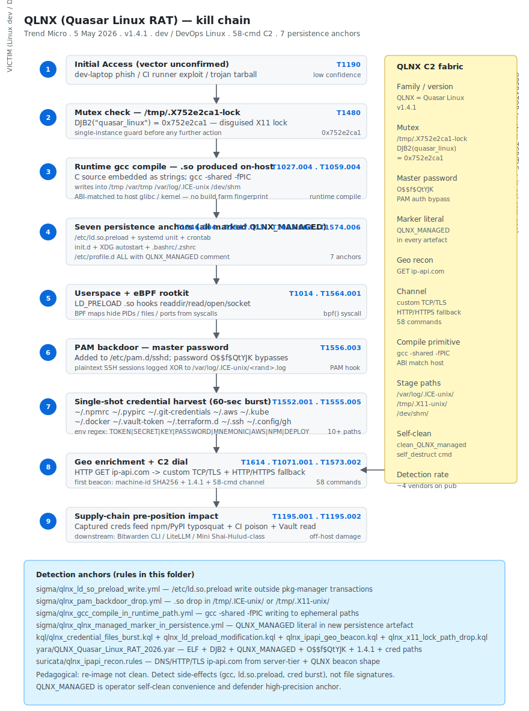

# QLNX (Quasar Linux RAT) — Linux developer/DevOps implant with rootkit, PAM backdoor and supply-chain credential harvester (Trend Micro, May 2026)

## TL;DR

Trend Micro disclosed on 5 May 2026 a previously-undocumented Linux RAT family called **QLNX** (a.k.a. **Quasar Linux**) — a single-binary ELF that combines a **userspace rootkit** (`/etc/ld.so.preload` hijack), an **eBPF kernel rootkit controller** (BPF maps hiding PIDs / files / ports), a **PAM backdoor** with a hardcoded master password `O$$f$QtYJK`, a **58-command** custom TCP/TLS C2 framework with HTTP/HTTPS fallback, **seven persistence anchors** (LD_PRELOAD, systemd, crontab, init.d, XDG autostart, `.bashrc` / `.zshrc`, `/etc/profile.d`), and a **single-shot credential harvester** targeting developer / DevOps artefacts (`~/.npmrc`, `~/.pypirc`, `~/.git-credentials`, `~/.aws`, `~/.kube`, `~/.docker`, `~/.vault-token`, GitHub CLI tokens, SSH keys). The mutex is `/tmp/.X752e2ca1-lock` (DJB2 hash of the string `quasar_linux` = `0x752e2ca1`) — disguised as an X11 lock. A literal marker `QLNX_MANAGED` is embedded as a comment in every persistence artefact so the operator can clean up reliably. **Dynamic on-host compilation** of C source for the PAM backdoor and the LD_PRELOAD rootkit is the most operationally novel piece: the implant carries C source as string literals and pipes it through `gcc -shared -fPIC` to produce a distro-matching `.so` — no build-farm fingerprint left behind. Initial beacon is to `ip-api.com` for geo enrichment, then to the operator's custom-TCP / TLS C2 channel with HTTP/HTTPS fallback. Attribution is **low** — no public link to a named cluster — but operationally QLNX is **the upstream cause** of supply-chain incidents like LiteLLM, Bitwarden Shai-Hulud and Mini Shai-Hulud. The defender mark is hard: **re-image, not clean** — seven persistence anchors plus LD_PRELOAD respawn make on-disk cleanup unreliable.

## Attribution and confidence

- **Family (Trend Micro):** **QLNX / Quasar Linux**, version `1.4.1` in the disclosure window. Single-binary ELF, in-memory exec, self-cleanup of disk artefacts after first run.
- **Attribution:** **low**. There is no public link to a named cluster (no overlap with named China-nexus, Russia-nexus or DPRK-nexus families). Operationally it fits the broader 2026 trend of **developer-host pre-position** for supply-chain follow-on attacks — LiteLLM, Telnyx SDK, Bitwarden CLI, Mini Shai-Hulud and the SAP `@cap-js` worm all consume credentials that an implant like QLNX could plausibly have provided upstream.
- **Confidence:**
  - **high** on the technical attribution to the QLNX family — the DJB2 mutex constant, the `QLNX_MANAGED` marker, the hardcoded master password and the version string are byte-level reproducible across the Trend Micro corpus.
  - **low** on operator identity — the cluster is a brand assigned by Trend Micro, not a vendor-merged operator label.
- **Vendor that discovered:** Trend Micro Research (primary disclosure 5 May 2026). At publication ~4 vendors had detection signatures across mainstream AV / EDR.
- **Victimology:** developer and DevOps Linux hosts — workstations and CI runners running Bash / Zsh / Fish, with credentials cached for npm, PyPI, Git, AWS, Kubernetes, Docker, HashiCorp Vault, Terraform Cloud, GitHub CLI. The implant's value is proportional to how many secrets the host has accumulated.
- **Genealogy / link with previous repo cases:** **Day 11 (EVM/DeFi npm typosquat)** is the **downstream consumer** of QLNX-class credential exfil. A `~/.npmrc` exfiltrated by QLNX enables an unrelated operator to publish typosquat packages from the victim's npm identity. The two cases are two ends of the same supply-chain kill chain.

## Kill chain — summary table

| Stage | MITRE | Detail |
|---|---|---|
| Initial Access | T1190 | Vector unconfirmed in public disclosure — candidates: dev-laptop phish + LPE; CI runner SSRF; trojan in a shared dev-tool tarball |
| Execution | T1027.004, T1059.004 | Dynamic on-host compilation — embed C source as strings, pipe through `gcc -shared -fPIC` to produce distro-matching `.so` |
| Persistence | T1546.004, T1547.013, T1053.003, T1574.006, T1556.003 | Seven anchors: LD_PRELOAD, systemd, crontab, init.d, XDG autostart, `.bashrc` / `.zshrc`, `/etc/profile.d` |
| Defense Evasion | T1014, T1027.004, T1480, T1564.001, T1070.004 | Userspace rootkit (`/etc/ld.so.preload`) + eBPF kernel rootkit + `QLNX_MANAGED` marker + log cleanup |
| Discovery + Credential Access | T1083, T1552.001, T1555.005, T1614 | Enumerate developer artefacts + `ip-api.com` geo + `/etc/machine-id` SHA256 host fingerprint |
| Credential Access (deeper) | T1556.003 | PAM backdoor — hardcoded master password `O$$f$QtYJK` bypasses any local account |
| Command and Control | T1071.001, T1573.002 | Custom TCP / TLS + HTTP / HTTPS fallback (58-command framework) |
| Collection + Exfiltration | T1005, T1041 | Single-shot credential burst exfiltrated over the C2 |
| Impact — supply chain | T1195.001, T1195.002 | Captured credentials feed downstream supply-chain attacks (typosquat publish, registry pollution, source-code rewrite) |



The diagram has the developer / DevOps Linux host on the left and the QLNX operator C2 + first-stage geo enrichment on the right. The seven persistence anchors are listed in a single stage box because the operator plants them as a batch — losing one is recoverable, losing six is not. The `QLNX_MANAGED` marker spans every artefact for operator self-cleanup; the LD_PRELOAD respawn loop sits next to the credential harvest stage. Detection anchors at the bottom map to four Sigma rules, four KQL rules, the YARA rule on the binary and the Suricata rule on the `ip-api.com` geo beacon from a server-tier host.

## Stage-by-stage detail

### Initial Access

Trend Micro does not publicly disclose the entry vector. The most plausible candidates, given the family's developer / DevOps targeting:

1. **Phish to a developer laptop** with a fake `dpkg` / `rpm` installer that requires `sudo` and seeds the implant.
2. **CI runner exploit chain** — SSRF / RCE from a build-time hook to a privileged runner with persistent secrets.
3. **Trojanised shared dev-tool tarball** — the same vector class as Bitwarden CLI 2026.4.0 (Shai-Hulud Third Coming), simply for a Linux-only target binary distributed outside the registry.

MITRE: `T1190` (placeholder until vendor confirms the vector class).

### Execution — dynamic on-host compilation

The most operationally novel piece. The QLNX binary carries C source code for the PAM backdoor and the LD_PRELOAD rootkit as **string literals embedded in the binary**. At runtime it writes the source to a hidden temporary file and invokes:

```bash
gcc -shared -fPIC /tmp/.qlnx_src.c -o /var/log/.ICE-unix/<random>.so -ldl
```

This produces a `.so` whose ABI exactly matches the host's `libc` / `gcc` / kernel headers — no fingerprint of an external build farm, no architecture mismatch, no shipping-dependent linker quirks. The implant then deletes the source. The Sigma rule `qlnx_gcc_compile_in_runtime_path.yml` in this folder anchors on `gcc -shared -fPIC` invocations whose output path is under `/tmp`, `/var/tmp`, `/var/log` or `/dev/shm`. MITRE: `T1027.004`, `T1059.004`.

### Persistence — seven anchors

The implant plants **seven independent persistence primitives** so that ablating one does not eject the implant:

| # | Anchor | Path |
|---|---|---|
| 1 | LD_PRELOAD | `/etc/ld.so.preload` (system-wide) |
| 2 | systemd | `/etc/systemd/system/<name>.service` enabled on default target |
| 3 | crontab | `/var/spool/cron/crontabs/root` or per-user |
| 4 | init.d / sysv | `/etc/init.d/<name>` + symlinked rc.d |
| 5 | XDG autostart | `~/.config/autostart/<name>.desktop` (for the desktop developer) |
| 6 | Shell rc | append into `~/.bashrc`, `~/.zshrc`, `~/.config/fish/config.fish` |
| 7 | profile.d | `/etc/profile.d/<name>.sh` (system-wide login hook) |

Every one of these artefacts contains a comment with the literal marker `QLNX_MANAGED` so the operator can do a reliable cleanup later — and a defender can hunt the literal across the filesystem. MITRE: `T1546.004`, `T1547.013`, `T1053.003`, `T1574.006`.

### Defense Evasion — userspace + eBPF rootkit

- **Userspace rootkit:** the LD_PRELOAD-loaded `.so` intercepts `readdir`, `read`, `getdents`, `getdents64`, `open` and `socket` to hide files whose name contains the operator's prefix, lines whose body contains the `QLNX_MANAGED` marker, and TCP connections to the C2 port.
- **eBPF kernel rootkit controller:** BPF maps hide PIDs, files and ports from process-listing and socket-enumeration syscalls. The implant uses `bpftool prog load` or direct `bpf()` syscall depending on kernel version.

The combination defeats most `ps` / `ls` / `netstat` / `ss` triage on the running host. Forensically, the only way to confirm is a memory acquisition + offline analysis or to read `/proc` from a **kernel debugger** that bypasses the syscall hooks. MITRE: `T1014`, `T1564.001`.

### Credential Access — PAM backdoor + single-shot harvest

The **PAM backdoor** is the most operationally important credential primitive. The compiled `.so` is added as an `auth` module in `/etc/pam.d/sshd` (and any other PAM service the operator wants to backdoor). When the supplied password equals the hardcoded master `O$$f$QtYJK`, authentication succeeds regardless of the user account — and the **plaintext SSH session credentials are silently logged** to an XOR-encrypted file under `/var/log/.ICE-unix/<random>.log`. MITRE: `T1556.003`.

The **single-shot credential harvest** runs once per host and exfiltrates:

```
~/.npmrc                      # npm token
~/.pypirc                     # PyPI token
~/.git-credentials            # git PAT
~/.aws/credentials            # AWS
~/.kube/config                # Kubernetes
~/.docker/config.json         # Docker registry
~/.vault-token                # HashiCorp Vault
~/.terraform.d/credentials.tfrc.json   # Terraform Cloud
~/.config/gh/hosts.yml        # GitHub CLI
~/.netrc                      # legacy
~/.ssh/id_rsa  ~/.ssh/id_ed25519  ~/.ssh/id_ecdsa  ~/.ssh/config
```

Plus environment variable harvest matching `TOKEN|SECRET|KEY|PASSWORD|AUTH|PRIVATE|SEED|MNEMONIC|AWS|NPM|DEPLOY`. The single-shot model means the host is silent again after the burst — detection has to catch the **read burst** within its 60-second window or it sees nothing. MITRE: `T1552.001`, `T1555.005`.

### Discovery — host fingerprint

Initial beacon includes:

- `/etc/machine-id` SHA-256 (host fingerprint).
- `ip-api.com` HTTP GET for geo enrichment (T1614).
- Implant version `1.4.1`.

MITRE: `T1083`, `T1614`.

### Command and Control

Custom **TCP / TLS** primary with **HTTP / HTTPS** fallback. The framework supports **58 commands** including:

| Category | Examples |
|---|---|
| Shell | `exec`, `pty`, `download`, `upload`, `chdir` |
| Filesystem | `ls`, `read`, `write`, `chmod`, `chown`, `delete`, `rename`, `find` |
| Process | `pslist`, `kill`, `inject`, `signal` |
| Network | `port_scan`, `tcp_connect`, `tcp_listen`, `socks5` |
| Persistence | `install_persistence`, `remove_persistence`, `re-arm` |
| Cleanup | `self_destruct`, `wipe_logs`, `clean_QLNX_managed` |

MITRE: `T1071.001`, `T1573.002`.

### Collection + Exfiltration + Impact (supply chain)

The harvested credentials and host fingerprint are exfiltrated over the C2. The operator's **impact** is downstream: the credentials feed supply-chain pre-position attacks against npm / PyPI / Docker Hub / GitHub Actions / cloud tenants. MITRE: `T1005`, `T1041`, `T1195.001`, `T1195.002`.

## RE notes

| Component | Lang / build | Notes |
|---|---|---|
| QLNX core ELF | C, static linkage, stripped, ~600-800 KB depending on arch | Embeds C source for `.so` modules as string literals; runtime `gcc -shared -fPIC` to produce distro-matching shared objects |
| LD_PRELOAD rootkit `.so` | compiled at runtime | Hooks `readdir`, `read`, `getdents`, `getdents64`, `open`, `socket` — hides files with operator-prefix and lines with `QLNX_MANAGED` |
| PAM backdoor `.so` | compiled at runtime | `pam_sm_authenticate` returns `PAM_SUCCESS` when password equals `O$$f$QtYJK`; logs plaintext sessions XOR-encrypted into `/var/log/.ICE-unix/<random>.log` |
| Mutex / lock | `/tmp/.X752e2ca1-lock` | DJB2(`quasar_linux`) = `0x752e2ca1`; disguised as X11 lock |
| Marker literal | `QLNX_MANAGED` | Embedded as a comment in every persistence artefact for operator self-cleanup — and defender YARA / Sigma anchor |

Operational reverser pointers:

- **DJB2 of `quasar_linux` is the gold YARA constant** — the literal `0x752e2ca1` appears in the binary as the immediate for the lock-file path construction. Combine with `ip-api.com` + `1.4.1` + `O$$f$QtYJK` for a near-zero-FP detection.
- **The runtime `gcc` invocation is the cleanest non-binary detection.** A `gcc -shared -fPIC` writing into `/tmp`, `/var/tmp`, `/var/log/.ICE-unix` or `/dev/shm` from a non-development process tree is high-confidence malicious.
- **`/etc/ld.so.preload` modification** is the canonical Linux userland-rootkit anchor. Anything that writes that file outside a package-manager transaction is investigation-grade.
- **PAM module additions** to `/etc/pam.d/sshd` outside a vendor update window are similarly anomalous; pair with the master-password literal as a YARA anchor.
- **The eBPF rootkit controller is harder to anchor by signature** because BPF programs are loaded by the binary into the kernel and not directly visible on disk. Hunt on `bpf()` syscall telemetry from a non-development context.

## Detection strategy

### Telemetry that matters

- **Linux EDR / Defender for Endpoint Linux MDE / Falco / auditd** — `FileAccessed` / `FileOpened` events for the 10+ developer-credential paths in the IOC list; `ProcessCreated` for `gcc -shared -fPIC`; `FileWritten` for `/etc/ld.so.preload`.
- **DNS / HTTP outbound** — first-seen `ip-api.com` from a server-tier host or service account.
- **`/proc` walk from a kernel-debugger or off-host triage** — the userspace rootkit hides processes from `ps`; a forensic triage that reads `/proc` directly without going through the rootkit-hooked syscalls is needed for confirmation.
- **`/etc/ld.so.preload`** content — anything beyond a documented enterprise tool (rare in production) is suspect.
- **`auditd`** — system rules on `/etc/ld.so.preload`, `/etc/pam.d/`, `/etc/systemd/system/`, `/etc/init.d/`, `/etc/profile.d/`.

### Detection coverage

| Engine | File | Logic |
|---|---|---|
| Sigma | [`sigma/qlnx_ld_so_preload_write.yml`](./sigma/qlnx_ld_so_preload_write.yml) | File write to `/etc/ld.so.preload` from a non-package-manager process |
| Sigma | [`sigma/qlnx_pam_backdoor_drop.yml`](./sigma/qlnx_pam_backdoor_drop.yml) | `.so` drop in `/tmp/.ICE-unix/` or `/tmp/.X11-unix/` (canonical hidden stage paths) |
| Sigma | [`sigma/qlnx_gcc_compile_in_runtime_path.yml`](./sigma/qlnx_gcc_compile_in_runtime_path.yml) | `gcc -shared -fPIC` writing into `/tmp` / `/var/tmp` / `/var/log` / `/dev/shm` from a non-dev parent |
| Sigma | [`sigma/qlnx_qlnx_managed_marker_in_persistence.yml`](./sigma/qlnx_qlnx_managed_marker_in_persistence.yml) | New persistence artefact (systemd unit / cron / init / desktop / shell rc) containing the literal `QLNX_MANAGED` |
| KQL (Defender XDR) | [`kql/qlnx_ld_preload_modification.kql`](./kql/qlnx_ld_preload_modification.kql) | DeviceFileEvents — `/etc/ld.so.preload` modification |
| KQL | [`kql/qlnx_credential_files_burst.kql`](./kql/qlnx_credential_files_burst.kql) | DeviceFileEvents — ≥3 credential-file reads in 60 s |
| KQL | [`kql/qlnx_ipapi_geo_beacon.kql`](./kql/qlnx_ipapi_geo_beacon.kql) | DeviceNetworkEvents — `ip-api.com` from a server-tier host or service account |
| KQL | [`kql/qlnx_x11_lock_path_drop.kql`](./kql/qlnx_x11_lock_path_drop.kql) | `/tmp/.X<8hex>-lock` create event matching the DJB2 hash pattern |
| YARA | [`yara/QLNX_Quasar_Linux_RAT_2026.yar`](./yara/QLNX_Quasar_Linux_RAT_2026.yar) | ELF magic + DJB2(`quasar_linux`) immediate `0x752e2ca1` + `QLNX_MANAGED` + `O$$f$QtYJK` + `1.4.1` + credential-path strings |
| Suricata | [`suricata/qlnx_ipapi_recon.rules`](./suricata/qlnx_ipapi_recon.rules) | sids — DNS / HTTP / TLS `ip-api.com` from server-tier + custom-TCP beacon shape with QLNX + 1.4.1 |
| Hunt | [`hunts/peak_h1_qlnx_credential_burst.md`](./hunts/peak_h1_qlnx_credential_burst.md) | PEAK H1 credential-burst + `ip-api.com` geo recon in 10 minutes on a developer / DevOps host |

### Threat hunting hypotheses

- **H1 — Credential-burst + `ip-api.com` from a developer / DevOps host.** ≥3 credential-file reads in 60 s plus a DNS / HTTP for `ip-api.com` within 10 minutes from the same host. The KQL rule for the burst plus the Suricata rule for the geo beacon catches this from two telemetry sides.
- **H2 — `QLNX_MANAGED` literal anywhere on the fleet.** A periodic file-content sweep across `/etc/systemd/system/`, `/etc/init.d/`, `/etc/profile.d/`, `~/.bashrc`, `~/.zshrc`, `~/.config/fish/config.fish`, `~/.config/autostart/`. The marker is operator-side cleanup convenience; it is also our anchor.
- **H3 — `/etc/ld.so.preload` modification outside a package-manager transaction.** Cross-reference `dpkg` / `rpm` transaction logs and alert on any write to the file that is not bracketed by a packaged-tool install.
- **H4 — Runtime `gcc -shared -fPIC` from a non-developer process tree.** A `gcc` parent that is not `make` / `bash` from a `code` / `vim` / `vscode` is anomalous; combine with output-path filter.

## Incident response playbook

### First 60 minutes (triage)

1. **Do NOT trust on-host `ps` / `ls` / `netstat` output.** The userspace and eBPF rootkits hide processes, files and sockets. Confirm via memory acquisition or off-host triage.
2. **Capture RAM** with LiME / AVML — preserves the implant state including any in-flight `bpf()` syscall trace and the pre-cleanup credential burst.
3. **Snapshot key persistence paths**: `/etc/ld.so.preload`, `/etc/pam.d/`, `/etc/systemd/system/`, `/etc/init.d/`, `/etc/profile.d/`, `~/.bashrc`, `~/.zshrc`, `~/.config/autostart/`, `~/.config/fish/config.fish`, `/var/spool/cron/`.
4. **Search for the `QLNX_MANAGED` marker** across the filesystem (`grep -rnE 'QLNX_MANAGED' /etc /home /root /var /usr/local`).
5. **Block egress** to `ip-api.com` from the affected host VLAN and to any C2 IP identified from RAM acquisition.
6. **Rotate every credential the host could have exfiltrated** — full list in the IOC table below. Order: AWS → cloud-IdP → npm / PyPI / Docker registry tokens → GitHub PATs → SSH keys → Vault tokens → Kubernetes context tokens.
7. **Assume keys are gone, not unknown.** Treat the host as a credential-compromise event regardless of whether you can confirm the burst happened.

### Artifacts to collect

| Artifact | Path | Tool | Why it matters |
|---|---|---|---|
| RAM image | host RAM | LiME / AVML | Implant state + in-flight credentials + BPF program metadata |
| `/etc/ld.so.preload` | `/etc/ld.so.preload` | manual | Confirms LD_PRELOAD rootkit |
| `/etc/pam.d/` | `/etc/pam.d/` | manual | Confirms PAM backdoor |
| systemd units | `/etc/systemd/system/` + `systemctl list-unit-files --state=enabled` | manual | Persistence anchor 2 |
| crontabs | `/var/spool/cron/crontabs/`, `/etc/cron.d/` | manual | Persistence anchor 3 |
| init.d / rc.d | `/etc/init.d/`, `/etc/rc*.d/` | manual | Persistence anchor 4 |
| Shell rc files | `~/.bashrc`, `~/.zshrc`, `~/.config/fish/config.fish` | manual | Persistence anchor 6 |
| XDG autostart | `~/.config/autostart/` | manual | Persistence anchor 5 |
| `/etc/profile.d/` | `/etc/profile.d/` | manual | Persistence anchor 7 |
| Hidden stage dirs | `/tmp/.ICE-unix/`, `/tmp/.X11-unix/`, `/var/log/.ICE-unix/` | `find -ls` | Staged `.so` artefacts |
| auditd log | `/var/log/audit/audit.log` | manual | File-access burst record (if auditd was enabled before T0) |
| BPF state | live | `bpftool prog show` + `bpftool map dump` | Loaded BPF programs and maps for the rootkit controller |
| `/proc` walk (offline) | host RAM / disk | Volatility 3 `linux.pslist`, `linux.psaux`, `linux.netscan`, `linux.malfind` | Rootkit-bypass forensics |

### IR queries and commands

```bash
# Confirm LD_PRELOAD rootkit presence
cat /etc/ld.so.preload
# Hash every .so the preload points at; cross-reference against known-good system libs
for f in $(awk '{print $1}' /etc/ld.so.preload); do sha256sum "$f"; done

# Hunt the marker across critical persistence paths
grep -rnE 'QLNX_MANAGED' /etc /home /root /var/spool /usr/local 2>/dev/null

# Hunt the mutex / lock pattern (DJB2 of "quasar_linux")
find /tmp -name '.X*-lock' -printf '%p\n' | grep -E '\.X[0-9a-f]{8}-lock'

# Capture RAM for off-host analysis
sudo insmod lime.ko "path=/mnt/usb/qlnx.lime format=lime"
# OR
sudo avml /mnt/usb/qlnx.avml

# Confirm BPF programs loaded by the rootkit controller
sudo bpftool prog show
sudo bpftool map show
```

```kql
// Defender for Endpoint Linux MDE — credential burst from a single process within 60s
let candidates = pack_array(
  ".npmrc", ".pypirc", ".git-credentials", ".aws/credentials", ".kube/config",
  ".docker/config.json", ".vault-token", ".terraform.d/credentials.tfrc.json",
  ".config/gh/hosts.yml", ".netrc", ".ssh/id_rsa", ".ssh/id_ed25519");
DeviceFileEvents
| where Timestamp > ago(7d)
| where ActionType in ("FileAccessed","FileOpened","FileRead")
| extend FullPath = strcat(FolderPath, "/", FileName)
| where FullPath has_any (candidates)
| summarize Hits = count(), Files = make_set(FullPath, 50),
            First = min(Timestamp), Last = max(Timestamp)
    by DeviceName, AccountName, InitiatingProcessFileName, InitiatingProcessId
| where Hits >= 3 and (Last - First) < 60s
```

### Containment, eradication, recovery

- **Containment.** Network-isolate the host; suspend any service account that authenticated to other hosts from this one in the last 30 days; block egress to `ip-api.com` + any RAM-derived C2 IPs.
- **Eradication.** **Re-image, do not clean.** Seven persistence anchors + the LD_PRELOAD respawn loop make on-disk cleanup unreliable. Stand up a fresh OS install on the same hardware (or replacement hardware if the firmware is suspect).
- **Recovery.** Reinstall the developer toolchain on the fresh host. Restore project sources only after rotating every credential the previous host could have leaked. Reseat hardware-bound tokens (YubiKey) only after the new OS is in a known-good state.
- **What NOT to do.**
  - Do **not** try to clean the host. Seven persistence anchors plus LD_PRELOAD respawn make clean-as-you-go infeasible.
  - Do **not** trust on-host `ps` / `ls` / `netstat` — the rootkit hides itself.
  - Do **not** rotate credentials on the same compromised host — the PAM backdoor may still log the new ones.
  - Do **not** skip the `gcc` and BPF telemetry review — runtime compilation and BPF loads from a non-developer context tree are the cleanest residual signal.

### Recovery validation

- Fresh OS install with a documented bootstrap timeline; no `QLNX_MANAGED` markers anywhere in the filesystem.
- All rotated credentials are confirmed in service; the old credentials no longer authorise anything.
- 30 days of EDR / auditd / DNS telemetry shows no `ip-api.com` resolutions from the host or any other server-tier asset.
- BPF program inventory (`bpftool prog show`) shows only the OS-baseline programs.
- `/etc/ld.so.preload` is empty (or matches the documented enterprise baseline).

## IOCs

| Type | Value | Context | Confidence | Source |
|---|---|---|---|---|
| filepath | `/etc/ld.so.preload` | System-wide LD_PRELOAD pivot rewritten by QLNX | high | Trend Micro 5 May 2026 |
| filepath | `/var/log/.ICE-unix/` | Hidden directory used to stage compiled `.so` artefacts | high | Trend Micro 5 May 2026 |
| filepath | `/tmp/.X752e2ca1-lock` | QLNX single-instance mutex (DJB2 of `quasar_linux`) | high | Trend Micro 5 May 2026 |
| filepath | `/var/log/.ICE-unix/<random>.log` | XOR-encrypted credential-harvest sink | medium | Trend Micro 5 May 2026 |
| keyword | `QLNX_MANAGED` | Comment marker in every QLNX persistence artefact | high | Trend Micro 5 May 2026 |
| keyword | `quasar_linux` | DJB2 input string for the lock-file path | high | Trend Micro 5 May 2026 |
| keyword | `O$$f$QtYJK` | Hardcoded master password (PAM backdoor bypass) | high | Trend Micro 5 May 2026 |
| keyword | `1.4.1` | Implant version string in the initial beacon | medium | Trend Micro 5 May 2026 |
| domain | `ip-api.com` | Geolocation enrichment for first beacon (T1614) | medium | Trend Micro 5 May 2026 |
| filepath | `/etc/machine-id` | Source of the SHA-256 host fingerprint sent to C2 | medium | Trend Micro 5 May 2026 |
| filepath | `~/.npmrc` | Credential-harvest target (npm token) | high | Trend Micro 5 May 2026 |
| filepath | `~/.pypirc` | Credential-harvest target (PyPI) | high | Trend Micro 5 May 2026 |
| filepath | `~/.git-credentials` | Credential-harvest target (git PAT) | high | Trend Micro 5 May 2026 |
| filepath | `~/.aws/credentials` | Credential-harvest target (AWS) | high | Trend Micro 5 May 2026 |
| filepath | `~/.kube/config` | Credential-harvest target (Kubernetes) | high | Trend Micro 5 May 2026 |
| filepath | `~/.docker/config.json` | Credential-harvest target (Docker registry) | high | Trend Micro 5 May 2026 |
| filepath | `~/.vault-token` | Credential-harvest target (HashiCorp Vault) | high | Trend Micro 5 May 2026 |
| filepath | `~/.terraform.d/credentials.tfrc.json` | Credential-harvest target (Terraform Cloud) | medium | Trend Micro 5 May 2026 |
| filepath | `~/.config/gh/hosts.yml` | Credential-harvest target (GitHub CLI) | medium | Trend Micro 5 May 2026 |
| filepath | `~/.netrc` | Credential-harvest target (legacy) | medium | Trend Micro 5 May 2026 |
| filepath | `~/.ssh/id_rsa` | Credential-harvest target (SSH) | high | Trend Micro 5 May 2026 |
| filepath | `~/.ssh/id_ed25519` | Credential-harvest target (SSH) | high | Trend Micro 5 May 2026 |
| behaviour | ≥3 of the credential paths above read by a single non-dev process inside 60 s | Operational anomaly anchor | high | Detection-diary derivation |
| behaviour | `gcc -shared -fPIC` writing into `/tmp` / `/var/tmp` / `/var/log` / `/dev/shm` | Runtime-compile signal | high | Detection-diary derivation |
| family | QLNX / Quasar Linux | Linux RAT + rootkit + PAM backdoor + 58-cmd C2 | medium | Trend Micro 5 May 2026 |

Full list lives in [`iocs.csv`](./iocs.csv).

## Secondary findings

- **TanStack brand-squat npm (Socket, 6 May 2026).** Unscoped `tanstack` package (`sh20raj` maintainer) versions 2.0.4-2.0.7 published in a 27-minute window; `postinstall` exfiltrates `.env` / `.env.local` / `.env.production` to a Svix dead-drop `src_3387PLMB2uhXOBe3Q8sHu` (asymmetric: anyone can POST, only the attacker reads). Any host that installed between 29 April and 6 May 2026 must rotate every secret.
- **CVE-2026-0300 PAN-OS Captive Portal RCE root.** PAN advisory + CISA KEV added 6 May 2026. CVSS 9.3 (internet-facing) / 8.7 (internal). Limited exploitation in-the-wild *before* the patch. First fix ETA 13 May 2026. Mitigation: restrict to trusted zones or disable.
- **CVE-2026-31431 "Copy Fail" Linux kernel LPE.** FCEB deadline 15 May 2026 (active reminder). Patch combines well with QLNX-class developer-host hardening.

## Pedagogical anchors

- **QLNX is the upstream cause of supply-chain incidents, not a victim of them.** A developer box with QLNX feeds typosquat campaigns, registry pollution and CI runner compromise from the *outside* of the registry. Defending the registry alone is incomplete.
- **Re-image, do not clean.** Seven persistence anchors plus a LD_PRELOAD respawn loop plus an eBPF kernel rootkit means a clean-as-you-go approach fails. Re-image the host.
- **Detect on side-effects, not on file signatures.** The binary runs in-memory and self-cleans. The durable signal is runtime `gcc`, `/etc/ld.so.preload` modification, credential-file read bursts and `ip-api.com` from server-tier hosts.
- **`QLNX_MANAGED` is operator-side convenience and defender-side gold.** A periodic file-content sweep for the literal is one of the cheapest, highest-precision hunts you can run.
- **PAM backdoors are the most-overlooked Linux persistence primitive in 2026.** Add `/etc/pam.d/` to your auditd watchlist and to your file-integrity baseline.

## What's in this folder

| File | Purpose |
|---|---|
| [`README.md`](./README.md) | This case write-up |
| [`kill_chain.svg`](./kill_chain.svg) | QLNX Quasar Linux RAT kill-chain diagram, light / dark adaptive |
| [`iocs.csv`](./iocs.csv) | Machine-readable IOC list |
| [`sigma/qlnx_ld_so_preload_write.yml`](./sigma/qlnx_ld_so_preload_write.yml) | Sigma — `/etc/ld.so.preload` write outside package-manager transactions |
| [`sigma/qlnx_pam_backdoor_drop.yml`](./sigma/qlnx_pam_backdoor_drop.yml) | Sigma — `.so` drop in `/tmp/.ICE-unix/` or `/tmp/.X11-unix/` |
| [`sigma/qlnx_gcc_compile_in_runtime_path.yml`](./sigma/qlnx_gcc_compile_in_runtime_path.yml) | Sigma — runtime `gcc -shared -fPIC` writing to ephemeral paths |
| [`sigma/qlnx_qlnx_managed_marker_in_persistence.yml`](./sigma/qlnx_qlnx_managed_marker_in_persistence.yml) | Sigma — `QLNX_MANAGED` literal in a new persistence artefact |
| [`kql/qlnx_ld_preload_modification.kql`](./kql/qlnx_ld_preload_modification.kql) | KQL — `/etc/ld.so.preload` modification |
| [`kql/qlnx_credential_files_burst.kql`](./kql/qlnx_credential_files_burst.kql) | KQL — credential-file read burst within 60 s |
| [`kql/qlnx_ipapi_geo_beacon.kql`](./kql/qlnx_ipapi_geo_beacon.kql) | KQL — `ip-api.com` from a server-tier host |
| [`kql/qlnx_x11_lock_path_drop.kql`](./kql/qlnx_x11_lock_path_drop.kql) | KQL — `/tmp/.X<8hex>-lock` create event |
| [`yara/QLNX_Quasar_Linux_RAT_2026.yar`](./yara/QLNX_Quasar_Linux_RAT_2026.yar) | YARA — ELF + DJB2 immediate + `QLNX_MANAGED` + master password + version + credential paths |
| [`suricata/qlnx_ipapi_recon.rules`](./suricata/qlnx_ipapi_recon.rules) | Suricata 7.x — DNS / HTTP / TLS to `ip-api.com` from server-tier + custom-TCP beacon |
| [`hunts/peak_h1_qlnx_credential_burst.md`](./hunts/peak_h1_qlnx_credential_burst.md) | PEAK H1 — credential burst + `ip-api.com` in 10 min on dev / DevOps host |

## Sources

- [Trend Micro Research — QLNX (Quasar Linux RAT) deep dive (5 May 2026)](https://www.trendmicro.com/en_us/research/26/e/qlnx-quasar-linux-rat.html)
- [Socket — TanStack brand-squat npm (6 May 2026)](https://socket.dev/blog/tanstack-brand-squat-npm-2026)
- [Palo Alto Networks PSIRT — CVE-2026-0300](https://security.paloaltonetworks.com/CVE-2026-0300)
- [MITRE ATT&CK — T1574.006 Hijack Execution Flow: LD_PRELOAD](https://attack.mitre.org/techniques/T1574/006/)
- [MITRE ATT&CK — T1556.003 Pluggable Authentication Modules](https://attack.mitre.org/techniques/T1556/003/)
- [MITRE ATT&CK — T1027.004 Compile After Delivery](https://attack.mitre.org/techniques/T1027/004/)
- [Linux man — `/etc/ld.so.preload`](https://man7.org/linux/man-pages/man8/ld.so.8.html)
- [Linux man — `pam_unix(8)` and PAM module ABI](https://man7.org/linux/man-pages/man8/pam_unix.8.html)
