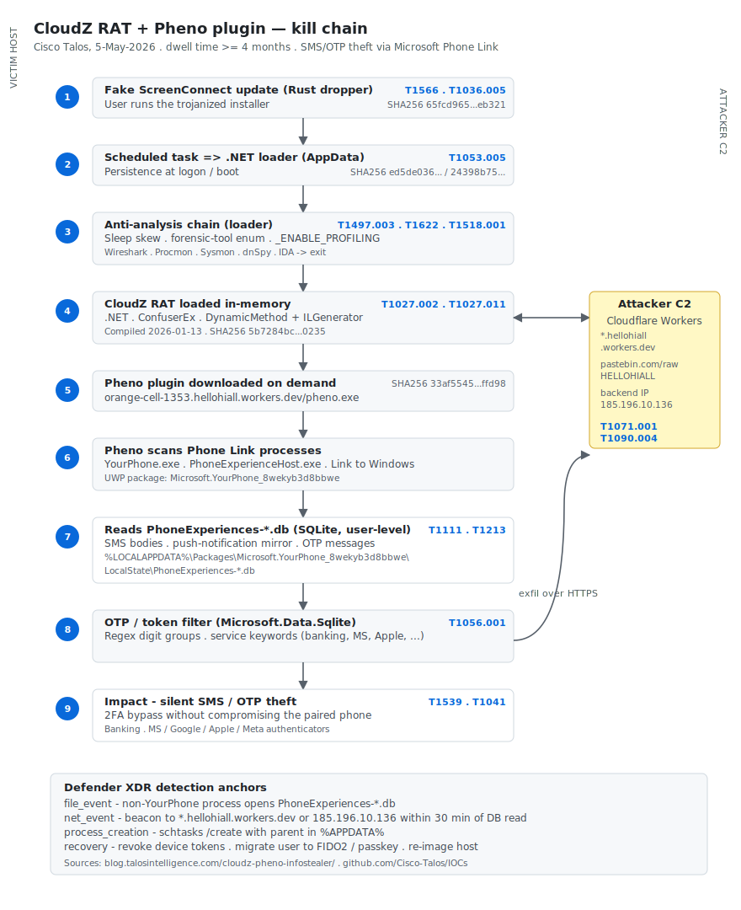

# CloudZ RAT + Pheno plugin — Microsoft Phone Link SMS/OTP theft (Cisco Talos, 5-May-2026)

**Family / cluster:** **CloudZ** (.NET RAT, ConfuserEx-packed, compiled 2026-01-13) and **Pheno** (modular plugin focused on Microsoft Phone Link). First public write-up: **Cisco Talos, 5-May-2026**.

**Attribution confidence: low.** Talos has not linked the activity to a named crew. The intrusion has been active since at least **January 2026** (>4 months dwell at publication time). Tradecraft fits financially-motivated credential theft with a focus on **2FA bypass via SMS interception on the host side**, not on the mobile device.

**Why this case for Friday's DFIR/RE deep-dive slot:** the campaign weaponizes a **default Windows 11 feature** (Phone Link / *YourPhone* UWP package) that mirrors SMS and notifications from the user's paired phone into a local SQLite database the attacker can read with **user-level privileges** — no SYSTEM, no kernel, no driver. It rewrites the threat model for SMS-based 2FA: SIM swap is no longer the only route; the user's own PC has become a cleartext OTP cache.

## Attribution and confidence

- Talos names the families **CloudZ** and **Pheno**; the names are vendor-assigned and unique to this report.
- No public attribution to a state-nexus or known e-crime cluster as of 2026-05-07.
- Genealogy / overlap: not yet established. The fake-ScreenConnect-update lure and the Cloudflare Workers + Pastebin C2 pattern are consistent with **commodity .NET RATs evolving toward token/OTP theft**, but no shared infra has been published.
- Treat the cluster as **independent** until corroborated by a second vendor.

## Kill chain — summary table

| Stage | MITRE | Detail |
|---|---|---|
| Initial Access | T1566 | Delivery vector unconfirmed; observed first artefact is a fake **ScreenConnect update** executable |
| Execution | T1204.002, T1059.001 | User runs the fake update; downstream RAT executes `cmd`/`powershell` on demand |
| Defense Evasion (delivery) | T1036.005 | Binary masquerades as legitimate ScreenConnect installer |
| Persistence | T1053.005 | Scheduled task (logon/boot trigger) executes the .NET loader |
| Defense Evasion (loader) | T1027.002, T1497.003, T1622, T1518.001 | ConfuserEx packing; sleep-skew sandbox check; `_ENABLE_PROFILING` debugger probe; tooling enumeration (Wireshark, Fiddler, Procmon, Sysmon, ProcessHacker, x64dbg, OllyDbg, dnSpy, dnSpyEx, IDA) |
| Defense Evasion (runtime) | T1027.011 | CloudZ uses `System.Reflection.Emit.DynamicMethod` + `ILGenerator` to build methods at runtime — fileless code that does not appear in the on-disk assembly |
| Credential Access | T1539, T1111, T1056.001, T1115 | Browser cookies/credentials, **Phone Link SQLite read for SMS/OTP**, keylogging, clipboard monitor |
| Collection | T1213, T1005 | Local SQLite DB harvest; arbitrary file download |
| Command and Control | T1071.001, T1102.002, T1090.004, T1573.002 | HTTPS to Cloudflare Workers; bidirectional dead-drop via Pastebin (handle `HELLOHIALL`); custom encrypted socket to backend IP |
| Exfiltration | T1041 | Over the C2 channel |



The diagram above lays out the same nine stages with the artefacts and MITRE mappings from this table on the left lane (victim host) and the C2 fabric on the right lane (Cloudflare Workers, Pastebin dead-drop, backend IP). Detection anchors used by the Sigma / KQL / Suricata rules in this folder are summarised at the bottom.

## Stage-by-stage detail

### Initial access — fake ScreenConnect update

A Rust-compiled dropper masquerading as a ScreenConnect installer drops the .NET loader and registers persistence. SHA256: `65fcd965040fabeb6f092df0a4b6856125018bb3b6a1876342da458139f77dac`.

### .NET loader — anti-analysis chain

The loader (variants `ed5de036…3832`, `24398b75…b2b2c`) runs three checks before unpacking the next stage:

1. **Sleep-skew detection.** Calls `Thread.Sleep(N)` and measures wall-clock with `Stopwatch`. If the elapsed time is materially less than `N`, the loader assumes a sandbox is fast-forwarding sleeps and exits.
2. **Forensic-tool enumeration.** Iterates `Process.GetProcesses()` and matches against `wireshark`, `fiddler`, `procmon`, `sysmon`, `processhacker`, `x64dbg`, `ollydbg`, `dnspy`, `dnspyex`, `ida`, `ida64`. If hit, exits silently.
3. **Profiler/debugger probe.** Reads the `_ENABLE_PROFILING` environment variable (set by .NET when a profiler is attached). If present, exits.

Only after all three checks pass does it `Assembly.Load` the decrypted CloudZ payload and invoke its entry point.

### CloudZ RAT — modular .NET implant

- **Compile timestamp:** 2026-01-13.
- **Packer:** ConfuserEx.
- **Code generation:** uses `System.Reflection.Emit.DynamicMethod` with `ILGenerator` to construct methods at runtime — defeats static decompilers (the actual logic does not appear in the on-disk assembly's method tables).
- **Capabilities:** keylogging, clipboard monitor, file management (delete, download, write), arbitrary command execution, browser data theft.
- **Configuration:** decrypts a local stub at start; pulls additional config from Pastebin pages tagged with handle `HELLOHIALL`; refreshes endpoints from Cloudflare Workers URLs.
- **Transport:** custom encrypted socket to backend IP `185.196.10.136`; HTTP/HTTPS fallback to `*.hellohiall.workers.dev`.

### Pheno plugin — Phone Link SQLite OTP harvest

Downloaded on demand from `hxxps://orange-cell-1353.hellohiall.workers.dev/pheno.exe` (SHA256 `33af554562176eff34598a839051b8e91692b0305edfdbb4d8eb9df0103ffd98`).

Pheno keeps a process-name watch loop for the *YourPhone* UWP package — `YourPhone.exe`, `PhoneExperienceHost.exe` and the mobile companion `Link to Windows`. When an active PC-to-phone bridge is observed, Pheno reads:

```
%LOCALAPPDATA%\Packages\Microsoft.YourPhone_8wekyb3d8bbwe\LocalState\PhoneExperiences-*.db
```

This SQLite file caches messages and notifications mirrored from the paired phone, including SMS bodies and (depending on the user's mirroring choices) push-notification content from authenticator-class apps. Pheno opens the DB with embedded `Microsoft.Data.Sqlite`, filters for OTP-shaped numeric tokens and known service strings (`code`, `verification`, `otp`, `token`, `Microsoft`, `Apple`, `Google`, `Meta`, banking-vendor names) and exfiltrates the matching rows.

The harvest runs entirely **at user level** — no driver, no SYSTEM token, no kernel hook needed. The novelty is not technical sophistication; it is **the choice of target**.

## RE notes for the analyst

- ConfuserEx removal: standard `de4dot` / `ConfuserEx Unpacker` rounds, then expect to encounter the dynamic IL emit layer. Decompiled output will look like a "method factory" emitting opcodes from a `byte[]`.
- To reconstruct dynamic methods at runtime, attach a managed debugger (dnSpyEx) to a running CloudZ instance, set a breakpoint on `DynamicMethod.Invoke` or `DynamicMethod.CreateDelegate`, and dump the generated IL. Alternatively, capture `Microsoft-Windows-DotNETRuntime` ETW events `MethodLoadVerbose` and `MethodILToNativeMap` with `dotnet-trace collect`.
- Pheno is small and not heavily packed; static analysis with dnSpyEx is sufficient to confirm Phone Link string anchors, the `Microsoft.Data.Sqlite` reference and the OTP-keyword regex set.

## Detection / hunting strategy

1. **File-event hunt** — any non-YourPhone process reading `Microsoft.YourPhone_8wekyb3d8bbwe\LocalState\PhoneExperiences*.db`.
2. **Process-tree hunt** — dropper or fake-installer in `%APPDATA%` followed by `schtasks /create` and a .NET loader child.
3. **Network hunt** — TLS SNI / DNS / HTTP host containing `hellohiall.workers.dev`; egress to `185.196.10.136`; HTTP GET on `pastebin.com/raw/...` from a non-developer host.
4. **Behavioural hunt** — process-tree where Pheno-style EXE in `%APPDATA%` connects to Cloudflare Workers within minutes of the Phone Link DB being touched.

## What's in this folder

| File | Type | Purpose |
|---|---|---|
| `sigma/cloudz_phone_link_db_access.yml` | Sigma (file_event) | Non-YourPhone process reading PhoneExperiences-*.db |
| `sigma/cloudz_dropper_schtasks_appdata.yml` | Sigma (process_creation) | Dropper-in-AppData → schtasks chain |
| `kql/cloudz_phone_db_to_workers_correlation.kql` | KQL (Defender XDR) | Correlate DB access and `*.hellohiall.workers.dev` egress within 30 min |
| `kql/cloudz_pastebin_handle_hellohiall.kql` | KQL (Defender XDR) | Pastebin raw fetches with workers.dev or backend-IP egress same host |
| `spl/cloudz_workers_pastebin_dotnet_correlation.spl` | SPL (Splunk Sysmon) | Same-process correlation Pastebin + Workers + 185.196.10.136 |
| `yara/cloudz_pheno_heuristic.yar` | YARA | CloudZ/Pheno heuristic (PE + ConfuserEx + Phone Link + Workers + IL emit) |
| `suricata/cloudz_workers_pastebin.rules` | Suricata 7.x | TLS SNI / HTTP host / DNS / IP rules for the C2 footprint |
| `hunts/peak_h1_phone_db_then_workers.md` | PEAK hunt | Hypothesis H1 with full kill-chain narrative |
| `iocs.csv` | IOCs | All Talos indicators with context |

## Pedagogical anchors

- **SMS-based 2FA assumes the SMS lives on a separate device.** Windows 11 Phone Link breaks that assumption by design, by mirroring the SMS into a SQLite file on the PC. Any user-context implant can read it.
- **Detection is on the file-event side, not the process-name side.** CloudZ is fileless on the method level (IL emit) — heuristic byte signatures are weak. The cheap, durable detection is *who reads the SQLite* (whitelisting the YourPhone package) and *who beacons to `*.hellohiall.workers.dev`*.
- **Cloudflare Workers + Pastebin** is a low-cost, high-resilience C2 fabric: defenders rarely block `*.workers.dev` outright (collateral damage), Pastebin is often allow-listed, and the operator can rotate hostnames without rebuilding the binary.
- **Recovery requires more than a password reset.** Sessions and 2FA recovery codes captured during the dwell window remain valid. After IR you must revoke device tokens, rotate every code that may have been mirrored to the host, and migrate to FIDO2 / passkeys.

## Sources

- Cisco Talos — *CloudZ RAT potentially steals OTP messages using Pheno plugin* — https://blog.talosintelligence.com/cloudz-pheno-infostealer/
- Cisco-Talos/IOCs — *cloudz-pheno-infostealer.txt* — https://github.com/Cisco-Talos/IOCs/blob/main/2026/05/cloudz-pheno-infostealer.txt
- BleepingComputer — *CloudZ malware abuses Microsoft Phone Link to steal SMS and OTPs* — https://www.bleepingcomputer.com/news/security/cloudz-malware-abuses-microsoft-phone-link-to-steal-sms-and-otps/
- The Hacker News — *Windows Phone Link Exploited by CloudZ RAT to Steal Credentials and OTPs* — https://thehackernews.com/2026/05/windows-phone-link-exploited-by-cloudz.html
- Dark Reading — *Attacks Abuse Windows Phone Link 