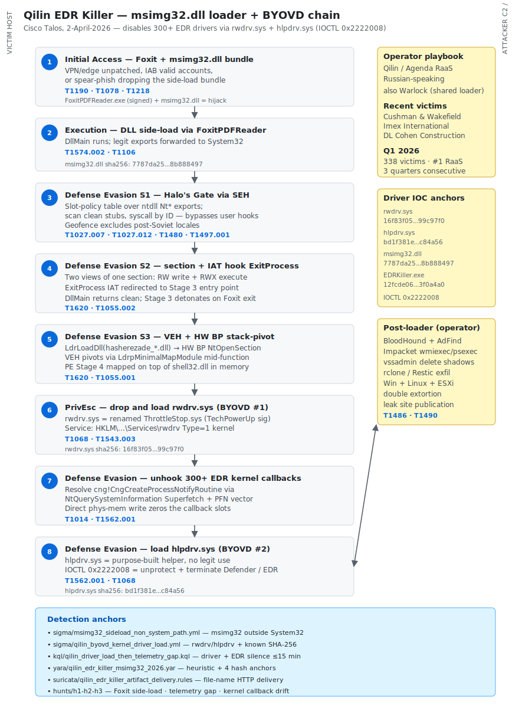

# Qilin EDR Killer — msimg32.dll four-stage loader and BYOVD chain

## TL;DR

Cisco Talos published on 2-April-2026 a deep technical analysis of the loader Qilin (alias Agenda) is using as the pre-stage of its ransomware payload. The malicious binary is a `msimg32.dll` four-stage loader that side-loads under `FoxitPDFReader.exe` (legitimately signed), applies SEH and VEH-based syscall obfuscation in the style of *Halo's Gate*, IAT-hooks `ExitProcess` to detonate the next stage after `DllMain` returns clean, maps memory with two paging-file backed views (RW + RWX) to evade scanners, and lands a BYOVD chain with `rwdrv.sys` (a renamed `ThrottleStop.sys` signed by TechPowerUp LLC) plus `hlpdrv.sys` (a purpose-built malicious helper driver) that unregisters kernel callbacks like `cng!CngCreateProcessNotifyRoutine` via direct physical-memory writes and terminates protected EDR processes through `IOCTL 0x2222008`. The chain disables more than 300 EDR drivers across virtually every major vendor. In the past week Qilin has claimed Cushman & Wakefield (4-May), Imex International and DL Cohen Construction (both 8-May); Qilin has held the #1 position on the RaaS leaderboard for three consecutive quarters with 338 victims in Q1-2026.

## Attribution and confidence

- **Cluster:** Qilin / Agenda. Russian-speaking e-crime RaaS, active since 2022, expanded sharply after the RansomHub collapse in April-2025 absorbed many former affiliates. Double and triple extortion across Windows, Linux and ESXi.
- **Vendor that published the loader chain:** Cisco Talos (Takahiro Takeda and Holger Unterbrink), 2-April-2026 (modified from earlier Sophos coverage of the same loader under the historical name *Shanya*). Replicated and confirmed by The Hacker News, SOC Prime, Security Arsenal and Cybersecurity News in April 2026. The Hacker News also reports the same chain being deployed by **Warlock** ransomware, suggesting a shared commodity loader between adjacent operators.
- **Technical attribution confidence:** *high* (Talos signature-level analysis with reproducible IOCs, cross-referenced by Sophos and others). **Country / state attribution:** N/A — this is e-crime RaaS, Russian-speaking ecosystem, financially motivated.
- **Cluster overlap (no merge):**

| Vendor | Identifier | Notes |
|---|---|---|
| Cisco Talos | Qilin | Loader chain analysis (msimg32.dll + rwdrv.sys + hlpdrv.sys) |
| Sophos | Shanya | Earlier reference for the same loader family |
| The Hacker News | Qilin and Warlock | Same loader observed in both ransomware operations |
| MITRE | unaliased | Track at operational level — no formal G-number |

- **Genealogy / link with previous repo cases:**
  - Day 1 (TheGentlemen + SystemBC) — same RaaS economy, different loader and EDR-evasion path.
  - Day 4 (VECT 2.0) — also abuses BYOVD-class primitives but with EDR-impair via SafeBoot persistence rather than driver-based callback unhook.
  - Day 8 (Akira × SonicWall CVE-2024-40766) — Akira shares lineage with the broader Conti diaspora, also uses BYOVD (`truesight.sys`).

## Kill chain — summary table

| Stage | MITRE | Detail |
|---|---|---|
| Initial Access | T1190, T1078, T1218 | VPN / edge appliance unpatched, valid accounts from IABs, or spear-phish dropping the Foxit + msimg32.dll bundle |
| Execution | T1574.002, T1106 | DLL side-loading via `FoxitPDFReader.exe` importing `msimg32.dll` from co-located folder |
| Defense Evasion (Stage 1) | T1027.007, T1027.012, T1480, T1497.001 | Slot-policy table over ntdll Nt* exports, Halo's Gate clean-stub syscall reuse, geofence excluding post-Soviet locales, breakpoint check on `KiUserExceptionDispatcher` |
| Defense Evasion (Stage 2) | T1620, T1055.002 | Paging-file backed section mapped with two views (RW + RWX), IAT hook on `ExitProcess` to detonate Stage 3 after the host process exits cleanly |
| Defense Evasion (Stage 3) | T1620, T1055.001 | VEH plus hardware breakpoints on `NtOpenSection` and `NtMapViewOfSection`, stack-pivot to `LdrpMinimalMapModule` to map the embedded PE on top of `shell32.dll` in memory |
| Privilege Escalation (Stage 4) | T1068, T1543.003 | Drop and load `rwdrv.sys` (renamed `ThrottleStop.sys`, valid TechPowerUp signature) via `SCM` create-service-and-start; physical memory access primitives obtained |
| Defense Evasion (Stage 4) | T1014, T1562.001 | Iterate hardcoded list of 300+ EDR driver names; locate kernel callbacks via Superfetch `NtQuerySystemInformation` and PFN metadata; unregister callbacks by direct physical-memory write |
| Defense Evasion (Stage 4) | T1562.001 | Drop and load `hlpdrv.sys` (purpose-built malicious driver, no legitimate function); send `IOCTL 0x2222008` to unprotect and terminate Defender / EDR processes |
| Impact (downstream) | T1486, T1490 | Ransomware encryption Win + Linux + ESXi, double extortion, `vssadmin delete shadows` and similar inhibit-recovery actions |



The diagram has two lanes: the victim host on the left (process tree from FoxitPDFReader through the in-memory PE stages and the two malicious drivers) and the attacker C2 / ransomware payload pipeline on the right. The detection-anchors box at the bottom maps each stage to the rules in `sigma/`, `kql/`, `yara/` and `suricata/` so a defender can pick the right detection by the stage they are seeing telemetry from.

## Stage-by-stage detail

### Initial Access

Talos does not pin the initial-access vector for the specific bundle observed. Qilin's playbook in 2026 keeps three dominant routes: unpatched VPN / edge appliances (Citrix NetScaler, Fortinet, SonicWall, Cisco ASA WebVPN), spear-phishing with LNK / ISO / IMG dropping the Foxit + msimg32.dll bundle, and valid accounts purchased from Initial Access Brokers in the post-RansomHub diaspora. The bundle ships as a side-load-ready kit: `FoxitPDFReader.exe` (signed, legitimate) in a user folder with a malicious `msimg32.dll` placed next to it. When Foxit starts, it imports `msimg32.dll` by name and the malicious DLL wins the search-order over `C:\Windows\System32\msimg32.dll`.

### Execution

The malicious DLL re-exports the legitimate functions (`AlphaBlend`, `GradientFill`, `TransparentBlt`, etc.) by forwarding to `C:\Windows\System32\msimg32.dll` so that Foxit does not crash. The malicious logic runs in `DllMain`.

```c
// Forwarded exports keep Foxit healthy
EXPORTS
  AlphaBlend = C:\Windows\System32\msimg32.AlphaBlend
  GradientFill = C:\Windows\System32\msimg32.GradientFill
  TransparentBlt = C:\Windows\System32\msimg32.TransparentBlt
  ; ...
```

### Defense Evasion — Stage 1 (Halo's Gate via SEH)

The loader builds a heap buffer used as a slot-policy table: one byte per 16-byte block of ntdll's `.text` region. It iterates `ntdll.dll` exports starting with `Nt` and marks each slot, with `NtTraceEvent`, `NtTraceControl` and `NtAlpcSendWaitReceivePort` getting a special policy. It then resolves `ntdll!LdrProtectMrdata` indirectly: locate `.mrdata`, identify the dispatcher pointer that lives there, anchor on `RtlDeleteFunctionTable` (resolved by name hash), scan for a `CALL rel32` opcode (`0xE8`) immediately after the anchor, follow the relative target — that is `LdrProtectMrdata`. Stage 1 then makes `.mrdata` writable and replaces the exception dispatcher slot with its own `hook_function_ExceptionCallback`.

When the malware wants to call any `Nt*` syscall that is hooked in user mode by the local EDR, it triggers a single-step exception. The handler uses the slot-policy table to classify the target stub, scans backward and forward for clean neighbouring stubs that an EDR did not hook (most EDRs do not blanket-hook every `Nt*` stub), loads the desired syscall ID into `eax` manually, and issues `syscall` from the clean neighbour stub. The kernel only checks `eax` — the user-mode hooks are bypassed without overwriting any code.

```c
// Pseudo-Ghidra style — illustrative, not copy-paste-compile
size_t code_size  = ntdll_OptionalHeader.SizeOfCode;
uint8_t *slot_tab = HeapAlloc(GetProcessHeap(), 0, code_size >> 4);
for (export = ntdll.exports; export; export = export->next) {
    if (strncmp(export->name, "Nt", 2) != 0) continue;
    uint32_t slot_idx = ((uintptr_t)export->va - ntdll.BaseOfCode) >> 4;
    slot_tab[slot_idx] = POLICY_DEFAULT;
}
slot_tab[idx_of("NtTraceEvent")]              = POLICY_SPECIAL;
slot_tab[idx_of("NtTraceControl")]            = POLICY_SPECIAL;
slot_tab[idx_of("NtAlpcSendWaitReceivePort")] = POLICY_SPECIAL;
```

Stage 1 also runs a geofence that excludes locales typical of post-Soviet countries (the standard e-crime ru-speaking exclusion list) and an anti-debug check that crashes the process if a breakpoint is set on `KiUserExceptionDispatcher`.

### Defense Evasion — Stage 2 (paging-file section + IAT hook on ExitProcess)

```c
// Paging-file section mapped with two views to obscure executable permissions
HANDLE hSec = CreateFileMappingA(INVALID_HANDLE_VALUE, NULL,
                                 PAGE_EXECUTE_READWRITE, 0, size, NULL);
void *write_view = MapViewOfFile(hSec, FILE_MAP_WRITE,                         0, 0, size); // 0x2
void *exec_view  = MapViewOfFile(hSec, FILE_MAP_READ | FILE_MAP_EXECUTE,       0, 0, size); // 0x24
// decode payload bytes into write_view; effective RWX on exec_view without MEM_COMMIT declaring it
HookIAT(MainProcessImage, "kernel32.dll", "ExitProcess", &Stage3_entry);
return; // DllMain returns clean
```

Stage 1 returns without further activity. Stage 3 detonates only when the host process (Foxit) eventually calls `ExitProcess` along its normal exit path — the IAT entry has been swapped to point at `Stage3_entry` (around `0x2471000` in the analysed sample, dynamically allocated).

### Defense Evasion — Stage 3 (VEH + hardware-breakpoint stack-pivot)

Stage 3 maps `shell32.dll` legitimately and overwrites it in place with the embedded PE (relocations applied by hand). To make the mapping look ordinary, the loader registers a VEH, sets a hardware breakpoint on `ntdll!NtOpenSection`, and calls `LdrLoadDll` with a fake DLL named `hasherezade_<redacted>.dll` (a deliberate provocation aimed at the RE community). When the breakpoint fires inside `NtOpenSection`, the VEH:

- Renames the in-memory string from `hasherezade_*.dll` to the real target (`shell32.dll`).
- Sets `ctx->rip` to a `ret` instruction inside `NtOpenSection`.
- Sets `ctx->rsp` to `LdrpMinimalMapModule + offset`, immediately after the call to `NtOpenSection`.
- Plants a hardware breakpoint on `NtMapViewOfSection`.
- Calls `NtContinue` — the `ret` pivots execution into `LdrpMinimalMapModule` mid-function.

When `NtMapViewOfSection` fires next, the VEH clears all hardware breakpoints and stack-pivots once more to `LdrpMinimalMapModule + 0x23b`. The PE is now mapped on top of `shell32.dll` in memory and control transfers to Stage 4.

### Privilege Escalation and Defense Evasion — Stage 4 (BYOVD chain)

Stage 4 first runs the geofence again (a strong hint that Stages 1-3 are a generic loader the operator can reuse for other payloads). It then loads `rwdrv.sys` — a renamed copy of `ThrottleStop.sys` from TechPowerUp LLC, signed and accepted by Windows.

```text
rwdrv.sys IOCTL surface (subset)
  - inb / inw / ind   read I/O port
  - outb / outw / outd write I/O port
  - __readmsr / __writemsr  CPU MSR
  - MmMapIoSpace + MmMapLockedPagesSpecifyCache  arbitrary physical memory map
  - read/write physical memory  (the primitives Stage 4 actually uses)
  - PCI config space read/write
```

The loader resolves DLLs and APIs by hash via PEB walking. It calls `NtQuerySystemInformation` with the `SystemSuperfetchInformation` class (brute-forcing v1 vs v2 between Windows builds) to obtain Page Frame Number metadata into `g_PfnVector`. From this it can compute the physical address of any virtual address it is interested in.

```c
// Stage 4 — illustrative pseudo-code for the callback unregistration step
for (idx = 0; idx < EDR_DRIVER_COUNT; idx++) {
    PVOID kva = ResolveKernelObjectByName(EDR_DRIVERS[idx]);  // anchored on cng!CngCreateProcessNotifyRoutine etc.
    if (!kva) continue;
    PHYSICAL_ADDRESS pa = VirtualToPhysical(kva, g_PfnVector);
    write_to_phy_mem(pa, &zero_callback, sizeof(uintptr_t));   // unregister via direct phys write
}
```

Once user-mode and kernel-mode visibility is gone, Stage 4 loads `hlpdrv.sys` — a purpose-built malicious driver, not a re-purposed legitimate one. Its only function is to receive `IOCTL 0x2222008` and unprotect-then-terminate processes (Defender, MsMpEng, EDR agents). After the kill, Stage 4 restores the `CiValidateImageHeader` callback (it had previously redirected this to `ArbPreprocessEntry`, a function that always returns `TRUE`) so the system stays stable enough for the operator's next steps.

### Impact (downstream)

After the EDR is gone, the operator's playbook continues outside the loader's scope: discovery (BloodHound, AdFind), lateral movement (Impacket `wmiexec.py` / `psexec.py`), inhibit recovery (`vssadmin delete shadows /all /quiet`, `wbadmin delete catalog`), exfiltration (`rclone` or `Restic` to MEGA / S3), and finally encryption Win + Linux + ESXi with double extortion.

## RE notes

| Component | SHA256 | Lang | Packer | Notes |
|---|---|---|---|---|
| `msimg32.dll` | `7787da25451f5538766240f4a8a2846d0a589c59391e15f188aa077e8b888497` | C/C++ x64 PE | none on Stage 1; embedded compressed Stage 4 PE | Forwards legit exports to System32; SEH+VEH+IAT hook chain |
| `rwdrv.sys` | `16f83f056177c4ec24c7e99d01ca9d9d6713bd0497eeedb777a3ffefa99c97f0` | C signed kernel driver | none | Renamed `ThrottleStop.sys`, valid TechPowerUp LLC signature; physical memory primitives |
| `hlpdrv.sys` | `bd1f381e5a3db22e88776b7873d4d2835e9a1ec620571d2b1da0c58f81c84a56` | C kernel driver | none | Purpose-built; IOCTL `0x2222008` unprotect+terminate process |
| `EDRKiller.exe` (Stage 4 memdump + overlay) | `12fcde06ddadf1b48a61b12596e6286316fd33e850687fe4153dfd9383f0a4a0` | C/C++ x64 PE | custom in-memory unpack | Compile timestamp `0x684d33f0` (14-Jun-2025); ImpHash `05aa031a007e2f51e3f48ae2ed1e1fcb` |

Anti-RE checklist before debugging:
1. Remove breakpoints from `KiUserExceptionDispatcher` (the loader crashes the process if any are detected).
2. Set the analysis VM locale to a non-CIS one (`en-US`, `de-DE`, `ja-JP`); otherwise the loader exits early.
3. Hook `ntdll!LdrProtectMrdata` and `ntdll!CreateFileMappingA` to log the stage transitions.
4. For Stage 3, hook `LdrLoadDll` filtered by name `*hasherezade*` and dump the embedded PE before the `shell32.dll` overwrite.

Useful ETW providers to enable for defensive capture during dynamic analysis:
- `Microsoft-Windows-Threat-Intelligence` (callback registration / unregistration on `PsSetXxxNotifyRoutine`).
- `Microsoft-Antimalware-Service` (visibility into Defender state changes before the kill).
- `Microsoft-Windows-Kernel-Memory` (physical memory access events from user mode).

## Detection strategy

### Telemetry that matters

| Source | Event / Table | Why |
|---|---|---|
| Sysmon ID 1 | Process Create | `FoxitPDFReader.exe` from a non-install path (Downloads, Desktop, Temp, AppData) is the side-load vehicle |
| Sysmon ID 7 | Image Load | `msimg32.dll` loaded from outside `System32` / `SysWOW64` / `WinSxS` |
| Sysmon ID 6 | Driver Load | `rwdrv.sys`, `hlpdrv.sys`, or `ThrottleStop.sys` loaded outside legitimate tooling paths |
| Sysmon ID 13 | Registry Set | `HKLM\SYSTEM\CurrentControlSet\Services\rwdrv*` or `\hlpdrv*` (kernel driver service install) |
| Win Sec 4697 | Service Install | New kernel driver service registration |
| Defender XDR | `DeviceImageLoadEvents` | Same as Sysmon 7 with cross-fleet baseline |
| Defender XDR | `DeviceProcessEvents` | Parent `Foxit*` with anomalous in-memory-only chain |
| Defender XDR | `DeviceFileEvents` | Drop of `rwdrv.sys` / `hlpdrv.sys` in `Temp`, `ProgramData`, `Public` |
| Defender XDR | `DeviceEvents` | `AntivirusDetectionDropped` or sudden silence after a kernel driver load |
| Sentinel | `SecurityEvent 4688` | `FoxitPDFReader.exe` parent + cmdline anomalies |

The forensic gold signal is a **gap in EDR telemetry**: when the agent dies, the SIEM hears silence. Detection cannot live solely on the endpoint — an external canary (network-side EDR heartbeat or out-of-band agent poll) is required.

### Detection coverage

| Engine | File | Logic |
|---|---|---|
| Sigma | [`sigma/msimg32_sideload_non_system_path.yml`](./sigma/msimg32_sideload_non_system_path.yml) | `msimg32.dll` image_load from outside System32 / SysWOW64 / WinSxS |
| Sigma | [`sigma/qilin_byovd_kernel_driver_load.yml`](./sigma/qilin_byovd_kernel_driver_load.yml) | Driver load of `rwdrv.sys` / `hlpdrv.sys` / `ThrottleStop.sys` outside legitimate tooling paths, plus known SHA-256 anchors |
| Sigma | [`sigma/qilin_driver_service_install.yml`](./sigma/qilin_driver_service_install.yml) | `sc.exe create` or registry write under `\Services\rwdrv` / `\hlpdrv` for kernel driver |
| KQL | [`kql/qilin_msimg32_sideload_with_driver_drop.kql`](./kql/qilin_msimg32_sideload_with_driver_drop.kql) | Defender XDR — non-system-path msimg32 load joined with `rwdrv.sys` / `hlpdrv.sys` file drop within 30 minutes |
| KQL | [`kql/qilin_driver_load_then_telemetry_gap.kql`](./kql/qilin_driver_load_then_telemetry_gap.kql) | Defender XDR — suspicious driver load followed by a measurable drop in `DeviceProcessEvents` count from the same host |
| KQL | [`kql/qilin_foxit_unusual_path.kql`](./kql/qilin_foxit_unusual_path.kql) | Defender XDR — `FoxitPDFReader.exe` running from non-install paths and loading `msimg32.dll` |
| YARA | [`yara/qilin_edr_killer_msimg32_2026.yar`](./yara/qilin_edr_killer_msimg32_2026.yar) | Multi-rule heuristic for the loader (Halo's Gate + IAT hook + `hasherezade` provocation) and known IOCs |
| Suricata | [`suricata/qilin_edr_killer_artifact_delivery.rules`](./suricata/qilin_edr_killer_artifact_delivery.rules) | HTTP file-delivery anchors for `rwdrv.sys`, `hlpdrv.sys`, `msimg32.dll` outbound to internal hosts |

### Threat hunting hypotheses

- **H1 — Foxit PDF Reader as a side-load vehicle**: `FoxitPDFReader.exe` running from non-install paths and loading `msimg32.dll` from a co-located folder is rarely benign; pair with EDR telemetry gap within 15 minutes. See [`hunts/h1_foxit_msimg32_sideload.md`](./hunts/h1_foxit_msimg32_sideload.md).
- **H2 — Retroactive search for the EDR telemetry gap**: hosts where `DeviceImageLoadEvents` shows a `.sys` driver load from `Temp` / `ProgramData` / `Public`, followed by a measurable drop in `DeviceProcessEvents` count over 10 minutes, are likely mid-attack. See [`hunts/h2_edr_telemetry_gap_after_driver_load.md`](./hunts/h2_edr_telemetry_gap_after_driver_load.md).
- **H3 — Kernel callback drift detection (ELAM-style)**: deploy a kernel-mode agent that periodically enumerates `PsSetCreateProcessNotifyRoutineEx` callbacks and compares against a known-good baseline; any disappearance of a known EDR callback without a host reboot is a near-certainty signal. See [`hunts/h3_kernel_callback_drift.md`](./hunts/h3_kernel_callback_drift.md).

## Incident response playbook

### First 60 minutes (triage)

1. **Isolate, do not power off** the host. The loader runs in memory; powering off loses Stages 2-4 and the embedded list of 300+ EDR drivers.
2. **Acquire a RAM dump** with `winpmem`, `MagnetRAM` or `DumpIt` before any other action — this is the only way to recover the unpacked Stage 4 PE.
3. **Snapshot kernel driver state** (`Get-Service`, `Get-CimInstance Win32_SystemDriver`) and the `SYSTEM` registry hive — kernel driver service entries under `\Services\` are key persistence anchors.
4. **Locate the EDR telemetry gap T0** — when did the agent stop reporting to the SOC? That is the effective time of kill.
5. **Quarantine peer hosts** in the same domain that may have received the same bundle (operators often stage in parallel across multiple endpoints).
6. **Do not reboot** — Stages 1-4 do not persist on disk apart from the two driver files; rebooting destroys in-memory evidence.

### Artifacts to collect

| Artifact | Path | Tool | Why it matters |
|---|---|---|---|
| Malicious `msimg32.dll` | wherever Foxit ran from (`%USERPROFILE%\Downloads\<bundle>\`, `%TEMP%\<random>\`) | `Get-FileHash`, copy off-host | Stage 1 loader binary |
| `rwdrv.sys` | `%TEMP%`, `%PROGRAMDATA%`, `C:\Users\Public\` | `Get-FileHash`, hash check vs IOC list | BYOVD #1 |
| `hlpdrv.sys` | same locations as `rwdrv.sys` | `Get-FileHash`, hash check vs IOC list | BYOVD #2 |
| Service hives | `HKLM\SYSTEM\CurrentControlSet\Services\rwdrv` and `\hlpdrv` (`ImagePath`, `Type=1` kernel) | `reg export` | Persistence anchor for the drivers |
| Foxit install paths | `HKCU\Software\Foxit Software\` | `reg query` | Distinguish managed install vs portable bundle |
| `System.evtx` | `%SystemRoot%\System32\winevt\Logs\System.evtx` | `wevtutil`, EvtxECmd | EID 7045 (kernel driver service install), 7036 (state changes) |
| Sysmon EVTX | `%SystemRoot%\System32\winevt\Logs\Microsoft-Windows-Sysmon%4Operational.evtx` | EvtxECmd | Process create + driver load + image load + reg set |
| Defender XDR DeviceEvents | tabled | KQL | `AntivirusEmergencyUpdate` or anomalous silence |
| Memory image | offline RAM image | `winpmem`, `MagnetRAM` | Stages 2-4 + the 300+ EDR driver list extractable from the in-memory PE |

### IR queries and commands

```powershell
# PowerShell on isolated host. Do NOT run on production endpoints
# 1) Suspicious driver services
Get-CimInstance Win32_SystemDriver |
  Where-Object { $_.Name -in @('rwdrv','hlpdrv') -or $_.PathName -match 'rwdrv|hlpdrv|throttlestop' } |
  Select-Object Name, State, StartMode, PathName

# 2) Dropped driver files
Get-ChildItem -Path C:\Windows\Temp,C:\ProgramData,C:\Users\Public -Recurse `
  -Include rwdrv.sys,hlpdrv.sys -ErrorAction SilentlyContinue |
  Select-Object FullName, LastWriteTime, Length, @{N='SHA256';E={(Get-FileHash $_.FullName -Algorithm SHA256).Hash}}

# 3) msimg32.dll outside System32
Get-ChildItem -Path C:\ -Recurse -Filter msimg32.dll -ErrorAction SilentlyContinue |
  Where-Object { $_.DirectoryName -notmatch 'System32|SysWOW64|WinSxS' } |
  Select-Object FullName, LastWriteTime, @{N='SHA256';E={(Get-FileHash $_.FullName -Algorithm SHA256).Hash}}

# 4) Sysmon EID 6 (DriverLoad) for the last 72 hours
Get-WinEvent -FilterHashtable @{LogName='Microsoft-Windows-Sysmon/Operational'; Id=6; StartTime=(Get-Date).AddHours(-72)} |
  Select-Object TimeCreated, @{N='ImageLoaded';E={$_.Properties[5].Value}}, @{N='Hashes';E={$_.Properties[6].Value}}
```

```bash
# Linux / ESXi victim (post-kill encryption stage), capture before reboot
ps auxf > /tmp/ir-ps-`hostname`.txt
lsmod   > /tmp/ir-lsmod-`hostname`.txt
cat /proc/modules /proc/*/maps > /tmp/ir-modmaps-`hostname`.txt 2>/dev/null
# RAM dump: LiME (Linux), esxcli for ESXi vmkernel
```

```kql
// Defender XDR — timeline reconstruction for an infected host
let host = "INFECTED-HOST";
DeviceProcessEvents
| where DeviceName == host
| where Timestamp between (datetime(2026-05-12T00:00:00) .. datetime(2026-05-12T23:59:59))
| project Timestamp, FileName, ProcessCommandLine, InitiatingProcessFileName, AccountName
| union (
    DeviceImageLoadEvents | where DeviceName == host | where Timestamp between (datetime(2026-05-12T00:00:00) .. datetime(2026-05-12T23:59:59))
    | project Timestamp, FileName=strcat("[ImageLoad] ", FileName), ProcessCommandLine=FolderPath, InitiatingProcessFileName, AccountName
  )
| union (
    DeviceFileEvents | where DeviceName == host | where Timestamp between (datetime(2026-05-12T00:00:00) .. datetime(2026-05-12T23:59:59))
    | where FileName endswith ".sys" or FileName endswith ".dll"
    | project Timestamp, FileName=strcat("[FileEvent] ", FileName), ProcessCommandLine=FolderPath, InitiatingProcessFileName, AccountName
  )
| order by Timestamp asc
```

### Containment, eradication, recovery

**Containment.** Isolate the host through NAC or EDR (without powering off). Block the known IOC SHA-256 in the WDAC / DeviceGuard driver allowlist policy. Revoke the affected user's AD sessions, rotate the password and force Kerberos TGT re-issue. If the host had reached a Domain Controller, rotate `krbtgt` twice, 24 hours apart.

**Eradication.** Re-image is mandatory — clean is not safe. Stage 4 lives in memory; once the EDR was killed, the operator may have dropped additional backdoors (Cobalt Strike, Sliver, RDP shadow) outside the loader scope. Persistence vectors past the loader belong to the post-loader operator playbook and must be assumed present.

**What NOT to do.**
- Do not reboot before the RAM dump — Stages 2-4 and the EDR driver list are lost.
- Do not pull the host from the domain before the IR sweep — you lose attribution of which privileged accounts were used in lateral movement.
- Do not "clean" by simply deleting `rwdrv.sys` and `hlpdrv.sys`. There are multiple persistence vectors past the EDR kill that are operator-controlled.
- Do not upload samples to public VirusTotal without coordinating with CTI — Qilin operators monitor VT and rotate the loader.

### Recovery validation

A host is considered recovered when it has been re-imaged, the EDR has been re-installed, telemetry to the SOC has resumed, and the same hunts H1 / H2 / H3 have been re-run across the rest of the fleet to confirm no peer compromise. Foxit PDF Reader policy must be tightened to allow only the managed MSI install (`C:\Program Files\Foxit Software\`); portable executables of Foxit must be blocked through AppLocker / WDAC. The user's account must be re-enabled only after MFA factors are reset and a 7-day baseline of normal logon behaviour confirms no further compromise.

## IOCs

| Type | Value | Context | Confidence | Source |
|---|---|---|---|---|
| sha256 | `7787da25451f5538766240f4a8a2846d0a589c59391e15f188aa077e8b888497` | msimg32.dll Qilin loader Stage 1 | high | Talos |
| sha256 | `16f83f056177c4ec24c7e99d01ca9d9d6713bd0497eeedb777a3ffefa99c97f0` | rwdrv.sys = ThrottleStop.sys renamed | high | Talos |
| sha256 | `bd1f381e5a3db22e88776b7873d4d2835e9a1ec620571d2b1da0c58f81c84a56` | hlpdrv.sys purpose-built malicious driver | high | Talos |
| sha256 | `12fcde06ddadf1b48a61b12596e6286316fd33e850687fe4153dfd9383f0a4a0` | EDRKiller.exe Stage 4 PE (memdump + overlay) | high | Talos |
| md5 | `89ee7235906f7d12737679860264feaf` | msimg32.dll | high | Talos |
| md5 | `6bc8e3505d9f51368ddf323acb6abc49` | rwdrv.sys | high | Talos |
| md5 | `cf7cad39407d8cd93135be42b6bd258f` | hlpdrv.sys | high | Talos |
| sha1 | `01d00d3dd8bc8fd92dae9e04d0f076cb3158dc9c` | msimg32.dll | high | Talos |
| sha1 | `82ed942a52cdcf120a8919730e00ba37619661a3` | rwdrv.sys | high | Talos |
| sha1 | `ce1b9909cef820e5281618a7a0099a27a70643dc` | hlpdrv.sys | high | Talos |
| sha1 | `84e2d2084fe08262c2c378a377963a1482b35ac5` | EDRKiller.exe | high | Talos |
| string | `IOCTL 0x2222008` | hlpdrv.sys terminate-protected-process IOCTL | high | Talos |
| string | `hasherezade` | provocative DLL name string in Stage 3 VEH path | medium | Talos |
| path | `C:\Windows\Temp\rwdrv.sys` | typical transient drop location | medium | Talos |

The full list lives in [`iocs.csv`](./iocs.csv).

## Secondary findings

- **CVE-2026-41940 cPanel / WHM authentication bypass weaponised at scale** — at least 44,000 IPs scanning honeypots since 30-Apr-2026, with a heavy focus on government and military domains in the Philippines and Laos as well as MSPs and hosting providers. Botnet deployment followed by ransomware that uses the `.sorry` extension. Public PoC in circulation. Operators combine cryptocurrency theft and low-ticket extortion. CISA KEV add 30-Apr-2026, FCEB deadline 21-May-2026. Originally a secondary finding from 1-May; now an active mass-exploitation operation. ([The Hacker News](https://thehackernews.com/2026/05/critical-cpanel-vulnerability.html))

- **Unoaerre — Italian gold jewellery manufacturer hit by ransomware on 9-May-2026, EUR 3.8M Bitcoin demand** — operations disrupted, the operator cluster is not yet public (Lynx is the leading hypothesis given TTPs and the leak-site shape). Lynx and Leak Bazaar accounted for over 70% of weekly ransomware activity according to public trackers. An Italian gold / jewellery manufacturer is an unusual target for Lynx. Investigation is open with Italy's CNAIPIC. ([PurpleOps tracker](https://purple-ops.io/blog/ransomware-tracker-2026))

- **Apache HTTP/2 CVE-2026-23918 — `mod_http2` double-free with possible RCE (CVSS 8.8)** — affects Apache HTTP Server 2.4.66; immediate mitigation is `Protocols h1` until upgrade. Exploit-kit preparation suspected. No confirmed in-the-wild exploitation reports yet, but the shape of the vulnerability (pre-auth, client-driven) makes it high-value for botnet operators and RaaS affiliates. ([The Hacker News](https://thehackernews.com/2026/05/critical-apache-http2-flaw-cve-2026.html))

## Pedagogical anchors

- **EDR telemetry gap is the highest-confidence signal you have.** When the agent goes silent, the SIEM has to fire — design out-of-band heartbeats and correlate gaps with kernel-driver events.
- **BYOVD has a familiar shape: legitimate-signed driver + purpose-built helper driver.** Do not chase the renamed driver alone; the helper is often the cleaner anchor because it lacks any legitimate use case (`hlpdrv.sys` here, `nseckrnl.sys` in Warlock, `truesight.sys` in Akira and DragonForce).
- **DLL side-loading via signed userland apps remains a recurring pattern** (Foxit, ScreenConnect, Yandex, VMtools, Communicator across recent cases in this repo). Lock down portable executables and force managed MSI installs.
- **Halo's Gate-style user-mode-hook bypass means EDR user-mode hooks alone are insufficient.** Defenders need ETW-TI plus kernel callback baselining; the bypass works precisely because EDRs hook the named API stub but rely on the kernel only checking `eax` for the syscall ID.
- **Re-image, never clean** — once a host has had its kernel callbacks unhooked and its EDR killed, you have no ground truth about what else the operator dropped.

## What's in this folder

| File | Purpose |
|---|---|
| [README.md](./README.md) | This document |
| [kill_chain.svg](./kill_chain.svg) | Adaptive light/dark kill-chain diagram |
| [sigma/msimg32_sideload_non_system_path.yml](./sigma/msimg32_sideload_non_system_path.yml) | Sigma — `msimg32.dll` image_load from outside System32/SysWOW64/WinSxS |
| [sigma/qilin_byovd_kernel_driver_load.yml](./sigma/qilin_byovd_kernel_driver_load.yml) | Sigma — `rwdrv.sys` / `hlpdrv.sys` / mis-placed `ThrottleStop.sys` driver load + known SHA-256 |
| [sigma/qilin_driver_service_install.yml](./sigma/qilin_driver_service_install.yml) | Sigma — `sc.exe create` or registry write under `\Services\rwdrv` / `\hlpdrv` |
| [kql/qilin_msimg32_sideload_with_driver_drop.kql](./kql/qilin_msimg32_sideload_with_driver_drop.kql) | Defender XDR — non-system-path msimg32 load joined with malicious driver drop |
| [kql/qilin_driver_load_then_telemetry_gap.kql](./kql/qilin_driver_load_then_telemetry_gap.kql) | Defender XDR — driver load followed by telemetry quiescence |
| [kql/qilin_foxit_unusual_path.kql](./kql/qilin_foxit_unusual_path.kql) | Defender XDR — Foxit running from non-install paths and loading msimg32 |
| [yara/qilin_edr_killer_msimg32_2026.yar](./yara/qilin_edr_killer_msimg32_2026.yar) | YARA — heuristic for the loader plus known IOC anchors |
| [suricata/qilin_edr_killer_artifact_delivery.rules](./suricata/qilin_edr_killer_artifact_delivery.rules) | Suricata — file-delivery anchors over HTTP for the three IOC files |
| [hunts/h1_foxit_msimg32_sideload.md](./hunts/h1_foxit_msimg32_sideload.md) | PEAK H1 — Foxit as side-load vehicle |
| [hunts/h2_edr_telemetry_gap_after_driver_load.md](./hunts/h2_edr_telemetry_gap_after_driver_load.md) | PEAK H2 — telemetry gap retroactive sweep |
| [hunts/h3_kernel_callback_drift.md](./hunts/h3_kernel_callback_drift.md) | PEAK H3 — kernel callback baseline drift |
| [iocs.csv](./iocs.csv) | Full IOC list |

## Sources

- [Qilin EDR killer infection chain — Cisco Talos (2-Apr-2026)](https://blog.talosintelligence.com/qilin-edr-killer/)
- [Qilin and Warlock Ransomware Use Vulnerable Drivers to Disable 300+ EDR Tools — The Hacker News (Apr-2026)](https://thehackernews.com/2026/04/qilin-and-warlock-ransomware-use.html)
- [Qilin and Warlock BYOVD Attack: Detecting msimg32.dll and EDR Bypass — Security Arsenal (Apr-2026)](https://securityarsenal.com/blog/qilin-and-warlock-byovd-attack-detecting-msimg32dll-and-edr-bypass)
- [Qilin EDR Killer: Driver Abuse to Terminate 300+ Tools — SOC Prime (Apr-2026)](https://socprime.com/active-threats/qilin-edr-killer-infection-chain/)
- [Add Malicious Driver "hlpdrv.sys" — LOLDrivers project issue tracker](https://github.com/magicsword-io/LOLDrivers/issues/254)
- [Qilin Ransomware Strategic Threat Assessment 2022-2026 — FalconFeeds](https://falconfeeds.io/blogs/qilin-ransomware-cartel-strategic-threat-assessment-2022-2026)
- [Critical cPanel Vulnerability Weaponized to Target Government and MSP Networks — The Hacker News](https://thehackernews.com/2026/05/critical-cpanel-vulnerability.html)
- [Critical Apache HTTP/2 Flaw (CVE-2026-23918) Enables DoS and Potential RCE — The Hacker News](https://thehackernews.com/2026/05/critical-apache-http2-flaw-cve-2026.html)
- [Ransomware Activity Tracker 2026 — PurpleOps](https://purple-ops.io/blog/ransomware-tracker-2026)
- [IOCs repository — Cisco Talos GitHub](https://github.com/Cisco-Talos/IOCs/blob/main/2026/04/overview-of-ransomware-threats-in-japan.txt)
