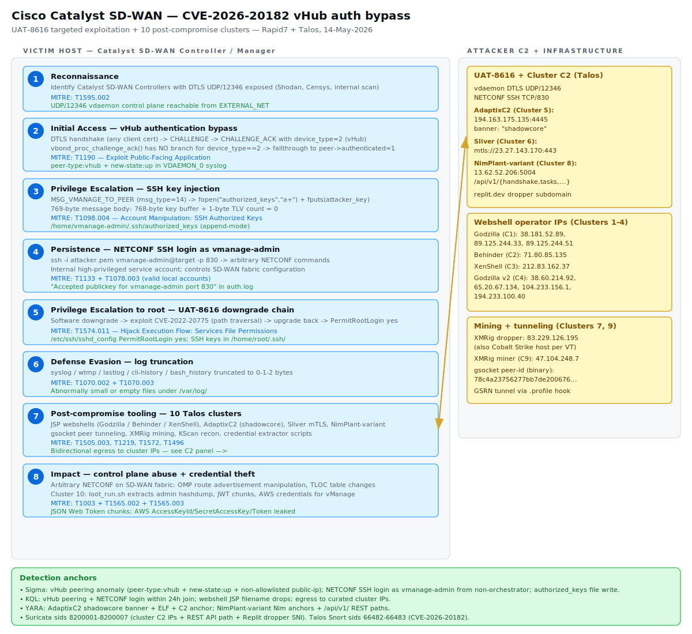

# Cisco Catalyst SD-WAN vHub authentication bypass — CVE-2026-20182, UAT-8616 targeted exploitation, and ten post-compromise activity clusters

## TL;DR

On 14-May-2026, Rapid7 Labs (Stephen Fewer and Jonah Burgess) disclosed CVE-2026-20182, a critical (CVSS 10.0) authentication bypass in the `vdaemon` service of Cisco Catalyst SD-WAN Controller (formerly vSmart) and Manager (formerly vManage) over DTLS on UDP/12346. The function `vbond_proc_challenge_ack()` has no verification branch for `device_type == 2` (vHub) and falls through to `peer->authenticated = 1` without any certificate or serial check. Cisco PSIRT confirmed limited in-the-wild exploitation by UAT-8616, the same highly sophisticated cluster that exploited the earlier CVE-2026-20127 since 2023 and whose infrastructure overlaps with Operational Relay Box (ORB) networks Talos monitors closely. In parallel, Talos documented ten distinct activity clusters (March-May 2026) opportunistically exploiting the unpatched February-2026 chain (CVE-2026-20133, CVE-2026-20128, CVE-2026-20122) using ZeroZenX Labs' public proof-of-concept and the "XenShell" JSP web shell, with follow-on payloads including AdaptixC2, Sliver, a NimPlant variant, gsocket, XMRig and credential extractors. This is the sixth SD-WAN zero-day exploited in 2026.

## Attribution and confidence

- **Cluster name (Talos):** UAT-8616 for the targeted CVE-2026-20182 and CVE-2026-20127 exploitation.
- **Aliases:** None publicly mapped; ORB-network overlap suggests China-nexus per Mandiant's framework.
- **Vendor discovery:** Rapid7 Labs (vulnerability research and PoC, 9-March-2026 initial outreach to Cisco). Cisco PSIRT and Talos confirmed in-the-wild exploitation and published a joint disclosure on 14-May-2026.
- **Confidence:** medium-high for UAT-8616 attribution to a state-nexus actor based on tradecraft consistency (downgrade-and-exploit chain with CVE-2022-20775 for root, log truncation, three-year operational continuity since 2023) and ORB-network infrastructure overlap. Country-of-origin attribution is not made by Talos.
- **Overlap:** UAT-8616 has been observed exploiting both CVE-2026-20127 and CVE-2026-20182, with identical post-compromise actions (SSH key injection, NETCONF configuration modification, escalation to root via downgrade chain).
- **Genealogy:** continues the Cisco edge-device targeting line documented in this repo at `days/2026-04-30_FIRESTARTER-LINE-VIPER-UAT4356/`. UAT-4356 targeted ASA/FTD data plane; UAT-8616 targets Catalyst SD-WAN control plane. Different products, related tradecraft.
- **Post-compromise clusters 1-10:** e-crime / opportunistic. No country attribution. ZeroZenX Labs' PoC is the unifying tooling lineage; the operators are otherwise unrelated to one another.

## Kill chain — summary table

| Stage | MITRE | Detail |
|---|---|---|
| Reconnaissance | T1595.002 | Identify Catalyst SD-WAN Controllers with DTLS UDP/12346 exposed (Shodan, Censys, internal scan). |
| Initial Access | T1190 | DTLS handshake (any client cert) → CHALLENGE_ACK with `device_type=2` (vHub) → fallthrough in `vbond_proc_challenge_ack()` → `peer->authenticated = 1`. |
| Privilege Escalation | T1098.004 | `MSG_VMANAGE_TO_PEER` (msg_type=14) → `fopen("/home/vmanage-admin/.ssh/authorized_keys","a+")` + `fputs(attacker_key)`. |
| Persistence | T1133 + T1078.003 | SSH login over NETCONF (TCP/830) as `vmanage-admin` with the injected key; arbitrary NETCONF commands. |
| Privilege Escalation (root) | T1574.011 | UAT-8616 downgrade chain: downgrade software → exploit CVE-2022-20775 path traversal → upgrade back → `PermitRootLogin yes`. |
| Defense Evasion | T1070.002 + T1070.003 | Log truncation: `syslog`, `wtmp`, `lastlog`, `cli-history`, `bash_history` to size 0/1/2 bytes. |
| Execution (clusters) | T1505.003 + T1059.004 | JSP web shells (Godzilla, Behinder, XenShell) → bash command execution via shell upload primitive. |
| C2 (clusters) | T1219 + T1090.002 + T1572 | AdaptixC2 (banner "shadowcore"), Sliver mTLS, NimPlant-variant REST, gsocket GSRN tunneling. |
| Impact | T1003 + T1565.002 + T1565.003 + T1496 | vManage credential extractor (admin hashdump, JWT chunks, AWS keys); OMP route advertisement and TLOC manipulation; XMRig cryptomining. |



The victim lane on the left walks from reconnaissance and DTLS exposure on UDP/12346 through the vHub fallthrough exploit, the SSH key injection primitive, the NETCONF login and the root-escalation downgrade chain, then the log truncation and the bidirectional post-compromise tooling. The attacker C2 lane on the right groups the AdaptixC2, Sliver and NimPlant-variant primary C2 endpoints, the webshell operator IPs for clusters 1-4, and the mining and tunneling infrastructure for clusters 7 and 9. The detection-anchors footer maps each Sigma, KQL, YARA and Suricata deliverable to the stage it covers.

## Stage-by-stage detail

### Stage 1 — Reconnaissance (T1595.002)

The Catalyst SD-WAN Controller has a narrow attack surface: TCP/22 (SSH), TCP/830 (NETCONF over SSH), UDP/12346 (vdaemon DTLS control plane). Internet exposure of UDP/12346 is not strictly required for the vulnerability to be reachable (lateral attackers on the underlay can hit it), but Shodan and Censys both index DTLS responders on 12346 and provide a low-cost target list.

### Stage 2 — Initial Access via vHub fallthrough (T1190)

After a DTLS handshake that accepts any client certificate (the cert verify result is logged as an error but the function still returns OK), the server sends a CHALLENGE message containing 256 random bytes and a TLV set with CA RSA public-key components. The client responds with a CHALLENGE_ACK whose 12-byte header includes a `device_info` byte: the high nibble is the device type. The vulnerable function `vbond_proc_challenge_ack()` implements four conditional verification branches for vSmart (3), vManage (5), vEdge (1) and the vSmart/vManage-to-vBond pair, then falls through to:

```cpp
// vdaemon!vbond_proc_challenge_ack() — simplified
if (peer_type == 3 || peer_type == 5) { /* cert chain + serial dup check */ }
if ((peer_type == 3 || 5) && local_type in {3,4,5}) { /* full cert verify */ }
if (peer_type == 1 && local_type in {3,4,5}) { /* HW cert + board ID + OTP */ }
// *** NO BRANCH FOR peer_type == 2 (vHub) — the bug ***
*(_BYTE *)(peer + 70) = 1;   // peer->authenticated = true
return 0;
```

The pre-dispatch authentication gate in `vbond_proc_msg()` allows CHALLENGE_ACK (msg_type=9) through unauthenticated by design, so the bug is reachable from the very first packet after the DTLS handshake.

### Stage 3 — Privilege escalation via SSH key injection (T1098.004)

Once authenticated, the attacker sends `MSG_VMANAGE_TO_PEER` (msg_type=14). The handler `vbond_proc_vmanage_to_peer()` opens `/home/vmanage-admin/.ssh/authorized_keys` in append mode (`a+`) and writes the attacker-controlled key buffer via `fputs()` with no sanitization. The buffer is fixed at 768 bytes: leading `\n` + ssh_pubkey + trailing `\n` + `\0` + zero-padding. Append mode is the operationally important detail — legitimate keys remain in place, the drift is purely additive and the file mtime is the primary forensic anchor.

### Stage 4 — Persistence via NETCONF SSH login (T1133, T1078.003)

The attacker logs in to NETCONF on TCP/830 as `vmanage-admin` using the corresponding private key. `vmanage-admin` is an internal high-privileged service account: it is not `root`, but it controls the NETCONF interface and can issue arbitrary `get-config`, `edit-config` and `commit` operations against the running SD-WAN fabric configuration.

### Stage 5 — Privilege escalation to root via downgrade chain (T1574.011)

Per the ACSC-led Cisco SD-WAN hunt guide and Talos's UAT-8616 disclosure, the actor downgrades the controller software to a version vulnerable to CVE-2022-20775 (a path traversal in the SD-WAN UI), exploits it to gain root, then upgrades back to the original version. Post-escalation indicators include `/etc/ssh/sshd_config` set to `PermitRootLogin yes` and SSH key material under `/home/root/.ssh/authorized_keys` and `/home/root/.ssh/known_hosts`.

### Stage 6 — Defense evasion via log truncation (T1070.002, T1070.003)

UAT-8616 truncates `syslog`, `wtmp`, `lastlog`, `cli-history` and `bash_history` to size 0/1/2 bytes. Talos's investigative guidance explicitly calls out "abnormally small or absent logs" as a high-fidelity indicator.

### Stage 7 — Post-compromise tooling (T1505.003, T1219, T1572, T1496)

Talos documented ten distinct activity clusters opportunistically exploiting the unpatched February-2026 chain (CVE-2026-20133, CVE-2026-20128, CVE-2026-20122) since March 2026, using ZeroZenX Labs' public PoC and the "XenShell" JSP shell:

| Cluster | Active since | Tooling |
|---|---|---|
| 1 | 2026-03-06 | Tas9er ByPassGodzilla webshell `20251117022131.jsp` |
| 2 | 2026-03-10 | Behinder webshell (Base64-only variant) `conf.jsp` |
| 3 | 2026-03-04 | XenShell `sysv.jsp` + Behinder `sysinit.jsp` |
| 4 | 2026-03-03 | Godzilla variant `vmurnp_ikp.jsp` |
| 5 | 2026-03-13 | AdaptixC2 implant `systemd-resolved`, banner `shadowcore`, C2 194.163.175.135:4445 |
| 6 | 2026-03-05 | Sliver mTLS implant `CWan`, C2 mtls://23.27.143.170:443 |
| 7 | 2026-03-25 | XMRig download + Cobalt Strike co-hosted on 83.229.126.195 |
| 8 | 2026-03-10 | KScan/QScan + NimPlant-variant `agent1` C2 13.62.52.206:5004; dropper hosted on replit.dev |
| 9 | 2026-03-17 | gsocket peer-based tunneling + XMRig miner; `.profile` activation |
| 10 | 2026-03-13 | vManage credential extractor (`loot_run.sh`), root-escalation checks |

### Stage 8 — Impact (T1003, T1565.002, T1565.003, T1496)

Cluster 10's `loot_run.sh` extracts admin hashdumps, JSON Web Token chunks used for REST API authentication, and AWS credentials (`AccesKeyId`, `SecretAccessKey`, `Token`) for vManage. Beyond credential theft, the targeted UAT-8616 actor with NETCONF access can manipulate the entire SD-WAN overlay routing fabric: OMP route advertisements, Transport Locations (TLOC) tables, and peer state — the entirety of the network's control plane.

## RE notes

| Component | SHA256 | Lang | Packer | Notes |
|---|---|---|---|---|
| AdaptixC2 implant `systemd-resolved` (C5) | `f6f8e0d790645395188fc521039385b7c4f42fa8b426fd035f489f6cda9b5da1` | Go | none | Default banner "AdapticC2 server" replaced with "shadowcore" to evade signature-based detection |
| Sliver mTLS implant `CWan` (C6) | `02654acfb21f83485393ba8b14bd8862b919b9ec966fc6768f6aac1338a45ee8` | Go | none | mTLS C2 on TCP/443, server certificate fingerprint via VirusTotal |
| NimPlant-variant `agent1` (C8) | `0c87871642f84e09e8d3fb23ec36bf55601323e31151a7017a85dbec929cf15d` | Nim | none | Custom REST API `/api/v1/{handshake,results,payloads,exfiltrate,tasks,init}`; AI-modified clone of public NimPlant per Talos |
| KScan/QScan (C8) | `18d77c9c5bbb5b9d5bdfd366fdfcf26bad9e64c63ca865fad711bcce8e3d5a80` | Go | none | Asset mapping tool renamed from `KScan` to `QScan` in source |
| gsocket binary (C9) | `d94f75a70b5cabaf786ac57177ed841732e62bdcc9a29e06e5b41d9be567bcfa` | C | none | GSRN tunneling; peer ID Base58-encoded in `defunct.dat` |
| vManage credential extractor `loot_run.sh` (C10) | `b0f51b098842cd630097b462aab0ec357e2c7824af37cca6d08165265da2c2d3` | Bash | none | Targets admin hashdump, JWT chunks, AWS keys |

The pseudo-code anchor for the primary vulnerability lives in `vdaemon!vbond_proc_challenge_ack()`:

```cpp
if (peer_type == 3 || peer_type == 5) {
    v24 = is_serial_duplicate(peer_serial, peer_type, ...);
    if (v24 && vbond_peer_dup_check(local, peer_ctx, v24, ...)) {
        v19 = 36;       // ERR: duplicate serial
        goto LABEL_179; // REJECT
    }
}
if ((peer_type == 3 || peer_type == 5) && local_type in {3,4,5}) {
    v19 = vdaemon_dtls_verify_peer_cert(peer_ctx);
    if (v19) v18 = 0;
    vdaemon_send_challenge_ack_ack(local, peer_serial, peer_ctx, v18);
    if (v18 != 1) goto LABEL_179;
    vbond_send_ssh_keys_to_vmanage_peer(local, peer_ctx);
}
if (peer_type == 1 && local_type in {3,4,5}) {
    if (vdaemon_verify_peer_bidcert(peer_ctx, ...)) goto LABEL_179;
}
// *** NO BRANCH FOR peer_type == 2 (vHub) ***
*(_BYTE *)(peer_ctx + 70) = 1;   // peer->authenticated = true
return 0LL;                       // Success
```

The companion `MSG_VMANAGE_TO_PEER` handler is equally short and instructive:

```cpp
// vdaemon!vbond_proc_vmanage_to_peer()
stream = fopen("/home/vmanage-admin/.ssh/authorized_keys", "a+");
if (stream) {
    if (!read_key_data((const char *)(body + 32), stream) && body[32]) {
        fputs((const char *)(body + 32), stream);  // attacker key
    }
    fclose(stream);
}
```

## Detection strategy

### Telemetry that matters

- **Syslog from the SD-WAN appliance itself**: `/var/log/messages` and the VDAEMON_0 facility contain `control-connection-state-change` events including peer-type, peer-system-ip, public-ip and public-port. These are the highest-signal telemetry for both stages 2 and 4.
- **Auth log (`/var/log/auth.log` or equivalent)**: `Accepted publickey for vmanage-admin ... port 830` is the smoking gun for stage 4.
- **File integrity on `/home/vmanage-admin/.ssh/authorized_keys`**: append-mode writes outside maintenance windows.
- **Network telemetry (Defender XDR `DeviceNetworkEvents`, firewall logs)**: egress from the controller to any of the curated cluster IPs.
- **Process telemetry on the appliance (if osquery / MDE for Linux is deployed)**: execution of binaries from `/tmp/`, `/var/tmp/`, `/dev/shm/`, `~vmanage-admin/`.

### Detection coverage

| Engine | File | Logic |
|---|---|---|
| Sigma | [`sigma/sdwan_vdaemon_vhub_peering_anomalous.yml`](./sigma/sdwan_vdaemon_vhub_peering_anomalous.yml) | Detects VDAEMON `peer-type:vhub` + `new-state:up` events from non-allowlisted public-ip. |
| Sigma | [`sigma/sdwan_netconf_vmanage_admin_ssh_login.yml`](./sigma/sdwan_netconf_vmanage_admin_ssh_login.yml) | Detects NETCONF (TCP/830) public-key login as `vmanage-admin` from non-orchestrator IPs. |
| Sigma | [`sigma/sdwan_authorized_keys_modification_vmanage_admin.yml`](./sigma/sdwan_authorized_keys_modification_vmanage_admin.yml) | Detects file_event writes to `/home/vmanage-admin/.ssh/authorized_keys`. |
| KQL | [`kql/sdwan_vhub_peering_then_netconf_login.kql`](./kql/sdwan_vhub_peering_then_netconf_login.kql) | Joins vHub peering and NETCONF login within a 24-hour window per appliance. |
| KQL | [`kql/sdwan_post_compromise_webshell_jsp_drop.kql`](./kql/sdwan_post_compromise_webshell_jsp_drop.kql) | DeviceFileEvents detection of the six known cluster webshell filenames. |
| KQL | [`kql/sdwan_post_compromise_c2_egress_known_clusters.kql`](./kql/sdwan_post_compromise_c2_egress_known_clusters.kql) | DeviceNetworkEvents egress to the curated cluster IP set (1-10). |
| YARA | [`yara/SDWAN_PostCompromise_Implants_2026.yar`](./yara/SDWAN_PostCompromise_Implants_2026.yar) | Two rules: AdaptixC2 shadowcore (ELF + banner + C2 anchor), NimPlant-variant (ELF + Nim anchors + `/api/v1/` REST paths). |
| Suricata | [`suricata/sdwan_uat8616_clusters_egress.rules`](./suricata/sdwan_uat8616_clusters_egress.rules) | Seven rules (sids 8200001-8200007) covering AdaptixC2, Sliver, XMRig, NimPlant-variant, webshell operator IPs, REST API path, and the Replit dropper SNI. |

### Threat hunting hypotheses

- **H1** — Anomalous vHub peering on Catalyst SD-WAN Controllers. See [`hunts/peak_h1_vhub_peering_anomaly.md`](./hunts/peak_h1_vhub_peering_anomaly.md).
- **H2** — Authorized-keys drift on `vmanage-admin` across the SD-WAN fleet. See [`hunts/peak_h2_authorized_keys_drift.md`](./hunts/peak_h2_authorized_keys_drift.md).
- **H3** — JSP webshell drop plus egress to Talos-curated post-compromise C2. See [`hunts/peak_h3_post_compromise_jsp_and_c2.md`](./hunts/peak_h3_post_compromise_jsp_and_c2.md).

## Incident response playbook

### First 60 minutes (triage)

1. **Do not reboot the controller.** Capture a memory snapshot first (`/proc/kcore` via LiME if a kernel module is loadable, or live `dd` of the disk).
2. Capture `/var/log/`, `cli-history`, `bash_history`, `wtmp`, `lastlog`, `/etc/ssh/sshd_config`, `/home/vmanage-admin/.ssh/`, `/home/root/.ssh/`.
3. Capture a `tcpdump` of UDP/12346 and TCP/830 for the next 30 minutes (`tcpdump -i any -w sdwan_capture_$(date +%Y%m%d_%H%M).pcap port 12346 or port 830`).
4. Pull a fleet-wide query for `peer-type:vhub` events across all controllers.
5. Identify NETCONF auth-log entries with `Accepted publickey for vmanage-admin`.
6. Inspect `authorized_keys` on every controller for unexpected keys.
7. If confirmed, network-isolate the controller from the underlay (drop UDP/12346 ingress at the WAN edge) and prepare to fail over.

### Artifacts to collect

| Artifact | Path | Tool | Why it matters |
|---|---|---|---|
| VDAEMON control-connection-state-change logs | `/var/log/messages` and `/var/log/vmanage-syslog.log` | `grep`, `journalctl` | Direct evidence of the vHub exploit attempt at stage 2. |
| SSH auth log | `/var/log/auth.log` or equivalent | `grep`, `journalctl _COMM=sshd` | NETCONF login success as `vmanage-admin` at stage 4. |
| Authorized keys file for `vmanage-admin` | `/home/vmanage-admin/.ssh/authorized_keys` | `sudo cat`, `sha256sum`, `stat` | Append-mode persistence anchor. mtime + ctime are the forensic timeline. |
| Authorized keys file for `root` | `/home/root/.ssh/authorized_keys` | `sudo cat`, `stat` | Indicates UAT-8616 downgrade-chain escalation succeeded. |
| sshd_config | `/etc/ssh/sshd_config` | `cat`, `diff` against known-clean baseline | `PermitRootLogin yes` is post-escalation indicator. |
| Cli history | `/home/admin/.cli-history`, `~/.cli-history` | `cat`, `stat -c '%s'` | Truncated to 0-2 bytes is a defense-evasion indicator. |
| pcap of UDP/12346 traffic | live capture | `tcpdump` | DTLS CHALLENGE / CHALLENGE_ACK structure with `device_type=2`. |
| pcap of TCP/830 traffic | live capture | `tcpdump` | NETCONF session content and SSH client fingerprint. |

### IR queries and commands

```powershell
# Fleet-wide retrospective hunt in Sentinel for vHub peering — last 30 days
# (run from Azure Cloud Shell with sentinel access)
$query = @"
Syslog
| where TimeGenerated > ago(30d)
| where SyslogMessage has_all ('VDAEMON','peer-type:vhub','new-state:up')
| project TimeGenerated, Computer, SyslogMessage
"@
$query | Out-File -FilePath ./sentinel_vhub_hunt.kql
```

```bash
# On each controller — verify file integrity of authorized_keys and sshd_config
sudo find /home -name authorized_keys -exec sha256sum {} \; \
   -exec stat -c '%n mtime=%y ctime=%z size=%s' {} \;
sudo sha256sum /etc/ssh/sshd_config
sudo grep -E "PermitRootLogin|AuthorizedKeysFile" /etc/ssh/sshd_config

# Identify webshell drops anywhere on the appliance
sudo find / -type f -name "*.jsp" 2>/dev/null \
   | xargs -I{} sha256sum {} 2>/dev/null
```

```kql
// Defender XDR — controller egress to curated cluster IPs (15-min decay)
DeviceNetworkEvents
| where Timestamp > ago(1h)
| where RemoteIP in (
    "194.163.175.135","23.27.143.170","83.229.126.195","13.62.52.206",
    "79.135.105.208","176.65.139.31","47.104.248.7",
    "38.181.52.89","89.125.244.33","89.125.244.51","71.80.85.135",
    "212.83.162.37","38.60.214.92","65.20.67.134","104.233.156.1","194.233.100.40")
| project Timestamp, DeviceName, InitiatingProcessFileName, RemoteIP, RemotePort, RemoteUrl
```

### Containment, eradication, recovery

- **What NOT to do:** do not simply rotate the `vmanage-admin` SSH key without first dumping and auditing the full `authorized_keys` file; do not reboot before capturing volatile state; do not assume root has not been reached just because `/etc/ssh/sshd_config` looks unmodified — UAT-8616 has been observed reverting `sshd_config` after using it.
- Upgrade to a Cisco-published fixed release per the advisory (20.9.9.1, 20.12.7.1, 20.15.5.2, 20.18.2.2, 26.1.1.1 depending on the major version).
- Rotate `vmanage-admin` keys on every controller fleet-wide, even if only one host is confirmed compromised — the actor may have lateral access.
- Re-baseline `authorized_keys` SHA256 and `/etc/ssh/sshd_config` after rotation; store in CMDB or inventory.
- Restrict NETCONF TCP/830 ingress to the orchestrator subnet only.
- Restrict vdaemon UDP/12346 ingress to the SD-WAN underlay only — never expose to the Internet.

### Recovery validation

- All controllers run a fixed release per the Cisco advisory.
- No `peer-type:vhub` events from non-allowlisted IPs in the last 30 days of Sentinel data.
- No JSP webshell filenames present on any controller filesystem.
- No outbound egress to curated cluster IPs in the last 30 days.
- `authorized_keys` SHA256 matches the post-rotation baseline on every appliance.
- `sshd_config` does not contain `PermitRootLogin yes`.

## IOCs

| Type | Value | Context | Confidence | Source |
|---|---|---|---|---|
| cve | CVE-2026-20182 | Catalyst SD-WAN vHub authentication bypass (CVSS 10.0) | high | Cisco PSIRT |
| cve | CVE-2026-20127 | Earlier vdaemon auth bypass (Feb 2026); same actor | high | Cisco PSIRT |
| cve | CVE-2026-20133, CVE-2026-20128, CVE-2026-20122 | vManage chain mass-exploited from March 2026 | high | Cisco PSIRT |
| path | /home/vmanage-admin/.ssh/authorized_keys | SSH key injection sink (append mode) | high | Rapid7 |
| string | peer-type:vhub | VDAEMON syslog signature of exploit | high | Talos |
| ipv4 | 194.163.175.135 | AdaptixC2 shadowcore C2 (Cluster 5, Contabo) | high | Talos |
| ipv4 | 23.27.143.170 | Sliver mTLS C2 (Cluster 6) | high | Talos |
| ipv4 | 13.62.52.206 | NimPlant-variant agent1 C2 (Cluster 8) | high | Talos |
| ipv4 | 83.229.126.195 | XMRig + Cobalt Strike host (Cluster 7) | high | Talos |
| domain | replit.dev | Cluster 8 dropper subdomain host | medium | Talos |
| sha256 | f6f8e0d790645395188fc521039385b7c4f42fa8b426fd035f489f6cda9b5da1 | AdaptixC2 shadowcore implant | high | Talos |
| sha256 | 02654acfb21f83485393ba8b14bd8862b919b9ec966fc6768f6aac1338a45ee8 | Sliver CWan implant | high | Talos |
| sha256 | 0c87871642f84e09e8d3fb23ec36bf55601323e31151a7017a85dbec929cf15d | NimPlant-variant agent1 | high | Talos |
| string | shadowcore | Custom TCP banner replacing AdaptixC2 default | high | Talos |
| string | 20251117022131.jsp, conf.jsp, sysv.jsp, sysinit.jsp, vmurnp_ikp.jsp | Cluster 1-4 webshell filenames | high | Talos |

Full list (47 entries) in [`iocs.csv`](./iocs.csv).

## Secondary findings

- **SonicWall SSLVPN — Akira ransomware MFA bypass evolution via OTP seed compromise** (Arctic Wolf, 12-May-2026). The Akira campaign tracked since July 2025 against SonicOS 6-8 (NSA and TZ series) now successfully authenticates against MFA-enabled accounts. The mechanism appears to be OTP seed harvesting from earlier CVE-2024-40766 exploitation, allowing the actor to derive valid TOTP codes in parallel with the legitimate user. Password rotation alone does not mitigate; full OTP seed regeneration plus re-enrollment is required. This is an evolution of the case covered in `days/2026-05-05_Akira-SonicWall-CVE-2024-40766/`.
- **Microsoft Exchange CVE-2026-42897 — spoofing + XSS in Subscription Edition / 2016 / 2019, exploited in attacks** (Microsoft, 14-May-2026). No patch at disclosure; Microsoft published mitigation guidance. High priority for any tenant still running on-prem Exchange exposed to the Internet.
- **Cisco SD-WAN Cluster 8 backdoor likely AI-generated**: Talos notes that the "agent1" Nim implant exposes a fully-wired but custom REST API (`/api/v1/handshake`, `/results`, `/payloads`, `/exfiltrate`, `/tasks`, `/init`) that closely mirrors NimPlant's structure with additional capabilities and small inconsistencies, consistent with an AI-modified clone. Same stylistic anchors as the TukTuk framework documented in `days/2026-05-15_EtherRAT-TukTuk-Gentlemen/`: AI-generated malware is becoming a recurring tradecraft signal in 2026.

## Pedagogical anchors

- **A missing `else` default is an authentication primitive.** Every device-type-specific verification branch in `vbond_proc_challenge_ack()` is sound; the bug is the absence of a default reject path. Defensive coding for auth machinery must always end in `goto LABEL_REJECT` unless every branch has explicitly returned success.
- **Append-mode file writes are stealth persistence.** `fopen("authorized_keys","a+")` is operationally devastating because legitimate keys remain and detection has to be drift-based, not content-based. File baselining on `authorized_keys` across the fleet is the durable countermeasure.
- **Two exploitation populations on one product.** UAT-8616 is targeted, sophisticated, three-year operational continuity. Clusters 1-10 are opportunistic e-crime running someone else's PoC. The same control-plane appliance carries both — IR triage must distinguish between them because the IR posture differs (re-image vs. fleet-wide credential rotation).
- **ORB-network infrastructure overlap is high-signal CTI.** Mandiant's framework treats ORB-network use as a near-signature of China-nexus state operators. Talos's note that UAT-8616 infrastructure overlaps with ORB networks is the most concrete attribution anchor in the disclosure.
- **Edge-device control planes are 2026's preferred persistent foothold.** Day 3 (UAT-4356 on ASA/FTD), Day 20 (UAT-8616 on Catalyst SD-WAN) — both are state-nexus actors choosing network appliances over endpoint hosts. The defender's lesson: edge devices need EDR-class telemetry and IR posture, not just patching cadence.

## What's in this folder

| File | Purpose |
|---|---|
| [`README.md`](./README.md) | This write-up. |
| [`kill_chain.svg`](./kill_chain.svg) | Adaptive light/dark kill-chain diagram with eight stages, C2 cluster panels, and detection-anchors footer. |
| [`sigma/sdwan_vdaemon_vhub_peering_anomalous.yml`](./sigma/sdwan_vdaemon_vhub_peering_anomalous.yml) | Sigma rule for the vHub peering exploit signature in VDAEMON syslog. |
| [`sigma/sdwan_netconf_vmanage_admin_ssh_login.yml`](./sigma/sdwan_netconf_vmanage_admin_ssh_login.yml) | Sigma rule for NETCONF SSH login as `vmanage-admin`. |
| [`sigma/sdwan_authorized_keys_modification_vmanage_admin.yml`](./sigma/sdwan_authorized_keys_modification_vmanage_admin.yml) | Sigma rule for file_event writes to the `vmanage-admin` authorized_keys file. |
| [`kql/sdwan_vhub_peering_then_netconf_login.kql`](./kql/sdwan_vhub_peering_then_netconf_login.kql) | KQL join of vHub peering and NETCONF login per appliance, 24-hour window. |
| [`kql/sdwan_post_compromise_webshell_jsp_drop.kql`](./kql/sdwan_post_compromise_webshell_jsp_drop.kql) | KQL DeviceFileEvents detection of cluster webshell filenames. |
| [`kql/sdwan_post_compromise_c2_egress_known_clusters.kql`](./kql/sdwan_post_compromise_c2_egress_known_clusters.kql) | KQL DeviceNetworkEvents egress to curated cluster IPs. |
| [`yara/SDWAN_PostCompromise_Implants_2026.yar`](./yara/SDWAN_PostCompromise_Implants_2026.yar) | YARA rules for AdaptixC2 shadowcore and NimPlant-variant agent1. |
| [`suricata/sdwan_uat8616_clusters_egress.rules`](./suricata/sdwan_uat8616_clusters_egress.rules) | Suricata sids 8200001-8200007 covering cluster C2 IPs, REST paths, and Replit SNI. |
| [`hunts/peak_h1_vhub_peering_anomaly.md`](./hunts/peak_h1_vhub_peering_anomaly.md) | PEAK hunt for anomalous vHub peering. |
| [`hunts/peak_h2_authorized_keys_drift.md`](./hunts/peak_h2_authorized_keys_drift.md) | PEAK hunt for authorized_keys drift on `vmanage-admin`. |
| [`hunts/peak_h3_post_compromise_jsp_and_c2.md`](./hunts/peak_h3_post_compromise_jsp_and_c2.md) | PEAK hunt for JSP webshell drops and curated C2 egress. |
| [`iocs.csv`](./iocs.csv) | Full IOC table (47 entries). |

## Sources

- [Talos — Ongoing exploitation of Cisco Catalyst SD-WAN vulnerabilities (14-May-2026)](https://blog.talosintelligence.com/sd-wan-ongoing-exploitation/)
- [Rapid7 Labs — CVE-2026-20182 technical analysis (14-May-2026)](https://www.rapid7.com/blog/post/ve-cve-2026-20182-critical-authentication-bypass-cisco-catalyst-sd-wan-controller-fixed/)
- [Talos — UAT-8616 active exploitation of CVE-2026-20127 (25-Feb-2026)](https://blog.talosintelligence.com/uat-8616-sd-wan/)
- [Cisco Security Advisory cisco-sa-sdwan-rpa2-v69WY2SW (CVE-2026-20182)](https://sec.cloudapps.cisco.com/security/center/content/CiscoSecurityAdvisory/cisco-sa-sdwan-rpa2-v69WY2SW)
- [Cisco Security Advisory cisco-sa-sdwan-authbp-qwCX8D4v (CVE-2026-20133, -20128, -20122)](https://sec.cloudapps.cisco.com/security/center/content/CiscoSecurityAdvisory/cisco-sa-sdwan-authbp-qwCX8D4v)
- [ACSC-led Cisco SD-WAN hunt guide](https://www.cyber.gov.au/sites/default/files/2026-02/ACSC-led%20Cisco%20SD-WAN%20Hunt%20Guide.pdf)
- [Cisco-Talos IOCs GitHub — 2026/05](https://github.com/Cisco-Talos/IOCs/tree/main/2026/05)
- [Help Net Security — Cisco patches another actively exploited SD-WAN zero-day](https://www.helpnetsecurity.com/2026/05/15/cisco-sd-wan-zero-day-cve-2026-20182/)
- [Arctic Wolf — Akira SonicWall MFA bypass evolution](https://arcticwolf.com/resources/blog/arctic-wolf-observes-akira-ransomware-campaign-targeting-sonicwall-sslvpn-accounts/)
