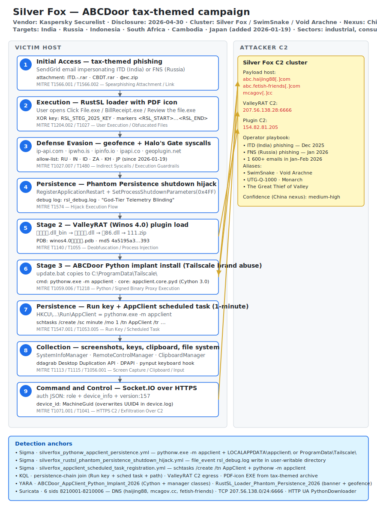

# Silver Fox ABCDoor Tax-Themed Phishing in India and Russia (Kaspersky Securelist)

## TL;DR

On 30 April 2026 Kaspersky's Securelist team disclosed an actively running
Silver Fox campaign delivering a brand-new Python implant named **ABCDoor**
through tax-themed phishing emails impersonating the Indian Income Tax
Department and the Russian Federal Tax Service. The infection chain layers a
modified Rust loader (RustSL) with a novel **Phantom Persistence** shutdown-
signal hijack on top of the actor's signature ValleyRAT (Winos 4.0) plugin
chain, and finishes with a Cython-compiled `appclient.core` Python backdoor
that abuses the legitimate Tailscale brand for its install directory. Kaspersky
recorded **more than 1 600 malicious emails between early January and early
February 2026** primarily hitting industrial, consulting, retail and
transportation organisations across India, Russia, Indonesia, South Africa,
Cambodia and Japan (the last added to the geofence allow-list on
2026-01-19). Dwell time inside Kaspersky's email-detection corpus is short, but
the implant's persistence model survives reboots, and the campaign is
ongoing — this is today's most concrete China-nexus operation with public,
high-fidelity IOCs.

## Attribution and confidence

- **Cluster name:** Silver Fox (Kaspersky, Trend Micro, Sekoia).
- **Aliases:** SwimSnake, Void Arachne, UTG-Q-1000, Monarch, The Great Thief
  of Valley (cross-referenced by The Hacker News, GBHackers, SC Media,
  Dark Reading on 2026-05-04 and 2026-05-06).
- **Discovery vendor:** Kaspersky GReAT and SOC research (Anton Kargin,
  Vladimir Gursky, Victoria Vlasova, Anna Lazaricheva), Securelist blog
  *"Analyzing the Silver Fox tax campaign and the new ABCDoor backdoor"*,
  published **30 April 2026**.
- **Confidence in China nexus:** **medium-high**. Justified by Chinese-language
  artefacts (`winos4.0测试插件.pdb` PDB string, Chinese DLL filenames
  `登录模块.dll_bin` / `上线模块.dll` / `保86.dll`, Chinese path `印度邮箱`,
  Chinese console messages in JavaScript loaders), reuse of ValleyRAT/Winos 4.0
  (a Silver Fox-signature toolkit), and historical overlaps with Void Arachne
  (Trend Micro) and Sekoia's MCA-Ministry installer infection chain.
- **Motivation:** hybrid — historically financially motivated cybercrime but
  evolving since 2024 toward APT-style espionage targeting government,
  healthcare, telecom and now industrial verticals (see Obsidian Security,
  Infosecurity Magazine, Sekoia coverage).

| Alias                          | Reporting vendor              |
|---|---|
| Silver Fox                     | Kaspersky, Trend Micro, Sekoia |
| SwimSnake                      | Trend Micro                    |
| Void Arachne                   | Trend Micro                    |
| UTG-Q-1000                     | QiAnXin                        |
| Monarch                        | Cyfirma                        |
| The Great Thief of Valley      | CloudSEK                       |

No prior entry in this repository covers Silver Fox / ValleyRAT directly,
making this Day 21 the founding day for the `byActor/silver-fox/`,
`byActor/swimsnake/` and `byActor/void-arachne/` clusters.

## Kill chain — summary table

| Stage | MITRE | Detail |
|---|---|---|
| Initial Access | T1566.001 / T1566.002 | SendGrid-sent email impersonating India ITD or Russia FNS with a RAR/ZIP attachment (`CBDT.rar`, `фнс.zip`, `ITD.-.rar`) or link to `abc.haijing88[.]com`. |
| Execution | T1204.002 | User opens a PDF-icon executable inside the archive (`Click File.exe`, `BillReceipt.exe`, `Review the file.exe`). |
| Defense Evasion | T1027 / T1027.007 / T1480 | RustSL XOR-decrypts `<RSL_START>...<RSL_END>` payload with key `RSL_STEG_2025_KEY`; geofences via ip-api.com / ipwho.is / ipinfo.io / ipapi.co / geoplugin.net allow-listing RU IN ID ZA KH JP; resolves syscalls via Halo's Gate. |
| Persistence (loader) | T1574 | Phantom Persistence — `RegisterApplicationRestart` + `SetProcessShutdownParameters(0x4FF)` + `EWX_RESTARTAPPS` to survive reboots. Debug log `rsl_debug.log`. |
| Stage 2 | T1140 / T1055 | ValleyRAT (Winos 4.0) plugin chain `登录模块.dll_bin` → `上线模块.dll` → `保86.dll` → `111.zip` containing Python env plus ABCDoor. |
| Stage 3 | T1059.006 / T1218 | `update.bat` copies to `C:\ProgramData\Tailscale\` and launches `pythonw.exe -m appclient`. Core is a Cython-compiled `appclient.core.pyd`. |
| Persistence (implant) | T1547.001 / T1053.005 | `HKCU\Software\Microsoft\Windows\CurrentVersion\Run\AppClient` = `pythonw -m appclient`; one-minute `AppClient` scheduled task. |
| Collection | T1113 / T1115 / T1056.001 | Screen capture via Desktop Duplication API (`ddagrab`), clipboard exfil, keyboard hook via `pynput`. |
| Command and Control | T1071.001 / T1041 | Socket.IO over HTTPS to attacker server (auth JSON with role + device_info + version 157). HTTP plugin pulls from `154.82.81[.]205`. ValleyRAT TCP C2 `207.56.138[.]28:6666`. |



The victim lane on the left walks the workstation through nine stages from the
inbound tax-themed phishing email all the way to a Socket.IO HTTPS beacon. The
attacker lane on the right anchors the C2 cluster — `abc.haijing88[.]com` as
the payload host, `207.56.138[.]28:6666` as the ValleyRAT TCP C2, and
`154.82.81[.]205` as the plugin pull host — together with the operator playbook
that distinguishes the December 2025 India wave from the January 2026 Russia
wave. The bidirectional yellow arrows between Stages 5/6/9 and the C2 cluster
highlight the multi-channel C2 model: ValleyRAT plugins, payload pulls, and the
ABCDoor Socket.IO beacon all hit the same operator infrastructure but via
distinct transports.

## Stage-by-stage detail

### Initial Access — tax-themed phishing (T1566.001 / T1566.002)

The campaign ran in two consecutive waves with a near-identical structure. The
December 2025 wave impersonated the Indian Income Tax Department, the January
2026 wave the Russian Federal Tax Service. Emails were delivered via SendGrid
infrastructure and either carried a RAR/ZIP attachment directly
(`ITD.-.rar`, `CBDT.rar`, `фнс.zip`) or linked to
`hxxps://abc.haijing88[.]com/uploads/印度邮箱/CBDT.rar` and
`hxxps://abc.haijing88[.]com/uploads/фнс/фнс.zip`. The Chinese folder name
`印度邮箱` (literally "India mailbox") inside the URL is one of the operator
fingerprints.

```text
Subject (India):  Income Tax Notice — CBDT Reference 2025/12/0019
Subject (Russia): Уведомление о камеральной налоговой проверке (ФНС)
Attachment:       CBDT.rar  /  фнс.zip
URL fallback:     hxxps://abc.haijing88[.]com/uploads/{印度邮箱|фнс}/...
```

### Execution — RustSL loader with PDF icon (T1204.002)

Inside the archive the victim sees a `.exe` file with a PDF icon. The most
common lure filenames are `Click File.exe`, `BillReceipt.exe`,
`Review the file.exe`, `statement.exe`, `statement verify .exe`,
`Related material.exe`, `GST Suvidha.exe`, `GSTSuvidha.exe`. All of them are a
modified Rust-based loader called **RustSL** whose source is publicly available
on GitHub with a Chinese description. Silver Fox started using a modified
RustSL build in **late December 2025**.

```text
SHA / MD5 examples for RustSL:
  md5  e6362a81991323e198a463a8ce255533  (build 2026-01-19 — Japan added to allow-list)
  md5  2c5a1dd4cb53287fe0ed14e0b7b7b1b7  (build 2026-01-07 — Phantom Persistence)
```

### Defense Evasion — geofence + Halo's Gate indirect syscalls (T1027.007 / T1480)

Before any payload detonates, RustSL queries five geolocation services
(`ip-api.com`, `ipwho.is`, `ipinfo.io`, `ipapi.co`, `geoplugin.net`) and
enforces a country allow-list of `RU`, `IN`, `ID`, `ZA`, `KH` plus `JP` (added
on 2026-01-19). Outside the allow-list the loader silently exits. EDR evasion
is implemented via Halo's Gate-style indirect syscalls — even if `ntdll.dll`
exports are hooked, the loader scans backward and forward for clean
`Nt*` stubs to resolve SSNs dynamically.

### Persistence (loader) — Phantom Persistence shutdown-signal hijack (T1574)

A novel persistence technique first documented in June 2025 and adopted by
Silver Fox in late December 2025. The loader intercepts the system shutdown
signal via:

```text
RegisterApplicationRestart(L"<loader_path>", RESTART_NO_PATCH | RESTART_NO_HANG_CHECK)
SetProcessShutdownParameters(0x4FF, SHUTDOWN_NORETRY)
ExitWindowsEx(EWX_RESTARTAPPS, ...)
```

When the user shuts down or reboots, Windows re-launches the loader as part of
the application-restart manager. The loader writes a debug file named
`rsl_debug.log` with the verbatim banner `God-Tier Telemetry Blinding: Deployed
via HalosGate Indirect Syscalls`.

### Stage 2 — ValleyRAT (Winos 4.0) plugin chain (T1140 / T1055)

RustSL's decrypted shellcode pulls a `登录模块.dll_bin` (Login module). The
Login module loads `上线模块.dll` (Online module), which loads `保86.dll`
(custom Silver Fox plugin variant — md5 `4a5195a38a458cdd2c1b5ab13af3b393`).
The plugin downloads `111.zip` containing a Python environment plus the
ABCDoor payload. The PDB string `winos4.0测试插件.pdb` is the canonical
Winos 4.0 fingerprint.

### Stage 3 — ABCDoor Python implant install (T1059.006 / T1218)

A small `update.bat` copies the Python environment into
`C:\ProgramData\Tailscale\` (the Tailscale brand abuse is deliberate — a
legitimate Tailscale install would be in `Program Files\Tailscale\`) and runs:

```cmd
pythonw.exe -m appclient
```

The implant core is a Cython 3.0-compiled `appclient.core.cp*-win_amd64.pyd`
that exports manager classes (`MainManager`, `AutoStartManager`,
`RemoteControlManager`, `SystemInfoManager`, `ClipboardManager`,
`ScreenRecorder`, `KeyboardManager`, `ProcessManager`, `FileManager`,
`CryptoManager`, `MessageManager`, `ClientManager`).

### Persistence (implant) — Run key + AppClient scheduled task (T1547.001 / T1053.005)

```reg
HKCU\Software\Microsoft\Windows\CurrentVersion\Run
  AppClient = "C:\ProgramData\Tailscale\pythonw.exe" -m appclient

HKCU\Software\CarEmu
  FirstInstallTime = <timestamp>
  InstallChannel   = <channel id>
```

```cmd
schtasks /create /sc minute /mo 1 /tn "AppClient" ^
    /tr "\"C:\ProgramData\Tailscale\pythonw.exe\" -m appclient" /f
```

The 1-minute schedule is unusual on its own and combined with the task name
`AppClient` gives a near-zero-FP signal.

### Collection — screen, clipboard, keyboard, files (T1113 / T1115 / T1056.001)

ABCDoor leverages the Windows Desktop Duplication API via `ddagrab` to capture
up to four monitors. `RemoteControlManager` exposes mouse and keyboard control
through `pynput`; `ClipboardManager` polls and exfiltrates clipboard contents.
`CryptoManager` performs DPAPI decryption (asymmetric primitives are stubs in
the analysed builds).

### Command and Control — Socket.IO over HTTPS (T1071.001 / T1041)

ABCDoor connects to the operator server via Socket.IO over HTTPS using asyncio.
The initial `auth` JSON includes `role`, `device_info` and `version:157`. The
`device_id` is read from `%LOCALAPPDATA%\applogs\device.log` (UUID4) but then
overwritten by `HKLM:\SOFTWARE\Microsoft\Cryptography:MachineGuid` (a bug —
device.log persists the wrong value). The named object
`\Sessions\1\BaseNamedObjects\python(<pid>): AppClientABC` acts as a mutex to
prevent double execution. The HTTP User-Agent for the downloader stage is the
verbatim string `PythonDownloader`.

## RE notes

| Component | SHA256 / MD5 | Lang | Packer | Notes |
|---|---|---|---|---|
| RustSL (Phantom Persistence build, 2026-01-07) | md5 `2c5a1dd4cb53287fe0ed14e0b7b7b1b7` | Rust | XOR + custom stego markers | `<RSL_START>...<RSL_END>` payload markers, key `RSL_STEG_2025_KEY`, banner `God-Tier Telemetry Blinding`. |
| RustSL (Japan-added build, 2026-01-19) | md5 `e6362a81991323e198a463a8ce255533` | Rust | same | Country allow-list extends to JP. |
| ValleyRAT plugin `保86.dll` | md5 `4a5195a38a458cdd2c1b5ab13af3b393` | C++ | none | PDB anchor `winos4.0测试插件.pdb`. |
| ABCDoor `appclient.core.cp*-win_amd64.pyd` (v157, August build) | md5 `fa08b243f12e31940b8b4b82d3498804` | Python via Cython 3.0 | Cython compiled | Exports Manager classes; uses asyncio + Socket.IO; embeds `ddagrab` for screen capture. |
| ABCDoor (v121, earliest known) | md5 `5b998a5bc5ad1c550564294034d4a62c` | Python via Cython 3.0.7 | Cython compiled | Compiled 2024-12-19 18:27:11 — earliest timestamp of the ABCDoor family. |

The Cython compilation flattens the Python source into a native `.pyd` but
preserves the class/method names as strings inside the binary, which makes
YARA-based heuristic detection viable against the manager-class anchors. The
RustSL banner string is unusually verbose and not obfuscated, possibly because
the loader author treats it as advertising rather than tradecraft.

## Detection strategy

### Telemetry that matters

- Sysmon EID 1 (process create) with command-line capture — anchors
  `pythonw.exe -m appclient` and the schtasks registration.
- Sysmon EID 7 (image load) — Chinese-named DLLs (`登录模块`, `上线模块`,
  `保86`) and ValleyRAT components.
- Sysmon EID 11 (file create) — `rsl_debug.log`, `%LOCALAPPDATA%\appclient\`,
  `C:\ProgramData\Tailscale\`, `%TEMP%\appclient_*.zip`.
- Sysmon EID 13 (registry value set) — `HKCU\...\Run\AppClient`,
  `HKCU\Software\CarEmu\*`.
- Sysmon EID 3 (network connect) — TCP `207.56.138.0/24:6666`,
  HTTP/HTTPS to `abc.haijing88[.]com`, `mcagov[.]cc`, `abc.fetish-friends[.]com`.
- Defender XDR tables: `DeviceProcessEvents`, `DeviceFileEvents`,
  `DeviceRegistryEvents`, `DeviceNetworkEvents`, `DeviceImageLoadEvents`,
  `EmailEvents` (for tax-themed phishing landing).
- Email-gateway message-trace (Microsoft Defender for Office 365 or
  Proofpoint) — SendGrid sub-domain plus tax-themed subject.

### Detection coverage

| Engine | File | Logic |
|---|---|---|
| Sigma | [`sigma/silverfox_pythonw_appclient_persistence.yml`](./sigma/silverfox_pythonw_appclient_persistence.yml) | `pythonw.exe -m appclient` with install path under `%LOCALAPPDATA%\appclient\` or `C:\ProgramData\Tailscale\` (excluding the legitimate Tailscale install path). |
| Sigma | [`sigma/silverfox_rustsl_phantom_persistence_shutdown_hijack.yml`](./sigma/silverfox_rustsl_phantom_persistence_shutdown_hijack.yml) | `file_event` writing `rsl_debug.log` into a user-writable directory — the verbatim Phantom Persistence debug-log anchor. |
| Sigma | [`sigma/silverfox_appclient_scheduled_task_registration.yml`](./sigma/silverfox_appclient_scheduled_task_registration.yml) | `schtasks /create /tn AppClient` with action invoking `pythonw -m appclient` — near-zero-FP combination. |
| KQL | [`kql/silverfox_abcdoor_persistence_chain.kql`](./kql/silverfox_abcdoor_persistence_chain.kql) | Joins HKCU Run\AppClient writes with `pythonw -m appclient` executions on the same device within 24 hours; alternative branch joins the scheduled task creation. |
| KQL | [`kql/silverfox_valleyrat_c2_egress.kql`](./kql/silverfox_valleyrat_c2_egress.kql) | Egress to the known Silver Fox C2 IPs and domains by a non-browser process. |
| KQL | [`kql/silverfox_rust_loader_pdf_icon_archive_extraction.kql`](./kql/silverfox_rust_loader_pdf_icon_archive_extraction.kql) | PDF-icon executable extracted from a tax-themed archive in Downloads, Temp, Outlook or Desktop. |
| YARA | [`yara/silverfox_abcdoor_rustsl_2026.yar`](./yara/silverfox_abcdoor_rustsl_2026.yar) | `ABCDoor_AppClient_Python_Implant_2026` (Cython 3.0 + manager classes + appclient anchors + ddagrab) and `RustSL_Loader_Phantom_Persistence_2026` (banner + geofence services + country allow-list). |
| Suricata | [`suricata/silverfox_abcdoor_2026.rules`](./suricata/silverfox_abcdoor_2026.rules) | Six sids 8210001–8210006 — DNS for `abc.haijing88.com`, `mcagov.cc`, `abc.fetish-friends.com`; TCP `207.56.138.0/24:6666`; HTTP plugin pulls from `154.82.81.0/24`; HTTP UA `PythonDownloader`. |

### Threat hunting hypotheses

- H1 — PDF-icon executable extracted from a tax-themed archive, followed by
  `pythonw.exe -m appclient` within thirty minutes
  ([hunts/peak_h1_pdf_icon_exe_from_tax_lure.md](./hunts/peak_h1_pdf_icon_exe_from_tax_lure.md)).
- H2 — `rsl_debug.log` file write paired with a geofence-service DNS or HTTP
  query within five minutes
  ([hunts/peak_h2_rsl_debug_log_and_geofence_callout.md](./hunts/peak_h2_rsl_debug_log_and_geofence_callout.md)).
- H3 — ValleyRAT/Winos 4.0 plugin load or `207.56.138.0/24:6666` egress
  followed by Python implant directory creation within six hours
  ([hunts/peak_h3_valleyrat_winos_plugin_followed_by_python_implant.md](./hunts/peak_h3_valleyrat_winos_plugin_followed_by_python_implant.md)).

## Incident response playbook

### First 60 minutes (triage)

1. Confirm the alert against the Sigma rule that fired — collect the
   `pythonw -m appclient` command line and the executing file path.
2. Pull the `rsl_debug.log` file from the host and YARA-scan the content
   against `RustSL_Loader_Phantom_Persistence_2026`.
3. Capture RAM via `winpmem` to external storage **before** any reboot —
   Phantom Persistence will re-launch the loader on shutdown, but the
   in-memory ValleyRAT plugin chain and ABCDoor manager state live only in RAM.
4. Snapshot HKCU\Run, HKCU\Software\CarEmu, and the AppClient scheduled task
   XML (`%WINDIR%\System32\Tasks\AppClient`).
5. Disconnect the host from the network (Defender LiveResponse
   `isolate-machine` or equivalent EDR action).
6. Pivot in M365 message-trace to identify every recipient of the same
   tax-themed email — RustSL's geofence means only some recipients will
   detonate, but the dropper is everywhere the email went.

### Artifacts to collect

| Artifact | Path | Tool | Why it matters |
|---|---|---|---|
| RAM image | (in-memory) | winpmem / FTK Imager | ValleyRAT plugin chain and ABCDoor state live only in memory. |
| Run key | `HKCU\Software\Microsoft\Windows\CurrentVersion\Run\AppClient` | reg query / RegRipper | Implant persistence anchor. |
| Scheduled task | `%WINDIR%\System32\Tasks\AppClient` | schtasks /query /xml | Implant persistence anchor — 1-minute cadence. |
| Loader debug log | `<varies>\rsl_debug.log` | manual / strings | Verbatim Phantom Persistence banner. |
| Implant install dir | `%LOCALAPPDATA%\appclient\`, `C:\ProgramData\Tailscale\` | xcopy / FastCopy | Cython-compiled `.pyd` and Python env. |
| Self-update artefact | `%TEMP%\appclient_YYYYMMDDHHMMSS.zip` | manual | Update package staged before execution. |
| Channel tracker | `HKCU\Software\CarEmu` | reg query | Records the campaign channel ID. |
| Network proxy logs | (proxy / firewall) | Splunk / ELK / Sentinel | Egress to `207.56.138.28:6666` and HTTPS to Silver Fox domains. |
| Email message | M365 / Exchange | Get-MessageTrace, eDiscovery | Original tax-themed email plus full recipient set. |

### IR queries and commands

```powershell
# Pull the AppClient run-key value
Get-ItemProperty 'HKCU:\Software\Microsoft\Windows\CurrentVersion\Run' -Name 'AppClient' -ErrorAction SilentlyContinue
# Dump the scheduled task XML
schtasks /query /tn 'AppClient' /xml > %TEMP%\AppClient.xml
# Enumerate the implant directories
Get-ChildItem -Recurse 'C:\ProgramData\Tailscale','$env:LOCALAPPDATA\appclient' -ErrorAction SilentlyContinue |
    Select-Object FullName, Length, LastWriteTime
# Capture the Phantom Persistence debug log if present
Get-ChildItem -Recurse -Filter 'rsl_debug.log' -Path 'C:\Users','C:\ProgramData' -ErrorAction SilentlyContinue
```

```bash
# Triage from a SOC LiveResponse Linux box on an exported memory image
strings -el memory.raw | grep -E '(AppClientABC|appclient.core|HalosGate|RSL_STEG_2025_KEY|PythonDownloader)'
```

```kql
// Hunt — pythonw -m appclient on any device in the past 7 days
DeviceProcessEvents
| where Timestamp > ago(7d)
| where FileName in~ ("pythonw.exe","python.exe")
| where ProcessCommandLine has "-m" and ProcessCommandLine has "appclient"
| project Timestamp, DeviceName, ProcessCommandLine, InitiatingProcessFileName, InitiatingProcessAccountName
| order by Timestamp desc
```

### Containment, eradication, recovery

- Remove the HKCU Run\AppClient value, delete the AppClient scheduled task,
  and **also** delete the `RegisterApplicationRestart` registration before any
  shutdown. Otherwise Windows will re-launch the loader on the next reboot.
- Re-image the host. The Cython-compiled `.pyd` is sufficiently
  hard to inspect that you cannot guarantee a clean live-removal.
- **What NOT to do:** do not reboot the host before RAM capture (ValleyRAT
  plugins are in-memory only). Do not delete `rsl_debug.log` before YARA
  scanning — the banner is the most discriminating string anchor in the entire
  campaign. Do not assume a non-geofenced country is safe — Japan was added on
  2026-01-19 and other regions may be added silently in newer builds.
- Rotate the affected user's Microsoft 365, RDP, VPN, browser-saved and any
  cached credentials — ABCDoor includes clipboard, screen and keyboard capture
  and you must assume credential theft.

### Recovery validation

- Confirm `HKCU\...\Run\AppClient` is absent on the rebuilt host.
- Confirm no `AppClient` scheduled task is present.
- Confirm no `C:\ProgramData\Tailscale\pythonw.exe` exists unless a
  legitimate Tailscale install is in `C:\Program Files\Tailscale\`.
- Run YARA across the host with `yara/silverfox_abcdoor_rustsl_2026.yar` —
  zero hits.
- Validate egress over the next 14 days against the Suricata sids in
  `suricata/silverfox_abcdoor_2026.rules` — zero hits.

## IOCs

| Type | Value | Context | Confidence | Source |
|---|---|---|---|---|
| domain | `abc.haijing88[.]com` | Payload host for CBDT.rar, фнс.zip and similar archives | high | Kaspersky Securelist 2026-04-30 |
| domain | `mcagov[.]cc` | India MCA lookalike download selector | high | Kaspersky Securelist 2026-04-30 |
| domain | `abc.fetish-friends[.]com` | Silver Fox staging host for appclient.zip pulls | high | Kaspersky Securelist 2026-04-30 |
| ipv4 | `207.56.138.28` | ValleyRAT Winos 4.0 C2 on TCP 6666 | high | Kaspersky Securelist 2026-04-30 |
| ipv4 | `154.82.81.205` | Plugin C2 host for YD*.zip and YN*.zip bundles | high | Kaspersky Securelist 2026-04-30 |
| md5 | `e6362a81991323e198a463a8ce255533` | RustSL loader (2026-01-19 build with Japan added) | high | Kaspersky Securelist 2026-04-30 |
| md5 | `2c5a1dd4cb53287fe0ed14e0b7b7b1b7` | RustSL loader (2026-01-07 Phantom Persistence build) | high | Kaspersky Securelist 2026-04-30 |
| md5 | `fa08b243f12e31940b8b4b82d3498804` | ABCDoor appclient.core .pyd v157 (August build) | high | Kaspersky Securelist 2026-04-30 |
| md5 | `4a5195a38a458cdd2c1b5ab13af3b393` | ValleyRAT plugin 保86.dll | high | Kaspersky Securelist 2026-04-30 |
| regkey | `HKCU\Software\Microsoft\Windows\CurrentVersion\Run\AppClient` | ABCDoor persistence value | high | Kaspersky Securelist 2026-04-30 |
| regkey | `HKCU\Software\CarEmu\InstallChannel` | Silver Fox channel/campaign tracker | high | Kaspersky Securelist 2026-04-30 |
| path | `C:\ProgramData\Tailscale\` | ABCDoor implant install (Tailscale brand abuse) | high | Kaspersky Securelist 2026-04-30 |
| path | `%LOCALAPPDATA%\appclient\` | ABCDoor Python implant install directory | high | Kaspersky Securelist 2026-04-30 |
| string | `God-Tier Telemetry Blinding: Deployed via HalosGate Indirect Syscalls` | RustSL Phantom Persistence debug-log banner | high | Kaspersky Securelist 2026-04-30 |
| string | `RSL_STEG_2025_KEY` | RustSL XOR key for payload decryption | high | Kaspersky Securelist 2026-04-30 |
| mutex | `\Sessions\1\BaseNamedObjects\python(<pid>): AppClientABC` | ABCDoor mutex preventing double-execution | high | Kaspersky Securelist 2026-04-30 |

Full IOC inventory in [`iocs.csv`](./iocs.csv).

## Secondary findings

- **APT28 (Russia GRU Unit 26165) FrostArmada DNS hijacking campaign** — UK
  NCSC plus Lumen Black Lotus Labs joint disclosure (April 2026) tracking
  exploitation of insecure MikroTik and TP-Link SOHO routers (including
  `CVE-2023-50224` on TP-Link WR841N) to overwrite DHCP/DNS settings and
  redirect victim traffic through attacker-controlled DNS servers for AitM
  credential theft. Peak at 18 000 unique IPs in 120 countries in December
  2025; estimated 200 organisations and 5 000 consumer devices impacted. Same
  Russia-nexus operator family as the Day 4 wiper case but a very different
  tradecraft layer — credential interception at the home-router layer, not OS
  payload delivery. Source: NCSC press release 2026-04-08.
- **MuddyWater Iran false-flag operation using Chaos ransomware as a decoy**
  — Rapid7 disclosure (2026-05-06) of an early-2026 intrusion that masqueraded
  as a Chaos ransomware affiliate. Initial access via Microsoft Teams screen
  sharing social engineering, AnyDesk and DWAgent for persistence, data
  exfiltration without any encryption or ransom note. Chaos artefacts left as
  bait. Attribution anchor: the "Donald Gay" code-signing certificate, a
  known shared resource within MuddyWater's toolkit. Operational lesson: an
  observed ransomware intrusion can be a state-sponsored espionage operation
  in disguise — the absence of encryption plus the presence of credential
  theft is the discriminator.
- **APT24 (China) BADAUDIO three-year supply-chain espionage against Taiwan**
  — Google Threat Intelligence Group disclosure (2025-11) updated through
  2026 tracking APT24's pivot from broad watering-hole compromises to a
  repeated supply-chain compromise of a Taiwanese regional digital marketing
  firm plus spear-phishing, deploying the highly-obfuscated C++ downloader
  BADAUDIO (control-flow flattening, AES-encrypted payload, Cobalt Strike
  follow-on). Now affects 1 000+ domains. Adjacent China-nexus benchmark for
  the Silver Fox case — both deploy custom first-stage downloaders, but BADAUDIO
  prioritises supply chain breadth over Silver Fox's tax-themed focus.

## Pedagogical anchors

- **The "Tailscale brand abuse" path anchor is a near-zero-FP signal.** When
  an enterprise host runs `pythonw.exe -m appclient` from
  `C:\ProgramData\Tailscale\`, the only legitimate corollary is a genuine
  Tailscale install — which lives in `C:\Program Files\Tailscale\` and does
  not need a Python interpreter. Brand abuse paths are the cleanest detection
  primitives for malware authors who want their telemetry to look ordinary.
- **Phantom Persistence is the cleanest example of "Windows API as
  persistence primitive".** No registry write, no scheduled task, no service
  install — just `RegisterApplicationRestart` plus `EWX_RESTARTAPPS`. EDR
  baselines that only watch the classic ASEP locations will miss it. Detection
  has to anchor on the artefact (`rsl_debug.log`), the binary YARA
  fingerprint, or the network behaviour (geofence callouts), not on the
  registry footprint.
- **Halo's Gate indirect syscalls defeat user-mode EDR hooks but ETW-TI plus
  kernel callbacks still see everything.** Treat any host where Sysmon EID 7
  shows clean `ntdll.dll` loads but EDR telemetry is sparse as a candidate
  for retrospective hunting. This is the same pedagogical anchor as the Qilin
  EDR Killer case (Day 16) — different mechanism, same defender response.
- **Tax themes are exquisitely targeted social engineering against finance,
  HR and legal roles.** Roles whose job description includes
  "open tax authority correspondence" are the highest-value targets in
  any organisation. Phishing simulations should specifically test tax-themed
  RAR/ZIP attachments against these roles every quarter.
- **Silver Fox is the canonical 2026 example of "hybrid cybercrime / APT"
  attribution ambiguity.** China-nexus origin, espionage-style TTPs,
  cybercrime-style monetisation paths. Attribution must operate at the
  operational layer (tradecraft, victimology, toolchain reuse) rather than at
  the country layer alone.

## What's in this folder

| File | Purpose |
|---|---|
| [`README.md`](./README.md) | This canonical case write-up. |
| [`kill_chain.svg`](./kill_chain.svg) | Adaptive light/dark kill-chain diagram. |
| [`iocs.csv`](./iocs.csv) | Full IOC inventory (domains, IPs, hashes, paths, registry keys, mutexes, strings, operator notes). |
| [`sigma/silverfox_pythonw_appclient_persistence.yml`](./sigma/silverfox_pythonw_appclient_persistence.yml) | Sigma — pythonw.exe -m appclient with implant install path anchor. |
| [`sigma/silverfox_rustsl_phantom_persistence_shutdown_hijack.yml`](./sigma/silverfox_rustsl_phantom_persistence_shutdown_hijack.yml) | Sigma — RustSL Phantom Persistence rsl_debug.log file-event anchor. |
| [`sigma/silverfox_appclient_scheduled_task_registration.yml`](./sigma/silverfox_appclient_scheduled_task_registration.yml) | Sigma — schtasks /create /tn AppClient with the appclient action. |
| [`kql/silverfox_abcdoor_persistence_chain.kql`](./kql/silverfox_abcdoor_persistence_chain.kql) | KQL — Run key + scheduled task + appclient path persistence join. |
| [`kql/silverfox_valleyrat_c2_egress.kql`](./kql/silverfox_valleyrat_c2_egress.kql) | KQL — egress to Silver Fox C2 IPs and domains by non-browser processes. |
| [`kql/silverfox_rust_loader_pdf_icon_archive_extraction.kql`](./kql/silverfox_rust_loader_pdf_icon_archive_extraction.kql) | KQL — PDF-icon EXE extracted from a tax-themed archive. |
| [`yara/silverfox_abcdoor_rustsl_2026.yar`](./yara/silverfox_abcdoor_rustsl_2026.yar) | YARA — ABCDoor implant heuristic plus RustSL loader heuristic. |
| [`suricata/silverfox_abcdoor_2026.rules`](./suricata/silverfox_abcdoor_2026.rules) | Suricata — six sids covering DNS, TCP and HTTP anchors. |
| [`hunts/peak_h1_pdf_icon_exe_from_tax_lure.md`](./hunts/peak_h1_pdf_icon_exe_from_tax_lure.md) | PEAK hunt H1 — PDF-icon EXE extracted from tax-themed archive followed by pythonw -m appclient. |
| [`hunts/peak_h2_rsl_debug_log_and_geofence_callout.md`](./hunts/peak_h2_rsl_debug_log_and_geofence_callout.md) | PEAK hunt H2 — rsl_debug.log paired with geofence service callout. |
| [`hunts/peak_h3_valleyrat_winos_plugin_followed_by_python_implant.md`](./hunts/peak_h3_valleyrat_winos_plugin_followed_by_python_implant.md) | PEAK hunt H3 — ValleyRAT plugin or 207.56.138.0/24:6666 followed by Python implant install. |

## Sources

- [Kaspersky Securelist — Analyzing the Silver Fox tax campaign and the new ABCDoor backdoor (2026-04-30)](https://securelist.com/silver-fox-tax-notification-campaign/119575/)
- [The Hacker News — Silver Fox Deploys ABCDoor Malware via Tax-Themed Phishing in India and Russia (2026-05-04)](https://thehackernews.com/2026/05/silver-fox-deploys-abcdoor-malware-via.html)
- [GBHackers — Silver Fox Uses Fake Tax Notices to Drop ValleyRAT and ABCDoor Backdoor (2026-05-05)](https://gbhackers.com/silver-fox-uses-fake-tax-notices/)
- [Dark Reading — Silver Fox Springs Tax-Themed Attacks on Orgs in India, Russia](https://www.darkreading.com/endpoint-security/silver-fox-tax-themed-attacks-india-russia)
- [SecurityOnline — Tax Audit Trap: Silver Fox Unleashes "ABCDoor" via Modified Rust Loaders](https://securityonline.info/silver-fox-abcdoor-python-backdoor-tax-phishing-2026/)
- [SC Media — Silver Fox expands Asia cyber campaign with new ABCDoor malware](https://www.scworld.com/brief/silver-fox-expands-asia-cyber-campaign-with-new-abcdoor-malware)
- [Sekoia — Silver Fox: The Only Tax Audit Where the Fine Print Installs Malware](https://blog.sekoia.io/silver-fox-the-only-tax-audit-where-the-fine-print-installs-malware/)
- [The Hacker News — Silver Fox Targets Indian Users With Tax-Themed Emails Delivering ValleyRAT Malware (2025-12)](https://thehackernews.com/2025/12/silver-fox-targets-indian-users-with.html)
- [UK NCSC — APT28 exploits routers to enable DNS hijacking operations (2026-04-08)](https://www.ncsc.gov.uk/news/apt28-exploit-routers-to-enable-dns-hijacking-operations)
- [Rapid7 — Muddying the Tracks: The State-Sponsored Shadow Behind Chaos Ransomware (2026-05-06)](https://www.rapid7.com/blog/post/tr-muddying-tracks-state-sponsored-shadow-behind-chaos-ransomware/)
