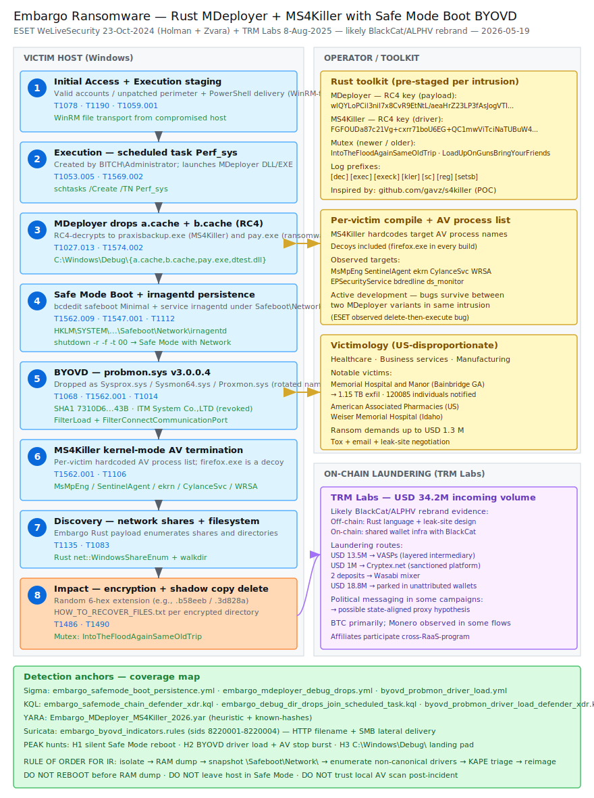

# Embargo Ransomware — Rust MDeployer + MS4Killer with Safe Mode Boot BYOVD (ESET + TRM Labs)

## TL;DR

Embargo is a Rust-built ransomware-as-a-service operation that ESET first
observed in June 2024 and that TRM Labs has assessed (8 Aug 2025) as a likely
rebrand or direct successor to **BlackCat/ALPHV** based on technical overlaps
(Rust, leak-site design) and on-chain overlap (shared wallet infrastructure,
~USD 13.5 M into VASPs, ~USD 1 M routed through sanctioned Cryptex.net,
~USD 18.8 M parked in unattributed wallets, USD 34.2 M total incoming volume).
The toolkit chains a Rust loader **MDeployer** that reboots the host into
**Safe Mode with Network** to disable security solutions, then drops the Rust
EDR-killer **MS4Killer** that abuses the signed-but-vulnerable minifilter
`probmon.sys` v3.0.0.4 (ITM System Co., LTD certificate, revoked) to terminate
AV processes from kernel via the `FilterConnectCommunicationPort` /
`FilterSendMessage` minifilter API, before the Rust ransomware payload (`pay.exe`)
encrypts files with a random 6-hex-char extension and drops the ransom note
`HOW_TO_RECOVER_FILES.txt`. Notable US victims include **Memorial Hospital and
Manor** (Bainbridge, Georgia — 120 085 individuals notified, 1.15 TB stolen,
class-action settled May 2026), **American Associated Pharmacies**, and
**Weiser Memorial Hospital** (Idaho). Today's case matters because it closes
the four-driver BYOVD catalogue of the diary (Akira/DragonForce `truesight.sys`,
Warlock `nseckrnl.sys`, Qilin `rwdrv.sys`+`hlpdrv.sys` from Day 16, now Embargo
`probmon.sys`) and introduces the first repo entry for `T1562.009 Safe Mode
Boot` paired with BYOVD — a vector none of the prior ransomware cases used.

## Attribution and confidence

- **Cluster name (vendor):** Embargo (ESET, ~June 2024).
- **Aliases / overlap:** Probable rebrand or successor to **BlackCat / ALPHV**
  (TRM Labs, 8 Aug 2025). Off-chain similarities — Rust language, leak-site
  design, similar encryption toolkit shape — and on-chain overlaps — historical
  BlackCat-linked addresses funneling into Embargo wallet clusters.
- **Vendor discoveries (timeline):**
  - **ESET WeLiveSecurity**, Jan Holman and Tomas Zvara — "Embargo ransomware:
    Rock'n'Rust", **23 Oct 2024**. Initial public deep-dive on MDeployer +
    MS4Killer Rust tooling, Safe Mode Boot abuse, and BYOVD via `probmon.sys`.
  - **TRM Labs** — "Unmasking Embargo Ransomware: A Deep Dive Into the Group's
    TTPs and BlackCat Links", **8 Aug 2025**. On-chain attribution + laundering
    analysis.
  - **Cyble** — earlier July 2024 article ("The Rust Revolution") consistent
    with ESET findings.
- **Attribution confidence:**
  - **High** on technical attribution of MDeployer + MS4Killer + Embargo
    ransomware as a single coordinated toolkit (same Rust developer signatures,
    overlapping cleanup functions, shared RC4 keys, shared mutex lineage).
  - **Medium-high** on BlackCat/ALPHV rebrand hypothesis (multi-modal: Rust +
    leak-site + on-chain wallet overlap).
  - **Medium** on nation-state alignment hint (some politically charged
    messages in extortion campaigns, but baseline behaviour is e-crime).
- **Genealogy with this repo:**
  - Closes the BYOVD-by-ransomware-family pattern:
    - Akira → `truesight.sys` (Adlice)
    - DragonForce → `truesight.sys` (inherited from Akira lineage)
    - Warlock → `nseckrnl.sys`
    - Qilin (Day 16, `2026-05-12_Qilin-EDR-Killer-msimg32-BYOVD`)
      → `rwdrv.sys` (ThrottleStop renamed) + `hlpdrv.sys` (purpose-built)
    - **Embargo (Day 22, this case)** → `probmon.sys` (ITM System cert revoked)
  - First repo entry using `T1562.009 Safe Mode Boot` paired with BYOVD —
    extends the "disable defenses" detection coverage that previously focused
    on user-mode hooking / kernel callback overwrites.
  - Continues the "RaaS rebrand" lineage: Day 19 captured The Gentlemen as
    a Qilin-affiliate spin-off; today captures the BlackCat → Embargo rebrand
    on the same axis (operational continuity with new branding).

## Kill chain — summary table

| Stage | MITRE | Detail |
|---|---|---|
| Resource Development | T1587.001 | Embargo develops MDeployer + MS4Killer + ransomware in Rust; MS4Killer compiled per victim with target AV process names hardcoded. |
| Initial Access | T1078, T1190 | Valid accounts and unpatched software exploitation are primary; phishing and drive-by downloads complement. Loader is staged via PowerShell similar to `WinRM-fs`. |
| Execution | T1053.005, T1059.001, T1569.002 | Scheduled task `Perf_sys` executed by `BITCH\Administrator` runs MDeployer. PowerShell delivers the loader. Service `irnagentd` re-executes the loader after Safe Mode reboot. |
| Persistence | T1547.001 | `HKLM\SYSTEM\CurrentControlSet\Control\Safeboot\Network\irnagentd` registered so `irnagentd` service runs in Safe Mode. |
| Defense Evasion (a) | T1562.009 | `bcdedit /set {default} safeboot Minimal` + `reg delete ...\Safeboot\Network\WinDefend /f` + `shutdown -r -f -t 00`. Forces a reboot into Safe Mode where AV is inert. |
| Defense Evasion (b) | T1562.001, T1112 | BYOVD: `probmon.sys` v3.0.0.4 dropped as `Sysprox.sys` or `Sysmon64.sys`, service `Sysprox` / `Proxmon` / `Sysmon64` created, driver loaded via `FilterLoad`. MS4Killer terminates AV processes from kernel. |
| Defense Evasion (c) | T1027.013 | Payloads RC4-encrypted as `a.cache` / `b.cache` in `C:\Windows\Debug\`. Strings and driver blob XOR-encrypted in MS4Killer. |
| Defense Evasion (d) | T1070.004 | Cleanup deletes `praxisbackup.exe`, `pay.exe`, `dtest.dll`, `Sysmon64.sys`/`Sysprox.sys`. Creates `stop.exe` as flow-control sentinel. |
| Discovery | T1135, T1083 | Ransomware payload performs network share + file/directory discovery. |
| Impact | T1486, T1490 | Files encrypted with random 6-hex-char extension. Ransom note `HOW_TO_RECOVER_FILES.txt` dropped per directory. Shadow copies typically deleted. Mutex `IntoTheFloodAgainSameOldTrip` (newer) or `LoadUpOnGunsBringYourFriends` (older). |



Left lane shows the **victim host** progression from PowerShell-staged loader
to scheduled task to Safe Mode reboot to BYOVD driver load to file encryption.
Right lane shows the **operator** infrastructure: pre-staged Rust toolkit
(MDeployer + MS4Killer with per-victim process list), `probmon.sys` legitimate
signed driver in the RC4 blob, BlackCat-linked wallet clusters receiving
ransom payments, and laundering paths via VASPs + Cryptex.net + Wasabi mixer.
Detection anchors box maps each artefact (Safe Mode bcdedit, `irnagentd`
service, `C:\Windows\Debug\` payload drops, `Sysprox`/`Proxmon`/`Sysmon64`
service for an unsigned/non-System32 driver) to its Sigma / KQL / YARA /
Suricata coverage.

## Stage-by-stage detail

### Initial Access (T1078, T1190)
Embargo affiliates favour valid accounts (purchased credentials, IAB hand-offs)
and exploitation of unpatched perimeter software. Phishing and drive-by
downloads are used opportunistically. The PowerShell script that ESET observed
delivering MDeployer was structurally similar to the `WinRM-fs` Ruby gem
(`lib/winrm-fs/core/file_transporter.rb`), suggesting the operator used a
WinRM file-transport workflow from an already-compromised internal host.

### Execution + Persistence (T1053.005, T1059.001, T1569.002, T1547.001)
A scheduled task named **`Perf_sys`** is created by the elevated user
`BITCH\Administrator` and points at the MDeployer DLL or EXE. The DLL variant
adds the persistence service `irnagentd`:

```cmd
sc create irnagentd binpath="C:\Windows\System32\cmd.exe /c start /B rundll32.exe C:\Windows\Debug\dtest.dll,Open" start=auto
reg add HKLM\SYSTEM\CurrentControlSet\Control\Safeboot\Network\irnagentd /t REG_SZ /d Service /f
```

The `Safeboot\Network\<service>` entry is the discriminating anchor — legitimate
software almost never modifies that key.

### Defense Evasion (a) — Safe Mode Boot (T1562.009)
This is the stage that distinguishes Embargo from the BYOVD families already
in the repo. The DLL MDeployer, when launched with admin rights, prepares a
reboot into Safe Mode with Network:

```cmd
reg delete HKLM\SYSTEM\CurrentControlSet\Control\Safeboot\Network\WinDefend /f
C:\Windows\System32\cmd.exe /c bcdedit /set {default} safeboot Minimal
shutdown -r -f -t 00
```

When the host comes up in Safe Mode the `irnagentd` service runs MDeployer
again, this time taking ownership of the AV install directories and renaming
them so the AV cannot start on the next normal-mode boot:

```cmd
C:\Windows\System32\cmd.exe /c takeown /R /A /F "C:\Program Files\<av_vendor>" /D Y
C:\Windows\System32\cmd.exe /c takeown /R /A /F "C:\ProgramData\<av_vendor>" /D Y
```

After Safe Mode work, MDeployer cleans up (`bcdedit /deletevalue {default} safeboot`,
`sc delete irnagentd`) and reboots back to normal mode for the encryption phase.

### Defense Evasion (b) — BYOVD via `probmon.sys` (T1562.001, T1112)
MS4Killer (decrypted as `C:\Windows\praxisbackup.exe`) inflates the vulnerable
driver from an embedded RC4-encrypted blob using the key
`FGFOUDa87c21Vg+cxrr71boU6EG+QC1mwViTciNaTUBuW4gQbcKboN9THK4K35sL`. Two file
paths and three service names have been observed:

| Driver path | Service name |
|---|---|
| `C:\Windows\System32\drivers\Sysprox.sys` | `Sysprox` |
| `C:\Windows\System32\drivers\Sysmon64.sys` | `Sysmon64` |
| (RC4 blob) | `Proxmon` (alternate) |

`probmon.sys` v3.0.0.4 was signed by `ITM System Co., LTD` (`KR`, Guro-gu)
with serial `010000000001306DE166BE`, thumbprint
`A88758892ED21DD1704E5528AD2D8036FEE4102C` — the certificate is revoked.
MS4Killer is custom-compiled per victim: the embedded list of process names
to terminate always includes decoys (`firefox.exe` appears verbatim) but the
compile-time-selected subset matches only the AV product actually deployed
in the target environment. The driver-load sequence follows the public
`gavz/s4killer` POC: enable `SeLoadDriverPrivilege`, `CreateServiceW`, write
the minifilter altitude/instance keys under
`HKLM\SYSTEM\ControlSet001\services\<service>\Instances`, then `FilterLoad`.

### Defense Evasion (c) — Obfuscation (T1027.013)
Both payloads decrypted by MDeployer use the same hardcoded RC4 key:
`wlQYLoPCil3niI7x8CvR9EtNtL/aeaHrZ23LP3fAsJogVTIzdnZ5Pi09ZVeHFkiB`. Files
manipulated by MDeployer:

| Path | Description |
|---|---|
| `C:\Windows\Debug\b.cache` | RC4-encrypted MS4Killer payload |
| `C:\Windows\Debug\a.cache` | RC4-encrypted Embargo ransomware payload |
| `C:\Windows\praxisbackup.exe` | Decrypted MS4Killer |
| `C:\Windows\Debug\pay.exe` | Decrypted Embargo ransomware |
| `C:\Windows\Debug\fail.txt` | Log file (prefixes `[dec]/[exec]/[execk]/[kler]/[sc]/[reg]/[setsb]`) |
| `C:\Windows\Debug\stop.exe` | Flow-control sentinel (sets cleanup-only path) |
| `C:\Windows\Sysmon64.sys` / `C:\Windows\System32\drivers\Sysprox.sys` | Vulnerable driver |

### Impact (T1486, T1490)
Embargo Rust payload performs network share and file/directory discovery,
then encrypts files with a random 6-hex-char extension (examples observed:
`.b58eeb`, `.3d828a`). Ransom note `HOW_TO_RECOVER_FILES.txt` is dropped in
each encrypted directory. Mutex names observed: `IntoTheFloodAgainSameOldTrip`
(newer, Alice in Chains lyric) and `LoadUpOnGunsBringYourFriends` (older,
Nirvana lyric per Cyble July 2024). Shadow copies are deleted as standard
inhibit-recovery.

## RE notes

| Component | SHA-1 | Lang | Packer | Notes |
|---|---|---|---|---|
| MDeployer (`dtest.dll`) | `A1B98B1FBF69AF79E5A3F27AA6256417488CC117` | Rust | none | DLL variant with Safe Mode Boot capability |
| MDeployer (`fxc.exe`) | `F0A25529B0D0AABCE9D72BA46AAF1C78C5B48C31` | Rust | none | EXE variant without Safe Mode branch |
| MDeployer (`fdasvc.exe`) | `2BA9BF8DD320990119F42F6F68846D8FB14194D6` | Rust | none | EXE variant |
| MS4Killer (`praxisbackup.exe`) | `888F27DD2269119CF9524474A6A0B559D0D201A1` | Rust | none | Driver blob RC4-XOR-encrypted in `.rdata` |
| MS4Killer (`praxisbackup.exe`) | `BA14C43031411240A0836BEDF8C8692B54698E05` | Rust | none | Alternate build observed in same intrusion |
| Embargo ransomware (`pay.exe`) | `8A85C1399A0E404C8285A723C4214942A45BBFF9` | Rust | none | Win32/Filecoder.Embargo.A |
| Embargo ransomware (`win32.exe`) | `612EC1D41B2AA2518363B18381FD89C12315100F` | Rust | none | Alternate build |
| `probmon.sys` v3.0.0.4 | `7310D6399683BA3EB2F695A2071E0E45891D743B` | C/kernel | none | Vulnerable minifilter, ITM System cert revoked |

### Anti-analysis highlights

- **RC4 + XOR string obfuscation:** Log message strings, the RC4 key used to
  decrypt the driver blob, and the AV process-name list are all stored XOR-
  encrypted in `.rdata`. Decryption is inlined via a small `xor_str` helper
  that takes a key reference and writes the result into a stack-local
  `Vec<u8>`. Useful YARA anchor: the dummy process name `firefox.exe`
  appearing in the decrypted list (Rust deduplication leaves it in even
  when the actual termination logic filters it out).
- **Driver dropper:** Sequence matches `gavz/s4killer` POC almost line-for-line,
  with two additions: encryption of the driver blob, and a multi-threaded
  process scanner using Rayon (`rayon::par_iter`). Static anchor: imports of
  `FltMgr` / `FltCloseCommunicationPort` / `FltSendMessage` plus the explicit
  `SeLoadDriverPrivilege` enable.
- **Active development tells:** ESET observed two MDeployer variants in the
  same intrusion — the operator iterates on bugs in real time. The cleanup
  routine in the DLL variant calls `delete(pay.exe)` and then immediately
  tries to `CreateProcess(pay.exe)` in the next basic block, which is the
  kind of bug that survives a rushed compile. Useful for filtering noise:
  expect ≥2 MDeployer hash variants per intrusion.

### Ghidra-style pseudo-code (illustrative)

```c
// MDeployer DLL — Safe Mode Boot branch
if (is_admin()) {
    write_log("[setsb] preparing safeboot reboot");
    system("bcdedit /set {default} safeboot Minimal");
    system("reg delete HKLM\\SYSTEM\\CurrentControlSet\\Control\\Safeboot\\Network\\WinDefend /f");
    snprintf(svc_cmd, sizeof(svc_cmd),
        "sc create irnagentd binpath=\"%s\" start=auto",
        "C:\\Windows\\System32\\cmd.exe /c start /B rundll32.exe "
        "C:\\Windows\\Debug\\dtest.dll,Open");
    system(svc_cmd);
    system("reg add HKLM\\SYSTEM\\CurrentControlSet\\Control\\Safeboot\\Network\\irnagentd "
           "/t REG_SZ /d Service /f");
    system("shutdown -r -f -t 00");
}
```

```c
// MS4Killer — driver decrypt and load (simplified)
xor_decrypt(rc4_key_blob, rc4_key_xor_key, sizeof(rc4_key_blob));
rc4_decrypt(embedded_driver_blob, sizeof(embedded_driver_blob), rc4_key_blob);
write_file("C:\\Windows\\System32\\drivers\\Sysprox.sys", embedded_driver_blob);
enable_privilege("SeLoadDriverPrivilege");
sc_handle = CreateServiceW(scm, L"Sysprox", L"Sysprox", SERVICE_KERNEL_DRIVER, ...);
set_minifilter_keys("Sysprox", altitude = "385100");
FilterLoad(L"Sysprox");
```

## Detection strategy

### Telemetry that matters

- **Sysmon EID 1** (`ProcessCreate`) — `bcdedit.exe safeboot Minimal`, `sc.exe create irnagentd`, `reg.exe add ...\Safeboot\Network\...`, `rundll32.exe C:\Windows\Debug\dtest.dll,Open`, `shutdown -r -f -t 00`.
- **Sysmon EID 6** (`DriverLoad`) — kernel driver load where `ImageLoaded` is outside `\Windows\System32\drivers\` *or* where the signer is `ITM System Co., LTD` *or* where the SHA-256/SHA-1 matches `probmon.sys` v3.0.0.4.
- **Sysmon EID 11** (`FileCreate`) — drops in `C:\Windows\Debug\` of `a.cache`, `b.cache`, `pay.exe`, `dtest.dll`, `stop.exe`, `fail.txt`; drops of `Sysprox.sys` / `Sysmon64.sys` outside `\System32\drivers\`.
- **Sysmon EID 13** (`RegistryValueSet`) — `HKLM\SYSTEM\CurrentControlSet\Control\Safeboot\Network\<service>` writes.
- **Defender XDR tables** — `DeviceProcessEvents`, `DeviceFileEvents`, `DeviceImageLoadEvents`, `DeviceRegistryEvents`. `DeviceProcessEvents` is enough for the bcdedit/sc/reg/shutdown chain; `DeviceImageLoadEvents` adds the kernel driver visibility.
- **Boot telemetry** — `Microsoft-Windows-Kernel-Boot/Operational` log EID 27 records `Safeboot.dat` reads; if Defender for Endpoint is in place, the `DeviceEvents` table records boot-config changes.
- **Sentinel custom log** — if the org ingests bcdedit audit (`Microsoft-Windows-Bits-Client/Operational` is a poor proxy; better: enable Audit Policy Change + Audit System Integrity), pivot in `SecurityEvent` on EID 4657 for `\Safeboot\` registry writes.

### Detection coverage

| Engine | File | Logic |
|---|---|---|
| Sigma | [`sigma/embargo_safemode_boot_persistence.yml`](./sigma/embargo_safemode_boot_persistence.yml) | Catches `bcdedit safeboot Minimal` or `sc create irnagentd` or `reg add ...\Safeboot\Network\irnagentd` |
| Sigma | [`sigma/embargo_mdeployer_debug_drops.yml`](./sigma/embargo_mdeployer_debug_drops.yml) | File creation in `C:\Windows\Debug\` matching MDeployer payload filenames |
| Sigma | [`sigma/byovd_probmon_driver_load.yml`](./sigma/byovd_probmon_driver_load.yml) | Kernel driver load of `Sysprox.sys` / `Sysmon64.sys` / `Proxmon.sys` from a path other than `\Windows\System32\drivers\`, or matching known SHA-256/SHA-1 of `probmon.sys` |
| KQL | [`kql/embargo_safemode_chain_defender_xdr.kql`](./kql/embargo_safemode_chain_defender_xdr.kql) | Defender XDR — bcdedit/sc/reg/shutdown chain join on `DeviceId` within 10 min |
| KQL | [`kql/embargo_debug_dir_drops_join_scheduled_task.kql`](./kql/embargo_debug_dir_drops_join_scheduled_task.kql) | Defender XDR — `C:\Windows\Debug\` drops joined with `schtasks Perf_sys` creation |
| KQL | [`kql/byovd_probmon_driver_load_defender_xdr.kql`](./kql/byovd_probmon_driver_load_defender_xdr.kql) | Defender XDR — DriverLoad outside System32 + service name in `Sysprox`/`Sysmon64`/`Proxmon` |
| YARA | [`yara/Embargo_MDeployer_MS4Killer_2026.yar`](./yara/Embargo_MDeployer_MS4Killer_2026.yar) | Two rules: heuristic (RC4 key + XOR strings + mutex + minifilter imports + filesize cap) and known-hashes anchor |
| Suricata | [`suricata/embargo_byovd_indicators.rules`](./suricata/embargo_byovd_indicators.rules) | File-name anchors over HTTP for `praxisbackup.exe` / `dtest.dll` / `pay.exe` and SMB/NetBIOS file write of `probmon.sys` / `Sysprox.sys` |

### Threat hunting hypotheses

- **H1 — Silent Safe Mode reboot:** the host rebooted into Safe Mode (Kernel-Boot EID 27 or `bcdedit safeboot Minimal` recently set) *and* no scheduled maintenance window matches *and* `\Safeboot\Network\<service>` was written within the last 24 h. Operationally indistinguishable from legitimate troubleshooting only if the org has a baseline. Hunt file: [`hunts/peak_h1_safemode_boot_silent_reboot.md`](./hunts/peak_h1_safemode_boot_silent_reboot.md).
- **H2 — BYOVD unsigned/non-System32 driver burst:** a kernel driver was loaded from a path outside `\Windows\System32\drivers\` (or with a revoked signer cert) within 15 minutes of an AV process crash or service-stop event. Hunt file: [`hunts/peak_h2_byovd_unsigned_driver_load_burst.md`](./hunts/peak_h2_byovd_unsigned_driver_load_burst.md).
- **H3 — `C:\Windows\Debug\` as a Rust loader landing pad:** any file write into `C:\Windows\Debug\` whose filename is in the Embargo asset list (`a.cache`, `b.cache`, `pay.exe`, `dtest.dll`, `stop.exe`, `fail.txt`) — none of these are produced by normal Windows tooling. Hunt file: [`hunts/peak_h3_debug_dir_rust_loader_landing_pad.md`](./hunts/peak_h3_debug_dir_rust_loader_landing_pad.md).

## Incident response playbook

### First 60 minutes (triage)

1. **Isolate the host at the network level** (EDR isolation or switch ACL) **before** doing anything that might trigger a reboot. Embargo's MDeployer aggressively reboots; once it lands in Safe Mode, host-side tools have minimal visibility.
2. **Acquire RAM immediately** with WinPmem / Magnet RAM Capture / DumpIt before any reboot. MS4Killer keeps the driver-list and AV process-name list XOR-decrypted only in memory; the disk blob does not give the same fidelity.
3. **Snapshot the `HKLM\SYSTEM\CurrentControlSet\Control\Safeboot\Network` subtree** via `reg save` or `RegRipper` — the `irnagentd` (or rotated name) entry is the smoking-gun persistence anchor.
4. **Enumerate scheduled tasks** — look for `Perf_sys` (canonical) and any task created by `BITCH\Administrator` or non-domain admin SIDs in the last 7 days.
5. **Enumerate services with a non-`\Windows\System32\drivers\` `ImagePath`** — pay particular attention to `Sysprox`, `Sysmon64` (when the legitimate Sysmon service is named differently or not installed), `Proxmon`.
6. **Trigger a triage collection** via Velociraptor / KAPE — minimum: MFT, USN journal, `C:\Windows\Debug\` directory content, `\System32\winevt\Logs\Microsoft-Windows-Kernel-Boot%4Operational.evtx`, `Microsoft-Windows-TaskScheduler%4Operational.evtx`, `Microsoft-Windows-Bits-Client%4Operational.evtx`, registry hives.
7. **Hash-check** any driver under `\System32\drivers\` or `\Windows\` against the `probmon.sys` known SHA-1 / SHA-256 and against the ITM System Co., LTD certificate thumbprint `A88758892ED21DD1704E5528AD2D8036FEE4102C`.

### Artifacts to collect

| Artifact | Path | Tool | Why it matters |
|---|---|---|---|
| `irnagentd` persistence | `HKLM\SYSTEM\CurrentControlSet\Control\Safeboot\Network\irnagentd` | `reg save`, RegRipper | Smoking-gun anchor for Safe Mode persistence |
| MDeployer log | `C:\Windows\Debug\fail.txt` | `Get-Item`, raw copy | Stage prefixes reveal which stage failed and what the operator tried |
| MDeployer payloads | `C:\Windows\Debug\a.cache`, `b.cache` | KAPE Targets, raw copy | RC4-encrypted, but RC4 key is hardcoded — can be decrypted offline |
| Decrypted EDR-killer | `C:\Windows\praxisbackup.exe` | raw copy | MS4Killer binary (Rust) — feed to YARA rules |
| Decrypted ransomware | `C:\Windows\Debug\pay.exe` | raw copy | Embargo Rust ransomware payload |
| Vulnerable driver | `C:\Windows\System32\drivers\Sysprox.sys`, `\Sysmon64.sys`, `C:\Windows\Sysmon64.sys` | raw copy | `probmon.sys` v3.0.0.4 — signed by revoked ITM System cert |
| Sentinel file | `C:\Windows\Debug\stop.exe` | raw copy | Presence indicates MDeployer already executed at least once |
| Scheduled task XML | `C:\Windows\System32\Tasks\Perf_sys` | raw copy | Canonical persistence vehicle by `BITCH\Administrator` |
| Boot config | `bcdedit /enum` output, `BCD` hive | `reg save HKLM\BCD00000000` | Captures `safeboot` value if `bcdedit /deletevalue` cleanup did not run |
| Boot events | `Microsoft-Windows-Kernel-Boot%4Operational.evtx` | `wevtutil epl`, KAPE | EID 27 captures Safe Mode boot |
| Task Scheduler events | `Microsoft-Windows-TaskScheduler%4Operational.evtx` | `wevtutil epl` | Captures `Perf_sys` registration and runs |
| MFT + USN journal | `\$MFT`, `\$Extend\$UsnJrnl:$J` | KAPE, FTK Imager | Recovers deleted MDeployer artefacts after cleanup |
| Ransom note | `HOW_TO_RECOVER_FILES.txt` (per encrypted dir) | raw copy | Confirms Embargo family + contact channel |
| Encrypted file extension | random 6-hex-char (e.g., `.b58eeb`, `.3d828a`) | sample | Confirms Embargo encryption mode |

### IR queries and commands

```powershell
# Detect Safe Mode Boot configuration
bcdedit /enum | Select-String 'safeboot'

# Enumerate Safeboot persistence keys
Get-ChildItem 'HKLM:\SYSTEM\CurrentControlSet\Control\Safeboot\Network' |
    Select-Object PSChildName, @{n='Value';e={(Get-ItemProperty $_.PSPath).'(default)'}}

# Find drivers loaded from non-canonical paths
Get-CimInstance Win32_SystemDriver |
    Where-Object { $_.PathName -notlike '*\System32\drivers\*' -and $_.PathName -notlike '*WUDFRd*' } |
    Select-Object Name, PathName, State, StartMode

# Hash-check candidate driver against known probmon.sys
Get-FileHash 'C:\Windows\System32\drivers\Sysprox.sys','C:\Windows\Sysmon64.sys' -Algorithm SHA1 -ErrorAction SilentlyContinue

# Scheduled tasks created by BITCH\Administrator or other suspicious principals
Get-ScheduledTask | Where-Object { $_.TaskName -like 'Perf_sys*' -or $_.Principal.UserId -like '*BITCH*' }
```

```bash
# Triage collection via KAPE module pack (Windows admin host)
kape.exe --tsource C:\ --target KapeTriage \
         --tdest E:\evidence\<host>\KAPE_Triage \
         --mdest E:\evidence\<host>\KAPE_Modules \
         --module RegistryHives,EvtxLogs,MFT,UsnJournal --gui false
```

```kql
// Defender XDR — pull every machine that booted in Safe Mode in last 7 d via process telemetry
DeviceProcessEvents
| where Timestamp > ago(7d)
| where ProcessCommandLine has "safeboot" and ProcessCommandLine has_any ("Minimal","Network")
| where FileName =~ "bcdedit.exe"
| project Timestamp, DeviceId, DeviceName, AccountName, ProcessCommandLine, InitiatingProcessFileName
| order by Timestamp desc
```

### Containment, eradication, recovery

- **What NOT to do:**
  - **Do not reboot the host before RAM acquisition.** MS4Killer keeps the
    per-victim AV process-name list and driver decryption key in memory.
  - **Do not leave the host in Safe Mode "to be safe".** AV/EDR is inert in
    Safe Mode; the operator may still have hands-on-keyboard access through
    the persistence service.
  - **Do not assume `wevtutil cl` wiped everything.** Boot, Task Scheduler,
    and BITS event logs typically survive on a separate provider.
  - **Do not run the host's local AV scan first.** The AV install directory
    may have been renamed; the binaries on disk may be intact but un-executable.
- **Containment** — EDR isolate; block egress to known C2 (TRM Labs has
  published a wallet cluster but C2 infra is per-affiliate); revoke any
  credentials linked to `BITCH\Administrator` or other unexpected admin
  accounts; audit recent Kerberos TGS issuance and disable AS-REP-roastable
  accounts.
- **Eradication** — wipe and rebuild any host where `irnagentd` (or rotated
  service name) was registered in `\Safeboot\Network\`; *the only safe recovery
  is reimage*, because the operator likely staged additional implants
  pre-encryption that did not survive the cleanup routine but may have
  persisted via other mechanisms.
- **Recovery** — restore from offline / immutable backup; validate backup
  integrity hashes against pre-incident baselines; rotate `krbtgt` twice
  with the standard 10-h delay; rotate every domain admin and service
  account; force password reset for all users on the affected forest.

### Recovery validation

- All hosts confirmed to have **no `Safeboot\Network` non-default entries**.
- All hosts confirmed to have **no driver outside `\Windows\System32\drivers\`**
  in `HKLM\SYSTEM\CurrentControlSet\Services\*\ImagePath` with `Type = 1`.
- `bcdedit /enum` returns no `safeboot` value on any production host.
- All scheduled tasks audited; no `Perf_sys` or equivalent created by
  `BITCH\Administrator` or non-domain admin principals.
- AV/EDR live and reporting on every host; agent heartbeat continuous for
  ≥ 48 h post-recovery.
- No `C:\Windows\Debug\*.cache`, `pay.exe`, `praxisbackup.exe`, `dtest.dll`,
  `stop.exe`, `fail.txt` on disk anywhere.

## IOCs

| Type | Value | Context | Confidence | Source |
|---|---|---|---|---|
| sha1 | `A1B98B1FBF69AF79E5A3F27AA6256417488CC117` | MDeployer (`dtest.dll`, DLL variant with Safe Mode Boot) | high | ESET |
| sha1 | `F0A25529B0D0AABCE9D72BA46AAF1C78C5B48C31` | MDeployer (`fxc.exe`, EXE variant) | high | ESET |
| sha1 | `2BA9BF8DD320990119F42F6F68846D8FB14194D6` | MDeployer (`fdasvc.exe`, EXE variant) | high | ESET |
| sha1 | `888F27DD2269119CF9524474A6A0B559D0D201A1` | MS4Killer (`praxisbackup.exe`) | high | ESET |
| sha1 | `BA14C43031411240A0836BEDF8C8692B54698E05` | MS4Killer (alternate build, same intrusion) | high | ESET |
| sha1 | `8A85C1399A0E404C8285A723C4214942A45BBFF9` | Embargo ransomware (`pay.exe`) | high | ESET |
| sha1 | `612EC1D41B2AA2518363B18381FD89C12315100F` | Embargo ransomware (`win32.exe`, alternate) | high | ESET |
| sha1 | `7310D6399683BA3EB2F695A2071E0E45891D743B` | `probmon.sys` v3.0.0.4 (ITM System cert revoked) | high | ESET / VT |
| string | `IntoTheFloodAgainSameOldTrip` | Embargo mutex (newer builds) — Alice in Chains lyric anchor | high | ESET |
| string | `LoadUpOnGunsBringYourFriends` | Embargo mutex (older builds) — Nirvana lyric anchor | medium | Cyble |
| path | `C:\Windows\Debug\a.cache` | MDeployer-decrypted Embargo ransomware payload | high | ESET |
| path | `C:\Windows\Debug\b.cache` | MDeployer-decrypted MS4Killer payload | high | ESET |
| path | `C:\Windows\Debug\pay.exe` | Decrypted Embargo ransomware | high | ESET |
| path | `C:\Windows\praxisbackup.exe` | Decrypted MS4Killer | high | ESET |
| path | `C:\Windows\Debug\fail.txt` | MDeployer log file (stage prefixes) | high | ESET |
| regkey | `HKLM\SYSTEM\CurrentControlSet\Control\Safeboot\Network\irnagentd` | Safe Mode persistence service entry | high | ESET |
| string | `wlQYLoPCil3niI7x8CvR9EtNtL/aeaHrZ23LP3fAsJogVTIzdnZ5Pi09ZVeHFkiB` | RC4 key for MDeployer payload decryption | high | ESET |
| string | `FGFOUDa87c21Vg+cxrr71boU6EG+QC1mwViTciNaTUBuW4gQbcKboN9THK4K35sL` | RC4 key for MS4Killer driver blob decryption | high | ESET |

Complete list in [`iocs.csv`](./iocs.csv).

## Secondary findings

- **Grafana Labs codebase steal (16 May 2026, CoinbaseCartel)** — a freshly
  enabled GitHub Action carried a "Pwn Request" misconfiguration that allowed
  a forked repo to inject a `curl` step, dump environment variables encrypted
  with a private key, extract a privileged token, then access four additional
  private repos and delete the fork. CoinbaseCartel (assessed offshoot of
  ShinyHunters / Scattered Spider / LAPSUS$) tried to extort; Grafana refused
  per FBI guidance and disclosed publicly. **Third Pwn Request mass incident
  in 35 days** after Mini Shai-Hulud (Day 18, TanStack) and Day 21's
  resource pool. The shape is now an industry-level pattern, not an edge
  case — branch protection + tightened `pull_request_target` triggers are
  no longer optional for any active OSS project.

- **CISA KEV: CVE-2024-57726 + CVE-2024-57728 SimpleHelp RMM weaponised as
  DragonForce precursor** — Field Effect and Sophos report that the
  SimpleHelp authorization-bypass and path-traversal vulnerabilities are
  being used as the initial access vector for DragonForce ransomware
  campaigns. CISA KEV deadline May 2026. The pattern confirms the lesson
  from Day 19: third-party RMM tooling is the dominant lateral / initial-
  access vector in 2026 e-crime — `byActor/dragonforce/` and
  `byTechnique/t1219/` will both grow. Tier-0 hosts (DCs, ADCS, AD-FS)
  should categorically not have any third-party RMM agent installed.

- **Memorial Hospital and Manor class-action settlement (Bainbridge, GA, May
  2026)** — 105 170 patients covered by the settlement of the November 2024
  Embargo attack that exfiltrated 1.15 TB and was notified to HHS OCR as
  affecting 120 085 individuals. First case in the repo where Embargo is
  documented in the **post-incident regulatory / judicial phase**, closing
  the loop on the technical analysis from ESET (Oct 2024) and the on-chain
  attribution from TRM Labs (Aug 2025). The aggregate USD 34.2 M figure
  TRM tracked is the result of attacks like this one repeated against
  smaller US healthcare and manufacturing targets.

## Pedagogical anchors

- **Safe Mode Boot (T1562.009) is the cleanest evasion vector ransomware
  can use today.** Safe Mode strips AV/EDR enforcement to zero. Detection
  has to live at the `\Safeboot\Network\<service>` registry write and at
  the `bcdedit safeboot Minimal` process-creation events — not at the
  ransomware payload itself, which executes in a host with most defenses
  inert.
- **BYOVD has become commoditised — track it by driver, not by family.**
  Embargo (`probmon.sys`) joins Akira / DragonForce (`truesight.sys`),
  Warlock (`nseckrnl.sys`), and Qilin (`rwdrv.sys` + `hlpdrv.sys`) in this
  repo. LOLDrivers (`magicsword-io/LOLDrivers`) plus a Sigma rule per driver
  is more durable than per-ransomware rules — the operator can swap families
  faster than they can rotate signed drivers.
- **Per-victim custom compile is the new normal.** MS4Killer ships with a
  superset of decoy AV process names and is recompiled with the actual
  target subset embedded. This means YARA on the full process-name list is
  fragile; YARA on the compile-time invariants (RC4 key bytes, XOR routine,
  mutex lyric anchors, minifilter API imports) is durable.
- **Rebrand patterns are detectable, but only via multi-modal signal.** The
  BlackCat → Embargo rebrand is supported by Rust + leak-site + on-chain
  wallet overlap. Any single modality could be coincidence; all three
  together are not. Apply the same logic when triaging future rebrand
  claims (Akira → Cactus, Qilin → ?, RansomHub → ?).
- **RAM before reboot, every time.** Embargo's per-victim AV list,
  decryption keys, and operator state live only in memory once the loader
  has run. A reboot kills your visibility into what the operator was
  targeting.

## What's in this folder

| File | Purpose |
|---|---|
| [`README.md`](./README.md) | This document — case write-up |
| [`kill_chain.svg`](./kill_chain.svg) | Visual kill chain (victim lane + operator + on-chain laundering) |
| [`sigma/embargo_safemode_boot_persistence.yml`](./sigma/embargo_safemode_boot_persistence.yml) | Sigma — `bcdedit safeboot` / `sc create irnagentd` / `reg add \Safeboot\Network\irnagentd` |
| [`sigma/embargo_mdeployer_debug_drops.yml`](./sigma/embargo_mdeployer_debug_drops.yml) | Sigma — file creation in `C:\Windows\Debug\` matching MDeployer payload filenames |
| [`sigma/byovd_probmon_driver_load.yml`](./sigma/byovd_probmon_driver_load.yml) | Sigma — `probmon.sys` / `Sysprox.sys` / `Sysmon64.sys` driver load from non-canonical path |
| [`kql/embargo_safemode_chain_defender_xdr.kql`](./kql/embargo_safemode_chain_defender_xdr.kql) | KQL — Defender XDR — bcdedit + sc + reg + shutdown chain join within 10 min |
| [`kql/embargo_debug_dir_drops_join_scheduled_task.kql`](./kql/embargo_debug_dir_drops_join_scheduled_task.kql) | KQL — `C:\Windows\Debug\` drops joined with `schtasks Perf_sys` creation |
| [`kql/byovd_probmon_driver_load_defender_xdr.kql`](./kql/byovd_probmon_driver_load_defender_xdr.kql) | KQL — DriverLoad outside `\System32\drivers\` + service name in `Sysprox`/`Sysmon64`/`Proxmon` |
| [`yara/Embargo_MDeployer_MS4Killer_2026.yar`](./yara/Embargo_MDeployer_MS4Killer_2026.yar) | YARA — heuristic (RC4 key + XOR strings + mutex + minifilter imports) and known-hash rule |
| [`suricata/embargo_byovd_indicators.rules`](./suricata/embargo_byovd_indicators.rules) | Suricata — file-name anchors over HTTP and SMB for MDeployer / MS4Killer / `probmon.sys` |
| [`hunts/peak_h1_safemode_boot_silent_reboot.md`](./hunts/peak_h1_safemode_boot_silent_reboot.md) | PEAK — silent Safe Mode reboot without maintenance window |
| [`hunts/peak_h2_byovd_unsigned_driver_load_burst.md`](./hunts/peak_h2_byovd_unsigned_driver_load_burst.md) | PEAK — kernel driver load from non-canonical path + AV process stop ≤ 15 min |
| [`hunts/peak_h3_debug_dir_rust_loader_landing_pad.md`](./hunts/peak_h3_debug_dir_rust_loader_landing_pad.md) | PEAK — `C:\Windows\Debug\` writes of Embargo-canonical filenames |
| [`iocs.csv`](./iocs.csv) | All IOCs of the case in `type,value,context,confidence,source` schema |

## Sources

- [ESET WeLiveSecurity — "Embargo ransomware: Rock'n'Rust" (23 Oct 2024, Holman and Zvara)](https://www.welivesecurity.com/en/eset-research/embargo-ransomware-rocknrust/)
- [TRM Labs — "Unmasking Embargo Ransomware: A Deep Dive Into the Group's TTPs and BlackCat Links" (8 Aug 2025)](https://www.trmlabs.com/resources/blog/unmasking-embargo-ransomware-a-deep-dive-into-the-groups-ttps-and-blackcat-links)
- [Cyble — "The Rust Revolution: New Embargo Ransomware Steps In" (Jul 2024)](https://cyble.com/blog/the-rust-revolution-new-embargo-ransomware-steps-in/)
- [BankInfoSecurity — "Embargo Ransomware Disables Security Defenses"](https://www.bankinfosecurity.com/embargo-ransomware-disables-security-defenses-a-26603)
- [HIPAA Journal — "Memorial Hospital and Manor Agrees to Settle Ransomware Class Action Lawsuit" (May 2026)](https://www.hipaajournal.com/memorial-hospital-manor-data-breach-settlement/)
- [HIPAA Journal — "Embargo Ransomware Group Claims Attack on American Associated Pharmacies"](https://www.hipaajournal.com/embargo-ransomware-american-associated-pharmacies/)
- [The Hacker News — "Grafana GitHub Token Breach Led to Codebase Download and Extortion Attempt" (18 May 2026)](https://thehackernews.com/2026/05/grafana-github-token-breach-led-to.html)
- [CISA Known Exploited Vulnerabilities Catalog](https://www.cisa.gov/known-exploited-vulnerabilities-catalog)
- [s4killer reference POC — gavz/s4killer (GitHub)](https://github.com/gavz/s4killer)
- [WinRM-fs reference (Ruby gem similar to MDeployer delivery)](https://github.com/WinRb/winrm-fs)
- [MITRE ATT&CK T1562.009 — Impair Defenses: Safe Mode Boot](https://attack.mitre.org/techniques/T1562/009/)
