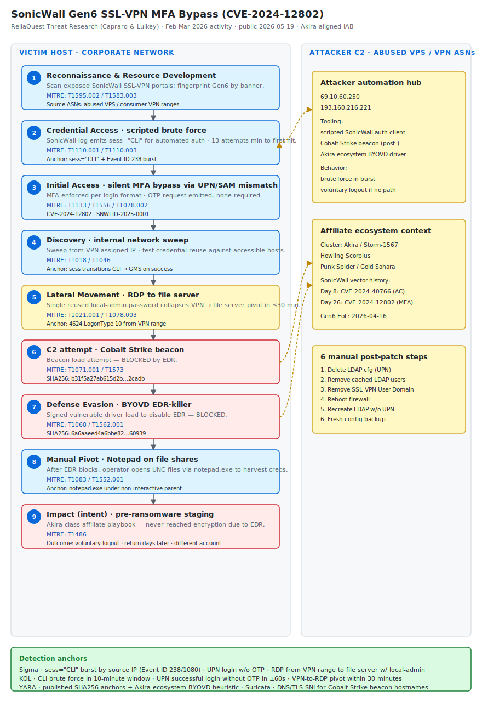

# SonicWall Gen6 SSL-VPN MFA Bypass (CVE-2024-12802) — First In-the-Wild Exploitation by Akira-Aligned Affiliate

## TL;DR

Between February and March 2026, ReliaQuest documented what it assesses with medium confidence as the **first in-the-wild exploitation of CVE-2024-12802**, an authentication bypass in SonicWall SSL-VPN appliances disclosed in early 2025 as SNWLID-2025-0001. On Gen6 hardware the firmware patch alone does not remediate the vulnerability — six manual LDAP reconfiguration steps are required, and standard patch-management workflows cannot verify them. Devices appear "patched" on the dashboard while remaining fully exploitable. Attackers brute-forced AD accounts (as few as 13 attempts to a hit) and bypassed MFA silently with no failed-MFA alert because MFA is enforced per login format (UPN vs SAM) rather than per identity. In one escalation case the operator reached a domain-joined file server via RDP using a reused local-administrator password within 30 minutes of initial VPN authentication, and attempted Cobalt Strike beacon deployment plus a BYOVD EDR-killer chain — both blocked by EDR. TTPs are consistent with affiliates operating in the Akira ransomware ecosystem. Public disclosure: ReliaQuest blog, 2026-05-19. Gen6 hardware reached end-of-life on 2026-04-16 and will receive no further updates.

## Attribution and confidence

**Cluster name (vendor):** Unattributed ransomware-aligned initial-access activity; TTP overlap with **Akira / Storm-1567 / Howling Scorpius / Punk Spider / Gold Sahara** affiliate ecosystem (ReliaQuest, 2026-05-19). No definitive attribution to a single named operator.

**Vendor discovery + date:** ReliaQuest Threat Research (Alexander Capraro and Tristan Luikey) — blog published 2026-05-19; activity observed February-March 2026.

**Confidence:** medium for "Akira-aligned" classification; high for "ransomware-ecosystem IAB activity"; high for the technical vulnerability mechanism and post-patch exploitability gap.

**Justification:** the post-exploitation toolchain (Cobalt Strike beacon, BYOVD EDR-killer attempt, SonicWall SSL-VPN as initial-access vector, reused local-admin credential reuse to file server) maps tightly to the published Akira playbook ReliaQuest documented in prior incidents against the same vendor. Attribution remained inconclusive in this case because EDR truncated the kill chain before payload deployment or ransom note.

**Cluster overlap:**

| Vendor name | Sponsor | Notes |
|---|---|---|
| Akira | ReliaQuest / Arctic Wolf | Active SonicWall consumer since 2024; uses Cobalt Strike + BYOVD chain |
| Storm-1567 | Microsoft | Microsoft Storm-prefix designation for Akira RaaS activity |
| Howling Scorpius | Unit 42 | Palo Alto designation; same operational profile |
| Punk Spider | CrowdStrike | CrowdStrike designation; overlaps in tooling |
| Gold Sahara | Secureworks | Secureworks designation; overlaps in victimology |

**Repo genealogy:** continues the Akira + SonicWall track opened on Day 8 (`2026-05-05_Akira-SonicWall-CVE-2024-40766`) — different CVE, same vendor, same affiliate ecosystem, same "smash-and-grab" intrusion pattern. Day 8 covered SonicOS access-control bug CVE-2024-40766; today covers the orthogonal MFA-bypass primitive CVE-2024-12802. Together they form the canonical pair of SonicWall SSL-VPN ransomware initial-access vectors as of mid-2026.

## Kill chain — summary table

| Stage | MITRE | Detail |
|---|---|---|
| Reconnaissance | T1595.002 | Active scanning for exposed SonicWall SSL-VPN endpoints; Gen6 fingerprinting by banner |
| Resource Development | T1583.003 | Source IPs on abused VPS/VPN ASN ranges (e.g., `69.10.60.250`, `193.160.216.221`) |
| Credential Access | T1110.001 / T1110.003 | Scripted brute force against AD accounts via `sess="CLI"` session type; as few as 13 attempts to first hit |
| Initial Access | T1133 | External SSL-VPN authentication into the corporate network |
| Defense Evasion / Modify Auth Process | T1556 | MFA enforced per login format — auth via UPN path while MFA only enforced on SAM path (or vice versa), bypassing the second factor |
| Valid Accounts | T1078.002 | Compromised domain accounts used for authentication |
| Discovery | T1018 / T1046 | Internal network sweep from the SSL-VPN session; some sessions log out voluntarily if no lateral path found |
| Lateral Movement | T1021.001 + T1078.003 | RDP from SSL-VPN-assigned IP to domain-joined file server using reused local-administrator password |
| Command and Control | T1071.001 / T1573 | Cobalt Strike beacon deployment attempt (blocked by EDR) |
| Defense Evasion / Privilege Escalation | T1068 + T1562.001 | BYOVD chain — legitimate vulnerable signed driver loaded to disable EDR (blocked) |
| Discovery (manual) | T1083 + T1552.001 | After EDR blocks, operator pivots to manual review of file shares with Notepad to find embedded credentials |
| Impact (intent) | T1486 | Pre-ransomware staging — never executed in observed cases due to EDR intervention |



The diagram shows two lanes: the victim host lane on the left progresses from external SSL-VPN authentication through credential brute force, MFA bypass via the unprotected login format, internal network discovery, and lateral movement via RDP to a file server with a reused local-administrator credential; the attacker C2 lane on the right shows the operator's automation hub on abused VPS/VPN ASN infrastructure issuing scripted authentication requests. Detection anchors are highlighted in the footer box: `sess="CLI"` session type in SonicWall authentication logs is the highest-confidence early-stage indicator, with `sess="GMS"` transition marking the pivot to hands-on-keyboard activity.

## Stage-by-stage detail

### Reconnaissance and Resource Development (T1595.002, T1583.003)

The operator scans the public internet for exposed SonicWall SSL-VPN portals, fingerprints Gen6 hardware by banner or HTTP response characteristics, and rents VPS/VPN infrastructure from ASNs commonly observed in ransomware-ecosystem operations. ReliaQuest observed source IPs including `69.10.60.250` and `193.160.216.221` during interactive logins. The infrastructure rotation pattern makes IP blocking ineffective in isolation; ASN-based and behavioral anchors are required.

### Credential Access (T1110.001, T1110.003)

Brute force is conducted via a scripted client that the SonicWall appliance logs as `sess="CLI"` — a session type that accepts fully parameterized credential input without manual keystroke entry. The tool generating this session type has not been publicly confirmed; the behavior is consistent with a command-line-driven SonicWall authentication client. Burst rates are high enough to yield a valid credential within tens of attempts in the smallest observed case (13 attempts). Multiple accounts are typically compromised per brute-force event; the operator builds a credential pool rather than a single-account foothold.

### Initial Access and MFA Bypass (T1133, T1556)

CVE-2024-12802 exists because SonicWall SSL-VPN appliances configured against Active Directory support two login formats — User Principal Name (`user@domain.com`) and Security Account Manager (`DOMAIN\username`) — and enforce MFA per format rather than per identity. If MFA is configured on one path and not the other, an attacker who authenticates through the unprotected format gains access as the legitimate user without ever satisfying the second factor. In the observed intrusions the SonicWall appliance issued a one-time password request during the malicious authentication, confirming MFA was configured, but authentication succeeded without one being supplied. From the defender's perspective the event is indistinguishable from a legitimate login: no failed-MFA alert, no anomalous flag. The only durable artifact is the `sess="CLI"` value in the authentication log together with the source IP on an abused ASN.

### Discovery and Lateral Movement (T1018, T1046, T1021.001, T1078.003)

The operator sweeps the internal network from the SSL-VPN-assigned IP, testing credential reuse against accessible domain devices. Where the VPN credential set also works against internal systems, the operator pivots directly via SMB or RDP without intermediate hosts. In one escalation case observed by ReliaQuest, the operator reached a domain-joined file server within 30 minutes by reusing a shared local-administrator password — a single reused credential collapsed VPN access into lateral movement without privilege escalation. Where the VPN credential set yields no internal access, the operator falls back to brute force against internal devices using generic accounts (`administrator`, etc.); failing that, the session logs out voluntarily and the actor returns days later with different accounts.

Pre-ransomware staging in the escalation case:

```text
RDP from VPN-assigned IP -> file server (domain-joined)
  -> attempt cobaltstrike beacon load  [BLOCKED by EDR]
  -> attempt BYOVD load (signed vulnerable driver)  [BLOCKED by EDR]
  -> manual pivot: open file shares with notepad.exe
     to enumerate credentials embedded in config / scripts / docs
```

### Command and Control and Defense Evasion (T1071.001, T1573, T1068, T1562.001)

The Cobalt Strike beacon and BYOVD chain are commodity post-exploitation primitives. The driver category is consistent with the published Akira and DragonForce BYOVD families (`truesight.sys`, `rwdrv.sys`, `hlpdrv.sys`, `probmon.sys`, `nseckrnl.sys`) tracked in the Day 16, 19 and 22 catalog of this repo. ReliaQuest published two payload hashes from the escalation case: `6a6aaeed4a6bbe82a08d197f5d40c2592a461175f181e0440e0ff45d5fb60939` (EDR-disabling executable) and `b31f5a27ab615d2b48a690b227775b7103701151345569e2e4002c36da32cadb` (companion file).

### Discovery and Credential Access via Living-Off-The-Land (T1083, T1552.001)

After EDR neutralized the BYOVD attempt, the operator shifted to manual review of file shares with `notepad.exe`. This evades behavioral detection because `notepad.exe` opening files on a file server often blends into normal user activity. File servers commonly hold configuration files, scripts and documentation with embedded credentials — a single credential discovery can re-establish access through a different path without requiring brute force on return.

## Detection strategy

### Telemetry that matters

- **SonicWall SSL-VPN authentication logs** forwarded to a SIEM with the Authentication log category enabled. Key fields: `sess` (session type), `EventID` (238 = failed VPN login, 1080 = successful SSL-VPN zone login), `SrcIP`, `User`, `Format` (UPN vs SAM where parseable).
- **Active Directory authentication telemetry** — Event ID 4768 (Kerberos TGT request) and 4769 (service ticket) for the brute-forced accounts; Event ID 4624 logon type 10 (RemoteInteractive / RDP) on file servers.
- **Defender XDR `DeviceNetworkEvents`** for outbound RDP from VPN-assigned IP ranges into server tiers; `DeviceProcessEvents` for `notepad.exe` opening files from network paths under non-interactive parent contexts.
- **Defender XDR `DeviceImageLoadEvents`** for known-vulnerable signed drivers (Akira-ecosystem BYOVD catalog).
- **Edge firewall / netflow** for outbound TLS to known Cobalt Strike infrastructure patterns and to abused VPS/VPN ASN ranges as a baseline anchor.

### Detection coverage

| Engine | File | Logic |
|---|---|---|
| Sigma | [`sigma/sonicwall_sslvpn_cli_session_brute_force.yml`](./sigma/sonicwall_sslvpn_cli_session_brute_force.yml) | Burst of SonicWall SSL-VPN auth events with `sess="CLI"` from same source IP within short window |
| Sigma | [`sigma/sonicwall_sslvpn_upn_login_no_otp.yml`](./sigma/sonicwall_sslvpn_upn_login_no_otp.yml) | Successful SSL-VPN login via UPN format without correlated OTP entry — MFA bypass anchor |
| Sigma | [`sigma/post_vpn_rdp_with_local_admin_to_file_server.yml`](./sigma/post_vpn_rdp_with_local_admin_to_file_server.yml) | RDP logon from VPN-assigned IP range into a server-tier host using a local-administrator account |
| KQL | [`kql/sonicwall_cli_session_burst_brute_force.kql`](./kql/sonicwall_cli_session_burst_brute_force.kql) | Sentinel — SonicWall syslog where `sess="CLI"` and failed/successful counts cross threshold by source IP |
| KQL | [`kql/sonicwall_mfa_bypass_upn_no_otp.kql`](./kql/sonicwall_mfa_bypass_upn_no_otp.kql) | Sentinel — successful UPN login without correlated OTP event from same source IP and user in ±60s window |
| KQL | [`kql/vpn_to_internal_rdp_pivot_30min.kql`](./kql/vpn_to_internal_rdp_pivot_30min.kql) | Defender XDR — first successful VPN login joined with internal RDP into server-tier host within 30 minutes |
| YARA | [`yara/SonicWall_EDR_Killer_Hash_Anchors_2026.yar`](./yara/SonicWall_EDR_Killer_Hash_Anchors_2026.yar) | Hash anchors for the two ReliaQuest-published artifacts plus generic Akira-ecosystem BYOVD heuristic |
| Suricata | [`suricata/sonicwall_post_exploitation_indicators.rules`](./suricata/sonicwall_post_exploitation_indicators.rules) | DNS / TLS SNI anchors for known Akira-ecosystem infrastructure plus inbound SSL-VPN auth from abused ASN ranges |

### Threat hunting hypotheses

- **H1 — CLI-session brute force precedes any compromise.** [`hunts/peak_h1_cli_session_brute_force.md`](./hunts/peak_h1_cli_session_brute_force.md) — every observed intrusion left `sess="CLI"` in the authentication log before the first successful login. Baseline legitimate CLI use first, then alert on any unbaselined source IP issuing CLI sessions.
- **H2 — Silent MFA bypass via UPN/SAM path mismatch.** [`hunts/peak_h2_mfa_bypass_silent_login.md`](./hunts/peak_h2_mfa_bypass_silent_login.md) — a successful SSL-VPN login that emits an OTP request but receives no OTP response in the next 60 seconds is the canonical signature of CVE-2024-12802 exploitation.
- **H3 — VPN-to-internal-RDP pivot inside 30 minutes.** [`hunts/peak_h3_vpn_to_rdp_30min_pivot.md`](./hunts/peak_h3_vpn_to_rdp_30min_pivot.md) — the breakout window observed by ReliaQuest. Any first-time successful VPN authentication that yields an internal RDP session into a server-tier host within 30 minutes is high-fidelity even before payload behavior shows up.

## Incident response playbook

### First 60 minutes (triage)

1. **Terminate all active SSL-VPN sessions** from the SonicWall console — do not rely on user password reset alone; GMS sessions persist independently and the operator may hold a live session.
2. **Quarantine the compromised user accounts** in Active Directory and reset passwords. Reset the local-administrator password on the file server and on any host sharing the same LAPS-equivalent password.
3. **Capture full SonicWall authentication logs** for the last 90 days, filtering on `sess="CLI"`, source IPs on suspicious ASN ranges, and any successful UPN login without correlated OTP entry within ±60 seconds.
4. **Isolate the compromised file server** from the network at the switch port. Do not power off — capture RAM if EDR allows live response; the operator's Notepad activity may have left credentials in memory that the operator did not yet exfiltrate.
5. **Verify the SNWLID-2025-0001 remediation status** on every Gen6 device in the inventory. Patched firmware is necessary but not sufficient — see Containment for the full 6-step verification.
6. **Block the observed source IPs** at the perimeter as a tactical control while ASN-based rules are tuned; do not rely on IP blocking as the durable control.

### Artifacts to collect

| Artifact | Path | Tool | Why it matters |
|---|---|---|---|
| SonicWall authentication logs | syslog server / SIEM index | grep / KQL / Sigma backend | Establishes brute-force timeline, identifies all compromised accounts and source IPs |
| SonicWall config backup | appliance UI -> System -> Settings -> Export | manual | Confirms whether the vulnerable LDAP configuration is still in place post-patch |
| AD authentication events (4624 / 4625 / 4768 / 4769) | DC Security event log | wevtutil / Get-WinEvent | Correlates brute-force VPN events with internal AD authentication; identifies credential-spraying patterns |
| File server access timeline | `C:\Windows\System32\winevt\Logs\Security.evtx` + Sysmon | EvtxECmd | Reconstructs the operator's manual review of file shares |
| Process tree on compromised host | Sysmon EID 1 + 3 + 11 + 22 | EvtxECmd / Velociraptor | Captures Cobalt Strike beacon attempt, BYOVD driver load, Notepad spawns from non-interactive parents |
| EDR detection telemetry | vendor console export | manual | Confirms what was blocked and what bypassed; identifies driver hash and beacon C2 endpoints |
| File server share access logs | Audit Object Access (4663) on file shares | wevtutil | Lists exactly which files the operator opened with Notepad |

### IR queries and commands

```powershell
# List all VPN-assigned IP ranges in active use against this file server's RDP
Get-WinEvent -FilterHashtable @{
    LogName = 'Security'
    Id      = 4624
    StartTime = (Get-Date).AddDays(-30)
} -ComputerName $fileServer |
    Where-Object { $_.Properties[8].Value -eq 10 } |   # LogonType 10 = RemoteInteractive (RDP)
    Select-Object TimeCreated,
                  @{n='TargetUser';e={$_.Properties[5].Value}},
                  @{n='SourceIP';   e={$_.Properties[18].Value}}
```

```powershell
# Enumerate local-admin password reuse across the domain (Microsoft LAPS audit)
Import-Module AdmPwd.PS
Get-ADComputer -Filter * -Properties ms-Mcs-AdmPwdExpirationTime |
    Where-Object { $_."ms-Mcs-AdmPwdExpirationTime" -eq $null } |
    Select-Object Name
# Hosts returned have no LAPS-managed local-admin password -> shared static password highly likely
```

```bash
# Replay SonicWall syslog for CLI-session brute force by source IP
grep -E 'sess="?CLI"?' /var/log/sonicwall/syslog.log |
    awk '{print $0}' |
    grep -oE 'src=[0-9.]+|user=[^ ]+|m=[0-9]+' |
    sort | uniq -c | sort -rn | head -50
# Top source IPs and target users surfaced from CLI burst
```

```kql
// Defender XDR — Notepad opening files from network paths under non-interactive parent
DeviceProcessEvents
| where Timestamp > ago(7d)
| where FileName =~ "notepad.exe"
| where InitiatingProcessParentFileName !in~ ("explorer.exe", "userinit.exe")
| where ProcessCommandLine has @"\\"  // UNC path argument
| project Timestamp, DeviceName, AccountName, ProcessCommandLine,
          InitiatingProcessFileName, InitiatingProcessParentFileName
```

### Containment, eradication, recovery

**Containment** — terminate all SSL-VPN sessions, reset all credentials observed in brute-force events plus all local-admin passwords sharing the compromised host's password, block the source ASN ranges at the perimeter, quarantine the file server, and apply the full 6-step SNWLID-2025-0001 remediation on every Gen6 device:

1. Delete the existing LDAP configuration that uses `userPrincipalName`.
2. Remove all locally cached LDAP users.
3. Remove the configured SSL-VPN "User Domain".
4. Reboot the firewall.
5. Recreate the LDAP configuration without `userPrincipalName`.
6. Create a fresh configuration backup so the vulnerable configuration cannot be restored later.

**Eradication** — confirm no Cobalt Strike beacons survive on any host the brute-forced accounts logged into; remove the BYOVD driver from disk and from the driver store; revoke all sessions and refresh tokens tied to the compromised users; verify no scheduled tasks, services, or registry Run keys were added under the operator's session.

**Recovery** — restore the file server from a known-good backup taken before the intrusion, or rebuild the host. Rotate every credential the operator could have viewed in the Notepad-opened files. Do not return the SonicWall device to production until all 6 SNWLID-2025-0001 steps have been independently verified and a tabletop test has confirmed that authentication with a UPN format that lacks MFA configuration now fails closed.

**What NOT to do:**

- Do **not** assume that a passed firmware version check equals remediation on Gen6 — it does not.
- Do **not** reset a single compromised credential and consider the incident closed — the operator typically holds a pool of compromised credentials and will return through a different account.
- Do **not** rely on Gen6 hardware after end-of-life (2026-04-16). Plan replacement to Gen7 or Gen8 within the incident's recovery window.
- Do **not** isolate the host before terminating the SonicWall VPN session — the operator may hold a live session that survives host isolation if the appliance is not also instructed to drop it.

### Recovery validation

The host is considered remediated when (a) the SonicWall appliance shows zero `sess="CLI"` events from the source ASN ranges over a baseline window of 14 days, (b) authentication attempts via the previously unprotected login format now generate a failed-MFA event end-to-end, (c) the file server passes a clean EDR scan and a memory acquisition shows no Cobalt Strike or BYOVD artifacts, and (d) all 6 SNWLID-2025-0001 steps are documented as completed with timestamp, operator and verification evidence on every Gen6 device in the inventory.

## IOCs

| Type | Value | Context | Confidence | Source |
|---|---|---|---|---|
| cve | CVE-2024-12802 | SonicOS SSL-VPN MFA bypass, CVSS 6.5 vendor / 9.1 CISA ADP | high | SonicWall PSIRT |
| ipv4 | 69.10.60.250 | Source IP used for interactive SonicWall SSL-VPN logins in escalation case | high | ReliaQuest |
| ipv4 | 193.160.216.221 | Source IP used for interactive SonicWall SSL-VPN logins in escalation case | high | ReliaQuest |
| sha256 | 6a6aaeed4a6bbe82a08d197f5d40c2592a461175f181e0440e0ff45d5fb60939 | EDR-disabling executable (BYOVD chain payload) | high | ReliaQuest |
| sha256 | b31f5a27ab615d2b48a690b227775b7103701151345569e2e4002c36da32cadb | Companion malicious file observed during escalation | high | ReliaQuest |
| string | sess="CLI" | SonicWall authentication log session-type anchor for scripted/automated login | high | ReliaQuest |
| string | sess="GMS" | SonicWall session type after pivot from CLI brute force to hands-on-keyboard | high | ReliaQuest |
| note | Event ID 238 | SonicWall failed VPN login — pair with sess="CLI" for brute-force burst detection | high | ReliaQuest |
| note | Event ID 1080 | SonicWall successful SSL-VPN zone login — pair with absent OTP for MFA bypass anchor | high | ReliaQuest |
| note | SNWLID-2025-0001 | SonicWall advisory; six manual LDAP reconfiguration steps required beyond firmware patch on Gen6 | high | SonicWall PSIRT |
| note | Gen6 EoL 2026-04-16 | Gen6 hardware end-of-life; no further firmware updates | high | SonicWall |

Full list in [`iocs.csv`](./iocs.csv).

## Secondary findings

- **Drupal Core CVE-2026-9082 (SA-CORE-2026-004) — unauthenticated SQL injection on PostgreSQL backends**, added to CISA KEV on 2026-05-22 after Drupal Security Team confirmed in-the-wild exploitation attempts. Risk score 20/25 ("highly critical"). Affects Drupal 8 and later; MySQL/MariaDB/SQLite backends not affected. Patched in 11.3.10, 11.2.12, 11.1.10, 10.6.9, 10.5.10 and 10.4.10 with best-effort patches for end-of-life Drupal 8.9 and 9. Anonymous attackers can craft requests that yield information disclosure, privilege escalation or RCE depending on configuration. [Drupal.org](https://www.drupal.org/sa-core-2026-004) + [BleepingComputer](https://www.bleepingcomputer.com/news/security/drupal-critical-sql-injection-flaw-now-targeted-in-attacks/).

- **New TrickMo Android banking trojan variant with TON-blockchain C2 and SOCKS5/SSH-tunneling pivot subsystem** (ThreatFabric, observed January-February 2026, published May 2026). The new variant retrieves a runtime-loaded `dex.module` APK and adds network-oriented capabilities — `curl`, `dnslookup`, `ping`, `telnet`, `traceroute`, SOCKS5 proxying and SSH tunneling — that turn the infected device into a programmable network pivot and a traffic exit node from inside the victim's network position (corporate or home). C2 traffic is routed via an embedded local TON proxy to `.adnl` endpoints, degrading conventional DNS takedown and blocking. Targets: France, Italy, Austria; banking and cryptocurrency wallets. Dropper apps masquerade as adult TikTok variants. [ThreatFabric](https://www.threatfabric.com/blogs/new-trickmo-variant-device-take-over-malware-targeting-banking-fintech-wallet-auth-app).

- **Operation Saffron — Europol-coordinated takedown of First VPN** (2026-05-19/20, public 2026-05-21), led by France and the Netherlands with seven countries participating. Seized 33 servers across 27 countries, multiple domains (`1vpns.com`, `1vpns.net`, `1vpns.org` and Tor variants) and a user database that exposes approximately 5,000 cybercriminal accounts. At least 25 distinct ransomware groups including Avaddon used the service to hide reconnaissance, intrusions and C2; cases linked to the Phobos RaaS were included. Service operating since approximately 2014. 83 intelligence packages on 506 users shared with partner countries. [Help Net Security](https://www.helpnetsecurity.com/2026/05/21/operation-saffron-first-vpn-takedown/).

## Pedagogical anchors

- **A passed firmware version is not remediation.** CVE-2024-12802 on Gen6 requires six manual reconfiguration steps that no standard patch-management workflow verifies. The lesson generalizes to any edge-device advisory that asks for post-patch configuration changes — track remediation status independently of firmware version, and audit every vendor advisory for the phrase "additional manual steps" before closing it as done.
- **MFA is enforced per identity, not per login format — but appliances often enforce it per format.** The CVE-2024-12802 primitive is a model bug: two AD login formats (UPN and SAM) treated as separate authentication paths by the second factor while the underlying identity is the same. Audit every edge appliance that supports multiple AD login formats for the same exposure shape.
- **`sess="CLI"` in SonicWall logs is the highest-confidence early-stage anchor for this class of attack.** Most organizations do not monitor the session-type field today. Forward SonicWall authentication logs to the SIEM, baseline legitimate CLI use, and alert on any unbaselined source IP issuing CLI sessions.
- **Single reused local-administrator password collapses VPN access into lateral movement.** LAPS or equivalent is the structural defense — every recovered intrusion that pivots from VPN-assigned IP to file server in under 30 minutes tells the same story.
- **End-of-life edge hardware is a perpetual exposure.** Gen6 reached EoL on 2026-04-16 and remains in production at small and medium businesses, especially in environments inherited through M&A. Historical patterns show patch compliance plateaus after EoL; the population of vulnerable devices is unlikely to shrink. Plan replacement to Gen7 or Gen8 as a hard deadline, not a roadmap item.

## What's in this folder

| File | Purpose |
|---|---|
| [README.md](./README.md) | This write-up |
| [kill_chain.svg](./kill_chain.svg) | Adaptive light/dark kill-chain diagram with detection anchors |
| [sigma/sonicwall_sslvpn_cli_session_brute_force.yml](./sigma/sonicwall_sslvpn_cli_session_brute_force.yml) | Burst of `sess="CLI"` SSL-VPN auth events from same source IP within short window |
| [sigma/sonicwall_sslvpn_upn_login_no_otp.yml](./sigma/sonicwall_sslvpn_upn_login_no_otp.yml) | Successful SSL-VPN UPN login without correlated OTP entry — MFA bypass anchor |
| [sigma/post_vpn_rdp_with_local_admin_to_file_server.yml](./sigma/post_vpn_rdp_with_local_admin_to_file_server.yml) | RDP logon from VPN-assigned IP range into a server-tier host using local-administrator account |
| [kql/sonicwall_cli_session_burst_brute_force.kql](./kql/sonicwall_cli_session_burst_brute_force.kql) | Sentinel — SonicWall syslog CLI-session brute-force detection by source IP |
| [kql/sonicwall_mfa_bypass_upn_no_otp.kql](./kql/sonicwall_mfa_bypass_upn_no_otp.kql) | Sentinel — successful UPN login without OTP event within ±60 seconds |
| [kql/vpn_to_internal_rdp_pivot_30min.kql](./kql/vpn_to_internal_rdp_pivot_30min.kql) | Defender XDR — first VPN login joined with internal RDP to server-tier within 30 minutes |
| [yara/SonicWall_EDR_Killer_Hash_Anchors_2026.yar](./yara/SonicWall_EDR_Killer_Hash_Anchors_2026.yar) | YARA hash anchors for the two ReliaQuest payload artifacts plus heuristic guardrails |
| [suricata/sonicwall_post_exploitation_indicators.rules](./suricata/sonicwall_post_exploitation_indicators.rules) | Network signatures for source IPs, Cobalt Strike default behaviors and abused ASN egress |
| [hunts/peak_h1_cli_session_brute_force.md](./hunts/peak_h1_cli_session_brute_force.md) | PEAK hypothesis H1 — `sess="CLI"` brute force precedes every compromise |
| [hunts/peak_h2_mfa_bypass_silent_login.md](./hunts/peak_h2_mfa_bypass_silent_login.md) | PEAK hypothesis H2 — silent MFA bypass via UPN/SAM path mismatch |
| [hunts/peak_h3_vpn_to_rdp_30min_pivot.md](./hunts/peak_h3_vpn_to_rdp_30min_pivot.md) | PEAK hypothesis H3 — VPN-to-internal-RDP pivot in under 30 minutes |
| [iocs.csv](./iocs.csv) | Full IOC table |

## Sources

- [ReliaQuest — VPN Exploitation: When Patched Doesn't Mean Protected (Capraro and Luikey, 2026-05-19)](https://reliaquest.com/blog/threat-spotlight-vpn-exploitation-when-patched-doesnt-mean-protected)
- [BleepingComputer — Hackers bypass SonicWall VPN MFA due to incomplete patching](https://www.bleepingcomputer.com/news/security/hackers-bypass-sonicwall-vpn-mfa-due-to-incomplete-patching/)
- [SonicWall PSIRT — SNWLID-2025-0001 (CVE-2024-12802)](https://www.sonicwall.com/support/notices/ssl-vpn-mfa-bypass-cve-2024-12802/kA1VN0000000RBd0AM)
- [Cybersecurity Dive — Patch bypass allows hackers to exploit prior flaw in SonicWall SSL-VPN](https://www.cybersecuritydive.com/news/patch-bypass-hackers-exploit-flaw-sonicwall/820600/)
- [SOCRadar — CVE-2024-12802: SonicWall SSL-VPN MFA Bypass Persists on Gen6](https://socradar.io/blog/cve-2024-12802-sonicwall-ssl-vpn-mfa-bypass-gen6/)
- [SecurityAffairs — Attackers are bypassing MFA on SonicWall VPNs because something was wrong with previous fix](https://securityaffairs.com/192477/hacking/attackers-are-bypassing-mfa-on-sonicwall-vpns-because-something-was-wrong-with-previous-fix.html)
- [Help Net Security — Authorities dismantle First VPN, used by ransomware actors (Operation Saffron)](https://www.helpnetsecurity.com/2026/05/21/operation-saffron-first-vpn-takedown/)
- [Drupal Core SA-CORE-2026-004 (CVE-2026-9082)](https://www.drupal.org/sa-core-2026-004)
- [ThreatFabric — New TrickMo variant: Device Take Over malware](https://www.threatfabric.com/blogs/new-trickmo-variant-device-take-over-malware-targeting-banking-fintech-wallet-auth-app)
