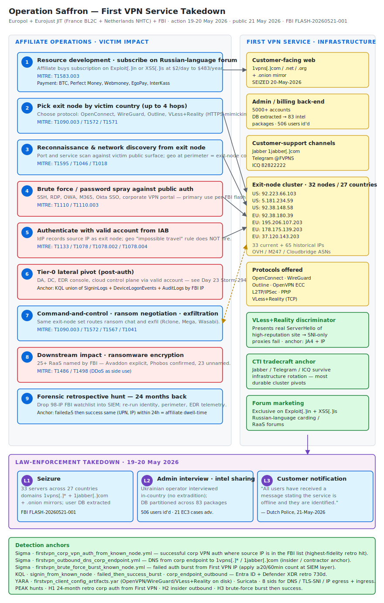

# Operation Saffron — First VPN Anonymization-as-a-Service Takedown by Europol, France, Netherlands and FBI

## TL;DR

On 19-20 May 2026, an 18-country law-enforcement operation led by France (BL2C) and the Netherlands (NHTC) under Europol's coordination dismantled **First VPN Service** (1vpns[.]com), a paid anonymization service marketed exclusively on Russian-speaking cybercrime forums and used by at least 25 ransomware groups (including Avaddon and Phobos) since 2014. Thirty-three servers across 27 countries were seized, the primary domains plus onion sites were taken offline, the Ukrainian administrator was interviewed in his home, and a database covering 5,000+ accounts was extracted; Europol then distributed 83 intelligence packages covering 506 specific users to participating jurisdictions. The case matters today because the FBI's same-day FLASH (FLASH-20260521-001) released a full IOC set — 65+ exit-node IPs, four domains, two Jabber accounts, one Telegram channel — that defenders can drop straight into detections to look backwards for adversary reconnaissance, brute force, scanning, ransomware C2 callbacks, and insider exfiltration that previously hid behind this infrastructure.

## Attribution and confidence

- **Cluster name (vendor):** First VPN Service (self-branded as `1vpns`); referred to as **"First VPN Service"** in the FBI FLASH.
- **Operator profile:** a single Ukrainian administrator interviewed in-country on the action day (Dutch Police and French Public Prosecutor statements). The service is **not** itself attributed to a nation-state, but is identified by Europol as appearing "in almost every major Europol-supported cybercrime investigation in recent years."
- **Vendors who discovered / disrupted:** Europol's EC3 + Eurojust JIT (established November 2023); France's Direction Regionale de la Police Judiciaire / Brigade de Lutte Contre la Cybercriminalite (BL2C); Dutch National Police National High Tech Crime Unit (NHTC); FBI; Bitdefender's Draco Team supported via Europol with intelligence packages. Investigation launched December 2021.
- **Confidence:** **high.** Multi-source corroboration (Europol release, Eurojust release, FBI FLASH PDF with full IOC tables, Dutch Police release, Bitdefender business-insights post). Indicators are direct seizure outputs, not vendor-inferred pivots.
- **Linked ransomware affiliates (per FBI FLASH):** Avaddon (named explicitly), 24 other groups (unnamed in the FLASH). Help Net Security separately confirmed Phobos RaaS investigations leveraged Saffron-derived intelligence.
- **Genealogy with previous repo cases:**
  - `days/2026-04-28_TheGentlemen-SystemBC/` and `days/2026-05-15_EtherRAT-TukTuk-Gentlemen/` — multiple ransomware operators in this repo (The Gentlemen, Embargo Day 22) plausibly used First VPN exit nodes for ransom-negotiation traffic and pre-encryption reconnaissance.
  - `days/2026-05-19_Embargo-Rust-SafeMode-BYOVD/` — on-chain attribution methodology of TRM Labs is the analog of off-chain attribution methodology of Operation Saffron. Both build durable cluster identity from operational metadata, not from technical fingerprints alone.
  - `days/2026-05-22_RedLamassu-JFMBackdoor-Showboat-Telecom/` — the X.509 fingerprint pivot is the technical-infrastructure analog; here Operation Saffron releases an IP+ASN pivot set that can be joined against the same telco/edge telemetry.

## Kill chain — summary table

| Stage | MITRE | Detail |
|---|---|---|
| Resource Development | T1583.003 | Operator stands up VPN nodes on bulletproof / loosely policed hosting in 27 countries (OVH ASN20473, M247, Hetzner-adjacent reseller IPs all present in FBI list); maintains self-hosted Jabber 1jabber[.]com + Telegram @FVPNS for customer support. |
| Resource Development (marketing) | T1583.003 | Service advertised exclusively on Russian-speaking cybercrime forums Exploit[.]in and XSS[.]is; tiered subscription $2/day-$483/year accepting BTC, Perfect Money, Webmoney, EgoPay, InterKass. |
| Initial Access (downstream affiliate) | T1133, T1078 | Ransomware affiliate authenticates to victim corporate VPN / RDP / Exchange / Okta SSO from a First VPN exit IP using valid credentials purchased from an IAB; identity providers see the geo as the exit-node country, not the affiliate's true location. |
| Reconnaissance (downstream affiliate) | T1046, T1018, T1595 | Scanning, port discovery, host enumeration originate from the affiliate's leased exit node; same IP cycles between many affiliates over its leasing window. |
| Credential Access (downstream affiliate) | T1110, T1110.003 | Password spraying and credential stuffing against SSH, RDP, OWA, M365 originating from First VPN exit nodes; observed by FBI as a primary use pattern. |
| Command and Control (downstream affiliate) | T1090.003, T1572, T1571 | Affiliate routes ransom-negotiation traffic and exfil to mixers/payment endpoints through First VPN; protocols include OpenConnect, WireGuard, Outline, VLess+Reality (HTTPS-mimicking), OpenVPN ECC, L2TP/IPSec, PPtP. |
| Exfiltration (downstream affiliate) | T1567, T1041 | Stolen data routed through the same exit IP set toward Mega / Wasabi / file-share endpoints (see Day 15 Rclone+Wasabi pattern, Day 22 Embargo). |
| Impact (downstream affiliate) | T1498 | First VPN exit nodes also documented by FBI as DDoS launch points and botnet C2 relays, in addition to ransomware-adjacent traffic. |
| Takedown (law-enforcement) | n/a | 33 servers seized across 27 countries; 1vpns[.]com / .net / .org + 1jabber[.]com + .onion domains seized; admin interviewed in Ukraine; user database extracted and partitioned across 83 intelligence packages naming 506 users. |



The diagram has three lanes: on the left, the **affiliate cybercrime operator** flowing top-down through subscription purchase, exit-node selection, reconnaissance, brute force, ransomware deployment, ransom negotiation, and exfiltration; in the middle, the **First VPN infrastructure** stack (web 1vpns[.]com → admin panel → 32 exit nodes in 27 countries → Jabber/Telegram support); on the right, the **victim corporate network** seen through the lens of Sigma/KQL/Suricata anchors that fire when affiliate traffic surfaces at the perimeter, identity provider, or RDP/SSH gateway. Detection anchors at the bottom of the diagram map each rule to a stage and a IOC anchor.

## Stage-by-stage detail

### Stage R1 — Resource development: standing up First VPN exit nodes (T1583.003)

The administrator leased 32 exit nodes across 27 countries (Australia, Austria, Belgium, Canada, Cyprus, Finland, France, Germany, Hong Kong, Italy, Latvia, Luxembourg, Moldova, Netherlands, Panama, Poland, Romania, Russia, Serbia, Singapore, Spain, Sweden, Switzerland, Turkey, Ukraine, UK, US — three US exit nodes called out by FBI):

```
US exit nodes (FBI FLASH-20260521-001):
  92.223.66.103
  5.181.234.59
  92.38.148.58

Full current-IP set (May 2026, FBI FLASH):
  92.38.180.39, 195.206.107.203, 178.175.139.203,
  37.120.143.203, 91.232.29.114, 86.105.25.219,
  134.255.210.160, 190.97.163.88, 193.106.31.98,
  82.146.50.52, 185.247.71.107, 51.79.208.134,
  92.38.162.4, 77.246.157.26, 54.37.200.68,
  185.253.98.243, 51.79.111.220, 188.92.78.242,
  51.75.34.158, 92.223.66.103, 46.105.79.45,
  92.38.186.86, 82.202.160.36, 92.38.148.58,
  193.239.86.19, 139.99.255.144, 91.193.5.91,
  5.181.234.59, 91.132.139.67, 95.213.164.12,
  89.38.224.3, 77.83.247.81, 152.89.162.139
```

ASN concentration is meaningful: many addresses are in **AS16276 OVH**, **AS9009 M247**, and **AS44066 Cloudbridge / AS204957 Servinga** — these are not unusual hosting ASNs in isolation, so the detection anchor must be the IP set, not the ASN. The historical-IP set (prior to May 2026) adds ~95 more addresses; defenders performing retroactive hunts must use both lists. Tag the FBI list with the date column (`current_2026-05` vs `historical_pre_2026-05`) so that false positives do not accrue against IPs that have been reassigned to legitimate services.

### Stage R2 — Resource development: forum marketing and pricing (T1583.003)

First VPN advertised only on `Exploit[.]in` and `XSS[.]is`, two Russian-language carding/RaaS forums. Subscription tiers ranged from **$2 for one day** to **$483 for one year**, with multi-hop nodes (up to four) available at higher tiers. Accepted payment rails: Bitcoin, Perfect Money, Webmoney, EgoPay, InterKass. Customer support via self-hosted Jabber server `1jabber[.]com` (admin account `1vpns@1jabber[.]com`), email `support@1vpns[.]com`, ICQ `82822222`, and Telegram channel `@FVPNS` (`https://t[.]me/FirstVPNService`). For CTI tradecraft purposes these communication-channel artifacts are the most durable indicators because they survive infrastructure rotation. Carding-forum operational identifiers like a stable Telegram handle are the kind of stitching that the JIT five-year investigation ultimately closed against the operator.

### Stage A1 — Affiliate authenticates to victim corporate (T1133, T1078)

A ransomware affiliate or IAB buys a one-day or weekly First VPN subscription, picks an exit node in the country whose business hours match the targeted victim, and authenticates to corporate VPN / Citrix / RDP gateway / M365 / Okta / Duo using valid credentials. The detection problem: from the identity-provider's perspective, the sign-in geo is the exit-node country (often US, UK, Germany), not the affiliate's true country. Standard "impossible travel" rules will **not** fire unless the same account also signs in from somewhere else in a short window. The correct anchor is **sign-ins from the FBI IOC IP list**, joined against high-privilege users and tier-0 access patterns.

```
Anchor query (Sentinel SigninLogs):
  SigninLogs
  | where IPAddress in (firstvpn_iocs)
  | where ResultType == "0"           // successful
  | project TimeGenerated, UserPrincipalName, IPAddress, AppDisplayName, Location
```

### Stage A2 — Affiliate reconnaissance and brute force (T1046, T1018, T1110, T1110.003)

FBI explicitly calls out scanning activity and password-spray/brute-force from First VPN IPs against SSH, RDP, OWA, public-facing M365 endpoints. This is the use-case that produces the largest detection signal — most large enterprises see hundreds of failed-auth events per day from the FBI list during the months prior to takedown. A retrospective hunt for **any successful auth preceded by ≥5 failed auths from the same First VPN IP in the prior 24 hours** is the highest-value backwards-looking signal. This is also the IR pivot: if an Akira / DragonForce / Embargo / Phobos engagement happened at your organization between 2024 and May 2026, search the perimeter logs for the FBI IP list to identify the affiliate's reconnaissance window and dwell-time anchor.

### Stage A3 — Affiliate C2 and ransom negotiation (T1090.003, T1572, T1571)

Affiliates route C2, ransom-negotiation chat traffic, and exfil through the same exit-node set. The protocol diversity is the operational interesting element: First VPN offered **VLess + Reality (TCP)**, a modern XTLS protocol designed to make outbound proxy traffic visually indistinguishable from a legitimate HTTPS connection to a high-reputation site. Reality presents the **real Server Hello** of a target site (e.g. apple.com), so SNI inspection alone will not identify the traffic; the proxy authenticates the client via a private key carried in modified handshake fields invisible to a passive prober. The reliable inbound detection anchors are therefore (a) **JA4 fingerprint of the client** (Reality emulates browsers but does not always match Chrome/Firefox JA4 exactly), and (b) **destination IP in the FBI list**.

### Stage L1 — Law-enforcement takedown (May 19-20 2026)

Coordinated action across 18 countries; 33 servers seized; 1vpns.com / 1vpns.net / 1vpns.org / 1jabber.com plus onion domains seized; Ukrainian admin interviewed in-country; database extracted; 83 intelligence packages naming 506 users distributed to participating jurisdictions; FBI FLASH released same day (FLASH-20260521-001). Twenty-one Europol-supported investigations advanced through the new intelligence.

## Detection strategy

### Telemetry that matters

- **Identity providers** — Microsoft Entra ID `SigninLogs`, Okta System Log (`okta-systemlog`), Duo Auth API. Inbound auth from First VPN IPs is the highest-yield signal.
- **Perimeter** — corporate VPN gateway syslog (Fortinet, Palo Alto GlobalProtect, Cisco AnyConnect / ASA, Pulse / Ivanti, Citrix NetScaler), RDP gateway logs, public SSH bastion logs.
- **Network sensors** — Zeek `conn.log`, `ssl.log`, `dns.log`; Suricata with TLS metadata; JA4/JA4S/JA4X collection if available (FoxIO ja4 framework).
- **EDR** — Defender XDR `DeviceNetworkEvents`, `DeviceLogonEvents`; CrowdStrike `NetworkAccept` / `NetworkConnect`.
- **Cloud audit** — AWS CloudTrail `sourceIPAddress`, Azure `AzureActivity` `CallerIpAddress`, GCP Cloud Audit Logs `requestMetadata.callerIp`.
- **Email** — `EmailEvents` for `SenderIPv4` matching the list.
- **Outbound DNS** — queries to `1vpns.com`, `1vpns.net`, `1vpns.org`, `1jabber.com` from corporate endpoints (insider risk indicator).

### Detection coverage

| Engine | File | Logic |
|---|---|---|
| Sigma | [`sigma/firstvpn_corp_vpn_auth_from_known_node.yml`](./sigma/firstvpn_corp_vpn_auth_from_known_node.yml) | Successful corporate VPN auth where source IP is in the First VPN current-IP list — fires on the high-fidelity post-takedown retro-hunt. |
| Sigma | [`sigma/firstvpn_outbound_dns_corp_endpoint.yml`](./sigma/firstvpn_outbound_dns_corp_endpoint.yml) | DNS query from a corporate endpoint to 1vpns.* or 1jabber.com — insider / contractor connecting to the service from corporate infrastructure. |
| Sigma | [`sigma/firstvpn_brute_force_burst_known_node.yml`](./sigma/firstvpn_brute_force_burst_known_node.yml) | More than 20 failed RDP/SSH/web auths from a single First VPN IP inside one hour — affiliate password spray. |
| KQL | [`kql/firstvpn_signin_from_known_node.kql`](./kql/firstvpn_signin_from_known_node.kql) | Entra ID successful sign-in from FBI IP list, projecting user, app, country, conditional-access result. |
| KQL | [`kql/firstvpn_failed_then_success_burst.kql`](./kql/firstvpn_failed_then_success_burst.kql) | Same UPN with ≥5 SigninLogs failures followed by a success from a First VPN IP inside 24h — affiliate brute-force-then-pivot. |
| KQL | [`kql/firstvpn_corp_endpoint_outbound.kql`](./kql/firstvpn_corp_endpoint_outbound.kql) | `DeviceNetworkEvents` outbound connection from a managed endpoint to a First VPN IP — possible insider exfil or compromised host using the service for C2. |
| YARA | [`yara/firstvpn_client_config_artifacts.yar`](./yara/firstvpn_client_config_artifacts.yar) | First VPN client config and OpenVPN profile artifacts on endpoint disk (downloaded config strings include `1vpns.com`, `1jabber.com`, the unique support UID and the VLess parameters). |
| Suricata | [`suricata/firstvpn_dns_tls_egress.rules`](./suricata/firstvpn_dns_tls_egress.rules) | DNS, TLS SNI, HTTP host, and IP egress to First VPN domains and exit nodes — eight sids covering web, admin, Jabber, Telegram, and the IP set. |

### Threat hunting hypotheses

- **H1** — *In the 12 months prior to takedown, did any of our successful tier-0 corporate auths originate from a First VPN exit IP?* See [`hunts/peak_h1_corp_auth_from_firstvpn.md`](./hunts/peak_h1_corp_auth_from_firstvpn.md).
- **H2** — *Did any managed endpoint resolve or connect to 1vpns.com / 1jabber.com — i.e., is there an insider, contractor, or compromised user attempting to use the service from inside?* See [`hunts/peak_h2_insider_outbound_to_firstvpn.md`](./hunts/peak_h2_insider_outbound_to_firstvpn.md).
- **H3** — *Did we see brute-force burst then success from a First VPN IP that should now be retroactively classified as an affiliate dwell-time anchor for downstream ransomware?* See [`hunts/peak_h3_bruteforce_burst_then_success.md`](./hunts/peak_h3_bruteforce_burst_then_success.md).

## Incident response playbook

### First 60 minutes (triage)

1. Drop the FBI FLASH IP list (current + historical, ~98 IPs) into your SIEM as a watchlist named `firstvpn_iocs_2026_05`. Tag each entry with `category=current` or `category=historical_pre_2026_05` and `source=FBI_FLASH-20260521-001`.
2. Re-run the watchlist against the last **24 months** of identity provider logs, VPN gateway logs, and perimeter NetFlow / Zeek `conn.log`. The window matters because ransomware affiliates that authenticated to your environment any time since 2024 may surface here for the first time.
3. For every successful auth from a First VPN IP, raise a ticket and check whether the same account had a subsequent privilege escalation, lateral movement, or data egress event. If yes, treat as confirmed compromise and follow your ransomware IR runbook.
4. Block the current-IP list at the perimeter and at the identity-provider Conditional Access layer (Entra ID named-location, Okta network zone). Do **not** block the historical-IP list at the perimeter without review (assigned to legitimate services post-rotation).
5. Notify legal / counsel if any FBI-listed IP appears in 24-month logs against a user who has since left the company or has any insider risk flag — Europol's 506-user list will eventually be shared with national LE and may include former employees or contractors.

### Artifacts to collect

| Artifact | Path / source | Tool | Why it matters |
|---|---|---|---|
| Entra ID sign-in logs | `SigninLogs` (Sentinel) or `Get-MgAuditLogSignIn` | KQL / Graph API | Sees all M365 + federated app auth from FBI IPs. |
| Okta System Log | `eventType eq "user.authentication.sso"` filtered by `client.ipAddress` | Okta API | Same for Okta-federated SSO. |
| VPN gateway auth log | Fortinet `event=login`, Palo Alto GlobalProtect `globalprotect-portal-auth-success`, Cisco AnyConnect `%ASA-6-722022` | syslog / SIEM | Confirms which user account, which time, which client OS. |
| Public-facing SSH bastion log | `/var/log/auth.log`, `journalctl -u sshd` | grep / SIEM | Brute force from FBI IPs; record `sshd[xxx]: Failed password for invalid user X from <IP>`. |
| Zeek `conn.log` and `ssl.log` | Zeek logs for the perimeter | `zeek-cut`, Splunk-equivalent in KQL | Identifies destination IPs in FBI list outbound (insider) and inbound. |
| EDR network events | Defender XDR `DeviceNetworkEvents`, CrowdStrike `NetworkConnect` | KQL / FQL | Pivot from IP to host, user, parent process. |
| Web proxy log | corporate web proxy access log | grep / SIEM | DNS query and HTTP host = 1vpns.* from internal corp endpoints. |

### IR queries and commands

```powershell
# PowerShell — list M365 sign-ins from First VPN IPs in last 90 days
Connect-MgGraph -Scopes "AuditLog.Read.All"
$IPs = Get-Content .\firstvpn_iocs.txt
Get-MgAuditLogSignIn -Filter "createdDateTime ge $((Get-Date).AddDays(-90).ToString('o'))" -All `
  | Where-Object { $IPs -contains $_.IpAddress } `
  | Select-Object createdDateTime, userPrincipalName, ipAddress, appDisplayName, status `
  | Export-Csv .\firstvpn_signins_90d.csv -NoTypeInformation
```

```bash
# Bash — grep last 24 months of bastion auth.log for FBI IPs (assumes log archival)
IPS=$(paste -sd'|' firstvpn_iocs.txt)
for f in /var/log/archive/auth.log*; do
  zgrep -E "Failed password|Accepted (password|publickey)" "$f" \
    | grep -E "($IPS)" >> firstvpn_bastion_hits.txt
done
sort -u firstvpn_bastion_hits.txt | wc -l
```

```kql
// KQL — pivot all hits across multiple tables
let firstvpn_iocs = datatable(ip:string)[
  "92.223.66.103","5.181.234.59","92.38.148.58","92.38.180.39",
  "195.206.107.203","178.175.139.203","37.120.143.203","91.232.29.114",
  "86.105.25.219","134.255.210.160","190.97.163.88","193.106.31.98",
  "82.146.50.52","185.247.71.107","51.79.208.134","92.38.162.4",
  "77.246.157.26","54.37.200.68","185.253.98.243","51.79.111.220",
  "188.92.78.242","51.75.34.158","46.105.79.45","92.38.186.86",
  "82.202.160.36","193.239.86.19","139.99.255.144","91.193.5.91",
  "91.132.139.67","95.213.164.12","89.38.224.3","77.83.247.81",
  "152.89.162.139"];
union
  (SigninLogs | where IpAddress in (firstvpn_iocs) | project T=TimeGenerated, Source="SigninLogs", User=UserPrincipalName, Ip=IpAddress, App=AppDisplayName),
  (DeviceNetworkEvents | where RemoteIP in (firstvpn_iocs) | project T=TimeGenerated, Source="DeviceNetworkEvents", User=InitiatingProcessAccountName, Ip=RemoteIP, App=InitiatingProcessFileName),
  (DeviceLogonEvents | where RemoteIP in (firstvpn_iocs) | project T=TimeGenerated, Source="DeviceLogonEvents", User=AccountName, Ip=RemoteIP, App=ActionType)
| order by T desc
```

### Containment, eradication, recovery

- **Containment:** block the current-IP list at perimeter + Conditional Access named-location. For each user whose account authenticated successfully from a First VPN IP in the last 24 months, force password reset + MFA re-registration + revoke all refresh tokens (`Revoke-MgUserSignInSession`). If the user is privileged, treat as full identity compromise (revoke certificates, rotate any service-principal secrets they own, check for OAuth consent grants — see Day 23 Storm-2949 SSPR playbook).
- **Eradication:** for any host that initiated an outbound connection to a First VPN IP, treat as forensic image candidate (insider risk or compromise); preserve `prefetch`, `amcache`, registry hives, browser history, and disk image before reboot.
- **Recovery:** validate that the perimeter block is in effect and that no Conditional Access exemption (`device.isCompliant` exception, named-location whitelist) inadvertently re-allows traffic.
- **What NOT to do:** do **not** rely on geolocation alone to assess severity — the exit-node country is meaningless. Do **not** treat the historical-IP list the same as the current-IP list at the firewall (collateral risk against re-assigned legitimate services). Do **not** silently delete the watchlist after 30 days — keep it for the lifecycle of any open IR.

### Recovery validation

- Confirm no Conditional Access rule exempts the named-location for the First VPN IPs.
- Run the multi-table KQL above for the last 7 days post-mitigation and assert zero hits.
- For every privileged user identified in the IR review, confirm the post-rotation token issuance time is after the user's last attested First VPN auth event.
- For any host imaged in eradication, confirm reimage is complete and the host is restored with a new hostname before re-joining the domain.

## IOCs

| Type | Value | Context | Confidence | Source |
|---|---|---|---|---|
| domain | 1vpns[.]com | First VPN main website (seized) | high | FBI FLASH-20260521-001 |
| domain | 1vpns[.]net | First VPN secondary domain (seized) | high | FBI FLASH-20260521-001 |
| domain | 1vpns[.]org | First VPN tertiary domain (seized) | high | FBI FLASH-20260521-001 |
| domain | 1jabber[.]com | Self-hosted Jabber server for customer support (seized) | high | FBI FLASH-20260521-001 |
| email | support@1vpns[.]com | Customer support email and Jabber account | high | FBI FLASH-20260521-001 |
| string | 1vpns@1jabber[.]com | Administrator Jabber account | high | FBI FLASH-20260521-001 |
| string | @FVPNS | Telegram channel handle | high | FBI FLASH-20260521-001 |
| url | https://t[.]me/FirstVPNService | Telegram channel URL | high | FBI FLASH-20260521-001 |
| string | 82822222 | ICQ contact ID | high | FBI FLASH-20260521-001 |
| ipv4 | 92.223.66.103 | US exit node | high | FBI FLASH-20260521-001 |
| ipv4 | 5.181.234.59 | US exit node | high | FBI FLASH-20260521-001 |
| ipv4 | 92.38.148.58 | US exit node | high | FBI FLASH-20260521-001 |
| ipv4 | 92.38.180.39 | Current exit node (May 2026) | high | FBI FLASH-20260521-001 |
| ipv4 | 195.206.107.203 | Current exit node | high | FBI FLASH-20260521-001 |
| ipv4 | 178.175.139.203 | Current exit node | high | FBI FLASH-20260521-001 |
| ipv4 | 37.120.143.203 | Current exit node | high | FBI FLASH-20260521-001 |
| ipv4 | 91.232.29.114 | Current exit node | high | FBI FLASH-20260521-001 |
| note | Forum marketing: `Exploit[.]in` and `XSS[.]is` Russian-language carding/RaaS forums; subscription priced $2/day to $483/year via Bitcoin, Perfect Money, Webmoney, EgoPay, InterKass | n/a | high | FBI FLASH + Europol release |

Full IOC list (98 IPs + four domains + ten communication-channel anchors) in [`iocs.csv`](./iocs.csv).

## Secondary findings

- **GitHub corporate breach + Grafana Labs codebase exfil traced to the TanStack / Nx Console supply-chain compromise** (Help Net Security 2026-05-21). The same TeamPCP / UNC6780 cluster covered as the primary case on Day 24 is now confirmed by GitHub Security as having reached **3,800 internal GitHub repositories** during the campaign window. This is the second public victim of TeamPCP's CI/CD secret-jar primitive (after the codebase-steal incident reported by Grafana Labs on 16-may-2026). Reinforces the Day 24 lesson: any tag/version pin without a full SHA is operationally unsafe.
- **Cisco Catalyst SD-WAN Controller auth bypass CVE-2026-20182 (CVSS 10.0) actively exploited in the wild** to gain admin access; CISA confirmed KEV addition on 14-may-2026 and ThreatsDay coverage on 22-may. The bug overlaps the UAT-8616 case in this repo (`days/2026-05-16_Cisco-SDWAN-vHub-AuthBypass-UAT8616/`); active exploitation now confirmed and the existing detection content remains valid — promote the YARA + Suricata anchors to the top of the SOC's tier-0 watch list this week.
- **Fragnesia Linux kernel LPE via page cache corruption** (The Hacker News 2026-05-22). New local privilege escalation primitive granting root via page cache corruption — relevant to any CI/CD Linux runner that executes untrusted dependency code (intersects directly with Day 24 TeamPCP `/proc/<PID>/mem` secret-jar primitive). Track for KEV addition and pre-patch detection content. Indicator name "Fragnesia" tracked across THN top-stories list this week; no vendor advisory yet identified.

## Pedagogical anchors

- **Bulletproof anonymization is the connective tissue of the ransomware economy.** When law enforcement takes down a service like First VPN, every affiliate that relied on it loses operational cover at the same time, and many will make mistakes during the migration to the next service. The detection opportunity is widest in the 30-90 days after the takedown.
- **An IOC dump from a multi-year LE operation is the single best CTI input you will receive this quarter.** Re-run the IOC list against 24 months of logs, not 90 days. Affiliates may have authenticated to your environment in 2024 through an exit node that is now publicly named.
- **Identity provider geolocation is not a detection.** Exit-node country obscures the affiliate's true country; the anchor is the IP set, not the geo.
- **VLess + Reality is the new operationally important obfuscation pattern.** Reality presents a high-reputation site's real Server Hello, so SNI-only proxies cannot identify it; defense moves to JA4 + destination IP + behavioral anomaly.
- **The communication-channel artifacts (Jabber, Telegram, ICQ) survive infrastructure rotation.** They are the most durable CTI pivots for cluster tracking — Europol's five-year JIT closed on operator identification by stitching forum operational identifiers across investigations, not by chasing rotating IPs.

## What's in this folder

| File | Purpose |
|---|---|
| [`README.md`](./README.md) | This write-up. |
| [`kill_chain.svg`](./kill_chain.svg) | Three-lane diagram (affiliate → First VPN infrastructure → victim corp), with stage badges, MITRE IDs, IOC anchors, and detection-anchor footer. |
| [`sigma/firstvpn_corp_vpn_auth_from_known_node.yml`](./sigma/firstvpn_corp_vpn_auth_from_known_node.yml) | Sigma: successful corporate VPN auth from First VPN IP. |
| [`sigma/firstvpn_outbound_dns_corp_endpoint.yml`](./sigma/firstvpn_outbound_dns_corp_endpoint.yml) | Sigma: DNS query from corp endpoint to 1vpns.* or 1jabber.com. |
| [`sigma/firstvpn_brute_force_burst_known_node.yml`](./sigma/firstvpn_brute_force_burst_known_node.yml) | Sigma: brute-force burst from First VPN IP. |
| [`kql/firstvpn_signin_from_known_node.kql`](./kql/firstvpn_signin_from_known_node.kql) | KQL: Entra ID successful sign-in from FBI IP list. |
| [`kql/firstvpn_failed_then_success_burst.kql`](./kql/firstvpn_failed_then_success_burst.kql) | KQL: failed-then-success burst from First VPN IP. |
| [`kql/firstvpn_corp_endpoint_outbound.kql`](./kql/firstvpn_corp_endpoint_outbound.kql) | KQL: corp endpoint outbound to First VPN IPs. |
| [`yara/firstvpn_client_config_artifacts.yar`](./yara/firstvpn_client_config_artifacts.yar) | YARA: First VPN client config / OpenVPN profile artifacts on disk. |
| [`suricata/firstvpn_dns_tls_egress.rules`](./suricata/firstvpn_dns_tls_egress.rules) | Suricata: DNS / TLS SNI / HTTP host / IP egress to First VPN infrastructure. |
| [`hunts/peak_h1_corp_auth_from_firstvpn.md`](./hunts/peak_h1_corp_auth_from_firstvpn.md) | PEAK H1: 24-month retro hunt for corp auth from First VPN. |
| [`hunts/peak_h2_insider_outbound_to_firstvpn.md`](./hunts/peak_h2_insider_outbound_to_firstvpn.md) | PEAK H2: insider / contractor connecting to First VPN from inside. |
| [`hunts/peak_h3_bruteforce_burst_then_success.md`](./hunts/peak_h3_bruteforce_burst_then_success.md) | PEAK H3: brute-force burst then success — affiliate dwell-time anchor. |
| [`iocs.csv`](./iocs.csv) | Full IOC set: 98 IPs, four domains, ten communication-channel anchors, two forum marketing strings. |

## Sources

- [Europol — Cybercriminal VPN used by ransomware actors dismantled in global crackdown (21-May-2026)](https://www.europol.europa.eu/media-press/newsroom/news/cybercriminal-vpn-used-ransomware-actors-dismantled-in-global-crackdown)
- [FBI IC3 FLASH-20260521-001 — "First VPN Service" Used by Ransomware Actors to Compromise Systems (PDF)](https://www.ic3.gov/CSA/2026/260521.pdf)
- [Eurojust — Eurojust-coordinated investigation shuts down criminal VPN network](https://www.eurojust.europa.eu/news/eurojust-coordinated-investigation-shuts-down-criminal-vpn-network)
- [Bitdefender Business Insights — Operation Saffron: Bitdefender Joins First VPN Takedown (21-May-2026)](https://www.bitdefender.com/en-us/blog/businessinsights/operation-saffron-bitdefender-joins-first-vpn-takedown)
- [The Hacker News — First VPN Dismantled in Global Takedown Over Use by 25 Ransomware Groups (22-May-2026)](https://thehackernews.com/2026/05/first-vpn-dismantled-in-global-takedown.html)
- [Help Net Security — Authorities dismantle First VPN, used by ransomware actors (21-May-2026)](https://www.helpnetsecurity.com/2026/05/21/operation-saffron-first-vpn-takedown/)
- [Dutch Police — First VPN: criminal VPN service taken offline (21-May-2026)](https://www.politie.nl/en/news/2026/mei/21/first-vpn-criminal-vpn-service-taken-offline.html)
- [Tom's Hardware — Europol's Operation Saffron takes down First VPN service over ransomware attacks (21-May-2026)](https://www.tomshardware.com/tech-industry/cyber-security/europols-operation-saffron-takes-down-first-vpn-service-over-ransomware-attacks-33-servers-and-multiple-domains-seized)
- [XTLS/Xray-examples — VLESS + TCP + REALITY protocol reference (DeepWiki)](https://deepwiki.com/XTLS/Xray-examples/2.3-vless-+-tcp-+-reality)
- [FoxIO — JA4+ network fingerprinting suite (GitHub)](https://github.com/FoxIO-LLC/ja4)
