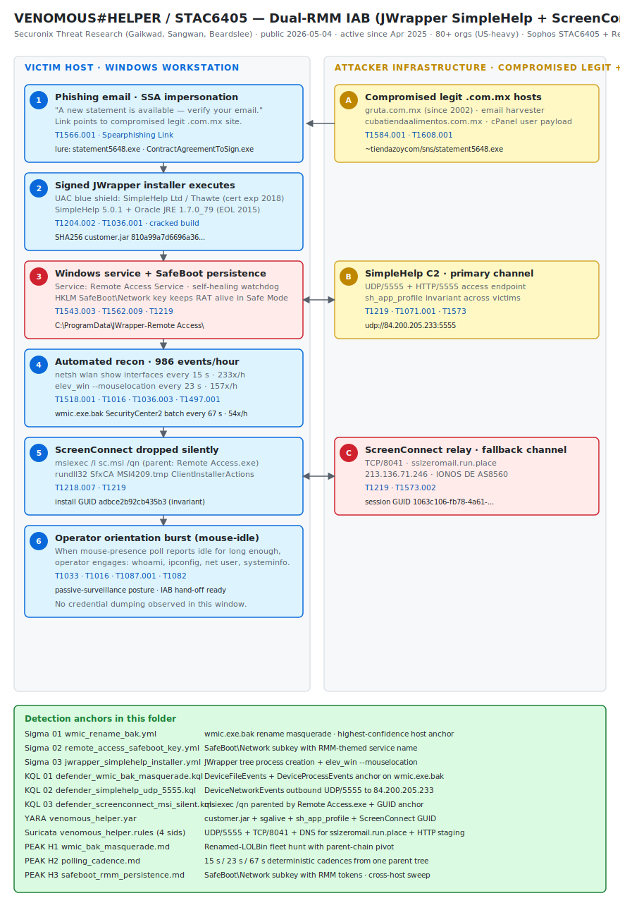

# VENOMOUS#HELPER / STAC6405 — Dual-RMM JWrapper-Packaged SimpleHelp + ScreenConnect IAB Operation

## TL;DR

Securonix Threat Research, on the back of earlier independent tracking by Red Canary and Sophos (cluster STAC6405), documented a financially motivated phishing campaign — codenamed **VENOMOUS#HELPER** — that has compromised **80+ organisations, mostly in the United States**, since at least **April 2025**. The lure impersonates the U.S. Social Security Administration; the click chain runs through two unrelated compromised legitimate Mexican business hosts (`gruta.com.mx` for email harvesting, `cubatiendaalimentos.com.mx/~tiendazoycom/sns/` for payload staging on a cPanel user account) and delivers a JWrapper-packaged SimpleHelp 5.0.1 binary signed by **SimpleHelp Ltd / Thawte**. The signed-publisher prompt collapses the only user-interaction step in the chain. Post-install the implant registers a Windows service named **Remote Access Service**, plants a **SafeBoot\\Network** key, runs a self-healing watchdog, polls security products via WMI `root\\SecurityCenter2` every 67 s using a renamed **`wmic.exe.bak`**, polls user presence via mouse position every 23 s, and drops a second independent RMM channel (**ConnectWise ScreenConnect**, TCP 8041 relay to `sslzeromail.run.place` / 213.136.71.246) so that takedown of either channel does not evict the operator. Securonix assesses the activity as **Initial Access Broker (IAB) or ransomware-precursor** — no specific affiliate attribution. Public disclosure: Securonix blog and The Hacker News, 2026-05-04; further corroboration through Infosecurity Magazine, Dark Reading and TechNadu through 2026-05-19. The case matters today because it is the cleanest published 2026 example of dual-RMM IAB tradecraft, the wmic-rename-as-LOLBin primitive, and the Safe Mode persistence pattern used by ransomware affiliates that buy access from operators like this.

## Attribution and confidence

**Cluster name (vendor + aliases):**

- **VENOMOUS#HELPER** — Securonix Threat Research (Akshay Gaikwad, Shikha Sangwan, Aaron Beardslee), blog 2026-05-04.
- **STAC6405** — Sophos X-Ops, prior independent tracking (Securonix explicitly maps to this cluster).
- **Unnamed RMM phishing cluster** — Red Canary Intelligence + Zscaler, prior independent tracking (Securonix cross-references Red Canary's "phishing-rmm-tools" research; Red Canary observed ITarian, PDQ, SimpleHelp and Atera variants).

**Vendor discovery + date:** Securonix blog `VENOMOUS#HELPER: Dual-RMM Phishing Campaign Leveraging JWrapper-Packaged SimpleHelp and ScreenConnect for Silent Remote Access`, 2026-05-04 (The Hacker News rerun same day). Campaign activity ongoing since April 2025; Securonix observation window included a one-hour controlled dynamic-analysis capture that yielded 986 process-creation events without operator interaction.

**Confidence:** **high** that this is one operator running a dual-RMM IAB workflow (single tenant `sh_app_profile` plus single ScreenConnect install GUID shared across victims); **medium** for the alignment with Sophos STAC6405 (Securonix asserts shared cluster but does not publish overlap hashes); **low** for affiliation with any specific ransomware family — Securonix is explicit that no affiliate has been named.

**Justification:** the cracked **SimpleHelp 5.0.1 build (compiled 2017-07-07, Thawte cert expired 2018)** combined with the consistent campaign tenant ID and the single ScreenConnect install GUID (`adbce2b92cb435b3`) anchor the cluster cleanly. The IAB-vs-precursor framing is Securonix's own and is based on the passive-surveillance posture observed: long-running idle automation with operator engagement only after the victim's mouse stops moving.

**Cluster overlap:**

| Vendor name | Sponsor | Notes |
|---|---|---|
| VENOMOUS#HELPER | Securonix | Primary published cluster; 80+ orgs |
| STAC6405 | Sophos X-Ops | Earlier cluster; Securonix asserts overlap |
| Unnamed RMM-phishing cluster | Red Canary + Zscaler | Multi-RMM tracking incl. SimpleHelp |
| (No named ransomware affiliate) | — | Securonix declines attribution |

**Repo genealogy:** continues the dual-RMM and signed-RMM-abuse track. Day 22 (`2026-05-19_Embargo-Rust-SafeMode-BYOVD`) introduced **Safe Mode boot** (T1562.009) as a first-class evasion in the repo; today's case is the second SafeBoot-Network-keyed persistence — but here applied to **persisting an RMM, not to disabling EDR**. Day 6 (`2026-04-30_FIRESTARTER_LINEVIPER_UAT4356_ArcaneDoor` — referenced via repo INDEX) catalogued LOLBin abuse in edge appliances; today's case extends the LOLBin catalogue with the **`wmic.exe.bak` rename masquerade** (T1036.003) as a fresh primitive. Day 18 (`2026-05-15_EtherRAT-TukTuk-Gentlemen`) and Day 19 (`2026-05-16_Cisco-SDWAN-vHub-AuthBypass-UAT8616`) covered signed-binary abuse from a different angle; today's case anchors the repo's first dedicated **signed-RMM-as-IAB** case.

## Kill chain — summary table

| Stage | MITRE | Detail |
|---|---|---|
| Reconnaissance / Resource Development | T1584.001 · T1608.001 | Two compromised legit `.com.mx` sites: `gruta.com.mx` (Index Datacom, since 2002) for email harvest; `cubatiendaalimentos.com.mx` (single cPanel user account) for binary staging. |
| Initial Access | T1566.001 | SSA-themed phishing email; link → harvest landing → second host → `statement5648.exe` (`ContractAgreementToSign.exe` variant observed). |
| Execution | T1204.002 · T1036.001 | JWrapper-packaged PE, valid Authenticode signature from **SimpleHelp Ltd / Thawte** (cert expired 2018 — cracked build). UAC prompt shows blue "Verified publisher" shield. |
| Persistence | T1543.003 · T1562.009 | Windows service `Remote Access Service` + `HKLM\SYSTEM\CurrentControlSet\Control\SafeBoot\Network\Remote Access Service` (Safe Mode with Networking). Self-healing watchdog via `sgalive` liveness file. |
| Privilege Escalation | T1134.001 · T1134.002 · T1548.002 | `session_win.exe` grabs `SeDebugPrivilege`, steals `winlogon.exe` token, `CreateProcessAsUserW`. `elev_win.exe --runas` for UAC silent elevation. |
| Defense Evasion | T1036.003 · T1027 · T1497.001 | Rename `wmic.exe` to `wmic.exe.bak` under `C:\Windows\System32\wbem\`; hex-encoded JWrapper config; mouse-presence sandbox-evasion poll. |
| Discovery | T1518.001 · T1016 · T1033 · T1082 · T1087.001 | WMI `SecurityCenter2` AntiVirus/AntiSpyware/Firewall enumeration every 67 s as 4-query synchronized batch; `netsh wlan show interfaces` every 15 s; orientation burst of `whoami` / `ipconfig` / `net user` / `systeminfo` once user-idle. |
| Command & Control | T1219 · T1071.001 · T1573 | Primary: `udp://84.200.205.233:5555` (SimpleHelp SimpleGateway). Fallback: `relay://sslzeromail.run.place:8041` → `213.136.71.246` (IONOS DE AS8560). |
| Fallback channel install | T1218.007 · T1219 | `msiexec.exe /i sc.msi /qn` parented by `Remote Access.exe`; ScreenConnect installer DLL `MSI4209.tmp` invoked via `rundll32`. |



The diagram is split into two lanes. The left lane traces the victim host from SSA-themed phishing through the JWrapper-signed installer, the Windows service plus SafeBoot persistence (red — critical), the automated reconnaissance loops, the ScreenConnect MSI drop, and the operator-orientation burst that fires only once the mouse has been idle. The right lane traces attacker-side infrastructure: the two compromised `.com.mx` hosts at the top, the SimpleHelp UDP/5555 control channel paired with the persistence stage, and the ScreenConnect TCP/8041 relay (red — critical) paired with the MSI drop. Detection anchors are summarised in the footer.

## Stage-by-stage detail

### 1. Reconnaissance / Resource Development — two compromised legit `.com.mx` hosts

The operator compromises two unrelated legitimate Mexican business websites: **`gruta.com.mx`** (Index Datacom S.A. de C.V., domain registered in 2002 — long reputation) hosts the SSA-themed "verify your email" harvesting frontend; **`cubatiendaalimentos.com.mx`** (a Cuban food retailer site registered in February 2024) is compromised at the cPanel-user level — the tilde-prefixed path `~tiendazoycom/sns/` is the cPanel-user-account artifact, indicating the legitimate site front page is unmodified and only a single hosting tenant has been hijacked. The two hosts are not co-located and there is no shared CDN or hosting provider; the operator stages email reputation on the older site and binary delivery on the newer one. ATT&CK: **T1584.001 Compromise Infrastructure: Domains**, **T1608.001 Stage Capabilities: Upload Malware**.

```
gruta.com.mx                                  → SSA-themed verify-email landing
server.cubatiendaalimentos.com.mx/~tiendazoycom/sns/statement5648.exe
                                              → signed JWrapper installer
```

### 2. Initial Access — SSA-themed phishing

Email impersonates the U.S. Social Security Administration with a "new statement is available — verify your email to download" body. The recipient submits an email address on the `gruta.com.mx` form (the harvesting step) and is redirected to download `statement5648.exe` (variants: `ContractAgreementToSign.exe`). Windows hides `.exe` by default, so the user sees `statement5648`; JWrapper bakes a custom document-style icon and a splash image to reinforce the deception. ATT&CK: **T1566.001 Phishing: Spearphishing Link**.

### 3. Execution — JWrapper-packaged signed SimpleHelp 5.0.1

The PE is a JWrapper bundle — a private Oracle JRE 1.7.0_79 (Java EOL 2015) plus a SimpleHelp 5.0.1 build compiled 2017-07-07. The Authenticode signature is **valid**: signer `SimpleHelp Ltd`, issuer Thawte. The certificate's validity window is 2015-2018, so the signing certificate **has expired** — operationally this is a cracked or leaked SimpleHelp build and the operator pays no licensing nor leaves a vendor paper trail. The UAC prompt presents the blue "Verified publisher" shield, which is the entire user-interaction step in the chain. ATT&CK: **T1204.002 User Execution: Malicious File**, **T1036.001 Masquerading: Invalid Code Signature** (interpretation: signature is valid but the cert is expired and the build is cracked — operationally a masquerade).

```
PE: statement5648.exe (JWrapper bundle)
Signer:  SimpleHelp Ltd
Issuer:  Thawte (cert validity 2015-2018, expired)
Bundled: SimpleHelp 5.0.1 (compiled 2017-07-07)
Bundled: Oracle JRE 1.7.0_79 (EOL 2015)
```

### 4. Persistence — Windows service + SafeBoot key + self-healing watchdog

The installer unpacks under `C:\ProgramData\JWrapper-Remote Access\` and registers via SCM:

```
Service name: Remote Access Service
Image path:   C:\ProgramData\JWrapper-Remote Access\JWAppsSharedConfig\SimpleService.exe (config.xml)
```

Plants a Safe Mode persistence key so the service survives a Safe Mode with Networking reboot — the same primitive used by ransomware to disable EDR (Day 22 Embargo) but here used in reverse, to keep the implant alive even when defenders boot into Safe Mode for cleanup:

```
HKLM\SYSTEM\CurrentControlSet\Control\SafeBoot\Network\Remote Access Service
```

`SimpleService.exe` watches `C:\ProgramData\JWrapper-Remote Access\JWAppsSharedConfig\sgalive`. If the timestamp on that file stops advancing (operator interpretation: the RAT stopped), it restarts the service. `serviceconfig.xml` carries `AllowRecovery=true`, so the operator can also force-restart from the console. No scheduled task, no Run/RunOnce, no WMI subscription — persistence is purely service + SafeBoot key + watchdog file. ATT&CK: **T1543.003 Create or Modify System Process: Windows Service**, **T1562.009 Impair Defenses: Safe Mode Boot**.

### 5. Privilege Escalation — token theft from winlogon + UAC silent elevation

`session_win.exe` opens its own token, calls `AdjustTokenPrivileges` to enable `SeDebugPrivilege`, enumerates processes via `CreateToolhelp32Snapshot`, locates `winlogon.exe`, calls `OpenProcessToken` + `DuplicateTokenEx` to acquire an impersonation token, then `CreateEnvironmentBlock` + `CreateProcessAsUserW` to spawn a process in the user's interactive desktop with SYSTEM rights. In parallel, `elev_win.exe` performs UAC silent elevation via `ShellExecuteEx` with the `runas` verb (Vista+) or `CreateProcessWithLogonW` (XP fallback). Two switches matter for hunting: `--mouselocation` (used by the surveillance loop, not for elevation) and `--amiadministrator`. ATT&CK: **T1134.001 Access Token Manipulation: Token Impersonation/Theft**, **T1134.002 Create Process with Token**, **T1548.002 Bypass UAC**.

### 6. Defense Evasion — `wmic.exe.bak` rename masquerade

Each SecurityCenter2 WMI query is fired twice — once via the canonical `wmic.exe`, and once via `cmd.exe /c wmic.exe.bak ...` where `wmic.exe.bak` is a renamed copy of WMIC under `C:\Windows\System32\wbem\`. The duplicate execution defeats EDR rules that filter by exact image name. Securonix labels the presence of `wmic.exe.bak` the single highest-confidence static host IOC of this cluster. ATT&CK: **T1036.003 Masquerading: Rename System Utilities**.

```
C:\Windows\System32\wbem\wmic.exe       → original
C:\Windows\System32\wbem\wmic.exe.bak   → renamed copy, equally functional
```

The C2 server address is hex-encoded inside JWrapper's launch properties (`sg_servers=udp://84.200.205[.]233:5555`), which evades static-string scanning over the installer. ATT&CK: **T1027 Obfuscated Files or Information**.

### 7. Discovery — three synchronized polling loops, 986 events/hour

Securonix's one-hour dynamic analysis captured three concurrent automated loops, all generated with no operator interaction (Sysmon Event ID 1):

| Loop | Cadence | Per-hour | Command |
|---|---|---|---|
| WiFi interface state | 15 s | 233× | `netsh wlan show interfaces` |
| User presence (mouse polling) | 23 s | 157× | `elev_win.exe --mouselocation` |
| Security product enumeration (4 WMI queries, 1 netsh) — synchronised batch | 67 s | 54× each | `wmic SecurityCenter2 PATH AntiVirusProduct get` + `AntiSpywareProduct` + `FirewallProduct` + `netsh advfirewall show all State` |

The equal counts (54× each) across the four security queries confirm a single timer firing the batch — a defining signature of automation rather than hands-on-keyboard. Once the mouse stops moving for long enough, an **orientation burst** appears: `whoami`, `ipconfig`, `net user`, `systeminfo` in rapid succession. ATT&CK: **T1518.001 Software Discovery: Security Software Discovery**, **T1016 System Network Configuration Discovery**, **T1033 System Owner/User Discovery**, **T1082 System Information Discovery**, **T1087.001 Account Discovery: Local Account**, **T1497.001 Virtualization/Sandbox Evasion: System Checks**.

### 8. Command & Control — SimpleHelp UDP/5555 primary

The SimpleHelp SimpleGateway protocol speaks **UDP/5555** to `84.200.205.233`. Campaign tenant identifier `sh_app_profile=43794105415826700294423976831165084124` is shared across victims, which is the cleanest network-side IOC for clustering. ATT&CK: **T1219 Remote Access Software**, **T1071.001 Application Layer Protocol: Web Protocols** (the SimpleHelp client also fetches updates over HTTP/5555 to the same host: `http://84.200.205.233:5555/access/`), **T1573 Encrypted Channel**.

```
UDP/5555: udp://84.200.205.233:5555
HTTP/5555: http://84.200.205.233:5555/access/
sh_app_profile: 43794105415826700294423976831165084124
shpkhash (package integrity token, 128 hex): bce1222fc9e64aba4dd6f963dfd3377afa1844a1df9d5026e06990c8dc5246453b15e61c4f2e0349702a1940c71716e3d327e5224ac6d6e6a7b6c233c15f10f3
```

### 9. Fallback channel install — ScreenConnect dropped via msiexec /qn

Once the SimpleHelp RAT has SYSTEM rights, it drops `sc.msi` and installs ConnectWise ScreenConnect:

```
msiexec.exe /i sc.msi /qn       (parent: Remote Access.exe)
rundll32.exe C:\Windows\Installer\MSI4209.tmp zzzzInvokeManagedCustomActionOutOfProc
            SfxCA_56509750 2 ScreenConnect.InstallerActions!
            ScreenConnect.ClientInstallerActions.FixupServiceArguments
```

The ScreenConnect client lands at:

```
C:\Program Files (x86)\ScreenConnect Client (adbce2b92cb435b3)\
```

The install GUID `adbce2b92cb435b3` is invariant across the cluster (single-tenant ScreenConnect instance). The session connection parameters identify the relay: `h=sslzeromail.run.place`, `p=8041`, with a fixed RSA public-key blob `k=BgIAAACkAABSU0ExAAgAAAEAAQA...` and session GUID `s=1063c106-fb78-4a61-a1c3-959620aa0d1e`. Relay host resolves to `213.136.71.246` (IONOS DE, AS8560). Several `RunRole` GUIDs are reused: `87140605-5d2c-4a7d-9c4a-781ac7f07691`, `0d393de2-f5aa-4318-9563-b659faff1a49`, `9dad62c5-42a7-4f31-b383-22ecbad23c7a`, `426d2985-183b-4d41-9abc-f24af794a2db`, `f00ff167-e6f2-44ad-9ccb-e30f6906d0f2`, `1c5eeb04-e194-44a1-b466-87bab51ce23f`, `add529c0-e532-4f23-84dd-6671686c303e`. ATT&CK: **T1218.007 System Binary Proxy Execution: Msiexec**, **T1219 Remote Access Software**.

## RE notes

| Component | SHA256 | Lang | Packer | Notes |
|---|---|---|---|---|
| customer.jar (SimpleHelp RAT core) | 810a99a7d6696a36491530e286476b4cf8a819a47fb5e3801fdfecfdb2dc6193 | Java | JWrapper | Embedded macOS + Linux helper binaries (`uidsetter32/64`, `LinuxServiceManager`) — RAT is multi-platform but only Windows side observed in-the-wild here |
| SimpleGatewayService.exe | 641230a9f3091bdd38d04c6df96062bfc82dfc4ff6f663ceb522d3881d6af53a | C++/Win32 | none | Service binary; speaks UDP/5555 to C2 |
| SimpleService.exe | dbdddea03c3fc4c2574ce4221450ec86221ebc615c4915c4c4eb3f2a5e3f5b25 | C++/Win32 | none | Watchdog binary; tails `sgalive`, restarts RAT on stall |
| session_win.exe | 9369d7194ab03362e9e7af022a48bc6d4e7d91a6ab7c4b5cf5d90abbcd8c7012 | C++/Win32 | none | SeDebugPrivilege + winlogon token theft → CreateProcessAsUserW |
| elev_win.exe | 97f801e750cfc2d4558020fb246782e034fd6101d75a59d8915b4f2b2b50ebd9 | C++/Win32 | none | `--mouselocation` for surveillance; `--runas` and `--amiadministrator` for UAC checks |
| winpty-agent64.exe | 11914d10b51b5a96606ae606b5ab70d79550e36c1cce94a86134107c59075e0c | C++/Win32 | none | PTY helper for interactive shell sessions over the RMM tunnel |
| jwrapper_utils.jar | 76d85124db2778baecee24cc5ad56c9a3060c41c5b3c1b5cdc7f0435e0f77cac | Java | JWrapper | JWrapper helper |
| serviceconfig.xml | d953dfbe8d91dc9fafad0a6117e1276fa636d4ae1b6a4d81616ff2446cf09234 | XML | none | Carries `AllowRecovery=true`, `RequireSessionConfirmation=false`, `AllowScripting=true` — silent operator control |
| simplegateway.service | 3e4b3559fdbe584e19a1ff9b3142b429c6fb91aaa63b5c922c8c5b32c38e426a | text | none | systemd service unit (Linux variant, not used in observed Windows infections) |

The JWrapper bundle uses well-known JVM hardening flags: `-Xrs` to suppress OS signal handling (resists `SIGTERM` and kill), `-Djava.net.preferIPv4Stack=true`, `-Dhttps.protocols=TLSv1,TLSv1.1,TLSv1.2`, `-Xmx256m`, `-XX:MinHeapFreeRatio=15`, `-XX:MaxHeapFreeRatio=30`, `-XX:MaxGCPauseMillis=500`. The C2 string is **hex-encoded** in `JRE-LastSuccessfulOptions-JWrapper-Windows64JRE-00052234686-complete` under the JWrapper config directory — static-string scanning over the dropped tree will miss it; a YARA rule that hits the encoded form is required.

`session_win.exe` pseudo-code, reconstructed from Securonix's analysis:

```c
HANDLE hTok;
OpenProcessToken(GetCurrentProcess(), TOKEN_ADJUST_PRIVILEGES, &hTok);
TOKEN_PRIVILEGES tp = { 1, { { {0,0}, SE_PRIVILEGE_ENABLED } } };
LookupPrivilegeValue(NULL, "SeDebugPrivilege", &tp.Privileges[0].Luid);
AdjustTokenPrivileges(hTok, FALSE, &tp, 0, NULL, NULL);

HANDLE snap = CreateToolhelp32Snapshot(TH32CS_SNAPPROCESS, 0);
PROCESSENTRY32 pe; pe.dwSize = sizeof(pe);
for (Process32First(snap, &pe); Process32Next(snap, &pe); ) {
    if (_wcsicmp(pe.szExeFile, L"winlogon.exe") == 0) {
        HANDLE hWl = OpenProcess(PROCESS_QUERY_INFORMATION, FALSE, pe.th32ProcessID);
        HANDLE hWlTok, hDup;
        OpenProcessToken(hWl, TOKEN_DUPLICATE | TOKEN_QUERY, &hWlTok);
        DuplicateTokenEx(hWlTok, MAXIMUM_ALLOWED, NULL,
                         SecurityImpersonation, TokenPrimary, &hDup);
        LPVOID env; CreateEnvironmentBlock(&env, hDup, FALSE);
        STARTUPINFOW si = {0}; PROCESS_INFORMATION pi;
        CreateProcessAsUserW(hDup, NULL, target_cmdline, NULL, NULL, FALSE,
                             CREATE_UNICODE_ENVIRONMENT, env, NULL, &si, &pi);
        break;
    }
}
```

## Detection strategy

### Telemetry that matters

- **Sysmon EID 1 (process creation)** — capture full command line including `wmic.exe.bak`, `netsh wlan show interfaces`, `elev_win.exe --mouselocation`, `msiexec /i sc.msi /qn`, `rundll32 ... MSI4209.tmp`.
- **Sysmon EID 11 (file create)** — `C:\Windows\System32\wbem\wmic.exe.bak`, `C:\ProgramData\JWrapper-Remote Access\` tree, `C:\ProgramData\JWrapper-Remote Access\JWAppsSharedConfig\sgalive`, `C:\Program Files (x86)\ScreenConnect Client (adbce2b92cb435b3)\`.
- **Sysmon EID 12/13 (registry)** — `HKLM\SYSTEM\CurrentControlSet\Control\SafeBoot\Network\Remote Access Service`.
- **Sysmon EID 3 (network connection)** — UDP/5555 outbound, TCP/8041 outbound to non-standard targets.
- **Windows EID 7045 (service installed)** — name `Remote Access Service`, image path under `ProgramData`.
- **Defender XDR** — `DeviceProcessEvents`, `DeviceFileEvents`, `DeviceRegistryEvents`, `DeviceNetworkEvents`.

### Detection coverage

| Engine | File | Logic |
|---|---|---|
| Sigma | sigma/01_wmic_rename_bak.yml | Process creation where command line references `wmic.exe.bak` or where file event creates `wmic.exe.bak` under `wbem\` — extreme-confidence STAC6405 anchor |
| Sigma | sigma/02_remote_access_safeboot_key.yml | Registry set under `SafeBoot\Network\Remote Access Service` — combined SafeBoot abuse + RMM-named service |
| Sigma | sigma/03_jwrapper_simplehelp_installer.yml | Process creation of `Remote Access.exe`, `SimpleService.exe`, `SimpleGatewayService.exe`, `session_win.exe`, `elev_win.exe` from path containing `JWrapper-Remote Access` |
| KQL | kql/01_defender_wmic_bak_masquerade.kql | `DeviceProcessEvents` and `DeviceFileEvents` for `wmic.exe.bak` masquerade — host-side STAC6405 anchor |
| KQL | kql/02_defender_simplehelp_udp_5555.kql | `DeviceNetworkEvents` outbound UDP 5555 to `84.200.205.233`; pivot back to `DeviceProcessEvents` for parent chain |
| KQL | kql/03_defender_screenconnect_msi_silent.kql | `msiexec /i sc.msi /qn` parented by `Remote Access.exe` followed by `ScreenConnect Client (*` install path |
| YARA | yara/venomous_helper.yar | SimpleHelp `customer.jar` JWrapper anchors + `sgalive` + hex-encoded C2 + `sh_app_profile` campaign ID |
| Suricata | suricata/venomous_helper.rules | UDP/5555 to 84.200.205.233; TCP/8041 to 213.136.71.246; DNS lookup for `sslzeromail.run.place`; HTTP to compromised cPanel `~tiendazoycom/sns/` |

### Threat hunting hypotheses

- **H1** (PEAK) — A signed-RMM-as-IAB operator is present on hosts where `wmic.exe.bak` exists. See [hunts/peak_h1_wmic_bak_masquerade.md](./hunts/peak_h1_wmic_bak_masquerade.md).
- **H2** (PEAK) — Three or more deterministic polling cadences (≈15 s WiFi, ≈23 s mouse, ≈67 s WMI) from the same parent process indicate JWrapper-RMM automation rather than legitimate user activity. See [hunts/peak_h2_polling_cadence.md](./hunts/peak_h2_polling_cadence.md).
- **H3** (PEAK) — A SafeBoot-Network registry key for a service named after a remote-access concept (`Remote Access Service`, `RemoteSupport`, etc.) is an IAB persistence pattern; the same SafeBoot mechanism is also used by Embargo (Day 22) to disable EDR, so the SafeBoot subkey list is a dual-use telemetry source. See [hunts/peak_h3_safeboot_rmm_persistence.md](./hunts/peak_h3_safeboot_rmm_persistence.md).

## Incident response playbook

### First 60 minutes (triage)

1. **Confirm the static IOC** — does `C:\Windows\System32\wbem\wmic.exe.bak` exist on the host? File hash and ACLs are not required for confirmation; presence alone is a high-confidence STAC6405 indicator per Securonix.
2. **Enumerate the SafeBoot subkeys** — `reg query "HKLM\SYSTEM\CurrentControlSet\Control\SafeBoot\Network" /s` and look for any service name that resembles an RMM (`Remote Access Service`, `RemoteSupport`, etc.).
3. **List the JWrapper artifact directory** — `dir /s C:\ProgramData\JWrapper-Remote Access\`. The presence of `JWAppsSharedConfig\sgalive` confirms the implant is running.
4. **Pull the ScreenConnect install path** — `dir "C:\Program Files (x86)\" /b | findstr ScreenConnect`. The folder name `ScreenConnect Client (adbce2b92cb435b3)` is the campaign tenant anchor.
5. **Confirm C2 reachability** — `netstat -ano | findstr ":5555"` and `netstat -ano | findstr ":8041"`. UDP/5555 to `84.200.205.233` or TCP/8041 to `213.136.71.246` (or `sslzeromail.run.place`) confirms both channels.
6. **Isolate the host before revoking tokens** — host-isolate first, then revoke. This is identical to the Day 18 TeamPCP / rope.pyz pattern: if you revoke first, the operator gets a destruction-on-revocation signal and may burn the host.
7. **Pull the parent chain for `msiexec /i sc.msi /qn`** — confirm the ScreenConnect MSI was delivered by `Remote Access.exe`, not by a legitimate admin action.

### Artifacts to collect

| Artifact | Path | Tool | Why it matters |
|---|---|---|---|
| Renamed WMIC | `C:\Windows\System32\wbem\wmic.exe.bak` | KAPE `--target` (raw copy) | Highest-confidence static IOC; preserve for reverse-engineering |
| JWrapper tree | `C:\ProgramData\JWrapper-Remote Access\` | KAPE collection profile | Full implant tree incl. `customer.jar`, `serviceconfig.xml`, `sgalive`, hex-encoded C2 |
| ScreenConnect install | `C:\Program Files (x86)\ScreenConnect Client (adbce2b92cb435b3)\` | KAPE collection profile | Confirms fallback channel; preserves install GUID anchor |
| Service registry | `HKLM\SYSTEM\CurrentControlSet\Services\Remote Access Service` | `reg save` + RegRipper | Image path + start mode + recovery actions |
| SafeBoot persistence | `HKLM\SYSTEM\CurrentControlSet\Control\SafeBoot\Network\Remote Access Service` | `reg save` + RegRipper | Confirms Safe Mode persistence |
| Sysmon EVTX | `%SystemRoot%\System32\winevt\Logs\Microsoft-Windows-Sysmon%4Operational.evtx` | EvtxECmd | Capture the 986/h automation cadence |
| Application + System EVTX | `Application.evtx`, `System.evtx` | EvtxECmd | EID 7045 service install, EID 7036 service start/stop |
| MSI Installer log | `%TEMP%\MSI*.log` or `%WINDIR%\Installer\` | KAPE | Confirms `sc.msi` install lineage |
| Memory image | full RAM | WinPMEM / Magnet RAM Capture | RAT process memory carries the C2 cleartext string |

### IR queries and commands

PowerShell — host-side triage (run interactively, capture transcripts):

```powershell
# 1. Confirm the wmic.exe.bak anchor
Get-Item "C:\Windows\System32\wbem\wmic.exe.bak" -ErrorAction SilentlyContinue |
    Select-Object FullName, Length, CreationTimeUtc, LastWriteTimeUtc

# 2. Enumerate SafeBoot Network subkeys (RMM persistence anchor)
Get-ChildItem -Path "HKLM:\SYSTEM\CurrentControlSet\Control\SafeBoot\Network" |
    Select-Object PSChildName

# 3. Hunt JWrapper installation tree
Get-ChildItem -Path "C:\ProgramData\JWrapper-Remote Access" -Recurse -ErrorAction SilentlyContinue |
    Select-Object FullName, Length, LastWriteTimeUtc

# 4. ScreenConnect install GUID match
Get-ChildItem -Path "C:\Program Files (x86)" -Directory -ErrorAction SilentlyContinue |
    Where-Object Name -like "ScreenConnect Client (adbce2b92cb435b3)*"

# 5. Service inventory
Get-Service "Remote Access Service" -ErrorAction SilentlyContinue |
    Select-Object Name, DisplayName, Status, StartType
sc.exe qc "Remote Access Service"

# 6. Live network confirmation
Get-NetTCPConnection -State Established | Where-Object RemotePort -in 5555,8041 |
    Select-Object LocalAddress,LocalPort,RemoteAddress,RemotePort,OwningProcess
Get-NetUDPEndpoint | Where-Object LocalPort -eq 5555
```

Bash — file-system triage on a remote-mounted Windows image:

```bash
# Mount target image, then:
find /mnt/host/Windows/System32/wbem -iname "wmic.exe.bak" -printf "%p\t%s\t%TY-%Tm-%Td\n"
find /mnt/host/ProgramData -path "*JWrapper-Remote Access*" -ls | head -200
sha256sum /mnt/host/ProgramData/JWrapper-Remote\ Access/JWrapper-Remote\ Access-*-complete/customer.jar
grep -lriE "sh_app_profile|sg_servers|sgalive" /mnt/host/ProgramData/JWrapper-Remote\ Access/ 2>/dev/null
```

KQL — Defender XDR / Sentinel hunting:

```kql
// IR-side: confirm wmic.exe.bak across the fleet (Defender XDR)
DeviceFileEvents
| where Timestamp > ago(30d)
| where FileName =~ "wmic.exe.bak"
| where FolderPath has_cs @"\Windows\System32\wbem"
| summarize FirstSeen=min(Timestamp), LastSeen=max(Timestamp), Hosts=dcount(DeviceName), Hashes=make_set(SHA256, 10) by DeviceName, FolderPath
| order by LastSeen desc

// IR-side: cross-fleet UDP 5555 outbound to the SimpleHelp C2 IP
DeviceNetworkEvents
| where Timestamp > ago(30d)
| where RemoteIP == "84.200.205.233" or RemotePort == 5555 and Protocol == "Udp"
| summarize Connections=count(), FirstSeen=min(Timestamp), LastSeen=max(Timestamp), Processes=make_set(InitiatingProcessFileName) by DeviceName, RemoteIP, RemotePort
| order by LastSeen desc
```

### Containment, eradication, recovery

**Exit criteria:**

1. `wmic.exe.bak` removed from `C:\Windows\System32\wbem\` and absent on disk after reboot.
2. `Remote Access Service` (and any RMM-named service installed under `C:\ProgramData\`) deleted from SCM and from the SafeBoot subkey.
3. `C:\ProgramData\JWrapper-Remote Access\` tree removed.
4. `C:\Program Files (x86)\ScreenConnect Client (adbce2b92cb435b3)\` removed.
5. Network egress to `84.200.205.233:5555` UDP and `213.136.71.246:8041` TCP (and DNS for `sslzeromail.run.place`) blocked at perimeter.
6. All passwords whose hashes were resident in memory at any point during the operator window rotated; tickets revoked.

**What NOT to do:**

- Do **not** delete `wmic.exe.bak` before forensic capture — it is the single highest-confidence anchor for cluster mapping across the fleet.
- Do **not** stop the `Remote Access Service` first; stop the watchdog (`SimpleService.exe`) first or it will restart the RAT (`AllowRecovery=true`).
- Do **not** boot into Safe Mode with Networking to clean — the SafeBoot key keeps the implant alive there as well; use offline imaging if possible.
- Do **not** revoke ScreenConnect tenant credentials before host isolation — the operator may sense the eviction and pivot.
- Do **not** assume removing SimpleHelp resolves the case — ScreenConnect is an independent channel and may survive any SimpleHelp-only cleanup.

### Recovery validation

- Boot the host into Safe Mode with Networking and confirm no service starts under `Remote Access Service`.
- Run a fresh Defender XDR scan and confirm zero `DeviceFileEvents` for `wmic.exe.bak` over a 7-day window.
- Confirm no outbound network connection on UDP/5555 to `84.200.205.233` or on TCP/8041 to `213.136.71.246` for 14 days.
- Confirm no ScreenConnect client install path under any GUID variant (search wider than just `adbce2b92cb435b3` in case the operator rotated tenants for that victim).
- Re-verify that all credentials touched by the operator window (interactive logins, RDP, RMM session keys) have been rotated.

## IOCs

| Type | Value | Context | Confidence | Source |
|---|---|---|---|---|
| ipv4 | 84.200.205.233 | SimpleHelp C2 (UDP/5555 + HTTP/5555 access endpoint) | high | Securonix 2026-05-04 |
| ipv4 | 213.136.71.246 | ScreenConnect relay host (IONOS DE, AS8560) | high | Securonix 2026-05-04 |
| domain | sslzeromail.run.place | ScreenConnect relay FQDN — resolves to 213.136.71.246 | high | Securonix 2026-05-04 |
| domain | gruta.com.mx | Compromised legit MX site — SSA email-harvesting frontend | high | Securonix 2026-05-04 |
| domain | server.cubatiendaalimentos.com.mx | Compromised cPanel user account — payload staging | high | Securonix 2026-05-04 |
| url | http://server.cubatiendaalimentos.com.mx/~tiendazoycom/sns/statement5648.exe | Direct payload download URL | high | Securonix 2026-05-04 |
| sha256 | 810a99a7d6696a36491530e286476b4cf8a819a47fb5e3801fdfecfdb2dc6193 | customer.jar (SimpleHelp RAT core) | high | Securonix 2026-05-04 |
| sha256 | 641230a9f3091bdd38d04c6df96062bfc82dfc4ff6f663ceb522d3881d6af53a | SimpleGatewayService.exe | high | Securonix 2026-05-04 |
| sha256 | dbdddea03c3fc4c2574ce4221450ec86221ebc615c4915c4c4eb3f2a5e3f5b25 | SimpleService.exe (watchdog) | high | Securonix 2026-05-04 |
| sha256 | 9369d7194ab03362e9e7af022a48bc6d4e7d91a6ab7c4b5cf5d90abbcd8c7012 | session_win.exe (winlogon token theft) | high | Securonix 2026-05-04 |
| sha256 | 97f801e750cfc2d4558020fb246782e034fd6101d75a59d8915b4f2b2b50ebd9 | elev_win.exe (UAC + mouse poll) | high | Securonix 2026-05-04 |
| path | C:\Windows\System32\wbem\wmic.exe.bak | Rename-LOLBin masquerade — single highest-confidence host anchor | high | Securonix 2026-05-04 |
| path | C:\ProgramData\JWrapper-Remote Access\ | JWrapper install tree | high | Securonix 2026-05-04 |
| regkey | HKLM\SYSTEM\CurrentControlSet\Control\SafeBoot\Network\Remote Access Service | SafeBoot persistence | high | Securonix 2026-05-04 |
| string | 43794105415826700294423976831165084124 | SimpleHelp `sh_app_profile` campaign tenant ID — invariant across victims | high | Securonix 2026-05-04 |

Full IOC list (all observed values, including ScreenConnect RunRole GUIDs and JWrapper sub-paths) is in [iocs.csv](./iocs.csv).

## Secondary findings

- **INC Ransom / law-firm campaign (Halcyon, mid-May 2026)** — Halcyon's "INC Ransom Group Mounts Rapid Campaign Against Law Firms" tracks rapid INC Ransom activity against U.S. law firms in the same window. Relevant here because law-firm targeting + IAB-supplied access is one of the most common downstream usages of dual-RMM precursor work like VENOMOUS#HELPER — the IAB sells access, the RaaS affiliate buys, the RaaS payload lands shortly after.

- **Russian initial-access broker sentenced 81 months (Help Net Security, 2026-03-24)** — closes the loop on the IAB market: the U.S. Justice Department obtained an 81-month sentence against a Russian initial-access broker who fed Conti and Royal/BlackSuit affiliates. Today's VENOMOUS#HELPER operator is structurally identical — a long-tenured RMM-abuse IAB has a measurable revenue stream and a measurable legal exposure surface.

- **2026 ransomware mid-year picture (Securelist, "State of Ransomware in 2026")** — Securelist's mid-year review puts Qilin, Akira, INC Ransom, Play and SafePay at ~47% of all 2025 Q2-Q3 ransomware/extortion activity. Today's case anchors the IAB layer that feeds that affiliate ecosystem; Day 23 (Storm-2949) anchors the **zero-CVE cloud-identity** layer; together they describe the two dominant intrusion modes of 2026 — signed-RMM endpoints and identity-only cloud.

## Pedagogical anchors

- **Signed software is the new LOLBin.** A SimpleHelp build with an expired Thawte certificate from 2018 still triggers the blue "Verified publisher" UAC shield, still passes app-control, still installs as a Windows service, still drops a second RMM. Anchor detection on path + service name + behaviour, never on publisher reputation.
- **Renamed LOLBin (`wmic.exe.bak`) is an extreme-confidence host IOC.** When the operator burns a few bytes to rename a system binary purely to defeat name-based EDR rules, the rename itself becomes the most reliable anchor across the entire campaign. Look for `*.exe.bak`, `*.exe.old`, `*.exe.copy` under `System32\wbem\` and `System32\` — this is a generalizable hunt that survives operator rotation.
- **Safe Mode persistence is now bi-directional.** Day 22 used the SafeBoot key to keep an EDR-killer alive across boot-to-Safe-Mode cleanup. Today's case uses the same key to keep an RMM alive. Hunt all SafeBoot subkeys, not just the ones associated with security tooling.
- **Cadence is a stronger signal than payload.** A host that emits 986 process events per hour with no human at the keyboard, distributed as exact 15/23/67-second cadences, will always look automated under any anomaly detector that can model inter-arrival times. Use cadence-based detections as a compensating control when the operator rotates payload hashes.
- **Dual-channel RMM defeats one-channel containment.** Cleaning SimpleHelp without removing ScreenConnect (or vice-versa) leaves the operator on the host. Containment exit criteria must include all channels, the install GUID, the renamed LOLBin, the SafeBoot key, and the JWrapper tree.

## What's in this folder

| File | Purpose |
|---|---|
| [README.md](./README.md) | This file — 15-section case writeup |
| [kill_chain.svg](./kill_chain.svg) | Two-lane kill-chain diagram (victim host + attacker infrastructure) |
| [iocs.csv](./iocs.csv) | Full IOC table — IPs, domains, URLs, SHA256, paths, regkeys, strings |
| [sigma/01_wmic_rename_bak.yml](./sigma/01_wmic_rename_bak.yml) | Sigma — `wmic.exe.bak` rename masquerade detection (process + file event) |
| [sigma/02_remote_access_safeboot_key.yml](./sigma/02_remote_access_safeboot_key.yml) | Sigma — `SafeBoot\Network\Remote Access Service` registry set |
| [sigma/03_jwrapper_simplehelp_installer.yml](./sigma/03_jwrapper_simplehelp_installer.yml) | Sigma — JWrapper-tree process creation (`SimpleService`, `Remote Access.exe`, etc.) |
| [kql/01_defender_wmic_bak_masquerade.kql](./kql/01_defender_wmic_bak_masquerade.kql) | KQL — DeviceFileEvents + DeviceProcessEvents anchor for `wmic.exe.bak` |
| [kql/02_defender_simplehelp_udp_5555.kql](./kql/02_defender_simplehelp_udp_5555.kql) | KQL — DeviceNetworkEvents outbound UDP/5555 to SimpleHelp C2 |
| [kql/03_defender_screenconnect_msi_silent.kql](./kql/03_defender_screenconnect_msi_silent.kql) | KQL — `msiexec /qn` parented by `Remote Access.exe` installing ScreenConnect |
| [yara/venomous_helper.yar](./yara/venomous_helper.yar) | YARA — SimpleHelp `customer.jar`, JWrapper config, `sgalive`, `sh_app_profile` |
| [suricata/venomous_helper.rules](./suricata/venomous_helper.rules) | Suricata — UDP/5555 + TCP/8041 + DNS for `sslzeromail.run.place` + payload URL |
| [hunts/peak_h1_wmic_bak_masquerade.md](./hunts/peak_h1_wmic_bak_masquerade.md) | PEAK H1 — renamed-LOLBin hunt |
| [hunts/peak_h2_polling_cadence.md](./hunts/peak_h2_polling_cadence.md) | PEAK H2 — three-cadence automation hunt |
| [hunts/peak_h3_safeboot_rmm_persistence.md](./hunts/peak_h3_safeboot_rmm_persistence.md) | PEAK H3 — SafeBoot-Network RMM persistence hunt |

## Sources

- [Securonix — VENOMOUS#HELPER: Dual-RMM Phishing Campaign Leveraging JWrapper-Packaged SimpleHelp and ScreenConnect for Silent Remote Access](https://www.securonix.com/blog/venomous-helper-phishing-campaign/)
- [The Hacker News — Phishing Campaign Hits 80+ Orgs Using SimpleHelp and ScreenConnect RMM Tools (2026-05-04)](https://thehackernews.com/2026/05/phishing-campaign-hits-80-orgs-using.html)
- [Red Canary — You're invited: Four phishing lures in campaigns dropping RMM tools](https://redcanary.com/blog/threat-intelligence/phishing-rmm-tools/)
- [Sophos X-Ops — Incident responders, s'il vous plaît (STAC6405)](https://www.sophos.com/en-us/blog/incident-responders-s-il-vous-plait)
- [Infosecurity Magazine — Fake SSA Emails Drive Venomous#Helper Phishing Campaign](https://www.infosecurity-magazine.com/news/ssa-emails-venomous-helper-phishing/)
- [Dark Reading — RMM Tools Fuel Stealthy Phishing Campaign](https://www.darkreading.com/cyberattacks-data-breaches/rmm-tools-stealthy-phishing-campaign)
- [TechNadu — Fake U.S. Social Security Administration Emails Sent to 80+ Organizations](https://www.technadu.com/phishing-campaign-impersonating-the-u-s-social-security-administration-targets-80-organizations/627279/)
- [Halcyon — INC Ransom Group Mounts Rapid Campaign Against Law Firms](https://www.halcyon.ai/ransomware-alerts/inc-ransom-group-mounts-rapid-campaign-against-law-firms)
- [Securelist — State of Ransomware in 2026](https://securelist.com/state-of-ransomware-in-2026/119761/)
- [Help Net Security — Russian initial access broker helped ransomware gangs extort millions, sentenced to 81 months](https://www.helpnetsecurity.com/2026/03/24/russian-initial-access-broker-sentenced-ransomware-attacks/)
