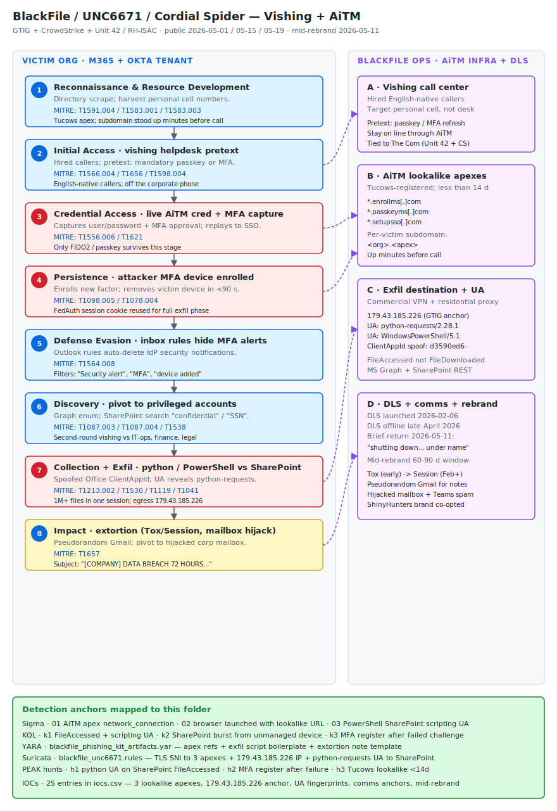

# BlackFile / UNC6671 / Cordial Spider — Vishing + AiTM SSO compromise of Microsoft 365 and Okta with programmatic SharePoint exfiltration

## TL;DR

Google Threat Intelligence Group (GTIG) published on 2026-05-15 a deep technical writeup of **UNC6671**, a financially motivated extortion cluster operating under the **BlackFile** brand since January 2026 and tracked in parallel by CrowdStrike as **Cordial Spider** and by Palo Alto Networks Unit 42 + RH-ISAC as **CL-CRI-1116**. The operator runs a high-tempo vishing-to-extortion workflow against Microsoft 365 and Okta tenants in North America, Australia, and the UK: hired callers impersonate IT helpdesk personnel, drive the victim to a Tucows-registered SSO lookalike subdomain (passkey- or enrollment-themed: `<org>.enrollms[.]com`, `<org>.passkeyms[.]com`, `<org>.setupsso[.]com`), capture credentials and MFA in real time via adversary-in-the-middle (AiTM), enroll an attacker-controlled MFA device, plant inbox rules that auto-delete enrollment alerts, scrape the corporate directory, and then pivot from interactive browser activity to **programmatic SharePoint/OneDrive exfiltration via Python and PowerShell against the Microsoft Graph and SharePoint REST APIs** with attacker-spoofed `ClientAppId="Microsoft Office"` but real `UserAgent="python-requests/2.28.1"` or `WindowsPowerShell/5.1`. The detection pivot of the case is that the operator's later intrusions deliberately abandoned the operations that emit `FileDownloaded` events and shifted to direct HTTP GETs that are recorded as **`FileAccessed`**, which most SOCs treat as benign noise. Extortion uses Tox initially, then Session, with a dedicated DLS at `blackfile[.]net`-class (now offline); when victims stay silent, the operator escalates to **mass Gmail spam from internal hijacked corporate mailboxes, Teams hijack, threatening voicemails to executives, and swatting**. The case matters today because the BlackFile DLS went offline in late April 2026 and briefly returned on 2026-05-11 with the message *"BlackFile is shutting down… under this name"* — meaning the operator is mid-rebrand, the IOC set is at its most useful diagnostic value for the next 60-90 days, and the SOC has a finite window to retro-hunt across 24 months of identity and SaaS telemetry before the cluster reappears under a new banner.

## Attribution and confidence

**Cluster name (vendor + aliases):**

- **UNC6671** — Google Threat Intelligence Group / Mandiant (Austin Larsen, Tyler McLellan, Genevieve Stark, Dan Ebreo), public 2026-05-15 / 2026-05-16. Primary technical writeup.
- **BlackFile** — self-branded on the operator's own data leak site (DLS) since 2026-02-06.
- **Cordial Spider** — CrowdStrike Counter Adversary Operations, public 2026-05-01.
- **CL-CRI-1116** — Palo Alto Networks Unit 42 + RH-ISAC, public 2026-05-19 (retail and hospitality focus).
- **O-UNC-045** — Okta Defensive Cyber Operations internal cluster name (referenced by GTIG).

**Vendor discovery + date:** GTIG `Welcome to BlackFile: Inside a Vishing Extortion Operation`, 2026-05-15; CrowdStrike `Defending against Cordial Spider and Snarky Spider with Falcon Shield`, 2026-05-01; The Hacker News rerun 2026-05-25; RH-ISAC retail / hospitality threat brief 2026-05-19; Push Security phishing-panel teardown 2026-05-22 (shared with ShinyHunters).

**Confidence:** **high** that this is one coherent operator running a vishing → AiTM → SaaS-exfil → extortion workflow against M365 / Okta tenants; **high** that the cluster is in mid-rebrand (operator's own DLS announcement 2026-05-11); **medium** for the explicit tie to The Com ecosystem (Unit 42 + CrowdStrike assess "moderate confidence"); **low / contested** for any direct shared infrastructure with ShinyHunters / UNC6240 — GTIG is explicit that the brand was co-opted in at least one instance but the operations are independent (separate Tox channels, separate domain registration patterns, separate DLS).

**Justification:** the cracked, consistent Tucows-domain naming convention (passkey- and enrollment-themed subdomains under `enrollms[.]com`, `passkeyms[.]com`, `setupsso[.]com`), the consistent extortion-note template ("[COMPANY NAME] DATA BREACH 72 HOURS TO CONTACT US"), the consistent communication-channel shift (Tox → Session in February 2026), and the consistent attacker user-agent fingerprint (`python-requests/2.28.1`, `WindowsPowerShell/5.1`) anchor the cluster cleanly across multiple vendor telemetry sets. The The Com tie is a TTP overlap (English-native callers, residential-proxy preference, retail and hospitality focus) without direct identity overlap.

**Cluster overlap:**

| Vendor name | Sponsor | Notes |
|---|---|---|
| UNC6671 | Google Threat Intelligence Group | Primary published cluster; dozens of orgs in NA/AU/UK |
| Cordial Spider | CrowdStrike | Independent tracking; CSA Counter Adversary Ops |
| CL-CRI-1116 | Palo Alto Unit 42 + RH-ISAC | Retail / hospitality focus |
| O-UNC-045 | Okta DCO | Internal cluster name |
| BlackFile | Self-brand | Operator's own DLS brand from 2026-02-06 |
| Snarky Spider / UNC6661 | CrowdStrike / GTIG | Independent peer cluster, "under an hour" exfil — see secondary findings |
| ShinyHunters / UNC6240 | GTIG / Mandiant | Brand co-opted in one BlackFile note, but distinct operations |

**Repo genealogy:** continues the **identity-only cloud breach** track opened by Day 23 (`2026-05-20_Storm-2949-Cloud-Identity-SSPR`, no-malware SSPR-abuse identity attack against Entra ID + Azure resources) and the **AiTM tradecraft** track introduced by Day 10 (`2026-05-06_CodeOfConduct_AiTM_Storm-1747`, Evilginx-class AiTM with token replay). Day 30 is the first repo case where the detection pivot is the **`FileAccessed`-vs-`FileDownloaded` collapse** in M365 Unified Audit Logs — a tier of telemetry most SOCs explicitly demote. Cross-link with Day 27 (`2026-05-24_OperationSaffron-FirstVPN-Takedown`, infrastructure-tracking-as-detection): both cases share the lesson that durable extortion clusters rebrand under operational pressure and the SOC must retro-hunt across a 24-month window, not the default 90-day SIEM retention. Today's case opens `byActor/unc6671/`, `byActor/cordial-spider/`, `byActor/blackfile/`, `byTechnique/t1556-006/` (Multi-Factor Authentication — adversary-in-the-middle), `byTechnique/t1098-005/` (Device Registration), and `byTechnique/t1564-008/` (Email Hiding Rules).

## Kill chain — summary table

| Stage | MITRE | Detail |
|---|---|---|
| Reconnaissance | T1591.004 · T1589.002 | Open-source corporate directory scrape, LinkedIn-grade target list, employee personal mobile-number harvest. |
| Resource Development | T1583.001 · T1583.003 | Tucows-registered SSO lookalike subdomain (passkey- and enrollment-themed) stood up minutes before vishing call; commercial VPN / residential proxy network leased for exfil egress. |
| Initial Access | T1566.004 · T1656 · T1598.004 | Voice phishing to employee personal cell impersonating internal IT, citing mandatory passkey enrollment or MFA refresh; victim driven to lookalike SSO portal. |
| Credential Access | T1556.006 · T1621 | Live AiTM: attacker captures username + password + MFA approval in real time and replays to legitimate SSO provider. |
| Persistence | T1098.005 · T1078.004 | Attacker-controlled MFA device enrollment, removal of previously trusted user devices, session-cookie capture (e.g., FedAuth) for direct API replay. |
| Defense Evasion | T1564.008 · T1078.004 | Inbox rules auto-delete MFA enrollment, device change, and sign-in alert notifications from Microsoft / Okta. |
| Discovery | T1087.003 · T1087.004 · T1538 | Internal directory scrape (Entra / Workspace / HubSpot / ServiceNow) to identify privileged accounts and high-value mailboxes; SharePoint search queries for string literals "confidential" and "SSN". |
| Collection + Exfiltration | T1213.002 · T1530 · T1119 · T1041 | Programmatic SharePoint / OneDrive harvest via Microsoft Graph and SharePoint REST APIs using `python-requests/2.28.1` and `WindowsPowerShell/5.1` with spoofed `ClientAppId="Microsoft Office"`; in later intrusions deliberately stays under the `FileAccessed` event class rather than `FileDownloaded`. Direct streaming to attacker-controlled VPS / residential proxy egress. |
| Impact (Extortion) | T1657 | Unbranded extortion email from pseudorandom Gmail account, escalation to BlackFile-branded follow-up via Tox or Session, partial DLS publication of file samples and directory listings, hijacked internal mailbox + Teams spam, threatening voicemails to executives, swatting in severe cases. |



The left lane is the victim Microsoft 365 + Okta tenant, walked stage by stage from passive recon through extortion. The right lane is the BlackFile operations and infrastructure side — hired vishing callers, Tucows-registered AiTM lookalike subdomains, residential-proxy exfil egress, and the BlackFile DLS / Tox / Session communication stack now in mid-rebrand shutdown. The footer maps each detection artifact in this folder (Sigma, KQL, YARA, Suricata, PEAK hunts, IOC CSV) to the stage it covers.

## Stage-by-stage detail

### Stage 1 — Reconnaissance and resource development

The operator builds a target list from open-source sources (LinkedIn, corporate directory pages, sales-engineer roster, IT staff org charts) and from data harvested in earlier breaches. Personal cellphone numbers are an explicit pre-requisite — vishing the office desk phone is dead tradecraft for this cluster because it lands in the IVR or recorded line. Recent campaigns also use compromised legitimate websites for email harvesting (the same pattern documented in Day 29 VENOMOUS#HELPER, `gruta.com.mx`).

Resource-development phase stands up the Tucows-registered SSO lookalike subdomain minutes before the call so DNS reputation is at its blindest. Subdomain naming pattern:

```
<organization>.enrollms[.]com
<organization>.passkeyms[.]com
<organization>.setupsso[.]com
```

MITRE: T1591.004 (Identify Victim Identity Information — Identify Personal Data) · T1583.001 (Acquire Infrastructure — Domains) · T1583.003 (Acquire Infrastructure — Virtual Private Server).

### Stage 2 — Vishing call (IT-helpdesk pretext)

Hired callers — often with English-native accents and a documented playbook — call the victim's **personal** cellphone, not the office line, to deliberately move the conversation off the corporate phone system and away from any "official channels only" tooling. The pretext is **mandatory passkey migration** or **MFA update**, which gives a logical cover for any subsequent security alert. The caller stays on the line while the victim "completes" the enrollment, which is the live AiTM session.

MITRE: T1566.004 (Phishing — Spearphishing Voice) · T1656 (Impersonation) · T1598.004 (Information for Identifier — Spearphishing Voice).

### Stage 3 — AiTM credential and MFA capture (CRITICAL)

The lookalike subdomain renders a near-pixel-perfect copy of the organisation's SSO portal. As the victim types, the operator captures the credentials in real time and immediately submits them to the legitimate SSO provider. When the legitimate provider issues the MFA challenge (Push, SMS, or TOTP), the victim — believing they are completing a setup step — provides the code or approval to the operator. This is a classic adversary-in-the-middle and bypasses all push/SMS/TOTP MFA. Only **phishing-resistant FIDO2 / passkey hardware-bound credentials** survive this stage.

MITRE: T1556.006 (Modify Authentication Process — Multi-Factor Authentication) · T1621 (Multi-Factor Authentication Request Generation).

### Stage 4 — Attacker MFA device enrollment + previous-device removal (CRITICAL)

Upon successful sign-in, the operator immediately navigates to the user's security settings, enrolls a new attacker-controlled MFA device (typically a software TOTP authenticator), and removes the victim's previously trusted device. The victim now cannot complete future MFA challenges, the operator can. This is the persistence primitive of the entire campaign.

The session cookies (`FedAuth` for SharePoint, the Okta session cookie, and the Entra ID refresh-token equivalent) are captured at the same moment and reused for the entire programmatic-exfil phase.

MITRE: T1098.005 (Account Manipulation — Device Registration) · T1078.004 (Valid Accounts — Cloud Accounts).

### Stage 5 — Inbox rules to suppress notifications

Microsoft and Okta both emit security notifications when a new MFA device is enrolled or a previous device is removed. The operator's first action after pivot-in is to create inbox rules that auto-delete messages from `noreply@microsoft.com`, `no-reply@okta.com`, and the organisation's own internal security-notification distribution list. The Outlook web rule typically uses subject filters (`"Security alert"`, `"MFA"`, `"sign-in"`, `"device added"`) and the action is "move to Deleted Items" or "delete permanently".

MITRE: T1564.008 (Hide Artifacts — Email Hiding Rules).

### Stage 6 — Directory scrape and pivot to privileged accounts

With persistent SSO access, the operator scrapes the internal Entra / Workspace / HubSpot / ServiceNow directory to identify privileged accounts — IT operations, finance, legal, executive assistants, M&A team — and the high-value mailbox set. SharePoint search is queried for string literals like `"confidential"`, `"SSN"`, `"MSA"`, `"NDA"`, `"acquisition"`, `"merger"`, `"settlement"`. Then a second-round vishing call lands against one of the identified privileged users to elevate again. GTIG flags Microsoft Graph as the preferred discovery API because its query patterns blend into legitimate workspace tooling.

MITRE: T1087.003 (Account Discovery — Email Account) · T1087.004 (Account Discovery — Cloud Account) · T1538 (Cloud Service Dashboard).

### Stage 7 — Programmatic SharePoint and OneDrive exfiltration (CRITICAL)

This is the detection-engineering centerpiece. The operator transitions from interactive browser activity to **automated exfiltration** using Python scripts (the `python-requests` library) and PowerShell against the Microsoft Graph and SharePoint REST APIs. Captured `FedAuth` session cookies are replayed against direct document resource URLs.

Two sub-phases:

- **Early intrusions:** the request lands as a `FileDownloaded` event in the M365 Unified Audit Log with `UserAgent=python-requests/2.28.1` and a spoofed `ClientAppId=d3590ed6-52b3-4102-aeff-aad2292ab01c` (Microsoft Office). The audit log evidence is clear once the SOC pulls it.

```json
{
  "CreationTime": "2026-02-24T14:36:15",
  "Operation": "FileDownloaded",
  "Workload": "SharePoint",
  "ClientIP": "179.43.185.226",
  "UserId": "victim.user@organization.com",
  "UserAgent": "python-requests/2.28.1",
  "ApplicationDisplayName": "Microsoft Office",
  "IsManagedDevice": false,
  "SourceFileName": "2382_REDACTED_MSA_v3.docx",
  "SourceRelativeUrl": "Shared Documents/Legal/MasterMSA/Archive",
  "SiteUrl": "https://organization.sharepoint.com/sites/Legal_Archive/",
  "AppAccessContext": {
    "ClientAppId": "d3590ed6-52b3-4102-aeff-aad2292ab01c",
    "ClientAppName": "Microsoft Office"
  }
}
```

- **Later intrusions:** the operator deliberately switched to **direct file streaming** via raw HTTP GETs against the document resource URL, which Microsoft records as `FileAccessed` rather than `FileDownloaded`. Most SOCs detect on `FileDownloaded` and treat `FileAccessed` as background noise. This is the single most important detection-engineering pivot of the case.

```json
{
  "CreationTime": "2026-03-18T20:06:41",
  "Operation": "FileAccessed",
  "Workload": "SharePoint",
  "UserId": "victim.user@company.com",
  "ClientIP": "179.43.185.226",
  "UserAgent": "python-requests/2.28.1",
  "ApplicationDisplayName": "python-requests",
  "IsManagedDevice": false,
  "SourceRelativeUrl": "Shared Documents/Data Analytics/Power BI Version History",
  "SourceFileName": "Weekly Production Report.pbix"
}
```

In one observed engagement, the operator pulled **over one million individual files** in a single Python-driven session against one victim's SharePoint and OneDrive.

MITRE: T1213.002 (Data from Information Repositories — SharePoint) · T1530 (Data from Cloud Storage) · T1119 (Automated Collection) · T1567.002 (Exfiltration to Cloud Storage) · T1041 (Exfiltration Over C2 Channel).

### Stage 8 — Extortion

The operator sends an initial unbranded extortion email from a pseudorandom Gmail account. Subject template: `[COMPANY NAME] DATA BREACH 72 HOURS TO CONTACT US`. The note demands contact via Tox initially (early 2026) and via Session from February 2026 onward (`getsession.org`). Once the victim engages, the operator self-identifies as **BlackFile** and opens negotiation at multi-million-dollar demands, pivoting to low six-figure asks when met with active dialogue.

If the victim does not respond, escalation: dozens of Gmail accounts with randomly generated usernames send mass spam to employee mailboxes; hijacked internal corporate mailboxes and Microsoft Teams accounts (acquired during the SSO foothold) are used to amplify pressure and bypass spam reputation; threatening voicemails are sent to C-suite cellphones; in severe cases, **swatting** is deployed against named company personnel.

The BlackFile DLS launched 2026-02-06 with a "security researcher" pretext, was deliberately not indexed for search engines (unusual for the segment), and went offline late April 2026. On 2026-05-11 it briefly returned with the message *"BlackFile is shutting down… under this name"* — operator-confirmed mid-rebrand.

MITRE: T1657 (Financial Theft).

## Detection strategy

### Telemetry that matters

- **Identity provider audit logs (priority):** Entra ID `SigninLogs` + `AuditLogs` (look for `MFA method registered`, `Device added`, `Inbox rule created` events); Okta System Log (`system.multifactor.factor.setup`, `user.session.start` from anonymizer IP, `user.account.update_password` chain).
- **Microsoft 365 Unified Audit Log (priority):** `FileAccessed`, `FileDownloaded`, `FileSyncDownloadedFull`, `MailboxLogin`, `New-InboxRule`, `Set-InboxRule`, `Add-MailboxPermission`. **Do not demote `FileAccessed` when the `UserAgent` is a scripting library.**
- **SharePoint Online + OneDrive audit:** `AppAccessContext.ClientAppName` correlated with `UserAgent` (mismatch is the key signal).
- **CASB / SSE telemetry:** outbound HTTPS to lookalike subdomain patterns (`*.enrollms[.]com`, `*.passkeyms[.]com`, `*.setupsso[.]com`) on Tucows-registered domains less than 7 days old.
- **EDR / Sysmon on user endpoint:** Sysmon EID 3 (network connection) from `msedge.exe` / `chrome.exe` / `firefox.exe` to the lookalike subdomain; Sysmon EID 1 (process creation) of `powershell.exe` issuing `Invoke-WebRequest` against `*.sharepoint.com` with non-standard User-Agent.
- **Email security gateway:** inbound mail to executives with subject pattern `[COMPANY NAME] DATA BREACH 72 HOURS TO CONTACT US` from Gmail with pseudorandom alphanumeric local-part.

### Detection coverage

| Engine | File | Logic |
|---|---|---|
| Sigma (network_connection) | `sigma/01_blackfile_aitm_lookalike_subdomain.yml` | Outbound HTTPS to `*.enrollms[.]com`, `*.passkeyms[.]com`, `*.setupsso[.]com` from a browser process. |
| Sigma (process_creation) | `sigma/02_blackfile_browser_lookalike_url_argument.yml` | `msedge.exe` / `chrome.exe` / `firefox.exe` launched with the lookalike domain pattern in command-line URL argument. |
| Sigma (process_creation) | `sigma/03_blackfile_powershell_sharepoint_python_useragent.yml` | `powershell.exe` issuing `Invoke-WebRequest` or `Invoke-RestMethod` to `*.sharepoint.com` with `-UserAgent` referencing `python-requests` or `WindowsPowerShell`. |
| KQL (Defender XDR / Sentinel) | `kql/k1_m365uan_fileaccessed_python_useragent.kql` | M365 Unified Audit Log — `FileAccessed` or `FileDownloaded` with `UserAgent` matching `python-requests/*`, `WindowsPowerShell/*`, `curl/*`, `Go-http-client/*`. |
| KQL (Defender XDR / Sentinel) | `kql/k2_m365uan_sharepoint_burst_unmanaged_device.kql` | High-volume SharePoint file events from `IsManagedDevice=false` in a short window from an unfamiliar `ClientIP`. |
| KQL (Sentinel) | `kql/k3_entraid_mfa_register_after_failed_challenge.kql` | Entra ID — `Add registered security info` or `User registered security info` within 5 minutes after a `Sign-in failure` with MFA failure reason or an `Abandoned` MFA challenge. |
| YARA (file scan) | `yara/blackfile_phishing_kit_artifacts.yar` | Phishing-kit boilerplate matching publicly documented UNC6671 lookalike-domain patterns plus Microsoft / Okta credential-harvester template strings. |
| Suricata (network) | `suricata/blackfile_unc6671.rules` | TLS SNI / HTTP Host match on `*.enrollms[.]com`, `*.passkeyms[.]com`, `*.setupsso[.]com`; HTTP request to known exfil IP `179.43.185.226`; HTTP User-Agent `python-requests/2.28.1` or `WindowsPowerShell/5.1` to `*.sharepoint.com`. |

### Threat hunting hypotheses

- **H1 (`hunts/peak_h1_python_requests_sharepoint_fileaccessed.md`):** if UNC6671-class tradecraft is present, the M365 Unified Audit Log will contain `FileAccessed` events with `UserAgent` strings that identify a scripting library (`python-requests`, `WindowsPowerShell`, `curl`, `Go-http-client`), originating from a non-managed device on a commercial VPN or residential-proxy ASN.
- **H2 (`hunts/peak_h2_mfa_device_register_after_failed_challenge.md`):** if AiTM-class identity compromise is present, an MFA device registration event will be preceded within 5 minutes by an MFA challenge that was failed or abandoned from a different (or the same) source IP.
- **H3 (`hunts/peak_h3_lookalike_subdomain_tucows_recent.md`):** if BlackFile-class staging is present, DNS or proxy logs will show a host resolving a subdomain on a Tucows-registered apex less than 14 days old whose label contains `passkey`, `enroll`, or `setupsso` and the organisation's own name as a literal subdomain segment.

## Incident response playbook

### First 60 minutes (triage)

1. Identify the compromised user account from the initial alert. Pull all `Sign-in`, `AuditLogs`, and `SigninLogs` events for the last 30 days for that account.
2. **Revoke all sessions** for the user in Entra ID: PowerShell `Revoke-AzureADUserAllRefreshToken -ObjectId <user-objectid>` (or the Microsoft Graph equivalent `revokeSignInSessions`).
3. **Enumerate all MFA methods** registered on the account; identify and remove any device added in the last 30 days that was not user-confirmed.
4. **Dump and review inbox rules** with PowerShell `Get-InboxRule -Mailbox <user> | Format-List Name,Description,Enabled,Conditions,Actions,RuleIdentity`. Delete any rule that auto-deletes mail from `*microsoft.com`, `*okta.com`, or the corporate security distribution list.
5. **Pull the M365 Unified Audit Log** for the user for the last 30 days and filter on `Operation in ("FileAccessed","FileDownloaded","FileSyncDownloadedFull")` joined with `UserAgent` and `IsManagedDevice`. Flag any event where `UserAgent` references a scripting library, regardless of `Operation` class.
6. **Identify lateral-pivot accounts:** any account that completed an MFA registration or device add within 24 hours of the initial victim's first AiTM event.
7. **Block the lookalike subdomain** at the DNS resolver and the egress proxy: `*.enrollms[.]com`, `*.passkeyms[.]com`, `*.setupsso[.]com`, plus the specific `<organization>.<apex>` variants seen in your environment.
8. **Search SharePoint logs** for queries containing `"confidential"`, `"SSN"`, `"MSA"`, `"NDA"`, `"merger"`, `"acquisition"`, `"settlement"`, scoped to the compromised user and any pivot accounts.
9. **Preserve evidence:** export the relevant Unified Audit Log slices to immutable storage before the 90-day retention window closes.
10. **Notify the legal and exec team** of the extortion playbook: expect Gmail spam, Tox or Session contact attempts, hijacked internal mailbox spam, voicemails, and (rarely) swatting.

### Artifacts to collect

| Artifact | Path | Tool | Why it matters |
|---|---|---|---|
| Entra ID sign-in logs | `Get-MgAuditLogSignIn -Filter "userId eq '<oid>'"` | Microsoft Graph PowerShell | Pinpoint AiTM session: source IP, user-agent, conditional-access result. |
| Entra ID audit logs | `Get-MgAuditLogDirectoryAudit -Filter "targetResources/any(t:t/id eq '<oid>')"` | Microsoft Graph PowerShell | MFA enrollment, device add, inbox-rule create events. |
| Okta System Log | `okta-cli logs --user <username> --since 30d` | Okta API / okta-cli | `system.multifactor.factor.setup`, `user.session.start` from anonymizer IP. |
| M365 Unified Audit Log | `Search-UnifiedAuditLog -UserIds <user> -Operations FileAccessed,FileDownloaded,...` | Exchange Online PowerShell | The `FileAccessed`-vs-`FileDownloaded` pivot is in this log. |
| SharePoint search logs | M365 Compliance Center → Audit | M365 Compliance Audit | `SearchQueryPerformed` events for "confidential", "SSN", etc. |
| Inbox rules dump | `Get-InboxRule -Mailbox <user>` | Exchange Online PowerShell | Auto-delete rules that hide MFA notifications. |
| Device registration list | Entra ID portal → Users → Authentication methods | Entra portal / Graph | Attacker-controlled MFA device persists here until removed. |
| Egress proxy logs | SSE / CASB / web proxy | CASB query | DNS / HTTPS to `*.enrollms[.]com`, `*.passkeyms[.]com`, `*.setupsso[.]com`. |
| User endpoint EDR triage | Defender for Endpoint / Velociraptor | EDR live response | Confirm victim host is not compromised beyond browser session (this campaign is identity-only — host implants are rare). |

### IR queries and commands

```powershell
# Revoke all sign-in sessions for the suspected victim
Connect-MgGraph -Scopes "User.RevokeSessions.All"
Revoke-MgUserSignInSession -UserId <user-objectid>

# Enumerate all MFA methods, including attacker-added devices
Get-MgUserAuthenticationMethod -UserId <user-objectid> | Format-List Id,AdditionalProperties

# Dump inbox rules and flag suspect auto-delete patterns
Get-InboxRule -Mailbox <user@org.com> | Where-Object {
    $_.DeleteMessage -or $_.MoveToFolder -match 'Deleted'
} | Format-List Name,Description,Enabled,Conditions,Actions
```

```bash
# Pull Okta system log for MFA setup events in the last 14 days
okta-cli logs \
  --filter 'eventType eq "system.multifactor.factor.setup"' \
  --since 14d \
  --until now \
  --output json > okta_mfa_setup_14d.json

# Triage compromised IP set against known UNC6671 anchor
grep -E '179\.43\.185\.226' /var/log/proxy/*.log
```

```kql
// Sentinel — find SharePoint FileAccessed with scripting-library user-agent
OfficeActivity
| where TimeGenerated > ago(30d)
| where Operation in ("FileAccessed","FileDownloaded","FileSyncDownloadedFull")
| where UserAgent matches regex @"(?i)(python-requests|WindowsPowerShell|curl|Go-http-client|aiohttp)"
| project TimeGenerated, UserId, ClientIP, UserAgent, Operation, OfficeWorkload, OfficeObjectId
| order by TimeGenerated asc

// Sentinel — Entra ID MFA registration immediately after a sign-in failure
let signinFailures =
    SigninLogs
    | where TimeGenerated > ago(7d)
    | where ResultType != 0
    | project FailTime=TimeGenerated, UserPrincipalName, IPAddress, ResultType;
AuditLogs
| where TimeGenerated > ago(7d)
| where OperationName in ("Add registered security info","User registered security info")
| project AuditTime=TimeGenerated, UserPrincipalName=tostring(TargetResources[0].userPrincipalName), AuditIP=tostring(InitiatedBy.user.ipAddress)
| join kind=inner (signinFailures) on UserPrincipalName
| where AuditTime between (FailTime .. FailTime + 5m)
| project UserPrincipalName, FailTime, AuditTime, IPAddress, AuditIP, ResultType
```

### Containment, eradication, recovery

**Exit criteria — the incident is contained when:**

- All sessions for the compromised user are revoked and the user has re-authenticated with a known-good device.
- All MFA methods registered in the last 30 days that were not user-confirmed are removed.
- All inbox rules auto-deleting Microsoft / Okta security notifications are removed.
- The lookalike subdomain is blocked at the DNS resolver, the egress proxy, and the email security gateway.
- No SharePoint or OneDrive activity in the last 24 hours from a non-managed device with a scripting-library user agent.
- The pivot-account list is closed (no further MFA enrollments by accounts within 1 hop of the victim).

**What NOT to do:**

- **Do not** wipe the compromised user's endpoint reflexively — this is an identity-only campaign and the host is rarely implanted. Wiping destroys browser-cache forensic evidence.
- **Do not** treat `FileAccessed` events as background noise. The operator deliberately downshifted to this event class.
- **Do not** rely on IP-geolocation conditional-access policies as the primary defense — the operator uses commercial VPNs and residential proxies that geolocate inside the victim's country.
- **Do not** publicly attribute to ShinyHunters even if the extortion note self-identifies as such. GTIG documented one BlackFile note co-opting the brand for credibility; the operations are independent.
- **Do not** negotiate without involving legal and law enforcement. The operator's escalation playbook (swatting, mass spam from hijacked internal mailboxes) is documented.

### Recovery validation

The user account is considered clean when:

- A passkey or FIDO2 hardware-bound credential is enrolled and all other MFA methods (push, SMS, TOTP) are disabled or de-prioritized for this user.
- A `Get-InboxRule` dump shows no rules deleting messages from `*microsoft.com`, `*okta.com`, or the internal security distribution list.
- A 7-day forward review of the M365 Unified Audit Log shows no `FileAccessed` or `FileDownloaded` events from a scripting-library user agent.
- The Entra ID sign-in log shows no successful sign-ins from a commercial VPN / residential proxy ASN for the user.
- Conditional access policies are tightened: require a managed device for high-value SaaS applications (SharePoint, OneDrive, Salesforce, ServiceNow); require FIDO2 / passkey for privileged accounts.

## IOCs

| Type | Value | Context | Confidence | Source |
|---|---|---|---|---|
| domain | `enrollms[.]com` | UNC6671 / BlackFile lookalike apex (Tucows-registered); subdomain pattern `<org>.enrollms[.]com` for SSO portal mimicry | high | GTIG 2026-05-15 |
| domain | `passkeyms[.]com` | UNC6671 / BlackFile lookalike apex (Tucows-registered); passkey-enrollment pretext | high | GTIG 2026-05-15 |
| domain | `setupsso[.]com` | UNC6671 / BlackFile lookalike apex (Tucows-registered); SSO-setup pretext | high | GTIG 2026-05-15 |
| ipv4 | `179.43.185.226` | UNC6671 SharePoint exfil source IP observed in two GTIG audit-log examples (commercial VPN ASN, identity rotates) | high | GTIG 2026-05-15 |
| string | `python-requests/2.28.1` | Attacker UserAgent in M365 Unified Audit Log `FileAccessed` / `FileDownloaded` events with spoofed `ClientAppId="Microsoft Office"` | high | GTIG 2026-05-15 |
| string | `WindowsPowerShell/5.1` | Attacker UserAgent variant in M365 Unified Audit Log when the operator uses PowerShell instead of Python | high | GTIG 2026-05-15 |
| string | `[COMPANY NAME] DATA BREACH 72 HOURS TO CONTACT US` | BlackFile initial-note subject template, all-caps, from pseudorandom Gmail | high | GTIG 2026-05-15 |
| string | `getsession.org` | BlackFile-preferred secure-comms platform from Feb 2026 onward (Session messenger) | high | GTIG 2026-05-15 |
| string | `Tox` | BlackFile early-2026 secure-comms channel before the Session migration | high | GTIG 2026-05-15 |
| note | `BlackFile DLS launched 2026-02-06, offline late April 2026, brief return 2026-05-11 with "shutting down... under this name" — operator in mid-rebrand` | Operator self-disclosure on DLS; retro-hunt window is 60-90 days | high | GTIG 2026-05-15 |
| note | `ClientAppId=d3590ed6-52b3-4102-aeff-aad2292ab01c spoof — Microsoft Office native app — used by operator to bypass basic Conditional Access app filters` | M365 UAL artifact: spoofed ClientAppId, but UserAgent unmasks the python-requests origin | high | GTIG 2026-05-15 |
| note | `Search-term anchors in compromised tenants: "confidential", "SSN", "MSA", "NDA", "merger", "acquisition", "settlement"` | UNC6671 SharePoint search-query pattern for high-value document discovery | high | GTIG 2026-05-15 |
| note | `VirusTotal GTI Collection 59b667464a0d3c503320bfa43b165d4633288fd0d4226ff51108ac0f9dd02a97` | Full GTIG IOC bundle for registered users; phishing domains added to Safe Browsing | high | GTIG 2026-05-15 |
| note | `Operator escalation playbook: mass Gmail spam, hijacked corporate mailbox spam, Teams hijack, threatening voicemails to executives, swatting in severe cases` | Out-of-band victim-pressure tactic; legal and exec must be briefed early | high | GTIG 2026-05-15 |
| cve | `N/A` | Identity-only campaign; no product CVE in the chain; defense is on phishing-resistant MFA and audit-log instrumentation | high | GTIG 2026-05-15 |

Full IOC list with context fields in `iocs.csv`.

## Secondary findings

- **Snarky Spider / UNC6661 (CrowdStrike + GTIG) — peer cluster, "under an hour" exfiltration:** CrowdStrike Counter Adversary Operations 2026-05-01 documented Snarky Spider (aka O-UNC-025, UNC6661) as a near-mirror peer of Cordial Spider with the same vishing → AiTM → SSO → SaaS-exfil → extortion workflow but a measurable faster cadence — exfiltration begins under an hour from initial credential capture. Snarky Spider has direct ties to The Com (English-native crew) per CrowdStrike. The two clusters share operational similarities but operate independently. Detection coverage built today for UNC6671 also covers most of Snarky Spider's pattern; the differentiator is the elapsed-time threshold between MFA registration and first SharePoint API call. Cross-reference: detection content in `kql/k1_m365uan_fileaccessed_python_useragent.kql` already catches both.
- **Microsoft Semantic Kernel prompt-injection-to-RCE — CVE-2026-25592 + CVE-2026-26030 (Microsoft Security Blog 2026-05-07):** Microsoft Threat Intelligence detailed two vulnerabilities in Semantic Kernel that turn a single LLM prompt injection into host-level code execution on the machine running the AI agent (a single prompt can launch `calc.exe`). Both are patched. The angle that matters for this repo is the genealogy with Day 13 (`2026-05-13_SemanticKernel-Prompt2RCE`) — same framework, same prompt-injection-to-RCE primitive, second iteration in the same calendar quarter. Risk multiplier when agents have access to Microsoft Graph or to internal MCP servers: a single poisoned email / SharePoint document landing in the agent context can re-execute the UNC6671-style SaaS-exfil workflow autonomously.
- **NSA Cybersecurity Information Sheet (CSI) on MCP Security — `U/OO/6030316-26 / PP-26-1834` (May 2026):** NSA published the first agency-grade tradecraft document on Model Context Protocol security, covering tool poisoning, indirect prompt injection, covert tool invocation, and the stdio transport command-execution surface that Ox Security flagged on 2026-05-02 as affecting ~200,000 deployed MCP servers. This is the closing of an arc that Day 13 opened: when agents (Semantic Kernel, LangChain, autonomous coding agents) reach into SaaS data, the attack surface from `Welcome to BlackFile` reappears at the agent layer — programmatic exfiltration with spoofed client app, undetected `FileAccessed` events. Defenders building MCP-mediated SaaS integrations should treat the NSA CSI as the floor.

## Pedagogical anchors

- **The hardest-to-detect identity attack is the one with no malware on disk.** UNC6671 / BlackFile / Cordial Spider compromises produce zero EDR-visible indicators on the victim endpoint. The entire detection burden falls on identity and SaaS audit logs. If your SOC only watches EDR telemetry, this campaign is invisible.
- **`FileAccessed` is not benign when the User-Agent is a scripting library.** Most SOCs treat `FileAccessed` as background noise and alert on `FileDownloaded`. UNC6671 deliberately switched to the request pattern that emits `FileAccessed`. Re-tier your M365 UAL detection: User-Agent string, not Operation type, is the discriminator.
- **Phishing-resistant MFA (FIDO2 / passkey) is the structural defense.** Push, SMS, and TOTP MFA all fall to live AiTM. Hardware-bound credentials cannot be replayed by the operator because the cryptographic challenge is tied to the device. Migration cost is non-trivial; without it, every vishing call is a live AiTM in waiting.
- **Operator brand rebranding is a CTI signal, not a closure.** BlackFile's own DLS announcement on 2026-05-11 *("shutting down… under this name")* says the cluster is in mid-rebrand. The IOC set is at its highest diagnostic value for the next 60-90 days. Build retro-hunts against 24 months of identity and SaaS telemetry now, before the rebrand resets the IOC clock.
- **Identity-provider conditional access has to enforce device posture, not just geography.** Commercial VPN and residential proxy egress neutralizes geo-based conditional access. Require managed-device posture for the SaaS applications that hold the crown jewels (SharePoint, OneDrive, Salesforce, ServiceNow).

## What's in this folder

| File | Purpose |
|---|---|
| [README.md](./README.md) | Full case writeup, 15-section standard. |
| [kill_chain.svg](./kill_chain.svg) | Two-lane kill-chain diagram (victim org on the left, BlackFile ops and infra on the right). |
| [iocs.csv](./iocs.csv) | Full IOC set with context, confidence, and source. |
| [sigma/01_blackfile_aitm_lookalike_subdomain.yml](./sigma/01_blackfile_aitm_lookalike_subdomain.yml) | Sigma `network_connection` rule — outbound HTTPS to `*.enrollms[.]com`, `*.passkeyms[.]com`, `*.setupsso[.]com`. |
| [sigma/02_blackfile_browser_lookalike_url_argument.yml](./sigma/02_blackfile_browser_lookalike_url_argument.yml) | Sigma `process_creation` rule — browser launched with lookalike URL in command-line argument. |
| [sigma/03_blackfile_powershell_sharepoint_python_useragent.yml](./sigma/03_blackfile_powershell_sharepoint_python_useragent.yml) | Sigma `process_creation` rule — PowerShell `Invoke-WebRequest` to `*.sharepoint.com` with scripting-library User-Agent. |
| [kql/k1_m365uan_fileaccessed_python_useragent.kql](./kql/k1_m365uan_fileaccessed_python_useragent.kql) | KQL — M365 UAL `FileAccessed` / `FileDownloaded` with scripting-library User-Agent. |
| [kql/k2_m365uan_sharepoint_burst_unmanaged_device.kql](./kql/k2_m365uan_sharepoint_burst_unmanaged_device.kql) | KQL — High-volume SharePoint events from unmanaged device. |
| [kql/k3_entraid_mfa_register_after_failed_challenge.kql](./kql/k3_entraid_mfa_register_after_failed_challenge.kql) | KQL — Entra ID MFA registration within 5 min of a failed/abandoned MFA challenge. |
| [yara/blackfile_phishing_kit_artifacts.yar](./yara/blackfile_phishing_kit_artifacts.yar) | YARA — Phishing-kit boilerplate matching UNC6671 patterns. |
| [suricata/blackfile_unc6671.rules](./suricata/blackfile_unc6671.rules) | Suricata 7.x — TLS SNI / HTTP Host match on UNC6671 lookalike apex domains; UA + IP anchors. |
| [hunts/peak_h1_python_requests_sharepoint_fileaccessed.md](./hunts/peak_h1_python_requests_sharepoint_fileaccessed.md) | PEAK hunt — scripting-library UA against SharePoint API. |
| [hunts/peak_h2_mfa_device_register_after_failed_challenge.md](./hunts/peak_h2_mfa_device_register_after_failed_challenge.md) | PEAK hunt — MFA device registration after failed MFA challenge. |
| [hunts/peak_h3_lookalike_subdomain_tucows_recent.md](./hunts/peak_h3_lookalike_subdomain_tucows_recent.md) | PEAK hunt — recent Tucows-registered lookalike subdomain with passkey/enroll/setupsso tokens. |

## Sources

- [Welcome to BlackFile: Inside a Vishing Extortion Operation — Google Threat Intelligence Group / Google Cloud Blog, 2026-05-15](https://cloud.google.com/blog/topics/threat-intelligence/blackfile-vishing-extortion-operation)
- [Defending against Cordial Spider and Snarky Spider with Falcon Shield — CrowdStrike Counter Adversary Operations, 2026-05-01](https://www.crowdstrike.com/en-us/blog/defending-against-cordial-spider-and-snarky-spider-with-falcon-shield/)
- [Cordial Spider adversary profile — CrowdStrike](https://www.crowdstrike.com/en-us/adversaries/cordial-spider/)
- [Snarky Spider adversary profile — CrowdStrike](https://www.crowdstrike.com/en-us/adversaries/snarky-spider/)
- [Cybercrime Groups Using Vishing and SSO Abuse in Rapid SaaS Extortion Attacks — The Hacker News, 2026-05-25](https://thehackernews.com/2026/05/cybercrime-groups-using-vishing-and-sso.html)
- [Extortion in the Enterprise: Defending Against BlackFile Attacks — RH-ISAC + Palo Alto Unit 42, 2026-05-19](https://rhisac.org/threat-intelligence/extortion-in-the-enterprise-defending-against-blackfile-attacks/)
- [Inside a phishing panel used by ShinyHunters and BlackFile — Push Security, 2026-05-22](https://pushsecurity.com/blog/inside-criminal-phishing-panel)
- [Expansion of ShinyHunters SaaS data theft — Google Threat Intelligence Group (referenced)](https://cloud.google.com/blog/topics/threat-intelligence/expansion-shinyhunters-saas-data-theft)
- [When prompts become shells: RCE vulnerabilities in AI agent frameworks (Semantic Kernel CVE-2026-25592 + CVE-2026-26030) — Microsoft Security Blog, 2026-05-07](https://www.microsoft.com/en-us/security/blog/2026/05/07/prompts-become-shells-rce-vulnerabilities-ai-agent-frameworks/)
- [NSA Cybersecurity Information Sheet on MCP Security (U/OO/6030316-26 / PP-26-1834) — National Security Agency, May 2026](https://www.nsa.gov/Portals/75/documents/Cybersecurity/CSI_MCP_SECURITY.pdf)
