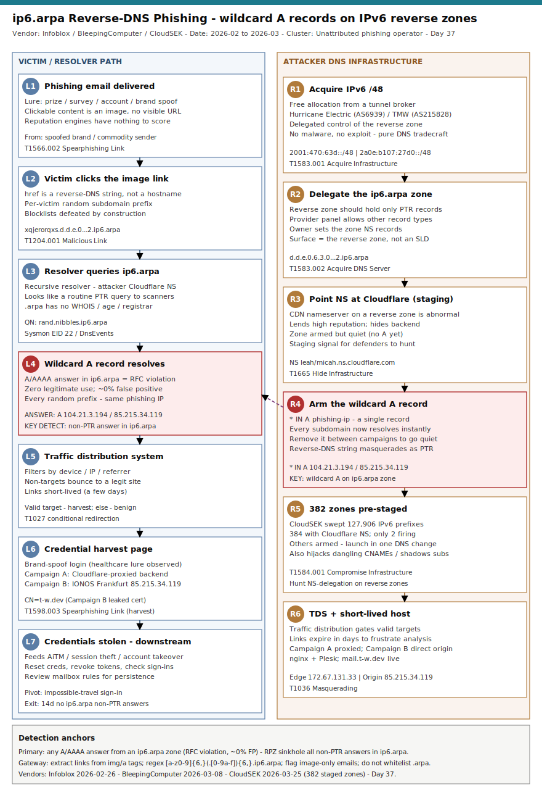

# ip6.arpa Reverse-DNS Phishing — wildcard A records on IPv6 reverse zones evade reputation and blocklists

## TL;DR

A commodity phishing operator abuses the `ip6.arpa` reverse-DNS namespace — a
zone that by RFC design should only ever hold PTR records — to host malicious
hyperlinks that email gateways and URL scanners treat as benign infrastructure
plumbing. The actor obtains a free IPv6 `/48` from a tunnel broker (Hurricane
Electric), is delegated the matching reverse zone, delegates that zone to a
high-reputation CDN nameserver (Cloudflare), then sets a **wildcard `A` record**
(`* IN A <phishing-ip>`) so every randomly generated subdomain resolves to the
phishing infrastructure. Lures (prize, survey reward, account notice, a United
Healthcare brand-spoof) are embedded as **images linked to a reverse-DNS string**
like `d.d.e.0.6.3.0.0.0.7.4.0.1.0.0.2.ip6.arpa`, so the victim never sees a
suspicious hostname; a click routes through a traffic-distribution system (TDS)
to a short-lived credential-harvest page. Infoblox documented the technique
(2026-02-26); BleepingComputer reported it (2026-03-08); CloudSEK independently
confirmed it still live, found a **second, separate campaign** in Frankfurt, and
mapped **382 pre-staged zones** armed and waiting (2026-03-25). Why-today: this is
the repo's **first primary in slot #29 (DNS-as-attack-surface)** — a slot that had
never been promoted — and the detection lesson is durable and zero-false-positive:
any `A`/`AAAA` answer from an `ip6.arpa` zone is an RFC violation.

## Attribution and confidence

| Attribute | Detail |
| --- | --- |
| Primary cluster | Unattributed `ip6.arpa` reverse-DNS phishing operator (Infoblox Threat Intel tracking; no named actor) |
| Nexus | Unattributed — commodity/financially-motivated phishing; English-language brand-spoof lures |
| Vendor / date | Infoblox Threat Intel, 2026-02-26 ("Abusing .arpa"); BleepingComputer, 2026-03-08; CloudSEK (Jainam Shah), 2026-03-25 |
| Confidence (technique in the wild) | **high** — three independent vendors; two concurrent campaigns on different ASNs/hosting; live IOCs |
| Confidence (single operator) | **low** — Infoblox and CloudSEK both treat this as a reusable technique, not one attributable group; Campaign A and Campaign B share TTPs but run on independent infrastructure |
| Sophistication | low-to-moderate — no malware, no exploit; pure DNS/email tradecraft abusing a namespace blind spot and CDN reputation |

### Overlap and genealogy

| Signal | Overlap | Confidence |
| --- | --- | --- |
| Campaign A (Infoblox / BleepingComputer) | Hurricane Electric IPv6 `/48` (`2001:470:63d::/48`), zone `d.d.e.0.6.3.0.0.0.7.4.0.1.0.0.2.ip6.arpa`, Cloudflare-proxied, edge IPs `104.21.3.194` / `172.67.131.33`; lure brand United Healthcare | high |
| Campaign B (CloudSEK, novel) | TMW Global Networks (AS215828) IPv6 `2a0e:b107:27d0::/48`, zone `0.d.7.2.7.0.1.b.e.0.a.2.ip6.arpa` → IONOS Frankfurt `85.215.34.119`, direct (un-proxied) origin, leaked cert `CN=t-w.dev`, live `mail.t-w.dev` | high (technique reuse) / low (same operator) |
| Adjacent legacy TTPs | Same campaigns also seen hijacking **dangling CNAMEs** and **subdomain shadowing** of >100 legit orgs (gov, universities, telecom, media, retail) — Infoblox links this operator's broader phishing activity back to at least 2017 | medium |

**Repo genealogy.** This is the first repo case anchored on **DNS-as-attack-surface
(#29)**. It is the DNS-infrastructure sibling of the identity/fraud thread in
`2026-05-06_CodeOfConduct-AiTM-Storm-1747` and `2026-05-20_Storm-2949-Cloud-Identity-SSPR`
(those steal sessions/credentials at the identity plane; this one solves the
*delivery* problem that feeds them). It complements the takedown/CTI tradecraft of
`2026-05-24_OperationSaffron-FirstVPN-Takedown` by showing the registrar/registry
and reverse-DNS plumbing that phishing crews weaponise rather than the bulletproof
host layer. Cross-link to the "reputation laundering via trusted provider" pattern
also seen with Cloudflare/CDN abuse across prior phishing cases.

## Kill chain — summary table

| Stage | MITRE | Detail |
| --- | --- | --- |
| Acquire IPv6 space | T1583.001 | Free IPv6 `/48` from a tunnel broker (Hurricane Electric); delegated control of the matching `ip6.arpa` reverse zone |
| Delegate reverse zone | T1583.002 | Point the `ip6.arpa` zone's NS at a high-reputation CDN (Cloudflare) — staging signal; zone armed but quiet |
| Arm wildcard A record | T1665 / T1036 | `* IN A <phishing-ip>` — every random subdomain resolves; reverse-DNS string masquerades as routine PTR infrastructure |
| Stage / shadow extras | T1584.001 | Parallel dangling-CNAME hijack + subdomain shadowing of >100 legit orgs for additional trusted delivery |
| Lure delivery | T1566.002 / T1598.003 | Phishing email; clickable content is an **image** linked to `<rand>.<nibbles>.ip6.arpa`, no visible URL text |
| User click | T1204.001 | Victim resolves attacker NS via their DNS provider; A record returns the phishing IP |
| TDS gate + harvest | T1027 | Traffic-distribution system filters by device/IP/referrer; valid targets reach a short-lived credential page, others bounce to a legit site |



The diagram's left lane is the victim/resolver path (email → image link → DNS
resolution → TDS → harvest); the right lane is the attacker infrastructure build
(IPv6 `/48` → reverse-zone delegation → Cloudflare NS → wildcard A → 382 staged
zones). The two critical detection anchors are coloured red: the **wildcard `A`
record on an `ip6.arpa` zone** (zero legitimate use) and the **image-only email
link to a reverse-DNS string** (regex-detectable at the gateway).

## Stage-by-stage detail

### Stage 1 — Acquire IPv6 address space and the reverse zone (T1583.001)

The operator registers for a free IPv6 tunnel/allocation. Hurricane Electric's
`tunnelbroker.net` hands out a routed `/48` and, critically, lets the customer
designate authoritative DNS for the corresponding reverse (`ip6.arpa`) zone.

```text
Allocated prefix : 2001:470:63d::/48   (Hurricane Electric, AS6939)
Reverse zone     : d.d.e.0.6.3.0.0.0.7.4.0.1.0.0.2.ip6.arpa
                   (nibble-reversed /48, per RFC 3596 §2.5)
```

The reverse zone is the attack surface. By RFC design it should contain only
`PTR` records mapping addresses back to hostnames. The provider's DNS panel,
however, does not restrict the record *types* the delegated owner can create.

MITRE: **T1583.001 Acquire Infrastructure: Domains** (analogue — the actor
acquires control of a delegated DNS zone rather than a registered SLD).

### Stage 2 — Delegate the zone to a high-reputation nameserver (T1583.002)

The operator delegates the `ip6.arpa` zone's NS records to Cloudflare:

```text
0.0.7.4.6.0.6.2.ip6.arpa  IN NS  leah.ns.cloudflare.com
0.0.7.4.6.0.6.2.ip6.arpa  IN NS  micah.ns.cloudflare.com
```

A Cloudflare NS on an `ip6.arpa` zone is **operationally abnormal** — reverse DNS
for a tunnel allocation is normally served by the broker, not a CDN. CloudSEK's
global BGP sweep treats "Cloudflare NS on an `ip6.arpa` zone" as the *staging
signal*: the zone is delegated and ready, but no malicious A record is set yet.

MITRE: **T1583.002 Acquire Infrastructure: DNS Server**.

### Stage 3 — Arm the wildcard A record (T1665, T1036)

When a campaign launches, the operator adds a single wildcard record:

```text
*  IN  A  <phishing-ip>      ; Campaign A → Cloudflare edge 104.21.3.194 / 172.67.131.33
*  IN  A  85.215.34.119      ; Campaign B → IONOS Frankfurt (direct origin)
```

Now `xqjerorqxs.d.d.e.0.6.3.0.0.0.7.4.0.1.0.0.2.ip6.arpa` and every other random
prefix resolve to the phishing server. Cloudflare proxying (Campaign A) hides the
backend; Campaign B exposed its origin (`nginx + Plesk`, cert `CN=t-w.dev`).
Because the hostname is a reverse-DNS string, automated scanners treat the lookup
as a routine PTR query rather than a web destination.

MITRE: **T1665 Hide Infrastructure** + **T1036 Masquerading**. Note: *any* `A`/`AAAA`
answer from an `ip6.arpa` zone is an RFC violation — CloudSEK rates the false-positive
rate at 0%.

### Stage 4 — Parallel dangling-CNAME and subdomain shadowing (T1584.001)

The same operator's broader phishing operation also hijacks **dangling CNAMEs**
and performs **subdomain shadowing** against legitimate organisations, giving
additional trusted-domain delivery paths alongside the `ip6.arpa` channel.

```text
Infoblox: >100 instances of hijacked CNAMEs of well-known government agencies,
          universities, telecom companies, media organisations and retailers.
```

MITRE: **T1584.001 Compromise Infrastructure: Domains**.

### Stage 5 — Lure delivery via image-linked reverse-DNS string (T1566.002, T1598.003)

The phishing email's clickable element is an **image** whose `href` is the
reverse-DNS hostname, so the recipient sees a graphic (prize/survey/account/brand
lure) and never a strange `…ip6.arpa` URL.

```html
<a href="https://xqjerorqxs.d.d.e.0.6.3.0.0.0.7.4.0.1.0.0.2.ip6.arpa/">
  
</a>
```

Because `.arpa` carries no WHOIS, no domain age, and no registrar contact, email
reputation engines have nothing to score and pass the link.

MITRE: **T1566.002 Phishing: Spearphishing Link** / **T1598.003 Spearphishing Link**
(credential harvesting).

### Stage 6 — Victim click and resolution (T1204.001)

```text
victim → recursive resolver → ip6.arpa NS (Cloudflare) → wildcard A → phishing IP
```

Each recipient receives a **unique random subdomain prefix**, so per-URL
blocklisting is futile: blocking one extracted subdomain leaves every other
victim's URL live under the same wildcard.

MITRE: **T1204.001 User Execution: Malicious Link**.

### Stage 7 — TDS gating and credential harvest (T1027)

A traffic-distribution system validates the visitor (device type, source IP,
referrer). Valid targets are redirected to the credential-harvest page; analysts,
sandboxes and non-targets are bounced to a benign site. Links are **short-lived
(a few days)**, then redirect to domain errors or legit sites to frustrate
analysis.

MITRE: **T1027 Obfuscated Files or Information** (delivery-layer obfuscation /
conditional redirection).

## Detection strategy

### Telemetry that matters

- **Recursive DNS resolver logs** — query name + answer type/section. The gold
  anchor: an `ip6.arpa` query that returns an `A`/`AAAA` answer instead of `PTR`.
- **Passive DNS / DNS firewall (RPZ)** — `ip6.arpa` zones whose NS are a commercial
  CDN (Cloudflare), and any A-record activation on them.
- **Secure web gateway / proxy logs** — outbound HTTP(S) to a host ending `.ip6.arpa`.
- **Sysmon EID 22 (DnsQuery)** on Windows endpoints — `QueryName` matching the
  reverse-DNS-with-text-prefix pattern.
- **Email security telemetry** — Defender `EmailUrlInfo` / `UrlClickEvents`, or
  any gateway that extracts hyperlinks from ``/`<a>` tags; flag image-only
  links and any URL host ending `.ip6.arpa`.

### Detection coverage

| Engine | File | Logic |
| --- | --- | --- |
| Sigma | [sigma/s1_dns_query_ip6arpa_text_prefix.yml](./sigma/s1_dns_query_ip6arpa_text_prefix.yml) | Sysmon `dns_query`: `QueryName` matches a multi-char label prefixed to an `ip6.arpa` nibble chain (PTR lookups never carry a text prefix) |
| Sigma | [sigma/s2_proxy_http_to_ip6arpa_host.yml](./sigma/s2_proxy_http_to_ip6arpa_host.yml) | Proxy: outbound web request whose destination host ends `.ip6.arpa` — no legitimate site is hosted in reverse DNS |
| Sigma | [sigma/s3_network_connection_ip6arpa.yml](./sigma/s3_network_connection_ip6arpa.yml) | `network_connection`: process connecting to a resolved `DestinationHostname` ending `.ip6.arpa` |
| KQL | [kql/k1_defender_ip6arpa_network.kql](./kql/k1_defender_ip6arpa_network.kql) | Defender `DeviceNetworkEvents`: `RemoteUrl` contains `.ip6.arpa` with text-prefix regex |
| KQL | [kql/k2_sentinel_dns_a_in_ip6arpa.kql](./kql/k2_sentinel_dns_a_in_ip6arpa.kql) | Sentinel `DnsEvents`: name ends `.ip6.arpa`, `QueryType` not `PTR`, answer carries an IPv4 — RFC-violating A record |
| KQL | [kql/k3_defender_email_ip6arpa_urls.kql](./kql/k3_defender_email_ip6arpa_urls.kql) | Defender `EmailUrlInfo` + `UrlClickEvents`: inbound/clicked URLs with an `.ip6.arpa` host |
| Suricata | [suricata/ip6arpa_phishing.rules](./suricata/ip6arpa_phishing.rules) | DNS query for `*.ip6.arpa` with DGA-style text prefix; HTTP `Host`/TLS SNI ending `.ip6.arpa`; known IOCs |
| YARA | [yara/ip6arpa_phishing_email.yar](./yara/ip6arpa_phishing_email.yar) | Email/HTML body carrying an image or anchor link to an `ip6.arpa` reverse-DNS host; known campaign zones |

No SPL is emitted (retired repo-wide 2026-05-11). Convert Sigma with
`sigma convert -t splunk -p sysmon <rule>.yml` if needed.

### Threat hunting hypotheses

- **H1** — A resolver in the estate is returning `A`/`AAAA` answers for `ip6.arpa`
  queries (RFC violation, ~0% FP). See [hunts/peak_h1_ip6arpa_a_records.md](./hunts/peak_h1_ip6arpa_a_records.md).
- **H2** — `ip6.arpa` zones delegated to Cloudflare NS are being staged for a
  future campaign; enumerate and pre-block. See [hunts/peak_h2_staged_cloudflare_ns.md](./hunts/peak_h2_staged_cloudflare_ns.md).
- **H3** — Inbound email contains image-only links to reverse-DNS strings that
  bypassed reputation scoring. See [hunts/peak_h3_email_image_ip6arpa.md](./hunts/peak_h3_email_image_ip6arpa.md).

## Incident response playbook

### First 60 minutes (triage)

1. Pull recursive resolver logs for the last 90 days; filter query name `*.ip6.arpa`
   where the answer section contains an `A` or `AAAA` record (not `PTR`).
2. For each hit, extract the client endpoint and the resolved IP; pivot the IP in
   proxy/firewall logs to confirm an actual HTTP(S) session (click) vs a stray lookup.
3. Search email gateway for messages containing `ip6.arpa` in any URL or ``
   `href`/`src`; identify recipients and whether the link was clicked.
4. For clicked endpoints, check for credential submission / follow-on auth from a
   new IP or impossible-travel sign-in (this technique feeds AiTM/credential theft).
5. Block the resolved phishing IPs and add an RPZ/DNS-firewall rule denying any
   non-`PTR` answer from `ip6.arpa` (see below).

### Artifacts to collect

| Artifact | Path / Source | Tool | Why |
| --- | --- | --- | --- |
| Recursive DNS query+answer logs | Resolver (BIND query log, Windows DNS Analytical, Umbrella/Infoblox) | SIEM / `grep` | Confirms RFC-violating A answers and victim endpoints |
| Proxy / SWG access logs | Web gateway | SIEM | Distinguishes a click (HTTP session) from a passive lookup |
| Original email (.eml) | Mailbox / gateway quarantine | `eml_parser` | Recovers the image link and reverse-DNS host for IOC extraction |
| Endpoint DNS cache + browser history | `ipconfig /displaydns`, browser profile | KAPE / Velociraptor | Local corroboration of resolution and visit |
| Sign-in logs | Entra ID / IdP | KQL `SigninLogs` | Detects credential reuse downstream of harvest |

### IR queries and commands

```bash
# BIND query log — ip6.arpa queries that received an A/AAAA answer (RFC violation)
grep -E 'ip6\.arpa' /var/log/named/query.log \
  | grep -E 'IN[[:space:]]+(A|AAAA)' \
  | grep -vE 'IN[[:space:]]+PTR'

# Extract reverse-DNS phishing hosts (text label prefixed to a nibble chain)
grep -ohE '[a-z0-9]{4,}(\.[0-9a-f]){6,}\.ip6\.arpa' /var/log/named/query.log | sort -u
```

```powershell
# Windows DNS Server analytical log — non-PTR answers in ip6.arpa
Get-WinEvent -LogName "Microsoft-Windows-DNSServer/Analytical" |
  Where-Object { $_.Message -match 'ip6\.arpa' -and $_.Message -notmatch 'PTR' }

# Endpoint cache check
ipconfig /displaydns | Select-String 'ip6.arpa'
```

```kql
// Defender — endpoints that resolved/visited an ip6.arpa host (last 90d)
DeviceNetworkEvents
| where Timestamp > ago(90d)
| where RemoteUrl has ".ip6.arpa"
| where RemoteUrl matches regex @"[a-z0-9]{4,}(\.[0-9a-f]){6,}\.ip6\.arpa"
| project Timestamp, DeviceName, InitiatingProcessFileName, RemoteUrl, RemoteIP
| order by Timestamp desc
```

### Containment, eradication, recovery

- **Containment:** deploy an RPZ / DNS-firewall policy that **NXDOMAINs or sinkholes
  any `A`/`AAAA` answer for `*.ip6.arpa`**. Block the confirmed phishing IPs at the
  egress proxy. Quarantine matching inbound mail and pull already-delivered copies.
- **Eradication:** reset credentials for any user who submitted to a harvest page;
  revoke active sessions/tokens; review mailbox rules for AiTM-style persistence.
- **Exit criteria:** no `ip6.arpa` non-`PTR` answers in resolver logs for 14 days;
  no clicked-link sessions to reverse-DNS hosts; harvested accounts re-secured.
- **What NOT to do:** do **not** rely on URL/domain reputation or per-subdomain
  blocklists — the wildcard regenerates a unique host per victim and `.arpa` has no
  reputation surface. Do **not** whitelist `ip6.arpa` broadly at the gateway just
  because it is "infrastructure"; that is exactly the blind spot being abused.

### Recovery validation

Confirm the RPZ rule fires by resolving a benign reverse-DNS test name and
verifying only `PTR` answers are permitted; re-run H1 over the prior 90 days to
prove no missed clicks; validate that harvested accounts show no anomalous
sign-ins for 14 days post-reset.

## IOCs

| Type | Value | Context | Confidence | Source |
| --- | --- | --- | --- | --- |
| domain | `d.d.e.0.6.3.0.0.0.7.4.0.1.0.0.2.ip6.arpa` | Campaign A active malicious reverse zone (wildcard A) | high | Infoblox / CloudSEK |
| domain | `*.d.d.e.0.6.3.0.0.0.7.4.0.1.0.0.2.ip6.arpa` | Campaign A wildcard — any subdomain resolves | high | CloudSEK |
| domain | `0.d.7.2.7.0.1.b.e.0.a.2.ip6.arpa` | Campaign B active malicious reverse zone (Frankfurt) | high | CloudSEK |
| domain | `*.0.d.7.2.7.0.1.b.e.0.a.2.ip6.arpa` | Campaign B wildcard | high | CloudSEK |
| domain | `1.9.5.0.9.1.0.0.7.4.0.1.0.0.2.ip6.arpa` | Staged zone (Cloudflare NS, no A yet — armed) | high | CloudSEK |
| domain | `9.a.d.0.6.3.0.0.7.4.0.1.0.0.2.ip6.arpa` | Staged zone (armed) | high | CloudSEK |
| domain | `5.2.1.6.3.0.0.7.4.0.1.0.0.2.ip6.arpa` | Staged zone (armed) | high | CloudSEK |
| ipv4 | `104.21.3.194` | Campaign A Cloudflare edge (wildcard A target) | medium | CloudSEK |
| ipv4 | `172.67.131.33` | Campaign A Cloudflare edge (wildcard A target) | medium | CloudSEK |
| ipv4 | `85.215.34.119` | Campaign B IONOS Frankfurt origin (nginx + Plesk) | high | CloudSEK |
| ipv6 | `2a0e:b107:27d0:2::2` | Campaign B IPv6 host | high | CloudSEK |
| domain | `t-w.dev` | Campaign B leaked TLS CN; `mail.t-w.dev` / `webmail.t-w.dev` live | high | CloudSEK |
| domain | `hekeroyot[.]com` | Related phishing SLD (Cloudflare NS, AAAA `2606:4700:3036::…`) seen alongside `…0.0.7.4.6.0.6.2.ip6.arpa` | medium | BleepingComputer |
| note | Prefix `2001:470:63d::/48` (HE, AS6939); `2a0e:b107:27d0::/48` (TMW, AS215828) | Tunnel-broker IPv6 allocations behind the reverse zones | high | Infoblox / CloudSEK |
| note | Detection regex `[\w]{6,}\.([\da-f]\.){8,}ip6\.arpa` | DGA text-prefix + nibble chain; pair with "A answer in ip6.arpa = RFC violation" | high | CloudSEK |

Full list in [iocs.csv](./iocs.csv). Zones are campaign-activated and short-lived;
treat the *behaviour* (non-PTR answer in `ip6.arpa`) as the durable indicator, not
the individual hostnames.

## Secondary findings

- **382 pre-staged zones are loaded weapons.** CloudSEK's BGP sweep of 127,906 IPv6
  prefixes found 384 `ip6.arpa` zones delegated to Cloudflare NS with no active A
  record yet — only 2 were firing. The other 382 can go live with a single DNS
  record change, faster than any blocklist can react. Monitoring NS-delegation on
  reverse zones is an early-warning surface, not just incident cleanup.
- **Two independent campaigns, same technique.** Campaign A (Hurricane Electric +
  Cloudflare-proxied) and Campaign B (TMW Global Networks + IONOS Frankfurt, direct
  origin, leaked `CN=t-w.dev`) ran concurrently on unrelated infrastructure —
  evidence the technique is diffusing across operators, not contained to one crew.
- **Same crews also hijack dangling CNAMEs and shadow subdomains.** The `ip6.arpa`
  trick is one delivery channel in a broader phishing operation that also abuses
  forgotten DNS records of >100 legitimate organisations; the durable defensive
  posture is DNS hygiene plus anomaly detection, not single-IOC blocking.

## Pedagogical anchors

- **An `A`/`AAAA` answer from any `ip6.arpa` zone is an RFC violation with no
  legitimate use case** — it is one of the rare ~0% false-positive network signals.
  Build the detection around the *answer type in the wrong namespace*, not around
  hostnames that rotate per victim.
- **Reputation is laundered through trusted infrastructure.** Reverse-DNS carries no
  WHOIS/age/registrar surface, and Cloudflare/Hurricane Electric lend "good"
  reputation. Security tools that whitelist "infrastructure" namespaces inherit the
  blind spot the attacker is monetising.
- **Wildcard + per-victim randomisation defeats blocklists by construction.** When
  every recipient gets a unique host under `* IN A`, the only scalable control is a
  namespace/answer-type rule (RPZ), not enumeration.
- **Staging is observable before the campaign fires.** NS-delegation of reverse
  zones to a CDN is the pre-attack tell; hunting it converts an incident-response
  problem into a pre-emptive block.
- **Parse links inside images.** The lure hides the URL inside an ``/`<a>` with
  no visible text; gateways must extract and inspect hyperlinks from markup, and an
  image-only clickable email is itself a heuristic.

## What's in this folder

| File | Purpose |
| --- | --- |
| [README.md](./README.md) | This case write-up (15 sections). |
| [kill_chain.svg](./kill_chain.svg) | Two-lane kill chain: victim/resolver path vs attacker DNS-infrastructure build. |
| [sigma/s1_dns_query_ip6arpa_text_prefix.yml](./sigma/s1_dns_query_ip6arpa_text_prefix.yml) | Sysmon DNS query with a text label prefixed to an `ip6.arpa` nibble chain. |
| [sigma/s2_proxy_http_to_ip6arpa_host.yml](./sigma/s2_proxy_http_to_ip6arpa_host.yml) | Proxy request to a host ending `.ip6.arpa`. |
| [sigma/s3_network_connection_ip6arpa.yml](./sigma/s3_network_connection_ip6arpa.yml) | Process network connection to an `.ip6.arpa` destination host. |
| [kql/k1_defender_ip6arpa_network.kql](./kql/k1_defender_ip6arpa_network.kql) | Defender network events with an `.ip6.arpa` host. |
| [kql/k2_sentinel_dns_a_in_ip6arpa.kql](./kql/k2_sentinel_dns_a_in_ip6arpa.kql) | Sentinel DNS events: non-PTR answer in `ip6.arpa`. |
| [kql/k3_defender_email_ip6arpa_urls.kql](./kql/k3_defender_email_ip6arpa_urls.kql) | Defender email/click events with `.ip6.arpa` URLs. |
| [suricata/ip6arpa_phishing.rules](./suricata/ip6arpa_phishing.rules) | DNS/HTTP/TLS/IOC network signatures. |
| [yara/ip6arpa_phishing_email.yar](./yara/ip6arpa_phishing_email.yar) | Email/HTML carrying an `ip6.arpa` image link. |
| [hunts/peak_h1_ip6arpa_a_records.md](./hunts/peak_h1_ip6arpa_a_records.md) | PEAK hunt — A/AAAA answers in `ip6.arpa`. |
| [hunts/peak_h2_staged_cloudflare_ns.md](./hunts/peak_h2_staged_cloudflare_ns.md) | PEAK hunt — staged Cloudflare-NS reverse zones. |
| [hunts/peak_h3_email_image_ip6arpa.md](./hunts/peak_h3_email_image_ip6arpa.md) | PEAK hunt — image-only email links to reverse DNS. |
| [iocs.csv](./iocs.csv) | Full machine-readable IOC list. |

## Sources

- [Infoblox Threat Intel — Abusing .arpa: The TLD That Isn't Supposed to Host Anything (2026-02-26)](https://www.infoblox.com/blog/threat-intelligence/abusing-arpa-the-tld-that-isnt-supposed-to-host-anything/)
- [BleepingComputer — Hackers abuse .arpa DNS and ipv6 to evade phishing defenses (2026-03-08)](https://www.bleepingcomputer.com/news/security/hackers-abuse-arpa-dns-and-ipv6-to-evade-phishing-defenses/)
- [CloudSEK — ip6.arpa Wildcard Abuse: Hunting Phishing Infrastructure Across IPv6 Prefixes (2026-03-25)](https://www.cloudsek.com/blog/ip6-arpa-wildcard-abuse-hunting-phishing-infrastructure-across-ipv6-prefixes)
- [SecurityWeek — Internet Infrastructure TLD .arpa Abused in Phishing Attacks](https://www.securityweek.com/internet-infrastructure-tld-arpa-abused-in-phishing-attacks/)
- [CSO Online — Hacker abusing .arpa domain to evade phishing detection, says Infoblox](https://www.csoonline.com/article/4142631/hacker-abusing-arpa-domain-to-evade-phishing-detection-says-infoblox.html)
- [MITRE ATT&CK — T1665 Hide Infrastructure](https://attack.mitre.org/techniques/T1665/)
- [MITRE ATT&CK — T1583.002 Acquire Infrastructure: DNS Server](https://attack.mitre.org/techniques/T1583/002/)
- [RFC 3596 — DNS Extensions to Support IP Version 6 (ip6.arpa)](https://www.rfc-editor.org/rfc/rfc3596)
