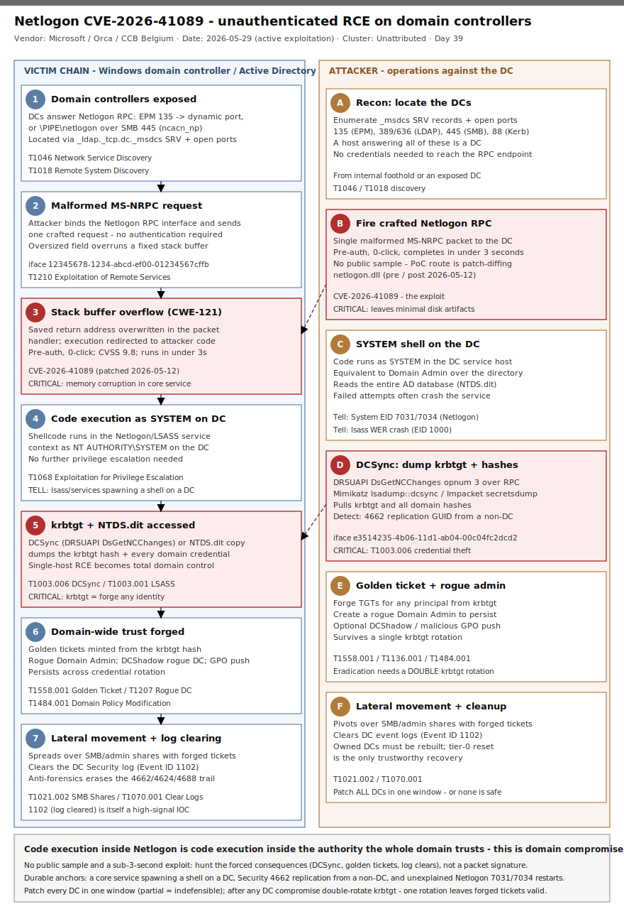

# Netlogon CVE-2026-41089 — unauthenticated 0-click stack-overflow RCE as SYSTEM on Windows domain controllers

## TL;DR

**CVE-2026-41089** is a critical (CVSS 9.8, AV:N/AC:L/PR:N/UI:N/C:H/I:H/A:H) **stack-based buffer overflow in the Windows Netlogon Remote Protocol (MS-NRPC)** packet-handling path on **domain controllers**. An unauthenticated attacker sends one specially crafted Netlogon RPC request to a DC (TCP/135 endpoint mapper → dynamic RPC endpoint, or the `\PIPE\netlogon` named pipe over SMB) and obtains **arbitrary code execution as SYSTEM** — no credentials, no user interaction, no phishing. Because Netlogon is the process the rest of the domain already trusts to make authentication decisions, code execution inside it is by definition a **domain-wide compromise**. Microsoft patched it in the **2026-05-12 Patch Tuesday** (discovered internally by the WARP team); Belgium's **CCB confirmed active in-the-wild exploitation on 2026-05-29**, and vendor write-ups (Orca, BleepingComputer, SecurityWeek, Help Net Security) followed 2026-06-01/02. All supported Windows Server releases — including Windows Server 2025 — are affected. The exploit runs in **under three seconds and leaves minimal disk artifacts**, so detection has to lean on Netlogon/LSASS service-health anomalies, abnormal SYSTEM-context child processes on DCs, and the standard post-DC-compromise tradecraft (DCSync, golden tickets) rather than a file hash.

## Attribution and confidence

- **Cluster:** unattributed. This is a commodity, internet-/intranet-wide critical vulnerability in a core Windows service; early hits are opportunistic and automated. Confidence on **who**: **low** (no named actor at time of writing). Confidence on the **vulnerability and active exploitation**: **high** (triangulated across Microsoft's advisory, Belgium CCB, Orca, BleepingComputer, SecurityWeek, Help Net Security).
- **Discovery / disclosure:** found internally by Microsoft's Windows Attack Research & Protection (WARP) team; patched 2026-05-12 (May Patch Tuesday, 118 CVEs / 16 critical). No public PoC or exploit sample was broadly available at time of writing; the route to a working exploit is patch-diffing the Netlogon fix.
- **Exploitation status (honest):** Belgium CCB publicly warned of active exploitation against domain controllers on **2026-05-29**. The vulnerability had **not yet been added to the U.S. CISA KEV catalog** at time of reporting. No victim count, sector breakdown, or operator attribution is public — treat as **actively exploited, attacker unknown**.

| Overlap dimension | Detail | Confidence |
|---|---|---|
| Vulnerability identity | CVE-2026-41089, Netlogon (MS-NRPC) stack buffer overflow, CWE-121 | high |
| Severity | CVSS 9.8 (AV:N/AC:L/PR:N/UI:N/C:H/I:H/A:H), RCE as SYSTEM, pre-auth | high |
| Affected systems | All supported Windows Server as domain controller, incl. Server 2025 | high |
| Active exploitation | Confirmed by Belgium CCB 2026-05-29 | high |
| Named threat actor | none | n/a |

**Genealogy with previous repo cases.** This is the repo's **first primary in slot #12 (DFIR Windows / AD)**. It was foreshadowed as a secondary in `2026-06-04_Kirki-CVE-2026-8206-WP-AccountTakeover` ("a separate, higher-blast-radius bug worth its own primary"). Protocol-wise it is the memory-corruption successor to **Zerologon (CVE-2020-1472)** — same Netlogon protocol, entirely different bug class (Zerologon was an AES-CFB8 IV cryptographic flaw enabling auth bypass; this is a stack overflow in packet parsing). The post-exploitation tail (DCSync, golden tickets) overlaps thematically with the AD credential-theft tradecraft referenced in `2026-05-06_CodeOfConduct-AiTM-Storm-1747` (identity-plane takeover) — but this case starts one layer lower, at raw memory corruption in the DC itself.

## Kill chain — summary table

| Stage | MITRE | Detail |
|---|---|---|
| Reconnaissance | T1046, T1018 | Locate domain controllers: TCP/135 (EPM), 389/636 (LDAP), 445 (SMB), and `_ldap._tcp.dc._msdcs.<domain>` SRV records |
| Exploitation | T1210 | Single unauthenticated crafted MS-NRPC request to the DC's Netlogon RPC endpoint triggers the stack buffer overflow |
| Execution / Privilege | T1068 | Shellcode executes in the Netlogon/LSASS service context as **SYSTEM** on the DC |
| Credential Access | T1003.006, T1003.001 | DCSync (DRSUAPI `DsGetNCChanges`) or LSASS access dumps **krbtgt** + every domain hash from `NTDS.dit` |
| Domain domination | T1558.001, T1207, T1484.001 | Forge golden tickets, optionally DCShadow a rogue DC, modify GPOs |
| Persistence (account) | T1136.001 | Create a rogue domain administrator to survive credential rotation |
| Lateral movement / cleanup | T1021.002, T1070.001 | Spread via SMB/admin shares with forged tickets; clear DC event logs (EID 1102) |



The diagram is a two-lane flow (Template A): the **left lane** is the victim domain controller / AD plane (exposed Netlogon RPC → malformed packet → stack overflow → SYSTEM → `NTDS.dit`/krbtgt → domain-wide trust forged → logs cleared); the **right lane** is the attacker operation (locate DCs → fire the crafted RPC → SYSTEM shell → DCSync → golden ticket + rogue admin → lateral movement + cleanup). The red badges mark the two highest-blast-radius points — the **buffer overflow** in Netlogon packet parsing and the **krbtgt / NTDS.dit** access that turns a single-host RCE into total domain control.

## Stage-by-stage detail

### Reconnaissance — locate the domain controllers (T1046, T1018)

DCs advertise themselves. An attacker on the network (or with any internal foothold) enumerates them via service ports and DNS service records:

```
# DNS service-record discovery
_ldap._tcp.dc._msdcs.<domain>      SRV ->  dc01.<domain>
nslookup -type=SRV _ldap._tcp.dc._msdcs.<domain>

# Port-based confirmation (a DC answers all of these)
135/tcp  RPC endpoint mapper (EPM)
389/tcp  LDAP    636/tcp LDAPS    445/tcp SMB    88/tcp Kerberos
```

The Netlogon RPC endpoint is reachable either as a dynamic TCP port handed out by the EPM on 135 (`ncacn_ip_tcp`) or as the `\PIPE\netlogon` named pipe over SMB on 445 (`ncacn_np`).

### Exploitation — the Netlogon stack overflow (T1210)

Root cause is a **stack-based buffer overflow (CWE-121) in the Netlogon service's packet-handling logic** in MS-NRPC. The attacker binds to the Netlogon RPC interface and sends a single malformed request whose length/contents are mishandled when copied into a fixed-size stack buffer, overwriting the saved return address and redirecting execution. No authentication exchange is required to reach the vulnerable parser — the overflow happens during request handling, before any credential validation.

```
Netlogon RPC interface UUID:  12345678-1234-abcd-ef00-01234567cffb  (MS-NRPC)
Transport:                    ncacn_ip_tcp (dyn port via EPM 135) | ncacn_np (\PIPE\netlogon, SMB 445)
Trigger:                      one crafted Netlogon request; oversized/malformed field overruns a stack buffer
Result:                       saved return address overwritten -> attacker-controlled execution
```

The full memory-corruption primitive (exact opnum, field, and any ASLR/stack-cookie bypass) is **not public** — this analysis treats the bug at the level the vendor advisories disclose. The route to weaponisation is a binary diff of the patched `netlogon.dll` against the pre-2026-05-12 build.

### Execution / Privilege — SYSTEM on the DC (T1068)

Netlogon runs inside a SYSTEM-level service host on the domain controller. Successful exploitation yields **arbitrary code execution as `NT AUTHORITY\SYSTEM` on a DC** — the single most privileged position in an Active Directory forest. From here the attacker needs no further privilege escalation; a DC SYSTEM context can read the entire directory database.

```
# The tell on the host: a SYSTEM-context shell/LOLBin whose parent is a core service
# process (lsass.exe / services.exe / the Netlogon svchost) on a machine that is a DC.
lsass.exe  ->  cmd.exe / powershell.exe / rundll32.exe     (should NEVER happen on a DC)
```

### Credential Access — krbtgt and the whole domain (T1003.006, T1003.001)

With SYSTEM on a DC, the attacker harvests credentials two standard ways:

```
# (a) DCSync over the wire — DRSUAPI DsGetNCChanges replication pull
#     MS-DRSR interface e3514235-4b06-11d1-ab04-00c04fc2dcd2, opnum 3
#     (Mimikatz lsadump::dcsync /domain:<d> /user:krbtgt ; Impacket secretsdump)

# (b) Direct LSASS / NTDS.dit extraction on the DC
ntdsutil "ac i ntds" "ifm" "create full C:\temp\ifm" q q
# or reg save of SYSTEM hive + NTDS.dit copy via VSS
```

The crown jewel is the **krbtgt** account hash: with it the attacker mints Kerberos golden tickets and impersonates any principal in the domain indefinitely.

### Domain domination and persistence (T1558.001, T1207, T1484.001, T1136.001)

```
# Golden ticket (forge a TGT for any user, incl. non-existent admins)
kerberos::golden /user:Administrator /domain:<d> /sid:<S-1-5-21-...> /krbtgt:<hash> /ptt

# Rogue domain admin to survive krbtgt rotation
net user svc_backup <pw> /add /domain ; net group "Domain Admins" svc_backup /add /domain
```

DCShadow (T1207) registers a rogue DC to push directory changes stealthily; GPO modification (T1484.001) pushes code to every domain-joined host.

### Lateral movement and cleanup (T1021.002, T1070.001)

The attacker pivots across the domain over SMB/admin shares with forged tickets, then clears the DC's Security event log to erase the 4662/4624/4688 trail:

```
wevtutil cl Security      # generates Event ID 1102 (audit log cleared) — itself a high-signal IOC
```

## Detection strategy

### Telemetry that matters

- **Service / system health on DCs**: Service Control Manager **EID 7031/7034** (Netlogon service crashed/restarted unexpectedly) and Application Error **EID 1000/1001 / WER** for `lsass.exe` or the Netlogon svchost. A failed or partially successful overflow attempt frequently crashes the service before it succeeds — on a DC, an unexplained Netlogon restart is worth a look.
- **Process creation on DCs** (Sysmon EID 1 / Security 4688 / Defender `DeviceProcessEvents`): any shell or LOLBin (`cmd`, `powershell`, `rundll32`, `cscript`, `mshta`) whose parent is `lsass.exe`, `services.exe`, or the Netlogon-hosting `svchost.exe`. This essentially never happens benignly on a domain controller and is the clearest post-exploit tell.
- **Directory access for replication** (Security **4662**): `DsGetNCChanges` replication rights (`DS-Replication-Get-Changes` `1131f6aa-9c07-11d1-b9c5-00805f88ce4` family) requested by a principal that is **not a domain controller computer account** = DCSync.
- **Netlogon enhanced logging (EID 5827–5831)**: enable it for baseline (these are the Zerologon-era "vulnerable Netlogon connection" events). Honest caveat — they were designed for the *cryptographic* Netlogon flaw, not a memory-corruption RCE, so do not rely on them as the primary signal for CVE-2026-41089.
- **Network**: inbound Netlogon RPC (interface UUID above) and DRSUAPI `DsGetNCChanges` from sources that are not legitimate DCs/admin infrastructure.

### Detection coverage

| Engine | File | Logic |
|---|---|---|
| Sigma | `sigma/01_netlogon_dc_anomalous_child_process.yml` | process_creation: core service process (lsass/services/svchost) spawning a shell/LOLBin (post-exploit SYSTEM execution on a DC) |
| Sigma | `sigma/02_netlogon_service_crash_restart.yml` | windows/system: SCM EID 7031/7034 for service `Netlogon` (overflow attempt crash/restart) |
| Sigma | `sigma/03_dcsync_replication_nondc.yml` | windows/security: EID 4662 with DS-Replication property GUIDs (DCSync follow-on) |
| KQL | `kql/k1_netlogon_dc_lsass_child.kql` | Defender XDR: `DeviceProcessEvents` — lsass/services/svchost spawning shells/LOLBins on DC-role devices |
| KQL | `kql/k2_dcsync_4662_replication.kql` | Sentinel `SecurityEvent` — 4662 replication GUID from a non-DC account |
| KQL | `kql/k3_netlogon_service_crash.kql` | Sentinel `Event`/`SecurityEvent` — SCM 7031/7034 Netlogon restart + WER lsass crash on DCs |
| KQL | `kql/k4_dc_inbound_rpc_anomaly.kql` | Defender XDR: `DeviceNetworkEvents` — inbound 135/445/dynamic-RPC to DCs from unexpected source ranges |
| YARA | `yara/dc_postexploit_tooling.yar` | 2 rules — DCSync/Mimikatz command strings + Impacket secretsdump/DRSUAPI tool markers (follow-on, not exploit-specific) |
| Suricata | `suricata/netlogon_cve_2026_41089.rules` | 3 sids — DRSUAPI `DsGetNCChanges` (DCSync wire), Netlogon RPC interface to a DC, `\netlogon` named pipe over SMB |

No SPL is shipped (retired repo-wide 2026-05-11); convert any Sigma with `sigma convert -t splunk -p sysmon <rule>.yml` if needed.

### Threat hunting hypotheses

- **H1 — SYSTEM-context shell from a core service on a DC (PEAK):** `hunts/peak_h1_dc_lsass_child_process.md`. Hypothesis: if exploited, a DC's `lsass.exe`/`services.exe`/Netlogon `svchost.exe` spawned a shell or LOLBin as SYSTEM. Near-zero FP on a domain controller.
- **H2 — DCSync from a non-DC principal (PEAK):** `hunts/peak_h2_dcsync_from_nondc.md`. Hypothesis: post-compromise, replication rights (`DsGetNCChanges`) were exercised by an account that is not a DC computer account, since the patch date 2026-05-12.
- **H3 — Netlogon service instability correlated with new SYSTEM activity (PEAK):** `hunts/peak_h3_netlogon_crash_correlation.md`. Hypothesis: an unexplained Netlogon/LSASS crash-restart on a DC was followed within minutes by anomalous SYSTEM process creation or outbound connections.

## Incident response playbook

### First 60 minutes (triage)

1. Inventory domain controllers and their patch state: confirm the 2026-05 cumulative update (CVE-2026-41089 fix) is installed on **every** DC — partial patching leaves an indefensible state. `Get-HotFix` / WSUS / `systeminfo` per DC.
2. If any DC is unpatched and internet- or broadly-reachable on 135/445, restrict Netlogon RPC source addresses (host firewall / segmentation) to legitimate DCs and admin tier-0 immediately, then patch.
3. Pull DC Security/System logs since 2026-05-12: SCM 7031/7034 for Netlogon, WER/1000 for lsass, 4662 replication-rights events, 4688 with parent lsass/services/svchost, 1102 (log cleared).
4. Hunt for DCSync from non-DC principals and for golden-ticket signs (TGTs with anomalous lifetimes, mismatched encryption types).
5. If compromise is confirmed on any DC, **assume domain compromise**: plan a **double krbtgt rotation** and tier-0 credential reset (do not single-rotate).

### Artifacts to collect

| Artifact | Path | Tool | Why |
|---|---|---|---|
| Security event log | `%SystemRoot%\System32\winevt\Logs\Security.evtx` | EvtxECmd / wevtutil | 4662 DCSync, 4624/4672 SYSTEM logons, 1102 clears |
| System event log | `...\winevt\Logs\System.evtx` | EvtxECmd | SCM 7031/7034 Netlogon crash/restart |
| WER / crash dumps | `C:\ProgramData\Microsoft\Windows\WER\**`, `%WinDir%\Minidump` | triage collector | LSASS/Netlogon crash evidence from overflow attempts |
| NTDS.dit access trail | DC, `%WinDir%\NTDS\ntds.dit` (do not exfil) | timeline | VSS/IFM copies, ntdsutil traces |
| Process/network telemetry | Defender XDR / Sysmon | KQL / Sysmon EVTX | lsass→shell, inbound RPC anomalies |
| Memory (if live) | DC RAM | WinPMEM / Velociraptor | In-memory shellcode, injected threads before reboot |

### IR queries and commands

```powershell
# DCs missing the May-2026 cumulative update (adjust KB to your build/channel)
Get-ADDomainController -Filter * | ForEach-Object {
  $kb = Get-HotFix -ComputerName $_.HostName -ErrorAction SilentlyContinue |
        Sort-Object InstalledOn -Descending | Select-Object -First 1
  [pscustomobject]@{ DC=$_.HostName; LastHotFix=$kb.HotFixID; Installed=$kb.InstalledOn }
}

# Netlogon service restarts on a DC (overflow attempt tell)
Get-WinEvent -FilterHashtable @{LogName='System'; Id=7031,7034} |
  Where-Object { $_.Message -match 'Netlogon' } |
  Select-Object TimeCreated, Id, Message
```

```kql
// Core service process spawning a shell on a domain controller (Defender XDR)
DeviceProcessEvents
| where DeviceName in (DomainControllers)   // maintain a DC watchlist
| where InitiatingProcessFileName in~ ("lsass.exe","services.exe","svchost.exe")
| where FileName in~ ("cmd.exe","powershell.exe","pwsh.exe","rundll32.exe","cscript.exe","wscript.exe","mshta.exe")
| project Timestamp, DeviceName, InitiatingProcessFileName, FileName, ProcessCommandLine, AccountName
```

### Containment, eradication, recovery

- **Containment:** patch all DCs in the same maintenance window; restrict Netlogon RPC reachability to tier-0; isolate any DC with confirmed anomalous SYSTEM activity.
- **Eradication:** **double-rotate krbtgt** (twice, with replication convergence between), reset all tier-0 / Domain Admin credentials and the DC machine-account passwords, remove rogue admin accounts and malicious GPOs, rebuild any DC where SYSTEM-level execution is confirmed (a compromised DC is not cleanable in place with confidence).
- **Exit criteria:** every DC patched; no 4662 replication from non-DC principals; krbtgt rotated twice post-eradication; no rogue tier-0 accounts; no unexplained Netlogon/LSASS crashes recurring.
- **What NOT to do:** do not patch only the "exposed" DCs — partial patching is indefensible; do not single-rotate krbtgt (forged tickets survive one rotation); do not treat absence of a file IOC as all-clear (the exploit drops little to disk); do not trust a once-SYSTEM-compromised DC after a simple AV scan.

### Recovery validation

Confirm all DCs report the fixed build; replay benign Netlogon authentication and confirm normal operation; verify two krbtgt rotations with successful replication; re-run the 4662-non-DC and lsass-child hunts for 14 days; watch DC System logs for any recurrence of Netlogon 7031/7034.

## IOCs

This is a memory-corruption vulnerability with **no public exploit sample and no fixed network payload**; the attacker's source IP and packet bytes are not published. The table below is detection-anchoring context (protocol identifiers, Event IDs, dates, behaviour) — **not blocklist material**. Full list in `iocs.csv`.

| Type | Value | Context | Confidence | Source |
|---|---|---|---|---|
| cve | CVE-2026-41089 | Netlogon (MS-NRPC) stack buffer overflow, RCE as SYSTEM on DCs, CVSS 9.8 | high | Microsoft/NVD |
| note | Patched 2026-05-12 (May Patch Tuesday); hunt from this date | Silent fix precedes public PoC; patch-gap window | high | Microsoft |
| note | Active exploitation confirmed 2026-05-29 (Belgium CCB) | In-the-wild against domain controllers | high | CCB Belgium |
| string | 12345678-1234-abcd-ef00-01234567cffb | Netlogon (MS-NRPC) RPC interface UUID (exploit channel) | high | MS-NRPC spec |
| string | e3514235-4b06-11d1-ab04-00c04fc2dcd2 | DRSUAPI (MS-DRSR) interface UUID; opnum 3 = DsGetNCChanges (DCSync) | high | MS-DRSR spec |
| string | 1131f6aa-9c07-11d1-b9c5-00805f88ce4 | DS-Replication-Get-Changes property GUID (4662 DCSync detection) | high | MS-ADTS |
| note | lsass.exe/services.exe/svchost.exe spawning cmd/powershell on a DC | Post-exploit SYSTEM execution tell (~0% FP on DC) | high | analysis |
| note | System EID 7031/7034 for service Netlogon | Service crash/restart from overflow attempt | medium | analysis |
| note | Security EID 4662 replication rights from non-DC account | DCSync follow-on | high | analysis |
| note | Security EID 1102 (audit log cleared) on a DC | Anti-forensics cleanup | medium | analysis |
| port | 135/tcp, 445/tcp + dynamic RPC | Netlogon RPC reachability (EPM, named pipe) | high | analysis |

## Secondary findings

- **Vulnerability class — stack overflow vs the Zerologon lineage (#28 memory corruption / exploit dev).** CVE-2026-41089 is the *memory-corruption* counterpart to **Zerologon (CVE-2020-1472)**: same Netlogon protocol, but Zerologon was an AES-CFB8 IV cryptographic auth-bypass while this is a CWE-121 stack overflow in request parsing. That difference matters for detection — Zerologon left a distinctive `NetrServerAuthenticate` pattern and dedicated Event IDs (5827–5831); a buffer overflow leaves a *crash* and post-exploit SYSTEM behaviour, not a clean protocol signature. The practical exploit-dev takeaway: the public starting point is a binary diff of the patched `netlogon.dll`, and any working PoC must defeat modern stack cookies/ASLR/CFG — expect a delay between patch (2026-05-12) and reliable public exploitation, which the early in-the-wild activity (2026-05-29) suggests well-resourced operators already crossed.
- **Detection without IOCs (#24 CTI tradecraft / #25 detection engineering).** With a <3-second, low-artifact, pre-auth exploit and no published sample, hash/YARA-first thinking fails. The durable detections here are all *behavioural and structural*: a core service spawning a shell on a DC, replication rights used by a non-DC principal, and Netlogon service instability. These survive payload changes because they describe what total DC control *forces* an attacker to do next, not what one campaign happened to drop.
- **Patch-all-DCs-or-none operational reality (#12 DFIR Windows/AD).** Because any single unpatched DC is a domain-wide foothold, partial patching creates an indefensible state — the May-2026 guidance from multiple advisories is explicit that all DCs must be patched in the same maintenance window. This is the AD-tier-0 analogue of the "one weak link" problem and a recurring IR finding: organisations that staged DC patching left a live target the whole time.

## Pedagogical anchors

- **A memory-corruption RCE in a trusted service is a blast-radius problem, not a host problem.** Code execution inside Netlogon is code execution inside the authority the whole domain trusts; "RCE on one server" understates it — it is "domain compromise". Model detections and IR around the *forest*, not the box.
- **Detect the consequences, not the exploit.** When the exploit is a sub-second malformed packet with no sample, you cannot fingerprint it — but you can fingerprint what an attacker must do *after* it: DCSync, golden tickets, rogue admins, log clearing. Anchor on those forced post-conditions.
- **krbtgt must be rotated twice.** A single rotation leaves previously forged golden tickets valid through one password-history slot. After any confirmed DC compromise, double-rotate krbtgt with replication convergence between — single-rotation is a classic incomplete-eradication mistake.
- **Hunt from the patch date, not the disclosure date.** The fix shipped 2026-05-12; public attention and rules came ~2026-06-01. Silent fixes are reverse-engineered first; the defensible hunting window opens on patch day.
- **Enhanced logging tuned for last year's bug is not coverage for this year's.** Netlogon EID 5827–5831 were built for Zerologon's cryptographic flaw; enabling them is good hygiene but they do not detect a buffer overflow. Match telemetry to the actual bug class.

## What's in this folder

| File | Purpose |
|---|---|
| `README.md` | This analysis. |
| `kill_chain.svg` | Two-lane (Template A) DC-plane vs attacker-ops kill chain. |
| `sigma/01_netlogon_dc_anomalous_child_process.yml` | process_creation Sigma: core service spawning a shell on a DC. |
| `sigma/02_netlogon_service_crash_restart.yml` | windows/system Sigma: Netlogon SCM 7031/7034. |
| `sigma/03_dcsync_replication_nondc.yml` | windows/security Sigma: 4662 DCSync replication GUID. |
| `kql/k1_netlogon_dc_lsass_child.kql` | Defender XDR: lsass/services/svchost spawning shells on DCs. |
| `kql/k2_dcsync_4662_replication.kql` | Sentinel: 4662 replication from a non-DC account. |
| `kql/k3_netlogon_service_crash.kql` | Sentinel: Netlogon 7031/7034 + lsass WER on DCs. |
| `kql/k4_dc_inbound_rpc_anomaly.kql` | Defender XDR: inbound RPC/SMB to DCs from unexpected ranges. |
| `yara/dc_postexploit_tooling.yar` | 2 YARA rules for post-DC-compromise tooling (DCSync/Impacket markers). |
| `suricata/netlogon_cve_2026_41089.rules` | 3 Suricata sids: DCSync wire, Netlogon RPC, `\netlogon` SMB pipe. |
| `hunts/peak_h1_dc_lsass_child_process.md` | PEAK hunt: SYSTEM shell from a core service on a DC. |
| `hunts/peak_h2_dcsync_from_nondc.md` | PEAK hunt: DCSync from a non-DC principal. |
| `hunts/peak_h3_netlogon_crash_correlation.md` | PEAK hunt: Netlogon crash correlated with SYSTEM activity. |
| `iocs.csv` | Detection-anchoring context rows (CVE, protocol UUIDs, Event IDs, notes). |

## Sources

- [Help Net Security — Windows Netlogon RCE exploited, domain controllers at risk (CVE-2026-41089)](https://www.helpnetsecurity.com/2026/06/01/windows-netlogon-rce-exploited-cve-2026-41089/)
- [BleepingComputer — Critical Windows Netlogon remote code execution flaw now exploited in attacks](https://www.bleepingcomputer.com/news/microsoft/critical-windows-netlogon-remote-code-execution-flaw-now-exploited-in-attacks/)
- [SecurityWeek — Critical Windows Netlogon Vulnerability in Attackers' Crosshairs](https://www.securityweek.com/critical-windows-netlogon-vulnerability-in-attackers-crosshairs/)
- [Orca Security — Netlogon RCE CVE-2026-41089 Flaw](https://orca.security/resources/blog/netlogon-rce-cve-2026-41089/)
- [CCB Belgium — Warning: Microsoft Patch Tuesday May 2026 patches 118 vulnerabilities](https://ccb.belgium.be/advisories/warning-microsoft-patch-tuesday-may-2026-patches-118-vulnerabilities-16-critical-102)
- [Cybersecurity News — Windows Netlogon 0-Click RCE Vulnerability Now Actively Exploited In The Wild](https://cybersecuritynews.com/windows-netlogon-0-click-rce/)
- [IT-Connect — CVE-2026-41089 in Windows Server: Netlogon Exploit Alert](https://www.it-connect.tech/windows-server-cve-2026-41089-critical-netlogon-flaw-is-being-exploited/)
- [NVD — CVE-2026-41089](https://nvd.nist.gov/vuln/detail/cve-2026-41089)
