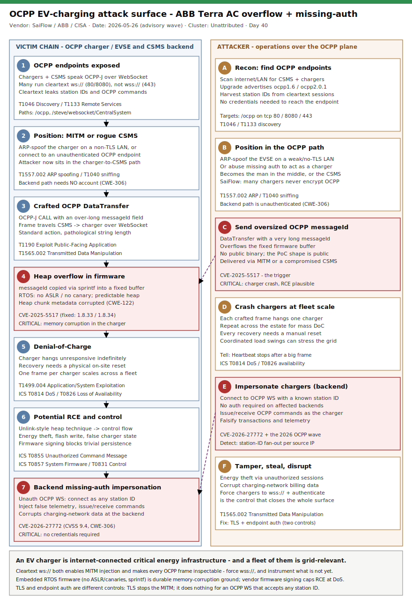

# OCPP EV-Charging Attack Surface - ABB Terra AC Heap Overflow (CVE-2025-5517) and the OCPP WebSocket Missing-Auth Class

## TL;DR

EV charging is now critical energy infrastructure, and its control plane - the Open Charge
Point Protocol (OCPP, JSON over WebSocket) - is dangerously exposed. SaiFlow's reverse
engineering of the ABB Terra AC wallbox uncovered CVE-2025-5517: an over-long OCPP
`DataTransfer` `messageId` is copied with `sprintf` into a fixed-size buffer, overflowing
the heap and crashing the charger into an indefinite Denial-of-Charge (RCE assessed
plausible). CISA published the advisory wave around 2026-05-26 (ICSA-26-146-01 / -141-05),
which is the why-today. In parallel, a 2026 cluster of CISA advisories (EV.energy
CVE-2026-27772, CVSS 9.4, plus CloudCharge, EV2GO, Chargemap, Mobility46) shows the
dominant systemic flaw is missing authentication on the OCPP WebSocket (CWE-306): anyone
who knows a station ID can impersonate a charger. The actor is unattributed - this is a
vulnerability-class case spanning embedded firmware and cloud backends, and the first repo
primary in taxonomy slot #33 (Automotive / EV).

## Attribution and confidence

There is no threat-actor attribution: both the ABB overflow and the OCPP-backend
missing-auth findings are coordinated-disclosure vulnerability research, not an observed
intrusion. Confidence is therefore split: **low** on any "campaign" framing (no actor, no
victim list, no in-the-wild exploitation confirmed at time of writing) and **high** on the
vulnerabilities themselves, which are triangulated across the original researcher, the
vendor, and CISA.

| Finding | Identifier | Source / date | Confidence |
|---|---|---|---|
| ABB Terra AC heap overflow (OCPP DataTransfer messageId) | CVE-2025-5517 | SaiFlow (Nov 2025); ABB advisory 9AKK108471A8948; CISA ICSA-26-146-01 / -141-05 (~2026-05-26) | high (vuln) |
| OCPP WebSocket missing authentication, station impersonation | CVE-2026-27772 | CISA ICSA-26-057-07 (EV.energy); NVD; CVSS 9.4 CWE-306 | high (vuln) |
| Broader OCPP-backend missing-auth wave | ICSA-26-057-03/-04/-05/-08 et al. | CISA (CloudCharge, EV2GO, Chargemap, Mobility46) | medium (class) |
| Any in-the-wild exploitation / threat actor | n/a | none found | low (none observed) |

**Genealogy with previous repo cases.** This is the first EV/automotive case in the repo,
but it rhymes with prior critical-infrastructure and memory-corruption entries: the OT/ICS
exposure thread (`2026-05-03_BAUXITE-CyberAvengers-AA26-097A`, `2026-05-10_Mexico-Water-AI-Assisted-OT`,
`2026-05-31_BlackShadow-AbabilOfMinab-Recovery-Layer-Destruction`) and the
memory-corruption deep-dives (`2026-05-29_MiniPlasma-CVE-2020-17103...`,
`2026-06-05_Netlogon-CVE-2026-41089-DC-RCE`). The detection philosophy is the same as the
recent logic-bug/no-sample days (Kirki, Netlogon): no fixed payload, so the durable anchors
are protocol- and behaviour-based.

## Kill chain — summary table

| Stage | MITRE | Detail |
|---|---|---|
| Discover exposed OCPP endpoints | T1046, T1133 | Internet/LAN scan for CSMS and chargers speaking OCPP; cleartext `ws://` exposes station IDs |
| Position: MITM or rogue/compromised CSMS | T1557.002, T1040 | ARP-spoof on non-TLS LAN, or abuse CWE-306 to connect as a charger |
| Inject crafted OCPP message | T1190, T1565.002 | Send DataTransfer with an over-long `messageId` over the OCPP WebSocket |
| Heap buffer overflow in firmware | T1190 (CWE-122) | `sprintf` into a fixed buffer; RTOS lacks ASLR/canaries; heap chunk corruption |
| Impact: Denial-of-Charge | T1499.004, T0814, T0826 | Charger hangs indefinitely; manual on-site reset required |
| Impact: RCE / control | T0855, T0857, T0831 | Potential code exec -> flash write, energy theft, unauthorized commands |
| Systemic: fleet coordination | T0826 | Coordinated DoC / load swings; data corruption reported to the backend |



The left lane is the victim plane (the OCPP charger/EVSE and the CSMS backend it trusts);
the right lane is the attacker operation (recon, positioning via MITM or rogue CSMS, the
crafted OCPP frame, and the overflow/impersonation outcomes). The two critical-marked nodes
are the heap overflow in the charger firmware and the missing-auth station impersonation on
the backend - the two roots of the whole attack surface. Detection anchors live at the
protocol boundary: cleartext OCPP transport, OCPP WebSocket upgrades without authorization,
and oversized OCPP fields.

## Stage-by-stage detail

### Stage 1 - Discover exposed OCPP endpoints

Chargers and their Charging Station Management System (CSMS, also CPMS) talk OCPP over a
WebSocket. Internet-exposed CSMS backends and chargers are enumerable, and a great many run
cleartext `ws://` rather than `wss://`. Cleartext leaks the station identifier and every
OCPP command in transit.

```
# Indicative discovery (defensive inventory, not weaponized):
#   - OCPP endpoints often live at /ocpp, /ocpp/<stationId>, /steve/websocket/CentralSystemService
#   - WebSocket upgrade advertises  Sec-WebSocket-Protocol: ocpp1.6  (or ocpp2.0.1)
#   - Cleartext on tcp/80 or tcp/8080; TLS on tcp/443
```

MITRE: **T1046 Network Service Discovery**, **T1133 External Remote Services**.

### Stage 2 - Position: adversary-in-the-middle or rogue/compromised CSMS

CVE-2025-5517 requires either a compromised CSMS or a man-in-the-middle on non-TLS OCPP.
SaiFlow notes the MITM can be as simple as unplugging an Ethernet cable and inserting a
device, or joining a weakly-secured charger LAN and ARP-spoofing the charger so the attacker
host appears to be its gateway. The backend-side equivalent is the CWE-306 class: where the
OCPP WebSocket endpoint requires no authentication, an attacker simply connects as a charger.

```
# MITM precondition (SaiFlow): ARP-spoof the EVSE on a non-TLS LAN so the attacker
# sits between charger and CSMS, then rewrite/inject OCPP frames.
```

MITRE: **T1557.002 Adversary-in-the-Middle: ARP Cache Poisoning**, **T1040 Network
Sniffing**; backend path **T1078 Valid Accounts** is *not* required - missing auth means no
account at all.

### Stage 3 - Inject a crafted OCPP message

The malicious frame is a standard OCPP-J CALL whose `messageId` (inside a `DataTransfer`)
is pathologically long. This is the exact PoC shape SaiFlow published:

```javascript
[
  2,
  "msg-id-0",
  "DataTransfer",
  {
    "messageId": "sdfgf...f",            // very long input -> overflow
    "vendorId": "vendor-id",
    "data": "{ \"type\": \"RemoteControl\", \"cmd\": \"\", \"raw\": \"\" }"
  }
]
```

The frame travels from the CSMS to the charger (EVSE) over the OCPP WebSocket.

MITRE: **T1190 Exploit Public-Facing Application**, **T1565.002 Transmitted Data
Manipulation** (when delivered via MITM).

### Stage 4 - Heap buffer overflow in firmware

SaiFlow reverse-engineered the packaged firmware (FreeRTOS-based; package header carries a
version marker, CRC32, and a vendor signature) and found the `messageId` string copied via
`sprintf` into a fixed-size buffer - a textbook heap overflow (CWE-122). RTOS firmware
typically ships without ASLR or stack canaries and uses deterministic allocator placement,
so an attacker can overwrite adjacent heap chunk metadata and, via standard unlink-style
techniques, pivot a write primitive toward control-flow hijack.

```
# Vulnerable pattern (conceptual):  sprintf(fixed_buf, "%s", attacker_messageId);
# RTOS: no ASLR / no stack canary; predictable heap layout -> overflow -> chunk metadata
# corruption -> arbitrary write -> potential RCE.
# Mitigating factor: ABB SIGNS firmware packages, so a compromised backend cannot trivially
# flash a malicious image; the immediate, proven impact is the crash (DoS).
```

MITRE: **T1190** (memory-corruption exploitation; CWE-122 heap-based buffer overflow).

### Stage 5 - Impact: Denial-of-Charge

In SaiFlow's testing the overflow left the firmware unresponsive indefinitely. Recovery
requires personnel to physically visit the site and manually reset the charger. A single
crafted frame per charger, repeated across a fleet, is a scalable, persistent
Denial-of-Charge (DoC).

MITRE: **T1499.004 Application or System Exploitation**; ICS **T0814 Denial of Service**,
**T0826 Loss of Availability**.

### Stage 6 - Impact: potential RCE and control

If weaponized to RCE rather than just DoS, the consequences escalate to unauthorized charging
sessions (energy theft), tampering with the charger's reported state, writing to flash to
alter firmware behaviour, and - per the Princeton MadIoT research SaiFlow cites - using a
large enough population of high-wattage chargers as a botnet to shift grid frequency past
generator cut-off thresholds.

MITRE (ICS): **T0855 Unauthorized Command Message**, **T0857 System Firmware**, **T0831
Manipulation of Control**.

### Stage 7 - Systemic: backend missing-auth and fleet effects

The OCPP-backend advisory wave (EV.energy CVE-2026-27772 and peers) is the other half of the
attack surface: an unauthenticated WebSocket lets an attacker impersonate any charger by
station ID, inject false telemetry, issue/receive OCPP commands, and corrupt the charging
network's data. Combined with the embedded overflow, an attacker who reaches the OCPP plane
can both impersonate chargers (backend) and crash/control them (firmware).

MITRE (ICS): **T0826 Loss of Availability**; enterprise **T1565.002 Transmitted Data
Manipulation**.

## RE notes

| Component | SHA256 | Lang | Packer | Notes |
|---|---|---|---|---|
| ABB Terra AC firmware (analyzed) | not publicly released | C (FreeRTOS) | vendor-signed package (version marker `00 01 08 03`, CRC32, signature) | Two-segment packaged image; load offset found via VTOR (`0xe000ed08`) / `xTaskCreate`; JSON parser + libc `sprintf` reachable from OCPP handler |

No exploit binary or charger firmware image is public. The overflow is in the OCPP message
path: a JSON `messageId` flows unbounded into `sprintf(fixed_buf, ...)`. Anti-analysis is
minimal (it is embedded firmware, not malware) but exploitation is constrained by the RTOS
lacking modern mitigations on one hand, and ABB's firmware signing blocking persistent
flash implants on the other. The cipher/transport story is the inverse of malware analysis:
the *absence* of TLS (`ws://`) is what makes both MITM injection and IDS detection possible.

## Detection strategy

### Telemetry that matters

- **Network (passive sensor / Zeek / Suricata):** WebSocket upgrades carrying
  `Sec-WebSocket-Protocol: ocpp*`; OCPP frames on cleartext 80/8080; oversized OCPP fields.
  This is the highest-value source - on cleartext OCPP the whole protocol is inspectable.
- **CSMS application logs (`Syslog`/app logs):** OCPP frame contents, station IDs,
  `Heartbeat`/`StatusNotification` cadence (gaps = crash), field lengths.
- **Reverse proxy / WAF (`CommonSecurityLog`):** upgrade requests to OCPP paths, presence or
  absence of `Authorization`, station-ID fan-out per source IP.
- **Endpoint on the CSMS host (`DeviceProcessEvents` / `DeviceNetworkEvents`):** backend
  process ancestry (a CSMS spawning a shell), cleartext OCPP egress/ingress.

### Detection coverage

| Engine | File | Logic |
|---|---|---|
| Sigma | `sigma/01_ocpp_cleartext_websocket_exposure.yml` | network_connection: OCPP comms to a CSMS on cleartext 80/8080 (MITM precondition / exposure) |
| Sigma | `sigma/02_ocpp_websocket_upgrade_unauthenticated.yml` | webserver: OCPP-subprotocol WebSocket upgrade to an OCPP path with no Authorization (CWE-306) |
| Sigma | `sigma/03_csms_backend_shell_spawn.yml` | process_creation: CSMS/OCPP backend process spawning a shell or network tool (post-exploitation) |
| KQL | `kql/k1_ocpp_cleartext_exposure.kql` | DeviceNetworkEvents: cleartext OCPP sessions to/from CSMS hosts |
| KQL | `kql/k2_ocpp_station_id_fanout.kql` | CommonSecurityLog: many distinct station IDs from one source (impersonation/enumeration) |
| KQL | `kql/k3_ocpp_oversized_datatransfer_field.kql` | Syslog: OCPP DataTransfer/BootNotification with an over-long messageId/vendorId (overflow attempt) |
| KQL | `kql/k4_csms_backend_anomalous_child.kql` | DeviceProcessEvents: CSMS backend (java/node/python) spawning cmd/sh/powershell/curl |
| YARA | `yara/ocpp_ev_charging.yar` | 2 rules: oversized OCPP DataTransfer field; cleartext OCPP session indicators (capture/memory heuristics) |
| Suricata | `suricata/ocpp_ev_charging.rules` | 3 sids: cleartext OCPP upgrade (2606001); oversized DataTransfer messageId / CVE-2025-5517 (2606002); OCPP upgrade without Authorization (2606003) |

### Threat hunting hypotheses

- **H1 - Cleartext OCPP transport inventory** (`hunts/peak_h1_cleartext_ocpp_inventory.md`):
  find every charger/CSMS link still on `ws://`; that state is the MITM precondition.
- **H2 - Station impersonation against the CSMS** (`hunts/peak_h2_ocpp_station_impersonation.md`):
  hunt station-ID fan-out, unknown station IDs, and unauthenticated upgrades (CWE-306).
- **H3 - Charger crash / DoC correlation** (`hunts/peak_h3_charger_dos_bof_correlation.md`):
  tie oversized OCPP fields to chargers that then go silent (the overflow signature).

## Incident response playbook

### First 60 minutes (triage)

1. Confirm transport: is OCPP running cleartext (`ws://` 80/8080) anywhere? If yes, that is
   the active exposure to contain first.
2. Identify affected ABB models/versions: Terra AC (UL40/80A) <=1.8.32, (UL32A) <=1.8.2,
   MID/CE <=1.8.32, (JP) <=1.8.2 are vulnerable to CVE-2025-5517.
3. Check CSMS reachability/auth: is the OCPP WebSocket endpoint requiring authentication? If
   not, treat it as actively impersonable (CWE-306).
4. Pull recent OCPP frames for oversized `messageId`/`vendorId` and map any crashed/hung
   chargers to those frames.
5. Determine the injection path for any malicious frame: MITM on the LAN, or via the CSMS
   itself (which would make the CSMS the compromised asset).

### Artifacts to collect

| Artifact | Path | Tool | Why |
|---|---|---|---|
| OCPP frame capture | network sensor / SPAN | Zeek, Suricata, tcpdump | Reconstruct DataTransfer payloads and station IDs (cleartext only) |
| CSMS application logs | CSMS host (e.g. SteVe logs, vendor logs) | log collector / `Syslog` | Frame contents, Heartbeat gaps, station registrations |
| Reverse proxy access logs | proxy/WAF | `CommonSecurityLog` | Upgrade requests, Authorization presence, source IPs |
| Charger event/diagnostic logs | charger local store / CSMS-pulled diagnostics | OCPP GetDiagnostics | Crash/reset evidence on the EVSE |
| CSMS host process telemetry | CSMS server | EDR (`DeviceProcessEvents`) | Backend compromise / anomalous child processes |
| Charger asset registry | CMDB / CSMS | export | Distinguish legitimate vs rogue/impersonated station IDs |

### IR queries and commands

```bash
# Find cleartext OCPP sessions in a Zeek capture
cat http.log | zeek-cut id.orig_h id.resp_h id.resp_p uri \
  | awk '$4 ~ /ocpp|CentralSystem|websocket/ && $3 != 443'

# Extract oversized OCPP messageId fields from captured WebSocket payloads
grep -aoE '"messageId"[[:space:]]*:[[:space:]]*"[^"]{200,}' ocpp_payloads.txt
```

```kql
// Chargers that went silent right after a large OCPP frame (Sentinel)
Syslog
| where SyslogMessage has "Heartbeat" or SyslogMessage has "DataTransfer"
| extend StationId = extract(@"chargePointId=([A-Za-z0-9_\-]+)", 1, SyslogMessage)
| summarize LastHeartbeat = maxif(TimeGenerated, SyslogMessage has "Heartbeat"),
            LastBigFrame  = maxif(TimeGenerated, SyslogMessage has "DataTransfer")
        by StationId
| where LastBigFrame > LastHeartbeat
```

### Containment, eradication, recovery

- **Containment:** force OCPP onto TLS (`wss://`) with certificate validation; this kills the
  MITM path. Put the CSMS OCPP endpoint behind authentication (mutual TLS or per-station
  credential) and reject station IDs absent from the registry. Length-validate and rate-limit
  OCPP fields at the gateway.
- **Eradication:** patch ABB Terra AC to fixed firmware (UL40/80A 1.8.33; UL32A/MID/Juno CE/JP
  1.8.34; PTB 1.8.33) and apply equivalent vendor fixes for backend products. If the CSMS was
  the frame source, rebuild it before reconnecting chargers.
- **Exit criteria:** no cleartext OCPP remaining; OCPP endpoint authenticated; all chargers on
  fixed firmware; no unknown station IDs connecting.
- **What NOT to do:** do not simply power-cycle a crashed charger and call it resolved without
  finding the source frame - an unpatched charger on cleartext OCPP will be crashed again. Do
  not assume `wss://` alone fixes the backend missing-auth issue; transport security and
  endpoint authentication are separate controls.

### Recovery validation

Confirm every charger reports a fixed firmware version via BootNotification; confirm OCPP
sessions are TLS and authenticated; replay the H1/H2/H3 hunts and confirm zero cleartext
endpoints, zero unauthenticated upgrades, and zero unknown station IDs over a full business
cycle.

## IOCs

No fixed network IOCs exist (no attacker IP/domain, no exploit binary). The table below is
protocol/context anchors; the full set is in `iocs.csv`.

| Type | Value | Context | Confidence | Source |
|---|---|---|---|---|
| cve | CVE-2025-5517 | ABB Terra AC heap overflow via OCPP DataTransfer messageId (CWE-122) | high | SaiFlow/CISA ICSA-26-146-01 |
| cve | CVE-2026-27772 | EV.energy OCPP WebSocket missing auth (CWE-306), CVSS 9.4 | high | CISA ICSA-26-057-07 |
| string | DataTransfer | OCPP-J action carrying the overflow field | high | SaiFlow |
| string | messageId | DataTransfer field copied via sprintf into a fixed buffer | high | SaiFlow |
| string | ocpp1.6 | Sec-WebSocket-Protocol value on OCPP upgrade (also ocpp2.0.1) | high | OCA OCPP spec |
| string | 00 01 08 03 | ABB Terra AC packaged-firmware version marker (v1.8.30) | medium | SaiFlow teardown |
| path | /ocpp | Common OCPP WebSocket endpoint path (also /steve/websocket/CentralSystemService) | medium | OCPP deployments |
| port | 80 | Cleartext OCPP (ws://) - MITM precondition | high | SaiFlow |
| port | 443 | OCPP over TLS (wss://) - expected | high | OCA OCPP spec |
| port | 8080 | Common alternate cleartext OCPP port | medium | OCPP deployments |
| note | ABB affected/fixed versions | <=1.8.32 / <=1.8.2 vulnerable; 1.8.33 / 1.8.34 fixed | high | ABB advisory |
| note | OCPP-backend wave | ICSA-26-057-03/-04/-05/-07/-08 (CloudCharge, EV2GO, Chargemap, EV.energy, Mobility46) | medium | CISA |

## Secondary findings

- **OCPP WebSocket missing authentication is the systemic class (#10 OT-IT bridge / energy).**
  EV.energy CVE-2026-27772 (CVSS 9.4, CWE-306) and the 2026 cluster of CISA OCPP-backend
  advisories show the same pattern across vendors: an unauthenticated WebSocket lets anyone
  who knows a station ID act as that charger. EV.energy did not respond to CISA coordination,
  so defenders cannot rely on a vendor fix - the actionable control is at the operator's
  gateway.
- **The MITM precondition is trivially common (#28 memory corruption / exploit dev).** The
  ABB overflow needs MITM-on-cleartext or a compromised CSMS, and SaiFlow reports finding
  "plenty of chargers" that do not encrypt OCPP. RTOS firmware coded in C with `sprintf` and
  no ASLR/canaries is fertile ground; ABB's firmware signing is the bright spot that blocks
  trivial RCE-to-persistence and should be the industry baseline.
- **EV chargers are a grid-scale, internet-connected IoT population (#33 / #22).** SaiFlow's
  impact analysis links charger compromise to the Princeton MadIoT line of work: a large
  enough botnet of high-wattage chargers, switched synchronously, can perturb grid frequency.
  Denial-of-Charge that demands a physical reset is already a meaningful availability attack
  on transport/energy infrastructure.

## Pedagogical anchors

- A bug in "just an EV charger" is a bug in internet-connected critical energy infrastructure;
  embedded does not mean isolated, and a fleet of them is a grid-relevant population.
- Cleartext protocol is both the vulnerability multiplier and the detection gift: `ws://`
  enables MITM injection, but it also makes every OCPP frame inspectable by an IDS. Force
  `wss://` for security - and where it cannot yet be forced, instrument the cleartext.
- Memory-corruption in embedded RTOS firmware is durable: no ASLR, no canaries, predictable
  heaps, and C string functions like `sprintf`. Vendor firmware signing is the control that
  contains the blast radius from RCE to "merely" DoS.
- Transport encryption and endpoint authentication are different controls. TLS stops the MITM;
  it does nothing for an OCPP WebSocket that accepts any station ID without auth (CWE-306).
  You need both.
- When there is no sample and no fixed payload, anchor detection on the protocol and the forced
  consequence: cleartext transport, unauthenticated upgrades, oversized fields, and chargers
  that go silent right after a large frame.

## What's in this folder

| File | Purpose |
|---|---|
| [README.md](./README.md) | This case write-up (15 sections) |
| [kill_chain.svg](./kill_chain.svg) | Two-lane kill-chain diagram (victim OCPP plane vs attacker operation) |
| [iocs.csv](./iocs.csv) | Protocol/context anchors (CVEs, OCPP fields, ports, version ranges, notes) |
| [sigma/01_ocpp_cleartext_websocket_exposure.yml](./sigma/01_ocpp_cleartext_websocket_exposure.yml) | Cleartext OCPP comms to a CSMS (exposure / MITM precondition) |
| [sigma/02_ocpp_websocket_upgrade_unauthenticated.yml](./sigma/02_ocpp_websocket_upgrade_unauthenticated.yml) | OCPP WebSocket upgrade without Authorization (CWE-306) |
| [sigma/03_csms_backend_shell_spawn.yml](./sigma/03_csms_backend_shell_spawn.yml) | CSMS backend process spawning a shell / network tool |
| [kql/k1_ocpp_cleartext_exposure.kql](./kql/k1_ocpp_cleartext_exposure.kql) | Defender: cleartext OCPP sessions to/from CSMS |
| [kql/k2_ocpp_station_id_fanout.kql](./kql/k2_ocpp_station_id_fanout.kql) | Sentinel: station-ID fan-out per source (impersonation) |
| [kql/k3_ocpp_oversized_datatransfer_field.kql](./kql/k3_ocpp_oversized_datatransfer_field.kql) | Sentinel: oversized OCPP messageId/vendorId (overflow attempt) |
| [kql/k4_csms_backend_anomalous_child.kql](./kql/k4_csms_backend_anomalous_child.kql) | Defender: CSMS backend spawning cmd/sh/powershell/curl |
| [yara/ocpp_ev_charging.yar](./yara/ocpp_ev_charging.yar) | Heuristics for oversized OCPP frames and cleartext OCPP sessions |
| [suricata/ocpp_ev_charging.rules](./suricata/ocpp_ev_charging.rules) | 3 sids: cleartext upgrade, oversized DataTransfer (CVE-2025-5517), unauth upgrade |
| [hunts/peak_h1_cleartext_ocpp_inventory.md](./hunts/peak_h1_cleartext_ocpp_inventory.md) | Hunt: cleartext OCPP transport inventory |
| [hunts/peak_h2_ocpp_station_impersonation.md](./hunts/peak_h2_ocpp_station_impersonation.md) | Hunt: OCPP station impersonation (CWE-306) |
| [hunts/peak_h3_charger_dos_bof_correlation.md](./hunts/peak_h3_charger_dos_bof_correlation.md) | Hunt: charger crash / DoC correlated with oversized fields |

## Sources

- [SaiFlow - ABB Terra AC Buffer Overflow Vulnerability (CVE-2025-5517)](https://www.saiflow.com/blog/terra-ac-wallbox-buffer-overflow)
- [CISA ICS Advisory ICSA-26-146-01 - ABB Terra AC](https://www.cisa.gov/news-events/ics-advisories/icsa-26-146-01)
- [CISA ICS Advisory ICSA-26-141-05 - ABB Terra AC Wallbox](https://www.cisa.gov/news-events/ics-advisories/icsa-26-141-05)
- [CISA ICS Advisory ICSA-26-057-07 - EV Energy ev.energy](https://www.cisa.gov/news-events/ics-advisories/icsa-26-057-07)
- [NVD - CVE-2026-27772](https://nvd.nist.gov/vuln/detail/CVE-2026-27772)
- [SecurityWeek - Another Fix for ABB EV Charger (ISSSource)](https://www.isssource.com/another-fix-for-abb-ev-charger/)
- [VicOne - EV Charging Security Now Demands Infrastructure-Level Thinking](https://vicone.com/blog/ev-charging-security-now-demands-infrastructure-level-thinking)
- [Open Charge Alliance - OCPP specification](https://www.openchargealliance.org/protocols/ocpp-16/)
