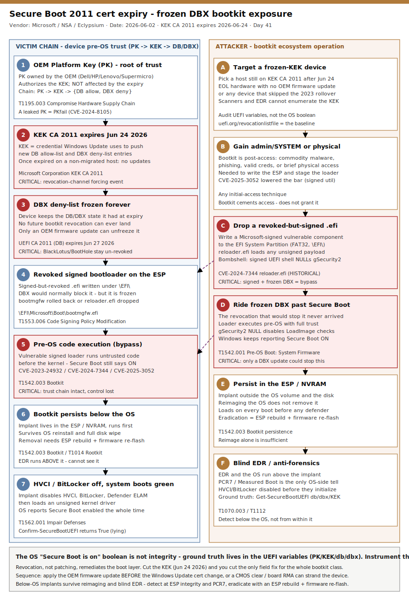

# Secure Boot 2011 certificate expiry (KEK June 24, 2026) — the frozen-DBX window that makes BlackLotus-class bootkits permanently exploitable

## TL;DR

On **June 24, 2026** — seventeen days from this entry — the **Microsoft Corporation KEK CA 2011** expires; the **Microsoft Corporation UEFI CA 2011** (DB) follows on **June 27, 2026**, and the **Microsoft Windows Production PCA 2011** on **October 19, 2026** (dates per Microsoft's official table, updated 2026-05-18 to add the day of the month). The KEK (Key Exchange Key) is the credential Windows Update uses to push new entries into a device's Secure Boot allow-list (DB) and deny-list (DBX), so the KEK expiry on **June 24** is the decisive forcing event. When it expires on a device that has **not** been migrated to the 2023 certificate family, that device keeps booting normally but can **never again receive a DBX revocation** — its boot deny-list is frozen forever, or until an OEM firmware update embeds the new certificates. Eclypsium's June 2, 2026 operational analysis spells out the consequence: every future bootkit campaign that relies on a known-revoked, signed-but-vulnerable boot component (BlackLotus / CVE-2023-24932, BootHole / CVE-2020-10713, Bombshell, CVE-2024-7344, CVE-2025-3052) **succeeds** on a frozen device, because the only field-remediation mechanism for that entire attack class is a DBX update. This case is not a single intrusion — it is a **fleet-wide exposure window** opening on a known date, against a class of below-the-OS implants that EDR cannot see and that survive OS reinstall. The defensible posture is auditing Secure Boot **at the UEFI variable level** (not the OS "Secure Boot is on" boolean), confirming the 2023 KEK/DB rollover landed, applying OEM firmware updates **before** the Windows Update certificate change, and instrumenting the ESP and boot configuration for the BlackLotus-class tradecraft that the frozen window re-enables.

## Attribution and confidence

- **Cluster:** not a single actor. The "threat" is the structural condition — an expired KEK that freezes DBX — combined with the **bootkit ecosystem** that exploits revoked-but-trusted boot components. Named members of that ecosystem: **BlackLotus** (commercial UEFI bootkit, CVE-2023-24932), **Bootkitty** (first Linux UEFI bootkit, PoC), **BootHole** (GRUB2, CVE-2020-10713), **PKfail** (CVE-2024-8105, leaked AMI test Platform Keys), and **Bombshell** (Framework signed-UEFI-shell `mm` command, Eclypsium Oct 2025). Confidence on **who will exploit the window**: **low** (opportunistic, post-access). Confidence on the **trust-chain mechanics and the date**: **high** (Microsoft + NSA + multiple OEMs + Eclypsium concur).
- **Discovery / disclosure:** Microsoft published the formal "act now" advisory in **June 2025** and a detailed Windows IT Pro blog ("Act now: Secure Boot certificates expire in June 2026"). **NSA** released UEFI Secure Boot guidance in **December 2025**. **Eclypsium** published the enterprise-operational deep dive on **June 2, 2026** (author Paul Asadoorian). Dell, HP, Red Hat, and the fwupd project have all issued platform-specific guidance.
- **Honesty note:** there is **no live "incident" with victim hashes** here. This is a posture/exposure case driven by a hard calendar deadline. Specific bootkit hashes referenced below are **historical** (the BlackLotus reloader / CVE-2024-7344 binary) and are flagged as such — they illustrate the class, they are not "today's intrusion." Do not treat them as fresh campaign IOCs.

| Overlap dimension | Detail | Confidence |
|---|---|---|
| Expiry date (KEK CA 2011 — forcing event) | June 24, 2026 | high |
| Expiry date (UEFI CA 2011, DB) | June 27, 2026 | high |
| Expiry date (Windows Production PCA 2011) | October 19, 2026 | high |
| Platform Key (PK) affected? | No — PK is OEM-owned, untouched by this expiry | high |
| Effect of expiry | DB/DBX updates via Windows Update stop; deny-list frozen | high |
| Enabling CVE class | CVE-2023-24932, CVE-2020-10713, CVE-2024-7344, CVE-2025-3052, CVE-2024-8105 | high |
| Named actor exploiting the window today | none | n/a |

**Genealogy with previous repo cases.** This is the repo's **first primary in slot #8 (supply chain HW / firmware)**. It is the firmware/pre-OS counterpart to the edge-device persistence themes in `2026-04-30_FIRESTARTER-LINE-VIPER-UAT4356` (below-OS implant on a network appliance that survives patching) and the trust-control subversion in `2026-05-19_Embargo-Rust-SafeMode-BYOVD` (BYOVD disables OS defenses from a signed-but-malicious driver — the kernel-mode analogue of a signed-but-revoked bootloader). Where BYOVD abuses a signed kernel driver, a bootkit abuses a signed boot component **one layer lower**, before the kernel exists. The Secure Boot DBX is to bootloaders what the Microsoft Vulnerable Driver Blocklist is to drivers — and this case is about what happens when that revocation channel is permanently cut.

## Kill chain — summary table

| Stage | MITRE | Detail |
|---|---|---|
| Pre-condition (resource dev) | T1195.003 | Device still on 2011 KEK; after June 24 2026 (KEK CA 2011 expiry) its DBX is **frozen** — no future revocation can land |
| Initial access | (any) | Attacker obtains local admin/SYSTEM (commodity malware, phishing, valid creds) or brief physical access |
| Defense evasion — stage payload | T1553.006, T1542.001 | Write a **signed-but-revoked** vulnerable bootloader (BlackLotus reloader, CVE-2024-7344 `reloader.efi`, CVE-2025-3052 BIOS-flash util) to the EFI System Partition |
| Execution — Secure Boot bypass | T1542.003 | Frozen DBX never blocked the revoked binary → it runs **untrusted code pre-OS** with Secure Boot still reporting "on" |
| Persistence — bootkit | T1542.003, T1014 | Implant installs in ESP / NVRAM, **survives OS reinstall and disk wipe**, loads before the kernel |
| Impair defenses | T1562.001 | Disable HVCI, BitLocker, Defender ELAM before Windows initializes; load unsigned kernel driver |
| Anti-forensics | T1070.003, T1112 | OS reports Secure Boot enabled; EDR runs above the implant and cannot see it; `gSecurity2`-style NULLing leaves no OS-level trace |



The diagram is a two-lane flow (Template A). The **left lane** is the victim device's pre-OS trust chain — PK → KEK (expiring) → DB/DBX (frozen) → vulnerable signed bootloader executes → bootkit below the OS → HVCI/BitLocker disabled → OS boots "green." The **right lane** is the attacker/ecosystem operation — wait for / target a frozen-KEK device, drop a revoked-but-signed component to the ESP, ride the frozen DBX past Secure Boot, persist below the OS, and blind EDR. The red badges mark the two decisive points: the **frozen KEK/DBX** (the structural enabler) and the **pre-OS code execution** that turns a known-revoked binary back into a working bypass.

## Stage-by-stage detail

### Pre-condition — a device whose DBX can no longer be updated (T1195.003)

The Secure Boot trust hierarchy is `PK → KEK → {DB, DBX}`. The **PK** (Platform Key) is OEM-owned (Dell, HP, Lenovo, Supermicro) and is **not** affected by this expiry. The **KEK** authorizes updates to the two databases that gate pre-OS code:

```
DB   (db)  = allow-list: certificates/hashes permitted to run before the OS
DBX  (dbx) = deny-list:  certificates/hashes explicitly revoked (BlackLotus, BootHole, etc.)
```

Microsoft's `Microsoft Corporation KEK CA 2011` is the credential Windows Update uses to push new DB/DBX entries. On **June 24, 2026** it expires. A device that has not received the **2023** KEK retains whatever DB/DBX state it had at that instant — **permanently** — unless an OEM firmware image later embeds the 2023 certificates. The device keeps booting; what dies is the *ability to update the chain of trust through Windows Update*.

```
# Expiring certificates (Microsoft official table, updated 2026-05-18):
Microsoft Corporation KEK CA 2011       -> KEK store, expires 2026-06-24 -> Microsoft Corporation KEK 2K CA 2023
Microsoft Corporation UEFI CA 2011      -> DB store,  expires 2026-06-27 -> split: Microsoft UEFI CA 2023 (OS loaders)
                                                                                  + Microsoft Option ROM UEFI CA 2023
Microsoft Windows Production PCA 2011    -> DB store,  expires 2026-10-19 -> Windows UEFI CA 2023  (signs bootmgfw.efi)
```

### Initial access — any path to admin/SYSTEM or physical (any technique)

A bootkit is **post-access**: it does not grant the initial foothold, it cements it. BlackLotus historically required local administrator to write the ESP and stage its installer. CVE-2025-3052 (Binarly) and CVE-2024-7344 (ESET) lowered the bar by abusing **Microsoft-signed** utilities that run on virtually any Secure Boot platform. The relevance of the 2026 window: once those binaries are revoked in DBX, a current device blocks them — a **frozen** device does not.

### Defense evasion — stage a signed-but-revoked vulnerable boot component (T1553.006, T1542.001)

The attacker writes a vulnerable, **legitimately signed** boot component to the EFI System Partition (usually FAT32, mounted at `\EFI\`):

```
# EFI System Partition layout an attacker abuses
\EFI\Microsoft\Boot\bootmgfw.efi        # Windows Boot Manager (BlackLotus replaces with revoked older version)
\EFI\Boot\bootx64.efi                   # fallback boot path
\EFI\<vendor>\grubx64.efi               # GRUB2 (BootHole / CVE-2020-10713)
\EFI\<vendor>\shimx64.efi               # Linux shim, signed by UEFI CA 2011
\EFI\<attacker>\reloader.efi            # CVE-2024-7344 Howyar SysReturn signed loader (HISTORICAL)
```

On a current device, the revoked signature is rejected by DBX and the chain breaks. On a **frozen-KEK** device the DBX entry never arrived, so the revoked-but-signed binary is still trusted.

### Execution — Secure Boot bypass, pre-OS untrusted code (T1542.003)

The vulnerable signed component loads attacker-controlled, unsigned code **before** the OS — the definition of a Secure Boot bypass. BlackLotus exploited **CVE-2023-24932** (Baton Drop family) to roll the boot manager back to a signed-but-vulnerable version; CVE-2024-7344's `reloader.efi` loaded any unsigned payload from a hardcoded path; Bombshell used a signed UEFI diagnostic shell's `mm` (memory modify) command to NULL the `gSecurity2` pointer (the UEFI Security Architectural Protocol that performs `LoadImage` signature verification), silently disabling checks while Windows still reports Secure Boot **enabled**.

### Persistence — bootkit below the OS (T1542.003, T1014)

The implant lives in the ESP and/or NVRAM and executes on every boot before the kernel. Consequences: it **survives OS reinstall and full disk reformat** (the ESP and firmware are outside the OS volume), it runs at higher privilege than any OS defender, and removing it requires re-flashing firmware or rebuilding the ESP from known-good media — not a standard reimage.

### Impair defenses — neutralize OS protections pre-boot (T1562.001)

Because the implant runs first, it can disable **HVCI** (Hypervisor-protected Code Integrity), **BitLocker**, and Defender **ELAM** before they initialize, then load an unsigned kernel driver into the now-unprotected kernel — exactly the BlackLotus payload chain.

### Anti-forensics — invisible from above (T1070.003, T1112)

The OS-level `Confirm-SecureBootUEFI` returns `True`; the Windows Security app shows a green Secure Boot indicator; EDR runs entirely above the implant. The only ground truth is reading the **UEFI variables themselves** (PK/KEK/db/dbx) and comparing the dbx against the UEFI Forum revocation baseline — which no conventional vulnerability scanner or EDR does.

## RE notes

No new sample is published with this advisory. The components below are **historical / illustrative** of the bootkit class this window re-enables. They are documented in public vendor research; treat them as class exemplars, **not** fresh campaign artifacts.

| Component | SHA256 | Lang | Packer | Notes |
|---|---|---|---|---|
| BlackLotus bootkit (class exemplar) | (see CISA BlackLotus Mitigation Guide, 2023) | Assembly/C (UEFI) | none | Exploits CVE-2023-24932; rolls boot manager back; disables HVCI/BitLocker; loads unsigned driver |
| `reloader.efi` (CVE-2024-7344) | (see ESET 2025-01 advisory) | C (UEFI app) | none | Howyar SysReturn signed loader; reads unsigned payload from hardcoded path; Microsoft-signed via UEFI CA 2011 |
| CVE-2025-3052 BIOS-flash utility | (see Binarly BRLY-2025; 14 dbx sigs added 2025-06-10) | C (UEFI app) | none | Signed BIOS-flashing tool for rugged tablets; executes on any Secure Boot platform |

The durable lesson is structural, not hash-based: **a signed binary plus a frozen DBX equals a permanent bypass.** Hashes rotate; the trust-revocation gap does not close until the KEK is renewed.

## Detection strategy

### Telemetry that matters

- **UEFI variable state (ground truth):** `PK`, `KEK`, `db`, `dbx` contents — readable on Windows via `Get-SecureBootUEFI` / `mountvol`-mounted ESP, on Linux via `mokutil --list-enrolled` and `efi-readvar`/`/sys/firmware/efi/efivars/`. EDR/vuln scanners do **not** surface these; a firmware-aware agent (Eclypsium-class) or a custom collector does.
- **Secure Boot opt-in / state registry (Windows):** `HKLM\SYSTEM\CurrentControlSet\Control\Secureboot` — the migration opt-in value `MicrosoftUpdateManagedOptIn` (DWORD `0x5944`) and `HKLM\SYSTEM\CurrentControlSet\Control\SecureBoot\State\UEFISecureBootEnabled`.
- **ESP file activity:** writes/renames to `\EFI\Microsoft\Boot\bootmgfw.efi`, `\EFI\Boot\bootx64.efi`, `\EFI\**\grubx64.efi`, `\EFI\**\shimx64.efi`. Sysmon **EID 11** (FileCreate) is blind to a raw ESP unless it is mounted to a drive letter; capture via `mountvol`/`Mount-DiskImage` + file auditing, or a boot-config integrity tool.
- **Defender XDR / Sentinel:** `DeviceRegistryEvents` (Secure Boot keys), `DeviceProcessEvents` (`bcdedit`, `mountvol`, `mokutil`, `bcdboot`, `cmd /c reg add ...Secureboot`), `DeviceEvents` (boot configuration / TpmDefense), `DeviceTvmSecureConfigurationAssessment` (Secure Boot enabled posture).
- **Measured Boot / TPM:** PCR[7] (Secure Boot policy) and PCR[0-4] changes; BitLocker recovery-key prompts after a boot-config change are a high-signal (if noisy) tell.
- **Windows event logs:** `Microsoft-Windows-Kernel-Boot`, TPM event log, and the Secure Boot DB/DBX update events (documented by Microsoft) confirm whether the 2023 rollover actually applied.

### Detection coverage

| Engine | File | Logic |
|---|---|---|
| Sigma | `sigma/01_secureboot_optin_registry_tamper.yml` | `registry_set` on `...\Control\Secureboot\MicrosoftUpdateManagedOptIn` or `UEFISecureBootEnabled` outside managed change windows |
| Sigma | `sigma/02_esp_bootloader_replacement.yml` | `file_event` writing `bootmgfw.efi`/`bootx64.efi`/`grubx64.efi`/`shimx64.efi` on a mounted ESP by a non-TrustedInstaller process |
| Sigma | `sigma/03_bcdedit_mountvol_esp_tamper.yml` | `process_creation` of `bcdedit`/`mountvol`/`mokutil`/`bcdboot` with ESP-mount or boot-policy-changing arguments |
| KQL | `kql/k1_secureboot_registry_change.kql` | `DeviceRegistryEvents` Secure Boot key changes, joined to initiating process |
| KQL | `kql/k2_esp_boot_manager_write.kql` | `DeviceFileEvents` writes to EFI boot components on a mounted ESP |
| KQL | `kql/k3_boot_tamper_lolbin.kql` | `DeviceProcessEvents` for `bcdedit`/`mountvol`/`mokutil`/`bcdboot` boot-tamper command lines |
| KQL | `kql/k4_secureboot_posture_gap.kql` | `DeviceTvmSecureConfigurationAssessment` — fleet devices reporting Secure Boot **off** or unassessed (frozen-state proxy) |
| YARA | `yara/uefi_bootkit_indicators.yar` | EFI bootloader strings / revoked-component markers (BlackLotus, CVE-2024-7344 reloader, gSecurity2 NULLing) — illustrative class detection |
| Suricata | `suricata/secureboot_bootkit_staging.rules` | HTTP retrieval of `.efi` payloads and BlackLotus-class C2/self-delete patterns over the wire |

### Threat hunting hypotheses

- **H1** (`hunts/peak_h1_secureboot_optin_and_state.md`): If a device is heading into the frozen-KEK window, its Secure Boot opt-in/state registry was changed (or never set) — hunt for devices missing `MicrosoftUpdateManagedOptIn=0x5944` and for unexpected `UEFISecureBootEnabled` flips.
- **H2** (`hunts/peak_h2_esp_bootloader_write.md`): If a bootkit was staged, a non-servicing process wrote an EFI boot component to a freshly mounted ESP — hunt ESP file writes correlated with `mountvol`/`Mount-DiskImage`.
- **H3** (`hunts/peak_h3_boot_tamper_then_defense_off.md`): If a Secure Boot bypass succeeded, boot-config tampering was followed by HVCI/BitLocker going off — hunt `bcdedit`/`mokutil` activity time-correlated with a later HVCI or BitLocker state change.

## Incident response playbook

### First 60 minutes (triage)

1. **Establish ground truth, not OS truth.** Do not trust `Confirm-SecureBootUEFI`. Read the actual UEFI variables: `Get-SecureBootUEFI db`, `Get-SecureBootUEFI dbx`, `Get-SecureBootUEFI KEK` (Windows, admin) or `efi-readvar` / `mokutil --list-enrolled` (Linux).
2. **Determine KEK generation.** Confirm whether the device holds `Microsoft Corporation KEK 2K CA 2023`. If it holds only the 2011 KEK and the date is past June 24 2026, the device's dbx is frozen — flag it.
3. **Compare dbx to the baseline.** Diff the device dbx against the UEFI Forum published revocation list (`uefi.org/revocationlistfile`). Missing BlackLotus/BootHole/Bombshell entries = exploitable.
4. **Inspect the ESP.** Mount it read-only (`mountvol X: /S`) and hash every `*.efi`; compare `bootmgfw.efi` against the known-good for the patch level. An unexpected/older boot manager is a BlackLotus tell.
5. **Check defense posture.** Verify HVCI and BitLocker are actually **on** (`Get-CimInstance -ClassName Win32_DeviceGuard`; `manage-bde -status`). A bootkit disables them pre-OS.
6. **If a bootkit is confirmed, do not "just reimage."** A standard OS reinstall does not clear the ESP/firmware — escalate to firmware re-flash.

### Artifacts to collect

| Artifact | Path | Tool | Why |
|---|---|---|---|
| UEFI db/dbx/KEK/PK | UEFI NVRAM | `Get-SecureBootUEFI` / `efi-readvar` | Ground-truth trust state; reveals frozen DBX and KEK generation |
| EFI System Partition image | `\Device\HarddiskVolume*` / `\EFI\` | `mountvol` + `dd`/`ftkimager` | Bootkit lives here; survives OS reinstall |
| Boot manager binary | `\EFI\Microsoft\Boot\bootmgfw.efi` | hash + compare to known-good | BlackLotus rolls this back to a revoked version |
| Secure Boot registry | `HKLM\SYSTEM\CurrentControlSet\Control\Secureboot\*` | `reg export` | Opt-in value + UEFISecureBootEnabled state |
| TPM / Measured Boot log | Windows TPM event log; PCR[7] | `tpmtool getdeviceinformation` / `PCPTool` | Detects boot-policy change; explains BitLocker recovery prompts |
| DeviceGuard / BitLocker status | WMI / `manage-bde` | PowerShell | Confirms whether HVCI/BitLocker were disabled pre-OS |

### IR queries and commands

```powershell
# Read the real Secure Boot trust state (run elevated)
Confirm-SecureBootUEFI
$dbx = Get-SecureBootUEFI dbx
[System.BitConverter]::ToString($dbx.bytes) | Out-File dbx_dump.txt   # diff vs uefi.org revocation list

# KEK generation check (frozen if only 2011 present after 2026-06-24)
$kek = Get-SecureBootUEFI KEK
[System.Text.Encoding]::ASCII.GetString($kek.bytes) -match 'KEK CA 2011|KEK 2K CA 2023'

# Migration opt-in state
reg query "HKLM\SYSTEM\CurrentControlSet\Control\Secureboot" /v MicrosoftUpdateManagedOptIn

# Mount the ESP read-only and hash the boot components
mountvol X: /S
Get-ChildItem -Recurse X:\EFI -Filter *.efi | Get-FileHash -Algorithm SHA256
mountvol X: /D

# HVCI / BitLocker actually enforced?
Get-CimInstance -ClassName Win32_DeviceGuard -Namespace root\Microsoft\Windows\DeviceGuard |
  Select-Object SecurityServicesRunning, VirtualizationBasedSecurityStatus
manage-bde -status
```

```kql
// DeviceRegistryEvents — Secure Boot opt-in / state tamper, with initiating process
DeviceRegistryEvents
| where Timestamp > ago(30d)
| where RegistryKey has @"\Control\Secureboot"
| where RegistryValueName in~ ("MicrosoftUpdateManagedOptIn","UEFISecureBootEnabled")
| project Timestamp, DeviceName, RegistryKey, RegistryValueName, RegistryValueData,
          InitiatingProcessFileName, InitiatingProcessCommandLine, InitiatingProcessAccountName
| order by Timestamp desc
```

### Containment, eradication, recovery

- **Exit criteria for "clean":** UEFI db/dbx match the 2023 baseline with all class revocations present; `bootmgfw.efi` hashes to a current known-good; HVCI and BitLocker confirmed enforced; PCR[7] consistent with policy; ESP contains no unexpected `*.efi`.
- **Eradication of a confirmed bootkit:** rebuild the ESP from known-good media **and** re-flash firmware from the OEM image (the firmware/NVRAM is outside the OS volume). A reimage alone is insufficient.
- **What NOT to do:** (1) do **not** rely on the OS Secure Boot boolean as proof of integrity; (2) do **not** apply the Windows Update certificate change **before** the OEM firmware update — sequencing it the other way leaves no durable recovery path if the cert state is later reset (CMOS clear, board RMA); (3) do **not** push DBX revocations to PXE/dual-boot fleets before confirming your boot images and Linux shim are re-signed against UEFI CA 2023, or you will brick boot; (4) do **not** trigger the cert change on PCR7-sealed BitLocker devices without recovery keys staged.

### Recovery validation

After migration, confirm on a representative sample: `Get-SecureBootUEFI KEK` shows the **2023** KEK; the dbx contains the current revocation set; a test boot succeeds without a BitLocker recovery prompt (or the prompt is expected and the key is on hand); `SecureBootRecovery.efi` (`C:\Windows\Boot\EFI\SecureBootRecovery.efi`) is present as the fallback; and OEM firmware reports the 2023 certificates embedded (so a future CMOS reset cannot strand the device).

## IOCs

Full list in `iocs.csv`. Top entries (this case is identity/posture-driven; the "IOCs" are certificate names, registry/path artifacts, and the enabling CVEs — historical bootkit hashes are labeled):

| Type | Value | Context | Confidence | Source |
|---|---|---|---|---|
| note | KEK CA 2011 expires 2026-06-24; UEFI CA 2011 expires 2026-06-27; Windows Production PCA 2011 expires 2026-10-19 | The forcing event; frozen DBX after KEK expiry on non-migrated devices | high | Microsoft/Eclypsium |
| string | Microsoft Corporation KEK CA 2011 | Expiring KEK (June 24 2026); presence after expiry = frozen revocation channel | high | Microsoft |
| string | Microsoft Corporation UEFI CA 2011 | Expiring DB cert (June 27 2026); signs Linux shim + option ROMs | high | Microsoft |
| string | Microsoft Windows Production PCA 2011 | Signs bootmgfw.efi; expires 2026-10-19 | high | Microsoft |
| regkey | HKLM\SYSTEM\CurrentControlSet\Control\Secureboot\MicrosoftUpdateManagedOptIn | DWORD 0x5944 opt-in for managed cert transition | high | Microsoft |
| path | \EFI\Microsoft\Boot\bootmgfw.efi | Windows Boot Manager; BlackLotus rolls back to revoked version | high | CISA BlackLotus Guide |
| path | \EFI\<vendor>\shimx64.efi | Linux shim signed by UEFI CA 2011; breaks if 2011 removed pre-2023-shim | high | Red Hat/fwupd |
| cve | CVE-2023-24932 | BlackLotus Secure Boot bypass (Windows Boot Manager); DBX-remediated | high | Microsoft/NVD |
| cve | CVE-2020-10713 | BootHole GRUB2 buffer overflow; DBX-remediated | high | Eclypsium/NSA |
| cve | CVE-2024-7344 | Howyar reloader.efi signed loader Secure Boot bypass | high | ESET/NVD |
| cve | CVE-2025-3052 | Signed BIOS-flash utility bypass; 14 dbx sigs added 2025-06-10 | high | Binarly/Microsoft |
| cve | CVE-2024-8105 | PKfail — leaked AMI test Platform Keys; 800+ models | high | Binarly/CERT-CC |
| string | gSecurity2 | UEFI Security Arch Protocol pointer; NULLed by Bombshell to disable LoadImage checks | medium | Eclypsium |
| path | C:\Windows\Boot\EFI\SecureBootRecovery.efi | Microsoft recovery binary for stranded cert state | high | Microsoft |

## Secondary findings

- **PKfail (CVE-2024-8105)** remains the cautionary twin: hundreds of OEM models (Dell, Acer, Gigabyte, Intel, Supermicro, Lenovo, HP) shipped with AMI **test** Platform Keys marked "DO NOT TRUST" that leaked on GitHub. An attacker holding that PK can sign malicious firmware and walk the entire PK→KEK→DB chain — proving that operational management of trust anchors matters as much as the cryptography, exactly the lesson of the 2026 transition.
- **Bombshell (Framework, Oct 2025)** showed Secure Boot can be defeated without any revoked binary at all: a **legitimately signed** UEFI diagnostic shell exposed a `mm` (memory-modify) command that overwrites the `gSecurity2` pointer with NULL, silently disabling signature verification while Windows still reports Secure Boot enabled. >200,000 Framework devices were affected; the fix is, again, a DBX revocation — useless on a frozen device.
- **Linux and virtualization are in scope.** Every Secure-Boot Linux distro depends on `shim`, signed by UEFI CA 2011; until a distro ships a shim re-signed against UEFI CA 2023, removing the 2011 DB entry breaks boot. Hyper-V/ESXi/KVM-OVMF/Proxmox guests carry their **own** UEFI variable stores — updating the host does **not** migrate the guests; each VM needs its own transition (manual in air-gapped environments).

## Pedagogical anchors

- **The OS Secure Boot boolean is not integrity.** `Confirm-SecureBootUEFI = True` says the feature is on; it says nothing about *which* certificates are present, whether the dbx is current, or whether a signed shell already NULLed the verifier. Ground truth lives in the UEFI variables — instrument those.
- **Revocation, not patching, is the remediation for the boot layer.** A patch fixes the vulnerable component; only a **DBX entry** stops the old, signed, vulnerable component from running. Cut the KEK and you cut the only field-remediation channel for an entire attack class.
- **Sequence matters: OEM firmware update before the OS certificate change.** The OEM image embeds the 2023 certs in firmware, giving a durable recovery path. Doing it OS-first leaves devices one CMOS-clear away from unbootable.
- **Below-the-OS implants invert your trust model.** EDR runs above a bootkit and cannot see it; reimaging does not remove it. Detection has to move down to ESP integrity, UEFI variables, and Measured Boot/PCR[7], and eradication means re-flashing firmware.
- **A known deadline is a planning gift, not a panic.** June 24, 2026 (KEK) is on the calendar. Fleets that audit at the variable level, identify EOL hardware that will never get OEM updates, and stage the migration turn a structural risk into a routine change.

## What's in this folder

| File | Purpose |
|---|---|
| [README.md](./README.md) | This analysis (15 sections). |
| [kill_chain.svg](./kill_chain.svg) | Two-lane kill chain (Template A): victim boot trust chain vs attacker/ecosystem operation. |
| [sigma/01_secureboot_optin_registry_tamper.yml](./sigma/01_secureboot_optin_registry_tamper.yml) | Secure Boot opt-in / state registry tamper. |
| [sigma/02_esp_bootloader_replacement.yml](./sigma/02_esp_bootloader_replacement.yml) | EFI boot component write on a mounted ESP by a non-servicing process. |
| [sigma/03_bcdedit_mountvol_esp_tamper.yml](./sigma/03_bcdedit_mountvol_esp_tamper.yml) | Boot-config / ESP-mount LOLBin tampering. |
| [kql/k1_secureboot_registry_change.kql](./kql/k1_secureboot_registry_change.kql) | Defender XDR Secure Boot registry changes + initiating process. |
| [kql/k2_esp_boot_manager_write.kql](./kql/k2_esp_boot_manager_write.kql) | ESP boot-component file writes. |
| [kql/k3_boot_tamper_lolbin.kql](./kql/k3_boot_tamper_lolbin.kql) | bcdedit/mountvol/mokutil/bcdboot boot-tamper command lines. |
| [kql/k4_secureboot_posture_gap.kql](./kql/k4_secureboot_posture_gap.kql) | Fleet Secure Boot posture gap (TVM secure-config). |
| [yara/uefi_bootkit_indicators.yar](./yara/uefi_bootkit_indicators.yar) | EFI bootkit / revoked-component string indicators (illustrative class detection). |
| [suricata/secureboot_bootkit_staging.rules](./suricata/secureboot_bootkit_staging.rules) | Network staging of `.efi` payloads / BlackLotus-class patterns. |
| [hunts/peak_h1_secureboot_optin_and_state.md](./hunts/peak_h1_secureboot_optin_and_state.md) | PEAK hunt — Secure Boot opt-in/state gaps. |
| [hunts/peak_h2_esp_bootloader_write.md](./hunts/peak_h2_esp_bootloader_write.md) | PEAK hunt — ESP boot-component writes. |
| [hunts/peak_h3_boot_tamper_then_defense_off.md](./hunts/peak_h3_boot_tamper_then_defense_off.md) | PEAK hunt — boot tamper followed by HVCI/BitLocker off. |
| [iocs.csv](./iocs.csv) | Certificate names, registry/path artifacts, enabling CVEs (historical hashes labeled). |

## Sources

- [Microsoft: Act now — Secure Boot certificates expire in June 2026 (Windows IT Pro Blog)](https://techcommunity.microsoft.com/blog/windows-itpro-blog/act-now-secure-boot-certificates-expire-in-june-2026/4426856)
- [Microsoft: When Secure Boot certificates expire on Windows devices](https://support.microsoft.com/en-us/topic/when-secure-boot-certificates-expire-on-windows-devices-c83b6afd-a2b6-43c6-938e-57046c80c1c2)
- [Eclypsium: Microsoft Secure Boot Certificates Expiring in 2026 — Enterprise Impact (2026-06-02)](https://eclypsium.com/blog/microsoft-secure-boot-certificates-expire-2026/)
- [NSA: Releases UEFI Secure Boot Guidance (Dec 2025)](https://www.nsa.gov/Press-Room/Press-Releases-Statements/Press-Release-View/Article/4356302/nsa-releases-unified-extensible-firmware-interface-secure-boot-guidance/)
- [CISA/NSA: BlackLotus Mitigation Guide (2023)](https://media.defense.gov/2023/Jun/22/2003245723/-1/-1/0/CSI_BlackLotus_Mitigation_Guide.PDF)
- [Microsoft: How to manage Windows Boot Manager revocations for CVE-2023-24932](https://support.microsoft.com/en-us/topic/how-to-manage-the-windows-boot-manager-revocations-for-secure-boot-changes-associated-with-cve-2023-24932-41a975df-beb2-40c1-99a3-b3ff139f832d)
- [ESET: UEFI Secure Boot bypass vulnerability (CVE-2024-7344)](https://www.eset.com/us/about/newsroom/press-releases/eset-research-discovers-uefi-secure-boot-bypass-vulnerability/)
- [Help Net Security: New UEFI Secure Boot bypass (CVE-2024-7344)](https://www.helpnetsecurity.com/2025/01/16/uefi-secure-boot-bypass-vulnerability-cve-2024-7344/)
- [Eclypsium: There's a Hole in the Boot (BootHole, CVE-2020-10713)](https://eclypsium.com/blog/theres-a-hole-in-the-boot/)
- [CERT/CC: PKfail (CVE-2024-8105) VU#455367](https://kb.cert.org/vuls/id/455367)
- [Red Hat: Secure Boot certificate changes in 2026 — guidance for RHEL](https://access.redhat.com/articles/7128933)
