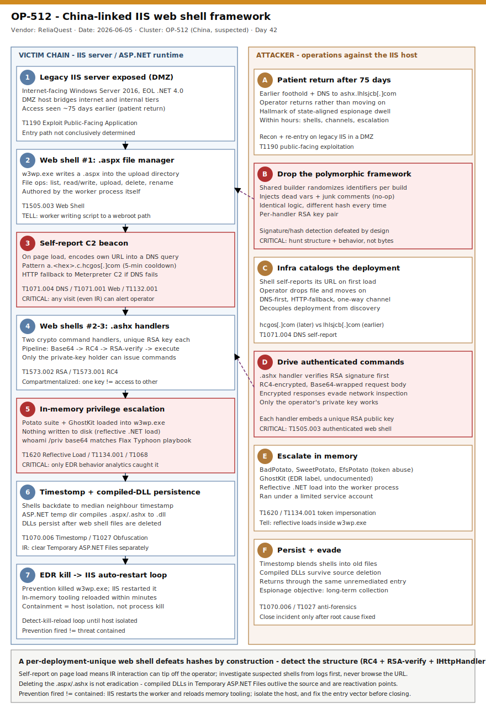

# OP-512 — China-linked IIS web shell framework with per-deployment cryptographic uniqueness

## TL;DR

On 2026-06-05 ReliaQuest disclosed **OP-512**, a previously unseen China-linked espionage cluster (moderate-high confidence) it surfaced after correlating a burst of low-fidelity events on a customer's internet-facing **Internet Information Services (IIS)** server. The compromised host ran **Windows Server 2016** with end-of-life **.NET Framework 4.0**, sat in a DMZ, and had shown signs of attacker access **75 days earlier** — the patient, return-later pattern of state-aligned intelligence collection rather than smash-and-grab crime. On re-entry the operator deployed a **three-shell framework** in seconds: a `.aspx` file manager that **self-reports its own URL** out via hex-encoded DNS (HTTP fallback to a Meterpreter C2), plus **two `.ashx` cryptographic command handlers** gated by an RSA-signature + RC4 four-stage pipeline. Every deployment is **cryptographically and structurally unique** — a shared builder randomizes identifiers and injects junk so identical logic produces different hashes — which makes signature detection useless and forces a behavioral approach. OP-512 is at least the **fourth** China-linked cluster documented hitting legacy IIS in a year (alongside DragonRank, CL-STA-0048, GhostRedirector) but matches none of them; the sector/geography of the victim align with China-linked intelligence priorities (not publicly named).

## Attribution and confidence

ReliaQuest assesses with **moderate-high confidence** that OP-512 is a **distinct, China-linked** cluster. The label "OP-512" is a ReliaQuest cluster name, not a self-identifier. Attribution rests on tooling, infrastructure, behavioral overlap with the broader China-aligned IIS-targeting ecosystem, and two specific tells: a **hex-encoded DNS subdomain** signaling technique (publicly noted as rare) and **base64-encoded `whoami` / `whoami /priv`** strings that match, character-for-character, commands documented in a Flax Typhoon ArcGIS compromise — pointing to shared playbooks or tooling circulating in the ecosystem.

Confidence is split deliberately: **high** on the technical facts (web shell framework internals, self-report mechanics, RSA+RC4 pipeline, reflective Potato-suite loading) because they are drawn from a single deep vendor investigation with sample analysis; **moderate-high** on the cluster being *new and independent* rather than a retool of an existing group.

| Candidate | Primary motive | Target asset | Hex-encoded DNS | Priv-esc tooling | Verdict vs OP-512 |
|---|---|---|---|---|---|
| **OP-512** | Espionage | IIS servers | Self-report of shell URL | BadPotato, SweetPotato, EfsPotato, "GhostKit" | — |
| CL-STA-0048 | Espionage | Edge devices + servers | Data exfiltration | BadPotato, RasmanPotato; PlugX, Cobalt Strike | Closest match; same DNS *technique*, different *intent*; lacks OP-512's custom crypto framework |
| GhostRedirector | SEO fraud | IIS servers | None documented | BadPotato, EfsPotato; Rungan, Gamshen | Different motive; commodity tooling |
| DragonRank | SEO fraud | IIS servers | None documented | BadPotato, GodPotato, PrintNotifyPotato; BadIIS, PlugX | Different motive; commodity tooling |

Genealogy with the repo: this is the repo's first IIS web shell framework case and complements prior China-nexus espionage coverage (`2026-05-11_UAT-8302-China-Government-Espionage`) and the broader "detection without static IOCs" thread (`2026-06-05_Netlogon-CVE-2026-41089-DC-RCE`, `2026-06-07_SecureBoot-2011-Cert-Expiry-Bootkit-Exposure`).

## Kill chain — summary table

| Stage | MITRE | Detail |
|---|---|---|
| Initial access (legacy IIS in DMZ) | T1190 | Internet-facing Windows Server 2016, EOL .NET 4.0 app; exact entry path not conclusively determined; access seen 75 days prior |
| Web shell deployment | T1505.003 | `w3wp.exe` writes a `.aspx` file manager to the app upload directory |
| Self-reporting C2 | T1071.004, T1071.001, T1132.001 | Shell encodes its own URL into a hex DNS subdomain (`a.<hex>.c.hcgos[.]com`); HTTP fallback to Meterpreter C2 |
| Authenticated command handlers | T1505.003, T1573.002, T1573.001 | Two `.ashx` handlers; per-handler RSA public key + RC4; four-stage Base64→RC4→RSA-verify→execute pipeline |
| Privilege escalation (in-memory) | T1620, T1134.001, T1068 | Potato-suite + "GhostKit" reflectively loaded into `w3wp.exe`; nothing on disk |
| Discovery | T1033 | base64-encoded `whoami` / `whoami /priv` (matches Flax Typhoon playbook) |
| Anti-forensics + persistence | T1070.006, T1027, T1140 | Timestomp to median neighbour timestamp; per-build polymorphism; compiled DLLs persist in ASP.NET temp dir |



The diagram is a two-lane view: the **left lane** is the victim IIS server and ASP.NET runtime (exposed legacy host → `.aspx` file manager → self-report beacon → `.ashx` crypto handlers → in-memory priv-esc → timestomp/compiled-DLL persistence → EDR-kill/auto-restart loop); the **right lane** is the operator (patient return after 75 days → drop polymorphic framework → let infrastructure catalog the deployment → drive authenticated commands → escalate in memory → persist and evade). The durable detection anchors — highlighted in the critical (red) boxes — are `w3wp.exe` emitting long hex-segmented DNS, reflective .NET loading inside the worker process, and new DLLs compiled in ASP.NET temp directories outside any deployment window.

## Stage-by-stage detail

### Stage 1 — Initial access: legacy IIS at the network boundary (T1190)

The compromised server ran **Windows Server 2016** with **.NET Framework 4.0**, unsupported since 2016, on an internet-facing host in a DMZ. The specific access path was not conclusively determined, but a legacy .NET app on an exposed host is a plausible surface. EDR telemetry showed web shell activity and DNS queries to a *different* attacker domain (`ashx.lhlsjcb[.]com`) **75 days earlier**, then the operator returned. DMZ IIS servers are attractive because they bridge internet-facing and internal networks and typically receive less monitoring than core infrastructure.

```
Host:      Windows Server 2016, IIS, .NET Framework 4.0 (EOL 2016)
Position:  DMZ, internet-facing
Earlier:   ~75 days prior — web shell activity + DNS to ashx.lhlsjcb[.]com
```

### Stage 2 — `.aspx` file manager web shell (T1505.003)

The IIS worker process `w3wp.exe` wrote the **first** of three web shells — a `.aspx` file manager — into the application's **upload directory**. It provides standard file operations (directory list, read/write, upload, delete, rename) plus the timestomping routine and the self-report C2 channel described below. Because `w3wp.exe` itself authored the file, the durable file-side anchor is *new server-side script written into a webroot/upload path by the worker process outside a deployment window*.

### Stage 3 — Self-reporting C2: DNS-first, HTTP-fallback (T1071.004, T1071.001, T1132.001)

The `.aspx` shell's notification fires **whenever the page is visited** — by the operator, a scanner, or even a legitimate user. On activation it encodes its own URL and transmits it as a **DNS query** to attacker infrastructure, with the observed subdomain pattern `a.<hex>.c.hcgos[.]com`. If DNS fails, it falls back to an **HTTP request** carrying the same encoded path to a separate C2 (community-linked to **Meterpreter** infrastructure, `43.160.202[.]246:8053`). A **five-minute cooldown** suppresses repeats. The channel is **one-way** — it reports location, it does not receive commands.

```
Primary:   DNS TXT/A lookup  a.<hex>.c.hcgos[.]com      (location report)
Fallback:  HTTP request to 43.160.202[.]246:8053        (same encoded path)
Cooldown:  5 minutes
Property:  one-way notification, decouples deployment from discovery
```

Operationally this means **any** interaction with the shell — including during incident response — may alert the operator. Treat suspected shells as already compromised before touching them.

### Stage 4 — Cryptographically authenticated command handlers (T1505.003, T1573.002, T1573.001)

The command interface is **two `.ashx` handlers**, deployed to the same directory shortly after the file manager. They share an identical code structure but were generated with **different cryptographic keys** and randomized identifiers. A received command is processed through a strict four-stage pipeline:

```
1. Base64-decode the HTTP request body
2. RC4-decrypt the result
3. Verify the RSA signature against the handler's embedded public key
4. Execute only if verification succeeds
```

Each handler embeds a **unique RSA public key**: without the matching private key, no one — defender, rival operator, or even another OP-512 operator with a different key pair — can issue commands. Two handlers with two key pairs on one host reflects deliberate **compartmentalization** (separate access, access tiers, or key rotation). The layered encryption also makes the command channel hard to inspect or replay at the network layer; the only network-side tell is **non-standard / encrypted response bodies from `.ashx` endpoints**.

### Stage 5 — In-memory privilege escalation (T1620, T1134.001, T1068)

With the shells in place, the operator loaded **four post-exploitation toolkits directly into `w3wp.exe` process memory** — nothing written to disk. Three are the publicly documented **Potato Suite** (`BadPotato`, `SweetPotato`, `EfsPotato`), token-abuse tools that elevate a limited service account toward SYSTEM; a fourth was an EDR telemetry label, **"GhostKit"**, with no public documentation (likely a vendor label). The only telemetry that caught this was EDR behavioral analytics flagging **reflective .NET assembly loading inside `w3wp.exe`**.

```
whoami            (base64-encoded)
whoami /priv      (base64-encoded)   <- char-for-char match to a Flax Typhoon ArcGIS compromise
```

The discovery commands ran under a **limited service account**, confirming escalation had not yet succeeded at that point.

### Stage 6 — EDR fired, IIS restarted, the operator stayed

Endpoint prevention terminated the malicious process through behavior-based blocking. But **IIS automatically restarts worker processes** when they crash or are killed, so the tooling **reloaded across successive `w3wp.exe` instances within minutes**. Killing the process without isolating the host created a loop: prevention fired repeatedly, the activity continued. The lesson is structural — containment of a web shell on IIS means **host isolation / session termination**, not process kill.

### Stage 7 — Timestomp + compiled-DLL persistence (T1070.006, T1027, T1140)

All three shells **timestomp**: they scan neighbouring files, compute the **median last-modified timestamp**, and overwrite their own creation/modification times to match (an explicit timestamp can also be supplied to backdate to a patch window). Separately, the .NET runtime auto-generates **compiled DLLs** in the **ASP.NET temporary compilation directory** the first time each `.aspx`/`.ashx` is accessed. Four such DLLs were recovered; they were quarantined **~19 hours** after creation. Critically, **these DLLs persist even after the original web shell files are deleted** — incident responders must hunt and clear the temporary compilation directories separately or leave reactivation points behind.

## RE notes

| Component | SHA256 | Lang | Packer | Notes |
|---|---|---|---|---|
| `.aspx` file manager | per-deployment (no stable hash) | C#/ASP.NET | None (source script) | File ops + timestomp + one-way DNS/HTTP self-report on page load |
| `.ashx` command handler ×2 | per-deployment (no stable hash) | C#/ASP.NET (IHttpHandler) | None (source script) | RSA-signed + RC4; unique RSA key per handler; randomized identifiers + injected junk |
| Compiled `.dll` ×4 | environment-specific | .NET IL | n/a | Runtime artifacts in ASP.NET temp dir; persist after source deletion |

The two `.ashx` handlers share an **identical RC4 routine** but every variable and method name is randomized and the builder injects **dead variables** (e.g. `_nkkspqwc = 1534`, `_nbgrzrak = 6392`) and **junk comments** (e.g. `// rmluimqjmidu`). The result is two files that are functionally identical yet hash differently — a deliberate defeat of signature-based detection. This is the central RE takeaway: **hash- and string-anchored signatures will not generalize**; detection must target the *structural* API combination (RC4 + RSA verification + reflection + IHttpHandler) and the *behavioral* footprint, not bytes.

## Detection strategy

### Telemetry that matters

- **Sysmon EID 1** (process creation) — `w3wp.exe` spawning `cmd.exe`/`powershell.exe`/`whoami.exe` or other LOLBins; IIS worker processes almost never spawn interactive shells benignly.
- **Sysmon EID 22** (DNS query) — outbound DNS from `w3wp.exe` with abnormally long, hex-segmented subdomains.
- **Sysmon EID 11** (file create) — new `.aspx`/`.ashx`/`.asmx` in webroot/upload paths, and new `.dll` in ASP.NET temporary compilation directories, authored by the worker process.
- **Sysmon EID 7 / .NET ETW (`Microsoft-Windows-DotNETRuntime`)** — reflective assembly loading inside `w3wp.exe` (memory-only Potato-suite).
- **Defender XDR**: `DeviceProcessEvents`, `DeviceNetworkEvents`, `DeviceFileEvents`, `DeviceImageLoadEvents`. **Sentinel**: `SecurityEvent` (4688), `Syslog` for DNS sensors, plus IIS/W3C logs onboarded as custom tables.
- **Network**: resolver/DNS-sensor logging at the edge with visibility into outbound queries from web-server hosts; WAF / application-layer inspection of `.ashx` response content types.

### Detection coverage

| Engine | File | Logic |
|---|---|---|
| Sigma | `sigma/01_iis_worker_spawns_shell.yml` | `w3wp.exe` parent spawning a command interpreter / LOLBin (T1505.003, T1059.003) |
| Sigma | `sigma/02_w3wp_hex_subdomain_dns.yml` | DNS query from `w3wp.exe` with long hex-segmented subdomain or known C2 apex (T1071.004) |
| Sigma | `sigma/03_iis_webshell_and_aspnet_temp_dll.yml` | `.aspx`/`.ashx` created in webroot/upload, or new `.dll` in ASP.NET temp dir, by the worker (T1505.003, T1027) |
| KQL | `kql/k1_iis_worker_child_process.kql` | `w3wp.exe` → shell/LOLBin in `DeviceProcessEvents` |
| KQL | `kql/k2_w3wp_dns_c2_beacon.kql` | `w3wp.exe` outbound DNS/HTTP — hex subdomain pattern + IOC apexes/IPs in `DeviceNetworkEvents` |
| KQL | `kql/k3_webshell_file_and_temp_dll.kql` | web shell drop + ASP.NET temp DLL creation in `DeviceFileEvents` |
| KQL | `kql/k4_w3wp_reflective_imageload.kql` | unsigned/temp-path module loads into `w3wp.exe` in `DeviceImageLoadEvents` |
| YARA | `yara/op512_iis_webshell.yar` (2 rules) | structural `.ashx` crypto-handler (RC4+RSA+IHttpHandler+reflection) and `.aspx` self-report file manager |
| Suricata | `suricata/op512_iis_webshell.rules` (3 sids) | hex-subdomain DNS to C2 apex; `python-requests` POST to `.aspx` upload path; Meterpreter C2 IP:port |

### Threat hunting hypotheses

- **H1** (`hunts/peak_h1_w3wp_hex_dns_selfreport.md`) — *If* an IIS worker is beaconing its own location, *then* `w3wp.exe` will emit outbound DNS with long hex-segmented subdomains atypical for web-server hosts.
- **H2** (`hunts/peak_h2_iis_worker_shell_and_reflection.md`) — *If* an operator is driving commands / escalating through the shells, *then* `w3wp.exe` will spawn command interpreters and/or reflectively load .NET assemblies in memory.
- **H3** (`hunts/peak_h3_webshell_drop_and_temp_dll.md`) — *If* a polymorphic web shell was deployed, *then* new `.aspx`/`.ashx` files and freshly compiled DLLs will appear in webroot and ASP.NET temp directories outside any deployment window.

## Incident response playbook

### First 60 minutes (triage)

1. **Do not browse the suspected shell URL.** Any visit can trigger the self-report beacon and tip off the operator. Work from logs and file-system artifacts.
2. **Isolate the host at the network level** (not just "kill the process"). IIS will restart `w3wp.exe` and reload in-memory tooling; isolation breaks the loop.
3. Pull IIS/W3C logs, DNS resolver logs, and EDR process/network/file telemetry for the host; pivot on `w3wp.exe` children, outbound DNS, and file writes to webroot.
4. Identify all `.aspx`/`.ashx`/`.asmx` in webroot and upload directories; enumerate the **ASP.NET temporary compilation directories** for recently compiled DLLs.
5. Capture memory before reboot — the Potato-suite tooling is memory-only.
6. Scope the **75-day dwell**: search historical DNS for both `ashx.lhlsjcb[.]com` and `hcgos[.]com`, and for prior `w3wp.exe` anomalies.

### Artifacts to collect

| Artifact | Path | Tool | Why |
|---|---|---|---|
| Web shell source | webroot + app upload directory | EDR / file copy | The `.aspx`/`.ashx` framework files |
| Compiled DLLs | `%WINDIR%\Microsoft.NET\Framework64\<ver>\Temporary ASP.NET Files\` | Manual / forensic image | Persist after source deletion; reactivation points |
| IIS logs | `%SystemDrive%\inetpub\logs\LogFiles\` | log collection | POSTs to upload paths, `python-requests` UA, `.ashx` access |
| DNS resolver logs | edge resolver / Sysmon EID 22 | SIEM | Hex-subdomain self-report + 75-day-prior queries |
| Process memory | live host | WinPmem / EDR memory acquisition | Memory-only Potato-suite + reflective loads |
| EDR telemetry | XDR tables | Defender / SIEM | Process tree, image loads, network connections |

### IR queries and commands

```powershell
# Enumerate server-side scripts in webroot/upload dirs (review modified + created times; timestomp expected)
Get-ChildItem -Path C:\inetpub\wwwroot -Recurse -Include *.aspx,*.ashx,*.asmx -ErrorAction SilentlyContinue |
  Select-Object FullName, CreationTimeUtc, LastWriteTimeUtc | Sort-Object LastWriteTimeUtc -Descending

# Hunt compiled artifacts in ASP.NET temporary compilation directories (persist after source deletion)
Get-ChildItem -Path "$env:WINDIR\Microsoft.NET\Framework64" -Recurse -Filter *.dll -ErrorAction SilentlyContinue |
  Where-Object { $_.FullName -like "*Temporary ASP.NET Files*" -and $_.CreationTimeUtc -gt (Get-Date).AddDays(-90) } |
  Select-Object FullName, CreationTimeUtc
```

```kql
// Defender XDR: IIS worker spawning a shell on any host in the last 30 days
DeviceProcessEvents
| where Timestamp > ago(30d)
| where InitiatingProcessFileName =~ "w3wp.exe"
| where FileName in~ ("cmd.exe","powershell.exe","pwsh.exe","whoami.exe","cscript.exe","wscript.exe","rundll32.exe")
| project Timestamp, DeviceName, AccountName, ProcessCommandLine, InitiatingProcessCommandLine
```

### Containment, eradication, recovery

**Exit criteria:** the exploited *access path* (the EOL .NET app / exposure) is remediated, all framework files and **all compiled DLLs in ASP.NET temp directories** are removed, and no further `w3wp.exe` anomalies are observed after host re-introduction.

**What NOT to do:** do **not** close the incident on "web shell deleted" or "outbound traffic blocked" — those are symptoms; the operator counts on returning through the same unremediated entry. Do **not** kill the malicious process and walk away — IIS restarts it. Do **not** browse the shell to "confirm" it.

### Recovery validation

Confirm the entry vector is fixed (migrate or decommission the EOL .NET app; if not feasible, segment, disable `.aspx/.ashx` handler mappings in upload directories via a dedicated `web.config`, restrict uploads, apply WAF rules). After clean-up, baseline `w3wp.exe` DNS/process/image-load behavior for several days and verify the ASP.NET temp directories stay clean across an app-pool recycle.

## IOCs

These are **specific to the disclosed intrusion** and may not appear in future OP-512 deployments — the framework is per-deployment unique, so **behavioral detection takes priority**. The most durable patterns are the hex-encoded DNS self-report structure, `w3wp.exe` initiating outbound DNS/HTTP immediately after a web shell write, and RSA+RC4 authentication in `.ashx` handlers. Full set in `iocs.csv`.

| Type | Value | Context | Confidence | Source |
|---|---|---|---|---|
| domain | hcgos[.]com | DNS C2 for self-report channel; pattern `a.<hex>.c.hcgos[.]com` | high | ReliaQuest |
| domain | ashx.lhlsjcb[.]com | DNS C2 from activity ~75 days before primary incident | high | ReliaQuest |
| ipv4 | 43.160.202[.]246 | Meterpreter C2 (HTTP fallback), non-standard port 8053 | medium | ReliaQuest |
| ipv4 | 140.206.161[.]227 | Outbound connection from compromised host (port 443) | medium | ReliaQuest |
| ipv4 | 124.156.129[.]151 | Source IP for web shell interaction (python-requests/2.33.0, POST to .aspx upload paths) | medium | ReliaQuest |
| string | python-requests/2.33.0 | User agent on web shell interaction POSTs; alone not reliable, high-signal in combination | low | ReliaQuest |
| string | a.<hex>.c.hcgos[.]com | Self-report DNS subdomain pattern (durable structural anchor) | high | ReliaQuest |
| note | EOL .NET Framework 4.0 on internet-facing Windows Server 2016 | Exploited surface class; migrate/segment | high | ReliaQuest |
| cve | n/a | No CVE — initial access path not conclusively determined | n/a | analysis |

## Secondary findings

- **Per-deployment polymorphism as anti-signature tradecraft (#19 RE):** a shared builder produces functionally identical `.ashx` handlers with randomized identifiers, injected dead variables (`_nkkspqwc=1534`, `_nbgrzrak=6392`) and junk comments — different hashes every time. Combined with per-handler RSA keys, even capturing one implant does not yield access to another. Hash/string IOCs do not generalize; detection must be structural and behavioral.
- **Clustering a "previously unseen" actor in a crowded space (#24 CTI):** OP-512 is the fourth China-linked IIS cluster in a year. Its strongest overlap (CL-STA-0048) shares the rare hex-encoded DNS technique but uses it to *exfiltrate* data, where OP-512 uses it to *report deployment location* — same mechanism, different intent. The Flax Typhoon base64-`whoami` match shows shared playbooks across the ecosystem; ReliaQuest still tracks OP-512 separately on the strength of its unique crypto framework.
- **EDR prevention vs. IIS auto-restart (#25 detection engineering):** behavior-based prevention killed the worker, but IIS restarted it and reloaded memory-only tooling within minutes. The control that actually contains an IIS web shell is **host isolation / session termination**, not process kill — a reminder that "prevention fired" is not "threat contained" when the platform self-heals.

## Pedagogical anchors

- **You cannot hash your way out of a polymorphic web shell.** When a builder randomizes identifiers and injects junk per build, signatures match one file and nothing else. Anchor on the *structure* (RC4 + RSA-verify + IHttpHandler + reflection) and the *behavior* (`w3wp.exe` writing scripts, beaconing DNS, spawning shells, loading assemblies in memory).
- **A self-reporting shell turns every visit into a tripwire — for the attacker.** The `.aspx` beacons on page load with a 5-minute cooldown, so IR interaction can alert the operator. Treat suspected shells as compromised; investigate from logs first.
- **Deleting the web shell is not eradication on ASP.NET.** Compiled DLLs in the temporary compilation directory outlive the source files and can reactivate; they must be hunted separately.
- **"Prevention fired" ≠ "contained" on a self-healing platform.** IIS restarts workers; killing the process without isolating the host produces a detect-kill-reload loop.
- **Legacy at the boundary is the recurring entry.** Four China-linked clusters converged on internet-facing IIS running EOL .NET because DMZ servers are under-monitored pivots. Migrate/segment EOL frameworks before the next cluster finds them.

## What's in this folder

| File | Purpose |
|---|---|
| [README.md](./README.md) | This analysis (15 sections) |
| [kill_chain.svg](./kill_chain.svg) | Two-lane kill-chain diagram (template A) |
| [sigma/01_iis_worker_spawns_shell.yml](./sigma/01_iis_worker_spawns_shell.yml) | IIS worker spawning a shell/LOLBin |
| [sigma/02_w3wp_hex_subdomain_dns.yml](./sigma/02_w3wp_hex_subdomain_dns.yml) | `w3wp.exe` hex-subdomain DNS self-report |
| [sigma/03_iis_webshell_and_aspnet_temp_dll.yml](./sigma/03_iis_webshell_and_aspnet_temp_dll.yml) | Web shell write + ASP.NET temp DLL creation |
| [kql/k1_iis_worker_child_process.kql](./kql/k1_iis_worker_child_process.kql) | IIS worker child shell/LOLBin |
| [kql/k2_w3wp_dns_c2_beacon.kql](./kql/k2_w3wp_dns_c2_beacon.kql) | `w3wp.exe` outbound DNS/HTTP beacon + IOCs |
| [kql/k3_webshell_file_and_temp_dll.kql](./kql/k3_webshell_file_and_temp_dll.kql) | Web shell file + ASP.NET temp DLL |
| [kql/k4_w3wp_reflective_imageload.kql](./kql/k4_w3wp_reflective_imageload.kql) | Reflective/unsigned module loads into `w3wp.exe` |
| [yara/op512_iis_webshell.yar](./yara/op512_iis_webshell.yar) | Structural `.ashx`/`.aspx` web shell heuristics (2 rules) |
| [suricata/op512_iis_webshell.rules](./suricata/op512_iis_webshell.rules) | DNS self-report, `.aspx` POST, Meterpreter C2 (3 sids) |
| [hunts/peak_h1_w3wp_hex_dns_selfreport.md](./hunts/peak_h1_w3wp_hex_dns_selfreport.md) | PEAK hunt — hex-subdomain DNS beacon |
| [hunts/peak_h2_iis_worker_shell_and_reflection.md](./hunts/peak_h2_iis_worker_shell_and_reflection.md) | PEAK hunt — worker shells + reflective loads |
| [hunts/peak_h3_webshell_drop_and_temp_dll.md](./hunts/peak_h3_webshell_drop_and_temp_dll.md) | PEAK hunt — web shell + temp DLL |
| [iocs.csv](./iocs.csv) | IOCs + behavioral/context anchors |

## Sources

- [ReliaQuest — ReliaQuest's Agentic AI Uncovers New China-Linked Cluster OP-512 (2026-06-05)](https://reliaquest.com/blog/threat-spotlight-reliaquests-agentic-ai-uncovers-new-china-linked-cluster-op-512/)
- [The Hacker News — New Threat Cluster OP-512 Targets Microsoft IIS Servers with Custom Web Shell Framework](https://thehackernews.com/2026/06/new-threat-cluster-op-512-targets.html)
- [GBHackers — China-Linked Espionage Cluster Deploys Custom ASPX/ASHX Shells on IIS (2026-06-06)](https://gbhackers.com/china-linked-espionage-aspx-ashx-shells/)
- [SC Media — New China-linked threat cluster OP-512 targets Microsoft IIS servers](https://www.scworld.com/brief/new-china-linked-threat-cluster-op-512-targets-microsoft-iis-servers)
- [ReliaQuest — Inside Flax Typhoon's ArcGIS Compromise (referenced for shared playbook)](https://reliaquest.com/blog/threat-spotlight-inside-flax-typhoons-arcgis-compromise)
