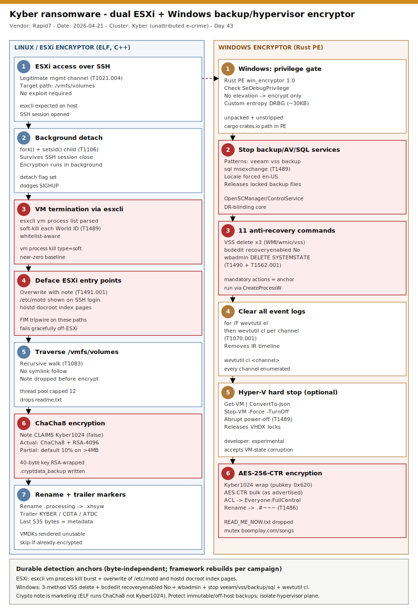

# Kyber ransomware — dual ESXi + Windows encryptor built to blind backup and hypervisor recovery

## TL;DR

Kyber is a cross-platform ransomware family that ships **two coordinated encryptors** — an ELF binary for Linux/VMware **ESXi** and a Rust PE for **Windows** — sharing one campaign ID and one Tor negotiation/leak infrastructure. Rapid7 recovered both payloads side by side during a **March 2026** incident-response engagement (one against ESXi datastores, one against Windows file servers) and published the analysis (Anna Sirokova, 2026-04-21). The case lands here today as the repo's **first primary in slot #30 (backup / DR / hypervisor ransomware)** and because the backup-targeting playbook it embodies is acutely live: Veeam shipped an actively-warned backup-server flaw (KB4852 / **CVE-2026-32996**, 2026-05-27) and The Gentlemen's leaked operations (CISO breach report 2026-06-08) show the same "kill backups first" pattern as a commodity. The durable lesson is specialization over sophistication: Kyber needs no zero-day — it abuses **native `esxcli` on ESXi** and a fixed set of **shadow-copy / backup-service / event-log** commands on Windows to make recovery impossible, while the ESXi variant's "post-quantum Kyber1024" ransom note is marketing (it actually runs **ChaCha8 + RSA-4096**). Detection must therefore be **behavioral** — service-stop and recovery-inhibition command sets, `esxcli vm process kill`, and ESXi management-file defacement — because the bytes change but the destructive actions cannot.

## Attribution and confidence

There is **no nation-state or named-group attribution**. "Kyber" is the operators' self-chosen brand (after the post-quantum KEM their ransom note name-drops). Rapid7 treats it as a relatively new, financially-motivated e-crime / RaaS-style operation that "has recently gained visibility" with limited prior public technical analysis. Confidence is split deliberately:

- **High** on the technical mechanics: both samples were reverse-engineered (IDA decompilation of the ELF crypto, Rust string/CLI analysis of the PE), with stable SHA-256 hashes, a shared campaign ID, and shared Tor infrastructure proving coordinated cross-platform deployment.
- **Low/none** on any actor identity, geography, or affiliate structure — the writeup names no cluster and ties Kyber to no known family.

| Property | ELF (Linux / ESXi) | PE (Windows) |
|---|---|---|
| Language / toolchain | C++, GCC 4.4.7, static OpenSSL 1.0.1e-fips | Rust, MSVC 19.36 / VS2022 |
| Actual cryptography | ChaCha8 + RSA-4096 key wrap | AES-256-CTR + Kyber1024 + X25519 (as advertised) |
| Ransom-note claim | AES-256-CTR + X25519 + Kyber1024 | AES-256-CTR + X25519 + Kyber1024 |
| Encrypted extension | `.xhsyw` | `.#~~~` |
| Ransom note | `readme.txt` | `READ_ME_NOW.txt` |
| VM targeting | native `esxcli` | PowerShell `Get-VM` (experimental) |
| Anti-recovery | none (relies on defacement + encryption) | 11 commands (require elevation) |

Genealogy with the repo: this is the **first slot #30 (backup/hypervisor) primary** and the repo's first dual-OS encryptor side-by-side. It complements the ESXi/Linux-impact thread (`2026-05-19_Embargo-Rust-SafeMode-BYOVD`, `2026-05-12_Qilin-EDR-Killer-msimg32`), the "ransomware-by-design vs wiper-by-accident" crypto-honesty thread (`2026-05-01_VECT-2.0-RaaS`, `2026-06-02_Aur0ra-NoRename-InPlace-Ransomware`), and the "detection without static IOCs" thread (`2026-06-05_Netlogon-CVE-2026-41089-DC-RCE`).

## Kill chain — summary table

| Stage | MITRE | Detail |
|---|---|---|
| Hypervisor access (ESXi) | T1021.004 | SSH to the ESXi host; binary expects `/vmfs/volumes` as its target path |
| Background detach (ESXi) | T1106 | `fork()` + `setsid()` to survive SSH session close while encryption runs |
| VM termination (ESXi) | T1489, T1057 | `esxcli vm process list` parsed for World IDs; `esxcli vm process kill type=soft world-id <id>` per VM (whitelist-aware) |
| Management-interface defacement (ESXi) | T1491.001 | Overwrites `/etc/motd` + `hostd` docroot `index.html` pages with the ransom note |
| Service / backup termination (Windows) | T1489 | Kills services matching `msexchange`, `vss`, `backup`, `veeam`, `sql` (locale forced en-US) |
| Recovery inhibition (Windows) | T1490, T1562.001 | 11-command set: VSS delete (WMI/WMIC/vssadmin), `bcdedit recoveryenabled No`, `wbadmin DELETE SYSTEMSTATEBACKUP`, Recycle Bin wipe |
| Log clearing (Windows) | T1070.001 | `for /F ... wevtutil el` then `wevtutil cl` over every channel |
| Hyper-V termination (Windows) | T1059.001, T1489 | `Get-VM` enumerated, `Stop-VM -Force -TurnOff` to release file locks (developer-flagged "experimental") |
| Encryption for impact | T1486, T1222.001 | Per-file symmetric key, RSA/Kyber-wrapped; partial-encryption strategy; ACL set to `Everyone:FullControl` on locked files |



The diagram is a two-lane view: the **left lane** is the ESXi/Linux encryptor path (SSH access → fork/setsid detach → enumerate and soft-kill VMs via `esxcli` → deface `/etc/motd` and the `hostd` web UI → traverse `/vmfs/volumes` → ChaCha8 in-place encryption with RSA-4096-wrapped keys → `.xhsyw`); the **right lane** is the Windows encryptor path (privilege check → terminate backup/AV/SQL services → run the 11 anti-recovery commands → clear all event logs → optional Hyper-V hard-stop → AES-256-CTR + Kyber1024 hybrid encryption → `.#~~~`). The critical (red) boxes mark the durable detection anchors: `esxcli vm process kill`, ESXi management-file overwrite, and the Windows service-stop + VSS/`bcdedit`/`wbadmin` recovery-inhibition command set — the things the operator **must** do regardless of which build runs.

## Stage-by-stage detail

### Stage 1 — ESXi access over SSH and background detach (T1021.004, T1106)

The Linux/ESXi binary (`6ccacb7567b6c0bd2ca8e68ff59d5ef21e8f47fc1af70d4d88a421f1fc5280fc`) is a 64-bit ELF, **not stripped**, written in C++ and statically linked against **OpenSSL 1.0.1e-fips**. Its help text explicitly names the VMware datastore root as the intended target, confirming ESXi intent:

```
required path argument -> /vmfs/volumes      (VMFS datastore root on ESXi)
size argument          -> validated 0-100    (partial-encryption percentage; default 10)
```

To survive the operator disconnecting, a **detach flag** makes the process `fork()`, exit the parent, and call `setsid()` in the child to drop the controlling terminal and dodge `SIGHUP`. Encryption of the datastores then continues uninterrupted in the background after SSH closes. The use of native ESXi shell access (T1021.004) rather than an exploit is the whole point: SSH on an ESXi host is a legitimate management channel, so the only anomaly is *what runs once it is open*.

### Stage 2 — VM enumeration and soft kill via native esxcli (T1489, T1057)

When the `vmkill` flag is set, the binary enumerates running VMs **before** encrypting so their disk files are unlocked. It `fork()`s a child that runs the ESXi-native command and redirects output via `dup2()`:

```
esxcli vm process list                              # parsed for Display Name + World ID
esxcli vm process kill type=soft world-id <id>      # one per VM, parent waits for each
```

Two implementation tells stand out. First, it uses `fork`/`execlp` rather than `system()` — arguments are passed as a null-terminated `argv` array straight to `execve`, bypassing the shell so VM names with spaces/special characters do not break the command. Second, `type=soft` requests a graceful shutdown (reducing the chance of corrupting VM disk state before encryption), followed by a ~2-second sleep. A `whitelist` argument lets the operator spare named VMs. **Detection anchor:** `esxcli vm process kill` is a near-zero-baseline command on a healthy host; a burst of soft-kills across many World IDs immediately before mass file change is the ESXi ransomware fingerprint.

### Stage 3 — Defacing every ESXi entry point (T1491.001)

Even before encryption, the ELF replaces three files so any administrator who logs in is met with the ransom note:

```
/etc/motd                                              # shown on SSH login
/usr/lib/vmware/hostd/docroot/index.html               # ESXi web UI landing page
/usr/lib/vmware/hostd/docroot/ui/index.html            # Host Client interface
```

On non-ESXi systems these paths do not exist and the rename fails gracefully, so execution continues. File-integrity monitoring of these specific paths is a cheap, high-fidelity tripwire.

### Stage 4 — ESXi encryption: marketing vs reality (T1486)

The ransom note claims **AES-256-CTR + X25519 + Kyber1024**. Decompilation says otherwise. In `ECRYPT_encrypt_bytes` the loop runs **8 rounds** (`i = 8; i > 0; i -= 2`) and applies 32-bit right rotations with constants **16, 20, 24, 25** — the complements of the standard ChaCha left-rotations (16, 12, 8, 7) from RFC 8439 — and `ECRYPT_keysetup` uses the `expand 32-byte k` sigma constant. The cipher is therefore **ChaCha8**. The statically-linked OpenSSL only provides **RSA-4096** key wrapping; there is **no post-quantum anything**. The operator almost certainly copy-pasted the note from the Windows build.

Each file gets a unique ChaCha8 key. The workflow:

```
1. create .locksignal, rename target -> .processing      (concurrency guard)
2. read last 535 bytes for trailer markers KYBER/CDTA/ATDC; if present, skip (already done)
3. generate 40-byte key/IV; wrap with embedded RSA-4096 public key
4. append wrapped metadata; verify BEFORE encrypting; save redundant <file>.cryptdata_backup
5. encrypt in-place in 1 MB chunks
6. on success rename .processing -> .xhsyw
```

Partial-encryption (size-based) keeps it fast while still ruining large VMDKs: files **<1 MB** fully encrypted; **1-4 MB** first 1 MB only; **>4 MB** a calculated percentage (CLI-validated 0-100, default **10**). Exclusions: `.xhsyw`, `.locksignal`, `.processing`, `.cryptdata_backup`, `.tmp`, `readme.txt`, and VMware `.sf` system files. Symlinks are not followed. Thread pool capped at 12.

### Stage 5 — Windows privilege gate and service/backup termination (T1489)

The Windows binary (`45bff0df2c408b3f589aed984cc331b617021ecbea57171dac719b5f545f5e8d`) is a 64-bit Rust PE (MSVC/VS2022), **unpacked and unstripped** — it retains Rust panic strings and the build path `C:\Users\user\.cargo\registry\src\index.crates.io-6f17d22bba15001f`, and its version flag reveals the project name **`win_encryptor 1.0`**. It aggregates entropy from four sources (system time, Windows CSPRNG, RDRAND, running-process data) into ~30 KB seeding an internal AES-CTR DRBG — an unusually careful key-quality pipeline.

It then checks for elevation by attempting to acquire **`SeDebugPrivilege`**. **Without** elevation it only encrypts files. **With** elevation it unlocks the destructive toolkit. First it forces the system locale to **en-US** (so service-name matching is language-independent) and terminates services matching five patterns via `OpenSCManagerA` / `EnumServicesStatusA` / `ControlService`:

```
msexchange   vss   backup   veeam   sql
```

This is the **backup/DR-blinding** core of slot #30: killing `veeam`, `vss`, `backup`, and `sql` services releases locked backup/database files and removes the very services an organization would use to restore.

### Stage 6 — The 11-command anti-recovery set + log clearing (T1490, T1562.001, T1070.001)

With elevation, the PE runs eleven commands via `CreateProcessW`:

```
1  powershell -ep bypass -nop -c "Get-WmiObject -Class Win32_ShadowCopy | ForEach-Object { $_.Delete() }"
2  wmic.exe SHADOWCOPY DELETE /nointeractive
3  vssadmin.exe Delete Shadows /all /quiet
4  bcdedit.exe /set {default} recoveryenabled No
5  bcdedit.exe /set {default} bootstatuspolicy ignoreallfailures
6  wbadmin DELETE SYSTEMSTATEBACKUP
7  wbadmin DELETE SYSTEMSTATEBACKUP -deleteOldest
8  iisreset.exe /stop
9  reg add HKLM\SYSTEM\CurrentControlSet\Services\LanmanServer\Parameters /v MaxMpxCt /d 65535 /t REG_DWORD /f
10 for /F "tokens=*" %i in ('wevtutil el') do wevtutil cl "%i"
11 rd /s /q C:\$Recycle.Bin
```

Three independent shadow-copy deletion methods (WMI, WMIC, vssadmin) give redundancy; `bcdedit` disables the Windows Recovery Environment and suppresses boot-failure prompts; `wbadmin` deletes system-state backups; command 10 enumerates and clears **every** event-log channel; command 9 raises SMB `MaxMpxCt` to speed up mass file access over shares. This fixed command set is the single most durable Windows detection surface — the byte-level payload is irrelevant when these exact actions are mandatory for the attack to work.

### Stage 7 — Optional Hyper-V hard stop (T1059.001, T1489)

If the `system` flag is set, the PE enumerates Hyper-V VMs and force-stops them to release locks (developer-labeled "experimental"):

```
Get-VM | select VMId, Name | ConvertTo-Json
Stop-VM -Force -TurnOff
```

`-TurnOff` is an abrupt power-off (not a graceful shutdown), accepting VM-state corruption in exchange for unlocked VHDX files to encrypt.

### Stage 8 — Windows encryption, ACL coercion, and shell-icon registration (T1486, T1222.001, T1112)

Unlike the ELF, the Windows variant **actually implements** its advertised hybrid scheme: it validates the embedded public key against the **Kyber1024 size of 1568 bytes (0x620)**, derives a 32-byte AES-256 key (expanded to a 60-word schedule), and uses **Kyber1024 to wrap the symmetric key while AES-CTR encrypts bulk data**. For locked files it invokes the **Windows Restart Manager** to identify and kill the holding process; if access is still denied it rewrites the ACL to **`Everyone:FullControl`** and clears the read-only attribute, retrying up to three times. Encrypted files are renamed `.#~~~` and a `READ_ME_NOW.txt` note dropped per directory. With elevation it registers the `.#~~~` extension with a custom icon (`C:\fucked_icon\processed_file.icon` written and set in the registry, then `ie4uinit.exe` refreshes the shell cache). Critical OS directories/files are excluded to keep the host bootable (e.g. `system volume information`, `programdata`, `microsoft`, `ntuser.dat`, `boot.ini`). A curious artifact: the mutex is the wide string `boomplay[.]com/songs/182988982` (a link to a track on a legitimate African music streaming service) stored in `.rdata`.

## RE notes

| Component | SHA256 | Lang | Packer | Notes |
|---|---|---|---|---|
| Linux/ESXi encryptor | `6ccacb7567b6c0bd2ca8e68ff59d5ef21e8f47fc1af70d4d88a421f1fc5280fc` | C++ (GCC 4.4.7) | None (static OpenSSL 1.0.1e-fips) | ChaCha8 + RSA-4096; `esxcli` VM kill; `/etc/motd` + hostd defacement; `.xhsyw` |
| Windows encryptor | `45bff0df2c408b3f589aed984cc331b617021ecbea57171dac719b5f545f5e8d` | Rust (MSVC/VS2022) | None (unstripped) | AES-256-CTR + Kyber1024 + X25519; 11 anti-recovery cmds; `win_encryptor 1.0`; `.#~~~` |
| Older Windows variant | `4ed176edb75ae2114cda8cfb3f83ac2ecdc4476fa1ef30ad8c81a54c0a223a29` | Rust | None | Earlier build; same family/campaign |

Crypto honesty is the headline RE point. The **ELF note is aspirational** (claims Kyber1024/X25519; runs ChaCha8 with constants 16/20/24/25 and the `expand 32-byte k` sigma, RSA-4096 wrap only). The **PE note is accurate** (Kyber1024 public-key size 0x620 validated, AES-256-CTR bulk, hybrid wrap). Trailer markers `KYBER`, `CDTA`, `ATDC` in the last 535 bytes of an ELF-encrypted file are a stable structural YARA anchor; the PE's `win_encryptor`, the cargo crates.io path, and the `boomplay.com/songs/182988982` mutex are stable string anchors **for these specific builds only** — they will change across builds, so they supplement (never replace) the behavioral rules.

## Detection strategy

### Telemetry that matters

- **ESXi**: shell command logging (`/var/log/shell.log`), `hostd.log`, `vmkwarning`; ship ESXi syslog off-host to a SIEM (`Syslog` table). Watch `esxcli vm process kill`, edits to `/etc/motd` and `/usr/lib/vmware/hostd/docroot/*`, and SSH session open/close around mass datastore writes.
- **Windows — Sysmon EID 1 / Security 4688** (process creation): `vssadmin.exe`, `wmic.exe SHADOWCOPY DELETE`, `bcdedit.exe`, `wbadmin.exe`, `wevtutil.exe cl`, `iisreset.exe /stop`, and `powershell` running `Win32_ShadowCopy ... Delete()` or `Stop-VM -Force -TurnOff`.
- **Windows — Sysmon EID 7 / Service Control Manager 7036/7040**: bulk service stops matching `veeam`/`vss`/`backup`/`sql`/`msexchange`.
- **Windows — Sysmon EID 13** (registry): `LanmanServer\Parameters\MaxMpxCt` set to 65535; `.#~~~` extension/DefaultIcon registration.
- **Defender XDR**: `DeviceProcessEvents`, `DeviceFileEvents`, `DeviceRegistryEvents`. **Sentinel**: `SecurityEvent` (4688), `Syslog` (ESXi), `Event` (SCM).

### Detection coverage

| Engine | File | Logic |
|---|---|---|
| Sigma | `sigma/01_windows_recovery_inhibition_chain.yml` | Shadow-copy deletion + `bcdedit recoveryenabled No` + `wbadmin` system-state delete (T1490, T1562.001) |
| Sigma | `sigma/02_windows_backup_service_stop_and_logclear.yml` | Service-stop of backup/AV/SQL via `net stop`/`sc`/`taskkill` + `wevtutil cl` mass log clear (T1489, T1070.001) |
| Sigma | `sigma/03_esxi_esxcli_vm_kill_and_motd_deface.yml` | `esxcli vm process kill` burst and `/etc/motd` / hostd docroot overwrite on ESXi (T1489, T1491.001) |
| KQL | `kql/k1_recovery_inhibition_commands.kql` | The Kyber 11-command anti-recovery set in `DeviceProcessEvents` (T1490) |
| KQL | `kql/k2_backup_av_sql_service_stop.kql` | Bulk stop of `veeam`/`vss`/`backup`/`sql`/`msexchange` services (T1489) |
| KQL | `kql/k3_hyperv_force_stop_and_maxmpxct.kql` | `Stop-VM -Force -TurnOff` + `MaxMpxCt` registry change pre-encryption (T1489, T1112) |
| KQL | `kql/k4_esxi_syslog_esxcli_kill_deface.kql` | ESXi `Syslog`: `esxcli vm process kill` + management-file edits (T1489, T1491.001) |
| YARA | `yara/kyber_ransomware.yar` (2 rules) | ELF ChaCha8/`esxcli`/`.xhsyw`/`KYBER-CDTA-ATDC` trailer; PE Rust `win_encryptor`/`boomplay` mutex/`.#~~~` |
| Suricata | `suricata/kyber_ransomware.rules` (3 sids) | SMB `MaxMpxCt`-class lateral indicators, ESXi SSH-then-mass-rename heuristic note, Tor-note string in dropped HTTP (tuning-dependent) |

### Threat hunting hypotheses

- **H1** (`hunts/peak_h1_recovery_inhibition_burst.md`) — *If* Kyber's Windows payload ran, *then* a single host will show shadow-copy deletion via three methods plus `bcdedit`/`wbadmin`/`wevtutil cl` within a tight time window.
- **H2** (`hunts/peak_h2_backup_service_stop.md`) — *If* the encryptor reached backup infrastructure, *then* `veeam`/`vss`/`backup`/`sql` services will be stopped en masse immediately before file-modification spikes.
- **H3** (`hunts/peak_h3_esxi_esxcli_kill_and_deface.md`) — *If* the ESXi variant ran, *then* ESXi logs will show a burst of `esxcli vm process kill type=soft` and overwrites of `/etc/motd` and the `hostd` docroot pages.

## Incident response playbook

### First 60 minutes (triage)

1. **Isolate at the hypervisor and network layer, not just the guest.** If ESXi is hit, pull SSH/management access and snapshot host state; if Windows file/backup servers are hit, isolate them to stop lateral SMB encryption.
2. **Protect surviving backups immediately.** Confirm whether immutable/air-gapped copies exist and are unreachable from the compromised admin context; do not mount backups onto a potentially-infected host.
3. **Determine elevation state on Windows hosts.** Without `SeDebugPrivilege` the PE only encrypts; with it, the 11 anti-recovery commands ran — check for VSS/`bcdedit`/`wbadmin` activity to scope recoverability.
4. **Capture ESXi logs before reboot** (`shell.log`, `hostd.log`): they hold the `esxcli vm process kill` sequence and the defacement writes.
5. **Identify campaign scope** via the shared campaign ID and Tor addresses across both ELF and PE hosts to confirm a single coordinated event.
6. **Preserve a sample of each variant** and at least one `.xhsyw` / `.#~~~` file (the wrapped-key trailer is needed for any future decryption assessment).

### Artifacts to collect

| Artifact | Path | Tool | Why |
|---|---|---|---|
| ESXi shell history | `/var/log/shell.log`, `/var/log/hostd.log` | scp / syslog | `esxcli vm process kill` sequence + access timeline |
| ESXi defaced files | `/etc/motd`, `/usr/lib/vmware/hostd/docroot/index.html` | file copy | Confirms ESXi variant; ransom-note content |
| Encrypted sample (ESXi) | any `.xhsyw` (+ `.cryptdata_backup`) | forensic copy | RSA-4096-wrapped 40-byte key/IV trailer (KYBER/CDTA/ATDC) |
| Windows process telemetry | EDR / Sysmon / 4688 | XDR / SIEM | The 11-command set, service stops, Hyper-V stop |
| VSS / backup state | `vssadmin list shadows`, backup catalog | native tools | Scope what recovery still exists |
| Encryptor binaries | dropped paths | EDR / disk image | `win_encryptor` PE and ELF for hashing/YARA |

### IR queries and commands

```powershell
# Did the Kyber anti-recovery set run on this host? (review last 14 days)
$cmds = 'vssadmin','wmic','bcdedit','wbadmin','wevtutil','iisreset'
Get-WinEvent -FilterHashtable @{LogName='Security';Id=4688} -MaxEvents 20000 -ErrorAction SilentlyContinue |
  Where-Object { $cmds | ForEach-Object { $_ } | Where-Object { $event.Message -match $_ } } |
  Select-Object TimeCreated, @{n='Cmd';e={($_.Properties[5].Value)}} | Sort-Object TimeCreated

# Check for the MaxMpxCt tampering and shadow-copy state
reg query "HKLM\SYSTEM\CurrentControlSet\Services\LanmanServer\Parameters" /v MaxMpxCt
vssadmin list shadows
```

```bash
# ESXi: confirm VM-kill burst and defacement (run from the host or on collected logs)
grep -E "esxcli vm process kill|vm process list" /var/log/shell.log
for f in /etc/motd /usr/lib/vmware/hostd/docroot/index.html /usr/lib/vmware/hostd/docroot/ui/index.html; do
  echo "== $f =="; head -c 400 "$f"; echo; done
find /vmfs/volumes -maxdepth 3 -name '*.xhsyw' 2>/dev/null | head
```

```kql
// Defender XDR: shadow-copy deletion via any of the three Kyber methods, last 14 days
DeviceProcessEvents
| where Timestamp > ago(14d)
| where (FileName =~ "vssadmin.exe" and ProcessCommandLine has "Delete Shadows")
    or (FileName =~ "wmic.exe" and ProcessCommandLine has "shadowcopy" and ProcessCommandLine has "delete")
    or (ProcessCommandLine has "Win32_ShadowCopy" and ProcessCommandLine has "Delete")
| project Timestamp, DeviceName, AccountName, FileName, ProcessCommandLine
| order by Timestamp asc
```

### Containment, eradication, recovery

**Exit criteria:** the access path is identified and closed (e.g. exposed ESXi SSH/management, a compromised backup-server account, or a patch-gap such as Veeam CVE-2026-32996); all encryptor binaries and dropped notes are removed; recovery is performed from **verified-clean, immutable/offline backups**; and ESXi management files are restored from a known-good source.

**What NOT to do:** do **not** reboot an ESXi host mid-encryption hoping to interrupt it (the detach/`setsid` child keeps running and a reboot can finalize VM-state corruption); do **not** restore backups onto a host before confirming the encryptor and its persistence are gone; do **not** treat "antivirus removed the binary" as recovery when the 11 commands have already destroyed shadow copies and system-state backups.

### Recovery validation

Rebuild or restore VMs from offline copies and verify integrity before reconnecting to production; re-enable Windows Recovery Environment (`bcdedit /set {default} recoveryenabled Yes`) and re-establish VSS/backup schedules; reset `MaxMpxCt` to its baseline; rotate credentials for any backup, hypervisor, and domain accounts the operator could have touched; and confirm event-log collection is restored and forwarding off-host (the attacker cleared it).

## IOCs

These are **specific to the analyzed March-2026 samples**; Kyber rebuilds per campaign, so the **behavioral command sets are the durable detection** and these values supplement them. Full list in `iocs.csv`.

| Type | Value | Context | Confidence | Source |
|---|---|---|---|---|
| sha256 | 6ccacb7567b6c0bd2ca8e68ff59d5ef21e8f47fc1af70d4d88a421f1fc5280fc | Linux/ESXi ELF encryptor (ChaCha8 + RSA-4096) | high | Rapid7 |
| sha256 | 45bff0df2c408b3f589aed984cc331b617021ecbea57171dac719b5f545f5e8d | Windows Rust encryptor (`win_encryptor 1.0`) | high | Rapid7 |
| sha256 | 4ed176edb75ae2114cda8cfb3f83ac2ecdc4476fa1ef30ad8c81a54c0a223a29 | Older Windows variant, same family | medium | Rapid7 |
| string | .xhsyw | Encrypted-file extension (ESXi/Linux) | high | Rapid7 |
| string | .#~~~ | Encrypted-file extension (Windows) | high | Rapid7 |
| string | win_encryptor | Rust project/version name in the PE | medium | Rapid7 |
| string | boomplay.com/songs/182988982 | Mutex (wide string) used by the Windows variant | medium | Rapid7 |
| string | KYBER / CDTA / ATDC | Metadata trailer markers in ELF-encrypted files (last 535 bytes) | high | Rapid7 |
| domain | Mlnmlnnrdhcaddwll4zqvfd2vyqsgtgj473gjoehwna2v4sizdukheyd.onion | Tor negotiation portal (shared by both variants) | high | Rapid7 |
| domain | Kyblogtz6k3jtxnjjvluee5ec4g3zcnvyvbgsnq5thumphmqidkt7xid.onion | Tor leak blog (shared by both variants) | high | Rapid7 |
| note | esxcli vm process kill type=soft world-id <id> | ESXi VM-termination command (behavioral anchor) | high | Rapid7 |
| cve | CVE-2026-32996 | Veeam Backup & Replication / Agent LPE (KB4852, 2026-05-27) — backup-server pivot context, secondary | high | Veeam KB4852 |

## Secondary findings

- **Veeam KB4852 / CVE-2026-32996 (2026-05-27, CVSS 7.3) — the fresh backup-server pivot (#30/#3).** A local privilege-escalation flaw in the Veeam Agent for Windows component affecting Backup & Replication 13.0.1.2067 and earlier v13 builds (fixed in 13.0.2.29), reported through HackerOne by an Alibaba researcher and actively warned ("patch now"). It is the live, this-period reminder of *why* Kyber's `veeam`/`backup`/`sql` service kill matters: a compromised or escalated-on backup server is the single highest-leverage pivot in a ransomware intrusion, because it both holds data and controls restoration. Patch-reverse-engineering shortens the window between disclosure and exploitation.
- **The Gentlemen leaked playbook + Microsoft Go-encryptor analysis (admin-acknowledged leak 2026-05-04; Microsoft 2026-05-28; CISO breach report 2026-06-08) — backup-kill as commodity (#3/#4).** The Gentlemen's encryptor (self-propagating Go) terminates backup services, AV agents, and remote-access tools, deletes shadow copies, and clears logs — the same recovery-blinding pattern as Kyber, but with a leaked operations database confirming initial access predominantly via **FortiGate CVE-2024-55591** and a curated stockpile of ~14,700 compromised FortiGate devices and ~969 brute-forced VPN credentials. It illustrates the IAB→affiliate handoff (#4) feeding the impact stage Kyber represents.
- **ESXi living-off-the-land is the defining #30 control gap (#22/#25).** Kyber needed no exploit — `esxcli`, `vssadmin`, `bcdedit`, and `wbadmin` are all native, signed, and expected on their respective platforms. The defensive corollary is that the only reliable safety net is **immutable / air-gapped backups isolated from the production admin plane**, plus least-privilege and MFA on ESXi SSH/management; detection has to watch native-tool *behavior*, not foreign binaries.

## Pedagogical anchors

- **The ransom note is marketing, not a spec.** The ESXi variant advertises post-quantum Kyber1024 but runs ChaCha8 with RSA-4096 — the operator copy-pasted the note from the Windows build. Verify cryptography by decompilation (round count, rotation constants, sigma string, key-size checks), never by what the criminal claims.
- **Specialization beats sophistication.** No zero-days, no custom packers — just native `esxcli` and a fixed Windows recovery-inhibition command set. The "code isn't impressive" trap leads defenders to underrate operationally devastating tooling; measure threat by impact and reliability, not novelty.
- **Backups are the target, so protect the restoration plane.** Killing `veeam`/`vss`/`backup`/`sql` and deleting shadow copies + system-state backups is the whole game in slot #30. Immutable, off-host, admin-plane-isolated backups are the control that survives this attack class.
- **Detect the actions the attacker cannot avoid.** Per-build polymorphism defeats hashes, but `esxcli vm process kill`, three-method VSS deletion, `bcdedit recoveryenabled No`, and `wevtutil cl` over all channels are mandatory for the attack to succeed — anchor detection there.
- **Hypervisor and backup compromise is a blast-radius problem.** One ESXi host encrypts every VM on it; one backup server controls every restore. Containment means isolating the hypervisor/backup plane, not killing a guest process.

## What's in this folder

| File | Purpose |
|---|---|
| [README.md](./README.md) | This analysis (15 sections) |
| [kill_chain.svg](./kill_chain.svg) | Two-lane kill-chain diagram (template A) — ESXi lane vs Windows lane |
| [sigma/01_windows_recovery_inhibition_chain.yml](./sigma/01_windows_recovery_inhibition_chain.yml) | Shadow-copy delete + bcdedit + wbadmin recovery inhibition |
| [sigma/02_windows_backup_service_stop_and_logclear.yml](./sigma/02_windows_backup_service_stop_and_logclear.yml) | Backup/AV/SQL service stop + mass event-log clear |
| [sigma/03_esxi_esxcli_vm_kill_and_motd_deface.yml](./sigma/03_esxi_esxcli_vm_kill_and_motd_deface.yml) | ESXi `esxcli vm process kill` + management-file defacement |
| [kql/k1_recovery_inhibition_commands.kql](./kql/k1_recovery_inhibition_commands.kql) | Kyber 11-command anti-recovery set |
| [kql/k2_backup_av_sql_service_stop.kql](./kql/k2_backup_av_sql_service_stop.kql) | Bulk backup/AV/SQL service stop |
| [kql/k3_hyperv_force_stop_and_maxmpxct.kql](./kql/k3_hyperv_force_stop_and_maxmpxct.kql) | Hyper-V force-stop + MaxMpxCt registry tamper |
| [kql/k4_esxi_syslog_esxcli_kill_deface.kql](./kql/k4_esxi_syslog_esxcli_kill_deface.kql) | ESXi Syslog: esxcli VM kill + defacement |
| [yara/kyber_ransomware.yar](./yara/kyber_ransomware.yar) | ELF + PE structural/string rules (2 rules) |
| [suricata/kyber_ransomware.rules](./suricata/kyber_ransomware.rules) | Network/SMB heuristics + dropped-note string (3 sids) |
| [hunts/peak_h1_recovery_inhibition_burst.md](./hunts/peak_h1_recovery_inhibition_burst.md) | PEAK hunt — recovery-inhibition command burst |
| [hunts/peak_h2_backup_service_stop.md](./hunts/peak_h2_backup_service_stop.md) | PEAK hunt — backup/AV/SQL service stop |
| [hunts/peak_h3_esxi_esxcli_kill_and_deface.md](./hunts/peak_h3_esxi_esxcli_kill_and_deface.md) | PEAK hunt — ESXi esxcli kill + defacement |
| [iocs.csv](./iocs.csv) | IOCs + behavioral/context anchors |

## Sources

- [Rapid7 — Kyber Ransomware Double Trouble: Windows and ESXi Attacks Explained (Anna Sirokova, 2026-04-21)](https://www.rapid7.com/blog/post/tr-kyber-ransomware-double-trouble-windows-esxi-attacks-explained/)
- [WatchGuard — Ransomware Tracker: Kyber](https://www.watchguard.com/wgrd-security-hub/ransomware-tracker/kyber)
- [Veeam — KB4852: Vulnerabilities Resolved in Veeam Backup & Replication 13.0.2 (CVE-2026-32996)](https://www.veeam.com/kb4852)
- [CyberSecurityNews — Veeam Backup & Replication Tool Vulnerability Enables Privilege Escalation Attacks](https://cybersecuritynews.com/veeam-backup-replication-tool-vulnerability/)
- [Microsoft Security Blog — The Gentlemen ransomware: Dissecting a self-propagating Go encryptor (2026-05-28)](https://www.microsoft.com/en-us/security/blog/2026/05/28/the-gentlemen-ransomware-dissecting-a-self-propagating-go-encryptor/)
- [Infosecurity Magazine — Ransomware Affiliate Exposes Details of 'The Gentlemen' Operation](https://www.infosecurity-magazine.com/news/ransomware-affiliate-gentlemen/)
- [MITRE ATT&CK — T1490 Inhibit System Recovery](https://attack.mitre.org/techniques/T1490/)
- [MITRE ATT&CK — T1489 Service Stop](https://attack.mitre.org/techniques/T1489/)
