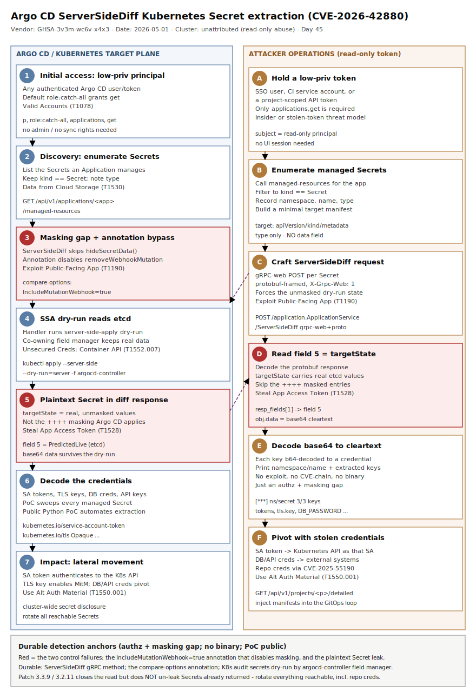

# Argo CD ServerSideDiff Kubernetes Secret extraction (CVE-2026-42880) — a read-only GitOps user reads etcd Secrets in plaintext

## TL;DR

Argo CD — the most widely deployed GitOps continuous-delivery controller for Kubernetes — masks Kubernetes `Secret` values on every API surface except one: the `ServerSideDiff` gRPC/REST endpoint. **CVE-2026-42880** (GHSA-3v3m-wc6v-x4x3, CVSS 9.6, advisory published 2026-05-01 by maintainer `alexmt`, reported by `hoang-prod`) lets any authenticated user with the default `get` RBAC — including nominally read-only accounts — coerce that endpoint into returning the raw, unmasked Server-Side-Apply dry-run state pulled directly from `etcd`, leaking service-account tokens, TLS keys, database credentials and API keys. A public Python proof-of-concept automates the whole sweep over every `Secret` an Application manages. This is a Thursday supply-chain class (the CD control plane is the software supply chain) and the repo's **first GitOps/IaC (#31) primary**; it lands the same week Argo CD is in the news for a companion max-severity repo-credential leak (CVE-2025-55190), so the GitOps trust boundary is acutely live. There is no live campaign attribution — confidence is **high** on the mechanism and **low** on any specific actor.

## Attribution and confidence

This is a vulnerability-exposure case, not an intrusion with victim artifacts. There is no named threat actor: the "cluster" is opportunistic exploitation of a publicly disclosed flaw with a working PoC.

| Dimension | Assessment | Confidence |
|---|---|---|
| Vulnerability mechanics (endpoint, masking gap, SSA dry-run, annotation bypass) | Fully described in the vendor advisory with source-line references and a working PoC | high |
| Affected/patched versions | 3.2.0–3.3.8 affected; fixed in 3.3.9 and 3.2.11 | high |
| CVE assignment | Press and the GitLab/third-party advisory databases track GHSA-3v3m-wc6v-x4x3 as **CVE-2026-42880**; the GitHub advisory page itself still shows "No known CVE" at time of writing | medium |
| Who is exploiting it in the wild | No public exploitation telemetry yet; insider/low-priv-token abuse is the realistic threat model | low |

**Aliases / identifiers.** CVE-2026-42880 · GHSA-3v3m-wc6v-x4x3 · "Argo CD ServerSideDiff Secret extraction". Reporter: `hoang-prod`. Advisory author: `alexmt` (Alexander Matyushentsev, Argo maintainer).

**Overlap table.**

| Identifier | Product | Class | Relationship |
|---|---|---|---|
| CVE-2026-42880 (this case) | Argo CD 3.2.0–3.3.8 | Secret disclosure via ServerSideDiff masking gap (CWE-200/CWE-212) | Primary |
| CVE-2025-55190 | Argo CD ≤3.1.1 / 2.13–2.14 branches | Project API token returns plaintext repo credentials (CVSS 10.0, disclosed 2025-09-04) | Same product, same trust-boundary failure mode (an authz/masking gap turns "read metadata" into "read secrets") |
| CVE-2026-4342 (ingress-nginx) | Kubernetes ingress-nginx | Annotation-driven Secret exposure | Same anti-pattern: an annotation flips a security control off |

**Genealogy with previous repo cases.** This continues the repo's "detection without static IOCs" thread — like `2026-06-05_Netlogon-CVE-2026-41089-DC-RCE` and `2026-06-07_SecureBoot-2011-Cert-Expiry-Bootkit-Exposure`, the durable signal is structural/behavioral (a specific API method, a specific annotation, an audit-log shape), not a hash. It is the cloud-supply-chain sibling of the npm/PyPI software-supply-chain cases (`2026-05-14_Mini-Shai-Hulud`, `2026-05-21_TeamPCP-48h-Multi-Vector-SupplyChain`): there the build feed was poisoned; here the deploy control plane is the leak.

## Kill chain — summary table

| Stage | MITRE | Detail |
|---|---|---|
| Initial access — low-privilege Argo CD principal | T1078 Valid Accounts | Any authenticated SSO user / project API token with default `get` (the `role:catch-all` policy grants `applications, get`). |
| Discovery — enumerate managed Secrets | T1530 Data from Cloud Storage; T1552.007 | `GET /api/v1/applications/{app}/managed-resources`; filter `kind == Secret`. |
| Precondition — vulnerable endpoint + annotation | T1190 Exploit Public-Facing Application | `ServerSideDiff` skips `hideSecretData()`; defense `removeWebhookMutation()` is bypassed when the Application carries `argocd.argoproj.io/compare-options: IncludeMutationWebhook=true`. |
| Trigger — SSA dry-run reads etcd | T1552.007 Unsecured Credentials: Container API | The handler runs `kubectl apply --server-side --dry-run=server --field-manager=argocd-controller`; a co-owning field manager (e.g. `kube-controller-manager`) keeps the real `data` alive. |
| Extraction — plaintext Secret in the diff | T1528 Steal Application Access Token | `targetState`/`PredictedLive` returns real base64 `data`; the PoC decodes SA tokens, TLS keys, DB creds, API keys. |
| Impact — lateral movement / cluster compromise | T1550.001 Use Alternate Authentication Material | Stolen SA tokens authenticate to the Kubernetes API; DB/API creds pivot to external services and private repos. |



The diagram is two-lane: the **left lane is the Argo CD / Kubernetes target plane** (the API server, the masking gap, the SSA dry-run against `etcd`, the plaintext leak, cluster-wide impact), and the **right lane is the attacker's operations** (a low-priv token, `managed-resources` recon, the crafted `ServerSideDiff` gRPC-web request, decode, and pivot). The red boxes are the two control failures that matter for detection: the `IncludeMutationWebhook=true` annotation that disables masking, and the `ServerSideDiff` call that returns real `etcd` values. Detection anchors are the gRPC method name, the annotation, and the Kubernetes audit record for an `argocd-controller` server-dry-run on `Secret` objects.

## Stage-by-stage detail

### Stage 1 — Initial access: a low-privilege Argo CD principal

The attacker needs nothing more than an authenticated Argo CD identity with `applications, get`. Argo CD ships a default `role:catch-all` policy under which **every authenticated user has `get`**, so a junior developer's SSO login, a CI service account, or a project-scoped API token is sufficient. No cluster-admin, no Argo CD admin, no `update`/`sync` rights.

```
# default policy that makes every authenticated user a candidate
p, role:catch-all, applications, get, */*, allow
```

MITRE: **T1078 Valid Accounts** (any legitimate Argo CD principal).

### Stage 2 — Discovery: enumerate the Secrets an Application manages

The PoC first lists managed resources and keeps the `Secret` objects, recording each one's `type` (so it can build a valid minimal target manifest later) and its `liveState`.

```
GET /api/v1/applications/<app>/managed-resources
# keep items where kind == "Secret"; note metadata.namespace, name, type
```

MITRE: **T1530 Data from Cloud Storage**, **T1552.007 Unsecured Credentials: Container API**.

### Stage 3 — Precondition: the masking gap plus the annotation that disables the backstop

Argo CD masks Secret `data` everywhere — `GetManifests`, `GetManifestsWithFiles`, `GetResource`, `PatchResource` all call `hideSecretData()`. The one endpoint that does **not** is `ServerSideDiff`, which builds its response from raw, unmasked `PredictedLive`/`NormalizedLive` states:

```go
// server/application/application.go:3051-3062
responseDiffs = append(responseDiffs, &v1alpha1.ResourceDiff{
    TargetState:     string(diffRes.PredictedLive),
    LiveState:       string(diffRes.NormalizedLive),
})
```

A second defense, `removeWebhookMutation()`, normally strips non-Argo-CD-managed fields from the SSA dry-run response and merges back the client-supplied (masked) live state. That backstop is **skipped entirely** when the Application carries the annotation that flips `ignoreMutationWebhook` to `false`:

```yaml
# Application annotation that disables the masking backstop
metadata:
  annotations:
    argocd.argoproj.io/compare-options: IncludeMutationWebhook=true
```

```go
if o.ignoreMutationWebhook {
    predictedLive, err = removeWebhookMutation(predictedLive, live, o.gvkParser, o.manager)
}
```

MITRE: **T1190 Exploit Public-Facing Application** (abuse of the exposed gRPC/REST surface).

### Stage 4 — Trigger: the Server-Side-Apply dry-run reads etcd

When `ServerSideDiff` runs, the handler invokes `K8sServerSideDryRunner.Run()`, equivalent to:

```
kubectl apply --server-side --dry-run=server --field-manager=argocd-controller
```

For the real values to survive, the Secret's `data` fields must be co-owned by **at least one non-Argo-CD SSA field manager**. If `argocd-controller` is the sole owner of `data`, the dry-run garbage-collects those fields (the attacker-supplied target manifest omits them). When a second manager exists — commonly `kube-controller-manager` for service-account token Secrets — that manager retains ownership and the real values read from `etcd` survive into the response.

MITRE: **T1552.007 Unsecured Credentials: Container API**.

### Stage 5 — Extraction: plaintext Secret in the diff response

The PoC crafts a minimal gRPC-web `ServerSideDiff` request — a target manifest with the right `apiVersion`/`kind`/`metadata`/`type` but **no `data` field** — for each Secret, then reads field 5 (`targetState`, i.e. `PredictedLive`) from the protobuf response. Values are real base64 (not Argo CD's `++++` masking) and decode to cleartext.

```
POST /application.ApplicationService/ServerSideDiff
Content-Type: application/grpc-web+proto
X-Grpc-Web: 1
# response field 5 (targetState) = real Secret data, base64, NOT "++++" masked
```

A run prints something like `[***] kube-system/<sa>-token (kubernetes.io/service-account-token) — 3/3 keys extracted`. MITRE: **T1528 Steal Application Access Token**.

### Stage 6 — Impact: lateral movement and cluster compromise

A leaked `kubernetes.io/service-account-token` authenticates straight to the Kubernetes API with that SA's RBAC — potential lateral movement or privilege escalation depending on the SA's bindings. A leaked `kubernetes.io/tls` key enables MitM against the service it fronts. Database credentials and API keys compromise external systems and, where reused, private Git repositories (which is exactly the asset CVE-2025-55190 leaks directly). MITRE: **T1550.001 Use Alternate Authentication Material: Application Access Tokens**.

## Detection strategy

### Telemetry that matters

- **Argo CD API server logs** (`argocd-server`): gRPC method `/application.ApplicationService/ServerSideDiff`, the calling subject (SSO user / API token / project), source IP and `User-Agent`. Enable structured request logging.
- **Kubernetes audit log**: `apply`/`patch` requests on `secrets` with `?dryRun=All`, `fieldManager=argocd-controller`, `objectRef.resource=secrets`. A spike of dry-run reads across many namespaces from the Argo CD service account is the server-side tell even if Argo CD's own logs are thin.
- **Argo CD Application manifests**: any Application carrying `argocd.argoproj.io/compare-options: IncludeMutationWebhook=true` — this is the precondition; inventory it as config drift.
- **Argo CD RBAC** (`argocd-rbac-cm`): how broad is `role:catch-all`/default `get`? Who holds project API tokens?
- **Ingress/L7 proxy logs** in front of `argocd-server`: POSTs to the `ServerSideDiff` path with `application/grpc-web+proto`.

### Detection coverage

| Engine | File | Logic |
|---|---|---|
| Sigma | [sigma/argocd_serversidediff_secret_read.yml](./sigma/argocd_serversidediff_secret_read.yml) | Argo CD API audit event for the `ServerSideDiff` method invoked by a non-admin / read-only subject. |
| Sigma | [sigma/argocd_application_includemutationwebhook_annotation.yml](./sigma/argocd_application_includemutationwebhook_annotation.yml) | Kubernetes audit: an `Application` CR created/patched with the `IncludeMutationWebhook=true` compare-option annotation. |
| Sigma | [sigma/k8s_secret_ssa_dryrun_argocd_controller.yml](./sigma/k8s_secret_ssa_dryrun_argocd_controller.yml) | Kubernetes audit: server-side-apply **dry-run** against `secrets` with `fieldManager=argocd-controller`. |
| KQL | [kql/argocd_serversidediff_call_anomaly.kql](./kql/argocd_serversidediff_call_anomaly.kql) | Sentinel `Syslog`/custom Argo CD log: rare-subject baseline for `ServerSideDiff` calls. |
| KQL | [kql/k8s_secret_dryrun_burst.kql](./kql/k8s_secret_dryrun_burst.kql) | Kubernetes audit (custom table): burst of `secrets` dry-run reads by `argocd-controller` across namespaces. |
| KQL | [kql/argocd_includemutationwebhook_inventory.kql](./kql/argocd_includemutationwebhook_inventory.kql) | Inventory Applications carrying the vulnerable annotation. |
| KQL | [kql/argocd_repo_creds_endpoint_access.kql](./kql/argocd_repo_creds_endpoint_access.kql) | Companion CVE-2025-55190: access to `/api/v1/projects/{project}/detailed`. |
| YARA | [yara/argocd_serversidediff_poc.yar](./yara/argocd_serversidediff_poc.yar) | Content heuristic for the public PoC / derivative extractor tooling on disk (2 rules). |
| Suricata | [suricata/argocd_serversidediff.rules](./suricata/argocd_serversidediff.rules) | gRPC-web POST to the `ServerSideDiff` path; `managed-resources` enumeration; companion repo-creds endpoint (4 sids). |

No SPL is shipped (retired repo-wide 2026-05-11); convert any Sigma rule with `sigma convert -t splunk` if needed.

### Threat hunting hypotheses

- **H1 — Who legitimately calls ServerSideDiff?** Most Argo CD users never invoke it directly; the UI does, but from a small set of service principals. Baseline callers and alert on a new/rare subject sweeping it across many Applications. → [hunts/peak_h1_serversidediff_caller_baseline.md](./hunts/peak_h1_serversidediff_caller_baseline.md)
- **H2 — Where is the masking backstop disabled?** Hunt every Application for `IncludeMutationWebhook=true`; on those, exploitation needs only read-only access, so they are the crown-jewel exposure. → [hunts/peak_h2_includemutationwebhook_exposure.md](./hunts/peak_h2_includemutationwebhook_exposure.md)
- **H3 — Server-side evidence in the K8s audit log.** Even with sparse Argo CD logs, a fan-out of `secrets` SSA dry-run reads by `argocd-controller` is the etcd-read fingerprint. Correlate with the calling Argo CD subject and with the companion repo-creds endpoint. → [hunts/peak_h3_k8s_audit_dryrun_fanout.md](./hunts/peak_h3_k8s_audit_dryrun_fanout.md)

## Incident response playbook

### First 60 minutes (triage)

1. **Confirm exposure.** Check the running Argo CD version. Affected: `3.2.0`–`3.3.8`. If on an affected build, treat as exposed.
2. **Inventory the precondition.** `kubectl get applications -A -o json | jq '.items[] | select(.metadata.annotations["argocd.argoproj.io/compare-options"] // "" | contains("IncludeMutationWebhook=true")) | .metadata.namespace + "/" + .metadata.name'`. Any hit is read-only-exploitable.
3. **Pull the Argo CD audit/API logs** for `ServerSideDiff` calls and the Kubernetes audit log for `argocd-controller` `secrets` dry-runs; bound the window to first-affected-deploy → now.
4. **Scope which Secrets were reachable** — every `Secret` in any Application whose `data` is co-owned by a non-Argo-CD field manager.
5. **Patch now.** Upgrade to `3.3.9` (3.3.x) or `3.2.11` (3.2.x).

### Artifacts to collect

| Artifact | Path / source | Tool | Why |
|---|---|---|---|
| Argo CD server logs | `argocd-server` pod logs / log sink | `kubectl logs`, SIEM | `ServerSideDiff` calls + calling subject |
| Kubernetes audit log | API server audit backend | `kubectl`/cloud audit export | server-side proof of `secrets` dry-run reads |
| Application CRs | `argocd` namespace | `kubectl get applications -A -o yaml` | find `IncludeMutationWebhook=true` |
| RBAC config | `argocd-rbac-cm` ConfigMap | `kubectl get cm argocd-rbac-cm -o yaml` | who holds `get`; token inventory |
| Secret ownership | each managed Secret | `kubectl get secret <s> -o yaml --show-managed-fields` | which had a co-owning manager (was leakable) |

### IR queries and commands

```bash
# Argo CD version
argocd version --short 2>/dev/null || kubectl -n argocd get deploy argocd-server -o jsonpath='{.spec.template.spec.containers[0].image}'

# Applications with the masking-bypass annotation (the exposed set)
kubectl get applications -A -o json \
  | jq -r '.items[] | select((.metadata.annotations["argocd.argoproj.io/compare-options"] // "") | test("IncludeMutationWebhook=true")) | "\(.metadata.namespace)/\(.metadata.name)"'

# Secrets whose data is co-owned (were extractable via the dry-run)
kubectl get secret -A -o json \
  | jq -r '.items[] | select([.metadata.managedFields[].manager] | (index("argocd-controller") != null) and (length > 1)) | "\(.metadata.namespace)/\(.metadata.name)"'
```

```kql
// Sentinel: ServerSideDiff calls by subject in the exposure window (custom Argo CD log table)
ArgoCD_Audit_CL
| where TimeGenerated > ago(30d)
| where grpcMethod_s has "ServerSideDiff"
| summarize calls=count(), apps=dcount(application_s) by subject_s, SourceIP_s
| order by calls desc
```

### Containment, eradication, recovery

- **Contain:** restrict the default `role:catch-all` `get` (scope `applications, get` to specific projects); revoke broad project API tokens; gate `argocd-server` behind network policy / SSO so anonymous/low-trust access cannot reach the gRPC surface.
- **Eradicate:** patch to `3.3.9`/`3.2.11`; remove unnecessary `IncludeMutationWebhook=true` annotations.
- **Recover — rotate everything that was reachable:** any Secret in an exposed Application that had a co-owning manager must be considered compromised. Rotate service-account tokens (delete the token Secret / recreate the SA), reissue TLS certificates, rotate DB credentials and API keys, and rotate any repo credentials that share those values (cross-reference CVE-2025-55190).
- **Exit criteria:** Argo CD on a patched build; no Application carries the bypass annotation unless justified and compensated; all reachable Secrets rotated; alerting live on `ServerSideDiff` and `secrets` dry-run fan-out.
- **What NOT to do:** do **not** treat "we patched" as "we're clean" — patching closes the read, it does not un-leak Secrets already exfiltrated. Do **not** rely on Argo CD UI masking as evidence the value never left; the leak path bypasses the UI. Do **not** rotate Secrets while leaving the broad `get` RBAC in place, or fresh Secrets are exposed again on any unpatched/annotated instance.

### Recovery validation

Confirm `argocd version` reports `≥3.3.9`/`3.2.11`; re-run the annotation inventory and expect zero unjustified hits; replay a `ServerSideDiff` against a known Secret on the patched build and confirm masked output; verify rotated SA tokens by checking `kubectl get secret` creation timestamps post-incident; confirm SIEM rules fire on a benign test invocation.

## IOCs

This is an exposure/PoC case: the durable "IOCs" are an API method, an annotation, audit-log shapes and the CVE identifiers — **not** campaign hashes. The PoC script strings are provided to detect that tooling on disk; they are public PoC content, not malware-sample signatures. Full list in [iocs.csv](./iocs.csv).

| Type | Value | Context | Confidence | Source |
|---|---|---|---|---|
| cve | CVE-2026-42880 | Argo CD ServerSideDiff Kubernetes Secret extraction (9.6) | high | GHSA-3v3m-wc6v-x4x3 |
| cve | CVE-2025-55190 | Companion Argo CD project-API repo-credential leak (10.0) | high | GHSA-786q-9hcg-v9ff |
| note | GHSA-3v3m-wc6v-x4x3 | Primary advisory; affected 3.2.0–3.3.8; fixed 3.3.9 / 3.2.11 | high | GitHub Security Advisory |
| path | /application.ApplicationService/ServerSideDiff | Vulnerable gRPC/REST endpoint (the extraction call) | high | Vendor advisory |
| string | argocd.argoproj.io/compare-options: IncludeMutationWebhook=true | Application annotation that disables the masking backstop | high | Vendor advisory |
| string | application/grpc-web+proto | Content-Type the PoC uses against ServerSideDiff | medium | PoC |
| path | /api/v1/applications/{app}/managed-resources | Recon endpoint to enumerate managed Secrets | high | PoC |
| path | /api/v1/projects/{project}/detailed | Companion CVE-2025-55190 repo-credential leak endpoint | high | CVE-2025-55190 advisory |
| string | argocd-controller | SSA field manager named in the dry-run that reads etcd | high | Vendor advisory |
| string | removeWebhookMutation | Bypassed defense function (code anchor) | high | Vendor advisory |
| string | hideSecretData | Masking function the endpoint fails to call (code anchor) | high | Vendor advisory |
| note | Reporter hoang-prod; advisory author alexmt (2026-05-01) | Provenance | high | GitHub |
| note | Affected 3.2.0–3.3.8; patched 3.3.9 and 3.2.11 | Remediation versions | high | Vendor advisory |

## Secondary findings

- **CVE-2025-55190 — the companion repo-credential leak (#31/#7).** Disclosed 2025-09-04 (CVSS 10.0), a project API token with mere `projects, get` retrieves plaintext repository usernames and passwords from `/api/v1/projects/{project}/detailed`. Stolen repo creds let an attacker clone private codebases and inject malicious manifests — the GitOps loop becomes a software-supply-chain write primitive. It is the same Argo CD trust-boundary failure as CVE-2026-42880 (an authz/masking gap exposing secrets through a "metadata" endpoint) and the two should be hunted together: an attacker who lands a low-priv token reaches for both.
- **Annotation-as-kill-switch is a recurring K8s anti-pattern (#26/#31).** The masking backstop here is disabled by a per-object annotation (`IncludeMutationWebhook=true`); ingress-nginx's CVE-2026-4342 and SUSE Fleet's CVE-2024-52284 are the same shape (an annotation or value field flips a control off and leaks Secrets/Helm values). Treat security-relevant annotations as configuration that belongs in policy-as-code (OPA/Gatekeeper, Kyverno), not as a free-text field.
- **GitOps is supply chain (#7 adjacency).** The same week, the npm/PyPI ecosystem saw a continuous "Hades/Miasma" Shai-Hulud-class worm wave (June 1–8, 2026: Red Hat npm namespace, ~57+ npm packages, PyPI `ensmallen` 0.8.101 and bio packages). The repo already covers that worm lineage (`2026-05-14_Mini-Shai-Hulud`, `2026-05-21_TeamPCP`); CVE-2026-42880 is the deploy-plane counterpart — the build feed and the deploy controller are both supply-chain trust anchors that, once read or written, compromise everything downstream.

## Pedagogical anchors

- **A "read-only" role is only as safe as the leakiest endpoint it can reach.** RBAC said `get`; one endpoint turned `get` into `read every Secret in the cluster`. Authorization is meaningless if a single response path forgets to apply the data-masking the other twenty paths apply — audit the *output* of read endpoints, not just the verb.
- **Security controls toggled by annotations are time bombs.** `IncludeMutationWebhook=true` silently disabled the masking backstop. Inventory and govern security-relevant annotations with admission policy; a developer setting a "compare option" should not be able to switch off Secret masking cluster-wide.
- **Patching closes the read; it does not un-leak the Secret.** Once a plaintext SA token or DB credential has been returned in a diff, it is compromised regardless of the later upgrade. Rotation is the recovery step, not the patch — and rotate repo credentials too, because the same values often live in both places (CVE-2025-55190).
- **Detect what the attacker cannot avoid.** The PoC randomizes nothing that matters: it must call `ServerSideDiff`, the target Application must carry the annotation, and the K8s API server must log a `secrets` SSA dry-run by `argocd-controller`. Anchor detection on those three invariants, not on PoC strings that any rewrite changes.

## What's in this folder

| File | Purpose |
|---|---|
| [README.md](./README.md) | This write-up (15 sections). |
| [kill_chain.svg](./kill_chain.svg) | Two-lane kill chain (template A): Argo CD/K8s target plane vs attacker operations. |
| [sigma/argocd_serversidediff_secret_read.yml](./sigma/argocd_serversidediff_secret_read.yml) | `ServerSideDiff` invoked by a non-admin subject (Argo CD audit). |
| [sigma/argocd_application_includemutationwebhook_annotation.yml](./sigma/argocd_application_includemutationwebhook_annotation.yml) | Application created/patched with the bypass annotation (K8s audit). |
| [sigma/k8s_secret_ssa_dryrun_argocd_controller.yml](./sigma/k8s_secret_ssa_dryrun_argocd_controller.yml) | `secrets` server-side-apply dry-run by `argocd-controller` (K8s audit). |
| [kql/argocd_serversidediff_call_anomaly.kql](./kql/argocd_serversidediff_call_anomaly.kql) | Rare-subject baseline for `ServerSideDiff`. |
| [kql/k8s_secret_dryrun_burst.kql](./kql/k8s_secret_dryrun_burst.kql) | Cross-namespace `secrets` dry-run burst. |
| [kql/argocd_includemutationwebhook_inventory.kql](./kql/argocd_includemutationwebhook_inventory.kql) | Inventory of Applications carrying the vulnerable annotation. |
| [kql/argocd_repo_creds_endpoint_access.kql](./kql/argocd_repo_creds_endpoint_access.kql) | Companion CVE-2025-55190 endpoint access. |
| [yara/argocd_serversidediff_poc.yar](./yara/argocd_serversidediff_poc.yar) | Content heuristics for the public PoC / extractor tooling on disk. |
| [suricata/argocd_serversidediff.rules](./suricata/argocd_serversidediff.rules) | Network rules for the gRPC-web extraction and recon endpoints. |
| [hunts/peak_h1_serversidediff_caller_baseline.md](./hunts/peak_h1_serversidediff_caller_baseline.md) | PEAK hunt H1 — baseline `ServerSideDiff` callers. |
| [hunts/peak_h2_includemutationwebhook_exposure.md](./hunts/peak_h2_includemutationwebhook_exposure.md) | PEAK hunt H2 — annotation exposure surface. |
| [hunts/peak_h3_k8s_audit_dryrun_fanout.md](./hunts/peak_h3_k8s_audit_dryrun_fanout.md) | PEAK hunt H3 — K8s audit dry-run fan-out. |
| [iocs.csv](./iocs.csv) | Identifiers, endpoints, annotation and PoC-content anchors. |

## Sources

- [GHSA-3v3m-wc6v-x4x3 — Kubernetes Secret Extraction via ArgoCD ServerSideDiff (vendor advisory)](https://github.com/argoproj/argo-cd/security/advisories/GHSA-3v3m-wc6v-x4x3)
- [securityonline.info — Critical 9.6 CVSS Argo CD Flaw Exposes Plaintext Kubernetes Secrets (CVE-2026-42880)](https://securityonline.info/argo-cd-critical-secret-leak-cve-2026-42880-kubernetes-security/)
- [GBHackers — Argo CD ServerSideDiff Flaw Allows Attackers to Extract Kubernetes Secrets](https://gbhackers.com/argo-cd-serversidediff-flaw/)
- [GitLab Advisory DB — CVE-2026-42880: ArgoCD ServerSideDiff is vulnerable to Kubernetes Secret Extraction](https://advisories.gitlab.com/golang/github.com/argoproj/argo-cd/v3/CVE-2026-42880/)
- [Argo CD v3.3.9 release](https://github.com/argoproj/argo-cd/releases/tag/v3.3.9)
- [BleepingComputer — Max severity Argo CD API flaw leaks repository credentials (CVE-2025-55190)](https://www.bleepingcomputer.com/news/security/max-severity-argo-cd-api-flaw-leaks-repository-credentials/)
- [GHSA-786q-9hcg-v9ff — Project API Token Exposes Repository Credentials (CVE-2025-55190)](https://github.com/argoproj/argo-cd/security/advisories/GHSA-786q-9hcg-v9ff)
- [MITRE ATT&CK T1552.007 — Unsecured Credentials: Container API](https://attack.mitre.org/techniques/T1552/007/)
