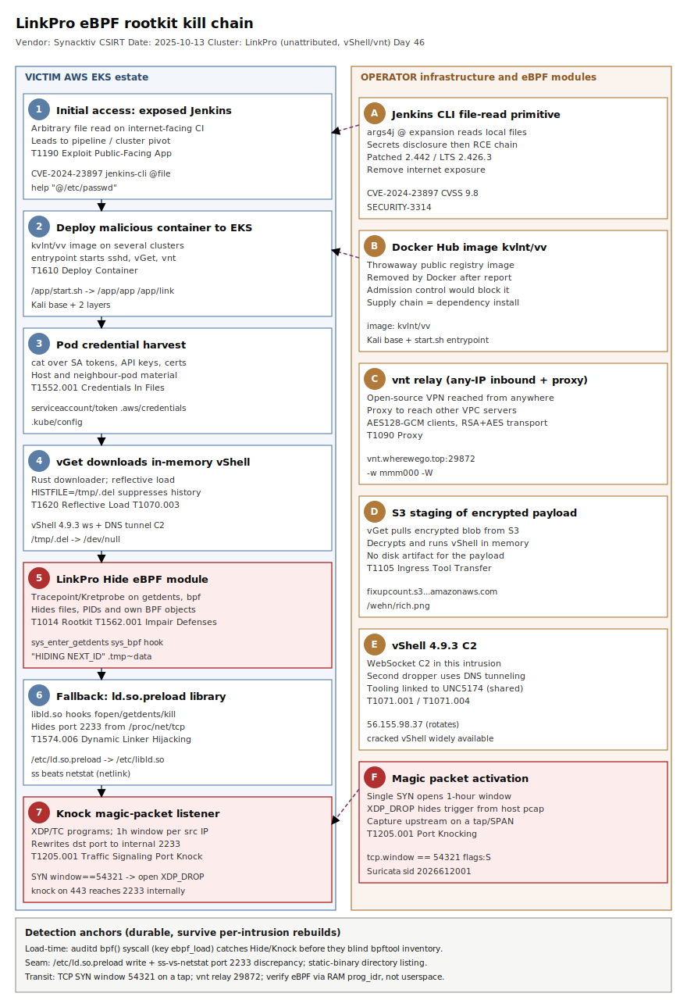

# LinkPro — eBPF rootkit with magic-packet activation in a compromised AWS EKS environment

## TL;DR

LinkPro is a Golang Linux backdoor discovered by the Synacktiv CSIRT during DFIR on a
compromised AWS-hosted environment (publication 2025-10-13). The operator exploited an
internet-exposed Jenkins server (CVE-2024-23897), pivoted into several Amazon EKS clusters,
and deployed a malicious Docker Hub image (`kvlnt/vv`) that ran a vnt proxy, harvested
service-account and cloud credentials from neighbouring pods, and dropped LinkPro via an
in-memory vShell chain. LinkPro installs two eBPF modules — a **Hide** module
(Tracepoint/Kretprobe hooks on `getdents`/`sys_bpf` to conceal files, processes and its own
BPF objects) and a **Knock** module (XDP/TC programs that activate the C2 channel only on a
magic packet: a TCP SYN with window size 54321) — falling back to an `/etc/ld.so.preload`
userspace hiding library when kernel eBPF support is unavailable. We pick it as Friday's
deep-dive because slot #13 (DFIR Linux/containers) has never been a repo primary and eBPF
rootkit forensics is acutely alive this cycle (the eBPF "Volatility blind spot" thread,
2026-05-27); the durable detection value is behavioural and survives LinkPro's
per-intrusion rebuilds.

## Attribution and confidence

**Cluster:** LinkPro (named by Synacktiv after the `github.com/link-pro/link-client` main
module symbol; the `link-pro` GitHub account is empty). The surrounding toolchain — vShell
4.9.3 (a backdoor publicly linked to **UNC5174**) and the open-source vnt VPN/proxy — is
shared and commodity, so the intrusion is **not** firmly attributed to a named actor.

**Vendor / date:** Synacktiv CSIRT, "LinkPro: eBPF rootkit analysis", 2025-10-13.

**Confidence:** **high** on the technical mechanics (vendor RE with code excerpts, module
hashes and config structure); **low** on actor identity (shared vShell tooling, empty
namespace, Chinese-language debug strings that indicate language not nationality).

| Overlap signal | What it suggests | Strength |
|---|---|---|
| vShell 4.9.3 payload | Tooling linked to UNC5174 (Sysdig) and other Chinese-nexus actors | medium — cracked vShell is now widely available |
| Chinese debug strings (`敲门包`, `toyincang`) | Chinese-speaking developer | medium — language, not attribution |
| vnt relay + `kvlnt/vv` image | Commodity proxy + throwaway registry image | low — reusable infra |
| eBPF magic-packet design | Genealogy with BPFDoor / Symbiote / J-magic passive backdoors | high — same defensive lessons |

**Genealogy with previous repo cases.** Direct sibling of `2026-05-07_QLNX-Quasar-Linux-RAT`
(eBPF kernel rootkit controller + LD_PRELOAD userspace rootkit) — that case carried #13 only
as a *secondary*; LinkPro makes #13 a **primary** for the first time with a real DFIR
intrusion and a magic-packet network surface. Complements the "detection without static
IOCs" thread (Netlogon Day 39, SecureBoot Day 41, OP-512 Day 42) and the cloud-pivot thread
(Storm-2949 Day 36 identity, ArgoCD Day 45 K8s).

## Kill chain — summary table

| Stage | MITRE | Detail |
|---|---|---|
| Initial access | T1190 | Internet-exposed Jenkins; arbitrary file read CVE-2024-23897 |
| Execution / deploy | T1610 | Malicious `kvlnt/vv` Docker image deployed to several EKS clusters |
| Credential access | T1552.001 | `cat` over pod/host service-account tokens, API keys, certificates |
| Ingress tool transfer | T1105 / T1620 | vGet (Rust) downloads encrypted vShell from S3; runs in memory |
| C2 (interim) | T1071.004 | vShell over DNS tunneling; vnt proxy relay (port 29872) |
| Defense evasion | T1014, T1564.001, T1562.001 | LinkPro eBPF Hide module conceals files/PIDs/BPF objects |
| Persistence (fallback) | T1574.006 | `/etc/ld.so.preload` → `/etc/libld.so` userspace hiding library |
| C2 activation | T1205.001 | Knock module: XDP/TC magic packet (TCP SYN window 54321) → port 2233 |
| History suppression | T1070.003 | `HISTFILE=/tmp/.del` (symlink to /dev/null) |



The diagram's left lane is the victim EKS estate (Jenkins → pod → host node → kernel); the
right lane is the operator's infrastructure (Docker Hub image, S3 staging, vShell C2, vnt
relay) and the eBPF modules LinkPro installs. The critical (red) anchors are the eBPF Hide
module load and the magic-packet Knock listener — the two surfaces that blind host telemetry
and create a firewall-bypassing inbound foothold; both are caught at *load/transit* time even
though they hide themselves afterwards.

## Stage-by-stage detail

### 1. Initial access — Jenkins CVE-2024-23897 (T1190)

Forensics identified an internet-exposed Jenkins server as the entry point, via the
arbitrary file read vulnerability **CVE-2024-23897** (CVSS 9.8). The flaw abuses the Jenkins
CLI `args4j` expansion where a leading `@` makes Jenkins read a local file as command input,
allowing disclosure of secrets and, chained, code execution into the CI/CD pipeline.

```
# CVE-2024-23897 primitive (already-public): @<path> forces a server-side file read
java -jar jenkins-cli.jar -s https://<jenkins>/ help "@/etc/passwd"
```

### 2. Deploy malicious container to EKS (T1610)

From the Jenkins foothold the operator deployed a Docker Hub image **`kvlnt/vv`** (a Kali
base with two added layers) onto several Kubernetes clusters in a standard-mode Amazon EKS
environment. Its entrypoint `/app/start.sh` started `sshd`, the `/app/app` downloader, and
`/app/link`:

```
/app/link  ->  vnt (open-source VPN/proxy), connects to vnt.wherewego.top:29872
               -w mmm000 (client AES128-GCM key), -W (RSA+AES256-GCM transport)
/app/app   ->  vGet (Rust) downloader
```

`/app/link` (vnt) gives the operator an any-IP path back to the host and a proxy to reach
other servers in the VPC.

### 3. Credential harvest from pods (T1552.001)

From the `kvlnt/vv` pod the operator ran `cat` to retrieve authentication tokens, API keys
and certificates available on the host and in neighbouring pods — the classic EKS pivot off
mounted service-account tokens and node credentials.

```
# observed shape (excerpt): bulk read of token/cred material
cat /var/run/secrets/kubernetes.io/serviceaccount/token
cat /root/.aws/credentials  /root/.kube/config
```

### 4. In-memory vShell via vGet (T1105, T1620)

`/app/app` is **vGet**, a stripped Rust downloader. It creates `/tmp/.del → /dev/null`, then
fetches an encrypted payload from
`https://fixupcount.s3.dualstack.ap-northeast-1.amazonaws.com/wehn/rich.png` — an in-memory
**vShell 4.9.3** that talks to its C2 (`56.155.98.37`) over WebSocket. vShell sets
`HISTFILE=/tmp/.del` so interactive shells write no `.bash_history` (T1070.003). A second
dropper deploys another in-memory vShell that uses **DNS tunneling** for C2.

### 5. LinkPro install — Hide module (T1014, T1564.001, T1562.001)

LinkPro is the final payload: a Golang backdoor that parses its embedded **Hide** eBPF ELF
with `ebpf-go` and loads Tracepoint + Kretprobe programs:

```
sys_enter_getdents / sys_exit_getdents  -> hide files (e.g. .tmp~data) from directory reads
sys_enter_bpf      / sys_bpf            -> hide its own BPF prog/map IDs from bpftool
                                           (debug strings: "HIDING NEXT_ID", "BPF cmd: %d")
```

By hooking `sys_bpf` and filtering `BPF_PROG_GET_NEXT_ID`, the module makes post-infection
eBPF inventory unreliable — the kernel `prog_idr` and a RAM capture remain ground truth.

### 6. Persistence fallback — ld.so.preload (T1574.006)

If kernel eBPF support is missing or `-ebpf 0` is set, LinkPro instead drops `/etc/libld.so`
(chmod 0755) and rewrites `/etc/ld.so.preload` to load it into every dynamically linked
program:

```
/etc/ld.so.preload  ->  /etc/libld.so
# libld.so libc hooks:
fopen/open  : strip /proc/net/tcp* lines containing port 2233; hide ld.so.preload
getdents/readdir : drop names .tmp~data, libld.so, sshids, ld.so.preload, .system
kill        : refuse signals to processes whose cmdline contains .tmp~data
```

Because `netstat` reads `/proc/net` but `ss` uses netlink, the hidden listener (2233) stays
visible to `ss` — the seam used in hunt H2.

### 7. C2 activation — Knock magic packet (T1205.001)

In `reverse` (passive) mode LinkPro installs the **Knock** module: an XDP ingress program and
a TC egress program. The XDP program watches for a magic packet — a **TCP SYN with TCP window
== 54321** — and on match records the source IP for a one-hour window, then rewrites the
destination port of that source's later packets to the internal listener (2233), recomputing
the TCP checksum and returning `XDP_PASS`; the TC egress program rewrites the source port back
on the way out.

```
if (tcph->syn && tcph->window == bpf_htons(54321)) { /* open 1h window for src IP */ }
```

The operator can therefore knock on any allowed front-end port (e.g. 443) and still reach
2233 internally, decoupling firewall logs from real activity. In `forward` (active) mode the
XDP/TC programs are not installed and LinkPro dials out instead.

## RE notes

| Component | SHA256 | Lang | Packer | Notes |
|---|---|---|---|---|
| LinkPro orchestrator (passive) | `d5b2202b7308b25bda8e106552dafb8b6e739ca62287ee33ec77abe4016e698b` | Go | none (stripped) | main `link-pro/link-client`; embeds libld.so, arp_diag.ko |
| LinkPro orchestrator (active) | `1368f3a8a8254feea14af7dc928af6847cab8fcceec4f21e0166843a75e81964` | Go | none | forward mode; no XDP/TC |
| Hide eBPF module | `b8c8f9888a8764df73442ea78393fe12464e160d840c0e7e573f5d9ea226e164` | eBPF (ET_REL) | none | getdents/sys_bpf hooks |
| Knock eBPF module | `364c680f0cab651bb119aa1cd82fefda9384853b1e8f467bcad91c9bdef097d3` | eBPF (ET_REL) | none | XDP/TC, window 54321 |
| libld.so | `b11a1aa2809708101b0e2067bd40549fac4880522f7086eb15b71bfb322ff5e7` | C (ET_DYN) | none | libc hooks, port 2233 |
| arp_diag.ko (LKM) | `9fc55dd37ec38990bb27ea2bc18dff0bb2d16ad7aa562ab35a6b63453c397075` | C (ET_REL) | none | `hook_*_seq_show` port hide |
| vGet downloader | `0da5a7d302ca5bc15341f9350a130ce46e18b7f06ca0ecf4a1c37b4029667dbb` | Rust | stripped | loads vShell in memory |

**Config.** LinkPro reads a JSON config (preceded by marker `CFG0`) into a `TailConfig`
struct: `ServerAddress`, `ServerPort`, `SecretKey`, `Protocol`, `DnsDomain`/`DNSMode`/
`DnsServer`, `ConnectionMode` (`reverse`/`forward`), `ReversePort` (2233). The shared secret
is derived as `SHA1(hex:"0123456789abcdeffedcba9876543210" | hostname | user | exe path |
machine-id | MAC | "nginx")`. The Chinese pinyin symbols `toyincang`/`toyincanglib` ("to
conceal") name the hidden keyword set.

## Detection strategy

### Telemetry that matters

- **auditd** `bpf` syscall (`-a always,exit -F arch=b64 -S bpf -k ebpf_load`) — catches the
  Hide/Knock module LOAD before the rootkit can blind inventory; also `execve`, `openat`.
- **auditd / EDR file events** on `/etc/ld.so.preload`, `/etc/libld.so`, and hidden artifact
  names (`.tmp~data`, `sshids`, `.system`).
- **eBPF observability** (Falco/Tetragon) program-load events, and an out-of-band
  `bpftool prog show` inventory compared against kernel ground truth.
- **Defender for Endpoint (Linux)** `DeviceFileEvents`, `DeviceProcessEvents`,
  `DeviceNetworkEvents`; **Sentinel** `Syslog` (auditd via rsyslog).
- **Network sensor on a tap/SPAN** upstream of internet-facing nodes — the XDP_DROP means the
  magic packet may never reach host pcap.
- **Kubernetes audit** for the deploy of the `kvlnt/vv` image and anomalous pod exec.

### Detection coverage

| Engine | File | Logic |
|---|---|---|
| Sigma | `sigma/linux_ldso_preload_rootkit_persistence.yml` | file_event: write to /etc/ld.so.preload or drop of /etc/*libld.so |
| Sigma | `sigma/linux_container_serviceaccount_token_harvest.yml` | process_creation: cat/grep over SA token + cloud cred paths |
| Sigma | `sigma/linux_ebpf_program_load_from_unexpected_binary.yml` | auditd: bpf() load from a non-allow-listed loader |
| KQL | `kql/linkpro_ldpreload_and_hidden_artifacts.kql` | DeviceFileEvents: preload + hidden artifact names |
| KQL | `kql/linkpro_eks_pod_credential_harvest.kql` | DeviceProcessEvents: pod token/cred file reads |
| KQL | `kql/linkpro_c2_vshell_vnt_network.kql` | DeviceNetworkEvents: C2 IPs/domains + vnt relay port 29872 |
| KQL | `kql/linkpro_ebpf_load_and_jenkins_cve_2024_23897.kql` | Syslog/auditd: bpf load + Jenkins `@`-file-read recon |
| YARA | `yara/linkpro_ebpf_rootkit.yar` | Go orchestrator, Hide/Knock BPF modules, libld.so |
| Suricata | `suricata/linkpro_magic_packet_and_c2.rules` | magic packet (window 54321), vnt relay, vShell IP, S3 staging URL |

### Threat hunting hypotheses

- **H1** (`hunts/peak_h1_ebpf_program_inventory_discrepancy.md`) — hidden eBPF programs:
  compare `bpftool` userspace inventory to auditd `bpf` loads and to the kernel `prog_idr` in
  a RAM capture; a negative delta is the lead.
- **H2** (`hunts/peak_h2_ldpreload_and_port_discrepancy.md`) — `/etc/ld.so.preload` hiding
  library and the `ss`-vs-`netstat` listening-port discrepancy (port 2233).
- **H3** (`hunts/peak_h3_magic_packet_listener_and_relay.md`) — non-CNI XDP/TC programs on
  internet-facing nodes, magic packets (window 54321) on a tap, and outbound to the vnt relay
  (29872) / DNS tunnel.

## Incident response playbook

### First 60 minutes (triage)

1. Identify internet-facing nodes/pods and confirm whether any ran the `kvlnt/vv` image or an
   unexpected vnt proxy; freeze (cordon) affected EKS nodes without rebooting.
2. On suspect hosts capture **RAM first** (LiME/AVML) — the eBPF programs and in-memory vShell
   live only in memory; a reboot destroys them.
3. Read `/etc/ld.so.preload` with a **statically linked** tool (the glibc path is hooked) and
   list `/etc/libld.so`.
4. Enumerate eBPF: `bpftool prog show`, `bpftool net show`, `tc filter show dev <iface>` and
   compare with expected CNI programs.
5. Diff `ss -tlnp` vs `netstat -tlnp` for a hidden listener (2233).
6. Treat every credential reachable by the affected pods/node as compromised pending rotation.

### Artifacts to collect

| Artifact | Path | Tool | Why |
|---|---|---|---|
| RAM image | (memory) | LiME / AVML + Volatility 3 `linux.ebpf` | eBPF programs + in-memory vShell |
| Preload config | `/etc/ld.so.preload`, `/etc/libld.so` | static `cat` / `dd`, sha256 | userspace rootkit proof |
| eBPF inventory | (kernel) | `bpftool prog/map/net show --json` | hidden program delta |
| Hidden files | `.tmp~data`, `sshids`, `.system/` | static-binary listing | backdoor artifacts |
| auditd logs | `/var/log/audit/audit.log` | ausearch -k ebpf_load | LOAD events pre-hiding |
| Container image | `kvlnt/vv` | crictl/ctr export | entrypoint, vnt, vGet |
| Network pcap | tap upstream of node | tcpdump/Zeek | magic packet, C2, relay |

### IR queries and commands

```bash
# eBPF ground-truth inventory vs userspace tooling (run from a trusted static binary set)
bpftool prog show --json | jq '.[] | {id, type, name, tag}'
bpftool net show
for i in $(ls /sys/class/net); do tc -s filter show dev "$i" 2>/dev/null; done

# preload + hidden listener seam
busybox cat /etc/ld.so.preload 2>/dev/null; ls -la /etc/libld.so
comm -13 <(netstat -tlnp 2>/dev/null | awk '{print $4}' | sort -u) \
         <(ss -tlnp 2>/dev/null | awk '{print $4}' | sort -u)
```

```kql
// pivot: hosts that loaded eBPF and then showed a hidden-artifact write (correlation lead)
DeviceFileEvents
| where FileName in ("libld.so",".tmp~data","sshids") or FolderPath == "/etc/ld.so.preload"
| summarize artifacts=make_set(FileName), firstSeen=min(Timestamp) by DeviceName
```

### Containment, eradication, recovery

Cordon and isolate the node at the network layer; do **not** simply `kill` the LinkPro
process (the `kill` libc hook may refuse it, and IIS-style restart logic / the entrypoint can
respawn the chain). Eradication requires rebuilding the node from a trusted image — a userspace
preload + kernel eBPF rootkit cannot be reliably cleaned in place. **Exit criteria:** image
rebuilt; `/etc/ld.so.preload` clean; eBPF inventory matches CNI baseline; no magic-packet
activation on the tap; all reachable credentials rotated. **What NOT to do:** reboot before RAM
capture; remove `/etc/ld.so.preload` before imaging; trust `bpftool`/`netstat`/`ls` output from
the live infected host; rotate credentials *after* the node is back online with the same keys.

### Recovery validation

Confirm patched Jenkins (≥ 2.442 / LTS 2.426.3 for CVE-2024-23897) and removal of internet
exposure; rotate EKS node IAM roles, service-account tokens (and the cluster CA if exposed),
and any cloud keys read from pods; re-baseline eBPF program inventory; deploy the auditd
`bpf` rule and the magic-packet sensor; verify no residual `kvlnt/vv` images in any namespace
or registry cache.

## IOCs

| Type | Value | Context | Confidence | Source |
|---|---|---|---|---|
| sha256 | d5b2202b…698b | LinkPro orchestrator (passive) | high | Synacktiv |
| sha256 | 1368f3a8…1964 | LinkPro orchestrator (active) | high | Synacktiv |
| sha256 | b8c8f988…e164 | Hide eBPF module | high | Synacktiv |
| sha256 | 364c680f…97d3 | Knock eBPF module | high | Synacktiv |
| sha256 | b11a1aa2…f5e7 | libld.so hiding library | high | Synacktiv |
| sha256 | 9fc55dd3…7075 | arp_diag.ko LKM | high | Synacktiv |
| domain | vnt.wherewego.top | vnt relay (port 29872) | high | Synacktiv |
| url | …/wehn/rich.png (fixupcount S3) | vShell staging payload | high | Synacktiv |
| ipv4 | 56.155.98.37 | vShell 4.9.3 C2 (WebSocket) | medium | Synacktiv |
| string | kvlnt/vv | malicious Docker Hub image | high | Synacktiv |
| cve | CVE-2024-23897 | Jenkins arbitrary file read (initial access) | high | Jenkins/Synacktiv |
| note | TCP SYN window 54321 | Knock magic-packet signature | high | Synacktiv |
| note | TCP port 2233 | LinkPro internal listener (hidden) | high | Synacktiv |
| path | /etc/ld.so.preload → /etc/libld.so | userspace hiding persistence | high | Synacktiv |
| string | .tmp~data / sshids / .system | hidden backdoor artifacts | high | Synacktiv |

Full machine-readable list in [`iocs.csv`](./iocs.csv).

## Secondary findings

- **Malware deep-dive (#19):** LinkPro is a multi-language toolchain — Go orchestrator, two
  eBPF ELF modules, a C LD_PRELOAD library, a C LKM, and a stripped Rust downloader (vGet)
  that runs vShell only in memory. Capturing one component does not yield the others; the
  per-host secret-key derivation (`SHA1(...|machine-id|MAC|"nginx")`) means a recovered config
  does not unlock another node. This is the modern Linux-implant shape: reflective in-memory
  execution + kernel-level hiding + commodity off-the-shelf C2 (vShell/vnt).
- **Supply chain via public registry (#7):** the operator's whole foothold rode a single
  throwaway Docker Hub image (`kvlnt/vv`, Kali base) that Docker removed after Synacktiv
  flagged it. Pulling unverified public images into EKS is an under-watched supply-chain
  surface; admission control (signed images, allowed registries) would have blocked it.
- **Cloud-identity blast radius (#5):** the EKS pivot turned one exploited Jenkins box into a
  credential-harvest across pods — IRSA/service-account tokens and node IAM are the real prize.
  Least-privilege service accounts, projected-token audiences, and IMDSv2/hop-limit hardening
  shrink what a single compromised pod can reach.

## Pedagogical anchors

- **eBPF is dual-use telemetry: the thing that watches the kernel can also blind it.** Once a
  Hide module hooks `sys_bpf`, `bpftool` lies. Detect at LOAD time (auditd `bpf` syscall) and
  verify with RAM forensics (`prog_idr`), never trust post-infection userspace inventory.
- **Hiding tools leave seams.** A `/proc/net`-forging preload library cannot hide from
  netlink, so `ss` beats `netstat`; a getdents hook cannot hide from a statically linked
  lister. Pick a tool the rootkit did not anticipate.
- **Magic packets decouple firewall logs from reality.** A passive XDP backdoor that rewrites
  destination ports means "port 443 in the firewall log" can be "port 2233 on the host" —
  capture upstream on a tap, because XDP_DROP hides the trigger from host pcap.
- **Behaviour outlives the build.** LinkPro is recompiled per intrusion with per-host keys;
  hashes and config do not generalise. The durable anchors are the preload write, the hidden
  artifact names, the magic-packet window, the listener port, and the eBPF module load — what
  the rootkit *must* do to hide and to receive commands.
- **Public-image pull = dependency install.** A Docker Hub image deployed to your cluster
  deserves the same supply-chain scrutiny as an npm/PyPI dependency: signature, provenance,
  and an allow-listed registry.

## What's in this folder

| File | Purpose |
|---|---|
| [`README.md`](./README.md) | This write-up (15 sections). |
| [`kill_chain.svg`](./kill_chain.svg) | Two-lane kill chain (victim EKS estate vs operator infra + eBPF modules). |
| [`sigma/linux_ldso_preload_rootkit_persistence.yml`](./sigma/linux_ldso_preload_rootkit_persistence.yml) | ld.so.preload / libld.so write (T1574.006). |
| [`sigma/linux_container_serviceaccount_token_harvest.yml`](./sigma/linux_container_serviceaccount_token_harvest.yml) | Pod SA-token / cloud-cred file harvest (T1552.001). |
| [`sigma/linux_ebpf_program_load_from_unexpected_binary.yml`](./sigma/linux_ebpf_program_load_from_unexpected_binary.yml) | bpf() load from a non-allow-listed binary (T1562.001). |
| [`kql/linkpro_ldpreload_and_hidden_artifacts.kql`](./kql/linkpro_ldpreload_and_hidden_artifacts.kql) | Preload + hidden artifact file events. |
| [`kql/linkpro_eks_pod_credential_harvest.kql`](./kql/linkpro_eks_pod_credential_harvest.kql) | Pod token/cred reads. |
| [`kql/linkpro_c2_vshell_vnt_network.kql`](./kql/linkpro_c2_vshell_vnt_network.kql) | C2 IP/domain + vnt relay network events. |
| [`kql/linkpro_ebpf_load_and_jenkins_cve_2024_23897.kql`](./kql/linkpro_ebpf_load_and_jenkins_cve_2024_23897.kql) | bpf load + Jenkins file-read recon (Syslog/auditd). |
| [`yara/linkpro_ebpf_rootkit.yar`](./yara/linkpro_ebpf_rootkit.yar) | Go orchestrator, Hide/Knock BPF modules, libld.so. |
| [`suricata/linkpro_magic_packet_and_c2.rules`](./suricata/linkpro_magic_packet_and_c2.rules) | Magic packet, vnt relay, vShell IP, S3 staging URL. |
| [`hunts/peak_h1_ebpf_program_inventory_discrepancy.md`](./hunts/peak_h1_ebpf_program_inventory_discrepancy.md) | Hidden-eBPF inventory hunt. |
| [`hunts/peak_h2_ldpreload_and_port_discrepancy.md`](./hunts/peak_h2_ldpreload_and_port_discrepancy.md) | Preload + ss/netstat port hunt. |
| [`hunts/peak_h3_magic_packet_listener_and_relay.md`](./hunts/peak_h3_magic_packet_listener_and_relay.md) | Magic-packet / XDP-TC / relay hunt. |
| [`iocs.csv`](./iocs.csv) | Machine-readable IOCs + behavioural anchors. |

## Sources

- [Synacktiv — LinkPro: eBPF rootkit analysis (2025-10-13)](https://www.synacktiv.com/en/publications/linkpro-ebpf-rootkit-analysis)
- [The Hacker News — LinkPro Linux Rootkit Uses eBPF to Hide and Activates via Magic TCP Packets](https://thehackernews.com/2025/10/linkpro-linux-rootkit-uses-ebpf-to-hide.html)
- [Andrea Fortuna — eBPF rootkits and the Volatility blind spot in Linux memory forensics (2026-05-27)](https://andreafortuna.org/2026/05/27/ebpf-rootkits/)
- [GBHackers — BPFDoor and Symbiote: Advanced eBPF-Based Rootkits Target Linux Systems](https://gbhackers.com/ebpf-based-rootkits/)
- [Sysdig — UNC5174 Chinese threat actor and vShell](https://www.sysdig.com/blog/unc5174-chinese-threat-actor-vshell)
- [Jenkins Security Advisory — CVE-2024-23897 (2024-01-24)](https://www.jenkins.io/security/advisory/2024-01-24/)
- [MITRE ATT&CK — T1205.001 Traffic Signaling: Port Knocking](https://attack.mitre.org/techniques/T1205/001/)
- [MITRE ATT&CK — T1574.006 Dynamic Linker Hijacking](https://attack.mitre.org/techniques/T1574/006/)
