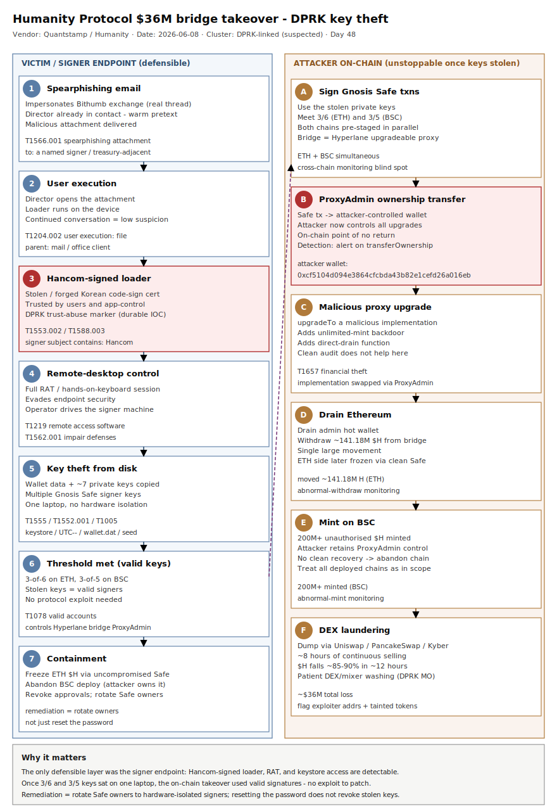

# Humanity Protocol $36M bridge takeover — DPRK-linked spear-phish to a signer laptop steals the multisig keys

## TL;DR

On 8 June 2026 attackers drained roughly $36M from Humanity Protocol (the palm-vein "Chinese Worldcoin" identity project) by compromising the operational security of one person, not the smart contracts. A spear-phishing email impersonating South Korean exchange Bithumb — with whom a director had genuinely been communicating — carried a malicious attachment that installed remote-access malware; the loader was signed with a stolen/forged South Korean Hancom code-signing certificate, a pattern characteristic of DPRK intrusions. The malware gave full remote-desktop control while evading endpoint security, and the operator copied wallet data and several private keys (reportedly seven) from that single device. Those keys met the Gnosis Safe threshold (3-of-6 on Ethereum, 3-of-5 on BNB Smart Chain) governing the Hyperlane bridge ProxyAdmin, so the attacker transferred ProxyAdmin ownership, upgraded the bridge proxy to a malicious implementation with an unlimited-mint/drain backdoor, moved ~141.18M $H on Ethereum and minted 200M+ $H on BSC, then dumped across Uniswap/PancakeSwap/Kyber over ~8 hours. Quantstamp's independent investigation (published via Humanity 12–13 June 2026) ties the tooling and certificate-signing behaviour to DPRK-linked activity (no definitive attribution). This is a crypto/DeFi case (#16) whose only defensible layer was the endpoint and the key-custody process — the on-chain steps were unstoppable once the keys were on one laptop.

## Attribution and confidence

**Primary cluster:** an unattributed DPRK-linked intrusion set. Quantstamp, retained by Humanity Protocol, found that the malware infrastructure and certificate-signing behaviour resembled techniques "characteristic of DPRK-linked intrusions" but stopped short of definitive attribution. Confidence in *DPRK alignment* is **medium** (single investigator, behavioural/tradecraft markers, no released sample hashes or wallet attribution in the public report); confidence in the *intrusion mechanics* (phishing → RAT → key theft → bridge takeover) is **high**, triangulated across Humanity's own incident updates, Quantstamp (via WuBlockchain), and multiple on-chain trackers.

**Aliases / labels:** no group name assigned. The behaviour — weaponised lure to a high-value target, a loader signed with a stolen South Korean **Hancom** certificate, EDR evasion, rapid dual-chain contract reconfiguration, and patient DEX laundering — overlaps the Lazarus/DPRK financial-theft playbook (UNC4899 / TraderTraitor / "Contagious Interview" lineage of crypto-targeting clusters).

**Competing narrative (logged honestly).** On-chain investigator ZachXBT initially called the incident "possibly staged" as a convenient exit route ahead of a 25 June investor unlock, noting dumps occurred mainly on DEXes and questioning the project's market-maker arrangements; he later softened. Skeptics also questioned how several multisig keys came to live on one laptop. The Quantstamp endpoint-malware finding is the best-evidenced explanation, but the alternative is recorded here for completeness; it does not change the defensive lessons (key custody and signer-endpoint hygiene).

| Overlap signal | Observation | Assessment |
|---|---|---|
| Stolen/forged Hancom code-signing cert on the loader | South Korean office-suite vendor; cert reuse is a recurring DPRK marker | Medium — strong tradecraft tell, not proof |
| Bithumb-impersonation lure to a contact the target already knew | Korea-exchange social-engineering pretext; Lazarus-class targeting | Medium — consistent with DPRK crypto ops |
| RAT with remote-desktop control + EDR evasion, then on-disk key theft | DPRK financial-theft TTP (endpoint → keys → chain) | High on mechanics, medium on actor |
| Simultaneous Ethereum + BSC ProxyAdmin takeover | Pre-staged multi-chain engineering | High — indicates resourced, prepared operator |

**Genealogy with previous repo cases.** This is the diary's first DeFi-protocol **bridge/ProxyAdmin takeover** and first **Gnosis Safe multisig-threshold** case. It extends the DPRK-and-crypto thread already in the repo — `2026-05-15_EtherRAT-TukTuk-Gentlemen` (DPRK-linked ELF toolchain), `2026-05-28_TrapDoor-CrossEcosystem-Crypto-AI-Stealer`, and `2026-05-30_AMOS-OpenClaw-Skill-macOS-Stealer` (crypto-credential stealers) — but the primitive is different: here the malware is only the *delivery vehicle for signer keys*, and the loss happens entirely through legitimate-looking on-chain admin actions executed with stolen valid keys. It also continues the "the human/endpoint is the weakest link, not the code" theme.

## Kill chain — summary table

| Stage | MITRE | Detail |
|---|---|---|
| Spearphishing attachment | T1566.001 | Email impersonating Bithumb to a director; malicious attachment |
| User execution | T1204.002 | Director opens the attachment; loader runs |
| Subvert trust / code signing | T1553.002, T1588.003 | Loader signed with a stolen/forged South Korean Hancom certificate |
| Remote access tooling | T1219 | RAT grants full remote-desktop control of the device |
| Impair defenses | T1562.001 | Malware evades endpoint security during the session |
| Credential theft from disk | T1555, T1552.001, T1005 | Wallet data + ~7 private keys copied from the single device |
| Valid-account on-chain action | T1078 | Stolen keys meet Gnosis Safe threshold (3/6 ETH, 3/5 BSC); ProxyAdmin ownership transferred; bridge proxy upgraded to malicious impl |
| Financial theft / monetisation | T1657 | ~141.18M $H moved on ETH, 200M+ minted on BSC; dumped via Uniswap/PancakeSwap/Kyber over ~8h (~$36M) |

## Kill chain diagram



The diagram uses two lanes: the victim/endpoint plane on the left (Bithumb-themed phishing email → attachment execution → Hancom-signed RAT with remote-desktop control → on-disk wallet/keystore and private-key theft) and the attacker on-chain plane on the right (stolen keys signing Gnosis Safe transactions → ProxyAdmin ownership transfer → malicious proxy upgrade → mint/drain → DEX laundering). The critical (red) anchors are the Hancom-signed loader (the durable, defensible host artifact) and the ProxyAdmin ownership-transfer transaction (the on-chain point of no return); detection should concentrate on the left lane because the right lane is unstoppable once keys are stolen.

## Stage-by-stage detail

### 1. Spearphishing attachment (T1566.001)

The intrusion began with a targeted social-engineering email sent to one of Humanity's directors. The lure impersonated **Bithumb**, a South Korean crypto exchange with whom the director had genuinely been corresponding — a warm, context-aware pretext rather than a cold lure. The message carried a malicious attachment.

```text
Pretext:  ongoing Bithumb listing/partnership thread (impersonated)
Delivery: email attachment (weaponised document/installer)
Target:   a named director (signer/treasury-adjacent), not a generic mailbox
```

MITRE ATT&CK: **T1566.001 — Phishing: Spearphishing Attachment**.

### 2. User execution (T1204.002)

Opening the attachment executed the loader. Because the pretext continued an existing conversation, the user had little reason to suspect it.

MITRE ATT&CK: **T1204.002 — User Execution: Malicious File**.

### 3. Subvert trust controls — stolen Hancom code-signing certificate (T1553.002, T1588.003)

Quantstamp reported that the loader was **signed with a South Korean Hancom certificate**. Hancom is a Korean office-software vendor; abusing a stolen or forged code-signing certificate from a Korean software brand is a recurring tradecraft marker of DPRK-linked operations. A valid Authenticode signature buys the binary trust with users and with signature/reputation checks, and helps it sail past application-control and SmartScreen heuristics.

```text
Signer subject:  contains "Hancom" (Korean office-suite vendor)
Effect:          loader appears trusted; weakens app-control and reputation checks
Durable anchor:  a Hancom-signed executable on a crypto-treasury / non-Korean-office
                 endpoint is anomalous and is the single most durable host IOC here
```

MITRE ATT&CK: **T1553.002 — Subvert Trust Controls: Code Signing**; **T1588.003 — Obtain Capabilities: Code Signing Certificates**.

### 4. Remote access tooling + impair defenses (T1219, T1562.001)

The malware established **full remote-desktop control** of the device while **evading endpoint security**. This gave the operator hands-on-keyboard access to the signer's machine — the position from which all subsequent theft was performed.

MITRE ATT&CK: **T1219 — Remote Access Software**; **T1562.001 — Impair Defenses: Disable or Modify Tools**.

### 5. Credential theft from disk (T1555, T1552.001, T1005)

From the compromised device the attacker **copied wallet data and private keys** — reportedly seven private keys from one machine. These were not random keys: they were the signing keys for the Gnosis Safe multisignatures that governed the bridge ProxyAdmin contracts.

```text
Stolen:   wallet/keystore data + ~7 private keys (multiple Safe signer keys)
Location: a single developer/director laptop (no hardware isolation / air-gap)
Root cause: multiple high-privilege keys co-located on one internet-connected device
```

MITRE ATT&CK: **T1555 — Credentials from Password Stores**; **T1552.001 — Unsecured Credentials: Credentials in Files**; **T1005 — Data from Local System**.

### 6. Valid-account on-chain takeover (T1078)

The bridges used Hyperlane infrastructure with upgradeable proxy contracts; the **ProxyAdmin** contracts were owned by Gnosis Safes. The stolen keys met the required signing thresholds:

```text
Ethereum:  3 of 6 Gnosis Safe owner keys obtained -> threshold met
BSC:       3 of 5 Gnosis Safe owner keys obtained -> threshold met
Action 1:  Safe tx transfers ProxyAdmin ownership to an attacker-controlled wallet
Action 2:  attacker (now ProxyAdmin owner) upgrades the bridge proxy implementation
           to a malicious version with unlimited-mint / direct-drain functions
```

The stolen keys are, from the chain's perspective, perfectly valid signers — there is no protocol-level "exploit," which is exactly why on-chain controls could not stop it.

MITRE ATT&CK: **T1078 — Valid Accounts**.

### 7. Financial theft and laundering (T1657)

```text
Ethereum:  drained an admin hot wallet, then withdrew ~141.18M $H from the bridge
BSC:       minted 200M+ unauthorised $H via the malicious implementation
Dump:      swapped stolen + minted $H for ETH/BNB on Uniswap, PancakeSwap, Kyber
           over ~8 hours; ~$23.7M reportedly already swapped to ETH mid-incident
Impact:    ~$36M total; $H fell ~85-90% (≈$0.70 -> ≈$0.08) in ~12 hours
```

Containment used **uncompromised** multisig wallets to freeze the Ethereum $H contract; the BSC deployment is being **abandoned** because the attacker retains ProxyAdmin control and can keep minting. Users were advised to revoke contract approvals.

MITRE ATT&CK: **T1657 — Financial Theft**.

## Detection strategy

This is a crypto/DeFi loss, but the **defensible** surface is the signer endpoint and the email — the on-chain steps are unstoppable once keys are stolen. All detection below targets the left lane. There is **no public malware sample hash**, so the durable anchors are behavioural: a Hancom-signed binary on a crypto-treasury endpoint, remote-access tooling on a signer machine, wallet/keystore file access by a non-wallet process, and the Bithumb-impersonation lure.

### Telemetry that matters

- **Email:** Defender for Office 365 / `EmailEvents` + `EmailAttachmentInfo` — sender-domain spoofing of `bithumb`, attachment delivery to executive/treasury recipients.
- **Sysmon:** EID 1 (process creation — RAT/RMM, child of Office/mail clients), EID 7 (image load — signature subject), EID 11 (file create/access — keystore/wallet paths), EID 3 (network connection — RAT C2), EID 13 (registry — RMM/run keys).
- **Defender XDR:** `DeviceProcessEvents`, `DeviceImageLoadEvents` (with `Signer`/`CertificateSubject`), `DeviceFileEvents`, `DeviceNetworkEvents`, `EmailEvents`.
- **macOS (signers on Mac):** ESF process exec + code-signing team-ID anomalies; access to `~/Library/.../MetaMask`, keystore JSON, and seed files.
- **Code-signing telemetry:** the certificate subject/issuer on newly executed binaries is the highest-value field here.

### Detection coverage

| Engine | File | Logic |
|---|---|---|
| Sigma | [sigma/hancom_signed_binary_on_crypto_endpoint.yml](./sigma/hancom_signed_binary_on_crypto_endpoint.yml) | Image load / process start of a binary whose signer subject contains `Hancom` (DPRK-marker cert abuse) |
| Sigma | [sigma/wallet_keystore_access_by_nonwallet_process.yml](./sigma/wallet_keystore_access_by_nonwallet_process.yml) | File access to wallet/keystore/seed paths by a process that is not a known wallet app |
| Sigma | [sigma/remote_access_tool_on_signer_endpoint.yml](./sigma/remote_access_tool_on_signer_endpoint.yml) | Remote-access/RMM tooling spawned shortly after an Office/mail-client child process |
| KQL | [kql/humanity_bithumb_phish_email.kql](./kql/humanity_bithumb_phish_email.kql) | EmailEvents: Bithumb-impersonation sender/display-name with attachment to exec/treasury |
| KQL | [kql/humanity_hancom_signed_loader.kql](./kql/humanity_hancom_signed_loader.kql) | DeviceImageLoadEvents/DeviceProcessEvents: Hancom signer on an unexpected endpoint |
| KQL | [kql/humanity_wallet_keystore_access.kql](./kql/humanity_wallet_keystore_access.kql) | DeviceFileEvents: keystore/seed file access by non-wallet process |
| KQL | [kql/humanity_rat_c2_beacon.kql](./kql/humanity_rat_c2_beacon.kql) | DeviceNetworkEvents: remote-desktop/RAT egress from a signer endpoint |
| YARA | [yara/humanity_dprk_keytheft_loader.yar](./yara/humanity_dprk_keytheft_loader.yar) | Heuristics for Hancom-signed loader + wallet/keystore-stealer strings (behavioural, not a sample signature) |
| Suricata | [suricata/humanity_phish_and_rat_c2.rules](./suricata/humanity_phish_and_rat_c2.rules) | Bithumb-spoof lure markers and generic remote-desktop/RAT C2 heuristics |

No SPL is shipped (retired repo-wide). Convert Sigma with `sigma convert -t splunk -p sysmon <rule>.yml` if needed.

### Threat hunting hypotheses

- **H1 — [Hancom-signed binary on a crypto-treasury endpoint](./hunts/peak_h1_hancom_signed_binary_anomaly.md):** a signer/treasury host runs an executable signed by a Korean office-suite vendor it has no reason to run. PEAK ABLE: a Korean-software certificate on a non-Korean-office machine is the durable DPRK tell.
- **H2 — [Wallet/keystore file access during a remote-access session](./hunts/peak_h2_keystore_access_remote_session.md):** keystore/seed files are read by a non-wallet process while an interactive remote-desktop session is active on a signer machine.
- **H3 — [Cross-domain correlation: signer-endpoint compromise → on-chain admin change](./hunts/peak_h3_signer_to_onchain_correlation.md):** an endpoint alert on a Safe signer is followed within hours by an on-chain ProxyAdmin `transferOwnership`/proxy-`upgrade` from that signer set — the bridge between SOC and on-chain monitoring.

## Incident response playbook

### First 60 minutes (triage)

1. **Treat every key on the suspected device as burned.** Assume all private keys, seeds, keystores and session tokens stored on or accessible from that machine are compromised.
2. **Freeze what you can on-chain first.** Use any *uncompromised* multisig / guardian / pause mechanism to freeze token contracts and pause bridges/withdrawals (Humanity froze the ETH $H contract via an unaffected Safe).
3. **Isolate the endpoint** (network-contain in EDR) without powering it off — preserve memory and the RAT session for forensics.
4. **Inventory signer topology:** which Safes, which thresholds, which keys lived on which devices; identify Safes whose threshold the stolen key count can meet.
5. **Rotate Safe owners** on every chain where a stolen key counts toward threshold; remove compromised owners and replace with hardware-isolated signers.
6. **Notify** exchanges (to flag/freeze inbound stolen tokens), partners, and law enforcement; publish a transparency tracker of exploiter addresses and tainted tokens.

### Artifacts to collect

| Artifact | Path | Tool | Why |
|---|---|---|---|
| Phishing email + attachment | mailbox / O365 eDiscovery | MFAExtractor / eDiscovery | Pretext, sender, attachment hash, delivery time |
| Loader binary + signature | `%TEMP%`, `%APPDATA%`, Downloads | EDR / `Get-AuthenticodeSignature` | Confirm Hancom signer; pivot for cert serial/thumbprint |
| Process/image-load telemetry | Sysmon EID 1/7 | EDR / Velociraptor | RAT execution + signer subject |
| Keystore/wallet file access | `%APPDATA%`, browser ext storage, `~/Library` | EDR file events / MFT | Which key material was read and when |
| Network/C2 | Sysmon EID 3 / firewall | Zeek / NetFlow | RAT C2 endpoints, exfil timing |
| On-chain admin txns | Etherscan / BscScan | block explorers / Tenderly | ProxyAdmin transferOwnership + proxy upgrade tx hashes |

### IR queries and commands

```powershell
# Find binaries signed by a Hancom certificate executed recently on a signer host
Get-ChildItem -Path $env:TEMP,$env:APPDATA,"$env:USERPROFILE\Downloads" -Recurse -Include *.exe,*.dll -ErrorAction SilentlyContinue |
  ForEach-Object {
    $s = Get-AuthenticodeSignature $_.FullName
    if ($s.SignerCertificate.Subject -match 'Hancom') {
      [pscustomobject]@{ Path=$_.FullName; Subject=$s.SignerCertificate.Subject; Thumb=$s.SignerCertificate.Thumbprint; Status=$s.Status }
    }
  }
```

```bash
# macOS: list recently-run binaries whose signing authority references Hancom
find ~/Downloads ~/Library/Caches /tmp -type f -perm +111 -mtime -14 2>/dev/null | while read f; do
  codesign -dv --verbose=4 "$f" 2>&1 | grep -qi 'Hancom' && echo "HANCOM-SIGNED: $f"
done
```

```kql
// Defender XDR: keystore/seed file access by a non-wallet process on signer hosts
DeviceFileEvents
| where Timestamp > ago(14d)
| where FolderPath has_any ("keystore","UTC--","MetaMask","Ledger","Trezor","wallet.dat",".json")
| where InitiatingProcessFileName !in~ ("MetaMask.exe","Ledger Live.exe","frame.exe","chrome.exe","msedge.exe")
| project Timestamp, DeviceName, InitiatingProcessFileName, FolderPath, FileName, InitiatingProcessAccountName
```

### Containment, eradication, recovery

- **Exit criteria:** all Safe owners rotated to hardware-isolated signers on every affected chain; the compromised endpoint reimaged; the Hancom-signed binary and persistence removed; no further unauthorised admin txns for a sustained window.
- **What NOT to do:** do **not** simply reset the user's password and call it done — the stolen keys are independent of the account password and remain valid until owners are rotated. Do **not** re-use any key that ever touched the compromised device. Do **not** assume the *other* chain is safe: this operator pre-staged both Ethereum and BSC; treat all chains where the stolen keys count toward threshold as compromised.
- **Recovery:** for a chain where the attacker now owns ProxyAdmin (BSC here), there may be no clean recovery — abandonment + redeploy + exchange coordination is the realistic path. Preserve a clean, uncompromised Safe as the recovery authority (as Humanity did on Ethereum).

### Recovery validation

- Confirm every Safe's owner set contains only hardware-isolated, post-incident keys, and that thresholds were raised where feasible.
- Verify ProxyAdmin ownership on every proxy is held by a trusted Safe; alert on any future `transferOwnership`/`upgrade`.
- Stand up persistent on-chain monitoring (admin-role changes, proxy upgrades, abnormal mint) wired to the SOC, so a future signer-endpoint alert can be correlated to chain activity in minutes.

## IOCs

No public malware sample hash was released by Quantstamp; the durable indicators here are behavioural (Hancom-signed loader on a crypto endpoint, keystore access, remote-desktop tooling) and on-chain. On-chain addresses come from public trackers, **not** from Quantstamp's public report — treat as community-sourced. Full list in [iocs.csv](./iocs.csv).

| Type | Value | Context | Confidence | Source |
|---|---|---|---|---|
| ipv4 | n/a | No public RAT C2 IP released | - | - |
| string | Hancom | Stolen/forged code-signing cert subject on the loader (DPRK marker) | high | Quantstamp via Humanity 2026-06-13 |
| string | bithumb | Impersonated brand in the spear-phish pretext (display/sender spoof) | high | Quantstamp via Humanity 2026-06-13 |
| ipv4 | 0xcf5104d094e3864cfcbda43b82e1cefd26a016eb | Reported attacker/exploiter wallet (on-chain trackers; see note) | medium | coinpedia / on-chain trackers 2026-06-10 |
| cve | none | No CVE; operational/key-custody compromise, not a software flaw | high | analysis |
| note | 3/6 ETH + 3/5 BSC Gnosis Safe keys stolen from one device | Threshold met -> ProxyAdmin takeover; root cause is key co-location | high | CCN / Humanity 2026-06-10 |

(Note: the `0xcf51...` value is an Ethereum address recorded under an `ipv4`-free schema as a `string` in the CSV; see iocs.csv for the correctly-typed row.)

## Secondary findings

- **Private-key compromise is now the dominant DeFi loss vector (#16).** In 2026 compromised keys/accounts overtook smart-contract bugs as the leading cause of major crypto losses (Chainalysis/CCN); peers this year include Drift Protocol (~$285M, DPRK-suspected admin-key op) and Kelp DAO (~$292M, bridge-validator compromise). Audited contracts and multisig setups do not help when the keys sit on one laptop.
- **Multisig is only as strong as key custody and separation of duties.** A 3-of-6 / 3-of-5 Safe provides no protection if a majority of owner keys are reachable from a single internet-connected device. Hardware isolation, air-gapped signing, and distributing owners across independent parties/devices are the controls that would have changed the outcome.
- **Cross-chain blind spots favour the attacker.** Many monitoring tools treat each chain in isolation; this operator drained Ethereum and minted on BSC in parallel, increasing the haul and complicating recovery. Admin-role/proxy-upgrade monitoring must span every chain a project deploys to.

## Pedagogical anchors

- **The keys are the crown jewels; the malware is just the courier.** When the loss happens via valid signatures, there is no on-chain "exploit" to patch — defence has to live on the signer endpoint and in the custody process. Detect the courier (Hancom-signed loader, RAT, keystore access), because the on-chain leg is unstoppable.
- **A stolen code-signing certificate is a durable, high-value IOC.** A Hancom (Korean office-suite) certificate on a crypto-treasury machine is anomalous by construction; certificate subject/issuer on newly-run binaries is often the single best field for catching DPRK loaders.
- **Reset the password, keep the breach.** Stolen private keys survive password resets; remediation is *rotate the Safe owners*, not reset the account. The most common IR error in key-theft cases is stopping at the account layer.
- **Separation of duties is a technical control, not a policy slogan.** "Multiple keys on one laptop" turned a 3-of-6 multisig into a 1-device single point of failure. Hardware isolation + distributed signers is what makes a threshold real.
- **Correlate the SOC with the chain.** The defensible window is the hours between endpoint compromise and the on-chain admin change; an endpoint alert on a Safe signer should immediately raise scrutiny of that signer set's on-chain activity.

## What's in this folder

| File | Purpose |
|---|---|
| [README.md](./README.md) | This analysis (15 sections). |
| [kill_chain.svg](./kill_chain.svg) | Two-lane kill chain (endpoint left, on-chain right), canonical palette, template A. |
| [sigma/hancom_signed_binary_on_crypto_endpoint.yml](./sigma/hancom_signed_binary_on_crypto_endpoint.yml) | Sigma: Hancom-signed binary executed on an endpoint (image_load). |
| [sigma/wallet_keystore_access_by_nonwallet_process.yml](./sigma/wallet_keystore_access_by_nonwallet_process.yml) | Sigma: keystore/seed access by a non-wallet process (file_event). |
| [sigma/remote_access_tool_on_signer_endpoint.yml](./sigma/remote_access_tool_on_signer_endpoint.yml) | Sigma: RAT/RMM spawned from an Office/mail-client child (process_creation). |
| [kql/humanity_bithumb_phish_email.kql](./kql/humanity_bithumb_phish_email.kql) | KQL: Bithumb-impersonation phishing with attachment. |
| [kql/humanity_hancom_signed_loader.kql](./kql/humanity_hancom_signed_loader.kql) | KQL: Hancom signer on an unexpected endpoint. |
| [kql/humanity_wallet_keystore_access.kql](./kql/humanity_wallet_keystore_access.kql) | KQL: keystore/seed file access by non-wallet process. |
| [kql/humanity_rat_c2_beacon.kql](./kql/humanity_rat_c2_beacon.kql) | KQL: remote-desktop/RAT egress from a signer endpoint. |
| [yara/humanity_dprk_keytheft_loader.yar](./yara/humanity_dprk_keytheft_loader.yar) | YARA: Hancom-signed loader + wallet/keystore-stealer heuristics. |
| [suricata/humanity_phish_and_rat_c2.rules](./suricata/humanity_phish_and_rat_c2.rules) | Suricata: lure markers + remote-desktop/RAT C2 heuristics. |
| [hunts/peak_h1_hancom_signed_binary_anomaly.md](./hunts/peak_h1_hancom_signed_binary_anomaly.md) | PEAK hunt H1: Hancom cert anomaly. |
| [hunts/peak_h2_keystore_access_remote_session.md](./hunts/peak_h2_keystore_access_remote_session.md) | PEAK hunt H2: keystore access during remote session. |
| [hunts/peak_h3_signer_to_onchain_correlation.md](./hunts/peak_h3_signer_to_onchain_correlation.md) | PEAK hunt H3: signer-endpoint → on-chain admin change. |
| [iocs.csv](./iocs.csv) | Indicators (behavioural + on-chain), with confidence and source. |

## Sources

- [Humanity Protocol $36M Hack: Phishing Email, DPRK Links Revealed (The Crypto Times, 2026-06-13)](https://www.cryptotimes.io/2026/06/13/humanity-protocol-36m-hack-phishing-email-dprk-links-revealed/)
- [Quantstamp Investigation Links Humanity Protocol Hack to DPRK Actors, 141M H Moved (BlockchainReporter, 2026-06-13)](https://blockchainreporter.net/quantstamp-investigation-links-humanity-protocol-hack-to-dprk-actors-141m-h-moved/)
- ['Chinese Worldcoin' Crashes 85% After $36M+ Private Key Hack (CCN, 2026-06-10)](https://www.ccn.com/education/crypto/humanity-protocol-private-key-hack-36m-h-token-crash/)
- [Humanity's $36M exploit happened because a 'multisig' lived on one laptop (CoinDesk, 2026-06-09)](https://www.coindesk.com/tech/2026/06/09/humanity-s-usd36-million-exploit-happened-because-a-multisig-wallet-lived-on-one-laptop)
- [Humanity Protocol says compromised admin keys led to $36M exploit (crypto.news, 2026-06-09)](https://crypto.news/humanity-protocol-says-compromised-admin-keys-led-to-36m-exploit/)
- [Wallets linked to Humanity Protocol drained for over $32M (The Block, 2026-06-09)](https://www.theblock.co/post/404053/humanity-protocol-exploit)
- [Biggest DeFi Hacks and Exploits of 2026 (CCN)](https://www.ccn.com/education/crypto/defi-hacks-exploits-causes-crypto-stolen-2026/)
- [2026 Crypto Crime Report (Chainalysis)](https://www.chainalysis.com/blog/crypto-hacking-stolen-funds-2026/)
- [MITRE ATT&CK T1553.002 — Code Signing](https://attack.mitre.org/techniques/T1553/002/)
- [MITRE ATT&CK T1657 — Financial Theft](https://attack.mitre.org/techniques/T1657/)
