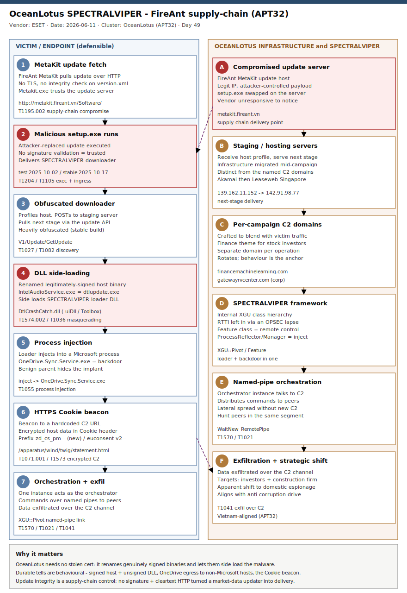

# OceanLotus (APT32) turns inward — SPECTRALVIPER via a FireAnt MetaKit supply-chain attack and a multi-year construction-firm intrusion

## TL;DR

ESET published (11 June 2026) two 2024–2026 OceanLotus (APT32) campaigns that both deploy the group's signature Windows backdoor, **SPECTRALVIPER**, but reveal a strategic shift from external espionage toward **domestic** Vietnamese targets. In the first, OceanLotus compromised the update server of **FireAnt MetaKit** — a market-data component widely used by Vietnamese stock investors — and replaced the legitimate `setup.exe` update (served over cleartext HTTP with no integrity check) with a SPECTRALVIPER downloader, running from ~2 October 2025 to ~9 March 2026 with deliberately narrow victim selection. In the second, the group sat inside a Vietnamese **infrastructure and transport construction corporation** from ~November 2024 to ~February 2026, likely entering via a Microsoft SQL Server RCE. Both chains rely on **DLL side-loading** (a renamed signed binary loading a SPECTRALVIPER loader DLL, which then injects the backdoor into `OneDrive.Sync.Service.exe`) and an HTTPS beacon that hides encrypted host-profiling data in an HTTP `Cookie` header. An OPSEC lapse left RTTI class names in one sample, exposing SPECTRALVIPER's internal `XGU` framework. The timing aligns with Vietnam's anti-corruption "Blazing Furnace" drive and a 2025 securities-market crackdown, suggesting domestic intelligence/financial-crime objectives. This is a Monday espionage case: primary **#1 APT state-nation** with strong **#7 supply chain**, **#19 RE**, and **#24 CTI tradecraft** secondaries.

## Attribution and confidence

**Primary cluster:** **OceanLotus**, also tracked as **APT32**, a cyber-espionage group active since at least 2012 and assessed by multiple vendors as aligned with Vietnamese state interests. ESET attributes both 2024–2026 campaigns to OceanLotus based on the exclusive use of SPECTRALVIPER (the group's signature backdoor first documented by Elastic Security Labs in 2023), shared infrastructure across the two operations, and tradecraft continuity. Confidence in *OceanLotus attribution* is **high** (signature implant + infrastructure overlap + long telemetry history); confidence in the *intrusion mechanics* (supply-chain update replacement, DLL side-loading, injection, Cookie-based beacon) is **high**, drawn from ESET's RE with sample hashes and network IOCs.

**Aliases / labels:** OceanLotus = APT32 = (historically) SeaLotus / Cobalt Kitty / TIN WOODLAWN. Signature tools across its history include **Denis/SOUNDBITE** (DNS tunneling), **PHOREAL** (ICMP C2), **WINDSHIELD**, and **SPECTRALVIPER** (orchestration-capable HTTPS backdoor).

| Overlap signal | Observation | Assessment |
|---|---|---|
| SPECTRALVIPER backdoor in both campaigns | OceanLotus signature implant since 2023 (Elastic) | High — group-exclusive tooling |
| RTTI class hierarchy (XGU framework, Pivot/Feature/ProcessReflector) | Internal architecture recovered from an OPSEC-lapse sample | High — matches prior SPECTRALVIPER analysis |
| Cookie-header beacon prefixed `euconsent-v2=` then `zd_cs_pm=` | Continuity with previously documented beacon format | High — durable behavioural tell |
| Domestic Vietnamese targeting (stock investors, construction corp) | Aligns with anti-corruption / securities crackdown timing | Medium — contextual, not technical |

**Genealogy with previous repo cases.** This is the diary's first **OceanLotus / APT32** primary and first Vietnam-aligned APT. It extends the supply-chain thread of `2026-06-12_LinkPro-eBPF-Rootkit-MagicPacket-EKS` (public-registry image abuse) and `2026-06-13_DevilNFC` (build-your-own tooling) into a **trusted software-update** compromise. It echoes the "trusted-signature abuse" theme of `2026-06-14_Humanity-Protocol-DPRK-Bridge-KeyTheft` (stolen code-signing cert) — here the trust comes not from a stolen cert but from a **legitimate signed host binary** abused for side-loading and from a **legitimate update channel**. The DLL side-loading + injection-into-a-Microsoft-process primitive parallels prior China/SEA espionage cases in the repo (e.g. `2026-06-08_OP-512-China-IIS-WebShell-Framework`).

## Kill chain — summary table

| Stage | MITRE | Detail |
|---|---|---|
| Compromise software supply chain | T1195.002 | FireAnt MetaKit update server serves a malicious `setup.exe` from the legitimate update URL |
| Exploit public-facing application | T1190 | Corporate intrusion: suspected Microsoft SQL Server RCE for initial foothold |
| User execution / ingress | T1204, T1105 | `Metakit.exe` runs the fake update as a legitimate one (no signature validation) |
| Obfuscated downloader | T1027, T1059 | Heavily obfuscated downloader profiles host, POSTs to staging, pulls next stage via `V1/Update/GetUpdate` |
| DLL side-loading | T1574.002 | Renamed signed binary (`IntelAudioService.exe` = `dtlupdate.exe`; `Toolbox.exe` copies) side-loads SPECTRALVIPER loader DLL |
| Masquerading | T1036 | Side-loading hosts renamed (`Genuine.exe`, `Updater.exe`, `AutoCAD242.exe`, `IntelAudioService.exe`) |
| Process injection | T1055 | `DtlCrashCatch.dll` injects SPECTRALVIPER into `OneDrive.Sync.Service.exe` (backdoor mode) |
| Discovery | T1082 | Downloader and backdoor profile the host machine |
| C2 over web protocols | T1071.001, T1573 | HTTPS beacon to hardcoded URL; encrypted host data in `Cookie` header (`zd_cs_pm=` / `euconsent-v2=`) |
| Lateral movement / orchestration | T1570, T1021 | One instance is the orchestrator; commands distributed to others over named pipes |
| Exfiltration over C2 | T1041 | Data exfiltrated over the SPECTRALVIPER C2 channel |

## Kill chain diagram



The diagram uses two lanes: the victim/endpoint plane on the left (legitimate MetaKit update fetch over cleartext HTTP → malicious `setup.exe` executed as a trusted update → obfuscated downloader profiling and next-stage pull → DLL side-loading via a renamed signed binary → injection into `OneDrive.Sync.Service.exe` → HTTPS Cookie-header beacon) and the OceanLotus attacker/infrastructure plane on the right (compromised FireAnt update server, staging servers, per-campaign C2 domains, named-pipe orchestration, and exfiltration). The critical (red) anchors are the malicious update on the supply-chain side and the side-loaded SPECTRALVIPER loader on the endpoint side; detection should concentrate on the side-loading, the injected-process egress, and the distinctive Cookie-header beacon.

## Stage-by-stage detail

### 1. Compromise of the FireAnt MetaKit update channel (T1195.002)

FireAnt is a leading Vietnamese fintech platform; **FireAnt MetaKit** is its data-delivery component that feeds real-time and historical market data to technical-analysis tools such as AmiBroker, MetaStock and MetaTrader. On 2 October 2025 ESET observed the first malicious payload served from the legitimate update URL, resolving to the genuine FireAnt update-server IP — i.e. a supply-chain compromise of the update server itself, not a look-alike.

```text
Legit update URL:  http://metakit.fireant[.]vn/Software/setup.exe
Update manifest:   http://metakit.fireant[.]vn/Software/version.xml   (no integrity check)
Transport:         cleartext HTTP (no TLS) -> also interceptable, though not abused here
First malicious:   2025-10-02 (test build)   Stable: 2025-10-17   Last seen: 2026-03-09
```

The MetaKit updater performed **no signature validation** and the `version.xml` manifest carried **no integrity mechanism**, so `Metakit.exe` executed the attacker's `setup.exe` as a normal update.

MITRE ATT&CK: **T1195.002 — Supply Chain Compromise: Compromise Software Supply Chain**; **T1553.002 — Subvert Trust Controls: Code Signing** (the absence of update-signature validation was abused).

### 2. Suspected MSSQL RCE for the corporate intrusion (T1190)

For the second campaign — a Vietnamese infrastructure and transport construction corporation compromised from ~November 2024 to ~February 2026 — the initial vector was not directly observed, but ESET's analysis of the victim's public-facing servers suggests exploitation of a **Microsoft SQL Server RCE** to gain the first foothold.

MITRE ATT&CK: **T1190 — Exploit Public-Facing Application**.

### 3. Obfuscated downloader and next-stage retrieval (T1027, T1059, T1105, T1082)

The stable downloader (first seen 2025-10-17) was heavily obfuscated, performed host reconnaissance, and POSTed the collected data to a staging server to request the next stage. The download API path was consistent across all samples.

```text
Download API:     V1/Update/GetUpdate   (constant across samples)
Staging servers:  139.162.11[.]152  ->  later migrated to  142.91.98[.]77
Test-vs-stable:   test build used hardcoded URLs + reused old SPECTRALVIPER + old infra;
                  stable build used an API request + fresh SPECTRALVIPER + new infra
                  (financemachinelearning[.]com crafted to blend with stock-investor traffic)
```

MITRE ATT&CK: **T1027 — Obfuscated Files or Information**; **T1059 — Command and Scripting Interpreter** (curl-based deployment); **T1105 — Ingress Tool Transfer**; **T1082 — System Information Discovery**.

### 4. DLL side-loading via a renamed signed binary (T1574.002, T1036)

The downloader dropped a side-loading chain. The host executable is a **renamed copy of a legitimate, signed binary**; the side-loaded DLL is **SPECTRALVIPER configured as a loader**.

```text
FireAnt campaign:
  IntelAudioService.exe  = copy of legitimate signed dtlupdate.exe
  side-loads:            DtlCrashCatch.dll  (SPECTRALVIPER loader)
  launched as:           IntelAudioService.exe /appmodel /StateRepository /Service

Corporate campaign:
  Genuine.exe / Updater.exe / AutoCAD242.exe  = copies of legitimate signed Toolbox.exe
  required parameter:    -uiDll   (drives the side-loading mechanism)
```

MITRE ATT&CK: **T1574.002 — Hijack Execution Flow: DLL Side-Loading**; **T1036 — Masquerading**.

### 5. Process injection into a Microsoft process (T1055)

Once executed, `DtlCrashCatch.dll` **injects itself into `OneDrive.Sync.Service.exe`**, where SPECTRALVIPER runs in backdoor mode. Injecting into a benign, network-active Microsoft process both hides the implant and gives its egress a plausible parent.

MITRE ATT&CK: **T1055 — Process Injection**.

### 6. HTTPS beacon with Cookie-header host profiling (T1071.001, T1573)

SPECTRALVIPER beacons to a hardcoded HTTPS URL using a predefined User-Agent, embedding **encrypted host-profiling data inside the HTTP `Cookie` header**. Historically this data was prefixed `euconsent-v2=`; in the FireAnt campaign ESET observed a new prefix, `zd_cs_pm=`, marking the first instance of this variation. C2 domain names are crafted per campaign to blend with the victim's normal traffic.

```text
Beacon URL:    https://financemachinelearning[.]com/apparatus/wind/twig/statement.html
Cookie prefix: zd_cs_pm=   (new)   |   euconsent-v2=   (historical)
Per-campaign:  financemachinelearning[.]com  (stock investors)
               gatewayrvcenter[.]com         (construction corp)
```

MITRE ATT&CK: **T1071.001 — Application Layer Protocol: Web Protocols**; **T1573 — Encrypted Channel**.

### 7. Orchestration, lateral movement and exfiltration (T1570, T1021, T1041)

SPECTRALVIPER supports an **orchestration model**: one instance is designated orchestrator and talks to C2, then distributes commands to other compromised hosts over **named pipes**. Beyond a backdoor, it is a capable loader able to inject additional binaries or shellcode received from C2. Stolen data is exfiltrated over the C2 channel.

```text
Internal framework:  XGU
  XGU::Pivot::StartLink                       (orchestration / named-pipe link)
  XGU::Pivot::Internal::WaitNew_RemotePipe    (orchestrator <-> instance pipe)
  Feature class                               (remote-control capabilities)
  ProcessReflector / ProcessManager           (process injection / manipulation)
```

MITRE ATT&CK: **T1570 — Lateral Tool Transfer**; **T1021 — Remote Services**; **T1041 — Exfiltration Over C2 Channel**.

## RE notes

ESET aligns with Elastic Security Labs' 2023 SPECTRALVIPER analysis and extends it via two samples that retained **RTTI** information (an OPSEC lapse), allowing partial reconstruction of the class hierarchy.

| Component | SHA-1 | Lang | Packer | Notes |
|---|---|---|---|---|
| SPECTRALVIPER backdoor (`system.config.xml`) | 865A1739337D3303B3AB02C5E694C22B79C42B7D | C++ | Obfuscated | Win64 backdoor payload |
| SPECTRALVIPER backdoor (`NotificationConfig.json`) | B0FEA981D02F6F76DE81EBAEFCB68B7D205D6194 | C++ | Obfuscated | Win64 backdoor payload |
| SPECTRALVIPER loader (`DtlCrashCatch.dll`) | 48FEBB91A10D1462461A012FAFC0918BB028E947 | C++ | Obfuscated | Side-loaded by `IntelAudioService.exe`; injects into `OneDrive.Sync.Service.exe` |
| SPECTRALVIPER (`SetupUi.dll`) | 150764A71DEEF498DE6F8C95ECCCB4455C1B601F | C++ | Obfuscated | Backdoor DLL |
| Downloader (`setup.exe`) | 511B77459673EC42163F19E300FF1D233B6C39FB | C++ | Heavy (stable) | Served from FireAnt update server; `V1/Update/GetUpdate` |

Architecture: an internal framework named **`XGU`** underpins SPECTRALVIPER. The **`Pivot`** subclass implements orchestration (named-pipe command distribution: `XGU::Pivot::StartLink`, `XGU::Pivot::Internal::WaitNew_RemotePipe`); the **`Feature`** subclass encapsulates remote-control capabilities; and **`ProcessReflector`** / **`ProcessManager`** implement process injection/manipulation. The beacon carries encrypted host data in the HTTP `Cookie` header (`zd_cs_pm=` / `euconsent-v2=`).

## Detection strategy

The defensible surface is the **endpoint** (side-loading, injection, beacon) and the **software-update integrity** of third-party tooling. Hashes rotate per intrusion, so the durable anchors are behavioural: a renamed signed binary side-loading a loader DLL from a user-writable path, an injected `OneDrive.Sync.Service.exe` beaconing to non-Microsoft infrastructure, the `Cookie: zd_cs_pm=`/`euconsent-v2=` beacon shape, the `V1/Update/GetUpdate` API, and the SPECTRALVIPER RTTI/framework strings.

### Telemetry that matters

- **Sysmon:** EID 1 (process creation — renamed signed side-loaders, distinctive command lines), EID 7 (image load — loader DLL from user paths; signer mismatch), EID 8/10 (CreateRemoteThread / process access into `OneDrive.Sync.Service.exe`), EID 3 (network connection — injected-process egress), EID 22 (DNS — C2 domains).
- **Defender XDR:** `DeviceProcessEvents`, `DeviceImageLoadEvents`, `DeviceNetworkEvents`, `DeviceFileEvents`.
- **Network / proxy:** TLS SNI + DNS for the C2 domains; HTTP for the FireAnt update path and `V1/Update/GetUpdate`; the `Cookie:` beacon prefix where TLS is inspected.
- **Software-update integrity:** inventory of third-party updaters fetching over cleartext HTTP or without signature validation (the FireAnt-class weakness).

### Detection coverage

| Engine | File | Logic |
|---|---|---|
| Sigma | [sigma/spectralviper_signed_binary_sideload_launch.yml](./sigma/spectralviper_signed_binary_sideload_launch.yml) | Renamed signed side-loading host (`IntelAudioService.exe` / Toolbox copies) launched with the distinctive `/appmodel /StateRepository /Service` or `-uiDll` command line |
| Sigma | [sigma/spectralviper_loader_dll_sideload.yml](./sigma/spectralviper_loader_dll_sideload.yml) | Image load of `DtlCrashCatch.dll` / `SetupUi.dll` from a user-writable path (side-loaded SPECTRALVIPER loader) |
| Sigma | [sigma/spectralviper_injected_onedrive_beacon.yml](./sigma/spectralviper_injected_onedrive_beacon.yml) | `OneDrive.Sync.Service.exe` making an outbound connection to non-Microsoft infrastructure (injection egress) |
| KQL | [kql/oceanlotus_spectralviper_c2.kql](./kql/oceanlotus_spectralviper_c2.kql) | DeviceNetworkEvents: beacon to SPECTRALVIPER C2 domains/IPs and the hardcoded beacon URL |
| KQL | [kql/oceanlotus_dll_sideload.kql](./kql/oceanlotus_dll_sideload.kql) | DeviceImageLoadEvents: loader DLL side-loaded from a user path by a signed host |
| KQL | [kql/oceanlotus_sideload_process.kql](./kql/oceanlotus_sideload_process.kql) | DeviceProcessEvents: renamed signed side-loaders with the distinctive command lines |
| KQL | [kql/oceanlotus_fireant_supplychain.kql](./kql/oceanlotus_fireant_supplychain.kql) | DeviceNetworkEvents/DeviceProcessEvents: MetaKit update fetch from `metakit.fireant.vn` and child process spawn |
| YARA | [yara/oceanlotus_spectralviper.yar](./yara/oceanlotus_spectralviper.yar) | RTTI/framework strings, Cookie-beacon shape, and downloader API (3 rules) |
| Suricata | [suricata/oceanlotus_spectralviper_c2.rules](./suricata/oceanlotus_spectralviper_c2.rules) | C2 domain SNI/DNS, beacon URL path, `Cookie: zd_cs_pm=` prefix, FireAnt update API, staging IPs |

No SPL is shipped (retired repo-wide). Convert Sigma with `sigma convert -t splunk -p sysmon <rule>.yml` if needed.

### Threat hunting hypotheses

- **H1 — [Renamed signed binary side-loading a loader DLL](./hunts/peak_h1_signed_sideload_loader.md):** a legitimately-signed executable runs from a user-writable path under a non-standard name and loads a non-Microsoft DLL from the same directory. PEAK ABLE: side-loading is OceanLotus's persistent execution primitive across both campaigns.
- **H2 — [Injected Microsoft process beaconing to non-Microsoft infrastructure](./hunts/peak_h2_injected_onedrive_egress.md):** `OneDrive.Sync.Service.exe` (or another benign Microsoft binary) makes outbound connections to hosts that are not Microsoft-owned, with Cookie-header profiling where visible.
- **H3 — [Third-party software updaters fetching insecure updates](./hunts/peak_h3_update_channel_integrity.md):** enumerate updaters pulling over cleartext HTTP or without signature validation (the FireAnt-class weakness) and pivot on the `V1/Update/GetUpdate` API and look-alike update hosts.

## Incident response playbook

### First 60 minutes (triage)

1. **Confirm the side-loading pair.** For each alerting host, identify the renamed signed binary and the DLL it loaded from the same user-writable directory; capture both with full paths and hashes.
2. **Check the injected process.** Inspect `OneDrive.Sync.Service.exe` for injected memory and outbound connections to non-Microsoft hosts; do not kill it before capturing memory.
3. **Pull the beacon.** Search proxy/DNS for the C2 domains and the `apparatus/wind/twig/statement.html` path; where TLS is inspected, hunt the `Cookie: zd_cs_pm=`/`euconsent-v2=` prefix.
4. **Scope the supply-chain blast radius.** Identify every host that pulled a MetaKit update from `metakit.fireant.vn` in the campaign window (2025-10-02 → 2026-03-09); these are candidate victims even if only a subset received SPECTRALVIPER.
5. **Network-isolate** confirmed hosts in EDR (preserve memory and the C2 session).
6. **Notify** the affected software vendor (ESET reported FireAnt did not respond), partners, and the national CERT (CCN-CERT / VNCERT as applicable).

### Artifacts to collect

| Artifact | Path | Tool | Why |
|---|---|---|---|
| Side-loading host + loader DLL | user-writable dirs (`%APPDATA%`, `%USERPROFILE%`, app subfolders) | EDR / `Get-AuthenticodeSignature` | Confirm renamed signed host + non-Microsoft loader DLL |
| Downloader (`setup.exe`) | MetaKit install/update path | EDR / MFT | Confirm supply-chain payload; pivot on `V1/Update/GetUpdate` |
| Injected process memory | `OneDrive.Sync.Service.exe` | WinPmem / Velociraptor | Recover SPECTRALVIPER in memory + RTTI strings |
| Process/image-load telemetry | Sysmon EID 1/7/8/10 | EDR / Velociraptor | Side-load + injection chain |
| Network/C2 | Sysmon EID 3/22 / proxy | Zeek / NetFlow | C2 domains/IPs, beacon timing, Cookie prefix |
| Update-channel logs | proxy / endpoint | proxy logs | Which hosts fetched MetaKit updates and when |

### IR queries and commands

```powershell
# Find renamed signed binaries side-loading a non-Microsoft DLL from a user-writable path
Get-ChildItem -Path $env:APPDATA,$env:USERPROFILE -Recurse -Include *.exe -ErrorAction SilentlyContinue |
  ForEach-Object {
    $sig = Get-AuthenticodeSignature $_.FullName
    if ($sig.Status -eq 'Valid') {
      $dlls = Get-ChildItem $_.DirectoryName -Filter *.dll -ErrorAction SilentlyContinue
      foreach ($d in $dlls) {
        if ((Get-AuthenticodeSignature $d.FullName).Status -ne 'Valid') {
          [pscustomobject]@{ Host=$_.FullName; Signer=$sig.SignerCertificate.Subject; UnsignedDll=$d.FullName }
        }
      }
    }
  }
```

```bash
# Grep memory/disk artifacts for SPECTRALVIPER RTTI / beacon markers
grep -aoE 'XGU::Pivot::(StartLink|Internal::WaitNew_RemotePipe)|ProcessReflector|ProcessManager|zd_cs_pm=|euconsent-v2=|V1/Update/GetUpdate' ./collected/* 2>/dev/null | sort -u
```

```kql
// Defender XDR: OneDrive.Sync.Service.exe egress to non-Microsoft hosts (injection anomaly)
DeviceNetworkEvents
| where Timestamp > ago(30d)
| where InitiatingProcessFileName =~ "OneDrive.Sync.Service.exe"
| where RemoteUrl !has "microsoft" and RemoteUrl !has "onedrive" and RemoteUrl !has "live.com"
| project Timestamp, DeviceName, RemoteUrl, RemoteIP, RemotePort, InitiatingProcessFolderPath
```

### Containment, eradication, recovery

- **Exit criteria:** all side-loading pairs and injected implants removed; affected hosts reimaged where the backdoor ran; the FireAnt MetaKit updater removed or pinned to a verified clean build with signature/TLS enforcement; no further beacons to the C2 set for a sustained window.
- **What NOT to do:** do **not** treat the FireAnt updater as trusted again until the vendor confirms a clean, signed channel — the root cause is missing update integrity. Do **not** assume a single side-load host is the whole footprint: SPECTRALVIPER orchestrates over named pipes, so hunt peers in the same segment. Do **not** clear `OneDrive.Sync.Service.exe` alerts as false positives without checking for injection.
- **Recovery:** restore from known-good media; rotate credentials reachable from compromised hosts; for the supply-chain victims, re-pull MetaKit only from a verified source and enforce HTTPS + signature validation at the proxy.

### Recovery validation

- Confirm no renamed signed binary loads a non-Microsoft DLL from a user-writable path across the estate.
- Verify `OneDrive.Sync.Service.exe` only connects to Microsoft-owned infrastructure.
- Confirm third-party updaters (MetaKit and peers) fetch over TLS with signature validation; alert on cleartext-HTTP update fetches.
- Maintain blocklists/alerts for the SPECTRALVIPER C2 domains/IPs and the beacon URL path.

## IOCs

ESET released sample hashes (SHA-1), C2 domains/IPs and behavioural anchors. Top items below; full list in [iocs.csv](./iocs.csv).

| Type | Value | Context | Confidence | Source |
|---|---|---|---|---|
| sha1 | 48FEBB91A10D1462461A012FAFC0918BB028E947 | SPECTRALVIPER loader `DtlCrashCatch.dll` (side-loaded) | high | ESET 2026-06-11 |
| sha1 | 865A1739337D3303B3AB02C5E694C22B79C42B7D | SPECTRALVIPER backdoor (`system.config.xml`) | high | ESET 2026-06-11 |
| domain | financemachinelearning.com | C2 crafted for the stock-investor campaign | high | ESET 2026-06-11 |
| domain | gatewayrvcenter.com | C2 for the construction-firm intrusion | high | ESET 2026-06-11 |
| domain | metakit.fireant.vn | Compromised legitimate update server (no TLS, no integrity check) | high | ESET 2026-06-11 |
| ipv4 | 194.68.26.241 | C2 server hosting financemachinelearning.com (M247) | high | ESET 2026-06-11 |
| ipv4 | 142.91.98.77 | Staging/hosting server (Leaseweb SG) | high | ESET 2026-06-11 |
| url | https://financemachinelearning.com/apparatus/wind/twig/statement.html | Hardcoded SPECTRALVIPER beacon URL | high | ESET 2026-06-11 |
| string | zd_cs_pm= | New HTTP Cookie prefix on encrypted host-profiling beacon data | high | ESET 2026-06-11 |
| string | V1/Update/GetUpdate | Downloader next-stage API path (constant across samples) | high | ESET 2026-06-11 |
| string | XGU::Pivot::StartLink | SPECTRALVIPER RTTI orchestration method | high | ESET 2026-06-11 |
| path | DtlCrashCatch.dll | Side-loaded SPECTRALVIPER loader DLL name | high | ESET 2026-06-11 |
| path | IntelAudioService.exe | Renamed legitimate `dtlupdate.exe` side-loading host | high | ESET 2026-06-11 |
| cve | none | No CVE; update-server supply-chain compromise + side-loading | high | analysis |

## Secondary findings

- **Supply chain (#7): trusted update channels are an under-validated foothold.** The FireAnt MetaKit updater fetched `version.xml` and the binary over **cleartext HTTP with no integrity validation and no TLS**, so replacing `setup.exe` on the update server was sufficient to ship SPECTRALVIPER as a "legitimate" update. Update-channel signature validation and TLS would have broken the chain; this is the same class of weakness whether the actor is an APT or a criminal crew.
- **Malware deep-dive (#19): SPECTRALVIPER is an orchestration-capable loader, not just a backdoor.** Its `XGU` framework distributes commands over named pipes from a single orchestrator, and `ProcessReflector`/`ProcessManager` inject the backdoor and arbitrary payloads. The OPSEC lapse leaving RTTI names intact gave defenders durable string anchors — a reminder that build hygiene is part of an adversary's tradecraft.
- **CTI tradecraft (#24): a 15-year-old group's strategic pivot.** OceanLotus appears to have shifted from external espionage toward **domestic** monitoring (stock investors, a construction corporation) in step with Vietnam's anti-corruption "Blazing Furnace" campaign and a 2025 securities-market crackdown — a reminder that targeting context, not just tooling, informs attribution and victim notification.

## Pedagogical anchors

- **A legitimate signed binary is an execution primitive, not a guarantee of safety.** OceanLotus never needed a stolen certificate — it renamed genuinely-signed binaries (`dtlupdate.exe`, `Toolbox.exe`) and let them side-load the malware. Hunt the *pairing* (signed host + unsigned DLL from a user path), not just signatures.
- **Injecting into a Microsoft process buys cover.** SPECTRALVIPER runs inside `OneDrive.Sync.Service.exe`; the durable tell is the *destination*, not the process — a benign Microsoft binary talking to non-Microsoft infrastructure.
- **Beacons hide in plain sight.** Encrypted host data rode inside an HTTP `Cookie` header (`zd_cs_pm=`/`euconsent-v2=`); the format survived across campaigns even as domains rotated, so behavioural beacon shape beats per-campaign IOCs.
- **Update integrity is a supply-chain control, not a nicety.** No signature validation + cleartext HTTP turned a market-data updater into a malware delivery channel. Validate third-party update channels the way you validate your own.
- **Targeting context is intelligence.** The shift to domestic financial-crime and anti-corruption targets is as telling as the tooling — and it changes who you warn and why.

## What's in this folder

| File | Purpose |
|---|---|
| [README.md](./README.md) | This analysis (15 sections). |
| [kill_chain.svg](./kill_chain.svg) | Two-lane kill chain (endpoint left, OceanLotus infrastructure right), canonical palette, template A. |
| [sigma/spectralviper_signed_binary_sideload_launch.yml](./sigma/spectralviper_signed_binary_sideload_launch.yml) | Sigma: renamed signed side-loading host with distinctive command line (process_creation). |
| [sigma/spectralviper_loader_dll_sideload.yml](./sigma/spectralviper_loader_dll_sideload.yml) | Sigma: SPECTRALVIPER loader DLL side-loaded from a user path (image_load). |
| [sigma/spectralviper_injected_onedrive_beacon.yml](./sigma/spectralviper_injected_onedrive_beacon.yml) | Sigma: injected `OneDrive.Sync.Service.exe` egress to non-Microsoft host (network_connection). |
| [kql/oceanlotus_spectralviper_c2.kql](./kql/oceanlotus_spectralviper_c2.kql) | KQL: beacon to SPECTRALVIPER C2 domains/IPs and beacon URL. |
| [kql/oceanlotus_dll_sideload.kql](./kql/oceanlotus_dll_sideload.kql) | KQL: loader DLL side-loaded from a user path. |
| [kql/oceanlotus_sideload_process.kql](./kql/oceanlotus_sideload_process.kql) | KQL: renamed signed side-loaders with distinctive command lines. |
| [kql/oceanlotus_fireant_supplychain.kql](./kql/oceanlotus_fireant_supplychain.kql) | KQL: MetaKit update fetch from `metakit.fireant.vn` + child spawn. |
| [yara/oceanlotus_spectralviper.yar](./yara/oceanlotus_spectralviper.yar) | YARA: RTTI/framework strings, Cookie-beacon shape, downloader API (3 rules). |
| [suricata/oceanlotus_spectralviper_c2.rules](./suricata/oceanlotus_spectralviper_c2.rules) | Suricata: C2 SNI/DNS, beacon path, Cookie prefix, FireAnt update API, staging IPs. |
| [hunts/peak_h1_signed_sideload_loader.md](./hunts/peak_h1_signed_sideload_loader.md) | PEAK hunt H1: signed side-load host + loader DLL. |
| [hunts/peak_h2_injected_onedrive_egress.md](./hunts/peak_h2_injected_onedrive_egress.md) | PEAK hunt H2: injected Microsoft process egress. |
| [hunts/peak_h3_update_channel_integrity.md](./hunts/peak_h3_update_channel_integrity.md) | PEAK hunt H3: insecure third-party update channels. |
| [iocs.csv](./iocs.csv) | Indicators (hashes, domains, IPs, URLs, behavioural), with confidence and source. |

## Sources

- [OceanLotus: From external espionage to domestic targeting (ESET WeLiveSecurity, 2026-06-11)](https://www.welivesecurity.com/en/eset-research/oceanlotus-external-espionage-domestic-targeting/)
- [OceanLotus IoCs and samples (ESET malware-ioc GitHub)](https://github.com/eset/malware-ioc/tree/master/oceanlotus)
- [OceanLotus Hits Vietnam Investors With SPECTRALVIPER in FireAnt Attack (The Hacker News, 2026-06)](https://thehackernews.com/2026/06/oceanlotus-hits-vietnam-investors-with.html)
- [OceanLotus targets stock investors and construction firm with SPECTRALVIPER backdoor (SC Media)](https://www.scworld.com/brief/oceanlotus-targets-stock-investors-and-construction-firm-with-spectralviper-backdoor)
- [OceanLotus Targets Stock Investors in FireAnt MetaKit Supply-Chain Hack (GBHackers)](https://gbhackers.com/oceanlotus-targets-stock-investors/)
- [Elastic charms SPECTRALVIPER (Elastic Security Labs, 2023 — original SPECTRALVIPER analysis)](https://www.elastic.co/security-labs/elastic-charms-spectralviper)
- [MITRE ATT&CK T1574.002 — DLL Side-Loading](https://attack.mitre.org/techniques/T1574/002/)
- [MITRE ATT&CK T1195.002 — Compromise Software Supply Chain](https://attack.mitre.org/techniques/T1195/002/)
- [MITRE ATT&CK T1055 — Process Injection](https://attack.mitre.org/techniques/T1055/)
