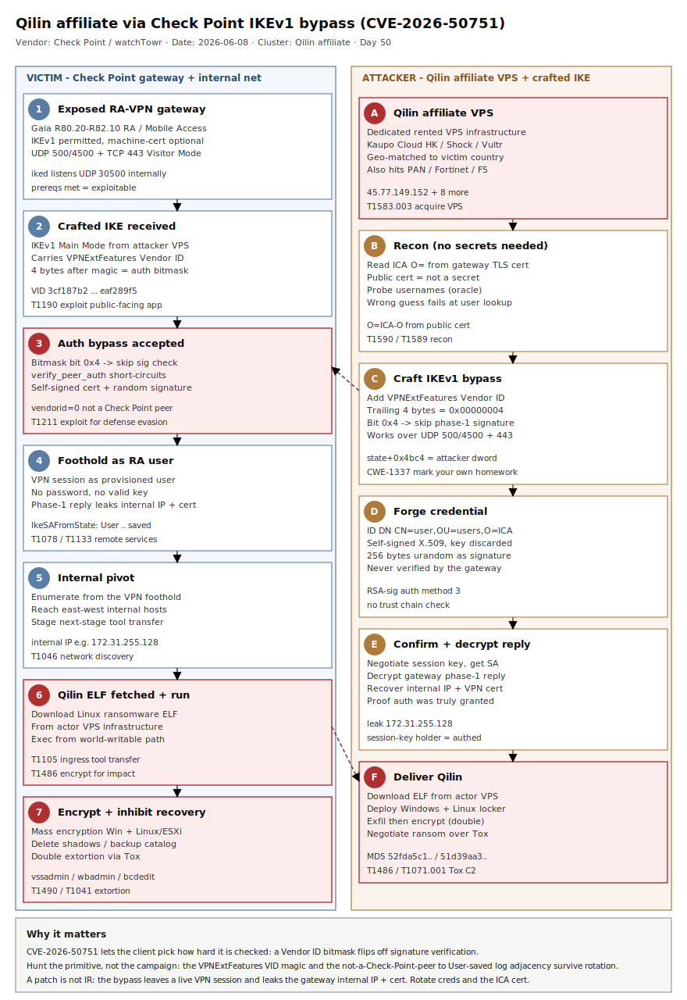

# Qilin affiliate weaponises Check Point IKEv1 VPN auth-bypass (CVE-2026-50751) as ransomware initial access

## TL;DR

A financially-motivated operator — assessed by Check Point Research with **medium confidence** to be a **Qilin ransomware affiliate** — has been exploiting **CVE-2026-50751**, a critical (CVSS 9.3) authentication-bypass in the **deprecated IKEv1** code of Check Point Remote Access VPN / Mobile Access / Spark Firewall, to obtain unauthenticated remote-access VPN sessions as the **initial-access primitive** for ransomware intrusions. Exploitation runs **in the wild since 7 May 2026** — roughly a month before any patch — against "a few dozen targeted organizations globally"; Check Point disclosed and hotfixed on **8 June 2026** (sk185033), CISA added the CVE to **KEV on 9 June 2026**, and watchTowr Labs published a full root-cause + working bypass on **12 June 2026**. The flaw is a textbook *client-controlled security decision*: the gateway reads a 4-byte bitmask out of an attacker-supplied IKE Vendor ID payload (`VPNExtFeatures`) and lets that bitmask decide whether it bothers to verify the client's certificate signature. This case is filed as an **Initial Access Broker / ransomware-affiliate** story (Tuesday crime-economy): the novelty is the *access*, the payload is commodity Qilin Linux/Windows ransomware, and the durable detection lives on the edge appliance and the first east-west hop.

## Attribution and confidence

- **Cluster name (vendor):** *Qilin ransomware affiliate* (Check Point Research, advisory 8 June 2026). Not a named, tracked intrusion-set alias — Check Point attributes the **post-exploitation** to a Qilin affiliate by behaviour and tooling overlap.
- **Aliases / context:** Qilin (a.k.a. **Agenda**) is a Rust/Go Ransomware-as-a-Service operation active since 2022, Russian-speaking ecosystem, double-extortion, with Windows and Linux/ESXi lockers. The CVE itself: **CVE-2026-50751** (auth bypass, CVSS 9.3) plus a sibling **CVE-2026-50752** (CVSS 7.4, site-to-site IKEv1 MitM, found by Check Point's BLAST agentic code-analysis platform, *not* observed exploited).
- **Vendor that discovered:** **Check Point Research** opened the investigation on **4 June 2026** after suspicious-activity indications; root-cause RE and a working unauthenticated bypass were independently published by **watchTowr Labs** (McCaulay Hudson) on **12 June 2026**. Secondary coverage: **Rapid7**, **SecurityWeek**, **BleepingComputer**, **Help Net Security**, **CISA KEV**.
- **Confidence:** **high** on the mechanism (the vulnerable code path and the working bypass are independently reproduced by watchTowr from a binary diff of `iked`); **high** that this is exploited in the wild and KEV-listed; **medium** on the actor framing (Check Point's own wording is "medium confidence … uses Qilin ransomware"). The actor's *geography* is unattributed — it operates from rented VPS infrastructure, not a national nexus.

| Overlap dimension | Observation | Confidence |
|---|---|---|
| Initial access | CVE-2026-50751 IKEv1 cert-validation bypass on Check Point RA-VPN | high (mechanism reproduced) |
| Payload | Qilin (Agenda) Linux ransomware ELF + Windows locker | medium (CPR attribution) |
| C2 / comms | Indicators suggesting **Tox** protocol (common to financially-motivated RaaS) | medium |
| Infrastructure | Dedicated VPS: **Kaupo Cloud HK**, **Shock Hosting**, **Vultr Holdings**; geo-correlated to victim country (e.g. Taiwan victims → Taiwan-geolocated VPS) | high (CPR-reported) |
| Cross-vendor reuse | Same actor infra assessed to also target Palo Alto / Fortinet / F5 VPN flaws | medium |

**Genealogy with previous repo cases.** This is the repo's **second Qilin primary**, but a structurally different one. `2026-05-12_Qilin-EDR-Killer-msimg32` covered Qilin's *defence-evasion / impact* stage (a BYO-side-loaded EDR killer); today's case covers the *initial-access* stage and never touches the same artefacts. It also continues the repo's long edge-appliance-as-front-door thread — `2026-05-05_Akira-SonicWall-CVE-2024-40766`, `2026-05-16_Cisco-SDWAN-vHub-AuthBypass-UAT8616`, `2026-05-23_SonicWall-Gen6-MFA-Bypass-CVE-2024-12802` — all the same lesson: a perimeter VPN/edge box with a logic flaw is a ransomware affiliate's cheapest valid account. The IAB-feeds-RaaS economics echo `2026-05-26_VenomousHelper-STAC6405-Dual-RMM-IAB`.

## Kill chain — summary table

| Stage | MITRE | Detail |
|---|---|---|
| Resource development | T1588.006 / T1583.003 | Acquire CVE-2026-50751 capability; stand up dedicated VPS (Kaupo Cloud HK / Shock Hosting / Vultr), geo-matched to target |
| Initial access | T1190 / T1133 / T1211 | Send crafted IKEv1 Main Mode msg with `VPNExtFeatures` Vendor ID; set auth-skip bitmask; present forged self-signed cert for a valid username + ICA `O=` string |
| Defense evasion | T1211 / T1078 | Gateway skips `verifyMessagePhase1`; SA created; attacker rides in as a provisioned Remote-Access user without a password |
| Discovery / pivot | T1046 | Decrypt gateway phase-1 reply to recover internal IP + VPN certificate; enumerate internal network from the VPN foothold |
| Ingress tool transfer | T1105 | Download Qilin Linux **ELF** payload from actor-controlled infra |
| Exfiltration | T1041 | Double-extortion data theft prior to encryption |
| Impact | T1486 / T1490 | Deploy Qilin locker (Windows / Linux); inhibit recovery; extort via Tox |



The diagram is a two-lane map: the **victim lane (left)** is the Check Point gateway and the internal network it fronts; the **attacker lane (right)** is the VPS infrastructure and the crafted IKE exchange. The single most important detection anchor sits at the boundary — the `VPNExtFeatures` Vendor ID magic (`3c f1 87 b2 …`) in inbound IKE and the gateway's own `vendorid=0 … not a Check Point peer` log line immediately followed by an `IkeSAFromState: User <name> saved` success. Everything to the right of the foothold (ELF fetch, recovery inhibition, Tox C2) is commodity Qilin and is detected with standard host telemetry.

## Stage-by-stage detail

### 1. Resource development — VPS staging, geo-matched

Check Point reports the actor used **dedicated VPS infrastructure** rather than compromised hosts, on **Kaupo Cloud HK**, **Shock Hosting**, and **Vultr Holdings**, and in some cases geo-correlated the VPS to the victim's country (Taiwan victims serviced from Taiwan-geolocated VPS) — a cheap blend-in tactic. Nine attacker IPs were published:

```
45.77.149.152    209.182.225.136   38.60.157.139
162.33.177.101   45.76.26.42       144.208.127.155
38.54.88.201     38.54.107.167     66.42.99.200
```

MITRE: `T1583.003` (Acquire Infrastructure: Virtual Private Server), `T1588.006` (Obtain Capabilities: Vulnerabilities).

### 2. Initial access — the IKEv1 "mark your own homework" bypass

The vulnerable code lives in the **`iked`** daemon (on R81.10+, IKE negotiation is redirected to `iked`, which listens internally on **UDP 30500**; externally the gateway is reached over **UDP 500/4500** and, in Visitor Mode, **TCP 443** using the TCPT framing protocol). The attacker sends an IKEv1 Main Mode initiation carrying a Check Point Vendor ID payload whose 16-byte magic is:

```
3c f1 87 b2 47 40 29 ea 46 ac 7f d0 ea f2 89 f5      # logged by the gateway as "VPNExtFeatures"
```

The four bytes **immediately after** the magic are byte-swapped and written verbatim into the phase-1 negotiation state at offset `0x4bc4` — the very flags word that later gates authentication. Setting **bit `0x4`** short-circuits `verify_peer_auth`; setting **bit `0x2`** skips the signature check in `process_auth_pl`. The attacker then completes the bypass with an **RSA-signature** credential (IKE auth method `3`):

- an ID payload with distinguished name `CN=<username>,OU=users,O=<ICA-O>`,
- a **self-signed** X.509 minted on the spot (no trust chain check happens),
- a signature payload of **256 bytes of `os.urandom`** (never verified),
- the `VPNExtFeatures` VID with bit `0x4`.

The only things the attacker must know are a **valid username** (the same probe doubles as a username oracle — a wrong guess fails at user lookup) and the **ICA organization (`O=`) string**, which is not secret — it sits in the gateway's own public TLS certificate. The bypass works across the **Certificate**, **Certificate-with-enrollment**, and **Mixed** user-auth modes; only plain username/password (XAUTH) holds the line. MITRE: `T1190` (Exploit Public-Facing Application), `T1133` (External Remote Services), `T1211` (Exploitation for Defense Evasion).

### 3. Foothold confirmation — internal IP + cert leak

watchTowr's PoC decrypts the gateway's final phase-1 message with the negotiated session key and recovers the gateway's **internal identity IP** (example: `172.31.255.128`) and its VPN certificate — proof the session key (and therefore authentication) was genuinely granted. On the gateway side the success line is:

```
IkeSAFromState: User CN=<username>,OU=users,O=<ICA-O> saved
```

immediately preceded — on a *vulnerable* box — by `verify_peer_auth: vendorid=0 .. not a Check Point peer`. The gateway literally logs that it does not recognise the peer and then authenticates it anyway. MITRE: `T1078` (Valid Accounts — the attacker is now a provisioned RA user).

### 4. Ingress tool transfer + impact — commodity Qilin

After VPN access, Check Point observed attempts to download malicious **ELF** files from actor-controlled infrastructure and an attributional overlap with **Qilin Linux ransomware** binaries. The downstream is standard Qilin double-extortion: data theft (`T1041`), then deployment of the Qilin locker on Windows and Linux/ESXi (`T1486`) with recovery inhibition (`T1490`), and extortion negotiated over what Check Point assesses to be the **Tox** protocol (`T1071.001`/`T1572`). Two payload hashes were published (MD5 `52fda5c1b9704544f32ee98d9060e689`, `51d39aa39478beeac94f2d12f682ecce`).

## RE notes

No malware *sample* is dissected here (the published hashes have no public deep-dive yet); the reverse engineering of interest is **watchTowr's binary diff of the vulnerable component**, which is what makes the network signature durable.

| Component | Identifier | Lang | Notes |
|---|---|---|---|
| `iked` (daemon) | `ike` binary, files `ikeMainMode.cc`, `ikeAggressive.cc`, `machine_cert_utils.cc` | C/C++ | IKE handling moved here from legacy `vpnd` on R81.10+; listens UDP 30500 internally |
| Vuln function | `process_cert_payloads(msg, state, err, process_machine_certs)` | C/C++ | Trailing `int` param deleted by the patch — the client-controlled gate |
| Sig gate | `process_auth_pl` (bit `0x2`), `verify_peer_auth` (bit `0x4`) at `state+0x4bc4` | C/C++ | `&&` / `||` short-circuits skip `verifyMessagePhase1` |
| Write primitive | `processVendorIDPayload` | C/C++ | Writes attacker's 4 bytes (byte-swapped) into `state+0x4bc4` |

**Patch logic.** The fixed build removes the `process_machine_certs` parameter entirely and instead reads the gateway's *own* machine-cert policy from a new state field `state+0x4bd4`, gated by a new `is_machine_cert_supported()` — i.e. the server, not the client, decides whether the client must authenticate. **Detection consequence:** the `VPNExtFeatures` VID magic and the `vendorid=0 … not a Check Point peer` → `User … saved` log adjacency are reliable hunting anchors that survive payload/infrastructure rotation, because they are properties of the *exploit primitive*, not the campaign.

## Detection strategy

### Telemetry that matters

- **Check Point gateway logs (the primary source):** `iked` / VPN daemon logs. Hunt for `VPNExtFeatures` Vendor ID, `vendorid=0 .. not a Check Point peer`, `MMCreate6`, and `IkeSAFromState: User … saved` adjacency; on patched boxes the rejection line is `verifyMessagePhase1: Authentication failure with hybrid`. Ship via Syslog to Sentinel (`Syslog` / `CommonSecurityEvent`).
- **Network sensor on the perimeter:** inbound **UDP 500/4500** and **TCP 443 (TCPT Visitor Mode)** to the gateway carrying the `VPNExtFeatures` 16-byte magic. This is the highest-fidelity network anchor.
- **East-west / endpoint EDR:** outbound connections from any host to the nine actor VPS IPs (`DeviceNetworkEvents`); ELF transfers; Linux `auditd` execve of freshly-dropped ELF from `/tmp` or `/dev/shm`.
- **Windows host telemetry (Qilin impact):** Sysmon EID 1 (process create) for shadow-copy/recovery deletion; EID 11 (file create) for ransom notes; Defender XDR `DeviceProcessEvents`, `DeviceFileEvents`, `DeviceNetworkEvents`.

### Detection coverage

| Engine | File | Logic |
|---|---|---|
| Suricata | `suricata/checkpoint_ikev1_cve_2026_50751.rules` | `VPNExtFeatures` VID magic in IKE over UDP 500/4500 and TCP 443 TCPT; outbound to actor VPS IP set; ELF fetch from actor infra |
| Sigma | `sigma/qilin_recovery_inhibition.yml` | Shadow-copy / backup-catalog / boot-recovery deletion (Qilin pre-encryption) |
| Sigma | `sigma/qilin_actor_vps_beacon.yml` | Network connection from an internal host to the nine actor VPS IPs |
| Sigma | `sigma/qilin_linux_elf_staging.yml` | Linux execution of a freshly chmod'd ELF from a world-writable path post-VPN |
| KQL | `kql/checkpoint_vpn_bypass_logon_anomaly.kql` | Check Point Syslog VPN logon from actor IPs / first-seen source for a user |
| KQL | `kql/qilin_actor_vps_beacon.kql` | `DeviceNetworkEvents` egress to the nine actor VPS IPs |
| KQL | `kql/qilin_recovery_inhibition.kql` | `DeviceProcessEvents` vssadmin/wbadmin/bcdedit recovery destruction |
| KQL | `kql/vpn_signin_from_actor_infra.kql` | `SigninLogs` interactive/VPN sign-ins sourced from actor VPS IPs |
| YARA | `yara/checkpoint_ikev1_bypass_and_qilin_infra.yar` | `VPNExtFeatures` VID magic (pcap/memory); files embedding any actor C2 IP |

No SPL is shipped (retired repo-wide 2026-05-11); convert any Sigma with `sigma convert -t splunk -p sysmon <rule>.yml`.

### Threat hunting hypotheses

- **H1 — Edge log retro-hunt (PEAK):** *If* the actor exploited CVE-2026-50751, *then* gateway IKE logs from **7 May 2026 onward** contain `VPNExtFeatures` / `vendorid=0 … not a Check Point peer` lines adjacent to `User … saved` successes, and/or RA logons for accounts that never normally use the VPN. See `hunts/peak_h1_checkpoint_ikev1_log_audit.md`.
- **H2 — Post-foothold Qilin staging (PEAK):** *If* a foothold succeeded, *then* an internal host beacons to one of the nine VPS IPs, fetches an ELF, and exhibits recovery-inhibition before mass file writes. See `hunts/peak_h2_qilin_post_vpn_staging.md`.
- **H3 — Exposure / configuration hunt (PEAK):** enumerate Check Point gateways still accepting **IKEv1** with **machine-cert not mandatory** (the exploit prerequisites) and confirm hotfix sk185033 is applied. See `hunts/peak_h3_ikev1_exposure_config.md`.

## Incident response playbook

### First 60 minutes (triage)

1. **Confirm exposure.** Identify every Check Point gateway exposed on UDP 500/4500 or TCP 443 and check Gaia version against the affected list (R80.20.X–R82.10). Confirm whether IKEv1 is permitted and whether machine-cert auth is mandatory.
2. **Patch or mitigate now.** Apply **sk185033** hotfix. If patching is blocked, use Check Point's documented RA-config mitigations (move to IKEv2-only / mandate machine-cert / disable legacy RA clients) and consider blocking IKEv1 at the edge.
3. **Pull IKE logs from 7 May 2026 onward.** Grep for `VPNExtFeatures`, `vendorid=0`, `not a Check Point peer`, and `IkeSAFromState: User`. Any `User … saved` not matched by a legitimate enrolment is a candidate compromise.
4. **Sweep east-west.** Block and alert on the nine actor VPS IPs; search EDR for any internal host that contacted them.
5. **Hunt Qilin staging.** Look for new ELF files, recovery-inhibition commands, and ransom-note writes on hosts reachable from the VPN pool.

### Artifacts to collect

| Artifact | Path | Tool | Why |
|---|---|---|---|
| IKE/VPN daemon logs | `$FWDIR/log/` (ike.elg / vpnd.elg / fw.log) | Check Point CLI / fw log | Bypass evidence (`VPNExtFeatures`, `User … saved`) |
| RA user provisioning | ICA / SmartConsole user DB | SmartConsole | Map `User … saved` DNs to real accounts |
| Perimeter pcap | span/tap of gateway external iface | Zeek / Suricata | Confirm VID magic + actor IPs |
| EDR network events | per-host | Defender XDR / EDR | Egress to VPS IP set, ELF fetch |
| Linux triage | `/tmp`, `/dev/shm`, `auditd`, `bash_history` | UAC / Velociraptor | ELF staging + execution |
| Windows triage | shadow-copy state, ransom notes, Sysmon | KAPE / Velociraptor | Qilin impact scope |

### IR queries and commands

```bash
# Check Point: search IKE logs for the bypass signature (run on the gateway / mgmt)
fw log -n -f -t | grep -Ei 'VPNExtFeatures|vendorid=0|not a Check Point peer|IkeSAFromState: User'
# Confirm IKEv1 acceptance / machine-cert posture (review RA community + gateway props)
cpprod_util CPPROD_GetValue FW1 ProductVersion 1 ; vpn ver
```

```powershell
# Windows: hosts in the VPN-reachable pool that talked to actor VPS infra (DNS/flow export)
$ips = '45.77.149.152','209.182.225.136','38.60.157.139','162.33.177.101','45.76.26.42','144.208.127.155','38.54.88.201','38.54.107.167','66.42.99.200'
Get-NetTCPConnection | Where-Object { $_.RemoteAddress -in $ips } |
  Select-Object LocalAddress,RemoteAddress,OwningProcess,State
```

```kql
// Defender XDR: any internal egress to the nine Qilin-affiliate VPS IPs (last 45 days)
let actorIPs = dynamic(["45.77.149.152","209.182.225.136","38.60.157.139","162.33.177.101","45.76.26.42","144.208.127.155","38.54.88.201","38.54.107.167","66.42.99.200"]);
DeviceNetworkEvents
| where Timestamp > ago(45d)
| where RemoteIP in (actorIPs)
| project Timestamp, DeviceName, InitiatingProcessFileName, RemoteIP, RemotePort, ActionType
| order by Timestamp asc
```

### Containment, eradication, recovery

- **Exit criteria:** sk185033 applied on every affected gateway; no IKEv1 acceptance with optional machine-cert; all `User … saved` events reconciled to legitimate enrolments; no host egress to the actor IP set; clean EDR sweep for ELF staging and Qilin lockers.
- **What NOT to do:** do **not** treat a patch as remediation of an *intrusion* — the bypass leaves a valid VPN session and possibly stolen credentials. Rotate VPN/RA account credentials and any secrets reachable from the VPN segment; **rotate the gateway's ICA / VPN certificate** if foothold is confirmed (it was leaked in the phase-1 reply). Do not rely on the gateway's own "not a Check Point peer" log to mean "rejected" — on vulnerable boxes it precedes a *success*.
- **Eradication:** isolate and rebuild any host that ran a Qilin ELF/locker; restore from offline/immutable backups validated clean.

### Recovery validation

Re-run the exposure hunt (H3) and confirm zero gateways accept IKEv1 with optional machine-cert; replay a benign `VPNExtFeatures` test (watchTowr DAG) against a *patched* box and confirm the `verifyMessagePhase1: Authentication failure` rejection path. Confirm Suricata VID-magic rule fires in a lab and is clean in production. Verify backups restore and no recovery-inhibition persists.

## IOCs

| Type | Value | Context | Confidence | Source |
|---|---|---|---|---|
| cve | CVE-2026-50751 | Check Point IKEv1 RA-VPN auth bypass (CVSS 9.3), KEV 2026-06-09 | high | Check Point / CISA |
| cve | CVE-2026-50752 | Sibling IKEv1 site-to-site MitM (CVSS 7.4), not observed exploited | medium | Check Point |
| string | VPNExtFeatures VID `3cf187b2474029ea46ac7fd0eaf289f5` | 16-byte magic in inbound IKE = bypass marker | high | watchTowr 2026-06-12 |
| string | `vendorid=0 .. not a Check Point peer` then `IkeSAFromState: User .. saved` | Gateway log adjacency on a vulnerable box during bypass | high | watchTowr 2026-06-12 |
| ipv4 | 45.77.149.152 | Qilin-affiliate VPS (Vultr) | high | Check Point 2026-06-08 |
| ipv4 | 209.182.225.136 | Qilin-affiliate VPS | high | Check Point 2026-06-08 |
| ipv4 | 38.60.157.139 | Qilin-affiliate VPS | high | Check Point 2026-06-08 |
| ipv4 | 162.33.177.101 | Qilin-affiliate VPS | high | Check Point 2026-06-08 |
| ipv4 | 45.76.26.42 | Qilin-affiliate VPS (Vultr) | high | Check Point 2026-06-08 |
| ipv4 | 144.208.127.155 | Qilin-affiliate VPS | high | Check Point 2026-06-08 |
| ipv4 | 38.54.88.201 | Qilin-affiliate VPS | high | Check Point 2026-06-08 |
| ipv4 | 38.54.107.167 | Qilin-affiliate VPS | high | Check Point 2026-06-08 |
| ipv4 | 66.42.99.200 | Qilin-affiliate VPS | high | Check Point 2026-06-08 |
| md5 | 52fda5c1b9704544f32ee98d9060e689 | Payload hash (Qilin-affiliate campaign) | medium | Check Point 2026-06-08 |
| md5 | 51d39aa39478beeac94f2d12f682ecce | Payload hash (Qilin-affiliate campaign) | medium | Check Point 2026-06-08 |

Full list in [`iocs.csv`](./iocs.csv). Hashes are MD5 as published by Check Point; treat as campaign-scoped (RaaS payloads rotate) and prefer the behavioural/network anchors.

## Secondary findings

- **#3 Ransomware / RaaS (Qilin):** the access is novel, the payload is not. Qilin (Agenda) remains a top-tier RaaS with Windows + Linux/ESXi lockers and Tox-based negotiation; the same affiliate infrastructure is assessed to also hammer Palo Alto, Fortinet and F5 VPN flaws — i.e. the edge appliance is treated as a fungible commodity entry point.
- **#15 Edge / network appliances:** the prerequisites (accept legacy RA clients, IKEv1 permitted, machine-cert optional) are exactly the "support our older clients" compromises every enterprise makes, so the practical victim pool is large even though the listed conditions sound narrow. "Deprecated" code is still attack surface.
- **#24 CTI tradecraft:** Check Point's geo-correlation of VPS to victim country, the Tox-protocol indicator, and the cross-vendor VPN reuse give a coherent infrastructure fingerprint that outlives any single CVE; watchTowr's binary-diff method turned a "logic flaw in certificate validation" sentence into an exact byte signature.

## Pedagogical anchors

- **Never let the client decide how hard to check the client.** CVE-2026-50751 is CWE-1337 "mark your own homework": a security decision (verify the signature?) driven by an attacker-supplied bitmask. When a patch *removes a parameter* from an auth function, suspect exactly this class of flaw.
- **A patch is not incident response.** The bypass yields a live, valid VPN session and leaks the gateway's internal IP + certificate. Patching closes the door; it does not evict an actor already inside or rotate the secrets they captured.
- **Hunt the primitive, not the campaign.** Payloads and VPS IPs rotate; the `VPNExtFeatures` VID magic and the `not a Check Point peer → User saved` log adjacency are properties of the exploit and survive rotation. Build the durable detection there.
- **"Deprecated" is a synonym for "still exploitable".** Legacy IKEv1 was redirected to a new daemon (`iked`) but kept its flawed logic; deprecation moved the code, it did not remove the risk.
- **Edge VPN = the cheapest valid account for a ransomware affiliate.** The IAB→RaaS economy means a single CVSS-9 appliance bug is worth more as *access* than as anything else; prioritise edge patching at ransomware-incident urgency.

## What's in this folder

| File | Purpose |
|---|---|
| [`README.md`](./README.md) | This write-up (15 sections + RE notes). |
| [`kill_chain.svg`](./kill_chain.svg) | Two-lane kill chain: gateway/internal vs VPS/IKE bypass. |
| [`sigma/qilin_recovery_inhibition.yml`](./sigma/qilin_recovery_inhibition.yml) | Shadow-copy / backup / boot-recovery destruction (Qilin pre-encryption). |
| [`sigma/qilin_actor_vps_beacon.yml`](./sigma/qilin_actor_vps_beacon.yml) | Internal-host network connection to the nine actor VPS IPs. |
| [`sigma/qilin_linux_elf_staging.yml`](./sigma/qilin_linux_elf_staging.yml) | Linux exec of a freshly chmod'd ELF from a world-writable path. |
| [`kql/checkpoint_vpn_bypass_logon_anomaly.kql`](./kql/checkpoint_vpn_bypass_logon_anomaly.kql) | Check Point Syslog VPN logon from actor IPs / first-seen source. |
| [`kql/qilin_actor_vps_beacon.kql`](./kql/qilin_actor_vps_beacon.kql) | Defender XDR egress to the actor VPS IP set. |
| [`kql/qilin_recovery_inhibition.kql`](./kql/qilin_recovery_inhibition.kql) | Defender XDR recovery-destruction process events. |
| [`kql/vpn_signin_from_actor_infra.kql`](./kql/vpn_signin_from_actor_infra.kql) | Entra `SigninLogs` sign-ins from actor VPS IPs. |
| [`yara/checkpoint_ikev1_bypass_and_qilin_infra.yar`](./yara/checkpoint_ikev1_bypass_and_qilin_infra.yar) | VID magic (pcap/memory) + files embedding actor C2 IPs. |
| [`suricata/checkpoint_ikev1_cve_2026_50751.rules`](./suricata/checkpoint_ikev1_cve_2026_50751.rules) | VID magic over IKE/TCPT + actor-IP egress + ELF fetch. |
| [`hunts/peak_h1_checkpoint_ikev1_log_audit.md`](./hunts/peak_h1_checkpoint_ikev1_log_audit.md) | Edge log retro-hunt from 7 May 2026. |
| [`hunts/peak_h2_qilin_post_vpn_staging.md`](./hunts/peak_h2_qilin_post_vpn_staging.md) | Post-foothold Qilin staging hunt. |
| [`hunts/peak_h3_ikev1_exposure_config.md`](./hunts/peak_h3_ikev1_exposure_config.md) | Exposure / configuration hunt. |
| [`iocs.csv`](./iocs.csv) | Machine-readable IOCs (CVEs, VID magic, log strings, 9 IPs, 2 hashes). |

## Sources

- [Check Point — Security Advisory: Active Exploitation of CVE-2026-50751 (8 Jun 2026)](https://blog.checkpoint.com/security/check-point-releases-important-hotfix-for-vulnerabilities-in-deprecated-ikev1-vpn-protocol/)
- [Check Point sk185033 — CVE-2026-50751 hotfix](https://support.checkpoint.com/results/sk/sk185033)
- [watchTowr Labs — Marking Your Own Homework (CVE-2026-50751) (12 Jun 2026)](https://labs.watchtowr.com/marking-your-own-homework-check-point-remote-access-vpn-ikev1-authentication-bypass-cve-2026-50751/)
- [watchTowr Detection Artefact Generator (GitHub)](https://github.com/watchtowrlabs/watchTowr-vs-Check-Point-CVE-2026-50751)
- [Rapid7 — Critical Check Point VPN Zero-Day Exploited in the Wild (CVE-2026-50751)](https://www.rapid7.com/blog/post/etr-critical-check-point-vpn-zero-day-exploited-in-the-wild-cve-2026-50751/)
- [SecurityWeek — Check Point VPN Zero-Day Exploited in Qilin Ransomware Attacks](https://www.securityweek.com/check-point-vpn-zero-day-exploited-in-qilin-ransomware-attacks/)
- [BleepingComputer — Check Point links VPN zero-day attacks to Qilin ransomware gang](https://www.bleepingcomputer.com/news/security/check-point-links-vpn-zero-day-attacks-to-qilin-ransomware-gang/)
- [Help Net Security — Qilin affiliate exploited Check Point VPN zero-day (CVE-2026-50751)](https://www.helpnetsecurity.com/2026/06/08/check-point-cve-2026-50751-qilin-ransomware/)
