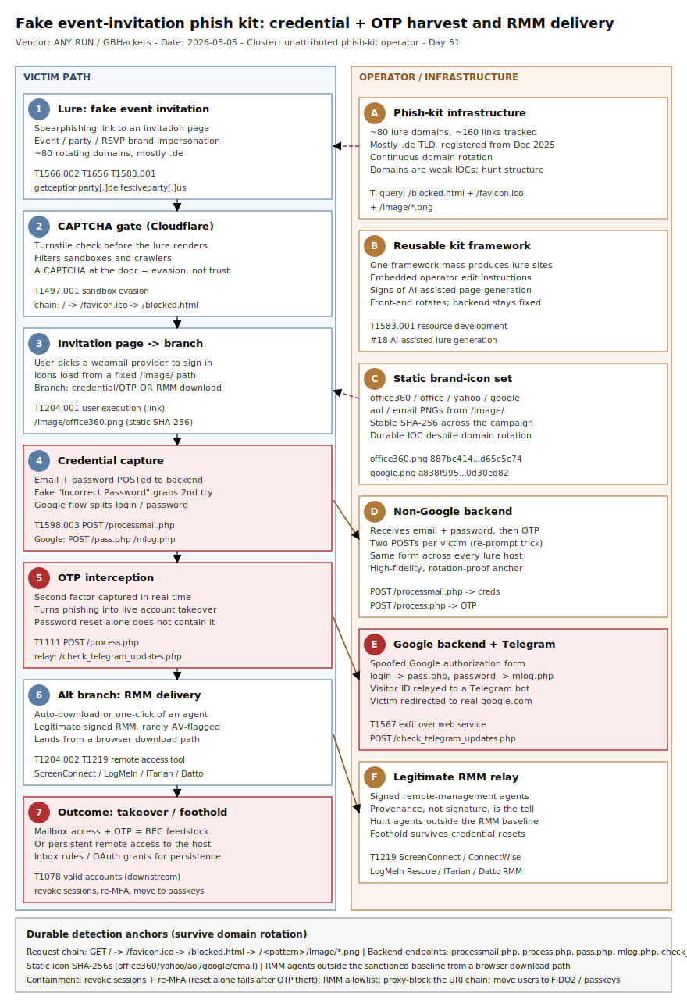

# Fake event-invitation phish kit: mass credential + OTP harvesting and RMM delivery against US organizations

## TL;DR

A high-volume, repeatable phishing kit is targeting US organizations with fake **event invitations** that branch into two outcomes from one CAPTCHA-gated lure: (a) real-time harvesting of webmail credentials **and** the follow-up OTP, and (b) silent delivery of legitimate **RMM** tools (ScreenConnect, ITarian, Datto RMM, ConnectWise, LogMeIn Rescue) as a remote-access foothold. ANY.RUN tracked roughly **80 domains** and **160 links** as of late April 2026 — most registered under the **.de** TLD since December 2025 — and the operator framework shows reusable code with edit instructions and signs of AI-assisted page generation. The most-hit sectors are education, banking, government, technology and healthcare. We file this under **#27 BEC / email fraud** because the product of the operation is mailbox access and OTP at scale — exactly the raw material for downstream business-email-compromise and account takeover. The durable detection anchors are not the rotating domains but the **fixed URI request chain** (`/favicon.ico` -> `/blocked.html` -> `/Image/*.png`), the static **icon SHA-256s**, the backend endpoints (`/processmail.php`, `/process.php`, `/pass.php`, `/mlog.php`, `/check_telegram_updates.php`), and unsanctioned RMM agents landing from a browser download.

## Attribution and confidence

| Dimension | Assessment | Confidence |
|---|---|---|
| Cluster identity | Unattributed phish-kit operator tracked by ANY.RUN; no named e-crime group | low |
| Mechanics (kit structure, flows, endpoints, IOCs) | Directly observed in ANY.RUN sandbox sessions and republished by GBHackers | high |
| Victimology (US, multi-sector) | ANY.RUN TI submission geography + sector telemetry | medium |
| AI-assisted page generation | ANY.RUN notes "some page elements suggest possible AI-assisted generation" — soft signal | low |

This is a **commodity phishing-kit** campaign, not a named-actor intrusion. There is no public attribution to a tracked group, and the `.de` registration bias is an infrastructure tell, not a nationality claim. Confidence is **high on the kit mechanics and IOCs** (every endpoint, icon hash and request chain was captured live in the sandbox) and **low on operator identity**.

**Overlap / genealogy with prior repo cases.**

| Prior case | Relationship | Distinction |
|---|---|---|
| `2026-05-08_CloudZ-RAT-Pheno-PhoneLink` | Both abuse a **fake ScreenConnect** angle and steal **OTP** | CloudZ is a malware RAT delivered by a fake ScreenConnect *installer*; here ScreenConnect/LogMeIn are **genuine signed RMM agents** delivered by a phishing page, and OTP is harvested by an **AiTM-style web form**, not by reading a local SQLite DB |
| `2026-06-10_Kali365-K365-OAuth-DeviceCode-PhaaS` | Both are identity/credential PhaaS | Kali365 abuses the **OAuth device-code** flow; this kit is classic **credential + OTP form interception** plus RMM delivery, no OAuth grant |
| `2026-05-06_CodeOfConduct-AiTM-Storm-1747` | Both end in session/credential compromise | CodeOfConduct is a multi-stage AiTM token-relay run by a tracked actor (Storm-1747); this is an unattributed mass kit with a fixed backend |

This is the **first repo primary in slot #27 (BEC / email fraud)**.

## Kill chain — summary table

| Stage | MITRE | Detail |
|---|---|---|
| Acquire infrastructure | T1583.001 | ~80 lure domains, mostly `.de`, registered from Dec 2025; rotated continuously |
| Phishing (delivery) | T1566.002 | Spearphishing **link** to a fake event-invitation page |
| Impersonation | T1656 | Event/invitation and webmail brand impersonation (Office, Yahoo, Google, AOL) |
| Sandbox evasion | T1497.001 | Cloudflare CAPTCHA / Turnstile gate filters automated analysis before the lure renders |
| User execution (link) | T1204.001 | Victim opens the invitation and chooses a webmail provider to "sign in" |
| Phishing for information | T1598.003 | Non-Google flow captures email + password via `POST /processmail.php` |
| MFA interception | T1111 | OTP captured via `POST /process.php` (and Telegram relay in the Google flow) |
| User execution (file) | T1204.002 | RMM branch auto-downloads / one-click runs a legitimate remote-support agent |
| Remote access software | T1219 | ScreenConnect / ITarian / Datto RMM / ConnectWise / LogMeIn Rescue foothold |
| Exfiltration over web service | T1567 | Google flow relays stolen credentials to a **Telegram** bot |
| Valid accounts (downstream) | T1078 | Harvested mailbox + OTP enable account takeover and BEC |



The diagram uses two lanes: the **victim path** (left) runs from the invitation email through the CAPTCHA gate to the branch point, then either credential+OTP capture or RMM install; the **operator/infrastructure** lane (right) shows the reusable kit, the static icon set, the two PHP backends, the Telegram relay and the legitimate-RMM relay. The red badges mark the two irreversible-loss stages — OTP interception and RMM foothold — which are the highest-value detection anchors because both survive the constant domain rotation.

## Stage-by-stage detail

### Infrastructure and delivery (T1583.001, T1566.002, T1656)

The operator mass-produces event-themed lure sites from a single reusable framework. ANY.RUN counted roughly **80 phishing domains** and **160 links** as of 2026-04-27, most under the **`.de`** TLD and registered starting December 2025, with names built from event/party/invitation keywords. Observed examples:

```
festiveparty[.]us
getceptionparty[.]de
celebratieinvitiee[.]de
```

Delivery is by **link** (T1566.002) inside a message that impersonates an event invitation (T1656). Because the domains rotate continuously, they are weak IOCs; the durable anchors are the kit's fixed structure described below.

### CAPTCHA gate and the fixed request chain (T1497.001)

When the link is opened, the kit first presents a **CAPTCHA** check — most often **Cloudflare** (Turnstile) — which filters sandboxes and automated crawlers before the lure renders (T1497.001 sandbox evasion). Every lure host then issues the **same request chain**, which is the single highest-fidelity network signature in this campaign:

```
GET /
  +- GET /favicon.ico
  +- GET /blocked.html
  +- GET /<url-pattern>/Image/*.png
```

`<url-pattern>` is unique per domain but follows the same event-keyword naming logic. The service icons always load from a fixed `/Image/` directory and are **static kit assets** with stable SHA-256 hashes:

```
office360.png  887bc414bdb32b83dcfccdd3c688e90d9a87a0033e3756a840f9bdd2d65c5c74
office.png     6eaa0a448f1306bcf4159783eeafe5d37243bd8ca2728db7d90de1929241dd29
yahoo.png      4c373bc25cb71dbb75e73b61dff25aa184be8d327053a97202a6b1a5919cab0d
google.png     a838f99537d35e48e479a34086297f76db5d3363b0456f23d10d308f0d30ed82
aol.png        8e94c18bbcad0644c4b04de4356fe37da9996fdf1c99bc984ba819862a9b1889
email.png      9a53e032a6e3e79861d28568c3b6ffc97f4f3c1d3af65a703ec12966420503d9
```

### Non-Google credential + OTP interception (T1598.003, T1111)

If the victim selects any provider other than Google, the kit shows a webmail login window. After the **first** password entry it always displays a fake **"Incorrect Password"** error to capture a clean second attempt. Credentials go out as a POST, then an OTP form appears and the code is captured as a second POST:

```
POST /<url-pattern>/processmail.php   -> email + password
POST /<url-pattern>/process.php       -> OTP code
```

The OTP capture (T1111) is what makes this more than ordinary credential phishing: the operator is set up to use the credential **and** the second factor in real time.

### Google credential interception + Telegram relay (T1598.003, T1567)

The Gmail path uses a spoofed Google authorization form and splits login and password across two endpoints, then relays via a Telegram-bot backend:

```
POST /<url-pattern>/pass.php                    -> login / email
POST /<url-pattern>/mlog.php                    -> password
POST /<url-pattern>/check_telegram_updates.php  -> visitor ID; backend pushes to a Telegram bot
```

The victim is finally redirected to the legitimate `google.com` to reduce suspicion. The Telegram relay (T1567 exfiltration over a web service) is a durable behavioural anchor — `check_telegram_updates.php` is specific to this kit.

### RMM-delivery branch (T1204.002, T1219)

On other lure pages the same entry point leads not to a credential form but to a **download**. The page may show a single button or skip it entirely and auto-start the download. The payloads are **legitimate, signed** remote-management agents:

```
ScreenConnect (ConnectWise Control)
ITarian
Datto RMM
ConnectWise
LogMeIn Rescue
```

Because these are widely used, sanctioned tools, their execution rarely trips AV/EDR, which extends dwell time. The detection pivot is **baseline deviation**: an RMM agent that is not part of the organization's approved remote-support stack, landing from a browser download path, is the foothold (T1219).

## Detection strategy

### Telemetry that matters

- **Web proxy / DNS / `DeviceNetworkEvents`** — the fixed URI chain (`/blocked.html`, `/favicon.ico`, `/Image/*.png`) and the backend endpoints (`/processmail.php`, `/process.php`, `/pass.php`, `/mlog.php`, `/check_telegram_updates.php`). This is the strongest signal and it survives domain rotation.
- **`DeviceProcessEvents` (Sysmon EID 1)** — execution of RMM agents (ScreenConnect, LogMeIn Rescue, ITarian, Datto, ConnectWise) from `\Downloads\` / `\AppData\Local\Temp\`, especially with a browser parent.
- **`DeviceFileEvents` (Sysmon EID 11)** — RMM installer/applet written into a user-writable path.
- **`EmailEvents` / `EmailUrlInfo` / `UrlClickEvents`** — inbound invitation lures and clicks to `.de` event-themed hosts.
- **`SigninLogs` / `IdentityLogonEvents`** — post-harvest sign-in anomalies (new ASN/geo) and inbox-rule creation on accounts that touched a lure.

### Detection coverage

| Engine | File | Logic |
|---|---|---|
| Suricata | [`suricata/fake_invitation_phishkit.rules`](./suricata/fake_invitation_phishkit.rules) | POST to `/processmail.php`, `/process.php`, `/pass.php`, `/mlog.php`; `check_telegram_updates.php` beacon; `/blocked.html` + `/Image/office360.png` kit fingerprint; SNI/Host for the three known lure domains |
| Sigma | [`sigma/rmm_screenconnect_unattended_from_userpath.yml`](./sigma/rmm_screenconnect_unattended_from_userpath.yml) | ScreenConnect/ConnectWise Control client executing from a user/temp path with embedded relay parameters |
| Sigma | [`sigma/rmm_remote_support_applet_from_browser.yml`](./sigma/rmm_remote_support_applet_from_browser.yml) | LogMeIn Rescue / ITarian / Datto / generic remote-support applet spawned by a browser from `\Downloads\` or `\Temp\` |
| Sigma | [`sigma/dns_fake_invitation_phish_domains.yml`](./sigma/dns_fake_invitation_phish_domains.yml) | DNS queries to the known lure domains (push newly-registered `.de` invitation hosts to SIEM aggregation) |
| KQL | [`kql/rmm_foothold_user_path_execution.kql`](./kql/rmm_foothold_user_path_execution.kql) | RMM agent execution from a user-writable path (foothold) |
| KQL | [`kql/phishkit_uri_signature_network.kql`](./kql/phishkit_uri_signature_network.kql) | Kit URI signature in `RemoteUrl` (backend endpoints + `/blocked.html` + `/Image/office360.png`) |
| KQL | [`kql/phishkit_lure_domain_contact.kql`](./kql/phishkit_lure_domain_contact.kql) | Device contact with the known lure domains |
| KQL | [`kql/invitation_lure_email.kql`](./kql/invitation_lure_email.kql) | Inbound event-invitation lure emails with links to `.de` hosts |

No SPL is shipped (retired repo-wide 2026-05-11); convert any Sigma with `sigma convert -t splunk -p sysmon <rule>.yml` if needed.

### Threat hunting hypotheses

- **H1** — If the kit reached our users, web telemetry contains the fixed URI chain and backend endpoints. See [`hunts/peak_h1_phishkit_uri_signature.md`](./hunts/peak_h1_phishkit_uri_signature.md).
- **H2** — If the RMM branch succeeded, an RMM agent outside our sanctioned baseline is installed and beaconing. See [`hunts/peak_h2_unauthorized_rmm_agent.md`](./hunts/peak_h2_unauthorized_rmm_agent.md).
- **H3** — If credentials/OTP were harvested, a recently-lured account shows sign-in anomalies, new inbox rules, or the Telegram-relay beacon. See [`hunts/peak_h3_account_takeover_telegram_exfil.md`](./hunts/peak_h3_account_takeover_telegram_exfil.md).

## Incident response playbook

### First 60 minutes (triage)

1. Pull the list of users who clicked a lure (`UrlClickEvents` / proxy logs matching the URI chain or the three known domains) over the last 30 days.
2. For each, determine which flow they hit: credential/OTP (POSTs to `processmail.php`/`process.php`/`pass.php`/`mlog.php`) or RMM download.
3. For credential/OTP victims: force a password reset, **revoke all sessions/refresh tokens**, and re-register MFA. A reset alone does not help if the live session was already hijacked.
4. For RMM victims: locate and isolate the host; identify the RMM agent and its relay/instance.
5. Check each affected mailbox for **new inbox/forwarding rules** and OAuth grants created after the click.
6. Block the three known domains and the kit URI patterns at the proxy; submit the live domain list from the ANY.RUN TI query.

### Artifacts to collect

| Artifact | Path | Tool | Why |
|---|---|---|---|
| Web proxy / DNS logs | SIEM / proxy | KQL / Splunk | Confirm the URI chain and which backend endpoint received POSTs |
| RMM agent + config | `%ProgramFiles%`, `%ProgramData%`, `\Downloads\` | EDR / triage | Identify the tool, relay URL and instance/ID |
| Process + parent | `DeviceProcessEvents` | Defender XDR | Tie the RMM exec to a browser download |
| Mailbox rules / OAuth grants | M365 audit | `Get-InboxRule`, audit log | Detect post-takeover persistence |
| Sign-in logs | `SigninLogs` / `IdentityLogonEvents` | Sentinel / XDR | New ASN/geo sign-in after the click |

### IR queries and commands

```powershell
# Enumerate inbox/forwarding rules for an affected mailbox (post-takeover persistence)
Get-InboxRule -Mailbox user@corp.example | Select-Object Name,Enabled,ForwardTo,RedirectTo,DeleteMessage,MoveToFolder

# Revoke all sessions / refresh tokens for a compromised user (forces re-auth)
Revoke-MgUserSignInSession -UserId user@corp.example
```

```bash
# On a suspected RMM-foothold host: list ScreenConnect/LogMeIn/ITarian/Datto agents and their relays
ps -ef | grep -iE 'screenconnect|connectwise|logmein|lmi_rescue|itsm|datto|aemagent' | grep -v grep
```

```kql
// Defender XDR: confirm the kit URI signature reached an endpoint
DeviceNetworkEvents
| where Timestamp > ago(30d)
| where RemoteUrl has_any ("/processmail.php","/process.php","/pass.php","/mlog.php","/check_telegram_updates.php","/blocked.html")
| project Timestamp, DeviceName, InitiatingProcessFileName, RemoteUrl, RemoteIP
```

### Containment, eradication, recovery

- **Containment:** isolate RMM-foothold hosts; revoke sessions and rotate credentials for credential/OTP victims; block kit URI patterns and known domains at the proxy.
- **Eradication:** uninstall the unsanctioned RMM agent and remove its service/scheduled task; remove malicious inbox rules and unexpected OAuth grants; reset and re-MFA affected accounts.
- **Exit criteria:** no further connections to lure domains or kit endpoints; no unsanctioned RMM agent present; affected accounts have new credentials, fresh MFA and no rogue rules/grants.
- **What NOT to do:** do **not** treat a password reset as sufficient for a credential/OTP victim — without session/token revocation the hijacked session persists. Do **not** assume a "signed, legitimate" RMM agent is benign because it is whitelisted; provenance (who installed it, from where) is the question, not the signature.

### Recovery validation

Confirm: affected accounts show no anomalous sign-ins for 7 days; no inbox-forwarding rules or unexpected OAuth grants remain; sanctioned RMM baseline is restored and no out-of-baseline agent reappears; proxy continues to block the kit URI chain.

## IOCs

| Type | Value | Context | Confidence | Source |
|---|---|---|---|---|
| sha256 | 887bc414bdb32b83dcfccdd3c688e90d9a87a0033e3756a840f9bdd2d65c5c74 | `office360.png` kit icon | high | ANY.RUN |
| sha256 | 6eaa0a448f1306bcf4159783eeafe5d37243bd8ca2728db7d90de1929241dd29 | `office.png` kit icon | high | ANY.RUN |
| sha256 | 4c373bc25cb71dbb75e73b61dff25aa184be8d327053a97202a6b1a5919cab0d | `yahoo.png` kit icon | high | ANY.RUN |
| sha256 | a838f99537d35e48e479a34086297f76db5d3363b0456f23d10d308f0d30ed82 | `google.png` kit icon | high | ANY.RUN |
| sha256 | 8e94c18bbcad0644c4b04de4356fe37da9996fdf1c99bc984ba819862a9b1889 | `aol.png` kit icon | high | ANY.RUN |
| sha256 | 9a53e032a6e3e79861d28568c3b6ffc97f4f3c1d3af65a703ec12966420503d9 | `email.png` kit icon | high | ANY.RUN |
| domain | festiveparty[.]us | Lure host | medium | ANY.RUN |
| domain | getceptionparty[.]de | Lure host (.de) | medium | ANY.RUN |
| domain | celebratieinvitiee[.]de | Lure host (.de) | medium | ANY.RUN |
| path | /blocked.html | Kit fingerprint in request chain | high | ANY.RUN |
| path | /<url-pattern>/processmail.php | Non-Google credential POST | high | ANY.RUN |
| path | /<url-pattern>/process.php | Non-Google OTP POST | high | ANY.RUN |
| path | /<url-pattern>/pass.php | Google login POST | high | ANY.RUN |
| path | /<url-pattern>/mlog.php | Google password POST | high | ANY.RUN |
| path | /<url-pattern>/check_telegram_updates.php | Telegram relay POST | high | ANY.RUN |

Full list (with notes on the request chain, CAPTCHA gate, RMM tools and TI hunt query) in [`iocs.csv`](./iocs.csv).

## Secondary findings

- **Phishing-to-RMM is an initial-access pattern, not just a payload choice (#4).** Delivering a legitimate, signed remote-management agent gives the operator (or a buyer) a durable foothold that AV/EDR rarely flags. The control is an **RMM allowlist** plus alerting on any remote-tool agent outside the sanctioned baseline — provenance over signature.
- **OTP interception turns credential phishing into account takeover (#5).** Capturing the second factor in real time (`/process.php`, plus the Telegram relay) is the difference between a stale-password nuisance and live mailbox compromise — and mailbox compromise is the feedstock for BEC. FIDO2 / passkeys remove the interceptable factor entirely.
- **Mass-produced kits with AI-assisted generation rotate the surface but freeze the backend (#18).** The operator can spin up new `.de` lure pages quickly, but the URI chain, the icon hashes and the PHP endpoints stay constant. Detection engineering should target the **fixed backend**, never the disposable front-end.

## Pedagogical anchors

- **Hunt the structure, not the domain.** Eighty rotating `.de` domains are nearly worthless as IOCs; the fixed request chain (`/favicon.ico` -> `/blocked.html` -> `/Image/*.png`) and the static icon SHA-256s are durable across the whole campaign.
- **A signed, sanctioned tool is still a foothold when you did not install it.** RMM agents are the perfect living-off-the-land delivery because their legitimacy is their evasion. Baseline your approved remote-support stack and alert on everything else.
- **Password reset != containment when OTP was intercepted.** If the second factor was captured in real time, the live session is already the attacker's; revoke sessions/tokens and re-register MFA, then move to passkeys.
- **The "Incorrect Password" re-prompt is a tell.** A login page that always rejects the first attempt is harvesting a clean second entry, not validating your password.
- **CAPTCHA at the front door is evasion, not assurance.** A Cloudflare/Turnstile gate on a lure exists to keep sandboxes and crawlers out; treat a CAPTCHA in front of a credential form as suspicious, not reassuring.

## What's in this folder

| File | Purpose |
|---|---|
| [`README.md`](./README.md) | This write-up (15 sections) |
| [`kill_chain.svg`](./kill_chain.svg) | Two-lane kill-chain diagram (victim path vs operator/infra) |
| [`iocs.csv`](./iocs.csv) | Full IOC list: icon hashes, lure domains, URI endpoints, behavioural notes |
| [`sigma/rmm_screenconnect_unattended_from_userpath.yml`](./sigma/rmm_screenconnect_unattended_from_userpath.yml) | ScreenConnect/ConnectWise unattended client from a user/temp path |
| [`sigma/rmm_remote_support_applet_from_browser.yml`](./sigma/rmm_remote_support_applet_from_browser.yml) | LogMeIn/ITarian/Datto remote-support applet spawned by a browser |
| [`sigma/dns_fake_invitation_phish_domains.yml`](./sigma/dns_fake_invitation_phish_domains.yml) | DNS queries to known lure domains |
| [`kql/rmm_foothold_user_path_execution.kql`](./kql/rmm_foothold_user_path_execution.kql) | RMM agent execution from a user-writable path |
| [`kql/phishkit_uri_signature_network.kql`](./kql/phishkit_uri_signature_network.kql) | Kit URI signature in network telemetry |
| [`kql/phishkit_lure_domain_contact.kql`](./kql/phishkit_lure_domain_contact.kql) | Device contact with known lure domains |
| [`kql/invitation_lure_email.kql`](./kql/invitation_lure_email.kql) | Inbound event-invitation lure emails |
| [`yara/fake_invitation_phishkit.yar`](./yara/fake_invitation_phishkit.yar) | Heuristics matching saved kit pages (non-Google flow, Google flow, icon set) |
| [`suricata/fake_invitation_phishkit.rules`](./suricata/fake_invitation_phishkit.rules) | HTTP/TLS rules for the kit endpoints, fingerprint and domains |
| [`hunts/peak_h1_phishkit_uri_signature.md`](./hunts/peak_h1_phishkit_uri_signature.md) | PEAK hunt: kit URI signature across the estate |
| [`hunts/peak_h2_unauthorized_rmm_agent.md`](./hunts/peak_h2_unauthorized_rmm_agent.md) | PEAK hunt: RMM agents outside the sanctioned baseline |
| [`hunts/peak_h3_account_takeover_telegram_exfil.md`](./hunts/peak_h3_account_takeover_telegram_exfil.md) | PEAK hunt: post-harvest account takeover + Telegram relay |

## Sources

- [ANY.RUN — New Phishing Campaign Targets US with Credential Theft: What CISOs Need to Know (2026-05-05)](https://any.run/cybersecurity-blog/us-fake-invitation-phishing/)
- [GBHackers — Fake Invitation Phishing Campaign Steals Credentials From U.S. Organizations (2026-05-21)](https://gbhackers.com/fake-invitation-phishing-campaign/)
- [Cyber Security News — Fake Invitation Phishing Campaign Targets U.S. Organizations With Credential Theft](https://cybersecuritynews.com/fake-invitation-phishing-campaign/)
- [MITRE ATT&CK — T1219 Remote Access Software](https://attack.mitre.org/techniques/T1219/)
- [MITRE ATT&CK — T1111 Multi-Factor Authentication Interception](https://attack.mitre.org/techniques/T1111/)
- [MITRE ATT&CK — T1566.002 Phishing: Spearphishing Link](https://attack.mitre.org/techniques/T1566/002/)
- [MITRE ATT&CK — T1497.001 Virtualization/Sandbox Evasion: System Checks](https://attack.mitre.org/techniques/T1497/001/)
