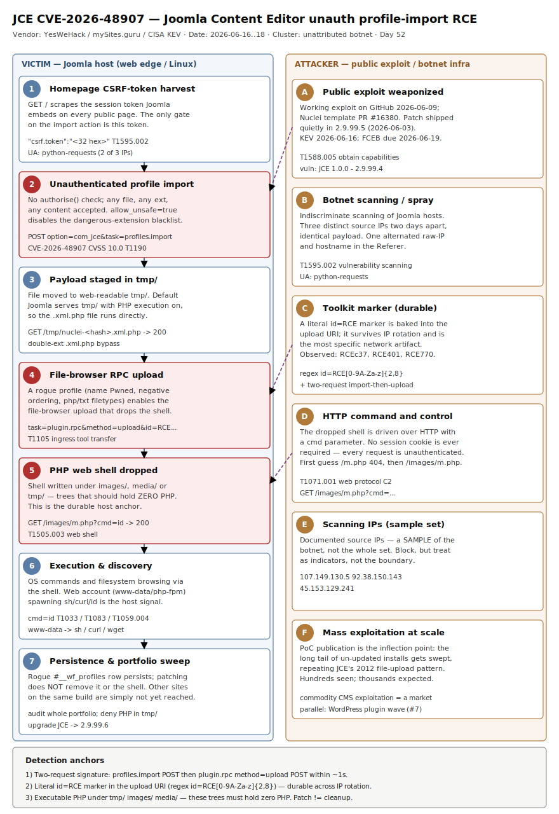

# JCE CVE-2026-48907 — unauthenticated pre-auth RCE in the Joomla Content Editor via the profile-import endpoint, now sprayed by a botnet

## TL;DR

**CVE-2026-48907** (CVSS v4 **10.0**, improper access control) is a pre-auth remote code execution flaw in **JCE (Joomla Content Editor)** by Widget Factory, the single most installed Joomla editor extension. The profile-import endpoint `/index.php?option=com_jce&task=profiles.import` is reachable by an unauthenticated caller (its only gate was a CSRF token that Joomla embeds in every public page), accepts a file with **any extension and any content**, and moves it into Joomla's web-readable `tmp/` directory with `File::upload(..., $allow_unsafe = true)`. An attacker drops a `*.xml.php` web shell and triggers it over HTTP — three requests, no credentials. YesWeHack published the root-cause analysis and a PoC on 2026-06-12; working exploit code hit GitHub on **2026-06-09**, and CISA added the bug to **KEV on 2026-06-16** (FCEB remediation due **2026-06-19**). Defenders (mySites.guru) are now seeing automated, botnet-driven exploitation in the wild: a `profiles.import` POST immediately followed by a `plugin.rpc&...&method=upload` POST that drops a shell (e.g. `m.php`) into `images/`, `media/` or `tmp/`. This is the JCE 2012 mass-exploitation pattern repeating at scale. The flaw is fixed in **2.9.99.5** (2026-06-03) and fully hardened in **2.9.99.6** (2026-06-06).

## Attribution and confidence

- **Cluster:** unattributed. This is commodity, internet-wide CMS exploitation — automated scanners and opportunistic operators running a published exploit, not a named actor. Confidence on **"who"**: **low** (no actor; a botnet sprays it). Confidence on the **vulnerability, exploit chain and active exploitation**: **high** (triangulated across YesWeHack root-cause + PoC, CISA KEV, BleepingComputer, SecurityWeek, SC Media, and mySites.guru live-incident telemetry).
- **Discovery / timeline:** patch quietly shipped in JCE **2.9.99.5** on 2026-06-03 ("insufficient access controls permitted unauthenticated users to upload editor profiles", per Widget Factory release notes); public exploit on GitHub **2026-06-09**; YesWeHack patch-diff + PoC **2026-06-12**; CISA KEV **2026-06-16**; FCEB due **2026-06-19**.
- **Why today:** CVE is on KEV as of two days ago, exploit code is public, and the attacks are **automated and indiscriminate** — a Joomla site with no public registration is not safe. This is the live mass-exploitation window.

| Overlap candidate | Verdict | Basis |
|---|---|---|
| Single targeted actor | rejected | three distinct source IPs two days apart, identical payload + literal `id=RCE…` toolkit marker = botnet spray, not targeting |
| Same operator as Kirki WP wave (2026-06-04 repo case) | unproven, parallel | both are commodity CMS auth-bypass-to-web-shell waves in the same fortnight; no shared infra evidence; different CMS and different bug class |
| Nation-state | rejected | no espionage tooling, no selective victimology, pure opportunistic RCE-for-foothold |

**Genealogy with previous repo cases.** Extends the repo's commodity-CMS-exploitation thread from `2026-06-04_Kirki-CVE-2026-8206-WP-AccountTakeover` (#26, WordPress logic-flaw account takeover → web shell). Same end state — unauthenticated request → PHP web shell — but here the primitive is a **file-upload + unsafe-extension chain** on Joomla, not a password-reset logic flaw on WordPress. Echoes the "web-readable upload directory" anchor from that case and the "PoC publication accelerates mass exploitation" tradecraft seen across the repo.

## Kill chain — summary table

| Stage | MITRE | Detail |
|---|---|---|
| Reconnaissance / scanning | T1595.002 | Botnet sprays Joomla hosts; `python-requests` UA on 2 of 3 observed IPs |
| Resource development | T1588.005 | Operators use a public exploit (GitHub, 2026-06-09) + Nuclei template (PR #16380) |
| Token harvest | — | `GET /` to scrape `csrf.token` from the homepage HTML/JS |
| Initial access / RCE | T1190 | `POST …com_jce&task=profiles.import` with a `*.xml.php` upload → staged in web-readable `tmp/` |
| Tool transfer | T1105 | `POST …com_jce&task=plugin.rpc&plugin=browser&method=upload&id=RCE…&name=m.php` drops the shell via the file-browser plugin |
| Persistence (web shell) | T1505.003 | PHP web shell under `images/` / `media/` / `tmp/`; `GET /images/m.php?cmd=…` |
| Execution / discovery | T1059.004, T1033, T1083 | `cmd=id` and filesystem browsing through the shell |
| C2 | T1071.001 | Command-and-control over HTTP through the dropped shell |



The diagram uses two lanes: the **victim Joomla host** (left) — homepage token, `profiles.import`, the staged file in `tmp/`, the dropped shell under `images/`/`media/` — and the **attacker / botnet infrastructure** (right) — public PoC, scanning IPs, the `id=RCE…` toolkit marker, and HTTP C2. The durable detection anchors are the **two-request signature** (`profiles.import` POST followed within ~1s by a `plugin.rpc … method=upload` POST), the literal `id=RCE\d+` marker baked into the toolkit, and **any executable PHP under `tmp/`, `images/` or `media/`** — paths that should hold zero PHP.

## Stage-by-stage detail

### 1. Scanning and token harvest

The campaign is a botnet spraying a published exploit, not targeted intrusion. mySites.guru logged three distinct source IPs two days apart hitting the same site with the identical payload; two sent a `python-requests` user agent, one arrived as a browser, and one alternated between hitting the host by raw IP and by hostname (so requests carried both a bare-IP and a hostname `Referer`).

Every run starts by harvesting the CSRF token, which Joomla exposes on every public page:

```text
GET /
  ← extract csrf.token from:  "csrf.token":"<32 hex>"   or   <input name="<32 hex>" value="1">
```

The CSRF check is the *only* gate the vulnerable code applied; harvesting the token yourself defeats it entirely. **MITRE T1595.002 (Active Scanning: Vulnerability Scanning)**, **T1588.005 (Obtain Capabilities: Exploits)**.

### 2. Unauthenticated profile import → file staged in web-readable tmp/

The import endpoint reaches the upload handler with no `Factory::getUser()` and no `$user->authorise('core.manage', 'com_jce')` check. The chain is three independent weaknesses, all required:

1. **Missing authorization** — only `Session::checkToken()` guarded `JceControllerProfiles::import()`.
2. **No extension validation** — `File::makeSafe()` strips illegal filename characters but never restricts the extension; `evil.xml.php` passes untouched.
3. **`$allow_unsafe = true`** — `File::upload($source, $destination, false, true)` explicitly disabled Joomla's built-in dangerous-extension blacklist.

```http
POST /index.php?option=com_jce&task=profiles.import HTTP/1.1
Content-Type: multipart/form-data; boundary=--b

--b
Content-Disposition: form-data; name="task"

profiles.import
--b
Content-Disposition: form-data; name="<csrf_token>"

1
--b
Content-Disposition: form-data; name="profile_file"; filename="nuclei-<hash>.xml.php"
Content-Type: application/xml

<?= 45*69 ?>
--b--
```

A default Joomla install (e.g. the official Docker image with no extra Apache hardening) serves files under `/tmp/` with **PHP execution enabled**, so the staged file is directly reachable:

```http
GET /tmp/nuclei-<hash>.xml.php   →   200   body: 3105        (45 × 69 → RCE confirmed)
```

**MITRE T1190 (Exploit Public-Facing Application)**.

### 3. Web-shell drop via the file-browser plugin

In live attacks the operator does not stop at the harmless PoC. After importing a **rogue editor profile** (observed name `Pwned`, forced to the top of the list with a large **negative `ordering`** value and configured to allow **php and txt** upload filetypes), it uses that profile's file-browser RPC to drop the shell:

```text
POST /index.php?option=com_jce&task=plugin.rpc&plugin=browser&method=upload&id=RCEc37&name=m.php …   200
```

The `id=RCE…` parameter (`RCEc37`, `RCE401`, `RCE770` across the observed IPs) is the attacker's **own literal toolkit marker**, baked into the exploit kit and durable across infrastructure. **MITRE T1105 (Ingress Tool Transfer)**, **T1505.003 (Server Software Component: Web Shell)**.

### 4. Execution, discovery and C2

The shell is confirmed and then driven over HTTP:

```text
GET /m.php?cmd=id            404   <- wrong path, first guess
GET /images/m.php?cmd=id     200   <- shell confirmed under images/
```

From there the operator runs OS commands (`id` → **T1033 System Owner/User Discovery**), browses the filesystem (**T1083 File and Directory Discovery**), and tasks the shell over HTTP (**T1071.001**, **T1059.004 Unix Shell**). Web-shell drop locations observed across incidents: `images/`, `media/` and `tmp/`.

## Detection strategy

### Telemetry that matters

- **Web server / reverse-proxy logs** (Apache, **nginx**, Caddy): the request URIs are the highest-fidelity source. Note mySites.guru recovered the chain from **nginx** logs after the site's Apache logging had been dead since 2024 — check the front-most proxy, not just the origin.
- **File integrity / EDR `DeviceFileEvents`**, auditd `CREATE`/`open` on the webroot: a new `.php` under `tmp/`, `images/` or `media/`.
- **`DeviceProcessEvents` / auditd execve**: the web service account (`www-data`, `apache`, `nginx`, `php-fpm`) spawning a shell or LOLBin.
- **`DeviceNetworkEvents`**: connections to/from the known scanning IPs; outbound from the web host after the shell lands.
- **Joomla DB** (`#__wf_profiles` table): a profile row with a machine-generated name, a large negative `ordering`, and upload filetypes that include `php`/`txt`.

### Detection coverage

| Engine | File | Logic |
|---|---|---|
| Sigma | `sigma/jce_profiles_import_unauth.yml` | webserver log: unauthenticated `POST` to `com_jce&task=profiles.import` |
| Sigma | `sigma/jce_pluginrpc_upload_rce_marker.yml` | webserver log: `com_jce&task=plugin.rpc … method=upload` carrying the `id=RCE` toolkit marker |
| Sigma | `sigma/jce_php_dropped_under_webroot.yml` | file_event: `.php`/`.phtml`/`.php5` written under Joomla `tmp/`, `images/` or `media/` |
| KQL | `kql/jce_php_dropped_webroot.kql` | `DeviceFileEvents`: executable PHP created under Joomla media/tmp paths |
| KQL | `kql/jce_webservice_shell_spawn.kql` | `DeviceProcessEvents`: web service account spawning shell/LOLBin |
| KQL | `kql/jce_host_beacon_attacker_ips.kql` | `DeviceNetworkEvents`: traffic to/from known scanning IPs |
| KQL | `kql/jce_import_chain_in_syslog.kql` | Sentinel `Syslog`: web access logs (forwarded) showing the `profiles.import` → `plugin.rpc` upload chain |
| YARA | `yara/jce_rce_webshell_and_profile.yar` | rogue JCE profile XML (php/txt filetypes), generic PHP web shell, and the `id=RCE` marker string (heuristics) |
| Suricata | `suricata/jce_cve_2026_48907.rules` | the two-request chain, the `id=RCE` marker, `*.xml.php` upload, shell access, scanner UA, and the known-IP block |

No `.spl` is shipped; convert any Sigma rule with `sigma convert -t splunk -p sysmon <rule>.yml` if needed.

### Threat hunting hypotheses

- **H1 — Unauthenticated profile import reached the endpoint.** Hunt web/proxy logs for `task=profiles.import` POSTs with no preceding authenticated admin session. See `hunts/peak_h1_profiles_import_unauth.md`.
- **H2 — Web shell dropped via the file-browser RPC chain.** Hunt for a `profiles.import` POST followed within ~1s by a `plugin.rpc … method=upload` POST, and for the `id=RCE\d+` marker. See `hunts/peak_h2_pluginrpc_upload_chain.md`.
- **H3 — Executable PHP foothold under media/tmp + web-account shell.** Hunt for `.php` under `tmp/`/`images/`/`media/` and for the web service account spawning a shell. See `hunts/peak_h3_webshell_foothold.md`.

## Incident response playbook

### First 60 minutes (triage)

1. **Confirm the JCE version.** Anything `1.0.0`–`2.9.99.4` is vulnerable. Patched = `2.9.99.5`; only-safe target = **`2.9.99.6`**.
2. **Grep the front-most web/proxy logs** (check nginx *and* Apache) for `option=com_jce&task=profiles.import` and `task=plugin.rpc&plugin=browser&method=upload`. A `200` on either is presumed compromise.
3. **Search for the toolkit marker** `id=RCE` (regex `id=RCE\d+`) in request URIs.
4. **Enumerate executable PHP** under `tmp/`, `images/`, `media/` — these should hold zero PHP.
5. **Inspect the `#__wf_profiles` table** for a rogue profile (machine-generated name, large negative `ordering`, php/txt filetypes).
6. **Block** the known scanning IPs (`107.149.130.5`, `92.38.150.143`, `45.153.129.241`) as a sample, not the whole set.

### Artifacts to collect

| Artifact | Path | Tool | Why |
|---|---|---|---|
| Web/proxy access logs | `/var/log/nginx/*`, `/var/log/apache2/*` | `grep`, log shipper | Captures the unauthenticated `profiles.import` → `plugin.rpc` chain and source IPs |
| Web shells | webroot `tmp/`, `images/`, `media/`, `*.xml.php` | `find`, YARA | The dropped PHP foothold |
| Rogue editor profile | DB `#__wf_profiles`; export XML | Joomla admin / SQL | The persistence object that enabled the upload |
| Staged PoC files | `tmp/*.xml.php` (e.g. `nuclei-*.xml.php`, `cve-2026-48907-*.xml.php`) | `find` | Evidence of the import primitive being exercised |
| Web service process tree | EDR / auditd | `DeviceProcessEvents`, `ausearch` | Shell spawned by `www-data`/`php-fpm` = code execution |

### IR queries and commands

```bash
# 1) Two-request attack signature in nginx access logs (check Apache too)
grep -E 'option=com_jce&task=profiles\.import' /var/log/nginx/access.log*
grep -E 'task=plugin\.rpc&plugin=browser&method=upload' /var/log/nginx/access.log*
grep -Eo 'id=RCE[0-9]+' /var/log/nginx/access.log*          # literal toolkit marker

# 2) Executable PHP where only media/temp should live (expect ZERO)
find /var/www/html/{tmp,images,media} -type f \
  \( -name '*.php' -o -name '*.phtml' -o -name '*.php5' -o -name '*.xml.php' \) \
  -printf '%TY-%Tm-%Td %p\n' 2>/dev/null | sort

# 3) Rogue JCE profile in the database (table prefix varies)
#    mysql -e "SELECT id,name,ordering FROM <prefix>_wf_profiles ORDER BY ordering ASC LIMIT 5;"
```

```kql
// Web service account spawning a shell after the drop (Defender XDR)
DeviceProcessEvents
| where Timestamp > datetime(2026-06-03)
| where InitiatingProcessFileName in~ ("apache2","httpd","nginx","php-fpm","php")
| where FileName in~ ("sh","bash","dash","curl","wget","python3","perl","nc","ncat","id")
| project Timestamp, DeviceName, InitiatingProcessFileName, FileName, ProcessCommandLine, InitiatingProcessAccountName
| order by Timestamp desc
```

### Containment, eradication, recovery

- **Exit criteria:** JCE upgraded to **2.9.99.6**; all rogue profiles removed from `#__wf_profiles`; every dropped web shell deleted from `tmp/`/`images/`/`media/`; web server configured to **deny PHP execution under `tmp/`** (and ideally `images/`/`media/`); a WAF rule filtering `com_jce&task=profiles.import` in place.
- **What NOT to do:** do **not** assume patching cleans the site — the update closes the entry point but leaves any shell, rogue profile or added admin in place. Do **not** trust a single-site finding; the same portfolio almost always has more sites on the same vulnerable build. Do **not** rely on "no public registration" as protection — the exploit is unauthenticated.

### Recovery validation

- Re-run the `find` sweep for PHP under `tmp/`/`images/`/`media/` → zero results.
- Re-query `#__wf_profiles` → no machine-named / negative-`ordering` / php-enabled profile.
- Confirm `GET /tmp/<anything>.php` returns non-executing content (text or 403), proving PHP execution is denied there.
- Confirm the installed JCE version reports `2.9.99.6`.
- Rotate any secrets reachable from the webroot (DB credentials in `configuration.php`, API keys) — they were exposed to the shell.

## IOCs

| Type | Value | Context | Confidence | Source |
|---|---|---|---|---|
| cve | CVE-2026-48907 | JCE pre-auth RCE via profile import; CVSS v4 10.0, improper access control | high | NVD/CISA KEV |
| path | /index.php?option=com_jce&task=profiles.import | Unauthenticated profile-import endpoint (initial access) | high | YesWeHack / mySites.guru |
| path | /index.php?option=com_jce&task=plugin.rpc&plugin=browser&method=upload | File-browser RPC used to drop the shell through the rogue profile | high | mySites.guru |
| string | id=RCE | Literal toolkit marker in the upload URI (regex id=RCE\d+: RCEc37, RCE401, RCE770) | high | mySites.guru |
| string | .xml.php | Double-extension upload that bypasses extension checks and executes under mod_php | high | YesWeHack |
| string | m.php | Web-shell filename observed in live attacks | high | mySites.guru |
| path | /images/m.php | Confirmed working web-shell path (GET …?cmd=id → 200) | high | mySites.guru |
| string | Pwned | Rogue editor-profile name observed in the wild | medium | mySites.guru |
| ipv4 | 107.149.130.5 | Scanning/exploitation source IP (sample) | medium | mySites.guru |
| ipv4 | 92.38.150.143 | Scanning/exploitation source IP; alternated raw-IP and hostname Referer | medium | mySites.guru |
| ipv4 | 45.153.129.241 | Scanning/exploitation source IP (sample) | medium | mySites.guru |
| string | python-requests | User agent on 2 of 3 observed attacker IPs | low | mySites.guru |
| note | JCE 1.0.0–2.9.99.4 vulnerable; fixed 2.9.99.5 (2026-06-03), hardened 2.9.99.6 (2026-06-06) | Version triage anchor | high | Widget Factory / THN |
| note | Public exploit on GitHub 2026-06-09; Nuclei template PR #16380; KEV 2026-06-16; FCEB due 2026-06-19 | Weaponization/exposure timeline | high | mySites.guru / CISA |

Full list in `iocs.csv`.

## Secondary findings

- **Parallel WordPress plugin supply-chain wave (#7).** In the same week, Sansec detailed a supply-chain campaign that hit 1M+ sites running **OptinMonster, TrustPulse and PushEngage**: malicious JavaScript that waits for a logged-in admin, silently creates a backdoor admin account, and installs a self-hiding backdoor plugin. Separately, Sucuri found a fake plugin ("Beloved PBN Entegrasyonu") staging **dual PHP web shells inside `wp_posts` database records** for fileless, authenticationless server control (Turkish-speaking actor, SEO/PBN monetization). Same fortnight, same end state (web shell), different ecosystem — CMS exploitation is a market, not a one-off.
- **LiteSpeed cPanel plugin symlink-to-root, also new on KEV (#15-adjacent).** **CVE-2026-54420** is a UNIX symlink-following flaw in LiteSpeed's user-end cPanel plugin (all versions before 2.4.8, released 2026-06-01): a user with FTP or web-shell access on a shared CloudLinux/CageFS host can escalate to **root**, exploited in the wild since May. On shared hosting it chains naturally after a JCE web shell — one tenant compromise becomes whole-server compromise.
- **PoC publication is the inflection point (#24 tradecraft).** Every pre-public hit came from a "private toolkit"; once exploit code landed on GitHub on 2026-06-09 the long tail of un-updated installs began getting swept, exactly as JCE's 2012 file-upload mass-exploitation played out. The durable artifact is not the rotating source IPs but the **`id=RCE\d+` marker** baked into the kit and the fixed two-request URI chain.

## Pedagogical anchors

- **Three small weaknesses, one critical bug.** Missing authorization, no extension check, and `$allow_unsafe = true` were each survivable alone; together they are a CVSS-10 pre-auth RCE. Defense-in-depth is not redundancy theatre — removing *any one* layer (the `.xml` whitelist, the blacklist, the auth gate) would have broken the chain.
- **A CSRF token is not authorization.** The token proves the request came from a page that rendered it; it says nothing about *who* the caller is. Public-page tokens are trivially harvested. Authorization must be an explicit `authorise()` check, never an implicit side effect of CSRF.
- **Web-writable directories must never execute code.** The exploit only worked because `tmp/` (and `images/`/`media/`) served PHP. Denying script execution in upload/temp paths at the web-server layer neutralises this and the next file-upload bug alike — hunt for PHP where only media should live.
- **Patching is not incident response.** Upgrading JCE closes the door but leaves the shell, the rogue profile and any added admin behind. A KEV deadline is a patch deadline, not a "you're clean" certificate.
- **One vulnerable site means audit the whole portfolio.** Commodity exploitation is indiscriminate; the other sites on the same build are simply ones the scanner has not reached yet.

## What's in this folder

| File | Purpose |
|---|---|
| [README.md](./README.md) | This analysis (15 sections). |
| [kill_chain.svg](./kill_chain.svg) | Two-lane kill chain: victim Joomla host vs attacker/botnet infrastructure. |
| [sigma/jce_profiles_import_unauth.yml](./sigma/jce_profiles_import_unauth.yml) | Webserver-log Sigma: unauthenticated `profiles.import` POST. |
| [sigma/jce_pluginrpc_upload_rce_marker.yml](./sigma/jce_pluginrpc_upload_rce_marker.yml) | Webserver-log Sigma: `plugin.rpc` upload with the `id=RCE` marker. |
| [sigma/jce_php_dropped_under_webroot.yml](./sigma/jce_php_dropped_under_webroot.yml) | file_event Sigma: PHP written under `tmp/`/`images/`/`media/`. |
| [kql/jce_php_dropped_webroot.kql](./kql/jce_php_dropped_webroot.kql) | Defender XDR: executable PHP created under Joomla media/tmp. |
| [kql/jce_webservice_shell_spawn.kql](./kql/jce_webservice_shell_spawn.kql) | Defender XDR: web service account spawning shell/LOLBin. |
| [kql/jce_host_beacon_attacker_ips.kql](./kql/jce_host_beacon_attacker_ips.kql) | Defender XDR: traffic to/from known scanning IPs. |
| [kql/jce_import_chain_in_syslog.kql](./kql/jce_import_chain_in_syslog.kql) | Sentinel `Syslog`: forwarded web logs showing the import→upload chain. |
| [yara/jce_rce_webshell_and_profile.yar](./yara/jce_rce_webshell_and_profile.yar) | Rogue profile XML, generic PHP web shell, and `id=RCE` marker (heuristics). |
| [suricata/jce_cve_2026_48907.rules](./suricata/jce_cve_2026_48907.rules) | Network detections for the chain, marker, upload, shell access and IPs. |
| [hunts/peak_h1_profiles_import_unauth.md](./hunts/peak_h1_profiles_import_unauth.md) | PEAK hunt H1 — unauthenticated profile import. |
| [hunts/peak_h2_pluginrpc_upload_chain.md](./hunts/peak_h2_pluginrpc_upload_chain.md) | PEAK hunt H2 — file-browser RPC upload chain + marker. |
| [hunts/peak_h3_webshell_foothold.md](./hunts/peak_h3_webshell_foothold.md) | PEAK hunt H3 — PHP foothold + web-account shell. |
| [iocs.csv](./iocs.csv) | Machine-readable IOCs (`type,value,context,confidence,source`). |

## Sources

- [YesWeHack — Unauthenticated RCE in the Joomla Content Editor extension (CVE-2026-48907, root cause + PoC)](https://www.yeswehack.com/news/rce-joomla-content-editor-extension)
- [The Hacker News — CISA Warns of Actively Exploited Joomla JCE Flaw Allowing PHP Code Execution](https://thehackernews.com/2026/06/cisa-warns-of-actively-exploited-joomla.html)
- [mySites.guru — Find and Fix the JCE Profiles Hack (live access-log analysis + IOCs)](https://mysites.guru/blog/finding-every-site-running-a-vulnerable-jce/)
- [BleepingComputer — CISA orders feds to patch max severity Joomla plugin flaw by Friday](https://www.bleepingcomputer.com/news/security/cisa-orders-feds-to-patch-max-severity-joomla-plugin-flaw-by-friday/)
- [SecurityWeek — Joomla, LiteSpeed Vulnerabilities Exploited in Attacks](https://www.securityweek.com/joomla-litespeed-vulnerabilities-exploited-in-attacks/)
- [CISA — Known Exploited Vulnerabilities Catalog](https://www.cisa.gov/known-exploited-vulnerabilities-catalog)
- [NVD — CVE-2026-48907](https://nvd.nist.gov/vuln/detail/CVE-2026-48907)
- [SC Media — Max severity Joomla Content Editor extension flaw targeted in automated attacks](https://www.scworld.com/news/max-severity-joomla-content-editor-extension-flaw-targeted-in-automated-attacks)
