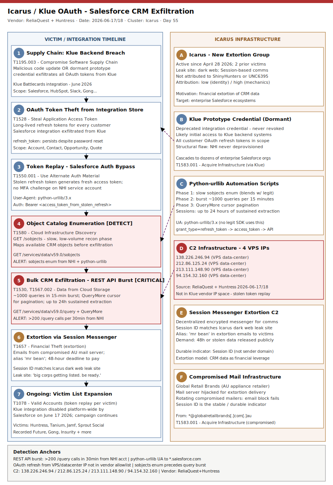

# Icarus SaaS Extortion via Klue OAuth: Salesforce CRM Data Theft Across Enterprise Clients

## TL;DR

A new extortion group tracking as "Icarus" (active since April 28, 2026) compromised the backend of Klue, a competitive-intelligence SaaS platform, and exfiltrated OAuth refresh tokens used by Klue's Battlecards integration with Salesforce. Attackers authenticated as legitimate Klue integration service accounts and ran automated Python scripts against Salesforce's REST API for up to 24 hours per victim, extracting CRM records including business contacts, price quotes, and competitive intelligence reports. Confirmed victims include Huntress, Recorded Future, Tanium, Jamf, Sprout Social, Gong, and Insurity; Salesforce disabled the Klue Battlecards integration platform-wide on June 17, 2026. Icarus is currently running an extortion campaign via Session Messenger (alias "mr bean"), threatening to publish data within 48 hours unless victims comply. The attack is the latest in a recurring wave of third-party SaaS integration OAuth-abuse campaigns that have struck Salesforce ecosystems since 2025.

## Attribution and confidence

**Cluster:** Icarus (extortion group, no prior attribution to known APT or named e-crime cluster).
**Aliases:** None established yet; "mr bean" is the extortion alias used in contact emails.
**Active since:** April 28, 2026, per Icarus data leak site self-declaration.
**Vendor discovery:** ReliaQuest Threat Spotlight (June 17, 2026); Huntress incident disclosure (June 18, 2026); BleepingComputer (June 18, 2026).
**Attribution confidence:** low (actor identity and infrastructure provenance); high (attack mechanics, IOCs, and victim confirmation).

| Dimension | Assessment |
|---|---|
| Actor | Icarus — new extortion group, launched April 2026, ≤2 victims pre-Klue |
| Motivation | Financial extortion; theft of proprietary CRM / competitive intelligence for leverage |
| TTP overlap with ShinyHunters | Partial: same target class (Salesforce via 3rd-party integration), same REST API query technique; different UA (ShinyHunters used python-requests / Salesforce-CLI; Icarus uses python-urllib) |
| TTP overlap with UNC6395 | Partial: UNC6395 abused Salesloft Drift OAuth tokens (August 2025) — same OAuth-abuse class; UNC6395 used Tor routing, Icarus uses VPS data-center IPs |
| Genealogy in this repo | #5 identity/cloud: `2026-05-06_CodeOfConduct-AiTM-Storm-1747`, `2026-05-20_Storm-2949-Cloud-Identity-SSPR`; #6 SaaS: `2026-05-27_BlackFile-UNC6671-CordialSpider-SaaS-Extortion` (M365/SharePoint, different actor); `2026-06-10_Kali365-K365-OAuth-DeviceCode-PhaaS` (device-code, different technique) |

The present Klue/Icarus case is structurally distinct from all prior repo entries: it is the first repo case targeting Salesforce CRM via a compromised third-party **integration platform** (not device-code phishing, not AiTM, not M365). This is also the **first primary for taxonomy slot #6 SaaS abuse** in the repository.

## Kill chain — summary table

| Stage | MITRE | Detail |
|---|---|---|
| Supply chain: Klue backend compromise | T1195.003 | Attacker compromises Klue backend; malicious code update or dormant prototype credential exfiltrates OAuth tokens from Klue's integration service accounts |
| Token theft | T1528 | OAuth refresh tokens stolen for every Klue customer Salesforce integration in scope |
| Valid account / token abuse | T1550.001 | Stolen tokens used to authenticate as the legitimate Klue integration service account to Salesforce APIs; no credential reset, no MFA challenge |
| Cloud infrastructure discovery | T1580 | `GET /services/data/v59.0/sobjects` maps available Salesforce object types — slow and low-volume to blend with legitimate integration traffic |
| CRM data exfiltration | T1530, T1567.002 | `GET /services/data/v59.0/query` SOQL queries + QueryMore cursor pagination; burst of ~1,000 queries in 15 minutes in at least one environment; 6-hour sustained extraction in another |
| Extortion | T1657 | Extortion emails sent from compromised Global Retail Brands (AU) mail server, Session Messenger ID for negotiations; 48-hour countdown to public leak |
| Victim list expansion | T1078 | Icarus leak site publishes "Get Ready — big corps getting listed"; campaign ongoing at time of writing |



The left lane shows the victim/integration timeline from supply chain entry through CRM extraction to extortion receipt. The right lane shows Icarus infrastructure: staging (Klue prototype credential), Python-urllib automation, four VPS C2 IPs, and the Session/extortion layer. Cross-lane arrows mark the token handoff (purple dashed) and the Salesforce REST API query burst (the primary detection anchor: ≥500 queries from NHI service account within a 30-minute window).

## Stage-by-stage detail

### Stage 1 — Supply chain: Klue backend compromise (T1195.003)

Klue confirmed to affected customers that attackers first compromised the company's backend systems and pushed a malicious code update that exfiltrated OAuth tokens customers use to integrate Klue's Battlecards product with third-party platforms. An alternative initial access path reported by multiple sources involves a dormant but still-active credential created by Klue for a prototype integration that was never formally deprovisioned.

```
# Klue integrations disabled as part of remediation (June 2026):
# Salesforce, HubSpot, SharePoint, Zoom, Gong, Chorus, Clari, Google Drive, Slack
# All connected via OAuth tokens stored in Klue backend
```

MITRE T1195.003 — Supply Chain Compromise: Compromise Software Supply Chain. The attacker did not need to phish any end-user organization; one backend compromise cascaded into dozens of enterprise Salesforce environments.

### Stage 2 — Token theft (T1528)

OAuth refresh tokens for every Klue Battlecards / Salesforce integration in scope were exfiltrated during the Klue backend compromise. These are long-lived tokens that survive password resets unless explicitly revoked.

```
# Token scope observed: Salesforce CRM read/query permissions
# Token type: OAuth 2.0 refresh token (long-lived; survives user password change)
# Klue integration scopes include: Account, Contact, Opportunity, Quote, Task objects
```

MITRE T1528 — Steal Application Access Token.

### Stage 3 — Valid account / token abuse (T1550.001)

The attacker used the stolen refresh tokens to generate fresh access tokens for each victim's Salesforce environment. No MFA was required because the integration service account was already authorized. The resulting requests were indistinguishable from legitimate Klue integration traffic at the authentication layer.

```
# Request fingerprint observed by ReliaQuest:
# User-Agent: python-urllib/3.x
# Source: 138.226.246.94 | 212.86.125.24 | 213.111.148.90 | 94.154.32.160
# Auth: Bearer <access_token_derived_from_stolen_refresh_token>
```

MITRE T1550.001 — Use Alternate Authentication Material: Application Access Token.

### Stage 4 — Cloud infrastructure discovery (T1580)

Before bulk extraction, the attacker performed a slow enumeration of available Salesforce object types. This phase blended into normal integration traffic due to low query volume.

```http
GET /services/data/v59.0/sobjects HTTP/1.1
Authorization: Bearer <stolen_access_token>
User-Agent: python-urllib/3.x
```

Response: full catalog of SObject types available to the integration scope, revealing which objects contained high-value CRM data (Account, Contact, Opportunity, Quote, etc.).

MITRE T1580 — Cloud Infrastructure Discovery.

### Stage 5 — CRM data exfiltration via REST API burst (T1530, T1567.002)

After mapping the object catalog, the attacker switched to aggressive bulk extraction using SOQL queries and the QueryMore cursor for pagination.

```http
GET /services/data/v59.0/query?q=SELECT+Id,Name,Email+FROM+Contact HTTP/1.1
Authorization: Bearer <stolen_access_token>
User-Agent: python-urllib/3.x

# Follow-on pagination:
GET /services/data/v59.0/query/01g... HTTP/1.1   # QueryMore cursor
```

**Exfiltration patterns observed (ReliaQuest, 2026-06-17):**
- Pattern A: Slow steady pull (blends with integration traffic) → shift to burst of ~1,000 queries in 15-minute window
- Pattern B: Sustained extraction over 6 hours with consistent pagination

Data confirmed exfiltrated: business contacts, sales communications, price quotes, competitive intelligence reports, and account records. No credentials, payment data, or threat intelligence confirmed stolen.

MITRE T1530 — Data from Cloud Storage; T1567.002 — Exfiltration Over Web Service.

### Stage 6 — Extortion via Session Messenger (T1657)

After exfiltration, Icarus sent extortion emails to victims from a compromised mail server belonging to Global Retail Brands, an Australian appliance retailer. Emails were signed with alias "mr bean" and instructed victims to contact the group via Session Messenger (a decentralized, end-to-end encrypted messaging platform) using a specific Session ID. A 48-hour deadline was given before data would be published.

```
Email pattern:
  From: <compromised-address>@globalretailbrands[.]com[.]au
  Body: Suggests contact via Session Messenger
  Session ID: (matches Session ID listed on Icarus leak site)
  Deadline: 48 hours to "do the right decision"
```

The Icarus dark web leak site carries a pre-announcement post titled "Get Ready" stating: "big corps getting listed. be ready."

MITRE T1657 — Financial Theft (extortion); T1583.001 — Acquire Infrastructure (compromised mail server).

## Detection strategy

### Telemetry that matters

| Source | Relevant events |
|---|---|
| Salesforce Event Monitoring | ApiTotalUsage, ApexCalloutRequest, RestApiRequest — look for volume spikes from integration service accounts |
| Microsoft Defender for Cloud Apps (MDA) | Impossible travel, anomalous data volume, API activity from NHI accounts |
| Azure AD / Entra ID audit logs | OAuth token refresh from unexpected IP; new refresh token issuance for service principal |
| CloudTrail / GCP Audit / SaaS audit logs | Connected app activity, bulk API queries from integration user |
| Network proxy / NGFW | Outbound HTTPS to Salesforce `*.salesforce.com` from unexpected internal hosts; python-urllib UA from server-class hosts |
| Email gateway / MTA | Inbound extortion emails with Session Messenger ID; sender domain abuse |
| CASB | Data download volume anomaly from Salesforce integration account |

### Detection coverage

| Engine | File | Logic |
|---|---|---|
| Sigma | `sigma/salesforce_bulk_sobjects_enum_integration.yml` | Proxy: GET /services/data/v\*/sobjects from non-browser UA + integration service account |
| Sigma | `sigma/saas_integration_oauth_refresh_anomaly.yml` | Auth log: OAuth refresh token exchange from cloud data-center IP by NHI account |
| Sigma | `sigma/salesforce_api_burst_query_nhi.yml` | Proxy/CASB: spike in /services/data/v\*/query requests within sliding window from NHI |
| KQL (Defender XDR) | `kql/salesforce_api_exfiltration_hunt.kql` | DeviceNetworkEvents: python-urllib UA + Salesforce REST API host + known C2 IPs |
| KQL (Defender XDR) | `kql/saas_integration_oauth_anomaly.kql` | CloudAppEvents: OAuth token refresh volume anomaly for NHI / integration accounts |
| KQL (Sentinel) | `kql/icarus_extortion_email_session_id.kql` | EmailEvents: inbound from globalretailbrands domain or Session Messenger ID in body |
| KQL (Defender XDR) | `kql/cloudapp_bulk_api_query_nhi.kql` | CloudAppEvents: Salesforce query endpoint hit rate > threshold from service accounts |
| YARA | `yara/icarus_extortion_note.yar` | Email / disk: Session Messenger ID pattern + "mr bean" alias + extortion keyword set |
| YARA | `yara/salesforce_python_exfil_script.yar` | Disk / memory: Python script combining sobjects + query endpoints + QueryMore + python-urllib UA |
| Suricata | `suricata/icarus_salesforce_exfil.rules` | Network: known C2 IPs to Salesforce REST API; python-urllib UA to *.salesforce.com; QueryMore cursor pattern |

### Threat hunting hypotheses

**H1 (PEAK):** _Which integration service accounts in our Salesforce environment have issued more than 200 API queries in any 30-minute window over the last 14 days?_ Baseline: legitimate Klue/HubSpot/Gong integrations typically issue 10–50 queries per sync cycle. A burst exceeding 200/30min, especially after a sobjects enumeration, is a strong signal of bulk exfiltration. → `hunts/peak_h1_oauth_token_sprawl.md`

**H2 (PEAK):** _Has any OAuth refresh token for a Salesforce-connected app been exercised from an IP address outside our approved integration vendor ranges in the past 30 days?_ Icarus used four VPS IPs in data-center ranges (not Klue's legitimate infrastructure IP space). Hunting the auth logs for token refreshes from non-vendor IPs catches token theft regardless of the specific vendor compromised. → `hunts/peak_h2_salesforce_api_baseline_deviation.md`

**H3 (PEAK):** _Can we enumerate all third-party apps currently authorized with OAuth access to our Salesforce environment, and which have refresh tokens issued more than 90 days ago that have not been rotated?_ Long-lived, unrotated OAuth tokens are the structural vulnerability Icarus exploited. Any token older than 90 days and scoped to high-value objects (Account, Contact, Opportunity) is a standing risk. → `hunts/peak_h3_saas_integration_inventory.md`

## Incident response playbook

### First 60 minutes (triage)

1. Pull the full list of connected apps with OAuth access to your Salesforce org: Setup → Apps → Connected Apps OAuth Usage. Record app name, last access timestamp, granted user/service account.
2. Cross-reference connected apps against the Klue Battlecards integration; if present, move to containment immediately.
3. Review Salesforce Event Monitoring logs for REST API activity by integration service accounts in the past 30 days: query volume, endpoints hit, source IPs.
4. Check whether source IPs 138.226.246.94 / 212.86.125.24 / 213.111.148.90 / 94.154.32.160 appear in any outbound proxy, NGFW, or CASB logs.
5. Review inbound email for messages referencing "Session Messenger", a Session ID, or alias "mr bean" in the past 30 days.
6. Alert Legal, Privacy, and Communications immediately if Salesforce data theft is confirmed — data may include PII-adjacent CRM records subject to breach-notification obligations.

### Artifacts to collect

| Artifact | Path / Location | Tool | Why |
|---|---|---|---|
| Salesforce EventLogFile (RestApiRequest) | Salesforce Setup → Event Monitoring | Salesforce REST API, Splunk CIM | Query volume, endpoint, source IP, user per request |
| Salesforce Setup Audit Trail | Setup → Company Settings → View Setup Audit Trail | Salesforce UI / API | Connected app changes, permission set assignments |
| Connected App OAuth token list | Setup → Apps → Connected Apps OAuth Usage | Salesforce UI | Which service accounts have active refresh tokens |
| Proxy / NGFW logs | SIEM (Sentinel / Splunk) | SIEM query | python-urllib UA to *.salesforce.com; C2 IPs |
| Cloud App Events (MDA) | Microsoft Defender XDR → Cloud Apps | KQL (`kql/cloudapp_bulk_api_query_nhi.kql`) | Volume anomaly from NHI accounts |
| Email gateway logs | Exchange Online Protection / SEG | EOP trace | Extortion email from globalretailbrands domain |
| Klue integration service account OAuth grants | Salesforce oAuth connected app audit | Salesforce API | Token issuance timestamps, last use, scope |

### IR queries and commands

```powershell
# PowerShell: check Salesforce Connected Apps via CLI (SFDX)
sfdx force:data:soql:query -q "SELECT Id, AppName, LastModifiedDate, Username FROM SetupAuditTrail WHERE Action LIKE 'OauthClient%' ORDER BY CreatedDate DESC LIMIT 100" -u <org-alias>
```

```powershell
# PowerShell: hunt inbound extortion email from compromised AU domain
Get-MessageTrace -SenderAddress "*@globalretailbrands.com.au" -StartDate (Get-Date).AddDays(-30) -EndDate (Get-Date) | Select-Object Received, SenderAddress, RecipientAddress, Subject
```

```kql
// KQL: Salesforce REST API access from known Icarus C2 IPs (Defender XDR)
DeviceNetworkEvents
| where RemoteUrl has_any ("salesforce.com", "force.com")
| where RemoteIP in ("138.226.246.94","212.86.125.24","213.111.148.90","94.154.32.160")
| project Timestamp, DeviceName, RemoteIP, RemoteUrl, InitiatingProcessCommandLine
| sort by Timestamp desc
```

```bash
# Linux: grep proxy logs for python-urllib to Salesforce with C2 source IPs
grep -E "(138\.226\.246\.94|212\.86\.125\.24|213\.111\.148\.90|94\.154\.32\.160)" /var/log/squid/access.log | \
  grep -i "salesforce\|force\.com" | \
  awk '{print $1, $3, $7, $9}'
```

### Containment, eradication, recovery

**Immediate containment:**
- Revoke ALL OAuth refresh tokens for the Klue Battlecards connected app in Salesforce (Setup → Apps → Connected Apps OAuth Usage → Revoke All).
- Also revoke tokens for any other integration apps connected to the same service account.
- Disable the Klue integration service account in Salesforce; do not just reset the password — revoking the refresh token is the critical step.
- Block C2 IPs at NGFW/proxy: 138.226.246.94, 212.86.125.24, 213.111.148.90, 94.154.32.160.
- Engage Klue directly to understand the full scope of the backend compromise.

**Do NOT do:**
- Do not simply rotate the service account password without revoking refresh tokens — existing refresh tokens remain valid.
- Do not re-authorize the Klue integration until Klue confirms full remediation.
- Do not ignore the extortion email — engage Legal and PR before any response to "mr bean".

**Eradication:**
- Audit all other Salesforce-connected integrations: revoke and reissue tokens for any integration whose token was issued before June 14, 2026.
- Enforce IP allowlisting for all OAuth-connected integration service accounts.
- Implement API rate limits per connected app at the Salesforce layer.

**Recovery:**
- Re-authorize Klue integration (if desired) only after Klue issues a post-incident remediation statement.
- Apply principle of least privilege: scope new OAuth grants to only the Salesforce objects the integration actually reads.
- Establish a 90-day OAuth token rotation policy for all non-human identities.

### Recovery validation

- Verify no active OAuth sessions exist for compromised refresh tokens via Salesforce Setup → Apps → Connected Apps OAuth Usage.
- Confirm IP allowlisting is enforced: run a test query from an unauthorized IP and verify it is rejected.
- Rerun `peak_h2` hunt (token refresh from non-vendor IP) — should return zero results.
- Run `peak_h3` hunt (tokens older than 90 days) monthly and document exceptions.

## IOCs

| Type | Value | Context | Confidence | Source |
|---|---|---|---|---|
| ipv4 | 138.226.246.94 | Icarus exfiltration C2 IP (VPS) | high | ReliaQuest / Huntress 2026-06-17/18 |
| ipv4 | 212.86.125.24 | Icarus exfiltration C2 IP (VPS) | high | ReliaQuest / Huntress 2026-06-17/18 |
| ipv4 | 213.111.148.90 | Icarus exfiltration C2 IP (VPS) | high | ReliaQuest / Huntress 2026-06-17/18 |
| ipv4 | 94.154.32.160 | Icarus exfiltration C2 IP (VPS) | high | ReliaQuest / Huntress 2026-06-17/18 |
| string | python-urllib/3. | Python user-agent used for Salesforce REST API scripted exfiltration | medium | ReliaQuest 2026-06-17 |
| url | /services/data/v59.0/sobjects | Salesforce REST API endpoint: object catalog enumeration (recon phase) | high | ReliaQuest 2026-06-17 |
| url | /services/data/v59.0/query | Salesforce REST API endpoint: bulk SOQL query exfiltration | high | ReliaQuest 2026-06-17 |
| string | mr bean | Icarus extortion email alias | high | BleepingComputer / Huntress 2026-06-18 |
| domain | globalretailbrands.com.au | Compromised AU retailer mail server used for Icarus extortion emails | medium | Huntress 2026-06-18 |
| string | QueryMore | Salesforce cursor-based pagination abused during sustained CRM extraction | medium | ReliaQuest 2026-06-17 |
| note | Session Messenger used for C2 and extortion negotiations; Session ID matches Icarus leak site | Infrastructure | high | Huntress 2026-06-18 |
| note | Klue disabled integrations with Salesforce HubSpot SharePoint Zoom Gong Chorus Clari Google Drive Slack on 2026-06-17 | Remediation scope indicator | high | Huntress 2026-06-18 |
| note | Icarus leak site post: Get Ready — big corps getting listed. be ready. | Pre-announcement signal | high | BleepingComputer 2026-06-18 |
| note | Prior Salesforce OAuth-abuse campaigns: UNC6395 via Salesloft Drift (Aug 2025); ShinyHunters voice-phish campaign (Jun 2025) | Same attack class; distinct actors | high | ReliaQuest 2026-06-17 |
| note | Icarus active since April 28 2026; two victims listed pre-Klue campaign; one removed from leak site during negotiation | Actor maturity indicator | medium | BleepingComputer 2026-06-18 |

Full list in `iocs.csv`.

## Secondary findings

- **FortiBleed credential leak (June 19, 2026):** In parallel, CISA warned that nearly 74,000 Fortinet firewall/VPN credentials were exposed in a dataset dubbed "FortiBleed." While distinct from the Icarus/Klue case, this reinforces the same structural threat: long-lived credentials for perimeter and integration systems are a standing attack surface. In the Klue case the attack surface was SaaS OAuth tokens; in FortiBleed it is VPN/firewall credentials — both leak from third-party infrastructure rather than from the victim directly. Organizations should treat credential hygiene for non-human identities (NHIs) and SaaS integrations with the same urgency as perimeter device credentials.

- **ShinyHunters / UNC6395 genealogy (Salesforce OAuth wave 2025–2026):** The Icarus attack is the third distinct Salesforce third-party integration abuse campaign in 13 months (ShinyHunters voice-phish Jun 2025; UNC6395/Salesloft Drift Aug 2025; Icarus/Klue Jun 2026). The attack template is now commoditized: a trusted SaaS integration holds OAuth tokens to Salesforce, the integration vendor is compromised, tokens are used for bulk CRM extraction, and extortion follows. The specific vendor rotates (Drift → Gainsight → Klue) but the kill chain is identical. Any organization with more than five Salesforce-connected integrations has multiple attack surfaces of this class that are typically not monitored to the same standard as human identity.

- **SaaS integration as a non-human identity blind spot:** ReliaQuest and Huntress both noted that the Python-urllib user-agent, the slow enumeration phase, and the burst exfiltration all occurred through a "trusted" integration account, causing them to blend with legitimate traffic. This is a structural detection gap: most organizations have no baseline for legitimate query-rate profiles of SaaS integration service accounts, and no alerting threshold for burst API query volume from NHI accounts. The remediation is not purely a patch — it requires building an inventory of connected-app identities, establishing query-rate baselines per app, and treating NHIs as first-class identities in the SIEM.

## Pedagogical anchors

- **The weakest link is the vendor you trust:** Icarus did not need to phish a single employee of Huntress, Tanium, or Recorded Future. One backend compromise at a niche competitive-intelligence SaaS vendor cascaded into the CRM environments of dozens of enterprise security companies. Supply chain risk for SaaS integrations is not about code libraries — it is about the OAuth tokens stored in the integration vendor's backend, which are as sensitive as the master credentials to every connected account.

- **Refresh token ≠ password; revoking the password is not enough:** The standard "rotate the password" incident response step does NOT revoke existing OAuth refresh tokens. Defenders must explicitly revoke the refresh token via the platform's token management UI (Salesforce: Setup → Connected Apps OAuth Usage → Revoke All) or via the OAuth revocation endpoint. Failing to revoke refresh tokens leaves the attacker's access intact even after a password reset.

- **Long-lived NHI tokens are standing vulnerabilities:** A dormant prototype credential created by Klue years ago — never formally deprovisioned — was the plausible initial access vector. OAuth refresh tokens for integration service accounts that have not been rotated in more than 90 days should be treated as high-severity findings in any NHI inventory. The SaaS integration is not "set and forget"; it is a persistent privileged account that requires the same lifecycle management as any human admin account.

- **Burst detection beats content inspection for API exfiltration:** The actual data exfiltrated was plain JSON over HTTPS (TLS), invisible to DLP without TLS inspection. The durable detection anchor is behavioral: rate of API calls to `/query` from an NHI account, deviating from the integration's established baseline. Security teams that have never established a baseline for their Salesforce integration accounts cannot detect this attack class.

- **Extortion infrastructure reuses compromised third parties:** The extortion emails came from a compromised Australian retailer's mail server, not a Icarus-owned domain. This is a deliberate operational security choice — it makes email-level blocking insufficient and attribution harder. The durable indicator is the Session Messenger ID (stable), not the sender domain (rotates as each compromised mailer is burned).

## What's in this folder

| File | Purpose |
|---|---|
| [README.md](./README.md) | This document — full case analysis, detection strategy, IR playbook, IOCs |
| [kill_chain.svg](./kill_chain.svg) | Two-lane kill chain: victim/integration timeline (left) vs. Icarus infrastructure (right) |
| [sigma/salesforce_bulk_sobjects_enum_integration.yml](./sigma/salesforce_bulk_sobjects_enum_integration.yml) | Sigma: Salesforce object catalog enumeration via integration service account (recon phase) |
| [sigma/saas_integration_oauth_refresh_anomaly.yml](./sigma/saas_integration_oauth_refresh_anomaly.yml) | Sigma: OAuth refresh token exchange from cloud data-center IP by NHI account |
| [sigma/salesforce_api_burst_query_nhi.yml](./sigma/salesforce_api_burst_query_nhi.yml) | Sigma: burst of Salesforce REST API query requests from NHI/integration service account |
| [kql/salesforce_api_exfiltration_hunt.kql](./kql/salesforce_api_exfiltration_hunt.kql) | KQL (Defender XDR): python-urllib UA + Salesforce host + C2 IPs |
| [kql/saas_integration_oauth_anomaly.kql](./kql/saas_integration_oauth_anomaly.kql) | KQL (Defender XDR): CloudAppEvents OAuth token refresh volume anomaly for NHI |
| [kql/icarus_extortion_email_session_id.kql](./kql/icarus_extortion_email_session_id.kql) | KQL (Sentinel): inbound email from compromised AU domain or Session ID in body |
| [kql/cloudapp_bulk_api_query_nhi.kql](./kql/cloudapp_bulk_api_query_nhi.kql) | KQL (Defender XDR): CloudAppEvents query-rate threshold breach per integration account |
| [yara/icarus_extortion_note.yar](./yara/icarus_extortion_note.yar) | YARA: extortion email pattern — Session Messenger ID format + "mr bean" alias + keyword set |
| [yara/salesforce_python_exfil_script.yar](./yara/salesforce_python_exfil_script.yar) | YARA: Python script combining sobjects + query endpoints + QueryMore + python-urllib UA string |
| [suricata/icarus_salesforce_exfil.rules](./suricata/icarus_salesforce_exfil.rules) | Suricata 7.x: C2 IP to Salesforce; python-urllib UA; QueryMore cursor; sobjects enumeration |
| [hunts/peak_h1_oauth_token_sprawl.md](./hunts/peak_h1_oauth_token_sprawl.md) | PEAK hunt H1: integration service accounts with query bursts > 200/30min |
| [hunts/peak_h2_salesforce_api_baseline_deviation.md](./hunts/peak_h2_salesforce_api_baseline_deviation.md) | PEAK hunt H2: OAuth token refresh from IP outside approved vendor range |
| [hunts/peak_h3_saas_integration_inventory.md](./hunts/peak_h3_saas_integration_inventory.md) | PEAK hunt H3: stale NHI OAuth grants older than 90 days scoped to high-value objects |
| [iocs.csv](./iocs.csv) | Full IOC list: 4 IPs, REST API endpoints, strings, notes |

## Sources

- [Klue OAuth breach linked to Icarus Salesforce data theft attacks — BleepingComputer, 2026-06-18](https://www.bleepingcomputer.com/news/security/klue-oauth-breach-linked-to-icarus-salesforce-data-theft-attacks/)
- [Cybercrime Breaches Klue: Salesforce Data Impacted for Many Victims, including Huntress — Huntress, 2026-06-18](https://www.huntress.com/blog/klue-breach-investigation)
- [Klue Integration Abused in Salesforce Data Theft — ReliaQuest Threat Spotlight, 2026-06-17](https://reliaquest.com/blog/threat-spotlight-integration-abused-in-crm-data-theft)
- [Salesforce Disables Klue App Integration After OAuth Token Abuse Exposes Customer Data — The Hacker News, 2026-06-18](https://thehackernews.com/2026/06/salesforce-disables-klue-app.html)
- [Klue OAuth breach victim list grows as Icarus hackers claim attack — BleepingComputer, 2026-06-19](https://www.bleepingcomputer.com/news/security/klue-oauth-breach-victim-list-grows-as-icarus-hackers-claim-attack/)
- [Salesforce Data Thefts Continue via Klue App Compromise — Dark Reading, 2026-06-19](https://www.darkreading.com/cyberattacks-data-breaches/salesforce-data-thefts-klue-app-compromise)
- [Klue SaaS supply chain compromise through long-lived OAuth tokens — ThreatLocker Blog, 2026-06-19](https://www.threatlocker.com/blog/klue-saas-supply-chain-compromise-through-long-lived-oauth-tokens)
- [Klue's Dormant OAuth Token Let Hackers Loot Salesforce in 15 Minutes — GBlock, 2026-06-18](https://www.gblock.app/articles/klue-oauth-icarus-salesforce-crm-breach)
