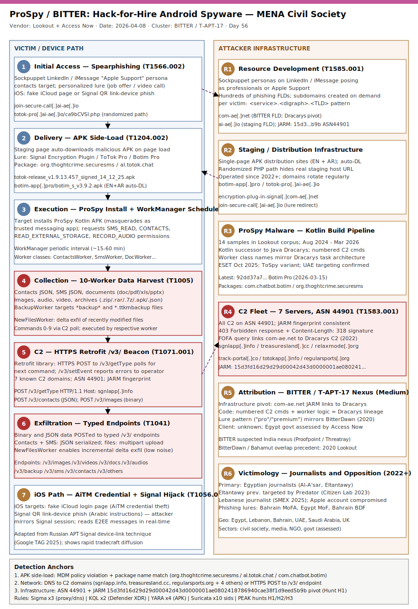

# ProSpy/BITTER: Hack-for-Hire Android Spyware Targeting MENA Civil Society Journalists

## TL;DR

A hack-for-hire operation with assessed ties to South Asian threat group BITTER (T-APT-17) has been running an active espionage campaign against journalists, opposition politicians, and civil society members across Egypt, Lebanon, Bahrain, UAE, and Saudi Arabia since at least 2022. The attacker chain opens with sockpuppet LinkedIn / iMessage personas that spearphish targets: iOS users are pushed to fake iCloud credential pages or malicious Signal QR-link-device flows; Android users are redirected to staging sites that auto-deliver ProSpy — a Kotlin-based Android surveillance implant masquerading as Signal, ToTok, or Botim. ProSpy silently exfiltrates contacts, SMS, files, and geolocation through ten server-side commands over HTTPS to seven known C2 domains. Lookout and Access Now published joint findings on April 8, 2026; ESET independently reported related samples in October 2025. The campaign is assessed active as of publication.

## Attribution and confidence

| Field | Value |
|---|---|
| Primary cluster | BITTER / T-APT-17 / APT-C-08 |
| Aliases | BitterAPT, Manlinghua (Chinese reporting) |
| Assessed nexus | South Asia; suspected India alignment (Proofpoint, Threatray) |
| Assessed client | Unknown — Egyptian government assessed likely by Access Now based on victim profile and auth-attempt origin |
| Vendor / date | Lookout + Access Now DSH, 2026-04-08; ESET, 2025-10 |
| Confidence | **Medium** — infrastructure overlap with known BITTER C2 (Dracarys lineage via FOFA JARM pivot); code family similarity; no direct ownership chain to named operator |
| Previous repo cases | Day 49 (2026-06-15) covered APT32/OceanLotus (#1 APT); this is first primary for slot #2 hack-for-hire |

**Genealogy:** ProSpy shares numbered-command C2 structure and "pro/premium" app-lure naming with Dracarys (attributed to BITTER by Meta 2022). Key pivot: domain `com-ae[.]net` (ProSpy distribution) links via FOFA JARM hash to `youtubepremiumapp[.]com` — a Dracarys C2. Earlier code overlap between BITTER BitterDawn and Bahamut hack-for-hire (2020) further supports hire-out model.

## Kill chain — summary table

| Stage | MITRE | Detail |
|---|---|---|
| Resource Development | T1583.001, T1585.001 | Register hundreds of phishing FLDs + subdomains; build sockpuppet LinkedIn / Apple Support personas |
| Initial Access | T1566.002 | Spearphishing link via LinkedIn DM / iMessage; targets pressured to click |
| Delivery (Android) | T1204.002 | 2-stage redirect → auto-download malicious APK (Signal/ToTok/Botim lookalike) |
| Credential Theft (iOS) | T1056.001 | AiTM-style iCloud login page; malicious Signal QR link-device phishing |
| Execution | T1204.002 | Target installs ProSpy APK; WorkManager schedules recurring data collection tasks |
| Collection | T1005, T1560.001 | Worker classes harvest contacts, SMS, docs, images, audio, video, archives, backup files |
| C2 | T1071.001 | HTTPS Retrofit library to /v3/ endpoints on 7 known C2 domains; polling getType for commands |
| Exfiltration | T1041 | JSON and binary files POST'd to typed endpoints (/v3/contacts, /v3/images, /v3/sms, etc.) |



Template A two-lane SVG: left lane shows victim device attack path (phishing → delivery → execution → collection); right lane shows attacker infrastructure (sockpuppets, phishing domains, staging sites, C2 fleet). Cross-lane arrows highlight two detection anchors: the APK side-load event (no Play Store provenance) and HTTPS beacon to non-CDN domains with /v3/ URI pattern.

## Stage-by-stage detail

### Stage 1 — Resource Development (T1583.001, T1585.001)

The threat actor maintains a persistent phishing infrastructure with hundreds of first-level domains, typically structured as `<service-lure>.<digraph-region>.<TLD>` (e.g., `zoom-meet.eg-uk[.]com`). Subdomain creation is on-demand per victim, enabling targeted attack URLs that appear legitimate. Parallel sockpuppet accounts on LinkedIn and iMessage (posing as Apple Support) establish rapport before delivering the hook.

Distribution infrastructure:
```
botim-app[.]pro          — auto-downloads botim_s_v3.9.2.apk on page load (EN + AR)
totok-pro[.]ai-ae[.]io   — randomized PHP endpoint redirect → APK
encryption-plug-in-signal[.]com-ae[.]net  — Signal lure
totok-pro[.]ae           — ToTok lure
totok-pro[.]io           — ToTok lure
```

### Stage 2 — Initial Access (T1566.002)

Targets receive spearphishing links via:
- LinkedIn DMs from sockpuppet "professional" accounts
- iMessage from accounts impersonating Apple Support
- Direct messaging apps (Telegram, WhatsApp) in some variants

The lure context is personalised — job offers, document review requests, video call invitations.

### Stage 3a — Android Delivery (T1204.002)

A fake "video call join" link (`join-secure-call[.]ai-ae[.]io`) prompts the user to "update" the ToTok app. Clicking redirects via randomised PHP path to a staging page that immediately downloads the malicious APK:
```
GET /totok-release_v1.9.13.457_signed_14_12_25.apk
Host: totok-pro[.]ai-ae[.]io
```

Known malicious package names: `com.chatbot.botim`, `com.chat.connect`, `the.messenger.bot`, `al.totok.chat`, `org.thoghtcrime.securesms`, `ae.totok.chat`, `im.thebot.mesenger`.

### Stage 3b — iOS Credential / Signal Hijack (T1056.001)

iOS targets receive phishing links to fake iCloud login pages. Additionally, Signal link-device QR codes with Arabic-language instructions trick targets into linking their Signal account to an attacker-controlled device — a technique adapted from Russian APT tradecraft documented by Google TAG.

### Stage 4 — Execution and Persistence (T1204.002)

ProSpy (Kotlin; developed in parallel with Java-based Dracarys predecessor) uses Android WorkManager to schedule recurring worker class executions. Workers handle discrete data collection tasks and can also be triggered on-demand by C2 commands 0-9.

### Stage 5 — Collection (T1005, T1560.001)

Worker classes (mirroring Dracarys numbered-task architecture):
```
ContactsWorker   → contacts JSON
SmsWorker        → SMS JSON
DocWorker        → .doc/.docx/.pdf/.xls/.pptx/.js
ImageWorker      → image MIME types
AudioWorker      → audio MIME types
VideoWorker      → video MIME types
ArchiveWorker    → .zip/.rar/.tar/.7z/.jar/.apk/.json
BackupWorker     → filenames containing "backup" or "ttkmbackup"
NewFilesWorker   → recently modified files (delta since last run)
OthersWorker     → residual MIME types
```

### Stage 6 — C2 (T1071.001)

ProSpy uses the Retrofit HTTP library. All C2 URIs begin with `/v3/`:
```
/v3/getType      — polls for next command number (0-9)
/v3/setEvent     — reports errors and debug state back
/v3/setStatus    — reports operational status
/v3/images       — upload images
/v3/videos       — upload videos
/v3/contacts     — upload contacts JSON
/v3/sms          — upload SMS JSON
```

Known C2 servers: `sgnlapp[.]info`, `treasuresland[.]cc`, `relaxmode[.]org`, `track-portal[.]co`, `totokapp[.]info`, `totok-pro[.]io`, `regularsports[.]org`.

### Stage 7 — Exfiltration (T1041)

All data is exfiltrated over HTTPS POST to the typed endpoints. Contacts and SMS are serialised as JSON; binary files are uploaded directly. The `NewFilesWorker` enables incremental exfiltration, reducing bandwidth signatures between beacons.

## RE notes

| Component | SHA1 | Lang | Packer | Notes |
|---|---|---|---|---|
| Botim Pro | `92dd37a709cbc7379e2804fe63d61a7d9846f934` | Kotlin | none observed | Newest sample (2026-03-15); WorkManager scheduling |
| ToTok Pro | `bebd8af44329037c34c1d5812ada26bc2230f50d` | Kotlin | none observed | 2026-02-19; numbered C2 cmd structure |
| Botim Pro | `af7ab9213eaa20a6b1a4fb5be6e6b2e56160c746` | Kotlin | none observed | 2026-02-05 |
| ToTok Pro | `8152b06537853e90103ed956653e446453e80293` | Kotlin | none observed | 2025-11-17; ttkmbackup exfil present |
| Signal Plugin | `50c7cab6221b24636f0d053679b843a194d8f4a1` | Kotlin | none observed | 2025-10-02; /v3/ endpoint confirmed |
| Signal Plugin | `38174544c6d6e127bbfee0bab031c2370e0a1bec` | Kotlin | none observed | 2025-09-28 |
| ToTok Pro | `ae60794c6f1d4893a20009437ebf96d790985a7c` | Kotlin | none observed | 2025-08-26 |
| Botim Pro | `02ee423f1cd1a123169ef1e4e7d40dbb2139d86b` | Kotlin | none observed | 2025-08-17 |
| ToTok Pro | `6339add91eb118831571e30801a28a40b2c304a0` | Kotlin | none observed | 2025-08-14 |
| Signal Plugin | `154d67f871ffa19dce1a7646d5ae4ff00c509ee4` | Kotlin | none observed | 2025-06-16 |
| Signal Plugin | `26fa78ccf9dbe970a4bc2911592ec99db809ffe5` | Kotlin | none observed | 2025-05-06 |
| ToTok Pro | `43f4dc193503947cb9449fe1cca8d3feb413a52d` | Kotlin | none observed | 2024-12-28 |
| ToTok Pro | `ffaac2fdd9b6f5340d4202227b0b13e09f6ed031` | Kotlin | none observed | 2024-08-07 |
| ToTok Pro | `579f9e5db2befccb61c833b355733c24524457ab` | Kotlin | none observed | 2024-08-07 |

Anti-analysis: no confirmed packer or obfuscator in Lookout corpus. C2 path randomisation (PHP redirect) provides distribution-layer obfuscation. FOFA/JARM fingerprint `15d3fd16d29d29d00042d43d0000001ae0802418786940cae38f1d9eed5b9b` links infrastructure to ASN 44901.

## Detection strategy

### Telemetry that matters

**Mobile / MDM / UEM:**
- Device side-loads APK outside managed app store (MDM policy violation log)
- New app installed with package name matching known ProSpy pattern (`org.thoghtcrime.*`, `ae.totok.*`, `al.totok.*`, `com.chatbot.botim`, `the.messenger.bot`, `im.thebot.mesenger`)
- App requests SMS_READ + CONTACTS + READ_EXTERNAL_STORAGE + RECORD_AUDIO from non-store APK

**Network (DNS / HTTP proxy):**
- DNS queries or TLS SNI to known C2 and staging domains
- HTTPS POST to URI path matching `/v3/(images|videos|contacts|sms|getType|setEvent|setStatus|images|audios|docs|backup|others)`
- High-volume POST traffic to newly-registered domains (< 30 days) over port 443

**Phishing / email / collaboration:**
- LinkedIn alert emails for messages from newly-created accounts
- iMessage / business email delivery of links matching `join-secure-call[.]` or `totok-pro[.]`

**Endpoint (Android):**
- `WorkManager` job scheduled with class name containing "Worker" from side-loaded app
- File system traversal of `/sdcard/` with MIME-type file filter from unknown package

### Detection coverage

| Engine | File | Logic |
|---|---|---|
| Sigma (network) | `sigma/prospy_c2_uri_pattern.yml` | HTTP POST URI matches `/v3/(getType|setEvent|setStatus|images|videos|contacts|sms|docs|backup|others|audios)` |
| Sigma (DNS) | `sigma/prospy_c2_domain_lookup.yml` | DNS query for known C2 and staging domains |
| Sigma (phishing infra) | `sigma/bitter_phishing_domain_pattern.yml` | DNS/proxy requests matching BITTER digraph-pattern phishing domains |
| KQL | `kql/prospy_c2_network.kql` | Defender XDR DeviceNetworkEvents — known domains + /v3/ URI beacon |
| KQL | `kql/prospy_staging_download.kql` | DeviceNetworkEvents — APK download from non-Play staging domains |
| YARA | `yara/prospy_android.yar` | ProSpy Kotlin strings: endpoint path `/v3/`, worker class naming, Retrofit usage, package-name patterns |
| Suricata | `suricata/prospy.rules` | TLS SNI / HTTP Host match on known C2 and staging domains; /v3/ URI pattern |

### Threat hunting hypotheses

**H1 (infrastructure pivot):** *If BITTER uses ASN 44901 with JARM `15d3fd16d29d29d00042d43d0000001ae0802418786940cae38f1d9eed5b9b` for C2 and staging, then passive DNS and CT logs will surface new domains sharing that fingerprint not yet in public blocklists.* → see `hunts/peak_h1_jarm_asn_pivot.md`

**H2 (beacon detection):** *If ProSpy beacons on a WorkManager schedule (default: periodic interval), then network flow analysis will show regular HTTPS POST bursts from mobile devices to low-reputation domains at sub-hourly intervals with consistent payload structure.* → see `hunts/peak_h2_workmanager_beacon.md`

**H3 (targeted delivery chain):** *If the attacker rebuilds phishing subdomain patterns for each new victim, then correlation of new subdomain registrations matching `<service>.<digraph>.<TLD>` pointing to ASN 44901 / 200+ IP range will pre-empt delivery before victim interaction.* → see `hunts/peak_h3_phishing_subdomain_intel.md`

## Incident response playbook

### First 60 minutes (triage)

1. Obtain the suspect device; enable airplane mode immediately (preserves volatile state, cuts C2).
2. Capture full device backup via ADB (`adb backup -apk -shared -all -f backup.ab`) before any factory reset.
3. Pull installed package list: `adb shell pm list packages -f -i` — flag any package names matching IOC list.
4. Extract APK of suspect package: `adb shell pm path <package>; adb pull <path> suspect.apk`.
5. Hash APK: `sha1sum suspect.apk` — compare to Lookout corpus.
6. Pull network connections from device while still live (if possible before airplane mode): `adb shell netstat -an | grep ESTABLISHED`.
7. Check MDM/UEM logs for side-load events, WorkManager job registration, abnormal permission grants.
8. Pivot to email / messaging platform logs: identify phishing lure delivery timestamp.
9. Interview target: what messaging platform, what persona sent the link, timeline of suspicious messages.
10. Notify affected individual and assess contact/SMS exposure (potential secondary victims).

### Artifacts to collect

| Artifact | Path / Source | Tool | Why |
|---|---|---|---|
| Installed APK | `adb shell pm path <pkg>; adb pull` | adb | Hash comparison, YARA scan |
| Full ADB backup | device | `adb backup -apk -shared -all` | Preserve app data and chat logs |
| Network logs (MDM) | MDM/UEM console | vendor API | C2 connection timestamps |
| DNS query logs | enterprise DNS / PDNS | SOC query | Domain resolution timeline |
| Phishing message | LinkedIn / iMessage / email | screenshot + headers | Attribution, infrastructure |
| WorkManager job DB | `/data/data/<pkg>/databases/` (root or backup) | adb backup | Scheduling intervals |
| ProSpy exfil endpoints | network capture | Wireshark / tcpdump | Confirm /v3/ POST pattern |

### IR queries and commands

```bash
# Extract installed packages with installer info
adb shell pm list packages -f -i -3

# Pull suspicious APK
adb shell pm path al.totok.chat
adb pull /data/app/al.totok.chat-1.apk ./suspect.apk

# Hash
sha1sum suspect.apk

# Check active connections
adb shell cat /proc/net/tcp6 | grep "0A3A"   # port 443

# YARA scan on APK
yara -r yara/prospy_android.yar suspect.apk
```

```kql
// DeviceNetworkEvents — known ProSpy C2 beacon
DeviceNetworkEvents
| where RemoteUrl has_any ("sgnlapp.info","treasuresland.cc","relaxmode.org",
    "track-portal.co","totokapp.info","totok-pro.io","regularsports.org")
    or RequestUri matches regex @"/v3/(getType|setEvent|setStatus|images|videos|contacts|sms|docs|backup|others|audios)"
| project Timestamp, DeviceName, RemoteUrl, RequestUri, RemoteIP, InitiatingProcessFileName
| sort by Timestamp desc
```

```bash
# Passive DNS pivot on BITTER JARM fingerprint (Hunt.io / Shodan)
curl -s "https://api.shodan.io/shodan/host/search?query=jarm:15d3fd16d29d29d00042d43d0000001ae0802418786940cae38f1d9eed5b9b+asn:AS44901&key=<APIKEY>"
```

### Containment, eradication, recovery

**Containment:**
- Isolate device from network (airplane mode already done at step 1).
- Block known C2 domains and IPs at DNS resolver and proxy/NGFW.
- Revoke any OAuth tokens or app permissions granted to suspect apps.
- If iOS target with iCloud compromise: revoke app-specific passwords, sign out all sessions, enable Advanced Data Protection.
- If Signal QR link-device compromise: go to Settings → Linked Devices → remove all unknown devices.

**Eradication:**
- Factory reset device after forensic copy.
- Re-enrol in MDM with enforced policy blocking unknown-source APK installs.
- Disable developer mode and USB debugging on all managed devices.

**What NOT to do:**
- Do NOT power cycle the device before ADB backup — risks losing volatile WorkManager DB.
- Do NOT contact the phishing persona to "confirm" — risks alerting threat actor.
- Do NOT restore from cloud backup made after compromise without scanning first.

**Recovery:**
- Provision clean device from enterprise SOE image.
- Enable Apple Lockdown Mode / Google Advanced Protection for high-risk individuals.
- Enrol in Access Now Digital Security Helpline if civil society target.

### Recovery validation

- Confirm new device has no packages with flagged package name patterns.
- Re-scan DNS logs 48h post-recovery for any residual C2 beacon.
- Validate MDM policy enforcement: attempt side-load on recovered device; confirm block.
- Brief affected individual on phishing defence: FIDO2 / passkey, verify sender through separate channel.

## IOCs

| Type | Value | Context | Confidence | Source |
|---|---|---|---|---|
| domain | sgnlapp[.]info | ProSpy C2 server | high | Lookout 2026-04-08 |
| domain | treasuresland[.]cc | ProSpy C2 server | high | Lookout 2026-04-08 |
| domain | relaxmode[.]org | ProSpy C2 server | high | Lookout 2026-04-08 |
| domain | track-portal[.]co | ProSpy C2 server | high | Lookout 2026-04-08 |
| domain | totokapp[.]info | ProSpy C2 server | high | Lookout 2026-04-08 |
| domain | totok-pro[.]io | ProSpy C2 / distribution | high | Lookout 2026-04-08 |
| domain | regularsports[.]org | ProSpy C2 server | high | Lookout 2026-04-08 |
| domain | botim-app[.]pro | ProSpy staging/distribution (Botim lure) | high | Lookout 2026-04-08 |
| domain | totok-pro[.]ai-ae[.]io | ProSpy staging/distribution (ToTok lure) | high | Lookout 2026-04-08 |
| domain | encryption-plug-in-signal[.]com-ae[.]net | ProSpy staging (Signal lure); BITTER pivot domain | high | Lookout 2026-04-08 |
| sha1 | 92dd37a709cbc7379e2804fe63d61a7d9846f934 | ProSpy — Botim Pro (2026-03-15, newest sample) | high | Lookout 2026-04-08 |
| sha1 | bebd8af44329037c34c1d5812ada26bc2230f50d | ProSpy — ToTok Pro (2026-02-19) | high | Lookout 2026-04-08 |
| sha1 | 8152b06537853e90103ed956653e446453e80293 | ProSpy — ToTok Pro (2025-11-17) | high | Lookout 2026-04-08 |
| sha1 | 50c7cab6221b24636f0d053679b843a194d8f4a1 | ProSpy — Signal Encryption Plugin (2025-10-02) | high | Lookout 2026-04-08 |
| string | /v3/getType | ProSpy C2 polling endpoint URI prefix | high | Lookout 2026-04-08 |

Full IOC list in `iocs.csv`.

## Secondary findings

- **Signal QR link-device phishing adapted from Russian APT tradecraft.** The campaign's iOS attack path — delivering a malicious Signal QR code to link an attacker device to the victim's account — mirrors techniques documented by Google TAG against Russian APT28-affiliated operators targeting Signal users in 2025. The cross-pollination of iOS evasion techniques across geopolitically distinct hack-for-hire markets highlights the rapid diffusion of surveillance tradecraft.

- **Ahmed Eltantawy: multi-vendor surveillance target.** The Citizen Lab previously documented Eltantawy's device being targeted with Intellexa Predator spyware in 2021 and 2023. The same individual appearing in a BITTER-linked hack-for-hire operation in late 2023 / 2024 — a distinct vendor and delivery chain — indicates that high-value targets may face simultaneous or sequential engagement by multiple surveillance-as-a-service providers, potentially under the same client. Defence teams should never treat a prior spyware clearance as permanent.

- **BITTER / Bahamut tooling overlap precedent.** A 2020 Lookout finding showed identical Android intent actions shared between BITTER's BitterDawn and Bahamut (a known hack-for-hire group). The ProSpy campaign represents a second documented instance of BITTER infrastructure or code being channelled through a hire-out model, suggesting that South Asian APT operators may routinely moonlight for or license tooling to commercial espionage vendors targeting regions outside their primary mandate.

## Pedagogical anchors

- **Hack-for-hire obscures client attribution by design.** The technical fingerprints point confidently to BITTER infrastructure; who paid for the campaign is not determinable from malware alone. IR teams and threat intel analysts must resist collapsing "known operator" with "client identity" — the two are decoupled in the mercenary market by contract structure.

- **iOS does not equal safe from targeted actors.** The iOS kill chain here (iCloud AiTM phishing + Signal QR device-link) proves that resource-constrained actors who cannot afford zero-click iOS exploits still successfully compromise iPhone users through social engineering and account-level attack rather than device-level exploitation. Lockdown Mode does not block credential phishing.

- **Delivery infrastructure fingerprints outlast malware families.** Dracarys is years old; ProSpy is its functional successor. Yet the underlying phishing domain pattern (`<service>.<digraph>.<TLD>`) and ASN/JARM fingerprint (ASN 44901, JARM `15d3...b9b`) carried forward intact. Hunting infrastructure, not just hashes, is the durable detection primitive.

- **Civil society is a first-order threat intelligence target.** Journalists and opposition politicians carry source information, network graphs of dissidents, and geopolitical intelligence. Defence teams protecting NGOs, newsrooms, and diaspora communities should treat their adversary tier as equivalent to mid-tier nation-state operators — not just commodity phishing.

- **Joint civil society / commercial research produces the best mobile intel.** The Access Now Helpline caught the campaign in August 2025 through victim outreach; Lookout provided the malware RE; SMEX contributed the Lebanese case. Compartmentalised technical research would have missed the breadth of targeting. This model — civil society + commercial security + victim collaboration — is replicable for defenders.

## What's in this folder

| File | Purpose |
|---|---|
| [README.md](./README.md) | This document — full case analysis, IR playbook, detection coverage |
| [kill_chain.svg](./kill_chain.svg) | Two-lane kill chain diagram (Template A): victim path (left) + attacker infra (right) |
| [sigma/prospy_c2_uri_pattern.yml](./sigma/prospy_c2_uri_pattern.yml) | Sigma rule — HTTP POST to ProSpy /v3/ C2 URI pattern |
| [sigma/prospy_c2_domain_lookup.yml](./sigma/prospy_c2_domain_lookup.yml) | Sigma rule — DNS resolution of known ProSpy C2 domains |
| [sigma/bitter_phishing_domain_pattern.yml](./sigma/bitter_phishing_domain_pattern.yml) | Sigma rule — BITTER digraph-pattern phishing infrastructure DNS/proxy |
| [kql/prospy_c2_network.kql](./kql/prospy_c2_network.kql) | KQL (Defender XDR) — network events matching known ProSpy C2 domains and /v3/ URI |
| [kql/prospy_staging_download.kql](./kql/prospy_staging_download.kql) | KQL (Defender XDR) — APK download from non-Play staging domains |
| [yara/prospy_android.yar](./yara/prospy_android.yar) | YARA — ProSpy Kotlin APK detection (endpoint paths, worker names, package patterns) |
| [suricata/prospy.rules](./suricata/prospy.rules) | Suricata 7.x — TLS SNI and HTTP Host match on C2/staging; /v3/ URI pattern |
| [hunts/peak_h1_jarm_asn_pivot.md](./hunts/peak_h1_jarm_asn_pivot.md) | PEAK hunt H1 — BITTER infrastructure discovery via JARM + ASN 44901 pivot |
| [hunts/peak_h2_workmanager_beacon.md](./hunts/peak_h2_workmanager_beacon.md) | PEAK hunt H2 — periodic WorkManager C2 beacon pattern in network flows |
| [hunts/peak_h3_phishing_subdomain_intel.md](./hunts/peak_h3_phishing_subdomain_intel.md) | PEAK hunt H3 — proactive subdomain registration monitoring for BITTER pattern |
| [iocs.csv](./iocs.csv) | Structured IOC list (CSV): all domains, SHA1 hashes, strings, notes |

## Sources

1. [Beyond BITTER: MENA Civil Society Targeted in Hack-For-Hire Operation Linked to BITTER APT — Lookout, 2026-04-08](https://www.lookout.com/threat-intelligence/article/bitter-hack-for-hire)
2. [Espionage for repression: hack-for-hire phishing campaign targets civil society in MENA — Access Now, 2026-04-08](https://www.accessnow.org/mena-phishing-2026/)
3. [Bitter-Linked Hack-for-Hire Campaign Targets Journalists Across MENA Region — The Hacker News, 2026-04](https://thehackernews.com/2026/04/bitter-linked-hack-for-hire-campaign.html)
4. [Hack-for-hire spyware campaign targets journalists in Middle East, North Africa — CyberScoop, 2026-04](https://cyberscoop.com/hack-for-hire-spyware-campaign-targets-journalists-in-middle-east-north-africa/)
5. [Middle East Hack-for-Hire Operation Traced to South Asian APT Group — Infosecurity Magazine, 2026-04](https://www.infosecurity-magazine.com/news/middle-east-hack-operation-bitter/)
6. [New Spyware Campaigns Target Privacy-Conscious Android Users in UAE — ESET WeLiveSecurity, 2025-10](https://www.welivesecurity.com/en/eset-research/new-spyware-campaigns-target-privacy-conscious-android-users-uae/)
7. [Predator in the Wires: Ahmed Eltantawy Targeted with Predator Spyware — Citizen Lab, 2023-09](https://citizenlab.ca/2023/09/predator-in-the-wires-ahmed-eltantawy-targeted-with-predator-spyware-after-announcing-presidential-ambitions/)
