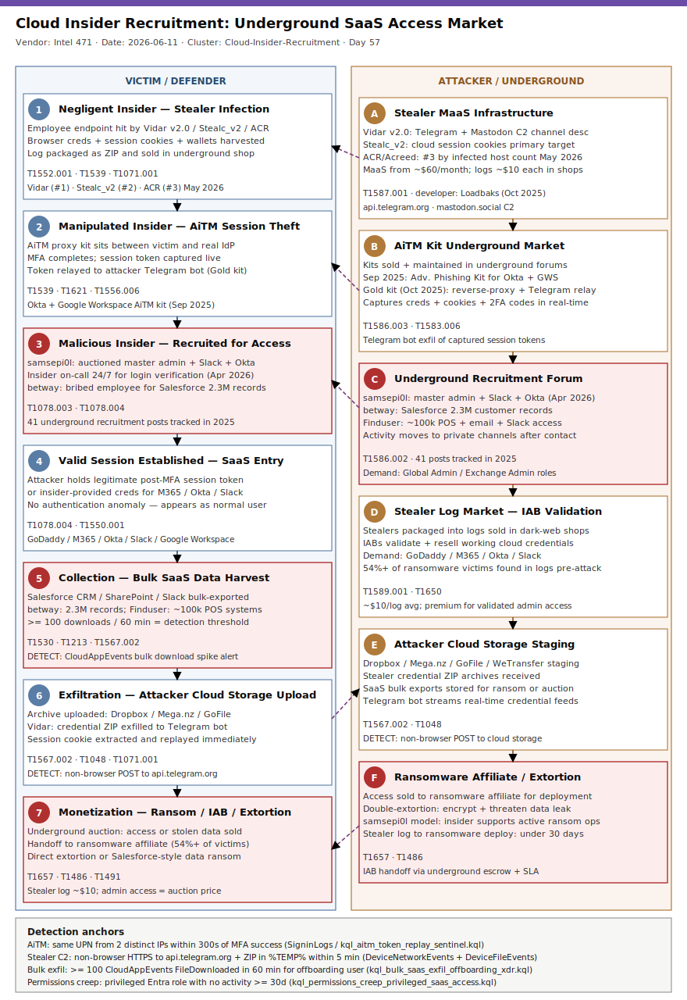

# Cloud Insider Recruitment: Underground Market for SaaS and Cloud Platform Access

## TL;DR

Intel 471 published a systematic analysis on June 11, 2026 documenting how cybercrime underground actors recruit, dupe, and coerce employees with cloud access, creating a structured market for insider-backed entry into corporate SaaS and cloud platforms. In 2025, Intel 471 tracked 41 insider-related underground posts; by April 4, 2026, actor **samsepi0l** ran an open auction for 24/7 insider-backed master admin, Slack, and Okta access. The three insider archetypes — negligent, manipulated, and malicious — each enable a distinct attack path: stealers harvest credentials from negligent users (Vidar at #1 by infected hosts in May 2026), AiTM kits manipulate victims through live MFA intercept, and malicious insiders are directly recruited with payment. The downstream pipeline feeds initial access brokers and ultimately ransomware affiliates — DeepStrike found that 54%+ of ransomware victims appeared in stealer-log markets before the attack. This is the first primary coverage of taxonomy slot #20 (Insider Threat) in the repo.

## Attribution and confidence

| Field | Value |
|---|---|
| Cluster | Cloud-Insider-Recruitment-unattributed |
| Aliases | Various forum actors: samsepi0l, betway, Finduser, Gold |
| Nexus | Multiple nations — e-crime, no nation-state attribution |
| Vendor / Date | Intel 471 Cloud Insider Threat Report, via Help Net Security 2026-06-11 |
| Attribution confidence | low (identity of any individual actor); high (market mechanics and behavioral patterns) |

**Overlap with prior repo cases:**
- `2026-06-21_Icarus-Klue-OAuth-Salesforce-SaaS-Extortion` (Day 55): shares downstream exfiltration target (SaaS CRM data) and NHI/SaaS token theme; upstream access vector is distinct (supply-chain OAuth breach vs. insider-supplied credentials).
- `2026-06-20_Agentjacking-Sentry-MCP-DSN-Injection` (Day 54): shares manipulated-insider category (AI agent manipulated as proxy); explicitly different vector (MCP tool poisoning vs. human insider recruitment).
- `2026-05-06_CodeOfConduct-AiTM-Storm-1747` (Day 6): shares AiTM technique (T1539); distinct in that Storm-1747 ran their own AiTM infrastructure targeting M365 enterprise tenants, whereas this case documents the underground kit market enabling lower-tier actors.

**Genealogy:** The underground insider-recruitment market documented here is structurally upstream of every ransomware case in the repo involving valid-account initial access. The samsepi0l actor pattern (auctioning privileged insider access) is a direct precursor to the kind of access seen in Icarus/Klue (Day 55) and BlackFile/UNC6671 (Day 36).

## Kill chain — summary table

| Stage | MITRE | Detail |
|---|---|---|
| Resource Development | T1587.001, T1586.003 | Actor develops or purchases infostealer MaaS kit (Vidar, Stealc_v2, ACR); or posts underground recruitment offer for insider |
| Initial Access via Negligent Insider | T1552.001, T1539 | Stealer harvests browser-saved credentials and session cookies from employee endpoint; log sold to IAB |
| Initial Access via Manipulated Insider | T1621, T1556.006 | AiTM kit placed between victim and real IdP; victim completes MFA; kit captures session token; replayed from attacker infrastructure |
| Initial Access via Malicious Insider | T1078.003, T1078.004 | Recruited employee provides credentials or performs direct actions on attacker's behalf (samsepi0l: 24/7 login verification and alert monitoring) |
| Collection | T1530, T1213 | Attacker accesses Salesforce, SharePoint, Slack, Google Drive with valid session; bulk-exports data records |
| Exfiltration | T1567.002, T1048 | Data staged to attacker-controlled cloud storage; archive sent over HTTPS |
| Monetization | T1657 | Access and/or data auctioned on underground forums; sold to ransomware affiliates; or direct extortion |



The left lane shows the victim-side progression: negligent endpoint compromise, manipulated AiTM session theft, and malicious insider credential handoff all converge at the valid-session entry point into SaaS. The right lane shows attacker infrastructure: stealer MaaS delivery, AiTM proxy kit, and underground forum auction mechanics. The stageK boxes (red) mark the highest-value detection anchors: AiTM session token replay (anomalous IP after MFA success) and bulk SaaS data exfiltration. Arrows crossing lanes represent the moment when insider-provided or stolen credentials hit corporate IdP infrastructure, which is where identity-centric detection must fire.

## Stage-by-stage detail

### Stage 1 — Resource Development: Building the Market Infrastructure

Three parallel tracks supply the market. The stealer track deploys Vidar v2.0 (developer handle **Loadbaks**, released Oct 6 2025 on underground forums; #1 by infected host volume May 2026 per Intel 471), Stealc_v2 (#2), or ACR/Acreed (#3) as MaaS offerings — available for as little as $60/month. The AiTM track builds or purchases proxy kits: in September 2025 an underground actor advertised an "Advanced Phishing Kit Targeting Okta and Google Workspace" that collects usernames, passwords, and session tokens. Actor **Gold** sold reverse-proxy phishing projects in October 2025 with cookies, credentials, and two-factor codes routed to a Telegram bot. The recruitment track posts forum messages seeking employees with privileged access: in 2025, Intel 471 tracked 19 posts seeking insiders, 14 claiming to have one, and 3 claiming active insider access.

MITRE: T1587.001 (Develop Malware), T1586.003 (Compromise Accounts: Cloud Accounts).

### Stage 2a — Negligent Insider: Stealer Credential Harvest

Vidar v2.0 targets browser-saved passwords, session cookies, and cryptocurrency wallet data. Its C2 architecture uses Telegram channel descriptions and Mastodon bio fields to store the C2 address — traffic blends with legitimate social-media outbound connections. After harvest, credentials are packaged into logs and sold; demand centers on GoDaddy, Google Workspace, M365/Office 365, Outlook Web Access, and Slack. The stealer is typically delivered via malvertising, cracked software, or poisoned developer packages.

```
%APPDATA%\Roaming\vidar\         # Vidar v2.0 staging directory pattern
%TEMP%\<random_8char>.zip        # Credential archive before exfil
HKCU\Software\<random>\          # Persistence under HKCU Run (optional variant)
```

MITRE: T1552.001 (Credentials in Files), T1539 (Steal Web Session Cookie), T1071.001 (C2 via social media API).

### Stage 2b — Manipulated Insider: AiTM Session Token Theft

AiTM kits (Evilginx-class) proxy the victim to the real IdP, capturing credentials and session cookies in real time as MFA completes. The captured post-MFA session token is immediately replayed from attacker infrastructure. The Gold-class kits route all captures (credentials, cookies, 2FA codes) to a Telegram bot, enabling real-time alerting to the operator. MFA fatigue (T1621) is used as an alternative when the target has push-based MFA: the actor submits repeated approval requests until the victim approves.

MITRE: T1539 (Steal Web Session Cookie), T1621 (MFA Request Generation), T1556.006 (Modify Authentication Process: MFA).

### Stage 2c — Malicious Insider: Underground Recruitment and Direct Access Sale

On April 4, 2026, actor **samsepi0l** ran an auction on an underground forum for master admin, Slack, and Okta access backed by an insider "available around the clock for login verification and alert monitoring." On September 28, 2025, actor **betway** claimed to have bribed an employee of an Indian company for Salesforce access to 2.3 million customer records. On October 31, 2025, actor **Finduser** advertised insider access to approximately 100,000 restaurant POS machines plus internal network, email, and Slack. Payment is typically cryptocurrency; recruitment moves to private channels after initial forum contact.

MITRE: T1078.003 (Valid Accounts: Local Accounts), T1078.004 (Valid Accounts: Cloud Accounts).

### Stage 3 — Collection: SaaS Data Harvest

With a valid session (from any of the three ingress paths), the attacker operates within the victim's SaaS environment using legitimate APIs and authorized applications. Common collection targets: Salesforce CRM records, SharePoint/OneDrive document libraries, Slack messages and file attachments, Google Drive, internal wikis and repositories. Volume thresholds: betway's Salesforce case involved 2.3M records; Finduser's case involved 100,000 POS system records.

MITRE: T1530 (Data from Cloud Storage), T1213 (Data from Information Repositories).

### Stage 4 — Exfiltration and Monetization

Data is exfiltrated via cloud-sync APIs or direct download, staged to attacker-controlled storage (Dropbox, GoFile, Mega.nz), and then monetized through underground forum auction, direct ransom negotiation, or handoff to a ransomware affiliate. DeepStrike data confirms the IAB-to-ransomware handoff pipeline: 54%+ of ransomware victims appeared in stealer-log markets before the ransomware deployment. Underground logs sell for approximately $10 each; validated corporate cloud access commands premium pricing (samsepi0l-class access: auction format).

MITRE: T1567.002 (Exfiltration to Cloud Storage), T1048 (Exfiltration over Alternative Protocol), T1657 (Financial Theft).

## Detection strategy

### Telemetry that matters

| Source | Events / Tables | What to look for |
|---|---|---|
| Entra ID / Azure AD | SigninLogs | Successful MFA auth followed within 5 min by auth from new IP (AiTM token replay) |
| Entra ID | AuditLogs | Privileged role assignments with no subsequent role-relevant activity >= 30d (permissions creep) |
| Defender XDR | CloudAppEvents | >= 100 file download events in 60 min from offboarding/flagged user |
| Defender XDR | DeviceNetworkEvents | Non-browser process connecting to api.telegram.org or mastodon social domains |
| Defender XDR | DeviceFileEvents | ZIP archive written to %TEMP%/%APPDATA% within 5 min of Telegram API beacon |
| Defender XDR | DeviceFileEvents | Bulk file copy to removable media by at-risk employee (HR watchlist) |
| Network (Suricata) | TLS SNI | api.telegram.org SNI from non-browser process; mastodon social domain C2 lookup |
| Network (Suricata) | HTTP | POST multipart/form-data with .zip filename from non-browser UA |
| M365 / Sentinel | AuditLogs | FileSyncDownloadedFull + FileDownloaded volume spike by offboarding user |

**Sysmon EIDs for endpoint hunting:** EID 1 (ProcessCreate — stealer child), EID 3 (NetworkConnect to api.telegram.org), EID 11 (FileCreate — .zip in TEMP), EID 22 (DNSEvent to telegram/mastodon domains).

### Detection coverage

| Engine | File | Logic |
|---|---|---|
| Sigma | sigma_cloud_aitm_session_token_reuse.yml | SigninLogs: MFA success from non-corporate CIDR within 5 min of prior auth (AiTM replay) |
| Sigma | sigma_saas_bulk_download_after_offboarding.yml | M365 Audit: FileDownloaded/FileSyncDownloadedFull by offboarding-watchlist user |
| Sigma | sigma_infostealer_telegram_c2_process.yml | ProcessCreate: non-browser child process beaconing Telegram API; FileCreate: .zip in APPDATA/TEMP |
| KQL | kql_aitm_token_replay_sentinel.kql | Sentinel SigninLogs: same UPN from two distinct IPs within 300 seconds of MFA success |
| KQL | kql_bulk_saas_exfil_offboarding_xdr.kql | Defender XDR CloudAppEvents: >= 100 download events in 60 min by flagged user |
| KQL | kql_infostealer_telegram_beacon_xdr.kql | XDR: non-browser HTTPS to api.telegram.org within 5 min of ZIP archive creation in TEMP |
| KQL | kql_permissions_creep_privileged_saas_access.kql | Sentinel AuditLogs: privileged role held by user with no activity >= 30 days |
| YARA | yara_insider_threat_cloud.yar | VidarClass_Telegram_C2_Resolve: PE resolving Telegram API with cred-string cluster; AiTM_PhishKit_Okta_Google_Token_Harvest: PHP kit targeting Okta/GWS with Telegram relay; CloudInsider_Stealer_Log_Archive_Pattern: ZIP archive with stealer directory structure |
| Suricata | suricata_cloud_insider.rules | 7 rules: Telegram/Mastodon C2 SNI; ZIP POST non-browser; AiTM credential POST relay; Okta phish POST harvest; bulk cloud download; reverse-proxy X-Forwarded-For manipulation |

### Threat hunting hypotheses

**H1:** Accounts holding privileged SaaS roles that have not performed any role-relevant action in >= 30 days represent unreviewed permissions creep — the primary structural precondition for insider and manipulated-insider access identified by Intel 471. → `hunts/peak_h1_saas_permission_creep_inventory.md`

**H2:** Corporate credentials for M365, Okta, GoDaddy, and Slack have appeared in infostealer log markets prior to any confirmed breach — creating a pre-attack window for containment. → `hunts/peak_h2_infostealer_log_corp_credential_exposure.md`

**H3:** Employees on HR watchlist (PIP, notice period, active investigation) exhibiting bulk file copy to removable media or personal cloud endpoints are exhibiting pre-exfiltration behavior consistent with malicious insider recruitment. → `hunts/peak_h3_malicious_insider_recruitment_dark_web.md`

## Incident response playbook

### First 60 minutes (triage)

1. Identify the ingress vector: Was this a stealer credential theft (check EDR for Vidar/Stealc process tree), an AiTM session replay (check SigninLogs for dual-IP MFA pattern), or a malicious insider (check HR status of account owner)?
2. Revoke all active sessions for the affected account immediately: `Revoke-AzureADUserAllRefreshToken -ObjectId <UPN>` or Entra ID blade → Sessions → Revoke.
3. Enumerate all third-party OAuth grants for the account: `Get-MgUserOauth2PermissionGrant -UserId <UPN>`.
4. Pull CloudAppEvents for the last 30 days for the affected UPN — identify every file accessed, downloaded, or exported.
5. Check if the UPN appears in any underground threat intel feed (SpyCloud, Intel 471, Flare) — confirm if credentials were previously exposed.
6. If stealer infection confirmed on endpoint: isolate device, preserve memory image before reimaging.

### Artifacts to collect

| Artifact | Path | Tool | Why |
|---|---|---|---|
| Entra ID Sign-in logs | Azure Portal → Entra ID → Sign-in logs | Azure Portal / Log Analytics | Identify AiTM token replay (dual-IP within 5 min) |
| Entra ID Audit logs | Azure Portal → Entra ID → Audit logs | Log Analytics | Identify role assignments, OAuth grant changes |
| M365 Unified Audit Log | compliance.microsoft.com → Audit | Content Search API | File access / download events for affected UPN |
| OAuth grant list | `Get-MgUserOauth2PermissionGrant -UserId <UPN>` | Microsoft Graph PowerShell | Identify persistent SaaS app access that survives password reset |
| Stealer process tree | EDR → Process timeline around %TEMP%\*.zip creation | Defender XDR / CrowdStrike Falcon | Identify stealer family and delivery mechanism |
| Network captures | DNS logs for api.telegram.org / mastodon domains | Suricata / NDR | Confirm stealer C2 timeline |
| Browser credential store | `%LOCALAPPDATA%\Google\Chrome\User Data\Default\Login Data` (SQLite) | SQLiteBrowser | Confirm what credentials were stored and potentially harvested |
| Underground forum posts | Intel 471 / Flare API query for corporate domain | CTI platform | Confirm if insider was recruited or if logs are actively for sale |

### IR queries and commands

```powershell
# Revoke all refresh tokens for affected user (breaks active sessions)
Connect-MgGraph -Scopes "User.ReadWrite.All"
Invoke-MgInvalidateAllUserRefreshToken -UserId "<UPN>"

# List all OAuth grants for the user
Get-MgUserOauth2PermissionGrant -UserId "<UPN>" |
    Select-Object ClientId, ConsentType, Scope, PrincipalId

# Revoke a specific OAuth grant
Remove-MgOauth2PermissionGrant -OAuth2PermissionGrantId "<grant_id>"

# Check Entra ID Risky Users
Get-MgRiskyUser -Filter "riskState eq 'atRisk'" |
    Select-Object UserDisplayName, UserPrincipalName, RiskLevel, RiskDetail

# Pull M365 audit log for bulk file downloads in last 24h
Search-UnifiedAuditLog -StartDate (Get-Date).AddDays(-1) -EndDate (Get-Date) `
    -Operations FileDownloaded,FileSyncDownloadedFull `
    -UserIds "<UPN>" | Select-Object -ExpandProperty AuditData | ConvertFrom-Json |
    Select-Object UserId, ObjectId, Operation, CreationTime |
    Sort-Object CreationTime
```

```bash
# On Linux endpoint: check for stealer persistence via cron or systemd
crontab -l 2>/dev/null
systemctl list-units --type=service --state=running | grep -v "\.scope"

# Check for suspicious ZIP archives in temp directories
find /tmp /var/tmp ~/.cache -name "*.zip" -newer /tmp -ls 2>/dev/null

# Check running processes connecting to Telegram IPs
ss -tnp | grep -E "(149\.154\.|91\.108\.)"
```

```kql
// KQL: Pull all CloudAppEvents for affected UPN in last 30 days
CloudAppEvents
| where TimeGenerated >= ago(30d)
| where AccountUpn =~ "<affected_upn>"
| project TimeGenerated, ActionType, Application, ObjectName, ObjectType,
          IPAddress, Country, City, UserAgent
| sort by TimeGenerated desc
```

### Containment, eradication, recovery

**Containment:**
- Revoke all sessions and OAuth grants (immediate, non-negotiable).
- Force MFA re-enrolment with phishing-resistant method (FIDO2/passkey).
- Place account under Conditional Access policy requiring compliant device.
- Disable account if malicious insider confirmed; preserve for forensics before termination.

**Eradication:**
- If stealer infection: full endpoint wipe and rebuild — do not attempt to clean.
- Rotate all service account credentials associated with the compromised identity.
- Audit and revoke all third-party app OAuth grants; re-authorize only those with documented business need.
- Conduct permissions review: remove all role assignments accumulated beyond current job function.

**What NOT to do:**
- Do NOT simply reset the password — a stealer-harvested session cookie survives password reset; revoke sessions first.
- Do NOT confront a suspected malicious insider before preserving forensic evidence.
- Do NOT reimaging the endpoint before collecting a memory image — stealer artifacts are volatile.

**Exit criteria for containment:** Confirmed session revocation across all services (M365, Okta, Google, Slack verified individually); no new anomalous sign-ins for 24h; endpoint rebuilt and rejoined to domain.

### Recovery validation

```powershell
# Confirm no active sessions remain (should return empty after revocation)
Get-MgUserAuthenticationMethod -UserId "<UPN>"
# Verify sign-in logs show no successful logins after containment timestamp
# In Sentinel: SigninLogs | where UserPrincipalName =~ "<UPN>" and ResultType == 0
#              and TimeGenerated > containment_time | count
```

## IOCs

| Type | Value | Context | Confidence | Source |
|---|---|---|---|---|
| string | samsepi0l | Underground actor; auctioned 24/7 insider-backed master admin + Slack + Okta access; April 4 2026 | high | Intel 471 / Help Net Security 2026-06-11 |
| string | betway | Underground actor; claimed Salesforce bribe giving access to 2.3M customer records; Sept 28 2025 | high | Intel 471 / Help Net Security 2026-06-11 |
| string | Finduser | Underground actor; advertised ~100k restaurant POS + internal network + email + Slack access; Oct 31 2025 | high | Intel 471 / Help Net Security 2026-06-11 |
| string | Gold | Underground actor; sold Okta + Gmail reverse-proxy kit with Telegram credential relay; Oct 2025 | high | Intel 471 / Help Net Security 2026-06-11 |
| string | Loadbaks | Developer alias for Vidar Stealer v2.0; announced release Oct 6 2025 | medium | Trend Micro 2025-10 |
| string | Vidar | Top infostealer by infected host volume May 2026; v2.0 uses Telegram + Mastodon C2 | high | Intel 471 May-2026 stealer rankings |
| string | Stealc_v2 | Second-ranked infostealer May 2026; targets cloud service session cookies | high | Intel 471 May-2026 stealer rankings |
| string | ACR | Third-ranked infostealer (also: Acreed) May 2026 | high | Intel 471 May-2026 stealer rankings |
| note | api.telegram.org | Vidar v2.0 and Gold-class kit C2 / credential relay endpoint | high | Intel 471; Trend Micro |
| note | Advanced Phishing Kit Targeting Okta and Google Workspace | AiTM kit advertised Sept 2025; collects usernames / passwords / session tokens | medium | Intel 471 |
| note | STEALER-PIPELINE | Negligent insider credential harvest -> stealer log -> IAB sale -> cloud access -> ransomware; 54%+ of ransomware victims in logs before attack | high | DeepStrike 2025; Intel 471 2026 |
| note | TARGETED-SERVICES | GoDaddy / Google Workspace / M365 / Office 365 / Outlook Web Access / Slack — top demand in underground stealer log markets | high | Intel 471 2026 |
| note | PERMISSIONS-CREEP | Stale privileged SaaS roles (no role-relevant activity >= 30d) are structural insider-attack precondition | high | Intel 471 2026 |

Full list in `iocs.csv`.

## Secondary findings

- **IAB-to-ransomware handoff is structurally faster than ever.** Mandiant M-Trends 2026 reports that the median time from initial access to ransomware deployment has reached a new floor, with underground forums now offering structured SLA-backed access handoffs. The stealer-log pipeline documented here — with Vidar/Stealc harvesting credentials that IABs validate and sell to ransomware affiliates — directly feeds this acceleration. A credential appearing in a stealer log market is no longer a future risk signal; at 54%+ correlation with pre-attack exposure, it is a near-real-time intrusion warning.

- **Non-human identity (NHI) tokens are the blind spot.** The samsepi0l auction and betway Salesforce case both involved service-level access (master admin, API-connected Salesforce) that would not appear in standard PAM or privileged user monitoring. OAuth refresh tokens for third-party SaaS integrations have indefinite lifetime unless explicitly revoked, are not rotated by password changes, and rarely appear in identity governance reviews. The structural gap is identical to that exploited in `2026-06-21_Icarus-Klue-OAuth-Salesforce-SaaS-Extortion` (Day 55) — the control that closes both is NHI inventory + automated token rotation, not simply improving human MFA.

- **Insider threat detection requires HR-security integration, not just telemetry.** Hunt H3 depends on a real-time watchlist of at-risk employees (PIP, notice, investigation) that security tooling can join against endpoint and SaaS telemetry. Without that integration, defenders are always reacting after exfiltration rather than catching pre-exfiltration staging. Intel 471 data shows that 771 of 1002 insider incidents occurred while the employee was still actively employed — meaning behavioral signals on endpoint and SaaS are available before the incident is formally classified.

## Pedagogical anchors

- **Credential theft survives password resets.** A stealer-harvested session cookie or OAuth refresh token is valid until explicitly revoked — resetting the password does not invalidate it. Containment of an insider incident always starts with `Revoke-AzureADUserAllRefreshToken` AND explicit revocation of all third-party OAuth grants, not just a password change. This is the most commonly missed step in M365 incident response.

- **Permissions creep multiplies the blast radius of every access vector.** Employees accumulate SaaS roles over tenure without review; third-party app connections grant persistent broad scope without monitoring. One phished credential or recruited insider with stale Global Admin access can affect every tenant resource. The technical countermeasure (quarterly role review + immediate revocation at offboarding) is known; the organizational failure is that it does not happen systematically.

- **MFA is not AiTM-resistant by default.** TOTP, SMS, and push-based MFA are all interceptable by AiTM kits that relay the session token in real-time. Only FIDO2/WebAuthn passkeys bound to the origin URL are AiTM-resistant because the credential assertion is domain-scoped — the phishing domain gets a different assertion that the real IdP rejects. The detection signal for AiTM is not the MFA event itself but the session token being replayed from a second IP within a short window of the MFA success.

- **The stealer-log pipeline is an early warning system — if you have access to it.** DeepStrike's finding (54%+ of ransomware victims in stealer-log markets before attack) means that external threat intel subscriptions (SpyCloud, Intel 471, Flare) that index credential exposure give defenders a pre-breach window. An exposed corporate credential in a stealer log should trigger the same response as an active intrusion alert — not just a password reset.

- **Malicious insider recruitment is a structured market, not a one-off.** The 41 posts Intel 471 tracked in 2025 — 19 seeking insiders, 14 claiming success — represent observed volume, not total market size (most activity moves to private channels). The samsepi0l auction model (24/7 insider backing with active alert monitoring) represents operational sophistication that mirrors legitimate managed-access-service SLAs. Defender awareness programs that teach employees to recognize and report unsolicited recruitment approaches are a detection control, not just HR hygiene.

## What's in this folder

| File | Purpose |
|---|---|
| [README.md](./README.md) | This document — full case analysis, 15 sections |
| [kill_chain.svg](./kill_chain.svg) | Visual kill chain: three insider ingress paths converging on SaaS access (Template A) |
| [iocs.csv](./iocs.csv) | 16 IOC entries — actor handles, stealer family names, service targets, pipeline notes |
| [sigma/sigma_cloud_aitm_session_token_reuse.yml](./sigma/sigma_cloud_aitm_session_token_reuse.yml) | Sigma: AiTM session token replay — MFA success from non-corporate IP |
| [sigma/sigma_saas_bulk_download_after_offboarding.yml](./sigma/sigma_saas_bulk_download_after_offboarding.yml) | Sigma: Bulk SaaS download by offboarding/terminated user |
| [sigma/sigma_infostealer_telegram_c2_process.yml](./sigma/sigma_infostealer_telegram_c2_process.yml) | Sigma: Non-browser process beaconing Telegram C2 with archive creation |
| [kql/kql_aitm_token_replay_sentinel.kql](./kql/kql_aitm_token_replay_sentinel.kql) | KQL (Sentinel): Same UPN authenticated from two IPs within 300s of MFA success |
| [kql/kql_bulk_saas_exfil_offboarding_xdr.kql](./kql/kql_bulk_saas_exfil_offboarding_xdr.kql) | KQL (Defender XDR): >= 100 file download events in 60 min by flagged user |
| [kql/kql_infostealer_telegram_beacon_xdr.kql](./kql/kql_infostealer_telegram_beacon_xdr.kql) | KQL (Defender XDR): Non-browser Telegram HTTPS beacon + ZIP archive creation within 5 min |
| [kql/kql_permissions_creep_privileged_saas_access.kql](./kql/kql_permissions_creep_privileged_saas_access.kql) | KQL (Sentinel): Privileged Entra role holders with no activity >= 30 days |
| [yara/yara_insider_threat_cloud.yar](./yara/yara_insider_threat_cloud.yar) | YARA: 3 heuristic rules — Vidar-class Telegram C2, AiTM PHP kit, stealer log archive |
| [suricata/suricata_cloud_insider.rules](./suricata/suricata_cloud_insider.rules) | Suricata: 7 rules — Telegram C2 SNI, ZIP exfil POST, AiTM relay, Okta harvest, bulk download |
| [hunts/peak_h1_saas_permission_creep_inventory.md](./hunts/peak_h1_saas_permission_creep_inventory.md) | PEAK H1: Identify stale privileged cloud accounts (permissions creep) |
| [hunts/peak_h2_infostealer_log_corp_credential_exposure.md](./hunts/peak_h2_infostealer_log_corp_credential_exposure.md) | PEAK H2: Cross-reference stealer log exposure with internal sign-in anomalies |
| [hunts/peak_h3_malicious_insider_recruitment_dark_web.md](./hunts/peak_h3_malicious_insider_recruitment_dark_web.md) | PEAK H3: Correlate HR at-risk employee watchlist with endpoint data-staging signals |

## Sources

- [Threat actors are recruiting the people who hold cloud logins — Help Net Security 2026-06-11](https://www.helpnetsecurity.com/2026/06/11/report-cloud-insider-threats/)
- [Intel 471 2026 Cyber Threat Trends and Outlook Report](https://www.intel471.com/lp/atr-2026)
- [Fast, Broad, and Elusive: How Vidar Stealer 2.0 Upgrades Infostealer Capabilities — Trend Micro 2025-10](https://www.trendmicro.com/en_us/research/25/j/how-vidar-stealer-2-upgrades-infostealer-capabilities.html)
- [Infostealers Turn Millions of Devices Into Credential Theft Machines — SecurityWeek](https://www.securityweek.com/infostealers-turn-millions-of-devices-into-credential-theft-machines/)
- [M-Trends 2026: Initial Access Handoff Shrinks From Hours to 22 Seconds — SecurityWeek](https://www.securityweek.com/m-trends-2026-initial-access-handoff-shrinks-from-hours-to-22-seconds/)
- [Stealer Log Statistics 2025: Inside the Credential Theft Boom — DeepStrike](https://deepstrike.io/blog/stealer-log-statistics-2025)
- [MITRE ATT&CK T1078 — Valid Accounts](https://attack.mitre.org/techniques/T1078/)
- [MITRE ATT&CK T1539 — Steal Web Session Cookie](https://attack.mitre.org/techniques/T1539/)
